# 1-SecureSphere Overview-1 20241031
Written by: Paul Lowndes <[ZeroTrust@NSHkr.com](mailto:ZeroTrust@NSHkr.com)>

## Table of Contents

* [SecureSphere: Technical Overview](#h.6lcxezdv41xs)
* [Patented Technologies](#h.u9aryeepahxi)
* [Diagram 1: Overview](#h.9hrwhvsqe333)
  * [Diagram 1: Overview](#h.9shlvos9yy25)
  * [Diagram 1: Detailed Description](#h.ffcwo7lcyt52)
* [Diagram 3: User Interface Data Flow](#h.mlunudu8n12)
  * [Description for Diagram 3: User Interface Data Flows](#h.ogjplddrwhuc)
* [Diagram 4: Dynamic Trust Gateway (DTG) Architecture](#h.u4itbvn3f2le)
  * [Description for Diagram 4: Dynamic Trust Gateway (DTG) Architecture](#h.tomd36y2op8l)
* [Diagram 5: SecureSphere Detailed Overview](#h.ittkaee21c1z)
  * [Description for Diagram 5: SecureSphere Detailed Overview](#h.ro25302hn1x7)
* [Diagram 6: Security Monitoring and Response](#h.gukiuccgtxw0)
  * [Description for Diagram 6: Security Monitoring and Response](#h.o3foubah9glw)
* [Diagram 7: Key Management and Recovery](#h.3ieval6nzctp)
  * [Description for Diagram 7: Key Management and Recovery](#h.9uiiob3sas6h)
* [Diagram 8: Zone Management and Inter-Zone Communication](#h.97wudfq0kvou)
  * [Description for Diagram 8: Zone Management and Inter-Zone Communication](#h.xxz2m7lhjj74)
* [Diagram 9: Data Flow and Security Processes](#h.7ak8xuhupy8y)
  * [Description for Diagram 9: Data Flow and Security Processes](#h.kxm3tk72hxax)
* [Diagram 10: Bootstrapping and Attestation](#h.7v0b4kh29yqg)
  * [Description for Diagram 10: Bootstrapping and Attestation](#h.hh96yk23bai1)
* [Diagrams 11a and 11b: Security Meshes](#h.e74pl2p28zx5)
  * [Description for Diagrams 11a and 11b: Security Meshes](#h.by3i2a74grap)
  * [Current Data Flow (with Feedback Loop):](#h.4ccigw6yel4s)
  * [Review of the Security Mesh hierarchy](#h.nab7w8jydx3n)
* [Diagram 11c: Security Mesh Integration](#h.sj43guxqm2xt)
  * [Description for Diagram 11c: Security Mesh Integration](#h.xm7nmj6e2j5)
* [Diagram 12a: Configuration Management and Deployment](#h.gorzpdbv6beg)
  * [Description for Diagram 12a: Configuration Management and Deployment](#h.dafys6ju1hkr)
* [Diagram 12b: Configuration Management Module (CMM) Internals](#h.r1nyogidg2uk)
  * [Description for Diagram 12b: Configuration Management Module (CMM) Internals](#h.4jobys6et3u5)
* [Diagram 13: Error Handling and Logging](#h.oix52ki0qtmj)
  * [Description for Diagram 13: Error Handling and Logging](#h.yvdpq7i07s0i)
* [Diagram 14a: Onboard AI Agent](#h.vvdhwduoawn0)
  * [Description for Diagram 14a: Onboard AI Agent](#h.bc39ikku9ss)
* [Diagram 14b: Onboard AI Agent Update Process](#h.gnmg7qec8gv8)
  * [Description for Diagram 14b: Onboard AI Agent Update Process](#h.v0w5s91i63mp)
* [Diagram 14c: Onboard AI Agent Security System Integration](#h.sevpfn2vqugt)
  * [Description for Diagram 14c: Onboard AI Agent Security System Integration](#h.evl11fwoix2t)
* [Diagram 15: BCI Integration:](#h.jmbxb4ej1d6w)
  * [Description for Diagram 15: BCI Integration](#h.y9fqry9pkzlo)
* [Diagram 16a: Remote UI Session](#h.r22laknxowyq)
  * [Description for Diagram 16a: Remote UI Session](#h.cps13o26mj72)
* [Diagram 16b: Remote UI Integration](#h.abj2ci106q6p)
  * [Description for Diagram 16b: Remote UI Integration](#h.iud3ha1kso54)
* [Abbreviations](#h.w3vh3mk67ih9)

## SecureSphere: Technical Overview
*Building Trust from the Ruins of Broken Promises.*

SecureSphere is a hardware-rooted secure computing architecture designed for high-assurance operation in complex environments, particularly relevant for the age of AGI. It addresses vulnerabilities in current architectures by employing modularity, hardware-enforced isolation, dynamic adaptability, and decentralized governance.  This overview details its core components, referencing the described patent innovations.

**1. Core Components and Technologies:**

* **Modular Isolated Execution Stacks (IES) (P1):** The foundation of SecureSphere. Each IES is a fully isolated hardware stack (CPU, memory, I/O, network) minimizing the impact of breaches.  Dynamic partitioning allows real-time adjustment into smaller child-IES instances, adapting to workload (P10) and security needs (P4). Hierarchical zones within IES, governed by mini-TRCs (P1) stored on tamper-evident media (P13/P15), provide granular trust and policy management. Secure resource borrowing (SRBM - P9) enables efficient resource utilization while maintaining isolation. Secure boot and attestation (P13) verify component integrity. Sandboxing (P1, P16) facilitates secure testing.  Capability-Enhanced Packet-Carried Forwarding State (CE-PCFS - P26) enables fine-grained, capability-based communication between IES and child-IES.

* **Dynamic Trust Management System (DTMS) (P4):**  Manages trust relationships between IES instances and zones, using TRCs (P1) stored on a decentralized ledger (P15). Dynamic trust metrics, calculated based on observed behavior (P2, P7, P10) and security posture (P13), influence access control, resource allocation, and software updates. Decentralized Zone Management (DZMS - P4) governs zone membership and inter-zone trust, leveraging SCION-inspired beaconing (P3) for TRC updates. Policy negotiation (P4) and distributed consensus (P13) ensure secure and consistent trust management.

* **Automated Evolutionary Software Development System (AESDS) (P16):**  An AI-driven system that continuously monitors, updates, and improves SecureSphere software.  It leverages a knowledge base, performance metrics (P10), and threat intelligence (P5) to generate optimized and secure code. Secure zoned deployment (P3) and TRC-based verification (P1) ensure the integrity of updates.  The Isomorphic Architecture Monitoring and Adaptation (IAMA - P16) module analyzes connected legacy systems (P27) via data diodes (P2) to predict vulnerabilities and proactively generate security patches. Multi-layered validation (P1, P20) ensures the safety of new software.

* **Sovereign Trust Network (STN) (P27):**  A highly isolated network for sensitive data and cryptographic keys.  Its isolated data plane, minimal control plane coupling, and multi-level control system enhance security. Key recovery capabilities, utilizing a network of trusted synchronization nodes and MFA (P23), ensure data availability.  An isomorphic security stack, leveraging IAMA (P16), provides proactive protection against legacy system vulnerabilities.  Hardware-rooted trust further strengthens security.

* **Dynamic Trust Gateway (DTG) (P28):** Mediates communication between the Authenticated Trust Network (ATN - P3) and the STN (P27). Dynamic channel provisioning (P3, P5), multi-path capability aggregation (P28), deep packet inspection (DPI - P28), and data sanitization (P28) ensure secure and controlled data flow. Adaptive security measures and decentralized governance (P13/P15/P17) enhance resilience and transparency.

* **Authenticated Trust Network (ATN) (P3):**  Provides authenticated communication (P5) between authorized entities (P4) using a multi-channel network (P3) with physically segregated channels and dynamic routing.  Each channel utilizes a dedicated firewall instance (P3).

* **Hardware-Enforced Secure Encrypted Enclave for Data at Rest (HESE-DAR) (P24):** Provides hardware-level encryption for data at rest, using post-quantum cryptography (P5). Granular access control (P4), key management within the enclave, and anti-tamper mechanisms (P7) ensure data confidentiality and integrity. Dynamic resource allocation (P9, P10) optimizes performance.

* **3D-Printed Microstructure Audit Trail (P14, P17):**  Generates tamper-evident audit trails using 3D-printed microstructures. Unique identifiers (P14) and secure storage ensure the integrity of the audit log.  Integration with SecureSphere components (P13, P15) enables comprehensive provenance tracking.

* **Multi-Channel Network (P3):**  Employs physically segregated channels (P3), each with a dedicated firewall instance, to prevent cross-channel interference. Dynamic routing (P3) and capability-aware forwarding (P2) provide flexible and secure communication.

* **Quantum-Resistant Communication (P5):**  Utilizes Quantum Key Distribution (QKD), Distributed Key Management (DKM), and post-quantum cryptography (PQC) to secure communication against quantum computer attacks. Path-aware key distribution and dynamic endpoint discovery (P2, P3) enhance security and flexibility. SIBRA bandwidth reservation (P11) ensures QoS.

* **Zero-Knowledge Execution Environment (ZKEE) (P6):**  Enables computation on encrypted data without revealing the underlying information. Zero-knowledge proofs (ZKPs) and decentralized verification (P18) provide secure and verifiable computation.

* **Quantum-Entangled Auxiliary Memory System (QEAMS) (P34a):** Provides out-of-band integrity verification for data, utilizing quantum entanglement between auxiliary memory elements and data blocks in primary storage. This system is implemented as a specialized chiplet (P12) within IES instances (P1).

**2. Key Relationships and Interactions:**

The components of SecureSphere interact closely to provide comprehensive security.  AESDS updates the STN, DTG, and core components.  DTMS provides trust levels and access control policies to various components. STN and DTG interact for secure data handling.  The SecureSphere Hub orchestrates and manages all components. The decentralized ledger provides a tamper-proof audit trail. MDATS correlates digital logs with physical microstructures.  MSM monitors system-wide security.  HESE-DAR provides secure data storage. SHVS manages secure collaboration. SIZCF facilitates inter-zone collaboration.  The Resource Manager and Capability Manager dynamically allocate resources and capabilities based on DTMS trust levels and TRCs.  The Policy Engine enforces policies throughout the system.  AI engines provide predictive analysis and automation.  Quantum-resistant communication secures network channels. ZKEE enables secure private computation.  The Secure UI Kernel provides secure user interaction.  The Chiplet Architecture enables dynamic hardware integration. Secure Boot verifies system integrity.

**3. Supporting Technologies:**

SecureSphere relies on a number of supporting technologies, including Secure Boot (P1), Data Diodes (P2), Multi-Factor Authentication (P23), Secure UI Kernel (P11), Chiplet Architecture (P12), Decentralized Ledger (P13, P15), MDATS (P17), Secure Hyper-Virtualization (P18), Federated Learning (P19), Secure Data Enclaves (P20), and SIZCF (P22).  SCION routing (P2, P3, P5, P16, P28) underpins secure communication and update distribution.

## Patented Technologies

The following patents underpin SecureSphere's innovative capabilities:

Patent 1: **Modular Isolated Execution Stacks with Hierarchical Zones, Decentralized Trust Management, and Capability-Based Inter-Component Communication** -  Creates isolated execution environments (IES) with hierarchical zones for granular security. Uses mini-TRCs for localized trust and capability-based communication for secure inter-IES data sharing.  Supports dynamic partitioning for flexible resource allocation.

Patent 2: **Secure Inter-IES Communication System with Dynamically Reconfigurable Capabilities, Declarative Policies, and Adaptive Security** - Establishes secure communication between IES instances using data diodes for unidirectional data flow and capability-augmented PCFS for bidirectional communication.  Employs a hierarchical security mesh and declarative policies for adaptive security.

Patent 3: **Adaptive Multi-Channel Network with Declarative Policy Enforcement and Capability-Aware Forwarding** -  Creates a secure and adaptable network with physically segregated channels, managed by a Channel Manager.  Uses declarative policies and capability-aware forwarding for fine-grained access control and dynamic traffic management. Integrates legacy systems securely.

Patent 4: **Dynamic Trust Management System (DTMS) with Decentralized Zone Management and TRC-Based Trust** -  Establishes and manages trust relationships between IES instances and across zones using TRCs. Employs dynamic trust metrics, decentralized zone management, and distributed consensus for secure and adaptable trust.

Patent 5: **Quantum-Resistant Secure Communication with Path-Aware Key Distribution, Dynamic QKD Endpoint Discovery, and SIBRA Bandwidth Reservation** -  Implements quantum-resistant communication using QKD, DKM, and PQC.  Features path-aware key distribution, dynamic QKD endpoint discovery, and SIBRA bandwidth reservation for secure and resilient communication.

Patent 6: **Zero-Knowledge Execution Environment with Decentralized Verification and Zone-Based Trust** - Enables private computation on encrypted data within a Zero-Knowledge Execution Environment (ZKEE).  Uses zero-knowledge proofs and decentralized verification for secure and verifiable computation.

Patent 7: **Hardware-Enforced Anomaly Detection, Isolation, and Self-Healing with Secure SCMP Reporting, Zonal Response Policies, and Timing Side-Channel Detection** -  Provides hardware-enforced anomaly detection, isolation, and self-healing capabilities.  Uses secure reporting, zonal response policies, and timing side-channel detection for proactive security.

Patent 8: **Hardware-Based Memory Protection with Capability-Based Access Control and Dynamic Obfuscation** -  Secures memory through dynamic obfuscation, hardware-enforced segmentation, and real-time verification. Employs capability-based access control and an ORAM-like design for enhanced protection against various attacks.

Patent 9: **Secure Resource Borrowing and Granular I/O Management with TRC-Based Policies, Multipath Communication, and Hardware-Enforced Isolation** -  Enables secure resource borrowing between IES instances and granular I/O management for shared peripherals.  Uses TRC-based policies, multipath communication, and hardware isolation for secure resource access.

Patent 10: **AI-Powered Predictive Resource Allocation and Adaptive Scaling for IES with Multipath Optimization, Declarative Policies, and Secure Sharing** -  Implements AI-powered predictive resource allocation and adaptive scaling for IES instances.  Uses multipath optimization, declarative policies, and secure sharing for efficient resource management.

Patent 11: **Secure UI Kernel with Zonal Isolation, Hardware-Enforced Control-Flow Integrity, and Declarative Policy-Based Rendering** -  Creates a secure UI kernel with hardware and zonal isolation.  Employs hardware-enforced CFI, declarative policies, and secure communication for a protected user interface environment.

Patent 12: **Secure and Adaptive Chiplet Architecture with Dynamic Resource Allocation, Capability-Based Access Control, and Hardware-Enforced Isolation** -  Defines a secure and adaptive chiplet architecture for integrating specialized hardware components. Employs dynamic resource allocation, capability-based access control, and hardware isolation for secure and flexible system design.

Patent 13: **Secure and Transparent Zonal Governance System with AI-Driven Authentication, Decentralized Ledger, and Secure Boot Integration** -  Establishes a secure zonal governance system with AI-driven authentication.  Uses a decentralized ledger, secure boot integration, and privacy-preserving techniques for secure and transparent governance.

Patent 14: **3D-Printed Microstructure Audit Trail for Citizen Voting System** -  Creates a tamper-evident audit trail using 3D-printed microstructures.  Each microstructure has unique identifiers linked to digital records, ensuring verifiable and auditable processes.

Patent 15: **AI-Powered Governance Auditing and Transparency with TRC Monitoring and Automated Conflict Resolution** -  Implements AI-powered governance auditing and transparency.  Monitors TRCs, resolves conflicts, simulates policy changes, and uses a decentralized ledger for accountability and transparency.

Patent 16: **Automated Evolutionary Software Development with Secure, Zoned Deployment, TRC-Based Verification, and Adaptive AI-Driven Security** -  Creates an automated evolutionary software development system (AESDS) for SecureSphere. Employs secure deployment, TRC-based verification, adaptive AI-driven security, and isomorphic architecture monitoring for secure and evolving software.

Patent 17: **Multi-Dimensional Audit Trail System for SecureSphere with AI-Driven Microstructure Analysis and Software Provenance Tracking** -  Develops a multi-dimensional audit trail system (MDATS) using digital logs and physical microstructures. Employs AI-driven analysis, software provenance tracking, and real-time anomaly reporting for comprehensive auditing.

Patent 18: **Secure and Adaptive Hyper-Virtualization System for Collaborative Workloads with Decentralized Policy Management, Real-time Security Monitoring, and Privacy-Preserving Data Sharing** -  Creates a secure hyper-virtualization system (SHVS) for collaborative workloads.  Employs decentralized policy management, real-time monitoring, and privacy-preserving data sharing for secure collaboration.

Patent 19: **Privacy-Preserving Federated Learning System using Secure Multi-Party Computation across Isolated Execution Stacks** -  Enables privacy-preserving federated learning using secure multi-party computation (MPC) across isolated IES instances.  Supports dynamic orchestration, adaptive privacy techniques, and scalable collaboration for secure and private machine learning.

Patent 20: **Secure Data Enclave System with Privacy-Preserving Collaborative Data Analytics** -  Creates a secure data enclave system within IES instances.  Supports privacy-preserving data sharing, collaborative data analytics, and dynamic configuration for secure data analysis.

Patent 21: **Blockchain-Enabled Self-Evolving Software System with 3D-Printed Microstructure Provenance Tracking and AI-Driven Security** -  Develops a blockchain-enabled self-evolving software system integrated with AESDS. Employs blockchain and 3D microstructure provenance tracking for secure and verifiable software evolution.

Patent 22: **Secure Inter-Zone Collaboration Framework with Privacy-Preserving Data Exchange and Distributed Ledger Synchronization** -  Establishes a secure inter-zone collaboration framework (SIZCF) for secure communication and data sharing between zones.  Employs privacy-preserving data exchange and distributed ledger synchronization for secure and consistent collaboration.

Patent 23: **Adaptive Context-Aware MFA with Biometric and Behavioral Analysis** -  Implements adaptive context-aware multi-factor authentication (MFA) using biometric and behavioral analysis. Supports out-of-band token verification and decentralized ledger logging for secure authentication.

Patent 24: **Hardware-Enforced Secure Encrypted Enclave for Data at Rest (HESE-DAR) with Dynamic Resource Allocation and Decentralized Governance Integration** - Creates a hardware-enforced secure encrypted enclave (HESE-DAR) for data at rest protection.  Employs dynamic resource allocation, granular access control, and decentralized governance integration for secure data storage.

Patent 25: **Dynamically Reconfigurable Capability-Based Inter-IES Communication for SecureSphere** -  Implements dynamically reconfigurable capability-based communication between IES instances.  Uses real-time reconfiguration based on trust levels, workload demands, and policies for adaptive security and resource management.

Patent 26: **Capability-Enhanced Packet-Carried Forwarding State for Secure Inter-Component Communication in Multi-Kernel Systems** -  Enhances PCFS with capabilities for secure inter-component communication.  Integrates capabilities into hop fields, providing fine-grained access control and dynamic capability reconfiguration at the data plane level.

Patent 27: **Sovereign Trust Network for Secure Key Management and Authentication with Multi-Level Control and Recovery System** -  Creates a Sovereign Trust Network (STN) with isolated data and control planes for secure key management and authentication.  Employs multi-level control and a key recovery system for enhanced security and resilience.

Patent 28: **System and Method for Adaptive Secure Inter-Zone Communication Across Authenticated and Sovereign Trust Networks** -  Develops a Dynamic Trust Gateway (DTG) for secure communication between Authenticated and Sovereign Trust Networks. Employs dynamic channel provisioning, multi-path capability aggregation, and adaptive security for secure inter-zone communication.

Patent 29: **Quantum-Entangled One-Time Pad Module for Secure Computing Architectures** - Develops a Quantum-Entangled One-Time Pad (QE-OTP) module for secure communication within SecureSphere.  Leverages quantum entanglement for key distribution, dynamic key generation, and fragmented key management within a HESE-DAR.  Includes an Isomorphic Legacy System Integration module for backward compatibility.

Patent 30: **Spatiotemporal Digest for Raster Content Verification** - Introduces a system for verifying the authenticity and integrity of raster content (audio, images, video) using a spatiotemporal digest ("spatiotemporal metadata digest").  Captures environmental data during content creation and generates a non-invertible digest, providing a link to physical reality.

Patent 31: **SecureSphere System with Integrated Spatiotemporal Raster Content Verification** - Integrates the spatiotemporal digest verification system into SecureSphere.  Operates within a HESE-DAR under DTMS control, binding the spatiotemporal digest to the content and recording it on the decentralized ledger.  Supports legacy system integration.

Patent 32: **Decentralized Privacy Blurring Standard with SecureSphere Integration** - Creates a decentralized privacy blurring system for raster content.  Uses an opt-in blockchain ledger managed by SecureSphere's DTMS to store anonymized biometric templates.  AI agents on capture devices perform blurring based on these templates and spatiotemporal context.

Patent 33: **Decentralized, Hierarchical Bootstrapping and Attestation with Dynamic Trust Integration and Tamper-Evident Audit Trail** -  Establishes a secure boot and attestation process leveraging a hierarchical trust model, from a Hardware Root of Trust to individual IES zones.  Dynamically integrates trust assessments with DTMS and uses a tamper-evident audit trail.

Patent 34a: **Quantum-Entangled Auxiliary Memory System for Out-of-Band Integrity Verification** - Introduces a Quantum-Entangled Auxiliary Memory (EAM) system for out-of-band integrity verification.  Uses quantum entangled storage elements linked to primary storage and a Quantum Entanglement Distribution Network.  Employs cryptographic digests and quantum measurement for verification.

Patent 34b: **Spatiotemporal Auxiliary Memory System for Out-of-Band Integrity Verification** - Presents a Spatiotemporal Auxiliary Memory System (SAMS) for out-of-band integrity verification.  Captures spatiotemporal metadata during data writes and generates spatiotemporal metadata digests for verification, linking data integrity to its physical creation context.

Patent 34c: **Passively Radiative, Spatiotemporal Auxiliary Memory System for Out-of-Band Integrity Verification** -  Develops a passively radiative version of the spatiotemporal auxiliary memory system (PR-SAMS).  Uses a Passively Radiative Sensor Array for capturing environmental metadata, reducing power consumption while maintaining strong integrity verification.

## Diagram 1: Overview

```mermaid
graph
    SecureSphere:::bkg
    DataResources:::block
    SecureSphereHub:::block
    IESClusterx:::block
    DataResources:::block
    NetworkCommunication:::block
    SovereignTrustNetwork:::block
    SecurityMonitoring:::block
    Audit:::block
    MediaHandling:::bkg_strong
    subgraph SecureSphere["SecureSphere&nbsp;Instance"]

    subgraph Audit["&nbsp;"]
        DLT["Decentralized<br>Ledger<br>(P13, P15)"]:::audit
        MDATS["MDATS<br>(P17)"]:::audit --> DLT
        Microstructure@{shape: flag, label: "3D<br>Microstructure<br>Audit<br>(P14, P17)" } --> MDATS
        Microstructure:::medium_level
        DLT --> Hub2Hub(("Hub")):::high_level
    end

    subgraph DataResources["Data&nbsp;&amp;&nbsp;Resources"]
        HESE_DAR --> SecureStorage
        QEAMS["QEAMS<br>(P34a)"]:::low_level -.--> HESE_DAR
        SAMS["SAMS<br>(P34b)"]:::low_level -.--> HESE_DAR
        PRSAMS["PR-SAMS<br>(P34c)"]:::low_level -.--> HESE_DAR
    end

    subgraph SecureSphereHub["Hub"]
        Hub(("Hub")):::high_level
        Hub --> AESDS["AESDS<br>(P16)<br>IAMA<br>(P16)"]:::medium_level
        Hub --> DTMS((("&nbsp;&nbsp;&nbsp;&nbsp;&nbsp;&nbsp;<br>Dynamic<br>Trust<br>&nbsp;&nbsp;&nbsp;&nbsp;(DTMS)&nbsp;&nbsp;&nbsp;&nbsp;<Br>&nbsp;&nbsp;"))):::medium_level
        Hub --> ChannelMgr["Channel<br>Mgr<br>(P3)"]:::medium_level
        Hub --> CapMgr["Capability<br>Mgr<br>(P25)"]:::medium_level
        Hub --> PolicyEngine["Policy<br>Engine"]:::medium_level
        Hub --> ResourceMgr["Resource<br>Mgr<br>(P9,<br>P10)"]:::medium_level
        Hub --> DTG["DTG<br>(P28)"]:::medium_level
        Hub --> SIZCF["SIZCF<br>(P22)"]:::medium_level
        Hub --> UIIntegration["UI<br>Integration"]:::medium_level
        Hub --> MediaHandling["Media<br>Handling<br>(P30,<br>P31,<br>P32)"]
        Hub --> SecureBoot["Secure Boot (P1, P13, P33)"]:::low_level
        Hub --> AnomalyDetector["Anomaly<br>Detector<br>(P7)"]:::low_level
        Hub --> GovernanceAI["Governance<br>AI<br>(P15)"]:::medium_level
    end

    subgraph IESClusterx["IES&nbsp;Cluster&nbsp;(P1)"]
        IESCluster[["IES<br>Cluster<br>(P1)"]]:::cluster_level
        %% IES1["IES<br>1"]:::medium_level -- > IESCluster
        %% IES2["IES<br>2"]:::medium_level -- > IESCluster
        %% IESn["IES<br>n"]:::medium_level -- > IESCluster
        IESInstances[["IES&nbsp;Instances<br>1..n"]] --> IESCluster
        ZKEEInstances["ZKEE<br>Instances<br>(P6)"] --> IESCluster
        SecureUI["Secure UI Kernel (P11)"]:::ui --> IESCluster
        IESCluster --> SecureChannel["Secure<br>Channels<br>(P3)"]:::network
        IESCluster --> ZKEE["ZKEE<br>(P6)"]:::medium_level
        IESCluster -.--> HESE_DAR(["HESE-DAR<br>(P24)"]):::data
        IESCluster --> LocalMSM["Local<br>MSM<br>(P2)"]:::low_level
        ResourceMgr --> IESCluster
        CapMgr --> IESCluster
    end

    subgraph NetworkCommunication["Network&nbsp;&amp;&nbsp;Communication"]
        SecureChannel --> Firewall["Firewall (P3)"]:::network
        Firewall --> ExternalSystems["External<br>Systems"]:::external
        subgraph SovereignTrustNetwork["STN"]
            STN["Soverign<br>Trust<br>Network<br>(P27)"] --> SecureStorage[("Secure<br>Storage")]:::data
        end
        PolicyEngine --> DTG
        DTG --> STN
        DTG --> ATN["ATN<br>(P3)"]:::medium_level
        AESDS --> STN
        AESDS --> DTG
        ChannelMgr --> SecureChannel
        ChannelMgr --> Firewall
        SIZCF --> ExternalSystems
        IAMA["IAMA<br>(P16)"]:::low_level --> STN 
    end

    subgraph SecurityMonitoring["&nbsp;"]
        LocalMSM --> MSM["Security<br>Monitoring<br>&amp;<br>Response<br>(MSM) (P2)"]:::low_level
        MSM --> DTMS
        AnomalyDetector --> DTMS
    end
    GovernanceAI --> DTMS
    DTMS --> STN
    DTMS --> DTG
    DTMS --> CapMgr
    DTMS --> PolicyEngine
    DTMS --> ResourceMgr
    PolicyEngine --> CapMgr
    UIIntegration --> SecureUI

    subgraph MediaHandling["Media"]
        MediaRouter{"Media<br>Router"}:::medium_level
        SpatiotemporalDigest{{"Spatiotemporal<br>Digest<br>(P30,<br>P31)"}}:::medium_level --> MediaRouter
        PrivacyBlurring{{"Privacy<br>Blurring<br>(P32)"}}:::medium_level --> MediaRouter
        %% MediaRouter -- > MediaHandling
        PadFeeder["Pad<br>Feeder"]:::medium_level --> QEOTP
        QEOTP["QE-OTP<br>(P29)"]:::medium_level --> SecureChannel
    end
end

classDef bkg fill:#fafaf7,stroke:#ccc,stroke-width:10px
classDef block fill:#fafaf7,stroke:#988990,stroke-width:2px
classDef bkg_strong fill:#def
classDef high_level fill:#fda,stroke:#333,stroke-width:4px,font-size:1.25em
classDef cluster_level fill:#b9d3fc,stroke:#333,stroke-width:4px,font-size:1.15em
classDef medium_level fill:#b9d3fc,stroke:#333,stroke-width:2px
classDef low_level fill:#aaf,stroke:#333,stroke-width:2px
classDef data fill:#afa,stroke:#333,stroke-width:2px
classDef ui fill:#ffa,stroke:#333,stroke-width:2px
classDef audit fill:#ccf,stroke:#333,stroke-width:2px
classDef network fill:#eec,stroke:#333,stroke-width:2px
classDef external fill:#d8d8d8,stroke:#333,stroke-width:2px
linkStyle default stroke:#039,stroke-width:7px
linkStyle 32,38 stroke:#07F,stroke-width:11px
linkStyle 42,43,44,45,46,47,48,49 stroke:#f0f,stroke-width:7px
linkStyle 20,21,22,23,24,25,26,27,28 stroke:#000,stroke-width:7px
linkStyle 7,8,9,10,11,12,13,14,15,16,17,18,19 stroke:#3d2,stroke-width:8px
```


### Diagram 1: Overview

SecureSphere is a multi-layered, hardware-rooted secure computing architecture designed for high-assurance operation in complex environments, especially those involving advanced general intelligence (AGI).  Its core innovation is a defense-in-depth strategy combining hardware isolation, dynamic trust management, AI-driven security, and decentralized governance.

At the heart of SecureSphere is the **SecureSphere Hub**, a central orchestration and management component.  The Hub houses critical modules including: the AI-driven **AESDS** (Automated Evolutionary Software Development System – P16) and **IAMA** (Isomorphic Architecture Monitoring and Adaptation – P16) for continuous software evolution and proactive patching of legacy systems; the **DTMS** (Dynamic Trust Management System – P4) for dynamic trust assessment and access control based on observed behavior, security posture, and declared attributes; the **Channel Manager** (P3) for managing the **Multi-Channel Network**; the **Capability Manager** (P25) for dynamic, fine-grained access control; the **Policy Engine** for enforcing security policies; the **Resource Manager** (P9, P10) for AI-powered resource allocation and predictive scaling; the **DTG** (Dynamic Trust Gateway – P28) mediating communication between the **ATN** (Authenticated Trust Network – P3) and the highly isolated **STN** (Sovereign Trust Network – P27); the **SIZCF** (Secure Inter-Zone Collaboration Framework – P22) for secure inter-zone communication; the **UI Integration** module;  a **Media Handling** subsystem (P30, P31, P32) for spatiotemporal digest verification, privacy blurring, and secure media routing; the **Secure Boot** process (P1, P13, P33); the **Anomaly Detector** (P7); and the **Governance AI** (P15) for auditing and conflict resolution.  All significant events are logged to the **Decentralized Ledger** (DLT – P13, P15) and correlated with a **3D Microstructure Audit Trail** (P14, P17) via **MDATS** (Multi-Dimensional Audit Trail System – P17), ensuring tamper-evident, multi-dimensional auditing.

The **IES Cluster** (Isolated Execution Stacks – P1) forms the foundation for SecureSphere’s strong isolation.  Multiple independent **IES instances**, each with dedicated hardware resources (CPU, memory, I/O, network), run applications and processes in complete isolation.  IES instances can be dynamically partitioned into smaller child-IES instances (P1) for granular control and adaptive scaling (P10).  Secure communication within and between IES instances is facilitated by **Secure Channels** (P3), with capability-aware forwarding (P26) ensuring fine-grained access control.  IES instances utilize **ZKEE** (Zero-Knowledge Execution Environment – P6) for private computation and the **HESE-DAR** (Hardware-Enforced Secure Encrypted Enclave for Data at Rest – P24) for secure data storage.  Local security monitoring is handled by **Local MSMs** (Local Security Meshes – P2), reporting to the **MSM** (Master Security Mesh – P2) for overall system-wide monitoring and analysis.  The **Secure UI Kernel** (P11) provides a trusted user interface, isolated from the underlying system.

SecureSphere's network infrastructure includes the ATN for internal authenticated communication, the STN for highly sensitive data, and the DTG mediating between them. The **Firewall** (P3) protects against unauthorized external access.  External communication and inter-zone collaboration are facilitated by the SIZCF (P22), leveraging the Multi-Channel Network (P3) and potentially quantum-resistant communication (P5). The **IAMA** module (P16) proactively identifies and mitigates vulnerabilities in connected legacy systems.

The **Resource Manager** (P9, P10) dynamically allocates resources based on trust levels (DTMS), security policies (Policy Engine), and workload demands, using multipath optimization for efficiency and resilience.  Secure data storage is provided by HESE-DAR (P24), employing post-quantum cryptography (P5).  Out-of-band data integrity verification is provided by diverse auxiliary memory systems:  **QEAMS** (Quantum-Entangled Auxiliary Memory System – P34a), **SAMS** (Spatiotemporal Auxiliary Memory System – P34b), and **PR-SAMS** (Passively Radiative Spatiotemporal Auxiliary Memory System – P34c). The **Media Handling** subsystem (P30, P31, P32) uses a **Media Router**, **Spatiotemporal Digest** generation and verification, and **Decentralized Privacy Blurring** to manage media data securely and privately.  The entire system is underpinned by decentralized governance (P13, P15), with all actions logged on the DLT and the MDATS (P17) for transparency and accountability, further enhanced by the 3D Microstructure Audit Trail (P14, P17).  The **QE-OTP** (Quantum-Entangled One-Time Pad – P29) provides an additional layer of security for sensitive communications.

### Diagram 1: Detailed Description

**1. SecureSphere Hub:** The Hub isn't merely a central point; it's the system's brain, orchestrating complex interactions for robust, adaptive security.

* **AESDS (P16) & IAMA (P16):**  AESDS isn't just about updates; it's about continuous *evolution*. Its AI engine, fueled by a knowledge base, performance metrics, user feedback, and threat intelligence, crafts optimized, secure code.  IAMA, a crucial AESDS module, analyzes connected legacy systems, building isomorphic models to predict vulnerabilities and *proactively* generate security patches for SecureSphere, integrating seamlessly with the STN's isomorphic security stack. This creates a feedback loop where legacy system weaknesses strengthen SecureSphere.

* **DTMS (P4):** DTMS is the heart of trust.  It dynamically calculates trust scores, not just for IES instances, but for *all components*, influencing access control, resource allocation, and software updates.  Its decentralized zone management (DZM) further enhances security by allowing localized trust policies via mini-TRCs stored on tamper-evident media, minimizing the impact of breaches. The consensus mechanisms and integration with the decentralized ledger ensure trust decisions are both secure and transparent.

* **Channel Manager (P3):** This module dynamically manages the multi-channel network, ensuring secure and efficient communication between components. It configures channels based on trust levels, security policies, and real-time conditions, creating adaptable pathways.

* **Capability Manager (P25):** This is where fine-grained control comes alive. The Capability Manager dynamically issues, revokes, and modifies capabilities based on the DTMS's trust evaluations, ensuring least-privilege access and preventing unauthorized actions.  This restricts the "blast radius" of potential compromises.

* **Policy Engine:** Enforces system-wide policies, working in concert with the Capability Manager to control access, data flow, and overall system behavior.

* **Resource Manager (P9, P10):** This dynamic orchestrator allocates resources (CPU, memory, I/O, bandwidth) intelligently, optimizing for performance and security.  Its AI-powered predictive capabilities anticipate resource demands and adjust allocation dynamically, even leveraging multipath optimization for resilience and efficiency. Secure resource borrowing (SRBM - P9) enables efficient resource sharing between IES instances without compromising isolation.

* **DTG (P28):** The DTG is a critical security gateway. It mediates all communication between the ATN (for general communication) and the STN (for highly sensitive operations), dynamically provisioning channels, performing deep packet inspection, sanitizing data, and enforcing access control policies based on aggregated capabilities. This separation enhances the STN's protection.

* **SIZCF (P22):**  This framework enables secure collaboration not just within a SecureSphere instance, but *between different zones*, securely exchanging data and coordinating actions while preserving zone-specific security policies. It leverages secure communication channels, privacy-preserving techniques (like differential privacy or homomorphic encryption), and distributed ledger synchronization to maintain consistency and auditability.

* **UI Integration:** This module provides the bridge to the Secure UI Kernel (P11), ensuring secure and trusted communication between user interfaces and the SecureSphere core.

* **Media Handling (P30, P31, P32):**  This subsystem integrates specialized modules for secure media processing. The Media Router directs media data to the appropriate processing components. The Spatiotemporal Digest (P30, P31) module generates and verifies digests, linking media authenticity to physical context. Decentralized Privacy Blurring (P32) automatically blurs faces based on opt-in settings.

* **Secure Boot (P1, P13, P33):** Secure Boot is the bedrock of system integrity.  It leverages a Hardware Root of Trust, verifies boot components (using TRCs), and establishes a chain of trust during IES initialization. Its integration with the DTMS dynamically updates trust levels based on the attested boot state, enhancing security.  The tamper-evident audit trail, optionally using 3D microstructures, ensures the boot process can be verified.

* **Anomaly Detector (P7):**  The Anomaly Detector isn't just a passive observer; it actively monitors system behavior, resource utilization, and communication patterns, employing AI/ML techniques to detect anomalies and potential threats, even including timing side-channel attacks.  Its hardware-enforced isolation and self-healing capabilities trigger automated responses (resetting components, reallocating resources, or redeploying software) based on zone-specific policies, enhancing resilience.

* **Governance AI (P15):** The Governance AI continuously analyzes audit trails (both digital and physical), security policies, and TRC information.  It leverages AI to identify potential weaknesses, recommend policy adjustments, and automate conflict resolution, improving security posture dynamically.

**2. IES Cluster (P1):** The IES Cluster is the foundation of SecureSphere's isolation, where applications and processes run in their own secure worlds.

* **IES Instances:** Each IES instance provides complete hardware isolation, minimizing the "blast radius" of attacks. They interact securely with other components (secure channels, ZKEE, HESE-DAR, Local MSM) using dynamic capabilities, ensuring controlled access and data flow.

* **Dynamic Partitioning:** IES instances can be dynamically divided into smaller, isolated child-IES instances, adapting to workload and security demands in real-time.  This partitioning, governed by the Resource Manager (P9, P10), enables granular resource allocation and flexible isolation.

* **ZKEE Instances (P6):**  ZKEE instances within the IES cluster enable privacy-preserving computation on encrypted data using zero-knowledge proofs.

* **Local MSM (P2):** Each IES has a dedicated Local Security Mesh for continuous internal monitoring, providing granular visibility into behavior and resource usage, reporting anomalies to the MSM.

* **Secure UI Kernel (P11):**  The Secure UI Kernel runs within the IES Cluster, providing a trusted interface isolated from potentially compromised applications.  Its multi-region display buffer with dynamic trust levels and hardware-enforced control-flow integrity protect against UI manipulation.

**3. Network & Communication:** This subsystem ensures data moves securely and efficiently within and beyond SecureSphere.

* **Secure Channels (P3):** The multi-channel network provides physically segregated channels, each with a dedicated firewall instance, creating secure and independent communication pathways.  Dynamic routing (P3) and capability-aware forwarding enhance flexibility and prevent unauthorized access. The use of QE-OTP (P29) further enhances security.

* **STN (P27):** The STN is a fortress for sensitive data. Its isolated data plane, minimal control plane coupling, and multi-level control system provide robust protection against attacks.  The key recovery system, leveraging a network of synchronized nodes and MFA, ensures data availability even in compromised scenarios.  IAMA's continuous monitoring and proactive patching further enhance the STN’s security.

* **ATN (P3):** The ATN provides secure and authenticated communication for authorized entities within SecureSphere, leveraging the multi-channel network's security features.

* **DTG (P28):**  The DTG isn't a simple gateway; it's a dynamic security checkpoint between the ATN and STN.  It dynamically provisions channels, performs deep packet inspection, sanitizes data, and aggregates capabilities from multiple paths, enforcing fine-grained access control and protecting the STN's isolated environment.  Its adaptive security measures and integration with the decentralized governance framework enhance resilience and transparency.

* **Firewall (P3):** The Firewall isn't just a boundary; it's an active defense. It enforces access control policies, filters malicious traffic, and protects against various network-based attacks. Its out-of-band nature enhances security by isolating it from potential compromises within SecureSphere.

* **IAMA (P16):** IAMA, besides its role in AESDS, monitors communication patterns and security events at the network level.  It analyzes network traffic metadata for anomalies, enhancing the effectiveness of intrusion detection and allowing adaptive responses to emerging network threats.

**4. Security Monitoring & Response (MSM - P2):** This subsystem is SecureSphere's immune system, constantly vigilant and responsive to threats.

* **MSM (P2):** The Master Security Mesh is the central security monitoring hub, aggregating telemetry from Local MSMs and coordinating system-wide responses.  It analyzes events, correlates data from various sources (including the Anomaly Detector), and triggers automated responses (isolation, self-healing, resource reallocation) based on DTMS trust levels and security policies.

* **Local MSM (P2):**  Each IES instance has its dedicated Local Security Mesh, ensuring that monitoring occurs even within isolated environments. They provide granular security telemetry to the MSM, enhancing overall system visibility.

* **Anomaly Detector (P7):** This module isn't just a detector; it's a first responder.  Using AI/ML and hardware-enforced mechanisms, it analyzes system behavior, resource utilization, and communication patterns, detecting anomalies and potential threats, including timing side-channel attacks. Upon detection, it triggers automated responses (isolation, self-healing) based on zonal policies and DTMS trust levels.  Secure SCMP reporting ensures that alerts are transmitted securely and tamper-proof, providing valuable data for forensic analysis.

* **DTMS Integration:** The Anomaly Detector’s findings directly influence the DTMS, dynamically adjusting trust levels and access control policies in real-time.  This creates a feedback loop: anomalies reduce trust, limiting access and preventing further damage.

**5. Data & Resources:** This area focuses on securely managing data and allocating resources efficiently.

* **HESE-DAR (P24):** HESE-DAR is more than just encryption; it's a data vault. It provides hardware-level encryption for data at rest, using post-quantum cryptography for long-term security. Granular access control (tied to the DTMS), key management within the enclave, and tamper detection mechanisms create a robust defense against unauthorized access or modification.  Dynamic resource allocation optimizes performance.

* **Secure Storage:** Secure Storage represents the broader storage infrastructure within SecureSphere, leveraging HESE-DAR and other security features to protect data across different storage tiers.

* **Resource Manager (P9, P10):** The Resource Manager dynamically allocates resources to IES instances, HESE-DAR, and other components.  It utilizes AI-powered predictive algorithms (P10) to anticipate demands, optimizing for performance and efficiency, even leveraging multipath optimization and declarative policies for flexible and secure resource sharing.

* **QEAMS (P34a), SAMS (P34b), PR-SAMS (P34c):** These out-of-band integrity verification systems offer independent confirmation of data integrity without impacting performance. QEAMS utilizes quantum entanglement, creating a tamper-evident link between primary storage and auxiliary memory elements.  SAMS leverages spatiotemporal metadata captured during data writes.  PR-SAMS offers a low-power version using passive radiative sensing.

**6. UI & External Systems:**  This subsystem manages the delicate balance between user interaction, external collaboration, and system security.

* **UI Integration:**  This module ensures secure and trusted communication between the Secure UI Kernel and the SecureSphere Hub. It manages UI rendering policies, access controls, and session-specific data flows, protecting the system from UI-based attacks while facilitating seamless user interaction.

* **Secure UI Kernel (P11):** The Secure UI Kernel isn't just an interface; it's a secure gateway.  It operates in hardware isolation, employing zonal isolation and hardware-enforced control-flow integrity to protect against attacks. Declarative policy-based rendering manages what's displayed, ensuring only authorized information is visible to users.  Its multi-region display buffer with dynamic trust levels prevents information leakage between different security contexts.

* **SIZCF (P22):**  This framework isn't about simple communication; it's about secure *collaboration* between SecureSphere zones. It enables data sharing, resource exchange, and coordinated actions while enforcing zone-specific security policies and privacy-preserving techniques (differential privacy, homomorphic encryption). Distributed ledger synchronization ensures consistency and auditability across zones.

* **External Systems:**  This represents the broader ecosystem outside SecureSphere.  Interaction with these systems is carefully mediated by the Firewall, DTG, and SIZCF, ensuring that external communication doesn't compromise SecureSphere’s internal security.

**7. Media Handling:** This subsystem provides specialized and secure processing for media data.

* **Media Router:** The Media Router intelligently routes media streams to appropriate processing modules within SecureSphere, optimizing for performance, security, and privacy.  It integrates with the Resource Manager (P9, P10) for dynamic resource allocation and with IAMA (P16) for security monitoring.

* **Spatiotemporal Digest (P30, P31):**  This module generates and verifies spatiotemporal digests for raster content (audio, images, video), providing robust evidence of authenticity and integrity.  It captures environmental metadata during content creation, creating a tamper-evident link to physical reality, storing these digests securely within HESE-DAR.

* **Privacy Blurring (P32):** This module enhances user privacy by implementing a decentralized privacy blurring standard, automatically blurring faces and other identifiable information in media content based on user-defined privacy settings recorded on a decentralized ledger. AI agents on capture devices perform local blurring based on policy, while SecureSphere integrates this into its broader security architecture using verified, trusted mechanisms. It leverages spatiotemporal data (P31) to enhance integrity and prevent manipulation.

**4. Security Monitoring & Response (MSM - P2):** This continuously monitors system activity and triggers automated responses to security threats.

* **MSM (P2):** The Master Security Mesh aggregates security telemetry from the Local MSMs, providing a holistic view of system security.  It correlates events, analyzes patterns, and triggers system-wide responses based on DTMS trust levels and security policies.  Its hierarchical structure and integration with the Anomaly Detector enable efficient and scalable security monitoring.

* **Local MSM (P2):** Each IES instance has a dedicated Local MSM, providing granular monitoring within isolated environments. These Local MSMs report anomalies and security events to the Master MSM, enhancing overall system visibility and enabling localized responses.

* **Anomaly Detector (P7):** This module actively analyzes system behavior, resource utilization, and communication patterns using AI/ML and hardware-enforced mechanisms. It detects anomalies, including timing side-channel attacks, and triggers automated responses such as isolation and self-healing. Secure SCMP reporting ensures tamper-proof transmission of alerts.  Its integration with the DTMS dynamically adjusts trust levels based on detected anomalies.

* **DTMS Integration:** The Anomaly Detector and MSM directly influence the DTMS, creating a feedback loop: detected anomalies reduce trust scores, which in turn restrict access and limit the potential damage of security breaches.

**5. Data & Resources:**  This layer manages data securely and allocates resources dynamically.

* **HESE-DAR (P24):**  HESE-DAR provides hardware-encrypted, isolated storage for sensitive data. It integrates granular access control (managed by DTMS), key management within the enclave (using PQC), and anti-tamper mechanisms.  Dynamic resource allocation optimizes storage utilization.

* **Secure Storage:**  Secure Storage represents the broader storage infrastructure, which may incorporate multiple HESE-DAR instances, traditional encrypted storage, and other security measures, all managed by SecureSphere policies.

* **Resource Manager (P9, P10):**  The Resource Manager dynamically allocates CPU, memory, I/O, and bandwidth to IES instances, HESE-DAR, and other components.  It uses AI-powered predictive algorithms to anticipate demands and optimize resource utilization, leveraging multipath optimization and declarative policies for secure and flexible resource sharing.  It also manages secure resource borrowing (SRBM) between IES instances.

* **QEAMS (P34a), SAMS (P34b), PR-SAMS (P34c):** These provide diverse out-of-band integrity verification methods. QEAMS uses quantum entanglement for tamper-proof verification. SAMS leverages spatiotemporal metadata, linking data integrity to its creation context. PR-SAMS offers a low-power version using passive radiative sensing.  These systems work independently of primary storage, adding an extra layer of security.

**6. UI & External Systems:**  This subsystem handles secure user interaction and controlled external communication.

* **UI Integration:**  This module manages the secure interface between the Secure UI Kernel and the SecureSphere Hub.  It handles UI rendering policies, access controls, and secure data flows, protecting against UI-based attacks.

* **Secure UI Kernel (P11):** The Secure UI Kernel operates in hardware isolation, using zonal isolation and hardware-enforced control-flow integrity to protect against attacks.  Declarative policies govern rendering, and a multi-region display buffer with dynamic trust levels prevents information leakage.

* **SIZCF (P22):**  The SIZCF provides a secure framework for inter-zone collaboration, enabling controlled data sharing and coordination between SecureSphere zones while maintaining zone-specific security policies. It uses secure communication channels, privacy-preserving data exchange, and distributed ledger synchronization.

* **External Systems:** Interaction with external systems is carefully controlled by the Firewall, DTG, and SIZCF, preventing external threats from compromising SecureSphere.

**7. Media Handling:** This subsystem provides specialized, secure mechanisms for handling media data.

* **Media Router:** The Media Router directs media streams to the appropriate modules, integrating with the Resource Manager and IAMA for resource allocation and security.

* **Spatiotemporal Digest (P30, P31):**  This module generates and verifies spatiotemporal digests, linking media integrity to its physical creation context using environmental metadata, strengthening authenticity claims and ensuring tamper-evidence.

* **Privacy Blurring (P32):**  This AI-driven module provides automated privacy protection by blurring identifiable information in media based on decentralized, user-defined settings. It integrates with SecureSphere's core security and leverages spatiotemporal data for enhanced integrity.  It interacts with a Decentralized Privacy Ledger maintained by a Government Trusted Authority, implementing privacy regulations in a decentralized manner.

## Diagram 3: User Interface Data Flow
```mermaid
graph
    subgraph UserInterface["User Interface"]
        User["User<br>(P11, P23)"] --> SecureUI["Secure UI Kernel<br>(P11)"]
        SecureUI --> UI_Monitor["UI Monitor (P37)"]
        UI_Monitor --> InputSanitizer["Input Sanitizer (P11, P37)"]
        MFA["MFA (P23)"] --> SecureUI
    end

    subgraph SecureSphereCore["SecureSphere Core"]
        InputSanitizer -- Authenticated & Sanitized Input --> IESCluster["IES Cluster (P1)"]
        IESCluster --> AppLayer["Application<br>Layer"]
        AppLayer --> IES1["IES<br>1"]
        AppLayer --> IES2["IES<br>2"]
        AppLayer --> IESn["IES<br>n"]
        IES1 --> App1["App<br>1"]
        IES2 --> App2["App<br>2"]
        IESn --> Appn["App<br>n"]

        IESCluster --> DTMS["DTMS (P4)"]
        DTMS --> PolicyEngine["Policy Engine (P4)"]
        DTMS --> CapMgr["Capability Mgr (P25)"]
        DTMS --> ResourceMgr["Resource Mgr (P9, P10)"]

        App1 -.--> CapMgr
        App2 -.--> CapMgr
        Appn -.--> CapMgr
        App1 --> ResourceMgr
        App2 --> ResourceMgr
        Appn --> ResourceMgr

        subgraph MediaHandling["Media Handling"]
            ResourceMgr --> MediaRouter{"Media<br>Router"}
            MediaRouter --> SpatiotemporalDigest{{"Spatiotemporal<br>Digest (P30, P31)"}}
            MediaRouter --> PrivacyBlurring{{"Privacy<br>Blurring (P32)"}}
        end

        subgraph SecureCommunications["Secure Communications"]
             IESCluster 
        end
        subgraph SecurityMonitoringResponse["App Instances"]
            IES1
            IES2 
            IESn 
        end

        subgraph AuditingGovernance["Auditing & Governance"]
            UI_Monitor --> DLT["Decentralized Ledger<br>(P13, P15, P17, P37)"]
        end

    end

    classDef high_level fill:#f9f,stroke:#333,stroke-width:4px
    classDef medium_level fill:#ccf,stroke:#333,stroke-width:2px
    classDef low_level fill:#aaf,stroke:#333,stroke-width:2px
    classDef data fill:#afa,stroke:#333,stroke-width:2px
    classDef ui fill:#ffa,stroke:#333,stroke-width:2px
    classDef audit fill:#ccf,stroke:#333,stroke-width:2px
    classDef network fill:#eec,stroke:#333,stroke-width:2px
    classDef external fill:#d8d8d8,stroke:#333,stroke-width:2px
    linkStyle default stroke:#ccc,stroke-width:2px
```


### Description for Diagram 3: User Interface Data Flows

This diagram depicts the SecureSphere architecture, illustrating the interplay between user interaction, application execution, core system services, data management, network communication, and security monitoring/auditing.

**I. User Interaction Layer:**

User interaction is strictly confined to the `Secure UI Kernel`, ensuring a secure and controlled interface.  This component, detailed in Patent 11, leverages hardware and zonal isolation, CFI (Control-Flow Integrity) to prevent code injection, and declarative policies for managing user access and privileges.  Communication with the underlying system is unidirectional, preventing unauthorized feedback channels and enhancing protection against reverse engineering attacks.

**II. Application Layer:**

Applications run within isolated execution environments, specifically `IES` (Isolated Execution Stacks) instances (Patent 1). Each IES offers full-stack hardware isolation (CPU, memory, I/O, network), minimizing the blast radius of potential security compromises and preventing lateral movement.  SecureSphere allows for dynamic partitioning of IES instances into smaller, isolated child-IES instances to optimize resource usage and further enhance security.  The Secure UI Kernel interacts with these IES instances concurrently, managing and controlling access based on user permissions and trust levels.

**III. SecureSphere Core:**

The core system manages trust and resource allocation, centered around the `DTMS` (Dynamic Trust Management System) (Patent 4).  The DTMS uses `TRCs` (Trust Root Configurations) (Patent 1) stored on the decentralized ledger to manage trust relationships, dynamically adjusting trust levels based on real-time data from security monitoring (Local MSMs, Anomaly Detector), performance metrics, and system health.  This dynamic adaptation influences access control, resource allocation (via the `Resource Manager`), and software updates (via AESDS).

The DTMS directly interacts with:

* **Capability Manager (CapMgr) (Patent 25):**  Dynamically manages capabilities for inter-IES communication, regulating access rights and resource sharing.
* **Resource Manager (ResourceMgr) (Patent 9, 10):** Coordinates resource allocation based on workload demands, DTMS trust levels, and policy constraints. It also interacts with the newly introduced `Media Router` module (see Section V).
* **Policy Engine:**  Enforces security policies throughout the system, impacting access control, communication, and resource allocation.

**IV. Data & Resource Management:**

Applications interact with the `Resource Manager` for resource allocation. The `HESE-DAR` (Hardware-Enforced Secure Encrypted Enclave for Data at Rest) (Patent 24) is used for encrypting data at rest, employing hardware-level encryption and anti-tamper mechanisms for securing sensitive data.

**V. Media Handling:**

This section showcases the newly integrated media processing capabilities.

* **Media Router:** This component dynamically routes media data (audio, video, images) to the appropriate processing modules, determined by factors like content type, security policies, and trust levels from the DTMS. The connection to the Resource Manager indicates that it utilizes system resources for processing.
* **Spatiotemporal Digest (Patent 30, 31):** This module generates and verifies spatiotemporal digests, linking media data to its physical creation context for tamper-evidence and authenticity verification. The data is securely stored and processed within the `HESE-DAR`.
* **Decentralized Privacy Blurring (Patent 32):** This module automatically blurs individuals' faces in media data based on their opt-in status on a decentralized ledger, ensuring privacy while maintaining data integrity. It interacts directly with the `Secure UI Kernel` to manage the presentation of blurred content to the user.

**VI. Network & Communication:**

IES instances communicate via `Secure Channels` (Patent 3) which are managed by the `Channel Manager`.  These channels provide secure communication pathways, potentially using quantum-resistant communication (Patent 5), and enforce fine-grained access control using capability-aware forwarding (Patent 2, 26). The `DTG` (Dynamic Trust Gateway) (Patent 28) mediates communication between the ATN (Authenticated Trust Network) and STN (Sovereign Trust Network), dynamically provisioning secure channels based on real-time conditions and trust levels.

**VII. External Systems:**

SecureSphere interacts with external systems through the ATN (for authenticated communication) and the STN (for highly sensitive data).  The `SIZCF` (Secure Inter-Zone Collaboration Framework) (Patent 22) facilitates secure collaboration and data exchange between different SecureSphere zones.

**VIII. Monitoring & Auditing:**

SecureSphere employs a hierarchical security monitoring system:

* **Local Security Mesh (LocalMSM) (Patent 2):**  Monitors each IES instance, reporting anomalies to the `MSM` (Master Security Mesh).
* **MSM (Hierarchical Security Mesh) (Patent 2):**  Aggregates security telemetry, performing system-wide monitoring and anomaly detection.
* **Anomaly Detector (Patent 7):**  Identifies anomalies in the aggregated data, using advanced AI/ML techniques.
* **MDATS (Multi-Dimensional Audit Trail System) (Patent 17):**  Records all significant events, creating both digital and physical (3D Microstructure) audit trails.
* **DLT (Decentralized Ledger) (Patent 13, 15):** Stores audit trails and governance data.

## Diagram 4: Dynamic Trust Gateway (DTG) Architecture
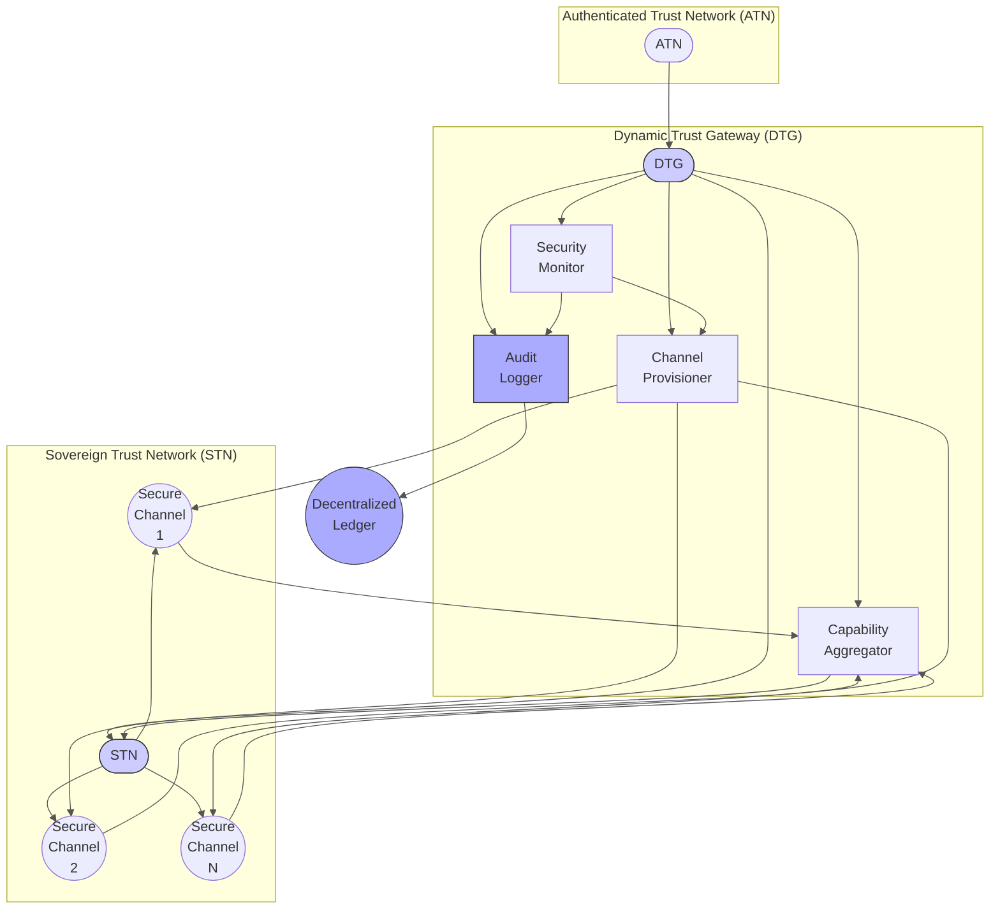


### Description for Diagram 4: Dynamic Trust Gateway (DTG) Architecture
This diagram details the architecture of the Dynamic Trust Gateway (DTG) (P28), a critical component of SecureSphere responsible for mediating communication between the Authenticated Trust Network (ATN) (P3) and the Sovereign Trust Network (STN) (P27).  The DTG's design emphasizes dynamic adaptability, multi-layered security, and decentralized governance to ensure secure and controlled data flow between these distinct trust domains.  The design incorporates several novel features to improve resilience and transparency over traditional gateway architectures.

**I. Authenticated Trust Network (ATN):**

The ATN represents the SecureSphere's internal network with authenticated communication (P3).  It provides secure pathways for communication between authorized entities within the SecureSphere environment, but with a lower security posture than the STN.  Each communication path within the ATN leverages a dedicated firewall instance, preventing cross-channel interference.

**II. Dynamic Trust Gateway (DTG):**

The DTG sits at the interface between the ATN and STN, providing dynamic and secure communication mediation. The DTG's architecture consists of the following key modules:

* **Channel Provisioner:** This module dynamically provisions secure communication channels (P3, P28) between the ATN and STN based on real-time factors. These factors include trust levels determined by the DTMS (P4), resource availability (P10), and prevailing security policies (P13, P15). Each channel uses a unique set of capabilities (P25) to define allowed communication parameters. The dynamic selection of paths uses techniques such as multi-path capability aggregation (P28) and path selection based on availability, performance, and trust.

* **Capability Aggregator:** This module consolidates capabilities (P25, P26) from multiple communication paths, allowing flexible access control and providing resilience against path failures. It resolves any capability conflicts to provide a unified access policy to the STN.

* **Security Monitor:** This module continuously monitors communication for security threats and anomalies. It employs deep packet inspection (DPI - P28) to enforce security policies, detect malicious traffic, and prevent unauthorized access.  The Security Monitor directly integrates with the DTMS (P4) for trust-based decisions. It also incorporates mechanisms for detecting timing side-channel attacks (P7).

* **Audit Logger:** This module records all significant communication events, including channel provisioning, capability assignments, security assessments, and policy updates.  These logs are sent to the Decentralized Ledger (DLT) (P13, P15) for permanent, tamper-evident storage and are correlated with physical microstructures (P14,P17) via the Multi-Dimensional Audit Trail System (MDATS) (P17).

**III. Sovereign Trust Network (STN):**

The STN (P27) represents the high-security network, designed for sensitive data and cryptographic keys.  It uses dedicated secure channels to maintain its isolation and prevent data leakage. This is enhanced by its isolated data plane and minimal control plane coupling, preventing common attack vectors.

**Relationships and Interactions:**

The diagram illustrates the data flow and control mechanisms within the DTG:

* The ATN initiates communication requests that are processed by the DTG.
* The Channel Provisioner establishes the communication channels based on real-time analysis, incorporating multi-path aggregation and capabilities (P2, P25, P26).
* The Capability Aggregator consolidates the capabilities, ensuring consistent security and access control to the STN.
* The Security Monitor continuously performs DPI and anomaly detection.
* The Audit Logger maintains a tamper-proof audit trail of all DTG activities, logged to the DLT.
* The Security Monitor reports potential breaches or policy violations to the Audit Logger, which logs them to the DLT.
* The Security Monitor also provides feedback to the Channel Provisioner to dynamically adjust channel configurations in response to threats.

This architecture provides a highly secure and adaptable gateway solution for managing communication between networks with varying security requirements. The use of dynamic channel provisioning, multi-path aggregation, deep packet inspection, and comprehensive auditing creates a resilient system capable of responding to changing threat landscapes and maintaining data integrity and confidentiality.  Decentralized governance ensures transparency and accountability.

## Diagram 5: SecureSphere Detailed Overview
```mermaid
graph LR
    subgraph SecureSphere
        subgraph IES ["IES (P1)"]
            direction LR
            IESCore[Core] --> ChildIES1["Child IES"]
            IESCore --> ChildIES2["Child IES"]
            ChildIES1 <--> ChildIES2(("CE-PCFS (P26)"))
            ChildIES1 -.-.> HESE-DAR["HESE-DAR (P24)"]
            ChildIES2 -.-.> HESE-DAR
            ChildIES1 <--> ZKEE["ZKEE (P6)"]
            ChildIES2 <--> ZKEE
            ResMgr["Resource Mgr (P9, P10)"] <--> ChildIES1
            ResMgr <--> ChildIES2
            SecMon["Security Monitor (P7)"] --> ChildIES1
            SecMon --> ChildIES2
            style IES fill:#f9f,stroke:#333,stroke-width:2px
        end

        Hub[SecureSphere Hub] --> IES
        Hub --> DTMS["DTMS (P4)"]
        Hub --> AESDS["AESDS (P16)"]
        Hub --> DTG["DTG (P28)"]
        Hub -.-.> SIZCF["SIZCF (P22)"]
        Hub -.-.> SHVS["SHVS (P18)"]

        DTMS -.-.> IES
        DTMS -.-.> DTG
        DTMS -.-.> STN["STN (P27)"]
        DTMS <--> DZMS["DZMS (P4)"]

        AESDS --> DTG
        AESDS --> IES
        AESDS --> STN
        IAMA["IAMA (P16)"] --> STN

        DTG <--> STN
        DTG <--> ATN["ATN (P3)"]

        style Hub fill:#ccf,stroke:#333,stroke-width:2px
    end

    subgraph External Systems/Legacy
        Legacy[Legacy System] --> IAMA
        Ext1[External System/Zone] <--> SIZCF
        Ext2[External High-Trust] <--> STN
    end

    subgraph Supporting Technologies
        DLT["Decentralized Ledger (P13, P15)"] -.-.> Hub
        DLT -.-.> DTMS
        DLT -.-.> AESDS
        DLT -.-.> SIZCF
        MDATS["MDATS (P17)"] -.-.> Hub
        MDATS -.-.> IES
        MDATS -.-.> DTG
        MSM["MSM (P2)"] -.-.> IES
        MSM -.-.> DTG
        MSM -.-.> STN
        MultiChannel["Multi-Channel Network (P3)"] -.-.> ATN
        MultiChannel -.-.> DTG
        Quantum["Quantum-Resistant Comm (P5)"] -.-.> DTG
        Quantum -.-.> STN
        SecureUI["Secure UI Kernel (P11)"] -.-.> IES
        Chiplets["Chiplet Arch (P12)"] -.-.> IES
        Chiplets -.-.> HESE-DAR
        FedLearn["Federated Learning (P19)"] -.-.> IES
        SDE["Secure Data Enclaves (P20)"] -.-.> IES
        MFA["Adaptive MFA (P23)"] -.-.> Hub
        MFA -.-.> STN
        CapMgr["Capability Mgr (P25)"] -.-.> IES
        CapMgr -.-.> DTG

        style DLT fill:#ffc,stroke:#333,stroke-width:2px
    end

    linkStyle 0,1,2,3,4,5,6,7,8,9,10,11,12,13,14,15,16,17,18,19,20 stroke:#000,stroke-width:1.5px;
    linkStyle 21,22,23 stroke:#f00,stroke-width:1.5px;
```


### Description for Diagram 5: SecureSphere Detailed Overview

This patent describes SecureSphere, a novel system architecture for establishing and maintaining secure communication and collaboration amongst multiple isolated execution environments (IEEs) while integrating with legacy systems and external entities. SecureSphere employs a multi-layered, dynamically adaptable approach based on hardware-enforced isolation, decentralized trust management, and AI-driven security. This architecture incorporates several innovative features, including a modular Isolated Execution Stack (IES), a Dynamic Trust Management System (DTMS), an Automated Evolutionary Software Development System (AESDS), and a Sovereign Trust Network (STN), all interacting through a central SecureSphere Hub.

**1. System Architecture Overview:**

* SecureSphere comprises a hierarchical system architecture. At its core is a set of Modular Isolated Execution Stacks (IES, P1) operating in complete hardware isolation (CPU, memory, I/O, network). Each IES can be dynamically partitioned (P1) into smaller, isolated Child IES instances to handle workloads and security requirements, enabling fine-grained control over resource allocation and compartmentalization. Child IES instances communicate using the Capability-Enhanced PCFS (CE-PCFS, P26) protocol, which incorporates capabilities directly into packet hop fields for flexible, policy-driven access control and reduced dependency on centralized trust management. Secure Resource Borrowing (SRBM, P9) enables the sharing of idle resources among Child IES instances.

* A central SecureSphere Hub orchestrates and manages all components. This includes: IES lifecycle management (P1), resource allocation (P9, P10), software updates (P16), policy enforcement (P4), and inter-zone communication (P22). The Hub also houses the Capability Manager (P25), dynamically managing capabilities and access rights, and the Channel Manager (P3) controlling the Multi-Channel Network (P3). The Dynamic Trust Management System (DTMS, P4) manages trust relationships between IES instances and zones (P18), using dynamically generated Trust Root Configurations (TRCs) stored on a Decentralized Ledger (P13, P15). The Decentralized Ledger (DLT) additionally facilitates transparent and auditable governance (P13, P15), logging policy changes, security events, and other significant actions.

* The Automated Evolutionary Software Development System (AESDS, P16) uses an AI engine to automatically generate and refine software for all SecureSphere components, including proactive security updates and dynamic policy adaptations. This process is integrated with an Isomorphic Architecture Monitoring and Adaptation (IAMA, P16) module, which continuously monitors the connected legacy systems to predict and mitigate vulnerabilities.

* The Sovereign Trust Network (STN, P27) represents a highly secure and isolated data plane, crucial for handling sensitive information. Data transfer to and from the STN is mediated by the Dynamic Trust Gateway (DTG, P28). The DTG employs dynamic channel provisioning, multi-path capability aggregation (P28), Deep Packet Inspection (DPI), and data sanitization. It provides high assurance of data integrity and confidentiality in communication with the STN. The Authenticated Trust Network (ATN, P3) is connected to the DTG providing a secure pathway for authenticated communication.

* The Multi-Dimensional Audit Trail System (MDATS, P17) combines digital audit logs (P13, P15) with a 3D-printed microstructure audit trail (P14), providing comprehensive and tamper-evident auditing capabilities. The Security Monitoring System (MSM, P2) and the Secure Hyper-Virtualization System (SHVS, P18) further strengthen the system's security posture by providing continuous monitoring and enabling secure collaborative contexts between IES instances across zones, respectively. Zero-Knowledge Execution Environments (ZKEE, P6) allow computations on encrypted data.

**2. Key Innovative Features:**

* Modular Isolated Execution Stacks (IES, P1): Hardware-enforced isolation, dynamic partitioning, hierarchical zones with mini-TRCs, and secure resource borrowing (SRBM, P9) create isolated execution environments, dramatically minimizing the impact of any security compromise.

* Dynamic Trust Management System (DTMS, P4): Dynamically adapts trust levels based on real-time behavior and security posture, enforcing fine-grained access control and resource allocation.

* Automated Evolutionary Software Development System (AESDS, P16): AI-driven software evolution and proactive security patching reduces vulnerabilities and ensures continuous adaptation.

* Sovereign Trust Network (STN, P27): Provides a highly secure and isolated data plane for handling sensitive information, employing multi-level control system with key recovery capabilities.

* Dynamic Trust Gateway (DTG, P28): Dynamically manages secure communication between ATN and STN, employing multi-path capability aggregation for resilience and fine-grained access control.

* Multi-Dimensional Audit Trail System (MDATS, P17): Combines digital and physical audit trails for tamper-evident and comprehensive logging.

* Capability-Enhanced PCFS (CE-PCFS, P26): Enhances PCFS with fine-grained access control capabilities within hop fields, reducing dependency on centralized trust management and increasing efficiency.

## Diagram 6: Security Monitoring and Response
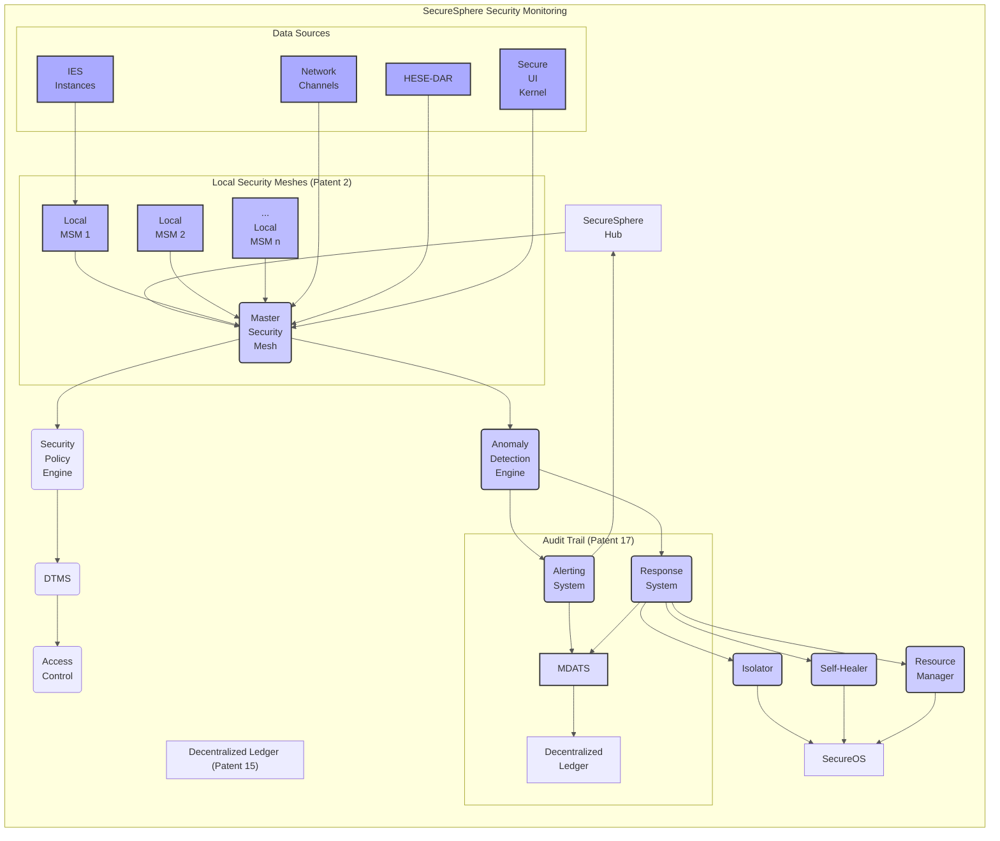


### Description for Diagram 6: Security Monitoring and Response

**Legend:**

* **SecureSphere Hub (A):** Central orchestration and management.
* **Master Security Mesh (MSM) (B):** Centralized security monitoring point receiving data from Local MSMs.
* **Security Policy Engine (C):** Defines and updates security policies based on risk profiles.
* **DTMS (D):** Dynamic Trust Management System, adjusting trust levels.
* **Access Control (E):** Enforces access policies based on trust levels.
* **Anomaly Detection Engine (F):**  Uses AI/ML to detect anomalies from various sources.
* **Alerting System (G):** Generates alerts for security incidents, reported to the Hub.
* **Response System (H):** Orchestrates responses to anomalies.
* **Isolator (I):** Isolates compromised components (hardware or software).
* **Self-Healer (J):** Attempts to restore system integrity automatically.
* **Resource Manager (K):** Adjusts resource allocation based on response requirements.
* **Secure OS:** Operating System facilitating isolation and remediation.
* **Local Security Meshes (Patent 2) (L, M, N):** Distributed monitoring points within each IES instance.
* **Data Sources (O, P, Q, R):**  Various sources providing data for the MSM and Anomaly Detection Engine.
  * IES Instances (O):  Individual isolated execution environments.
  * Network Channels (P): Communication paths monitored for malicious activity.
  * HESE-DAR (Q): Hardware-enforced secure enclave for data at rest.
  * Secure UI Kernel (R):  User interface providing potential attack vectors.
* **MDATS (S):** Multi-Dimensional Audit Trail System, logging all events.
* **Decentralized Ledger (DLT):**  Stores audit trails and governance information.

**Description:**

This diagram illustrates the multi-layered security monitoring and response system within SecureSphere, highlighting its dynamic, adaptive, and decentralized nature.  The system is designed to detect and respond to a wide range of threats, from internal anomalies to external attacks, leveraging advanced techniques for real-time threat assessment and automated remediation.

**I. Distributed Security Monitoring:**

The system employs a hierarchical monitoring architecture:

* **Local Security Meshes (Patent 2):**  Each Isolated Execution Stack (IES - P1) incorporates a Local Security Mesh (LSM), continuously monitoring its internal processes and resource usage.  These LSMs utilize hardware-based mechanisms (P7, P8) for efficient and secure monitoring, minimizing performance overhead and reducing reliance on software-based monitoring susceptible to attacks. The LSMs report telemetry data to the Master Security Mesh.

* **Master Security Mesh (MSM) (B):** This centralized monitoring point aggregates data from all Local Security Meshes, providing a system-wide security overview. The MSM uses a distributed consensus mechanism (P13, P15) to ensure data integrity and prevent manipulation.  The MSM is also fed external threat intelligence data (P5) to enhance its context-awareness.

**II. Threat Assessment and Policy Enforcement:**

The MSM provides data to the Security Policy Engine (C), which defines security policies based on risk profiles and real-time context.  These policies incorporate trust levels from the Dynamic Trust Management System (DTMS - P4) and are dynamically updated based on threat intelligence, system status, and user interaction patterns.  The Security Policy Engine directly impacts the DTMS (D), influencing trust assessments which in turn govern access control. The DTMS provides real-time trust assessments for access control decisions.

**III. Anomaly Detection and Response:**

* **Anomaly Detection Engine (F):** This component, potentially leveraging AI/Machine Learning (P10, P16), analyzes data from the MSM and other data sources to detect anomalies and potential security threats. It uses statistical methods (P7), heuristic analysis (P7), machine learning models, and real-time threat intelligence (P5) to identify abnormal behaviors, including subtle side-channel attacks (P7).

* **Alerting System (G):** Upon detecting anomalies, the Anomaly Detection Engine triggers the Alerting System, which generates alerts to the SecureSphere Hub (A), allowing for human intervention if needed. Alerts are also logged in the MDATS.

* **Response System (H):**  This automated response system orchestrates remediation actions based on the severity of the anomaly and pre-defined policies. It interacts with three key modules:

  * **Isolator (I):** This module is responsible for isolating compromised components, preventing further spread of malicious activity.  This may involve disabling network interfaces (P3), revoking capabilities (P2, P25), or shutting down affected IES instances (P1).

  * **Self-Healer (J):** This module attempts to automatically restore system integrity by resetting components, reallocating resources (P9, P10), or redeploying software (P16).  Self-healing actions are guided by zone-specific policies (P13) and DTMS trust levels.

  * **Resource Manager (K):** This module dynamically adjusts resource allocation (P9, P10) in response to the anomaly to support the isolation or self-healing process, ensuring system stability and preventing resource exhaustion.

**IV. Auditing and Logging:**

The MDATS (S) plays a critical role in maintaining a detailed, tamper-evident audit trail of all security events. MDATS collects data from the Alerting System, Response System, and other security modules. This multi-dimensional audit trail (P17) combines digital logs with physical 3D microstructures (P14), ensuring verifiability and providing comprehensive provenance tracking. All audit trail information is logged on the Decentralized Ledger (DLT - P13, P15) for permanent storage and auditable access.

**Data Sources:**

The system gathers data from diverse sources, including IES instances (O), Network Channels (P), HESE-DAR (Q), and the Secure UI Kernel (R), providing a holistic view of system security.

This design offers a robust, responsive, and adaptive security system, effectively mitigating a wide spectrum of threats.  The hierarchical monitoring structure, decentralized governance, automated response system, and comprehensive auditing contribute to the overall security and reliability of the SecureSphere architecture.  The system's capacity for dynamic adaptation is crucial for responding to the ever-evolving threat landscape.

## Diagram 7: Key Management and Recovery
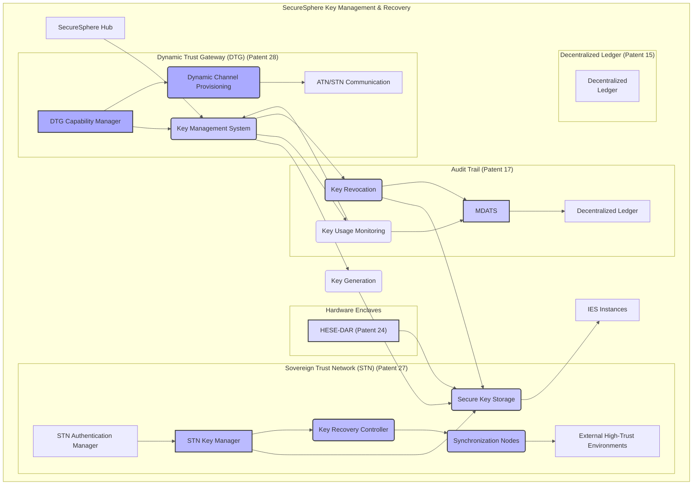


### Description for Diagram 7: Key Management and Recovery

**Legend:**

* **SecureSphere Hub (A):**  Central orchestration and management of key management.
* **Key Management System (B):** Oversees key generation, storage, usage monitoring, and revocation.
* **Key Generation (C):**  Generates cryptographic keys (potentially leveraging Quantum-Resistant methods from Patent 5).
* **Secure Key Storage (D):**  Stores cryptographic keys securely (potentially using HESE-DAR).
* **IES Instances (E):** Isolated execution environments using the keys.
* **Key Usage Monitoring (F):** Tracks key usage for security and audit purposes.
* **Key Revocation (G):**  Revokes compromised keys.
* **STN Key Manager (H):** Manages keys specifically for the Sovereign Trust Network.
* **STN Authentication Manager (I):** Uses keys for authentication within the STN.
* **Key Recovery Controller (J):** Manages the key recovery process within the STN.
* **Synchronization Nodes (K):** Globally distributed nodes for key recovery synchronization.
* **External High-Trust Environments (L):** External systems involved in key recovery.
* **DTG Capability Manager (M):** Uses keys for dynamic channel provisioning in the DTG.
* **Dynamic Channel Provisioning (N):**  Establishes secure communication paths.
* **ATN/STN Communication (O):**  Communication between ATN and STN, using keys.
* **HESE-DAR (Patent 24) (P):** Hardware-enforced secure encrypted enclave for key storage.
* **MDATS (Q):** Multi-Dimensional Audit Trail System, logging key management events.
* **Decentralized Ledger (R):**  Stores key management and recovery audit trails.

**Description:**

This diagram details the architecture of SecureSphere's key management and recovery system, emphasizing its design for high security, resilience, and robust auditability. The system incorporates several novel features to address the challenges of managing cryptographic keys in a complex, distributed, and potentially hostile environment.

**I. Centralized Key Management:**

The **SecureSphere Hub (A)** orchestrates key management via the **Key Management System (B)**. This system is responsible for:

* **Key Generation (C):**  The generation of cryptographic keys, potentially leveraging quantum-resistant methods from Patent 5. Key generation incorporates robust randomness sources (P7) to prevent predictability.

* **Secure Key Storage (D):** Secure storage of cryptographic keys. This may involve multiple layers, including hardware-based secure elements and HESE-DAR enclaves (P24), depending on the sensitivity of the key.

* **Key Usage Monitoring (F):**  Continuous monitoring of key usage patterns to identify potential anomalies and unauthorized access.

* **Key Revocation (G):** Mechanisms for quickly and securely revoking compromised keys. This process updates access control lists across the system, blocking access to affected keys.

**II. Sovereign Trust Network (STN) Key Management (Patent 27):**

The STN (P27) maintains a dedicated key management subsystem, further enhancing security and resilience:

* **STN Key Manager (H):**  Manages cryptographic keys used within the STN, employing stricter access control policies and encryption (P5,P24).

* **STN Authentication Manager (I):**  Uses keys for secure authentication within the STN, incorporating multi-factor authentication (MFA - P23) and hardware-rooted trust.

* **Key Recovery Controller (J):**  Manages the process of key recovery in case of compromise or loss.  This module employs a hierarchical and distributed architecture.

* **Synchronization Nodes (K):** Globally distributed, trusted nodes responsible for maintaining key replicas and synchronizing key recovery operations.  This distributed approach prevents single points of failure.

* **External High-Trust Environments (L):**  External systems, carefully vetted and integrated via SecureSphere's robust communication channels, participate in the key recovery process, providing additional layers of security and redundancy.

**III. Dynamic Trust Gateway (DTG) Key Integration (Patent 28):**

The DTG (P28) leverages SecureSphere's key management system for secure communication between ATN and STN:

* **DTG Capability Manager (M):**  This module uses keys for dynamic channel provisioning (P28) within the DTG and to manage capabilities (P25) for access control between ATN and STN.

* **Dynamic Channel Provisioning (N):** The DTG’s dynamic channel provisioning relies on the key management system to authenticate communication paths and enforce access control policies.

**IV. Hardware Enclaves and Secure Storage:**

The HESE-DAR (P24) plays a critical role in providing high-assurance secure storage for keys, integrating with the Key Management System for secure key retrieval and storage.

**V. Auditing and Logging:**

The **Multi-Dimensional Audit Trail System (MDATS - P17)** meticulously logs all key management and recovery events.  This includes key generation, usage, revocation, and recovery attempts.  This detailed audit trail is stored on the **Decentralized Ledger (R - P13, P15)**, ensuring transparency and tamper-evidence.  The MDATS uses techniques (P14) to integrate physical tamper-evident audit trails (3D microstructures) alongside the digital audit trails for increased assurance.

This architecture provides a robust and secure solution for managing cryptographic keys in a highly secure environment.  The multi-layered approach, use of hardware security mechanisms (P24), and integration with SecureSphere's core security components contribute to high assurance and resilience. Decentralized governance and the comprehensive audit trail ensure transparency and accountability in all key operations. The key recovery system ensures high data availability in the face of various threats.

## Diagram 8: Zone Management and Inter-Zone Communication
```mermaid
graph TD
    subgraph "SecureSphere Zone Management & Inter-Zone Communication"
        A[SecureSphere Global Control Plane] --> B(Zone Creation & Management);
        B --> C(Zone Hierarchy);
        C --> D{Zones};
        B --> E(TRC Management);
        E --> C;
        E --> F[Decentralized Ledger];
        style B fill:#ccf,stroke:#333,stroke-width:2px
        style E fill:#ccf,stroke:#333,stroke-width:2px
        class B,E management

        subgraph Zones
            D --> G[SecureSphere Hub];
            G --> H(IES Clusters);
            G --> I(Local Security Mesh);
            H --> J[Secure Communication Agent];
            J --> K[Multi-Channel Network];
            K --> L[Other Zones];
            style G fill:#bbf,stroke:#333,stroke-width:2px
            style H fill:#bbf,stroke:#333,stroke-width:2px
            style J fill:#bbf,stroke:#333,stroke-width:2px
            style K fill:#bbf,stroke:#333,stroke-width:2px
            class G,H,J,K zone
        end

        subgraph "Inter-Zone Communication (Patent 22)"
            L --> M[SIZCF];
            M --> N[External Systems];
            style M fill:#aaf,stroke:#333,stroke-width:2px
            class M interzone
        end
        
        subgraph "Auditing & Governance (Patent 17)"
            E --> O[MDATS];
            O --> F;
            style O fill:#ddf,stroke:#333,stroke-width:2px
            class O audit
        end

    end

    linkStyle default stroke:#555,stroke-width:1px

    classDef management fill:#ccf,stroke:#333,stroke-width:2px
    classDef zone fill:#bbf,stroke:#333,stroke-width:2px
    classDef interzone fill:#aaf,stroke:#333,stroke-width:2px
    classDef audit fill:#ddf,stroke:#333,stroke-width:2px
```


### Description for Diagram 8: Zone Management and Inter-Zone Communication

**Legend:**

* **SecureSphere Global Control Plane (A):**  High-level management and orchestration of all SecureSphere zones.
* **Zone Creation & Management (B):**  Handles the creation, configuration, and deletion of zones.
* **Zone Hierarchy (C):**  Represents the hierarchical relationship between zones.
* **Zones (D):**  Individual SecureSphere deployments.
* **TRC Management (E):** Manages Trust Root Configurations (TRCs) for each zone, stored on the Decentralized Ledger.
* **Decentralized Ledger (F):** Stores TRCs, zone configurations, and audit logs.
* **SecureSphere Hub (G):**  Manages the IES clusters and other components within a zone.
* **IES Clusters (H):**  Groups of isolated execution environments within a zone.
* **Local Security Mesh (I):** Local security monitoring for each IES.
* **Secure Communication Agent (J):** Manages communication within and between zones.
* **Multi-Channel Network (K):** Secure communication channels between IES clusters.
* **Other Zones (L):**  Other SecureSphere zones.
* **SIZCF (M):** Secure Inter-Zone Collaboration Framework (Patent 22) for external communication.
* **External Systems (N):** External entities collaborating with SecureSphere zones.
* **MDATS (O):** Multi-Dimensional Audit Trail System, logging zone-related events.

**Description:**

This diagram illustrates SecureSphere's zone management and inter-zone communication framework (P22), a crucial aspect of its architecture that enables secure and controlled collaboration between multiple, independent security domains. This system combines a hierarchical zone structure with dynamic trust management and secure communication protocols to facilitate cooperation while maintaining strong isolation between zones.

**I. SecureSphere Global Control Plane:**

The **SecureSphere Global Control Plane (A)** acts as the central authority for managing the overall zone structure and configuration. This is not a single point of failure, instead its functions are implemented using replicated, distributed components secured with cryptographic mechanisms. It interacts with the system's zone creation and management processes.

**II. Zone Creation and Management (B):**

The **Zone Creation & Management (B)** module is responsible for creating and managing SecureSphere zones.  This module uses a dynamic policy language to define parameters such as security policies, resource allocation, and allowed inter-zone communication.  These policies incorporate trust levels (P4) and are persistent in the decentralized ledger (P13, P15).  The module interacts with the TRC Management module for trust definition and propagation.

**III. Zone Hierarchy (C):**

SecureSphere zones are organized into a flexible hierarchy (C) reflecting the organization's structure and security needs.  This allows for granular control over trust relationships and inter-zone communication. Trust and policy inheritance occur from parent to child zones, simplifying management and consistency.

**IV. Zones (D):**

Each zone (D) functions as an independent SecureSphere deployment, containing its own:

* **SecureSphere Hub (G):**  The zone's central orchestrator and management component.  The Hub's control plane interacts with the global control plane for zone configuration and policy updates.

* **IES Clusters (H):** A collection of IES instances (P1) running within the zone.

* **Local Security Mesh (I):** Monitors activities and security within each zone (P2).

* **Secure Communication Agent (J - P2, P3):**  Manages secure communication channels between IES instances within the zone and with other zones.  The agent dynamically chooses communication paths using multi-path selection (P3, P22).

* **Multi-Channel Network (K):** A network infrastructure (P3) providing physical channel segregation for secure inter-IES communication and interactions with external systems, using capability-aware forwarding (P2, P26).

**V. Inter-Zone Communication (Patent 22):**

Secure inter-zone communication is facilitated by the **Secure Inter-Zone Collaboration Framework (SIZCF) (M)**. The SIZCF utilizes secure communication channels (P3, P5) and privacy-preserving protocols (P20, P22) for secure data exchange.  Communication between zones is dynamically managed, guided by trust levels (P4), policies (P13, P15), and real-time threat assessments (P2). The SIZCF provides access to external systems while maintaining a robust security boundary.

**VI. Auditing and Governance (Patent 17):**

All zone management and inter-zone communication activities are logged on the **Decentralized Ledger (F)** (P13, P15) using the **Multi-Dimensional Audit Trail System (MDATS - O)** (P17). MDATS tracks all critical events, including zone creation/modification, TRC updates, trust relationships, and inter-zone data exchange. This data can be analyzed by the Governance AI component for identification of anomalies and proactive security enhancements.

This architecture enables secure and flexible collaboration across multiple SecureSphere zones, preserving the integrity and confidentiality of data while allowing for a managed expansion of the system.  The decentralized governance model enhances transparency, accountability, and resilience against attacks.  Dynamic adaptation based on trust and security assessments ensure continuous optimization of the system's security posture. The integration with the MDATS and decentralized ledger ensures a comprehensive and tamper-evident audit trail of all zone management and inter-zone communication activities.

## Diagram 9: Data Flow and Security Processes
```mermaid
graph LR
    subgraph SecureSphere Zone Internal Data Flow & Security
        A[SecureSphere Hub] --> B(IES<br>Clusters);
        B --> C(Applications);
        C --> D[Secure Data Enclaves];
        D --> E[Federated<br>Learning];
        B --> F(Local<br>Security<br>Meshes);
        F --> G(Master<br>Security<br>Mesh);
        G --> H(Anomaly<br>Detection);
        H --> I(Response<br>System);
        I --> B;
        G --> A;
        style A fill:#ccf,stroke:#333,stroke-width:2px
        style G fill:#ccf,stroke:#333,stroke-width:2px
        class A,G hub

        subgraph "Data Services"
            D --> J(Data<br>Input/Output);
            J --> K[Multi-Channel<br>Network];
            K --> L[Other<br>Zones<br>/<br>External<br>Systems];
            style D fill:#bbf,stroke:#333,stroke-width:2px
            style E fill:#bbf,stroke:#333,stroke-width:2px
            style J fill:#bbf,stroke:#333,stroke-width:2px
            style K fill:#bbf,stroke:#333,stroke-width:2px
            class D,E,J,K data
        end

        subgraph "SecureSphere Hub"
            A --> M(DTMS);
            M --> B;
            A --> N(AESDS);
            N --> B;
            A --> O(Policy<br>Engine);
            O --> G;
            style M fill:#aaf,stroke:#333,stroke-width:2px
            style N fill:#aaf,stroke:#333,stroke-width:2px
            style O fill:#aaf,stroke:#333,stroke-width:2px
            class M,N,O hubservices
        end

        subgraph "Decentralized Ledger"
            P[Decentralized<br>Ledger] -.-.> A;
            P -.-.> D;
            P -.-.> E;
            P -.-.> G;
            style P fill:#ddf,stroke:#333,stroke-width:2px
            class P ledger
        end

    end

    linkStyle default stroke:#555,stroke-width:1px

    classDef hub fill:#ccf,stroke:#333,stroke-width:2px
    classDef data fill:#bbf,stroke:#333,stroke-width:2px
    classDef hubservices fill:#aaf,stroke:#333,stroke-width:2px
    classDef ledger fill:#ddf,stroke:#333,stroke-width:2px
```


### Description for Diagram 9: Data Flow and Security Processes

**Legend:**

* **SecureSphere Hub (A):** Central management and coordination within the zone.
* **IES Clusters (B):** Isolated execution environments running applications.
* **Applications (C):** User-level programs running within IES instances.
* **Secure Data Enclaves (D):** Secure, isolated environments for sensitive data processing.
* **Federated Learning (E):** Collaborative machine learning across IES instances.
* **Local Security Meshes (F):** Monitor activity within each IES.
* **Master Security Mesh (MSM) (G):**  Aggregates security data from Local MSMs.
* **Anomaly Detection (H):**  Detects anomalies based on MSM data.
* **Response System (I):** Orchestrates responses to detected anomalies.
* **Data Input/Output (J):** Secure data transfer within and outside the zone.
* **Multi-Channel Network (K):** Secure communication channels.
* **Other Zones / External Systems (L):**  Entities outside the current zone.
* **DTMS (M):** Dynamic Trust Management System.
* **AESDS (N):** Automated Evolutionary Software Development System.
* **Policy Engine (O):** Defines and enforces security policies.
* **Decentralized Ledger (P):**  Stores audit trails and zone configuration data.

**Description:**

This diagram provides an in-depth view of the internal data flow and security processes within a single SecureSphere zone.  It illustrates how data is securely processed, transferred, and monitored within the zone, emphasizing the interactions between the Hub, IES clusters, security modules, data services, and the Decentralized Ledger.  The layered and integrated security architecture demonstrates SecureSphere's ability to maintain robust data protection and system integrity.

**I. SecureSphere Hub (A):**

The SecureSphere Hub acts as the central orchestrator and management point within the zone. It coordinates activities of the IES clusters, manages security policies, and oversees communication with other zones and external systems.  The Hub incorporates essential security modules and services:

* **DTMS (M):** The Dynamic Trust Management System (P4) establishes and manages trust relationships between IES instances and across zones, dynamically adjusting trust levels based on real-time monitoring data, security assessments (P7), and policy updates (P4).  The DTMS influences resource allocation, capability management, and inter-component communication.

* **AESDS (N):** The Automated Evolutionary Software Development System (P16) continuously monitors, updates, and improves SecureSphere’s software.  It leverages a knowledge base, performance metrics, and threat intelligence to generate secure code, ensuring the system can adapt to evolving threats.  Secure zoned deployment (P3) and TRC-based verification (P1) ensure integrity and authenticity of software updates.

* **Policy Engine (O):** Defines and enforces security policies throughout the zone, controlling access to data, resources, and services.  The Policy Engine interacts with all components, incorporating trust levels from the DTMS and policies from the Decentralized Ledger.

**II. Isolated Execution Stacks (IES) Clusters (B):**

IES Clusters provide secure and isolated execution environments for applications.  Each IES (P1) has dedicated hardware resources (CPU, memory, I/O, network), minimizing the impact of compromises.

* **Local Security Meshes (F):**  Each IES incorporates a Local Security Mesh (P2) to continuously monitor internal processes and resource usage.  These LSMs employ hardware-based mechanisms for efficient and tamper-proof monitoring, reporting real-time telemetry to the Master Security Mesh (P2).

* **Applications (C):**  User-level programs are executed within IES instances, isolated from other applications and the underlying operating system. This containment minimizes the blast radius of potential security breaches.

**III. Secure Data Services:**

SecureSphere zones host various data services within IES instances, including:

* **Secure Data Enclaves (D):**  These provide secure, isolated environments for processing sensitive data.  They leverage hardware-enforced isolation, unidirectional communication (P2), and dynamic trust management (P4) to protect data confidentiality and integrity.  Secure Data Enclaves support collaborative analysis (P20) and integration with federated learning.

* **Federated Learning (E):** This allows for collaborative machine learning across multiple IES instances without sharing raw data.  MPC-based aggregation (P19) protects sensitive training data.  Federated Learning benefits from SecureSphere's robust security and isolation mechanisms, ensuring the privacy and integrity of the learning process.

**IV. Data Flow and Communication:**

Data within the SecureSphere zone is transferred through secure channels managed by the Multi-Channel Network (K).  The MCN (P3) utilizes physically segregated channels with dedicated firewalls, preventing cross-channel interference and ensuring the isolation of data flows.  The MCN leverages capability-aware forwarding (P2, P26) for fine-grained access control and dynamic traffic management.  Quantum-resistant communication (P5) using techniques like QKD, DKM, and PQC further secure these channels against sophisticated attacks.

Data Services interact with the MCN for secure data transfer both within the zone and with other zones or external systems (L), ensuring that sensitive information is protected during transit.

**V. Security Monitoring and Response:**

* **Master Security Mesh (G):**  The MSM (P2) aggregates data from the Local Security Meshes, providing a holistic view of the zone's security posture.  It incorporates threat intelligence (P5) and system-wide metrics, feeding data to the Anomaly Detection engine.

* **Anomaly Detection (H):**  This module utilizes advanced techniques, including AI/ML algorithms (P10, P16), to analyze data from the MSM, identifying anomalies and potential threats.

* **Response System (I):** The Response System orchestrates automated responses to anomalies, including isolation (P7), self-healing (P7), and dynamic resource allocation (P9, P10).  Response actions are guided by security policies defined by the Policy Engine and trust levels from the DTMS.

**VI. Decentralized Ledger (P):**

The Decentralized Ledger (P13, P15) serves as a tamper-proof repository for audit trails, security policies, zone configuration, and other critical data.  Its distributed nature ensures high availability, integrity, and transparency. The Decentralized Ledger integrates with the MDATS (P17) to record events and activities from all SecureSphere components within the zone, including the Hub, IES clusters, data services, and the security monitoring system.

**Interactions and Integration:**

This diagram illustrates the flow of data and control information within the SecureSphere zone:

* **SecureSphere Hub (A):**  The Hub orchestrates all components within the zone, managing IES creation and termination, resource allocation, and security policies.

* **Data Services:** Secure Data Enclaves (D) and Federated Learning (E) interact with the Multi-Channel Network (K) for secure data input/output.  These services are managed and monitored by the SecureSphere Hub.

* **Security Monitoring and Response:**  The Security Monitoring system (Local MSMs (F) -> MSM (G) -> Anomaly Detection (H) -> Response System (I)) continuously monitors the zone, detecting and responding to anomalies in real time.  It provides feedback to the SecureSphere Hub, influencing policy decisions and resource allocation.

* **Decentralized Ledger (P):**  All activities are logged on the Decentralized Ledger, providing a comprehensive audit trail and ensuring transparency and accountability.  The DLT also stores security policies and zone configuration information.

This layered and integrated approach creates a robust and dynamic security architecture within the SecureSphere zone. The combination of hardware-enforced isolation (P1, P24), advanced threat detection (P7), automated response mechanisms (P7), and secure communication (P2, P3, P5, P26) ensures a high level of data protection, system integrity, and resilience against sophisticated threats.  Decentralized governance and the comprehensive audit trail provide transparency, accountability, and trust in the system's operation.

## Diagram 10: Bootstrapping and Attestation
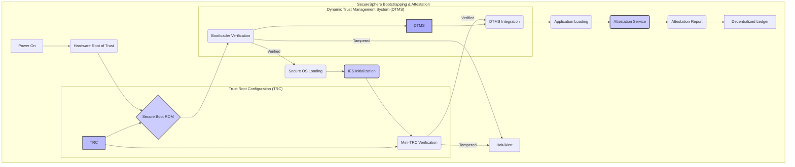


### Description for Diagram 10: Bootstrapping and Attestation

**Legend:**

* **Power On (A):**  The initial start of the SecureSphere system.
* **Hardware Root of Trust (B):** Immutable hardware providing the foundation of trust.
* **Secure Boot ROM (C):** Read-only memory containing the initial secure boot code.
* **Bootloader Verification (D):** Verifies the integrity of the bootloader using signatures from the TRC.
* **Secure OS Loading (E):** Loads the secure operating system if verification is successful.
* **Halt/Alert (F):**  Stops the boot process and generates an alert if tampering is detected.
* **IES Initialization (G):** Initializes the Isolated Execution Stacks.
* **Mini-TRC Verification (H):** Verifies the integrity of each IES's mini-TRC.
* **DTMS Integration (I):** Integrates the IES with the DTMS for trust management.
* **Application Loading (J):** Loads applications within the secure IES environment.
* **Attestation Service (K):** Generates a report of the system's security posture.
* **Attestation Report (L):** The generated report, providing verifiable evidence of integrity.
* **Decentralized Ledger (M):**  Stores the attestation report for auditability and transparency.
* **Trust Root Configuration (TRC) (N):** Contains the root keys and security policies.
* **Dynamic Trust Management System (DTMS) (O):** Provides trust levels for access control decisions.

**Description:**

This diagram provides a comprehensive illustration of the SecureSphere bootstrapping and attestation process, showcasing the system's multi-layered approach to building a chain of trust from the initial power-on to the execution of applications.  This process ensures the integrity and authenticity of all components, establishing a secure foundation for all subsequent operations within the SecureSphere environment.

**I. Secure Boot Sequence:**

1. **Power On (A):** The process begins with the initial power-on of a SecureSphere component.

2. **Hardware Root of Trust (B):**  The system's foundation of trust resides in a hardware-based root of trust. This could be a physically secure and tamper-resistant element like a Trusted Platform Module (TPM) or a secure processor with immutable boot code. The HRT provides the initial anchor for the chain of trust.

3. **Secure Boot ROM (C):** The immutable Secure Boot ROM contains the initial secure boot code, signed with the root key from the Trust Root Configuration (TRC - N).  This code is cryptographically verified upon execution, ensuring its integrity.

4. **Bootloader Verification (D):** The Secure Boot ROM executes the bootloader, whose integrity is verified against signatures stored in the TRC (N). This verification (D) prevents the execution of unauthorized or compromised bootloaders.  The DTMS (O) is also consulted during this step to check for revocation or other policy violations.

5. **Secure OS Loading (E):** If the bootloader verification is successful, the secure operating system (OS) is loaded.  The secure OS is designed to provide a trusted execution environment with isolation mechanisms and security features.

6. **Halt/Alert (F):**  If any tampering or integrity violations are detected during the boot process, the system halts immediately and generates an alert using SecureSphere’s secure communication channels (P2, P3) and the SCMP protocol (P7).  This proactive response prevents the system from booting into an untrusted state.

**II. IES Initialization and Integration:**

7. **IES Initialization (G):** Once the Secure OS is loaded, it initializes the Isolated Execution Stacks (IES - P1), creating secure and isolated environments for applications.

8. **Mini-TRC Verification (H):** Each IES has its own mini-TRC (P1), which defines local trust roots and policies specific to that instance.  The secure OS verifies the integrity of each mini-TRC before proceeding. This ensures that the trust policies within each IES are valid and have not been compromised.

9. **DTMS Integration (I):**  The IES instance then integrates with the Dynamic Trust Management System (DTMS - P4), sharing its mini-TRC and security posture.  The DTMS incorporates this information into its trust assessment process, assigning trust levels to the IES instance based on its security configuration and provenance.

**III. Application Loading and Attestation:**

10. **Application Loading (J):**  Applications are loaded within the secure IES environment.  The DTMS and Policy Engine (O) enforce access control policies, ensuring only authorized applications are executed.

11. **Attestation Service (K):**  The Attestation Service generates a comprehensive report of the system's security posture, including hardware and software integrity measurements, configuration details, and trust levels.  This report provides verifiable evidence that the system booted securely and is running in a trusted state.

12. **Attestation Report (L):**  The Attestation Report (L) is signed using cryptographic techniques (P5, P24) to ensure its authenticity and integrity.  It is then securely transmitted to the Decentralized Ledger (M) using SecureSphere’s communication channels (P3).

13. **Decentralized Ledger (M):**  The Decentralized Ledger (P13, P15) provides a tamper-proof and auditable record of the Attestation Report. This ensures transparency and accountability for the entire bootstrapping and attestation process.

**IV. Trust Root Configuration (TRC):**

The TRC (N) plays a crucial role throughout the process. It contains the root keys and security policies used for verifying the Secure Boot ROM, bootloader, and mini-TRCs.  The TRC itself is stored securely, potentially using HESE-DAR (P24) or a similar tamper-evident mechanism.

**V. Dynamic Trust Management System (DTMS):**

The DTMS (O) dynamically assesses the trust level of each component based on its provenance, security posture, and observed behavior. It integrates with the bootstrapping process by validating the bootloader and influencing the trust level assigned to IES instances. The DTMS uses distributed consensus (P13) and blockchain technology (P15) to ensure the integrity and consistency of trust assessments.

**VI. Interactions and Security Mechanisms:**

The diagram highlights the sequential steps involved in bootstrapping and attestation, demonstrating the system's commitment to establishing a chain of trust from the ground up.  The system utilizes a combination of hardware security (HRT, Secure Boot ROM), cryptographic verification (digital signatures, hashing), tamper detection (halt/alert), secure communication channels (P2, P3, P5, P26), and dynamic trust management to ensure the integrity and authenticity of the entire boot process and the resulting execution environment. The decentralized ledger provides a tamper-evident record for auditing and transparency. This multi-layered approach creates a robust and secure foundation for the SecureSphere system, mitigating a wide range of potential threats, including sophisticated attacks targeting the boot process.

## Diagrams 11a and 11b: Security Meshes

**Diagram 11a: Overview**
```mermaid
graph
        SecureSphere:::bkg
        DataResources:::block
        SecureSphereHub:::block
        IESClusterx:::block
        DataResources:::block
        NetworkCommunication:::block
        SovereignTrustNetwork:::block
        SecurityMonitoring:::block
        Audit:::block
        MediaHandling:::bkg_strong
        subgraph SecureSphere["SecureSphere&nbsp;Instance"]

        subgraph Audit["&nbsp;"]
            DLT["Decentralized<br>Ledger<br>(P13, P15)"]:::audit
            MDATS["MDATS<br>(P17)"]:::audit --> DLT
            Microstructure@{shape: flag, label: "3D<br>Microstructure<br>Audit<br>(P14, P17)" } --> MDATS
            Microstructure:::medium_level
            DLT --> Hub2Hub(("Hub")):::high_level
        end

        subgraph DataResources["Data&nbsp;&amp;&nbsp;Resources"]
            HESE_DAR --> SecureStorage
            QEAMS["QEAMS<br>(P34a)"]:::low_level -.--> HESE_DAR
            SAMS["SAMS<br>(P34b)"]:::low_level -.--> HESE_DAR
            PRSAMS["PR-SAMS<br>(P34c)"]:::low_level -.--> HESE_DAR
        end

        subgraph SecureSphereHub["Hub"]
            Hub(("Hub")):::high_level
            Hub --> AESDS["AESDS<br>(P16)<br>IAMA<br>(P16)"]:::medium_level
            Hub --> DTMS((("&nbsp;&nbsp;&nbsp;&nbsp;&nbsp;&nbsp;<br>Dynamic<br>Trust<br>&nbsp;&nbsp;&nbsp;&nbsp;(DTMS)&nbsp;&nbsp;&nbsp;&nbsp;<Br>&nbsp;&nbsp;"))):::medium_level
            Hub --> ChannelMgr["Channel<br>Mgr<br>(P3)"]:::medium_level
            Hub --> CapMgr["Capability<br>Mgr<br>(P25)"]:::medium_level
            Hub --> PolicyEngine["Policy<br>Engine"]:::medium_level
            Hub --> ResourceMgr["Resource<br>Mgr<br>(P9,<br>P10)"]:::medium_level
            Hub --> DTG["DTG<br>(P28)"]:::medium_level
            Hub --> SIZCF["SIZCF<br>(P22)"]:::medium_level
            Hub --> UIIntegration["UI<br>Integration"]:::medium_level
            Hub --> MediaHandling["Media<br>Handling<br>(P30,<br>P31,<br>P32)"]
            Hub --> SecureBoot["Secure Boot (P1, P13, P33)"]:::low_level
            Hub --> AnomalyDetector["Anomaly<br>Detector<br>(P7)"]:::low_level
            Hub --> GovernanceAI["Governance<br>AI<br>(P15)"]:::medium_level
        end

        subgraph IESClusterx["IES&nbsp;Cluster&nbsp;(P1)"]
            IESCluster[["IES<br>Cluster<br>(P1)"]]:::cluster_level
            %% IES1["IES<br>1"]:::medium_level -- > IESCluster
            %% IES2["IES<br>2"]:::medium_level -- > IESCluster
            %% IESn["IES<br>n"]:::medium_level -- > IESCluster
            IESInstances[["IES&nbsp;Instances<br>1..n"]] --> IESCluster
            ZKEEInstances["ZKEE<br>Instances<br>(P6)"] --> IESCluster
            SecureUI["Secure UI Kernel (P11)"]:::ui --> IESCluster
            IESCluster --> SecureChannel["Secure<br>Channels<br>(P3)"]:::network
            IESCluster --> ZKEE["ZKEE<br>(P6)"]:::medium_level
            IESCluster -.--> HESE_DAR(["HESE-DAR<br>(P24)"]):::data
            IESCluster --> LocalMSM["Local<br>MSM<br>(P2)"]:::low_level
            ResourceMgr --> IESCluster
            CapMgr --> IESCluster
        end

        subgraph NetworkCommunication["Network&nbsp;&amp;&nbsp;Communication"]
            SecureChannel --> Firewall["Firewall (P3)"]:::network
            Firewall --> ExternalSystems["External<br>Systems"]:::external
            subgraph SovereignTrustNetwork["STN"]
                STN["Soverign<br>Trust<br>Network<br>(P27)"] --> SecureStorage[("Secure<br>Storage")]:::data
            end
            PolicyEngine --> DTG
            DTG --> STN
            DTG --> ATN["ATN<br>(P3)"]:::medium_level
            AESDS --> STN
            AESDS --> DTG
            ChannelMgr --> SecureChannel
            ChannelMgr --> Firewall
            SIZCF --> ExternalSystems
            IAMA["IAMA<br>(P16)"]:::low_level --> STN 
        end

        subgraph SecurityMonitoring["&nbsp;"]
            LocalMSM --> MSM["Security<br>Monitoring<br>&amp;<br>Response<br>(MSM) (P2)"]:::low_level
            MSM --> DTMS
            AnomalyDetector --> DTMS
        end
        GovernanceAI --> DTMS
        DTMS --> STN
        DTMS --> DTG
        DTMS --> CapMgr
        DTMS --> PolicyEngine
        DTMS --> ResourceMgr
        PolicyEngine --> CapMgr
        UIIntegration --> SecureUI

        subgraph MediaHandling["Media"]
            MediaRouter{"Media<br>Router"}:::medium_level
            SpatiotemporalDigest{{"Spatiotemporal<br>Digest<br>(P30,<br>P31)"}}:::medium_level --> MediaRouter
            PrivacyBlurring{{"Privacy<br>Blurring<br>(P32)"}}:::medium_level --> MediaRouter
            %% MediaRouter -- > MediaHandling
            PadFeeder["Pad<br>Feeder"]:::medium_level --> QEOTP
            QEOTP["QE-OTP<br>(P29)"]:::medium_level --> SecureChannel
        end
    end

    classDef bkg fill:#fafaf7,stroke:#ccc,stroke-width:10px
    classDef block fill:#fafaf7,stroke:#988990,stroke-width:2px
    classDef bkg_strong fill:#def
    classDef high_level fill:#fda,stroke:#333,stroke-width:4px,font-size:1.25em
    classDef cluster_level fill:#b9d3fc,stroke:#333,stroke-width:4px,font-size:1.15em
    classDef medium_level fill:#b9d3fc,stroke:#333,stroke-width:2px
    classDef low_level fill:#aaf,stroke:#333,stroke-width:2px
    classDef data fill:#afa,stroke:#333,stroke-width:2px
    classDef ui fill:#ffa,stroke:#333,stroke-width:2px
    classDef audit fill:#ccf,stroke:#333,stroke-width:2px
    classDef network fill:#eec,stroke:#333,stroke-width:2px
    classDef external fill:#d8d8d8,stroke:#333,stroke-width:2px
    linkStyle default stroke:#039,stroke-width:7px
    linkStyle 32,38 stroke:#07F,stroke-width:11px
    linkStyle 42,43,44,45,46,47,48,49 stroke:#f0f,stroke-width:7px
    linkStyle 20,21,22,23,24,25,26,27,28 stroke:#000,stroke-width:7px
    linkStyle 7,8,9,10,11,12,13,14,15,16,17,18,19 stroke:#3d2,stroke-width:8px
```


**Diagram 11b: Expanded**
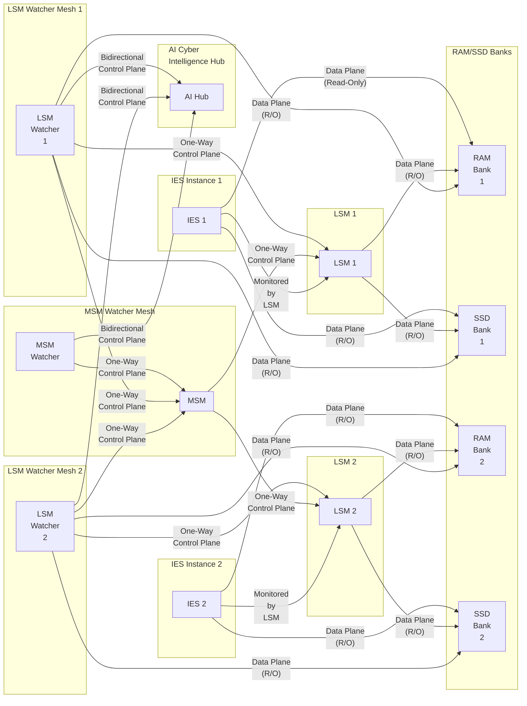


### Description for Diagrams 11a and 11b: Security Meshes

**I. Core Components and their Interactions:**

1. **RAM/SSD Banks:** These represent the system's physical memory and storage, the ultimate targets of many sophisticated attacks.

2. **IES (Isolated Execution Stacks):**  The foundation of SecureSphere, IES instances provide hardware-enforced isolation for applications and processes.  This compartmentalization limits the "blast radius" of any potential compromise.

3. **LSM (Local Security Mesh):**  Each IES has a dedicated LSM operating alongside it.  The LSM is responsible for monitoring the associated IES's activity, including its interactions with RAM/SSD.  Critically, this monitoring occurs through a *passive, read-only data plane*, ensuring no interference with the IES's operation and minimizing the attack surface exposed to the LSM itself.

4. **LSM Watcher Mesh:** This is the first layer of the "watcher" system.  Each LSM has a dedicated Watcher Mesh that monitors *both* the LSM and the associated IES. The LSM Watcher passively observes RAM/SSD access patterns of the IES *and* the LSM, looking for anomalies.  It communicates with the LSM via a one-way control plane to receive anomaly reports.  It has a bidirectional control plane connection with the AI Cyber Intelligence Hub, enabling it to send detailed reports and receive instructions.

5. **MSM (Master Security Mesh):** The MSM oversees all LSMs within a SecureSphere domain.  It receives anomaly reports from the LSM Watcher Meshes via a one-way control plane.  It also has its own dedicated Watcher Mesh for independent oversight.  The MSM distributes security policies and updates to the LSMs via a one-way control plane, preventing compromised LSMs from propagating malicious instructions upwards.

6. **MSM Watcher Mesh:** This Watcher mirrors the function of the LSM Watchers, providing independent monitoring of the MSM's RAM/SSD access. It reports to the AI Hub via a bidirectional control plane.

7. **Data Plane (Passive/Read-Only):**  This represents the innovative, out-of-band connection between the LSMs, their Watchers, and the RAM/SSD.  It employs an undisclosed mechanism to passively observe memory and storage access *without any direct interaction*, ensuring the integrity and availability of the monitored systems.  This passive monitoring could involve analyzing spatiotemporal metadata (temperature fluctuations, electromagnetic emissions, power consumption variations) associated with RAM/SSD access to infer activity and detect anomalies without direct data access.

8. **Control Plane:**  The control plane connections facilitate the communication of security policies, updates, and anomaly reports.  The *one-way* nature of the control plane from MSM to LSMs and from Watcher Meshes to MSM/LSMs is crucial for containing compromises.  The bidirectional control plane between the Watcher Meshes and the AI Hub allows for real-time feedback and adaptive security responses.

9. **AI Cyber Intelligence Hub:** The central intelligence unit of the system.  It receives reports from all Watcher Meshes, uses advanced analytics and AI to identify complex attack patterns, and triggers automated responses.  The bidirectional connection with the Watcher Meshes allows for dynamic policy adjustments and targeted investigations.

**II. SecureSphere's Enhanced Security Posture:**

The architecture elucidates SecureSphere's security posture in several ways:

* **Defense in Depth:** The layered approach of IES, LSMs, and Watcher Meshes creates multiple lines of defense, making it much harder for attackers to penetrate the system.
* **Compromise Resilience:** The one-way control plane and independent Watcher Meshes limit the impact of a compromise.  Even if an LSM or the MSM is compromised, the Watcher Meshes can still detect and report the anomaly, and the one-way control plane prevents the attacker from spreading malicious instructions.
* **Proactive Threat Detection:**  Passive RAM/SSD monitoring enables the detection of sophisticated attacks that might bypass traditional security measures.  By observing memory access patterns, the Watcher Meshes can identify suspicious activity, even if the attacker is using rootkit techniques or other advanced methods to hide their presence.
* **Real-Time Response:** The AI-driven analysis hub and tight feedback loops enable rapid response to identified threats. The system can automatically isolate compromised components, adjust security policies, or trigger other defensive actions.
* **Enhanced Forensics:** The comprehensive audit trails provided by the MDATS (Multi-Dimensional Audit Trail System), potentially enhanced by the physical 3D microstructures, allow for detailed post-incident analysis and investigation.  The inclusion of spatiotemporal data further enriches the forensic evidence.

**III. Integration with Existing SecureSphere Features:**

The security elements integrate seamlessly with SecureSphere as follows:

* **DTMS (Dynamic Trust Management System):**  The DTMS can leverage the anomaly reports from the Watcher Meshes to dynamically adjust trust levels and access control policies.
* **AESDS (Automated Evolutionary Software Development System):** The AESDS can use the information from the AI Hub to generate and deploy security patches and updates, addressing vulnerabilities discovered by the Watcher Meshes.
* **STN (Sovereign Trust Network):** The STN, with its heightened security measures, can benefit from the enhanced monitoring provided by the clarified architecture.
* **Multi-Channel Network:** The secure communication channels provided by the Multi-Channel Network are crucial for the reliable and confidential transmission of anomaly reports and control plane instructions.

### Current Data Flow (with Feedback Loop):

1. **Monitoring:** LSM monitors IES resource access (RAM/SSD) and reports anomalies to Watcher Mesh.
2. **Analysis & Reporting:** Watcher Mesh analyzes data, reports to AI Hub, and receives instructions.
3. **Decision Making:** AI Hub analyzes reports, makes decisions, and instructs Watcher Mesh.
4. **Enforcement:** Watcher Mesh instructs LSM to take action (e.g., isolation, process termination).  This instruction creates the feedback loop.

**Goal:**  Eliminate step 4, preventing the AI Hub from directly instructing the LSM.

**Proposals for Eliminating the Feedback Loop:**

**Proposal 1:  AI Hub to SecureSphere Hub Enforcement:**

* **Data Flow:** LSM -> Watcher Mesh -> AI Hub -> SecureSphere Hub -> Policy Engine -> LSM

* **Mechanism:**  The AI Hub, instead of instructing the Watcher Mesh, sends its analysis and recommended actions to the SecureSphere Hub. The Hub's Policy Engine evaluates these recommendations against existing policies and trust levels (from DTMS). If approved, the Hub issues the enforcement commands directly to the LSM.

* **Advantages:**  Removes the direct connection between the AI Hub and the LSM, reducing the attack surface.  Leverages existing SecureSphere Hub components (Policy Engine, DTMS) for decision-making and enforcement.

* **Disadvantages:** Introduces a potential bottleneck at the SecureSphere Hub.  Increases latency for response actions.

**Proposal 2:  Decentralized Enforcement with Consensus:**

* **Data Flow:** LSM -> Watcher Mesh -> AI Hub + other LSMs/Watcher Meshes -> Consensus Engine -> LSM

* **Mechanism:**  The AI Hub broadcasts its analysis and recommended actions to a distributed Consensus Engine (P13), along with other LSMs and Watcher Meshes.  The Consensus Engine reaches an agreement on the appropriate action.  If consensus is achieved, each LSM independently enforces the action.

* **Advantages:**  Highly decentralized and resilient.  No single point of failure.  A compromised AI Hub cannot unilaterally enforce actions.

* **Disadvantages:**  Requires complex consensus protocols.  Increased communication overhead.  Potential for disagreement and inaction.
```mermaid
graph
    subgraph "Proposal 2: Decentralized Enforcement with Consensus"
        subgraph "IES Instance 1"
            LSM1["LSM 1"] -- Passive Data Plane --> RAMSSD["RAM/SSD"]
            IES1["IES 1"] -- Data Plane --> RAMSSD
            Watcher1["Watcher 1"] -- Unidirectional Control Plane --> LSM1
            Watcher1 -- Passive Data Plane --> RAMSSD
        end
        subgraph "IES Instance 2"
            LSM2["LSM 2"] -- Passive Data Plane --> RAMSSD
            IES2["IES 2"] -- Data Plane --> RAMSSD
            Watcher2["Watcher 2"] -- Unidirectional Control Plane --> LSM2
            Watcher2 -- Passive Data Plane --> RAMSSD
        end

        AIHub["AI Hub"] -.-.> Consensus["Consensus Engine (P13)"]
        Watcher1 -.-.> Consensus
        Watcher2 -.-.> Consensus
        Consensus --> LSM1
        Consensus --> LSM2
        
        DTMS["DTMS (P4)"] -.-.> Consensus
        Consensus --> DLT["Decentralized Ledger (P13,P15)"]

        style Consensus fill:#f9f,stroke:#333,stroke-width:2px
    end

    classDef ies fill:#ccf,stroke:#333,stroke-width:1px
    classDef lsm fill:#aaf,stroke:#333,stroke-width:1px
    classDef watcher fill:#ddf,stroke:#333,stroke-width:1px
    classDef ai fill:#afa,stroke:#333,stroke-width:1px
    classDef data fill:#ddd,stroke:#333,stroke-width:1px
```


This diagram illustrates the decentralized enforcement mechanism. Notice the absence of a direct connection between the AI Hub and the LSMs. Instead:

LSMs and Watchers: Each IES instance has an LSM and a Watcher Mesh, functioning as described previously. They connect to shared RAM/SSD resources.

Consensus Engine: The central component is the Consensus Engine (P13). The AI Hub, along with all other Watcher Meshes, sends its analysis and recommended actions to the Consensus Engine. The DTMS (for trust context) also provides input to the Consensus Engine.

Decentralized Enforcement: The Consensus Engine, using a distributed consensus protocol, reaches an agreement on the appropriate action. The dotted lines from the Consensus Engine back to the LSMs represent the enforcement commands. Critically, these commands are issued only after consensus is reached. This decentralized approach enhances security because no single entity (even a compromised AI Hub) can dictate actions. All consensus decisions are logged to the DLT.

**Proposal 3:  Hybrid Approach (Staged Enforcement):**

* **Data Flow:** LSM -> Watcher Mesh -> AI Hub -> Watcher Mesh -> LSM (Limited Actions) & AI Hub -> SecureSphere Hub -> Policy Engine -> LSM (Critical Actions)

* **Mechanism:** The AI Hub can instruct the Watcher Mesh to take limited, pre-approved actions (e.g., increasing monitoring frequency, logging more data).  For critical actions (e.g., isolation, termination), the AI Hub must still go through the SecureSphere Hub's Policy Engine, as in Proposal 1.

* **Advantages:** Balances speed and security.  Allows for rapid response to less critical threats while maintaining tight control over high-impact actions.

* **Disadvantages:**  Requires careful definition of "limited" and "critical" actions.  Increased complexity in the AI Hub and Watcher Mesh.
```mermaid
graph LR
    subgraph "Proposal 3: Hybrid Approach (Staged Enforcement)"
        subgraph "IES Instance 1"
            LSM1["LSM 1"] -- Passive Data Plane --> RAMSSD["RAM/SSD"]
            IES1["IES 1"] -- Data Plane --> RAMSSD
            Watcher1["Watcher 1"] -- Unidirectional Control Plane --> LSM1
            Watcher1 -- Passive Data Plane --> RAMSSD
        end

        AIHub["AI Hub"] --> Watcher1 -- Limited Actions --> LSM1
        AIHub -.-.> SecureSphereHub["SecureSphere Hub"]
        SecureSphereHub -- Policy Decisions --> PolicyEngine["Policy Engine (P4)"]
        PolicyEngine -- Critical Actions --> LSM1
        DTMS["DTMS (P4)"] -.-.> PolicyEngine
        DTMS -.-.> AIHub


        style SecureSphereHub fill:#ccf,stroke:#333,stroke-width:2px
        style PolicyEngine fill:#ccf,stroke:#333,stroke-width:1px
    end

    classDef ies fill:#ccf,stroke:#333,stroke-width:1px
    classDef lsm fill:#aaf,stroke:#333,stroke-width:1px
    classDef watcher fill:#ddf,stroke:#333,stroke-width:1px
    classDef ai fill:#afa,stroke:#333,stroke-width:1px
    classDef data fill:#ddd,stroke:#333,stroke-width:1px
```


This diagram illustrates the hybrid approach.

Limited Actions: The AI Hub can directly instruct the Watcher Mesh, but only for a pre-defined set of "limited actions" that are considered low-risk. These actions might include increasing monitoring frequency, collecting more detailed logs, or performing specific, non-disruptive checks within the IES.

Critical Actions: For critical actions (isolation, termination), the AI Hub must communicate with the SecureSphere Hub. The Hub's Policy Engine evaluates the AI Hub's recommendation, considering existing policies and DTMS trust levels. If approved, the Hub issues the critical action command to the LSM.

DTMS Integration: The DTMS provides trust information both to the AI Hub (for its initial assessment) and the Policy Engine (for final authorization).

This hybrid approach balances the need for rapid response to less critical threats with the importance of strict control over high-impact actions.

Key Differences Visualized:

Proposal 2 features the Consensus Engine as the central decision-making component, with no direct AI Hub to LSM connection.

Proposal 3 shows the AI Hub capable of limited direct action through the Watcher Mesh, while critical actions still route through the SecureSphere Hub and Policy Engine.

**Comparison and Selection:**

| Feature    | Proposal 1         | Proposal 2          | Proposal 3         |
| :--------- | :----------------- | :------------------ | :----------------- |
| Security   | High               | Highest             | Medium-High        |
| Speed      | Low                | Lowest              | Medium             |
| Complexity | Medium             | High                | High               |
| Resilience | Medium             | Highest             | Medium-High        |

**Strongest Proposal:**  Proposal 2 (Decentralized Enforcement with Consensus) offers the highest security and resilience due to its decentralized nature and lack of a single point of failure.  While it introduces complexity and potential latency, these trade-offs are acceptable for critical security functions.  The consensus mechanism ensures that no single compromised component can dictate actions, significantly enhancing the overall security posture.

However, the complexity of implementing a robust and efficient distributed consensus mechanism should not be underestimated.  Careful consideration must be given to the specific consensus protocol, network communication overhead, and potential scenarios where consensus might not be reached.  A hybrid approach (Proposal 3) could be considered as a stepping stone towards full decentralization, allowing for faster response to less critical threats while the consensus mechanism is being developed and refined.

### Review of the Security Mesh hierarchy

**I. Core Principles Re-evaluation:**

* **Passive vs. Active Monitoring:** Is truly passive monitoring feasible? Could some degree of controlled, minimal interaction improve detection accuracy without sacrificing security? Maybe a combination approach - completely passive at the RAM/SSD level and minimally active in monitoring other system data (e.g., API calls)?

* **Unidirectional vs. Bidirectional:** The emphasis on unidirectional control planes is strong. Is this absolutely necessary for every level? Could selectively bidirectional connections (carefully controlled and audited) reduce overhead and improve responsiveness in non-critical situations? This would introduce some risk but possibly improve usability and detection rates.

* **Centralized vs. Decentralized AI:** Can the AI hub be completely decentralized, similar to the consensus engine? Distributed intelligence modules could analyze subsets of data independently, then only sending aggregated conclusions or high-priority alarms for broader investigation. It depends on how dependent the system's decision-making logic is on this AI component.

* **Single Point of Failure:** Each level (LSM, Watcher, MSM) appears designed with single points of failure, such as AI.  To eliminate it, we'd need robust, independent AI processes performing similar checks or an inherent redundancy mechanism within each module.  What happens when AI modules have divergent opinions, or different severity-ratings for the same security breach? Can this divergence be leveraged rather than seen as a problem?  It could even make it stronger; similar to using redundant/distributed key managers, we might utilize redundant, highly separated AI units.

**II. Data Plane Deep Dive - Reconsidering Passivity:**

* **Metadata Types:** Is spatiotemporal data alone sufficient? Consider network activity, CPU cycles used by processes, entropy in memory regions, etc. Are we missing crucial anomaly-indicative data points through only looking at what would impact memory?

* **Data Compression/Abstraction:**  Reduce the sheer volume of raw data through effective compression or abstraction techniques, without sacrificing crucial anomaly-indicative details.  Does formal verification handle compression or need raw, non-modified values to validate the codebase in the Security Mesh architecture? This will determine if we need a change.

* **Secure Aggregation:** How are the results from each LSM aggregated?  Are techniques that preserve privacy (e.g., homomorphic encryption, federated averaging, Differential Privacy) needed for this process? Can such a scheme also be formalized?

**III. Anomaly Detection Re-evaluation:**

* **Baseline Generation:**  How are baselines established and dynamically adjusted? Using historical data, and what methods? Will static threshold values work for our needs, or would more dynamic baselines improve accuracy? Formal verification may not easily verify thresholds in live dynamic adjustments and require us to design such components more carefully.

* **AI Model Selection:** What algorithms best balance speed, accuracy, and verifiability?  Will simple statistical methods suffice, or is it imperative that complex neural networks be involved in this security monitoring architecture? The complexity of this AI has implications for security as well as verifiability.

* **False Positives/Negatives:** Develop mechanisms for minimizing false positives and false negatives without drastically increasing computational load. How is a high confidence value established for anomalies identified? It may involve generating a 'risk factor' score; can it be incorporated into a formal verification test, using mathematical formulations?

**IV. Control Plane Optimization:**

* **Message Reduction:**  Optimize communications (both number of messages and size). Use compression, encryption, and efficient protocols.  A formal verification will need a precise and efficient model here, minimizing parameters to simplify the analysis while accurately describing behavior.  It is difficult for algorithms using variable states to formally verify and we may need some design changes to solve the problem.

* **Authentication and Authorization Mechanisms:**  Choose robust mechanisms (mTLS, hardware-based authentication, RBAC).

* **End-to-End Data Integrity:**  Employ hashing or digital signatures for every message to prevent tampering.

* **Time synchronization:** Is highly accurate, synchronized time between all components necessary for anomaly detection? How will we ensure time synchronization in case one of the system's time-based units is affected or attacked?

**V. Simpler Alternatives (trade-off considerations):**

* **Single Level of Monitoring:** Explore if combining LSM and Watcher Mesh is simpler and still effective.  A hybrid design, where Watchers actively trigger changes to LSM configuration after validation, but critically, never directly interacts with the RAM/SSD.

* **Limited Actions via Rules Engine:**  Instead of a sophisticated AI Hub, employ a rules-based engine for decision-making and enforcement, defining permitted actions based on anomalies.

**VI. Formal Verification Considerations (Throughout):**

* **Model Checking:**  Explore model checking to automatically verify the system's behavior.
* **Theorem Proving:** Use theorem proving for more complex properties.
* **Abstraction:** Use abstraction techniques to simplify the formal model.
* **Modular Verification:** Verify the system component by component and then verify integration.
* **Specification Language:** Choose the correct specification language that's best-suited for model checking and supports the complexity.

**I. Deep Dive into Passive Data Plane:**

* **Hybrid Data Plane:** Instead of purely passive observation, consider a minimally interactive data plane. The LSM could subtly alter access permissions to specific memory regions or temporarily pause processes flagged as anomalous by a dedicated security routine (e.g., increasing virtual-memory overhead or temporarily locking certain resources), for further monitoring. These controlled actions would be temporary, easily reversible, and logged, enhancing analysis without risking direct manipulation.

* **Data Sampling Strategies:** Instead of continuously monitoring all RAM/SSD activity, implement intelligent data sampling strategies (e.g., statistical sampling based on past behavior). It helps optimize the sheer volume of data processed, minimizing overhead while focusing on most important activity patterns. This requires careful consideration on how to minimize biases introduced and validate those aspects, especially for the AI modules, where accuracy must be maintained.

* **Formal Models for Passive Monitoring:** Developing precise formal models of the passive data plane is essential. Can it be represented as a finite state machine, or are other more abstract models appropriate? Will this model incorporate both its security features and accuracy? For each alternative, is this possible? Can we quantify the extent to which that formal specification reflects the system's behavior? It depends on how complex the system actually is, and whether we want an exact copy or an approximated model that's sufficiently detailed for the formal verifier.  Different verifiers use different models, such as those using Temporal Logic or those using automata-based representations. These choices greatly impact feasibility, complexity, and security.

**II. Enhanced Anomaly Detection:**

* **Contextual Anomaly Detection:**  Improve anomaly detection by incorporating context-aware rules.  For example, anomalies could be flagged based on the process ID, user identity, recent events, and location. The data plane could then use this information to further fine-tune its focus and prioritization and filter out noise, significantly improving efficiency and anomaly-detection.

* **Ensemble Methods for Anomaly Detection:** Consider using an ensemble of different anomaly detection algorithms (e.g., statistical methods, machine learning models).  Each individual algorithm can specialize in recognizing different threat types and potentially produce more accurate outcomes. We can then devise an overarching decision mechanism that uses a scoring system based on each algorithm's findings. However, this requires deeper analysis of accuracy, and formal models for these combinations will need to be established to confirm its veracity. It will need verification to prove correctness and resilience, increasing complexity.

* **Adaptive Thresholds:** Implement dynamically adjusted thresholds based on real-time system parameters (network activity, CPU usage) rather than static ones. This could improve accuracy in highly variable situations, especially during attacks. This will however increase the complexity for formal verifications. We need to find a way to create a suitable formal model representing these adaptive algorithms to address it.

**III. Streamlined Control Plane Communications:**

* **Asynchronous Communication:** Replace real-time communication with an asynchronous mechanism, such as message queues. This significantly reduces performance dependencies. This increases both robustness and the feasibility of formal verifications since these operations would become independent of their order of completion.

* **Message Compression and Encryption:** Use strong compression algorithms for data to reduce message size and improve bandwidth usage, in addition to end-to-end encryption (TLS 1.3 or similar). We would also need to address issues associated with compressing potentially sensitive data since we're handling data streams about security-related operations.

**IV. Enhanced AI Hub Architecture (Addressing Centralization):**

* **Federated Anomaly Detection:** The various Watchers can communicate locally or among neighbors. Instead of centralized AI in the AI Hub, these local AI modules make independent assessments and transmit *conclusions* (anomaly detected, action required) or prioritized threat-reports for system-wide responses.  This would require a distributed consensus module, ensuring that conclusions of multiple, possibly separated, local AI processes are accurate and reliable. Each Watcher sends its anomaly conclusions and supporting data for that assessment through an intermediary component before being reviewed, enhancing resilience in the architecture. However, formal verification would be significantly harder given the interactions and decision-making logics. This decentralized design introduces some complexity, though greatly enhancing reliability and making it far more suitable for verification tests since a large portion would be tested and independently confirmed to be correct. This will however lead to some unavoidable complications for designing the formal models needed.

* **AI Model Verification:** Can we create separate (smaller) formal verification steps for the AI modules before being incorporated into the main Security Mesh analysis process? It may require a highly specialized model checker and significant engineering effort; which, as the benefit to securing the system outweighs these costs, we should move towards doing.  The benefits are greater security in the AI modules that prevent it from being compromised or used maliciously and also reducing overall effort needed when attempting a large, integrated verification scheme.

**V.  Simplifying the Architecture:**

* **Combined LSM/Watcher:** Integrate the functions of the LSM and Watcher Mesh into a single component.  It might lead to a less layered, more concise system which will enable formal verification to be attempted far more easily. This has consequences on the Security Mesh's layered security and resilience. We must quantify these trade-offs when considering such changes.  Could a simplified model that adequately incorporates the security principles without replicating each layer reduce the overall burden, and potentially be formally verified?

**VI. Formal Verification Strategy:**

* **Incremental Verification:** Verify each component (LSM, Watcher Mesh, MSM, AI Hub) individually, then verify the integrations incrementally. This significantly simplifies formal verification.

* **Refinement:** Use a refinement approach, moving from high-level abstractions towards concrete implementation details.

* **Automated Tools:** Leverage existing formal verification tools and methodologies appropriate to your chosen specification language.

* **Property Specification:** Formally define the key security properties that need to be verified.

## Diagram 11c: Security Mesh Integration
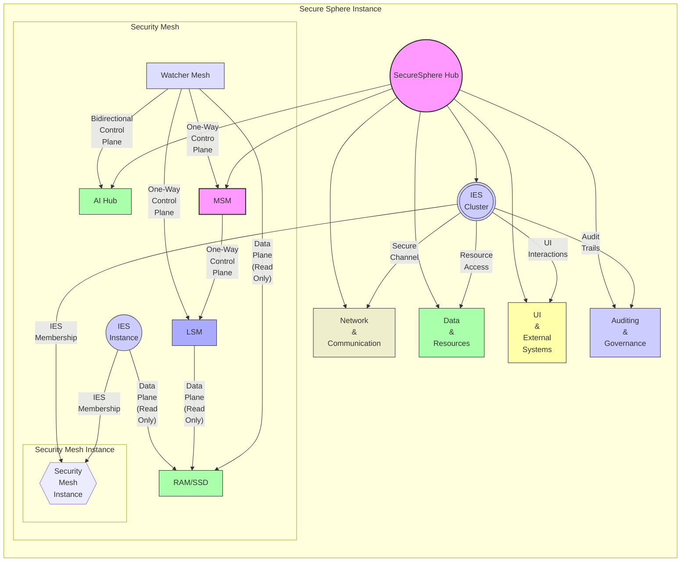


### Description for Diagram 11c: Security Mesh Integration

This diagram illustrates the integration of the Security Mesh within the broader SecureSphere architecture.  The Security Mesh provides a crucial layer of defense, offering comprehensive, real-time, and compromise-resilient monitoring of system activity. This description details the components, interactions, and security benefits of this integration.

**I. SecureSphere Hub:**

The SecureSphere Hub is the central orchestration and management point for the entire system. It facilitates communication and coordination between all other components, including the Security Mesh. The Hub's responsibilities include:

* **Policy Enforcement:** Defines and distributes security policies to other components, including the MSM (Master Security Mesh), which governs the Security Mesh.
* **Resource Allocation:** Manages system resources and allocates them to various components, including the IES instances monitored by the Security Mesh.
* **Software Updates:** Distributes software updates and security patches via the AESDS (Automated Evolutionary Software Development System).
* **Trust Management:** Oversees the DTMS (Dynamic Trust Management System), which plays a crucial role in managing trust levels for components within the Security Mesh.
* **Inter-Zone Communication:** Manages secure communication between different SecureSphere zones via the SIZCF (Secure Inter-Zone Collaboration Framework).
* **UI Integration:**  Provides secure communication and integration with the user interface.
* **Auditing and Governance:**  Manages the collection and storage of audit trails and governance information.

**II. Security Mesh:**

The Security Mesh is a hierarchical, out-of-band monitoring system designed for comprehensive and compromise-resilient security.

* **Security Mesh Instance:** This represents a single instance of the security mesh, which is deployed to monitor a specific set of resources (RAM/SSD). Multiple Security Mesh Instances can be deployed within a SecureSphere system for comprehensive coverage.  It's the core element and container for the mesh's internal workings.

  * **IES Instance (Isolated Execution Stack):**  The target of the monitoring.  Represents the applications and processes running within a hardware-isolated environment. The IES interacts with the RAM/SSD through standard data access channels.

  * **LSM (Local Security Mesh):** The LSM performs passive, out-of-band, read-only monitoring of the RAM/SSD, capturing spatiotemporal metadata related to access patterns without interfering with system operation.  It provides the raw monitoring data to the Watcher Mesh.

  * **Watcher Mesh:**  The Watcher Mesh receives monitoring data from the LSM and performs analysis to detect anomalous access patterns. It reports these anomalies to the AI Hub for further investigation and potential response actions.  The Watcher Mesh *also* passively monitors the LSM itself, ensuring its integrity and adding another layer of security (who watches the watchers).

  * **RAM/SSD:** These represent the physical memory and storage resources being monitored by the LSM and Watcher Mesh.  Crucially, access is *passive and read-only*, guaranteeing system integrity and preventing interference by the Security Mesh.

  * **AI Hub (AI Cyber Intelligence Hub):** Receives anomaly reports from the Watcher Mesh. It uses advanced analytics and AI/ML techniques to correlate events, identify complex attack patterns, and determine appropriate responses. The AI Hub communicates with the SecureSphere Hub to trigger actions such as isolating compromised IES instances, updating security policies, or initiating self-healing processes.  The bidirectional control plane ensures real-time feedback and adaptive security.

  * **MSM (Master Security Mesh):**  Oversees multiple LSMs and their associated Watcher Meshes.  It receives aggregated anomaly reports from the Watcher Meshes and distributes security policies and updates *unidirectionally* to the LSMs. This one-way control flow prevents a compromised LSM from controlling the MSM or other parts of the system, ensuring compromise resilience.

**III.  Integration with SecureSphere Components:**

* **IES Cluster:** The IES instances monitored by the Security Mesh are members of the larger IES Cluster, which represents the collection of all isolated execution environments within a SecureSphere instance. The connection labeled "IES Membership" highlights this relationship. The IES Cluster interacts with other SecureSphere components via several channels: secure channels for network communication, resource access for data and resources, UI interactions for user interface communication, and audit trails for logging and accountability.

* **Network & Communication:** This subsystem provides the secure communication channels used by the Security Mesh to communicate with the AI Hub and the MSM.

* **Data & Resources:** These represent the system resources (including RAM/SSD) accessed by the IES instances and monitored by the Security Mesh.

* **UI & External Systems:** These components interact with IES instances, and their activity is monitored by the Security Mesh as part of its comprehensive security analysis.

* **Auditing & Governance:** The Security Mesh provides valuable audit data that is integrated into the overall auditing and governance framework.

**Security Advantages of Security Mesh Integration:**

* **Defense in Depth:**  The Security Mesh adds another layer to SecureSphere's multi-layered security model.

* **Compromise Resilience:**  The one-way control plane and independent Watcher Meshes enhance the system's ability to withstand attacks. Even if an LSM is compromised, the Watcher Mesh can still report the anomaly, and the unidirectional control plane prevents the spread of malicious instructions.

* **Proactive Threat Detection:**  The passive, read-only RAM/SSD monitoring enables early detection of sophisticated, memory-based attacks.

* **Real-Time Response:**  The AI Hub and the bidirectional control plane facilitate real-time analysis and rapid response to detected threats.

* **Comprehensive Monitoring:**  The Security Mesh monitors both IES instances *and* the LSMs themselves, ensuring comprehensive coverage and preventing gaps in security monitoring.

## Diagram 12a: Configuration Management and Deployment
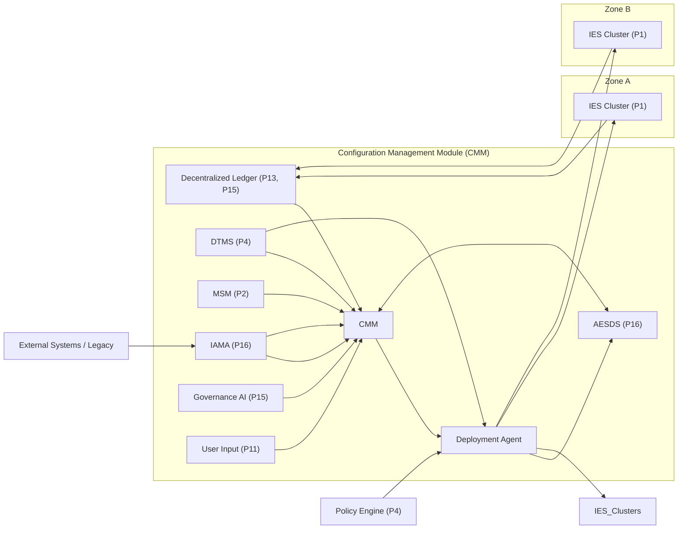


### Description for Diagram 12a: Configuration Management and Deployment

This diagram details the internal components and connections of the SecureSphere Configuration Management Module (CMM), highlighting its role in validating, generating, and deploying configurations while integrating with other key SecureSphere components.

**Components:**

1. **Decentralized Ledger (DLT) (P13, P15):**  The DLT serves as the source of truth for TRCs (Trust Root Configurations), policies, and the historical record of configurations.  It provides a tamper-proof and auditable repository for critical system information.

2. **TRC Validator (P1, P4):** This component retrieves TRCs from the DLT and validates their integrity and authenticity. It checks digital signatures and ensures internal consistency within the TRC structure.  It utilizes functionalities described in Patent 1 (IES) and Patent 4 (DTMS).

3. **Policy Input:** This represents the entry point for new or modified policies, which can originate from administrators, automated systems, or other SecureSphere components.

4. **Policy Validator (P4):** This component validates incoming policies against predefined rules, constraints, and schema definitions, ensuring that they adhere to the SecureSphere policy framework as described in Patent 4 (DTMS).

5. **Merge:** This function combines the validated TRCs and policies into a single, unified configuration candidate.

6. **Conflict Resolver (P13, P15):** This crucial component detects and resolves any conflicts that may arise between TRCs and policies.  It uses predefined conflict resolution rules, zone-specific preferences, or a distributed consensus protocol (P13) to determine the final configuration.  The resolution process and outcomes are logged on the DLT for transparency and accountability.

7. **Validated Config:** This represents the merged, validated, and conflict-free configuration, ready for further processing.

8. **Configuration Generator:** This component generates the final configuration artifacts based on the validated input, user input via the Secure UI (P11), and configuration templates.  It can leverage AESDS (P16) for automated code generation or optimization based on the configuration.

9. **User Input (P11):** This element represents the interface for authorized users to provide input, modify configurations, or trigger specific actions within the CMM through the Secure UI Kernel, providing a secure and controlled way for human interaction.

10. **Configuration Templates:** These are predefined templates for common configuration scenarios, simplifying the configuration process and ensuring consistency across deployments.

11. **Version Control:** This module manages different versions of configurations, enabling rollback to previous states if necessary. This feature provides resilience and allows for safe experimentation with configuration changes.

12. **Configuration Store (P24):** This secure storage, likely implemented within HESE-DAR (P24), stores the finalized configurations, protecting them from unauthorized access or tampering.

13. **Deployment Agent (DA):** This agent retrieves configurations from the Configuration Store and initiates the deployment process, distributing the configurations to the appropriate SecureSphere components (IES instances, network devices, etc.).

14. **Policy Simulator:** This component allows administrators to simulate the impact of policy changes before they are deployed, providing a safe environment to test and validate configurations.

15. **Impact Analysis (AI - P10, P16):** Using AI and potentially machine learning techniques (P10 and P16), this component analyzes the simulated policy changes and provides insights into their potential impact on system performance, security, and resource utilization.  It receives input from the MSM for real-time security context.

16. **Simulation Results (P11):** The results of the simulation and impact analysis are presented to the user via the Secure UI Kernel, allowing for informed decision-making about configuration changes.

17. **DTMS (P4):** The Dynamic Trust Management System provides real-time trust level information, which influences policy validation, conflict resolution, and deployment decisions within the CMM.

18. **MSM (P2):** The Master Security Mesh provides security telemetry and threat intelligence, which can inform configuration choices, particularly within the Impact Analysis component.

19. **AESDS (P16):** The Automated Evolutionary Software Development System interacts bidirectionally with the Configuration Generator.  AESDS can provide input for generating optimized code or configurations, and the CMM can trigger AESDS to generate or update software components based on the new configuration.

20. **IAMA (P16):** The Isomorphic Architecture Monitoring and Adaptation module provides information about connected legacy systems, allowing the Configuration Generator to adapt configurations for compatibility and secure integration.

21. **Governance AI (P15):** The Governance AI provides high-level policy recommendations and analysis, influencing both the Conflict Resolver and the Impact Analysis component, ensuring that configurations align with overall governance objectives.

## Diagram 12b: Configuration Management Module (CMM) Internals
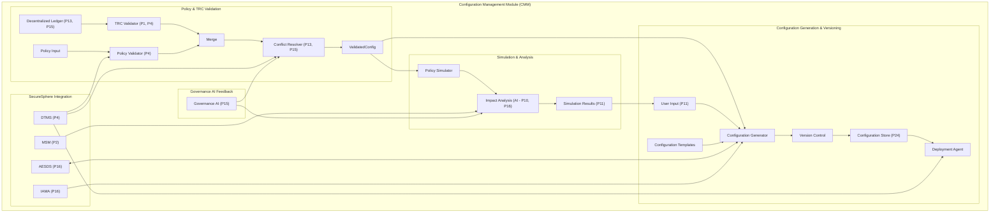


### Description for Diagram 12b: Configuration Management Module (CMM) Internals

The diagram details the architecture and operational flow of the CMM within the SecureSphere secure computing environment.  The CMM is responsible for the secure and efficient management of configurations, encompassing validation, generation, simulation, and deployment.  It achieves this through a combination of policy and TRC validation, configuration generation and versioning, impact simulation and analysis, and deep integration with other SecureSphere security modules.

**Component Summary:**

* **Decentralized Ledger (DLT) (P13, P15):** Stores TRCs, policies, and configuration history, providing a tamper-proof audit trail.
* **TRC Validator (P1, P4):** Verifies the integrity and authenticity of Trust Root Configurations.
* **Policy Input:**  Entry point for new/modified policies.
* **Policy Validator (P4):** Ensures policies conform to SecureSphere's framework.
* **Merge:** Combines validated TRCs and policies.
* **Conflict Resolver (P13, P15):** Detects and resolves conflicts between TRCs and policies.
* **Validated Config:** The resultant conflict-free configuration.
* **Configuration Generator:** Creates configuration artifacts based on validated inputs, user input, and templates, optionally using AESDS (P16) for optimization.
* **User Input (P11):** Secure interface for authorized user interaction with the CMM.
* **Configuration Templates:** Predefined configurations for common scenarios.
* **Version Control:** Manages configuration versions and enables rollback.
* **Configuration Store (P24):** Securely stores configurations within HESE-DAR.
* **Deployment Agent (DA):** Deploys configurations to SecureSphere components.
* **Policy Simulator:**  Simulates the effects of policy changes.
* **Impact Analysis (AI - P10, P16):** Uses AI to analyze the impact of policy simulations.
* **Simulation Results (P11):** Presents simulation outcomes to the user.
* **DTMS (P4):** Provides trust information and influences configuration processes.
* **MSM (P2):** Provides security telemetry and threat intelligence.
* **AESDS (P16):** Automates software generation/deployment, integrates with configuration generation.
* **IAMA (P16):**  Facilitates legacy system integration by informing the Configuration Generator about legacy system specifics, ensuring compatibility and secure integration.
* **Governance AI (P15):** Offers high-level policy guidance for conflict resolution and impact analysis.

**Detailed Process and SecureSphere Integration**

The CMM process begins with the retrieval of TRCs and the input of new policies. The TRC Validator (leveraging Patent 1 and 4) ensures the integrity of retrieved TRCs, while the Policy Validator (P4) checks the validity of incoming policies.  These validated components are merged, and any conflicts are resolved by the Conflict Resolver, which consults the DTMS (P4) for trust information and the Governance AI (P15) for higher-level policy directives. The Conflict Resolver uses either pre-defined rules, consensus mechanisms, or a combination of approaches depending on the nature of the conflict and the specific policies involved.  Resolution details are logged on the DLT for transparency.

The resulting Validated Config is then used by the Configuration Generator to create the necessary configuration artifacts. This process may involve user input (P11) and leverage predefined Configuration Templates.  Critically, the Configuration Generator integrates with AESDS (P16) allowing for automated generation of optimized code and configuration files, further enhancing security by incorporating best practices and mitigating potential vulnerabilities.  The IAMA module (P16) feeds information about legacy systems to the Configuration Generator, enabling it to create configurations that are both secure and backward-compatible.

Before deployment, the validated configuration can be fed into the Policy Simulator, which, combined with the Impact Analysis module (using AI – P10, P16), provides insights into the potential effects of the changes. This process integrates with the MSM (P2) for real-time security context and the Governance AI (P15) for alignment with strategic objectives. Simulation Results are presented to the user via the Secure UI (P11) for review and approval. This feedback loop allows administrators to fine-tune configurations before they are deployed, minimizing risks and optimizing for desired outcomes.

The finalized configuration is then stored in the Configuration Store, secured by HESE-DAR (P24). The Deployment Agent (DA) retrieves the configuration from this secure store and orchestrates its deployment to target components (IES clusters, network elements, etc.), leveraging DTMS (P4) for authorization and secure communication channels. The entire process, including configuration changes, deployments, simulations, and resolutions, is logged on the Decentralized Ledger (DLT - P13, P15), creating a comprehensive audit trail secured by MDATS (P17).

**Security Considerations:**

This architecture tightly integrates with SecureSphere's security infrastructure:

* **Hardware-Rooted Trust:**  The involvement of HESE-DAR (P24) in securing the Configuration Store ensures that the configurations themselves are protected from tampering.
* **Decentralized Governance:**  The use of the DLT, consensus mechanisms (P13), and Governance AI (P15) fosters transparency and accountability in the configuration management process.
* **Dynamic Trust Management:** DTMS (P4) ensures that configuration deployments and access are aligned with real-time trust levels, dynamically adapting to changing security conditions.
* **Automated Security:** AESDS (P16) enhances security by automating code generation and incorporating best practices and security hardening into configurations.
* **Isolation and Compartmentalization:** Configurations are deployed to isolated IES instances (P1), limiting the blast radius of any potential compromise resulting from a misconfiguration.
* **Defense in Depth:** The integration with MSM (P2) provides another layer of security by feeding real-time threat intelligence into the configuration process and alerting on anomalous activities.

## Diagram 13: Error Handling and Logging
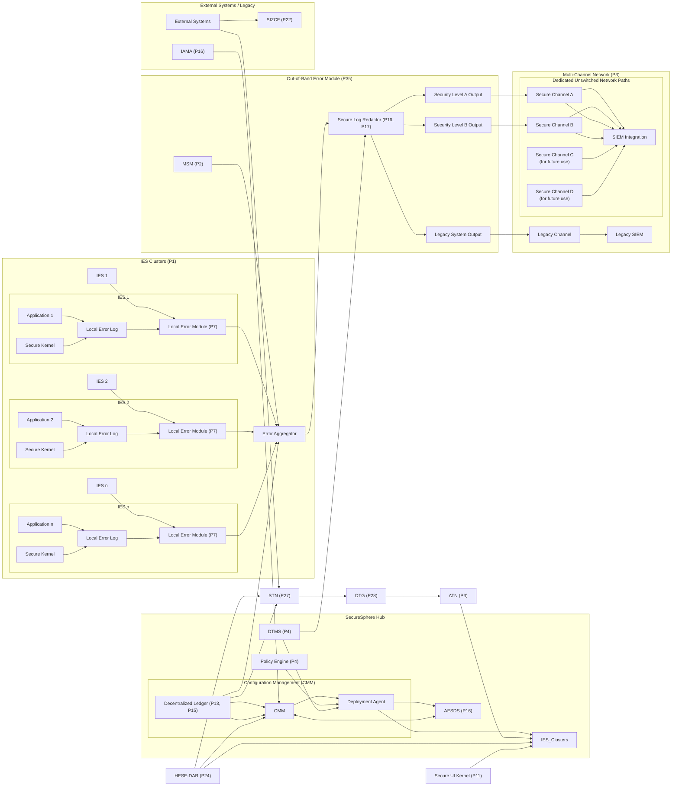


### Description for Diagram 13: Error Handling and Logging

1. **Decentralized Log Generation:** Within each IES instance (P1), applications (App1, App2, Appn) and the Secure Kernel generate error logs. These are sent to a Local Error Module (P7) within each IES. This decentralized approach ensures that even if one IES is compromised, logging continues in others. Each Local Error Module performs initial filtering and formatting of logs.  The Secure Kernel within each IES instance has direct access to the Local Error Log, enabling it to record critical kernel-level errors and system events directly.

2. **Error Aggregation:**  The local error modules (Local_Err1, Local_Err2, Local_Errn) send their pre-processed logs to a central Error Aggregator (ErrAgg) within the Out-of-Band Error Module (P35). The MSM (P2) also feeds system-wide security events and anomalies to the aggregator.

3. **Secure Log Redaction:** The Error Aggregator passes the logs to the Secure Log Redactor.  This component, leveraging AI techniques from AESDS (P16) and the audit capabilities of MDATS (P17), scans for and redacts sensitive information (cryptographic keys, PII, etc.) according to predefined rules and policies.  The redaction process itself is meticulously audited, with records of each redaction action stored on the DLT, linked to a 3D microstructure (P14, P17) if necessary. The DTMS (P4) can dynamically influence the redaction policies based on the current security context.

4. **Multi-Level Output:** The redacted logs are then categorized into three security levels (A, B, and Legacy).  This categorization allows for different levels of detail and access control to be applied to the logs based on their sensitivity and the intended recipient.

5. **Secure SIEM Integration:**  Four dedicated, *unswitched* network pathways through the Multi-Channel Network (P3) connect the error module outputs to the SIEM system.  This dedicated, non-switchable architecture guarantees that error reports are transmitted securely and reliably, preventing interception or manipulation. Level A and B outputs go to the main SIEM, while the Legacy output goes to a separate Legacy SIEM, if needed, for systems that cannot handle the SecureSphere log format. The unswitched pathways and multiple channels provide redundancy and resilience.

6. **SecureSphere Integration:** The diagram illustrates the error module's integration with other key components:

  * **DLT (P13, P15):** Stores configuration history and audit logs.
  * **CMM:**  Manages configuration and deployment of error handling policies.
  * **DTMS (P4):**  Provides trust information for access control and dynamic policy adjustments within the error module.
  * **MSM (P2):**  Feeds security events and anomalies into the error module.
  * **HESE-DAR (P24):**  Can be used for secure storage of error logs.
  * **AESDS (P16):**  Provides AI capabilities for log redaction and automated software updates for the error module.
  * **IAMA (P16):**  Assists with legacy system integration related to error handling, ensuring that legacy systems can still send and receive error information in a secure and compatible format.

## Diagram 14a: Onboard AI Agent
```mermaid
graph
    %% Defining color-coded classes
    classDef hub fill:#FFEBE5,stroke:#FF6B4A,stroke-width:2px,color:#5A1B00;
    classDef agent fill:#E5F4FF,stroke:#409EFF,stroke-width:2px,color:#003152;
    classDef integration fill:#E5FFEB,stroke:#34D399,stroke-width:2px,color:#00663C;
    classDef monitoring fill:#FFF5E5,stroke:#FFA740,stroke-width:2px,color:#553000;
    classDef optional fill:#F0E5FF,stroke:#A855F7,stroke-width:2px,color:#3C0061;
    classDef user fill:#FFF0F0,stroke:#FF5252,stroke-width:2px,color:#5A0000;

    subgraph "SecureSphere Hub"
        AggHub((Aggregation & Processing Hub)):::hub --> SecureUI(["Secure<br>UI<br>Kernel<br>(P11)"]):::hub
        DTMS["DTMS<br>(P4)"]:::hub --> AggHub
        MSM{{"MSM<br>(P2)"}}:::hub --> AggHub
        Policy{"Policy<br>Engine<br>(P4)"}:::hub --> AggHub
    end

    subgraph "AI Agent IES (P1)"
        subgraph "LLM Engine"
            ModelStore{{"Model<br>Storage<br>(HESE-DAR - P24)"}}:::agent --> InferenceEngine(["Inference Engine (P12)"]):::agent
            Tokenizer((Tokenizer)):::agent --> InferenceEngine
            Context{{"Context<br>Management"}}:::agent --> InferenceEngine
        end
        subgraph "SecureSphere Integrations"
            DTMSint{{"DTMS<br>Integration<br>(P4, P25)"}}:::integration <--> DTMS
            MSM --> MSMint(["MSM<br>Integration<br>(P2)"]):::integration
            AESDS{{"AESDS<br>(P16)"}}:::integration --> AESDSint(["AESDS<br>Integration<br>(P16)"]):::integration
            DLTint{{"DLT<br>Integration<br>(P13, P15, P3)"}}:::integration <--> DLT((Decentralized<br>Ledger)):::integration
            RMint(["Resource<br>Mgr<br>Integration<br>(P9, P10)"]):::integration <--> RM((Resource<br>Manager)):::integration
            SIZCFint(["SIZCF<br>Integration<br>(P22)"]):::integration <--> SIZCF{{"SIZCF"}}:::integration
            IAMAint{{"IAMA<br>Integration<br>(P16)"}}:::integration <--> IAMA((IAMA)):::integration
        end

        subgraph "UI Monitoring Module"
          UI_Kernel(("Secure UI Kernel<br>(P11)")):::monitoring -- Data Diode (P2) --> UI_Monitor{{"UI<br>Monitor"}}:::monitoring
          UI_Monitor --> Sanitizer((Sanitizer/<br>Filter)):::monitoring --> LLMEngineIn["LLM<br>Inference<br>Parser"]
        end

        LLMEngineIn --> InferenceEngine
        InferenceEngine --> AgentAPI(("Agent API<br>(P2, P25)")):::agent
        AgentAPI --> AggHub

        subgraph "Optional Components (Future)"
            FLint{{"Federated<br>Learning<br>Integration<br>(P19)"}}:::optional
            ExtInt((External<br>System<br>Integration)):::optional
        end
    end

    User(((User))):::user --> SecureUI
    SecureUI -.-.> UI_Kernel
    
    class AggHub,SecureUI,DTMS,MSM,Policy hub
    class ModelStore,InferenceEngine,Tokenizer,Context,LLMEngineIn,AgentAPI agent
    class DTMSint,MSMint,AESDS,AESDSint,DLTint,RMint,SIZCFint,IAMAint integration
    class UI_Kernel,UI_Monitor,Sanitizer monitoring
    class FLint,ExtInt optional
    class User user
```


### Description for Diagram 14a: Onboard AI Agent

**Components and Connections:**

* **SecureSphere Hub:** Contains components responsible for aggregating, processing, and disseminating information from the AI agent.

  * **Aggregation & Processing Hub:** Receives data from the AI agent, correlates it with data from other SecureSphere components (DTMS, MSM, Policy Engine), and sends processed information back to the user or other components.
  * **DTMS (P4):** Provides trust information and receives updates from the AI Agent.
  * **MSM (P2):** Provides security telemetry and receives alerts from the AI Agent.
  * **Policy Engine (P4):** Enforces policies on AI agent actions and data access.

* **AI Agent IES (P1):** The isolated execution environment hosting the AI agent.

  * **LLM Engine:**
    * **Model Storage (HESE-DAR - P24):**  Secure storage for the LLM model.
    * **Inference Engine (P12):** Performs LLM inference, potentially with hardware acceleration.
    * **Tokenizer:** Preprocesses text for the LLM.
    * **Context Management:**  Maintains conversation context.
  * **SecureSphere Integrations:** Modules for secure communication and data exchange with other SecureSphere components.  Note the bidirectional connections to DTMS and DLT for both sending and receiving data. The unidirectional connection from MSM prevents the AI Agent from interfering with core security functions.
  * **UI Monitoring Module:**  Passively observes UI interactions using a data diode (P2) for security. Includes a Sanitizer/Filter to protect the LLM from malicious input.
  * **Agent API (P2, P25):**  Secure interface for other SecureSphere components to interact with the agent.
  * **Optional Components (Future):**  Illustrates potential future integrations for Federated Learning (P19) and External Systems.

* **User Interaction:** The user interacts with the Secure UI Kernel, which is monitored by the AI agent.

* **Data Flow:**

  * User input flows through the Secure UI Kernel.
  * The UI Monitoring Module passively observes UI events and sends sanitized data to the LLM Engine.
  * The LLM Engine processes data and sends results to the Aggregation and Processing Hub via the Agent API.
  * The Hub correlates data from various sources and sends a response back to the Secure UI.

* **Connections:** Solid lines represent typical data/control flow. Dotted lines represent monitoring or indirect relationships. The data diode (P2) connection ensures unidirectional data flow from the UI to the AI agent, enhancing security.

## Diagram 14b: Onboard AI Agent Update Process
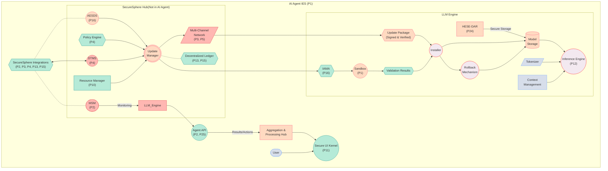


### Description for Diagram 14b: Onboard AI Agent Update Process 

**Components and Connections:**

* **SecureSphere Hub:** Manages the LLM update process.

  * **AESDS (P16):** Orchestrates the update process.
  * **Update Manager:**  Handles update package verification, deployment, and rollback.
  * **Policy Engine (P4):** Enforces policy compliance for updates.
  * **Multi-Channel Network (P3, P5):**  Securely delivers update packages.
  * **DTMS (P4):**  Provides trust information and security policies.
  * **MSM (P2):** Monitors the LLM Engine after updates.
  * **Decentralized Ledger (P13, P15):** Logs update events.
  * **Resource Manager (P10):** Allocates resources for staged rollouts.

* **AI Agent IES (P1):** Contains the LLM Engine and related components.

  * **LLM Engine:**
    * **Update Package:**  The incoming, signed and verified update.
    * **Installer:**  Installs the validated update package.
    * **HESE-DAR (P24):** Secure storage for models.
    * **Model Storage:**  Stores the current LLM model.
    * **Inference Engine (P12):**  Executes the LLM.
    * **Tokenizer:** Preprocesses text.
    * **Context Management:** Maintains context.
    * **Rollback Mechanism:**  Reverts to the previous model if needed.
    * **IAMA (P16) and Sandbox (P1):**  Perform isolated validation of the update package.
  * **Agent API (P2, P25):**  Allows other SecureSphere components to access the LLM.
  * **SecureSphere Integrations:** Handles communication with other SecureSphere components.

* **User Interaction:** The user interacts with the Secure UI, which is connected to the AI Agent IES (although the LLM Engine doesn't directly interact with the UI).

* **Data Flow:**

  * Update packages are delivered via the Multi-Channel Network (MCN).
  * The Update Manager verifies and deploys the update to the AI Agent IES.
  * IAMA creates an isomorphic model for sandboxed validation.
  * The Installer updates the Model Storage within HESE-DAR.
  * The LLM Engine uses the updated model.
  * The MSM continuously monitors the LLM Engine.
  * The Agent API provides access to the updated LLM for other SecureSphere components.
  * All update-related events are logged on the Decentralized Ledger.

## Diagram 14c: Onboard AI Agent Security System Integration
```mermaid
graph TD
    subgraph "SecureSphere Security System"
        subgraph "Master Security Mesh (MSM - P2)"
            MSM --> ThreatIntelFeed([ "Threat<br>Intelligence<br>Feed" ])
            MSM --> NetworkMon(( "Network<br>Monitor<br>(P3)" ))
            MSM --> SystemMon{{"System<br>Monitor<br>(P7,<br>P8)"}}
            MSM --> LocalMSMs[["Local<br>Security<br>Meshes<br>(P2)"]]
            ThreatIntelFeed --> AnomalyDetection(("Anomaly<br>Detection<br>Engine<br>(P7)"))
            AnomalyDetection --> MSM
            NetworkMon --> MSM
            SystemMon --> MSM
            LocalMSMs --> MSM
            AnomalyDetection --> AlertSystem(("Alert<br>System<br>(P7)"))
        end

        subgraph "Onboard AI Agent (Security Module)"
            subgraph "Threat Analysis & Hunting"
                ThreatIntelFeed --> AI_ThreatIntel([AI<br>Threat<br>Intelligence])
                AI_ThreatIntel --> ProactiveHunting((Proactive<br>Threat<br>Hunting))
                ProactiveHunting --> ThreatReports{{Threat<br>Reports}}
                MSM --> AI_ThreatIntel
                AnomalyDetection --> AI_AnomalyAnalysis([AI<br>Anomaly<br>Analysis])
                AI_AnomalyAnalysis --> ThreatReports
            end

            subgraph "Alert Prioritization & Response"
                AlertSystem --> AI_AlertPrioritization([AI<br>Alert<br>Prioritization])
                AI_AlertPrioritization --> PrioritizedAlerts{{Prioritized<br>Alerts}}
                AI_AlertPrioritization --> AutomatedResponse(("Automated<br>Response<br>(P7)"))
                AutomatedResponse --> ResponseSystem{{"Response<br>System<br>(P7)"}}
            end
            
            UI_Kernel(["Secure<br>UI<br>Kernel<br>(P11)"]) -- "Data<br>Diode<br>(P2)" --> UI_Monitor((UI<br>Monitor))
            UI_Monitor --> AI_AlertPrioritization
            UI_Monitor --> AI_AnomalyAnalysis

            subgraph "Detailed Reporting & Analysis"
                ThreatReports --> DetailedAnalysis{{Detailed<br>Threat<br>Analysis}}
                DetailedAnalysis --> RemediationRecommendations([Remediation<br>Recommendations])
            end

            subgraph "SecureSphere Integration"
                DTMS(["DTMS<br>(P4)"]) --> AI_AlertPrioritization
                DTMS --> AI_ThreatIntel
                DLT(("Decentralized<br>Ledger<br>(P13,<br>P15)")) --> AI_ThreatIntel
                DLT --- AI_AlertPrioritization
                DLT --- DetailedAnalysis
                AgentAPI([Agent<br>API]) --> ResponseSystem
                ConsensusEngine(("Consensus<br>Engine<br>(P13)")) --> SecurityActions{{Security<br>Actions}}
                AI_AnomalyAnalysis --> ConsensusEngine
                AI_AlertPrioritization --> ConsensusEngine
                AI_ThreatIntel --> ConsensusEngine
            end
        end

        ResponseSystem --> MSM
        SecurityActions --> ResponseSystem
        RemediationRecommendations --> SecurityPersonnel([Security<br>Personnel])
        PrioritizedAlerts --> SecurityPersonnel
        SecurityReports([Security<br>Reports]) --> SecurityPersonnel
        ThreatReports --> SecurityReports
        DetailedAnalysis --> SecurityReports
    end

style MSM fill:#ffcccb,stroke:#e63946,stroke-width:2px
style ThreatIntelFeed fill:#a8dadc,stroke:#457b9d,stroke-width:2px
style NetworkMon fill:#ffd60a,stroke:#f1faee,stroke-width:2px
style SystemMon fill:#b0f9b6,stroke:#264653,stroke-width:2px
style LocalMSMs fill:#f1faee,stroke:#1d3557,stroke-width:2px
style AnomalyDetection fill:#e9c46a,stroke:#f4a261,stroke-width:2px
style AlertSystem fill:#b0f9b6,stroke:#264653,stroke-width:2px

style AI_ThreatIntel fill:#ffd60a,stroke:#f1faee,stroke-width:2px
style ProactiveHunting fill:#a8dadc,stroke:#457b9d,stroke-width:2px
style ThreatReports fill:#ffcccb,stroke:#e63946,stroke-width:2px
style AI_AnomalyAnalysis fill:#b0f9b6,stroke:#264653,stroke-width:2px
style AI_AlertPrioritization fill:#e9c46a,stroke:#f4a261,stroke-width:2px
style PrioritizedAlerts fill:#ffd60a,stroke:#f1faee,stroke-width:2px
style AutomatedResponse fill:#f1faee,stroke:#1d3557,stroke-width:2px
style ResponseSystem fill:#b0f9b6,stroke:#264653,stroke-width:2px

style DTMS fill:#a8dadc,stroke:#457b9d,stroke-width:2px
style DLT fill:#ffcccb,stroke:#e63946,stroke-width:2px
style AgentAPI fill:#ffd60a,stroke:#f1faee,stroke-width:2px
style ConsensusEngine fill:#b0f9b6,stroke:#264653,stroke-width:2px
style SecurityActions fill:#e9c46a,stroke:#f4a261,stroke-width:2px
style SecurityPersonnel fill:#f1faee,stroke:#1d3557,stroke-width:2px
linkStyle 0,1,2,3,4,5,6,7,8,9,10,11,12,13,14,15,16,17,18 stroke:#555,stroke-width:2px
```


### Description for Diagram 14c: Onboard AI Agent Security System Integration

This diagram illustrates the integrated operation of SecureSphere's security system, highlighting the collaborative relationship between the Master Security Mesh (MSM) and the Onboard AI Agent. It emphasizes how these two subsystems work together, leveraging a consensus-driven approach, to provide comprehensive and robust security within SecureSphere.

**1. Master Security Mesh (MSM - P2):** The MSM acts as the central nervous system for SecureSphere's security, collecting and correlating data from various sources:

* **Threat Intelligence Feed:** External threat data providing context and awareness of emerging threats.
* **Network Monitor (P3):** Monitors network traffic flowing in and out of SecureSphere, using techniques like deep packet inspection (DPI) and anomaly detection to identify suspicious patterns.
* **System Monitor (P7, P8):**  Observes the behavior and performance of internal SecureSphere components, leveraging hardware-based anomaly detection (P7) and memory protection mechanisms (P8) to detect deviations from expected behavior.
* **Local Security Meshes (P2):** Each Isolated Execution Stack (IES) has a local security mesh that monitors internal activity within the IES and reports relevant data to the MSM.

The data from these sources feeds into the Anomaly Detection Engine (P7), which analyzes it for anomalies and potential threats. The Anomaly Detection Engine then triggers the Alert System (P7) to generate alerts for security incidents.

**2. Onboard AI Agent (Security Module):**  This intelligent agent enhances the security system by providing advanced analysis, proactive threat hunting, and context-aware alert prioritization.  It's crucial to understand that this agent is *not* part of the MSM but works in conjunction with it.

* **Threat Analysis & Hunting:** The AI Agent leverages threat intelligence from the MSM and performs proactive threat hunting.  It uses AI techniques to analyze potential threats and generate detailed threat reports.

* **Alert Prioritization & Response:** The AI Agent receives alerts from the Alert System and prioritizes them based on severity, context, and user activity observed through the UI Monitor.  It can also trigger Automated Responses (P7) through the Response System (P7), which then feeds back to the MSM.  The AI agent also receives input from the Secure UI Kernel (P11) through a unidirectional Data Diode (P2), allowing it to incorporate user context into its analysis and prioritization without risking UI manipulation.

* **Detailed Reporting & Analysis:** The AI Agent provides detailed threat reports, analysis, and Remediation Recommendations to security personnel.

* **SecureSphere Integration:** The AI Agent integrates with other SecureSphere components:

  * **DTMS (P4):** For access to trust levels and security policies.
  * **Decentralized Ledger (P13, P15):** For logging actions and accessing historical data.
  * **Agent API:**  Provides an interface for other security components to request specific analysis or actions from the AI agent.

**3. Consensus-Driven Security:**

The diagram highlights the consensus-driven nature of the security system:

* **Consensus Engine (P13):** The AI Anomaly Analysis, AI Alert Prioritization, and AI Threat Intelligence modules within the AI Agent feed into a Consensus Engine (P13). This engine uses a distributed consensus mechanism to reach agreement on appropriate security actions, preventing any single component from making potentially disruptive decisions on its own.  This is designed to achieve the following goals: preventing a single compromised AI model or MSM from hijacking the system, ensuring consensus-based decision making for high-impact actions, and improving transparency and auditability of the security decisions made.

* **Security Actions:** The agreed-upon security actions are sent to the Response System for execution, improving the accuracy and reliability of security responses.

**4.  Human Oversight:**  Ultimately, Security Personnel receive Prioritized Alerts, Security Reports, and Remediation Recommendations, providing human oversight of the AI-driven security process.

**Consensus-Driven AI Security:**

1. **UI Monitoring Integration:** The UI Monitor now feeds into both AI Alert Prioritization and AI Anomaly Analysis. This allows the AI agent to correlate user behavior with system events, potentially identifying insider threats or user errors that might contribute to security vulnerabilities.  The unidirectional data diode connection remains crucial for security.

2. **Consensus Engine (P13):** A Consensus Engine (P13) is introduced.  This engine receives inputs from multiple AI modules:

  * **AI Anomaly Analysis:** Provides insights based on system anomalies.
  * **AI Alert Prioritization:** Contributes context and risk assessments.
  * **AI Threat Intelligence:** Offers broader threat landscape information.

The Consensus Engine uses a distributed consensus algorithm (similar to those used in blockchain - P13, P15) to reach an agreement on the appropriate security actions.  This consensus-driven approach prevents any single AI component from making potentially disruptive security decisions unilaterally. It also increases resilience against manipulation or compromise of individual AI modules.

3. **Security Actions:** The Consensus Engine's output, the agreed-upon Security Actions, is sent to the Response System (P7), which executes the actions. This ensures that responses are based on a consensus view, reducing the risk of false positives or inappropriate actions.

4. **Detailed Analysis and Reporting:** The Detailed Analysis component also receives input from the Consensus Engine. It produces detailed Threat Reports, prioritized alerts, and remediation recommendations for human security personnel, which helps security teams investigate and respond to threats effectively.

**How the Consensus Mechanism Works:**

1. The various AI modules (Anomaly Analysis, Alert Prioritization, Threat Intelligence) independently analyze data from their respective sources (MSM, UI Monitor, Threat Intel Feeds, Decentralized Ledger).

2. Each module submits its proposed security action (or a "vote") to the Consensus Engine.

3. The Consensus Engine uses a distributed consensus algorithm to reach an agreement among the AI modules. This could be a simple majority vote, a weighted vote based on trust levels, or a more sophisticated consensus protocol.  The Decentralized Ledger logs all votes and the final consensus decision.

4. The agreed-upon security action is sent to the Response System for execution.  Simultaneously, a detailed report is compiled and sent to human security personnel for review and further action.

**Example Scenario:**

The Network Monitor detects unusual network traffic patterns. The Anomaly Detection Engine flags this as a potential DDoS attack. Simultaneously, the UI Monitor observes the user attempting to access a restricted resource. The AI Agent correlates these events and proposes blocking the user's access and implementing rate-limiting on the affected network interface.  The Consensus Engine receives this proposal and other inputs from the Threat Intelligence module. If a consensus is reached, the Response System takes the appropriate actions, while a detailed report is generated for security personnel.

This enhanced design integrates a robust consensus mechanism into the AI-driven security system, leveraging insights from multiple sources (UI, system internals, threat intelligence) and preventing any single AI component from making critical security decisions autonomously.  The use of a distributed consensus algorithm adds resilience and transparency to the system, further strengthening SecureSphere's comprehensive security posture.

## Diagram 15: BCI Integration:
```mermaid
graph LR
    subgraph "SecureSphere Hub (P4)"
        DTMS(("DTMS<br>(P4)")) --> SecureSphere
    end
    subgraph "SecureSphere"

        subgraph "SecureSphere Environment"
            subgraph "Secure Data Enclaves (P20)"
                AI_Model(("AI<br>Model<br>(P20)")) --> SecureDataEnclaves["Data<br>Enclaves"]
                Federated_Learning(("Federated<br>Learning<br>(P19)")) --> SecureDataEnclaves
            end
            subgraph "Secure Kernel (P1)"
                subgraph "Hardware Isolation (IES - P1)"
                    BCI_Hardware(("BCI<br>Hardware<br>(P1)")) --> IES
                end
                SecureKernel["Kernel"] --> SecureDataEnclaves
                SecureKernel --> Encryption(("Encryption<br>(P2)"))
                subgraph "Trusted Execution Environment (TEE)"
                    AI_Agent(("AI<br>Agent<br>(P16,&nbsp;P20)")) --> TEE
                end
                subgraph "Data Storage (P24)"
                    HESE_DAR(("HESE-DAR<br>(P24)")) --> SecureDataEnclaves
                    HESE_DAR --> Access_Control["Access<br>Control<br>(P2,&nbsp;P25)"]
                end
            end
            subgraph "Network Channels"
                subgraph "Secure Channels (P3, P5)"
                    subgraph "Secure Cloud"
                        Cloud_Service(("Cloud<br>Service")) --> SecureChannels["Secure<br>Channels>"]
                    end
                    SecureChannels --> SecureKernel
                end
            end
        end
        subgraph "Security Mechanisms"
            Encryption(("Encryption<br>(P2)")) --> SecureSphereEnvironment["SecureSphere<br>Environment"]
            Data_Diodes(("Data&nbsp;Diodes<br>(P2)")) --> SecureSphereEnvironment
            TEE((TEE)) --> SecureSphereEnvironment
            Non_Switchable_Channels(("Non-Switchable<br>Channels<br>(P3,&nbsp;P5)")) --> SecureSphereEnvironment
        end
    end
    subgraph "User Interface"
        UI_Kernel(("UI<br>Kernel<br>(P11)")) --> Data_Diode["Data<br>Diode"]
        Data_Diode --> SecureKernel

        UI_Kernel --> UI_Monitor((UI<br>Monitor))
        UI_Monitor --> PrioritizedAlerts((Prioritized<br>Alerts))
        subgraph "User"
            UserX((User<br>Action))
            UserX --> UI_Monitor
            UserX --> PrioritizedAlerts
        end
        subgraph "BCI Input"
            BCI_Input((BCI<br>Input)) --> UI_Monitor
        end
    end
    PrioritizedAlerts --> AI_AlertPrioritization((AI<br>Alert<br>Prioritization))
    AI_AlertPrioritization --> SecureKernel
    UI_Monitor --> AI_AnomalyAnalysis((AI<br>Anomaly<br>Analysis))
    AI_AnomalyAnalysis --> SecureKernel
    UI_Monitor --> AI_ThreatIntel((AI<br>Threat<br>Intelligence))
    AI_ThreatIntel --> SecureKernel

    %% Define styles
    classDef pastelNode fill:#D1E8E4,stroke:#A8D8D0,stroke-width:2
    classDef pastelEdge stroke:#345774,stroke-width:1

    %% Apply styles to nodes and edges
    class DTMS,AI_Model,Federated_Learning,BCI_Hardware,SecureKernel,Encryption,AI_Agent,HESE_DAR,Access_Control,UI_Kernel,UI_Monitor,PrioritizedAlerts,UserX,BCI_Input,AI_AlertPrioritization,AI_AnomalyAnalysis,AI_ThreatIntel pastelNode;
    class DTMS,AI_Model,Federated_Learning,BCI_Hardware,SecureKernel,Encryption,AI_Agent,HESE_DAR,Access_Control,UI_Kernel,UI_Monitor,PrioritizedAlerts,UserX,BCI_Input,AI_AlertPrioritization,AI_AnomalyAnalysis,AI_ThreatIntel pastelEdge;
```


### Description for Diagram 15: BCI Integration

**Explanation:**

* **SecureSphere Hub (P4):** This is the central control point, managing overall security policies and trust levels. It uses DTMS (P4) to enforce those policies.
* **SecureSphere Environment:** This represents the SecureSphere system itself, including:
  * **Secure Data Enclaves (P20):**  Protected environments for AI model training and processing.
  * **Secure Kernel (P1):** The core of the system, handling data acquisition, processing, and encryption.
  * **Hardware Isolation (IES - P1):**  A secure and isolated container for the BCI hardware.
  * **Trusted Execution Environment (TEE):**  Protects the AI Agent and sensitive operations.
  * **Data Storage (P24):**  Securely stores encrypted data within HESE-DAR (P24).
  * **Network Channels (P3, P5):**  Secure communication channels to the cloud environment.
* **User Interface:**  The interface that the user interacts with, including the Secure UI Kernel (P11), the UI Monitor, and the Prioritized Alerts.
* **Connections:**
  * **BCI Hardware:** Connected to the secure kernel via a data diode (P2).
  * **Secure Channels:**  Connects the secure kernel to the cloud environment.
  * **UI Monitor:**  Receives user input, analyzes data, and sends alerts to the secure kernel.
* **Security Mechanisms:**  SecureSphere's various security mechanisms (encryption, data diodes, TEE) protect the BCI module and its data.
* **AI Models:**  Trained using differential privacy and federated learning techniques, ensuring user privacy.

**Key Points:**

* **Data Diode:**  Ensures that data flows only from the BCI hardware to the secure kernel, preventing any manipulation.
* **Hardware Isolation:**  Protects the BCI hardware from potential attacks by isolating it within a SecureSphere IES instance.
* **Encryption:** All brainwave data is encrypted at rest and in transit.
* **Trusted Execution Environment:**  Protects the AI Agent from potential threats.
* **Non-Switched Secure Network Channels:**  Guarantee secure and reliable communication to the cloud environment.
* **AI Model Training:**  Uses privacy-preserving AI techniques to protect individual users' data.

## Diagram 16a: Remote UI Session
```mermaid
graph
    subgraph "Client"
        ClientApp[SecureSphere<br>Remote Client] --> SecureChannel["Secure Communication<br>(P2, P3, P5)"]
    end

    subgraph "SecureSphere Hub"
        direction LR
        Auth["Authentication<br>(MFA - P23)"] --> SessionMgr[Session Manager]
        SessionMgr --> CapMgr["Capability Manager<br>(P25)"]
        DTMS["DTMS (P4)"] --> SessionMgr
        SessionMgr --> UI_Session_IES[Remote UI Session IES]
        SessionMgr --> AuditLog["Audit Log<br>(P13, P15, P17)"]
        AuditLog --> DLT["Decentralized Ledger"]
    end

    subgraph "Remote UI Session IES (P1)"
        direction LR
        UI_Session_IES --> SecureUI["Secure UI Kernel (P11)"]
        SecureUI --> InputSanitizer["Input<br>Sanitizer<br>(P11)"]
        InputSanitizer --> RenderingEngine["Rendering Engine"]
        RenderingEngine --> SecureChannel
        UI_Session_IES --> SessionMonitor["Session Monitor<br>(P2, P7)"]
        SessionMonitor --> MSM["MSM (P2)"]
    end

    SecureChannel --> ClientApp
    MSM --> SessionMgr

    style Client fill:#ccf,stroke:#333,stroke-width:2px
```


### Description for Diagram 16a: Remote UI Session

This diagram details the architecture for establishing and managing a Secure Remote UI Session in SecureSphere, ensuring that remote access is granted and conducted with the same rigorous security principles that govern local interactions.

**1. Client-Side Initiation:**
A user on a remote endpoint utilizes the **SecureSphere Remote Client** application to request a UI session. All communication between the client and the SecureSphere instance is tunneled through **Secure Communication Channels (P2, P3, P5)**. These channels leverage:
*   The **Multi-Channel Network (P3)** for path diversity and isolation, potentially with dedicated firewall instances per channel.
*   **Capability-aware forwarding (P2, P26)** to enforce granular access rights at the network level, ensuring data flows only through authorized paths with appropriate permissions.
*   **Quantum-Resistant Communication protocols (P5)**, including Quantum Key Distribution (QKD), Distributed Key Management (DKM), and Post-Quantum Cryptography (PQC), to protect session data confidentiality and integrity against current and future cryptographic threats.

**2. SecureSphere Hub - Session Orchestration:**
The SecureSphere Hub is responsible for authenticating the remote user and managing the session lifecycle:
*   **Authentication (MFA - P23):** Upon connection request, the remote user undergoes a rigorous **Adaptive Context-Aware Multi-Factor Authentication (P23)** process. This involves a dynamic combination of factors such as biometrics, behavioral analysis, hardware tokens, and potentially out-of-band token verification. The user's context (e.g., device posture, location, time of day, historical behavior) influences the strength and types of authentication factors required, adapting to the assessed risk.
*   **Session Manager:** This central component orchestrates the session:
    *   It interacts with the **DTMS (P4)** to assess the trust level of the remote client, user credentials, and connection environment. This comprehensive trust assessment influences whether the session is permitted and what initial constraints or capabilities are applied.
    *   It consults the **Capability Manager (P25)** to assign a specific, minimal set of dynamically reconfigurable capabilities (P25) to the remote session, strictly adhering to the principle of least privilege. These capabilities define precisely what actions the user can perform and what resources (applications, data, IES functions) they can access during the session.
    *   It provisions a dedicated **Remote UI Session IES (P1)** specifically for this session. This ensures strong hardware and software isolation from other processes and IES instances within SecureSphere, containing any potential impact from the remote session.
    *   All significant session events (e.g., establishment, authentication attempts and outcomes, capability assignments and modifications, policy enforcement actions, session termination, detected anomalies) are forwarded to the **Audit Log (P13, P15, P17)**. This system records them on the **Decentralized Ledger (DLT)** and correlates them with the **Multi-Dimensional Audit Trail System (MDATS - P17)**, ensuring a comprehensive, tamper-evident, and verifiable audit trail.

**3. Remote UI Session IES (P1) - Secure Execution Environment:**
The remote UI session itself runs within a dynamically created, hardware-isolated IES instance, providing a secure enclave for UI interactions:
*   **Secure UI Kernel (P11):** This forms the core of the remote UI experience. It renders the UI elements based on declarative policies (P11) and the user's assigned capabilities. Hardware-enforced Control-Flow Integrity (CFI) and zonal isolation within the Secure UI Kernel protect against UI manipulation, information leakage between different UI regions, and attacks targeting the rendering pipeline.
*   **Input Sanitizer (P11):** All input received from the remote client via the SecureChannel is rigorously sanitized by the Input Sanitizer, which is an integral part of the Secure UI Kernel's input processing. This mitigates a wide range of injection attacks (e.g., Cross-Site Scripting (XSS) if web-based components are involved, command injection, SQL injection if applicable to backend services accessed via UI) that could target applications running within or accessible via the remote session.
*   **Rendering Engine:** This component, part of the Secure UI Kernel, securely renders the UI output from applications accessible within the session. It prepares the visual data for transmission back to the client, ensuring that only authorized information is displayed and that the rendering process itself is protected from interference or data exfiltration. The rendered output is then securely streamed over the **Secure Communication Channel**.
*   **Session Monitor (P2, P7):** The Remote UI Session IES is continuously monitored by a dedicated Session Monitor. This module leverages local security mesh capabilities (P2) and hardware-enforced anomaly detection mechanisms (P7) to identify suspicious behavior (e.g., unusual command sequences, excessive resource consumption), resource abuse, or potential security policy violations within the session. Detected anomalies are reported to the **Master Security Mesh (MSM - P2)**.

**4. Secure Communication and Monitoring Feedback:**
The bidirectional **Secure Communication Channel** ensures the confidentiality, integrity, and authenticity of all data exchanged between the client and the Remote UI Session IES. Monitoring data from the **MSM** (informed by the Session Monitor) feeds back into the **Session Manager** and **DTMS**. This allows for dynamic adjustments to the session's trust level, assigned capabilities, or even proactive termination of the session if critical threats or severe policy violations are identified.

This architecture provides a robust and adaptive framework for secure remote UI access, integrating strong, context-aware authentication, granular, dynamic authorization, deeply isolated execution, continuous, hardware-assisted monitoring, and comprehensive, tamper-evident auditing to protect SecureSphere resources and data during remote operations.

## Diagram 16b: Remote UI Integration
```mermaid
graph LR
    subgraph SecureSphere Hub
        direction LR
        SessionMgr[Session Manager] --> DTMS["DTMS (P4)"]
        SessionMgr --> CapMgr["Capability Manager (P25)"]
        SessionMgr --> AuditLog["Audit Log (P13, P15, P17)"]
        AuditLog --> DLT["Decentralized Ledger"]
        SessionMgr --> MSM["MSM (P2)"]
        SessionMgr --> PolicyEngine["Policy Engine (P4)"]
        SessionMgr --> OnboardAI["Onboard AI Agent (if available)"]
    end

    subgraph "Remote UI Session IES (P1)"
        UI_Session_IES[Remote UI Session IES] --> MSM
        UI_Session_IES --> DTMS
        UI_Session_IES --> InputSanitizer["Input Sanitizer (P11)"]

    end
```


### Description for Diagram 16b: Remote UI Integration

This diagram illustrates the deep integration of the Secure Remote UI Session system with the core security and management components of SecureSphere. This tight coupling ensures that remote sessions are governed by the same dynamic trust, policy enforcement, and monitoring mechanisms as any other operation within the SecureSphere environment, maintaining a consistent and high-assurance security posture.

**1. SecureSphere Hub - Centralized Control and Oversight of Remote Sessions:**
The **Session Manager**, residing within the SecureSphere Hub, serves as the primary orchestrator for remote UI sessions. It interfaces extensively with other critical Hub services to manage the entire lifecycle of a remote session securely:
*   **Dynamic Trust Management System (DTMS - P4):**
    *   The Session Manager consults the DTMS during the session initiation phase. The DTMS provides a comprehensive trust assessment of the remote user (based on identity and past behavior), the client device (attested security posture), and the connection context (network, location). This trust score is pivotal in the decision to authorize the session and in determining the initial set of permissions.
    *   The Remote UI Session IES continuously reports its attested state (via Secure Boot - P1, P13, P33) and ongoing operational behavior (via MSM) back to the DTMS. This allows the DTMS to dynamically update the session's trust score, enabling adaptive adjustments to privileges or even triggering alerts if trust degrades significantly.
*   **Capability Manager (CapMgr - P25):** Following successful authentication (MFA - P23) and a favorable trust assessment from the DTMS, the Session Manager collaborates with the CapMgr. The CapMgr provisions a specific, minimal, and dynamically reconfigurable (P25) set of capabilities for the remote session. This ensures strict adherence to the principle of least privilege, meticulously limiting the remote user's access only to explicitly authorized resources, applications, and actions within the context of their role and current trust level.
*   **Audit Log (P13, P15, P17) & Decentralized Ledger (DLT):** Every significant event related to the remote UI session is meticulously logged. This includes detailed records of authentication attempts (both successful and failed), assigned and revoked capabilities, policy enforcement actions, session duration, data access patterns, and any security alerts generated during the session. These logs are securely transmitted to the **Audit Log** service, which records them on the **Decentralized Ledger (DLT)**. This process often involves the **Multi-Dimensional Audit Trail System (MDATS - P17)**, which can correlate digital logs with physical microstructures (P14) for enhanced tamper-evidence and non-repudiation, creating a comprehensive audit trail for forensic analysis, security investigations, and compliance verification.
*   **Master Security Mesh (MSM - P2):**
    *   The Session Manager receives critical alerts and contextual threat intelligence from the MSM. This information can indicate risks associated with an ongoing remote session, such as if the remote endpoint is subsequently identified as compromised or involved in suspicious activities elsewhere.
    *   The Remote UI Session IES itself is actively monitored by its local session monitor (detailed in Diagram 16a), which reports detailed security telemetry and any detected anomalies to the MSM. The MSM then correlates this session-specific data with broader system-wide activity for comprehensive threat detection and situational awareness.
*   **Policy Engine (P4):** The Session Manager enforces policies defined by the Policy Engine. These policies govern all aspects of remote access, including criteria for allowing connections (e.g., device compliance, network origin), permitted connection times, geographic restrictions, data transfer limitations (e.g., preventing copy/paste of sensitive data), and specific operational rules for the session. These policies can be dynamic, adapting based on current DTMS trust levels or alerts from the MSM.
*   **Onboard AI Agent (Optional Integration - P14a, P14c):** If an Onboard AI Agent (as detailed in Diagrams 14a-c) is deployed within SecureSphere, it provides an additional layer of sophisticated, intelligent oversight for remote sessions. The Session Manager can leverage the AI Agent for:
    *   Real-time, nuanced behavioral analysis of remote user activity, identifying subtle deviations from established patterns that might indicate compromised credentials or insider threats.
    *   Advanced threat detection by correlating remote access patterns with known attack vectors or emerging threat intelligence.
    *   Dynamic risk assessment of the ongoing session, potentially triggering adaptive responses such as intensified monitoring, step-up authentication challenges, further restriction of capabilities, or, in critical cases, automatic session termination if high-risk behavior is detected by the AI.

**2. Remote UI Session IES (P1) - Secure and Integrated Execution Environment:**
The dedicated Isolated Execution Stack (IES) instance hosting the remote UI session is not an isolated silo but an integral, actively participating part of the SecureSphere ecosystem:
*   **MSM Integration:** The IES, through its local session monitor, actively reports fine-grained security-relevant telemetry to the MSM. This includes data on resource utilization (CPU, memory, network bandwidth consumed by the session), process behavior within the IES, and network activity originating from or terminating at the session IES. This allows the MSM to build a comprehensive security picture by correlating session-specific events with overall system activity.
*   **DTMS Integration:** The IES continuously attests its integrity (boot state, software configuration) to the DTMS. The DTMS, in turn, provides the IES with its current, dynamically calculated trust level and any applicable policies or capability restrictions. This enables the Secure UI Kernel (P11) operating within the IES to dynamically adjust UI rendering (e.g., redacting sensitive information if trust is lowered) and enforce access controls based on this real-time trust information.
*   **Input Sanitizer (P11):** As a critical internal security measure within the Remote UI Session IES, the Input Sanitizer (an integral part of the Secure UI Kernel's input processing pipeline as per P11) rigorously inspects and cleanses all inputs received from the remote client. This protects applications and services accessed through the remote session from a variety of malicious inputs, reinforcing SecureSphere's defense-in-depth strategy against injection attacks and other input-based vulnerabilities.

This deeply integrated approach ensures that remote UI sessions are managed with the full suite of SecureSphere's advanced security capabilities. It creates a high-assurance environment for remote access and operations, characterized by dynamic trust, granular policy enforcement, continuous monitoring, and robust auditing, all while maintaining strong isolation and resilience. The constant feedback loops between the session components, the Hub's security services (DTMS, MSM, Policy Engine, AI Agent), and the underlying monitoring infrastructure allow for proactive security and dynamic adaptation to evolving threats and trust conditions.

## Abbreviations

| Abbreviation | Full Name                                                              | Short Description                                                                                   |
| :----------- | :--------------------------------------------------------------------- | :-------------------------------------------------------------------------------------------------- |
| AESDS        | Automated Evolutionary Software Development System                     | AI-driven system for software evolution and secure deployment.                                      |
| DTMS         | Dynamic Trust Management System                                        | Manages trust relationships and access control based on dynamic metrics.                            |
| IAMA         | Isomorphic Architecture Monitoring & Adaptation                        | Monitors legacy systems and generates proactive security patches.                                   |
| STN          | Sovereign Trust Network                                                | Isolated data plane for secure communication.                                                       |
| DTG          | Dynamic Trust Gateway                                                  | Mediates communication between ATN and STN.                                                         |
| ATN          | Authenticated Trust Network                                            | Network with authenticated communication.                                                           |
| HESE-DAR     | Hardware-Enforced Secure Encrypted Enclave for Data at Rest            | Hardware-based encryption for data at rest.                                                         |
| IES          | Isolated Execution Stack                                               | Hardware-isolated execution environment.                                                            |
| ZKEE         | Zero-Knowledge Execution Environment                                   | Allows computations on encrypted data without revealing underlying information.                     |
| MSM          | Hierarchical Security Mesh                                             | Multi-layered security monitoring system.                                                           |
| Hub          | SecureSphere Hub                                                       | Central control and management component.                                                           |
| CapMgr       | Capability Manager                                                     | Manages capabilities for inter-IES communication.                                                   |
| PolicyEngine | Policy Engine                                                          | Enforces security policies.                                                                         |
| ResourceMgr  | Resource Manager                                                       | Manages resource allocation.                                                                        |
| ChannelMgr   | Channel Manager                                                        | Manages the multi-channel network.                                                                  |
| Secure_Channel | Secure Channels                                                        | Secure communication channels.                                                                      |
| External_Systems | External Systems                                                       | Systems outside of the SecureSphere environment.                                                    |
| Firewall     | Firewall                                                               | Network firewall.                                                                                   |
| SecureUI     | Secure UI Kernel                                                       | Secure and isolated user interface.                                                                 |
| DLT          | Decentralized Ledger                                                   | Distributed ledger for secure record-keeping.                                                       |
| MDATS        | Multi-Dimensional Audit Trail System                                   | Combines digital and physical audit trails.                                                         |
| UI_Integration | UI Integration Module                                                  | Facilitates communication between SecureSphere Hub and Secure UI.                                   |
| SIZCF        | Secure Inter-Zone Collaboration Framework                              | Enables secure collaboration between different zones.                                               |
| AnomalyDetector | Anomaly Detector                                                       | Detects anomalies in system behavior.                                                               |
| LocalMSM     | Local Security Mesh                                                    | Local security monitoring within an IES.                                                            |
| SecureStorage | Secure Storage                                                         | Secure storage for encrypted data.                                                                  |
| GovernanceAI | Governance AI                                                          | AI-driven component for governance auditing and transparency.                                       |
| QEAMS        | Quantum-Entangled Auxiliary Memory System                              | Provides out-of-band integrity verification for data using quantum entanglement.                    |
| SAMS         | Spatiotemporal Auxiliary Memory System                                 | Provides out-of-band integrity verification using spatiotemporal metadata.                          |
| PR-SAMS      | Passively Radiative Spatiotemporal Auxiliary Memory System               | A low-power version of SAMS using passive radiative sensing.                                        |
| QE-OTP       | Quantum Entangled One Time Pad                                         | A one time pad using quantum key exchange.                                                          |
| SHVS         | Secure Hyper-Virtualization System                                     | Enables secure and isolated execution environments within SecureSphere, supporting collaborative workloads. |
| CE-PCFS      | Capability-Enhanced Packet-Carried Forwarding State                    | Provides fine-grained access control for communication between IES instances within SecureSphere.   |
| SIBRA        | Secure Inter-Broker Routing Algorithm                                  | Ensures quality of service (QoS) for secure communication paths, particularly for bandwidth-intensive applications. |
| MPC          | Secure Multi-Party Computation                                         | Enables privacy-preserving collaborative machine learning across multiple SecureSphere instances.   |
| CFI          | Control-Flow Integrity                                                 | Protects the Secure UI Kernel against code injection attacks.                                       |
| DPI          | Deep Packet Inspection                                                 | Examines data packets to enforce security policies and detect malicious activity within the DTG.    |

