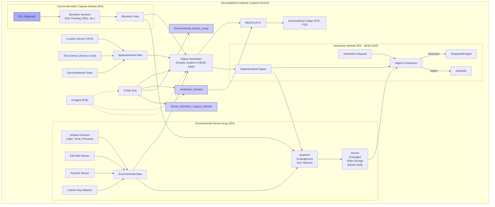
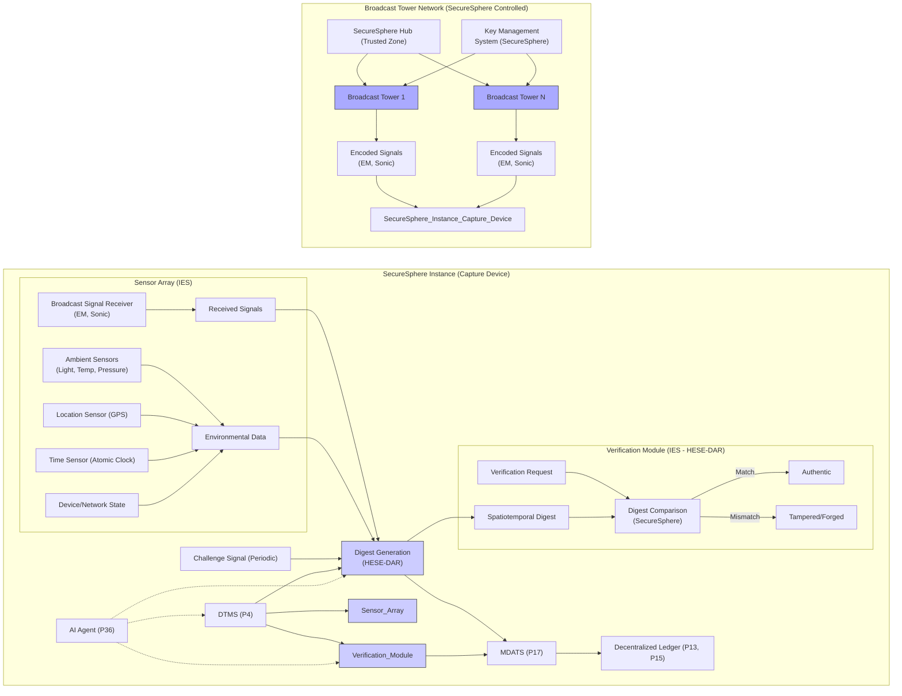

13-SecureSphere 20241106

Written by: Paul Lowndes <[ZeroTrust@NSHkr.com](mailto:ZeroTrust@NSHkr.com)>

# Table of Contents

[1: Spatiotemporal Digest Brainstorm](#h.yo4uf5rmkyfn)
[Diagram 1: SecureSphere Enhanced Spatiotemporal Digest Generation and Verification (Multi-Sensor & Chaotic Systems)](#h.3witqhhoklfq)
[2: Concept:  Broadcast Tower-Based Spatiotemporal Signatures](#h.dztvr0am64mq)
[Diagram 2: SecureSphere Spatiotemporal Digest with Broadcast Tower Signatures](#h.9hwam0h7df0x)

# 1: Spatiotemporal Digest Brainstorm

1.  **Precise Environmental Data Capture and Analysis:**

    *   **Concept:** The key is to capture a rich, high-resolution "fingerprint" of the environment *during* content creation. Go beyond basic spatiotemporal data (location, time). Consider:
        *   **Electromagnetic Field Fluctuations:** Capture subtle variations in the electromagnetic (EM) field, which are influenced by the environment (e.g., nearby electronic devices, power lines, atmospheric conditions). Precise measurement and analysis of these fluctuations create an extremely sensitive “fingerprint” for a specific location and time, enhancing the digest's uniqueness. Further, analysis by existing modules (i.e. Anomaly Detector, AI Agents, Security Mesh) on fluctuations can detect tampering attempts.
        *   **Acoustic Signatures:** Capture audio frequencies beyond the range of human hearing. Analyze these ultrasonic or infrasonic signatures, which are influenced by the environment (e.g., machinery, wildlife, geological activity), which adds to the spatiotemporal profile, aiding in verification and detection of forged data.
        *   **Atmospheric Conditions:** Precisely measure air pressure, temperature, humidity, and even minute changes in air composition (e.g. using laser spectroscopy for micro-pollutant detection). This level of fine detail, correlated with timestamped captures, creates a far more robust measure for environmental provenance, enhancing data integrity.
        *   **Cosmic Radiation:** Detect variations in cosmic ray flux. This adds a truly random component to the digest, making it even more challenging to forge, and would further ensure provenance, because there is no way to control or manipulate which particles impact the sensor at the time of capture. Further, integrating existing methods such as those described for generating the spatiotemporal digests (Patents P30-P32) will greatly enhance security by having this data verified too (independently by those separate pathways and components involved).
        *   **Neutrino Detection (highly speculative):** Neutrinos are subatomic particles that interact weakly with matter, passing through most materials undetected. A directional neutrino detector could, in theory, identify the exact location of a source (e.g., a nuclear reactor, a supernova) by measuring the direction of incoming neutrinos from any location. This could provide additional provenance information on capture events and provide additional data streams for the AI agent swarms to analyze for threats or anomalies. While current neutrino detectors are massive and impractical for everyday use, future miniaturization breakthroughs might enable their incorporation within SecureSphere’s sensory architecture.

    *   **Challenges:** Requires highly sensitive, calibrated sensors and specialized processing algorithms. Sensor fusion techniques and data validation methods are critical to ensure the reliability and accuracy of environmental fingerprints, and high-resolution sensor data would require extensive data storage and transmission capabilities from SecureSphere, potentially limiting its use. SecureSphere's AI could manage this data efficiently and filter out redundant data or focus on the most salient features for verification without significantly impacting performance. SecureSphere's distributed storage mechanisms could then ensure availability and integrity of these records.

    *   **SecureSphere Integration:** The existing spatiotemporal digest patents (P30, P31) and the Secure Biometric Capture Module concept (from the previous analysis) provide the framework. New sensors and analysis modules would be integrated into SecureSphere’s IES instances (P1) to maintain isolation and security from outside influence.

2.  **Chaotic Systems and Environmental Data:**

    *   **Concept:** Leverage the extreme sensitivity of chaotic systems to initial conditions. Feed the high-resolution environmental data into a carefully chosen chaotic system (as suggested in the previous analysis). This would produce an extremely unpredictable and computationally hard to replicate digest, even with slight variations in the data. Each spatiotemporal digest generated using this method would be unique to even minor changes in environmental or biometric parameters, making them highly sensitive, yet reliably verifiable. Its security further strengthens with existing cryptographic and/or PUF techniques using methods such as those presented earlier, for example by leveraging a hardware root of trust during digest generation or through integration with SecureSphere's Key Management Systems and hardware-enforced secure enclaves (HESE-DAR). The use of chaotic systems for spatiotemporal digests was initially suggested in a prior analysis. The emphasis here should be on utilizing a chaotic system capable of handling high-dimensional input data from multiple sensors with the sensitivity and reliability characteristics needed.

    *   **Challenges:** The design and implementation of this digest generation method depend on selecting a suitable chaotic system and developing robust algorithms and techniques for initializing, parameterizing and controlling its behavior. SecureSphere’s AI agent swarms could dynamically adjust the chaotic system’s parameters based on the type of data being captured, the current environment, and the risk profile, maximizing both its efficiency and its security by optimizing those elements that impact how well it generates the “fingerprint”. Further, integrating mechanisms for dynamic anomaly detection and/or intrusion monitoring using passively captured data from the sensor inputs, into SecureSphere's existing security frameworks (including P7, P14, and P17) through the DMNoC and other relevant systems, would strengthen its defences against potential tampering attempts by ensuring the integrity and authenticity of the data sources at every stage.

    *   **SecureSphere Integration:** Similar to previous suggestions, the chaotic system could be implemented as a specialized chiplet (P12) within HESE-DAR (P24). The DTMS (P4) would control access and the AI agent (P36) would monitor and analyze its output, providing additional safeguards. The cryptographic and secure mechanisms of HESE-DAR, combined with the continuous monitoring and update protocols established by SecureSphere’s DTMS (P4), Policy Engine (P4), and AESDS (P16) enhance the security and resilience of the system by preventing unauthorized access, detecting anomalies early, and responding to those events dynamically based on policies configured for each zone and instance, thereby providing a robust security solution that reduces the TCB and enhances the user’s trust in the system.

3.  **Spatiotemporal Data Bound to Physically Unclonable Functions (PUFs):**
    *   **Concept:** Enhance existing spatiotemporal data from (P30/31/32) by incorporating a Physically Unclonable Function (PUF) into the spatiotemporal digest creation and verification. Bind the PUF’s output to the environmental and biometric data before generating the digest. This creates a combined spatiotemporal-physical “fingerprint” that’s unique to the specific device used for capture, making it exceedingly difficult to replicate or forge since even exact copies of sensor data would be detected as fake.
    *   **Challenges:** As before, dealing with environmental sensitivity of PUFs using error correction and calibration techniques is crucial for real-world practicality. Furthermore, optimizing SecureSphere for use with PUFs and managing their lifecycle (e.g., ensuring their secure storage, and integration within the hardware attestation systems using methods described for the security mesh or similar) adds to the system's complexity.
    *   **SecureSphere Integration:** This approach could be used with the existing spatiotemporal data capture mechanisms (P30, P31, P32) and security features (P1, P13, P17), implemented within HESE-DAR for security (P24). The DTMS would manage access to the PUF. It would also be used to dynamically assess and adjust the trust levels (P4) and capabilities (P25, P26) of connected devices for secure communications across networks, leveraging existing and newly proposed SecureSphere mechanisms and features.

These refined ideas leverage known physics for enhancing the raster data spatiotemporal digest, making forgery more challenging even with perfect sensor data duplication. These ideas could evolve over time, too, by integrating future technological advancements, especially in quantum sensor technologies. Through its modular design, those enhanced versions could then seamlessly replace these earlier implementations using the AESDS (P16) system and its automated secure update procedures.

## Diagram 1: SecureSphere Enhanced Spatiotemporal Digest Generation and Verification (Multi-Sensor & Chaotic Systems)

**Diagram 1 Description:**

This diagram details the enhanced spatiotemporal digest generation and verification process, using multiple sensors, chaotic systems and quantum entanglement for securing sensor data, integrating with SecureSphere’s security features.

*   **Secure Biometric Capture Module (IES):** Captures biometric data (eye-tracking, EMG, optional BCI) within a secure IES instance.
*   **Environmental Sensor Array (IES):** Captures detailed environmental data (ambient conditions, EM fields, acoustics, cosmic radiation) within a secure IES.
*   **Quantum Entanglement Distribution Network**: The quantum entanglement distribution network establishes and maintains entanglement between newly generated digests, and the secure storage in HESE-DAR for authenticating the data sources and the spatiotemporal digest itself, making it computationally infeasible to forge or alter them without detection.
*   **Spatiotemporal Data:** Includes precise location, time, and device/network state.
*   **Digest Generation (Chaotic System in HESE-DAR):** Generates the digest using a chaotic system within HESE-DAR, ensuring its unpredictability and security.
*   **Verification Module (IES - HESE-DAR):** Compares the generated digest against the securely stored entangled state for verification, leveraging HESE-DAR’s security.
*   **SecureSphere Integration:** Shows integration with DTMS (access control), AI Agent (anomaly detection), MDATS/DLT (auditing).

# 2: Concept:  Broadcast Tower-Based Spatiotemporal Signatures

You're proposing an intriguing approach: using external broadcast towers to create a verifiable spatiotemporal signature for raster data. Let's explore this concept, address its challenges, and propose a potential solution integrated with SecureSphere.

Government/industry-run towers broadcast encoded signals (EM outside the visible range and/or ultra/subsonic sounds). Raster capture devices, like cameras, receive these signals *during* content capture. The received signals, unique to the location and time, are incorporated into the spatiotemporal digest (P30). This links the raster content to the real-world environment in a verifiable way. Here are the crucial aspects needed:

**1. Secure Signal Generation and Broadcasting:**

*   **Unpredictable Signals:** Towers broadcast pseudo-random, time-varying signals, perhaps derived from atmospheric noise, quantum random number generators (QRNGs), or other unpredictable sources. The key is to make these signals computationally difficult for an adversary to predict or replicate, using existing SecureSphere components like the hardware root of trust for example (during attestation). The generated signals are authenticated using digital signatures based on SecureSphere standards and managed via a high-assurance process coordinated using multiple geographically distributed systems within a secure network (i.e. STN, or similar), whose provenance, access controls, and usage are fully auditable by MDATS (P17) on the Decentralized Ledger using existing and proposed enhancements for secure multiparty computations from P13, P15, P19, P23 and leveraging QKD for high-integrity communication too. This decentralized control and management minimizes risk of compromise or misuse of the system. These pseudo-random signals act as the broadcast signature from a trusted external source, enhancing secureSphere security.
*   **Spatiotemporal Encoding:** Signals are encoded with spatiotemporal information (precise location, time). This could involve frequency or phase modulation for EM signals, or time-varying patterns for sonic signals. This guarantees provenance and links the signal’s physical presence in spacetime to any capture device that receives them.
*   **SecureSphere Control:** The SecureSphere Hub (within a trusted zone) controls the signal generation and broadcast schedule, utilizing secure communication channels (P3, P5) to communicate with the towers and prevent unauthorized signal manipulation or disruptions to the broadcast signal from adversarial interference by malicious actors.

**2.  Raster Capture and Digest Generation:**

*   **Multi-Sensor Capture:** Capture devices incorporate sensors for both the broadcast signals (EM and/or sonic) *and* standard environmental data (as discussed in previous responses): ambient light, temperature, pressure, precise location, and time. This multi-sensor approach creates a richer spatiotemporal "fingerprint," which strengthens the digest and makes forging it harder.
*   **Signal Integration:** The received broadcast signals are combined with the sensor data during the spatiotemporal digest generation process (P30, P31). SecureSphere systems enforce the required capture rates and parameters for signal authentication. These could be dynamically adjusted based on trust level of the device, its location, and the sensitivity of the data or communications it is responsible for managing according to rules specified by its associated zone or SecureSphere instance.
*   **Secure Processing:** Digest generation occurs within a secure IES instance (P1) on the device, leveraging HESE-DAR (P24) where available or feasible.

**3. Verification and Anti-Forgery:**

*   **SecureSphere Verification:** Verification occurs within SecureSphere, comparing the digest against a recreated digest using securely stored information about broadcast signals and the spatiotemporal context of those signals. This independent verification using the signal database and its unique identifiers (from a trusted source) as cross-references during the attestation phase for the hardware in use, the software’s provenance, and its security profile enhances trust and integrity of those devices that capture spatiotemporal data. It also detects anomalies from potentially compromised devices by identifying inconsistencies in the metadata received from both networks (MCN and DMNoC). This is particularly valuable for detecting deepfakes by verifying if the scene in the image or raster data matches the broadcast spatiotemporal data at the time of capture.
*   **Challenge-Response:** For enhanced security, the towers could issue periodic challenges (unique, time-limited signals). Capture devices must respond with digests incorporating the challenge, verifying real-time presence in the environment and further enhancing tamper detection and prevention of malicious activities by untrusted endpoints.
*   **AI-Driven Anomaly Detection:** SecureSphere's AI agent (P36), leveraging machine learning models developed and continuously updated and trained through the AESDS (P16), analyzes spatiotemporal digests to detect inconsistencies or anomalous patterns that might indicate manipulation or deepfakes. The decentralized consensus system allows SecureSphere instances to share their analysis securely and further strengthen the threat and anomaly detection models by utilizing data from multiple zones or devices, even from other untrusted sources which SecureSphere integrates using its IAMAs or from the Decentralized Ledger after validation.
*   **3D Microstructure Integration:** Combine spatiotemporal digests with a physical 3D microstructure signature to create a truly tamper-evident record of content creation. This two-pronged verification process is more robust and adds an additional layer of trust and provenance that’s difficult to forge without physical access to the device itself. It also enhances forensic capabilities.

**Addressing Key Challenges and Complexities:**

*   **Signal Interference and Spoofing:** SecureSphere addresses signal interference by using redundant communication channels, error correction techniques, and dynamically adjusting signal parameters based on the environment and signal strength. Its AI-driven security mesh (P2, P7, P36) monitors the network and sensors to detect any anomalous transmissions or potential spoofing attempts, adjusting security measures dynamically using both existing SecureSphere components and features as well as those enhancements proposed earlier, such as having those passively radiative sensors that capture data out of band. The attestation and dynamic capability mechanisms further provide granular control over which data sources have access to the DMNoC for highly secure communications. SecureSphere's existing cryptographic methods such as HESE-DAR (P24) can also be employed to enhance security in these systems further, using encryption keys generated by the hardware Root of Trust.

*   **Ensuring Pixel Authenticity:** Combining broadcast signals with fine-grained environmental data and specialized analysis of each using multiple independent mechanisms, along with AI-driven anomaly detection using both real-time data captured from the device during the process and also from that which is stored historically from similar environments, such as on the SecureSphere distributed ledger to verify provenance after validation through SecureSphere protocols, strengthens our ability to verify the authenticity of images. The use of 3D microstructures (P14, P17) provides a tamper-proof audit trail, enhancing trust. This makes proving authenticity significantly more difficult, even if attackers have perfect sensor data.

*   **Scalability and Infrastructure:** Deploying and managing a network of broadcast towers involves substantial cost and logistical challenges and has security implications regarding the towers themselves. A phased rollout, starting with limited coverage areas or for those use-cases which require high security and trust (e.g. law enforcement, sensitive business or industrial applications), would make the approach more practical and enable gradual expansion using SecureSphere’s cloud integration and dynamically adjusting both the zones and access controls during each phase as more devices are integrated into the network. This process leverages existing SecureSphere features to ensure that the security requirements and performance metrics of the system remain at levels suitable for each environment and use-case during rollout.

By strategically combining broadcast tower signals with multi-sensor environmental data capture, robust cryptographic techniques, and AI-driven analysis, SecureSphere can achieve a highly secure and verifiable spatiotemporal digest for raster data, countering sophisticated forgery attempts, even deepfakes, and significantly enhancing the trustworthiness of digital media. This enhanced security is crucial in a world where distinguishing real from fake content becomes increasingly challenging. While this approach is ambitious, it builds upon SecureSphere's existing technologies and aligns with its long-term vision of creating a truly secure computing ecosystem.

## Diagram 2: SecureSphere Spatiotemporal Digest with Broadcast Tower Signatures

**Diagram 2 Description:**

This diagram illustrates the integration of broadcast tower signals into SecureSphere's spatiotemporal digest system, enhancing security and provenance.

*   **Broadcast Tower Network:** Towers broadcast encoded signals, controlled by SecureSphere. Key management ensures signal authenticity.
*   **Sensor Array (IES):** The capture device's sensor array, within an IES, receives broadcast signals and other environmental data.
*   **Digest Generation (HESE-DAR):** Generates the spatiotemporal digest using the received signals and sensor data, leveraging HESE-DAR’s security. It also processes challenge signals from the towers for enhanced verification.
*   **Verification Module (IES - HESE-DAR):** Compares the generated digest with SecureSphere's records for verification.
*   **SecureSphere Integration:** Shows integration with DTMS (access control), AI Agent (anomaly detection), and MDATS/DLT (auditing).
