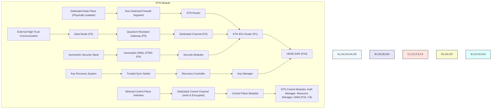
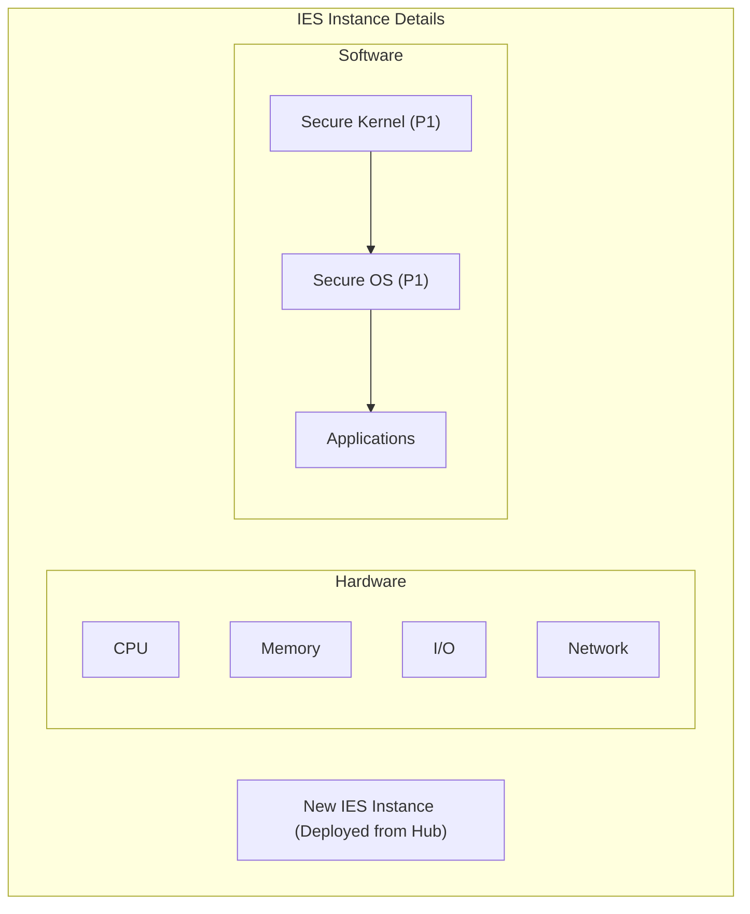
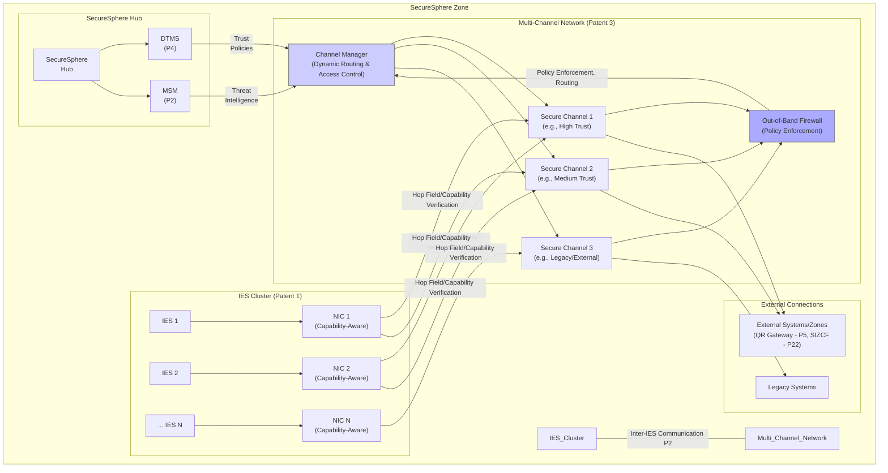
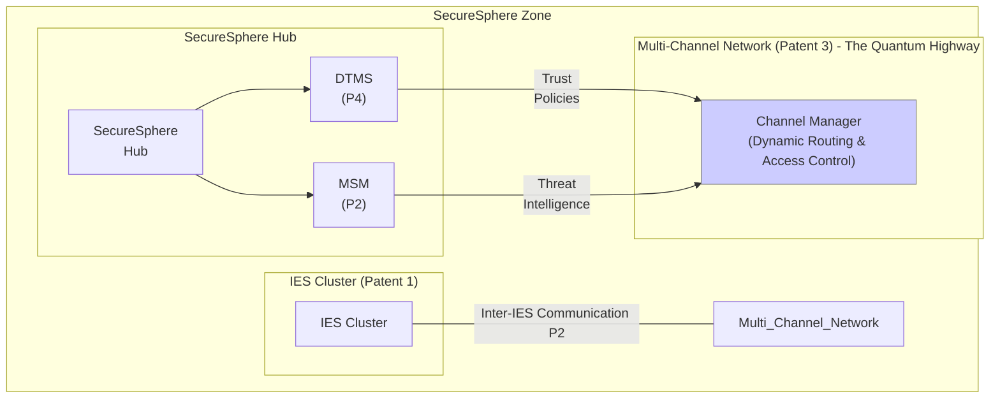
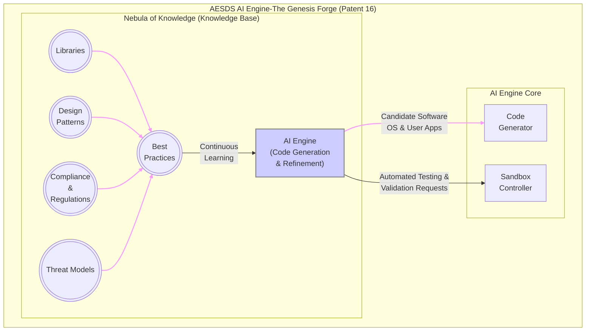
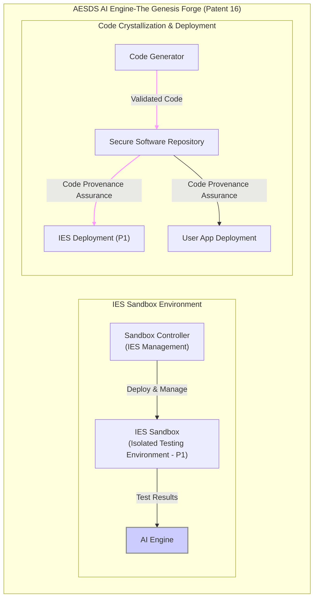
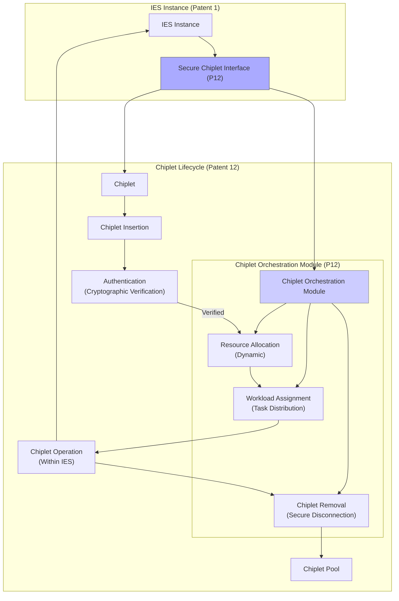

# 2-SecureSphere Overview-2 20241031
Written by: Paul Lowndes <[ZeroTrust@NSHkr.com](mailto:ZeroTrust@NSHkr.com)>

## Table of Contents

* [Diagrams: Overview](#h.rays2pkbfwwx)
* [Main Diagrams:](#h.u1s3xk6usab9)
  * [Diagram 1a through 1f: SecureSphere Architecture Overview](#h.v0x5d2w8flt7)
  * [Diagram 2a and 2b: IES Lifecycle Management within SecureSphere Hub](#h.cla826xcgu)
  * [Diagram 3a and 3b: Communication Flow within the Multi-Channel Network](#h.mov3xxbys2o2)
  * [Diagram 4: HESE-DAR Detailed Data Flow](#h.y35yj5uv17f)
  * [Diagram 5: SecureSphere Zone Interaction via SIZCF](#h.5ikbvghr7skc)
  * [Diagram 6a through 6c: AESDS AI Engine](#h.saxbh0dbq7j3)
  * [Diagram 7: Chiplet Integration Lifecycle](#h.65b4t7ocaqtn)
  * [Diagram 8: Decentralized Governance Process (Voting)](#h.xixmvjtlm0w0)
  * [Diagram 9: Automated Evolutionary Software Development System (AESDS) Lifecycle](#h.6y7d8on135jq)
  * [Diagram 10: Adaptive Multi-Channel Network - The Quantum Highway](#h.xtqeca5ciewj)
  * [Diagram 11: Dynamic Trust Management System (DTMS) in Action](#h.j4je17oa1vav)
  * [Diagram 12: Data Enclave - The Sanctuary](#h.39co5o4mzz7g)
  * [Diagram 13a through 13d: Hub - The Command Center](#h.t14h4wn260tw)
  * [Diagram 14: Control / Data Planes](#h.h94i9n7jzxgd)
  * [Diagram 15: Detailed Integration](#h.uea075khi94)
  * [Diagram 16a through 16f: Automated Software and Trust Systems Integration](#h.qhkdp36jfsjr)
    * [Deep Dive: Automated Software and Trust Systems Integration (Diagram 16a - 16f)](#h.jty2cpmqgt2r)
    * [Diagram 16a: Main Diagram](#h.rwp69t23uxa5)
    * [Diagram 16b: AESDS with IAMA Module (Patent 16, Claim 9)](#h.unfi54smevj)
    * [Diagram 16c: STN Externals (Patent 27)](#h.7agdd7z8hiad)
    * [Diagram 16d: STN Internals (Patent 28)](#h.iy3n0llwn5pn)
    * [Diagram 16e: DTG Internals (Patent 28)](#h.a73j8h9bx3hn)
    * [Diagram 16f: External Integrations](#h.j97vjnfgf6oy)

# Diagrams: Overview

**Diagram 1 (a-f): SecureSphere Architecture Overview:**

This series of diagrams provides a layered view of SecureSphere, starting with a high-level overview and progressively zooming in on specific components:

*   **Zone:** A SecureSphere deployment, containing the Hub, IES Clusters, supporting systems (MSM, DTMS, SHVS), and connections to external systems/zones.
*   **Hub:** The central management entity.  Internals include Orchestrator, Resource Allocator, Policy Engine, various interfaces (MSM, DTMS, SIZCF), and authentication mechanisms.
*   **IES Clusters:** Groups of Isolated Execution Stacks (IES).  An IES instance is detailed, showing the Secure Kernel, MMU, memory segmentation, Secure OS, application, HESE-DAR, and Chiplet Fabric.
*   **Multi-Channel Network:**  Provides secure communication with quantum-resistant encryption and firewall protection.
*   **Full Integration (1f):**  Connects all the pieces, showing how AESDS updates various components, the flow of data through the IES cluster and multi-channel network, the role of the DLT and MDATS, and integration with legacy systems.

**Diagram 2 (a-b): IES Lifecycle Management:**

Illustrates how the SecureSphere Hub's Orchestrator manages the lifecycle of IES instances, including provisioning, deployment (with secure boot), scaling, termination, and integration with AESDS, MSM, and the Policy Engine.

**Diagram 3 (a-b): Multi-Channel Network Communication:**

Shows how IES instances communicate through the Multi-Channel Network. Highlights capability-aware NICs, secure channels with different trust levels, the out-of-band firewall, and the Channel Manager's dynamic routing based on DTMS trust policies and MSM threat intelligence.

**Diagram 4: HESE-DAR Data Flow:**

Details the secure access, encryption, and decryption process within HESE-DAR.  Shows the flow of data requests from applications through the IOMMU, access control checks, key management, the crypto engine, secure storage, and integration with MSM and DTMS.

**Diagram 5: SIZCF Zone Interaction:**

Illustrates how SecureSphere zones securely collaborate via SIZCF.  Shows zone discovery, trust assessment using DTMS, secure communication channel establishment, data sanitization and exchange, and distributed ledger synchronization.

**Diagram 6 (a-c): AESDS AI Engine:**

Visualizes the AI engine within AESDS, responsible for code generation and refinement.  Shows the knowledge base, dynamic input streams (performance metrics, user feedback, threat intelligence), SecureSphere integration, the IES sandbox environment, and code deployment.

**Diagram 7: Chiplet Integration Lifecycle:**

Details the process of integrating chiplets into an IES, including insertion, authentication, resource allocation, workload assignment, operation, and removal, managed by the Chiplet Orchestration Module.

**Diagram 8: Decentralized Governance (Voting):**

Illustrates a secure voting scenario, demonstrating SecureSphere's decentralized governance. Shows voter authentication, vote casting, secure tallying on the DLT, audit trail generation using 3D microstructures, and verification by auditors.

**Diagram 9: AESDS Lifecycle:**

Visualizes the continuous loop of software development within AESDS: AI-driven code generation, testing in IES sandboxes, validation, decentralized governance approval, secure deployment, monitoring, feedback collection, and integration with the 3D Microstructure system for auditing.

**Diagram 10: Adaptive Multi-Channel Network:**

Visualizes the Multi-Channel Network as a "Quantum Highway" with different trust levels (lanes). Shows dynamic rerouting by the Channel Manager based on DTMS and MSM input, firewall checkpoints, and quantum-resistant gateways for external communication.

**Diagram 11: DTMS in Action:**

Illustrates the dynamic trust evaluation process within DTMS. Shows an IES instance requesting access to a protected resource, with the DTMS considering trust level, monitoring data, threat intelligence, and policies to make a consensus-based access decision.

**Diagram 12: Data Enclave:**

Visualizes the secure data enclave, emphasizing layered security and privacy-preserving analysis. Shows data ingestion, validation, MPC, differential privacy, homomorphic encryption, sanitized output, and integration with DTMS and the decentralized ledger for auditing.

**Diagram 13 (a-d): SecureSphere Hub:**

Depicts the Hub as a command center, showing operators monitoring real-time information (IES status, network traffic, security alerts, resource utilization). Details the Hub's internal modules, their connections to external components, and operator interaction.

**Diagram 14: Control/Data Planes:**

Illustrates the separation of control and data planes within SecureSphere, showing how different components participate in each plane and how they coordinate. Includes the Secure UI Plane and the Decentralized Ledger for auditing.

**Diagram 15: Detailed Integration:**

Provides a comprehensive integration view, showing the internal workings of an IES (including child IES and zones), inter-IES communication mechanisms, the SecureSphere Hub components, the multi-channel network, external systems/zones, and data services.

**Diagram 16 (a-f): Automated Software and Trust Systems Integration:**

This series provides a deep dive into how AESDS integrates with the STN and DTG:

*   **Main Diagram (16a):** High-level overview of AESDS, STN, and DTG interactions.
*   **AESDS with IAMA (16b):** Details the AESDS AI engine, IAMA module's legacy system monitoring, specialized code generators, parallel sandboxes for testing updates, and the secure software repository.
*   **STN Externals (16c):** Shows the STN's isolated data plane, minimal control plane interface, isomorphic security stack, key recovery system, and secure connection to external high-trust environments.
*   **STN Internals (16d):** Details the STN's internal components, including the firewall, router, IES cluster, HESE-DAR, control plane modules, isomorphic security stack, and key recovery system.
*   **DTG Internals (16e):**  Shows the DTG's secure communication agent (with multi-path management), capability manager (with hardware acceleration), data handling and security processes (DPI, sanitization, authorization), and decentralized governance mechanisms.
*   **External Integrations (16f):**  Focuses on the external connections of the STN, DTG, and AESDS, showing how they interact with external systems and networks, including legacy systems and untrusted environments.
# Main Diagrams:

### Diagram 1a through 1f: SecureSphere Architecture Overview 
```mermaid
graph LR
    subgraph "SecureSphere Zone (Patents 17, 18)"
        direction LR
        subgraph "SecureSphere Hub (Patents 1, 4, 16, 22)"
            Hub["SecureSphere Hub"] -->|"Orchestration & Mgmt"| IES_Clusters
            Hub -->|"Security Mgmt"| MSM
            Hub ---->|"Trust Mgmt"| DTMS
            Hub ---->|"Collaboration"| SHVS

            subgraph "Hub Internals (Patent 1, 4, 8, 10, 16, 17, 22)"
                Orchestrator["Orchestrator<br>(IES Lifecycle)"] --> Resource_Alloc["Resource Allocator"]
                Policy_Engine["Policy Engine"] --> DTMS_Config["DTMS Config"]
                MSM_Int["MSM Interface"] --> Log_Aggregator["Log Aggregator"]
                AuthN["AuthN"] & AuthZ["AuthZ"] --> MFA["MFA (P23)"]
                SIZCF_Int["SIZCF Interface"] --> Zone_Mgmt["Zone Manager"]
            end
        end

        subgraph "Modular IES Clusters (Patents 1, 2, 7, 8, 9, 10, 12)"
            IES_Clusters["IES Clusters"] -->|"Secure Comm (P2, 3, 5)"| Multi_Channel_Network
            IES_Clusters -->|"Resource Borrowing (P9)"| Resource_Borrowing
            IES_Clusters -->|"AI Resource Alloc (P10)"| AI_Resource_Alloc
            IES_Clusters -->|"Dynamic Partitioning (P1)"| Dynamic_Partitioning
            IES_Clusters -->|"Anomaly Detection (P7)"| Anomaly_Detection

            subgraph "IES Instance (Patents 1, 2, 7, 8, 9, 10, 12, 24)"
                IES["IES"] --> Secure_Kernel["Secure Kernel"]
                Secure_Kernel --> MMU["MMU"]
                MMU --> Memory["Physically Segmented Memory"]
                Secure_Kernel --> OS["Secure OS"]
                OS --> App["Application"]
                App -.- >|"Data Access"| HESE_DAR["HESE-DAR (P24)"]
                IES --> HW_Noise_Gen["Hardware Noise Generator"]
                IES -.-.> Chiplet_Fabric["Chiplet Fabric (P12)"]
            end
            
            subgraph "Local Security Mesh (P2)"
                Local_MSM["Local MSM"] --> Anomaly_Detector["Anomaly Detector"]
            end
        end

        subgraph "Multi-Channel Network (Patents 3, 5)"
            Multi_Channel_Network -->|"Quantum-Resistant Encryption (P5)"| QR_Comm_GW
            Multi_Channel_Network ---->|"Firewall (P3)"| Firewall
        end

        subgraph "DTMS (Patents 4, 16)"
            DTMS -->|"Trust Evaluation"| Trust_DB
        end

        subgraph "SHVS (Patents 17, 18)"
            SHVS -->|"Collaboration Contexts"| Collab_Mgmt["Collaboration Management"]
        end

        subgraph "External Systems/Zones (P22)"
            External["External Systems"]
            SIZCF["SIZCF"] -->|"Secure Communication"| QR_Comm_GW
            SIZCF -.-.> External
        end
        
        subgraph "Decentralized Ledger (P13, 15, 17)"
          Ledger["Decentralized Ledger"]
          Hub -.-.> Ledger
          IES_Clusters -.-.> Ledger
        end

        subgraph "AESDS (Patent 16)"
            AESDS -->|"Software Updates"| IES_Clusters
        end

        subgraph "3D Microstructure (P14, 17)"
            Microstructure["3D Microstructure"] -.-.> Ledger
            Microstructure -.-.> AESDS
        end

        subgraph "Secure Data Enclaves (P20)"
            SDE["Secure Data Enclaves"] -.-.> IES_Clusters
            SDE -.-.> SHVS
        end

        subgraph "Federated Learning (P19)"
            FL["Federated Learning"] -.-.> IES_Clusters
            FL -.-.> SDE
        end

        %% Key connections between groups
        Hub --- IES_Clusters
        Hub --- MSM
        IES_Clusters --- MSM
        IES_Clusters --- Multi_Channel_Network
        Multi_Channel_Network --- SIZCF
        Hub --- SIZCF
        DTMS --- IES_Clusters
        DTMS --- SHVS
        SHVS --- SIZCF
    end

    %% Node styling
    style Hub fill:#f9f,stroke:#333,stroke-width:1px
    style IES_Clusters fill:#ccf,stroke:#888,stroke-width:1px
    style MSM fill:#ccf,stroke:#888,stroke-width:1px
```

---

```mermaid
graph TD
    subgraph "SecureSphere Zone"
        direction LR
        subgraph "SecureSphere Hub"
            Hub["SecureSphere Hub"] -->|"Orchestration & Mgmt"| IES_Clusters["IES Clusters"]
            Hub -->|"Security Mgmt"| MSM["MSM"]
            Hub ---->|"Trust Mgmt"| DTMS["DTMS"]
            Hub ---->|"Collaboration"| SHVS["SHVS"]

            subgraph "Hub Internals (Patent 1, 4, 8, 10, 16, 17, 22)"
                Orchestrator["Orchestrator<br>(IES Lifecycle)"] --> Resource_Alloc["Resource Allocator"]
                Policy_Engine["Policy Engine"] --> DTMS_Config["DTMS Config"]
                MSM_Int["MSM Interface"] --> Log_Aggregator["Log Aggregator"]
                AuthN["AuthN"] & AuthZ["AuthZ"] --> MFA["MFA (P23)"]
                SIZCF_Int["SIZCF Interface"] --> Zone_Mgmt["Zone Manager"]
            end
        end
        style Hub fill:#f9f,stroke:#333
```


```mermaid
graph LR
    subgraph "Modular IES Clusters"
        IES_Clusters["IES Clusters"] -->|"Secure Comm (P2, 3, 5)"| Multi_Channel_Network["Multi-Channel Network"]
        IES_Clusters -->|"Resource Borrowing (P9)"| Resource_Borrowing
        IES_Clusters -->|"AI Resource Alloc (P10)"| AI_Resource_Alloc
        IES_Clusters -->|"Dynamic Partitioning (P1)"| Dynamic_Partitioning
        IES_Clusters -->|"Anomaly Detection (P7)"| Anomaly_Detection

        subgraph "IES Instance (Patents 1, 2, 7, 8, 9, 10, 12, 24)"
            IES["IES"] --> Secure_Kernel["Secure Kernel"]
            Secure_Kernel --> MMU["MMU"]
            MMU --> Memory["Physically Segmented Memory"]
            Secure_Kernel --> OS["Secure OS"]
            OS --> App["Application"]
            App -.- >|"Data Access"| HESE_DAR["HESE-DAR (P24)"]
            IES --> HW_Noise_Gen["Hardware Noise Generator"]
            IES -.-.> Chiplet_Fabric["Chiplet Fabric (P12)"]
        end
        
        subgraph "Local Security Mesh (P2)"
            Local_MSM["Local MSM"] --> Anomaly_Detector["Anomaly Detector"]
        end
    end
    style IES_Clusters fill:#ccf,stroke:#888
```


```mermaid
graph TD
    subgraph "SecureSphere Zone"
        direction LR
        subgraph "Multi-Channel Network (Patent 3) - The Quantum Highway"
            NIC1 -->|"Hop Field/Capability<br>Verification P2/P25"| Channel1["Secure Channel 1<br>(High Trust)"]
            NIC2 -->|"Hop Field/Capability<br>Verification P2/P25"| Channel1
            NIC1 -->|"Hop Field/Capability<br>Verification P2/P25"| Channel2["Secure Channel 2<br>(Medium Trust)"]
            NIC2 -->|"Hop Field/Capability<br>Verification P2/P25"| Channel2
            NICN -->|"Hop Field/Capability<br>Verification P2/P25"| Channel3["Secure Channel 3<br>(External/Legacy)"]

            Channel1 --> Checkpoint1["Firewall Checkpoint<br>(Packet Inspection)"]
            Channel2 --> Checkpoint2["Firewall Checkpoint<br>(Packet Inspection)"]
            Channel3 --> Checkpoint3["Firewall Checkpoint<br>(Packet Inspection)"]

            Checkpoint1 --> Channel_Manager
            Checkpoint2 --> Channel_Manager
            Checkpoint3 --> Channel_Manager

            Channel_Manager["Channel Manager<br>(Dynamic Routing & Access Control)"] -->|"Rerouting Signals"| Channel1
            Channel_Manager -->|"Rerouting Signals"| Channel2
            Channel_Manager -->|"Rerouting Signals"| Channel3

            Channel1 -.- >|"QR Gateway P5"| External["External Systems/Zones (P5, P22)"]
            Channel2 -.- >|"QR Gateway P5"| External
            Channel3 --> Legacy["Legacy Systems"]

            subgraph "Out-of-Band Firewall (P3)"
                Firewall["Firewall"] --> Checkpoint1
                Firewall --> Checkpoint2
                Firewall --> Checkpoint3
            end
        end
        subgraph "SecureSphere Hub"
            Hub["SecureSphere<br>Hub"] --> DTMS["DTMS<br>(P4)"]
            Hub --> MSM["MSM<br>(P2)"]
            DTMS -->|"Trust<br>Policies"| Channel_Manager
            MSM -->|"Threat<br>Intelligence"| Channel_Manager
        end
    end
    style Channel_Manager fill:#ccf,stroke:#888
    style Firewall fill:#aaf,stroke:#666
```





```mermaid
graph LR
    subgraph "SecureSphere Instance"
        direction LR
        subgraph "IES Cluster (P1)"
            IES1["IES 1"]
            IES2["... IES N"]
            IES1 -.- InterIESComm
            IES2 -.- InterIESComm

            subgraph "IES 1 Internals"
                CPU["CPU"]
                Memory["Memory<br>(P8)"]
                IO["I/O"]
                NIC["Network<br> Interface"]
                
                subgraph "Child IES (P1)"
                    ChildIES1["Child IES 1<br>(Zone 1)"]
                    ChildIES2["...Child IES n<br>(Zone n)"]
                    ChildIES1 -.- DRCI
                    ChildIES2 -.- DRCI

                    subgraph "Zone 1 Details"
                        MiniTRC1["Mini-TRC"] --> DTMS_local["Local DTMS (P4)"]
                        RM_local["Local<br>Resource Mgr<br>(P9, P10)"]
                        ChildIES1 --> MiniTRC1
                        ChildIES1 --> RM_local
                    end
                end

                CPU --> ChildIES1 & ChildIES2
                Memory --> ChildIES1 & ChildIES2
                IO --> ChildIES1 & ChildIES2
                NIC --> ChildIES1 & ChildIES2

                subgraph "IES <br> Security Components"
                    LSM_1["Local Security<br>Mesh (P2)"]
                    AD["Anomaly Detection (P7)"]
                    LSM_1 --> AD
                    LSM_1 -.- Secure_Boot["Secure Boot (P1, P13)"]
                end
                ChildIES1 & ChildIES2 --> IES_Security_Components
                NIC --> Firewall_local["Local Firewall (P3)"]
            end
            IES1 --> Hardware_Isolation["Hardware Isolation"] --> IES_1_Internals
        end

        subgraph "Inter-IES Communication (P2)"
            InterIESComm["Inter-IES Comm"]
            InterIESComm --> DataDiode["Data Diode"]
            InterIESComm --> CEP("Capability-Enhanced PCFS<br>(Hop Fields & Capabilities)")
            InterIESComm --> CM["Capability Manager"]
        end

        subgraph "SecureSphere Hub"
            Hub["SecureSphere Hub"]
            subgraph "Hub Components"
                DTMS["DTMS (P4)"]
                ZM["Zone Manager (P18, P22)"]
                CM
                RM_hub["Resource Mgr (P9,P10)"]
                AESDS["AESDS (P16)"]
                MSM["MSM (P2,P7)"]
            end
            Hub --> Hub_Components
        end
        subgraph UI_Plane["Secure UI Plane (P11)"]
            UIK["Secure UI Kernel<br>(Zone n+1)"] --> UIDB["Multi-region<br>Display Buffer"]
            UIDB --> Display["Display"]
            IES1 -.-.> UIK
        end

        subgraph "Multi-Channel Network (P3, P5)"
            Network["Multi-Channel Network"]
            Network --> QR["Quantum-Resistant Gateway (P5)"]
            Network --> Firewall["Global<br>Firewall (P3)"]
        end

        subgraph "External Systems/Zones (P22)"
            External["External Systems"]
            External -.- SIZCF["SIZCF"] --> QR
        end

        IES_Cluster ----> Network
        IES_Cluster ----> InterIESComm ----> Network

        Hub -.- Network
        Hub -.- DTMS
        InterIESComm ----> Firewall

        subgraph "Decentralized Ledger (P13, P15, 17, 21)"
            Ledger["Decentralized Ledger"]
        end

        IES_Cluster -.-.> Ledger
        Hub -.-.> Ledger

        subgraph "Data Services (P6, P19, P20)"
            FL["Federated Learning (P19)"]
            SDE["Secure Data Enclaves (P20)"]
            ZKEE["Zero-Knowledge<br>Execution (P6)"]
            IES1 -.-.> FL
            IES1 -.-.> SDE
            IES1 -.-.> ZKEE
        end

        SDE -.-.> SHVS["Secure Hypervisor (P18)"]
        SHVS -.-.> Collab["Collaboration Contexts (P18)"]
        ZM ----> Collab
        
        subgraph "3D Microstructure System (P14, P17)"
            MS["Microstructure System"] --> Ledger
        end

        IES1 -.-.> SecureBoot["Secure Boot (P1)"]
        Secure_Boot --> Attestation["Attestation<br>Service (P13)"]
        IES1 --> Attestation
        MFA["MFA (P23)"] --> UIK

        subgraph "Automated Software<br> Deployment (P16,P21)"
            AESDS_Dep[Automated Software Deployment] --> IES_Cluster
        end
    end

    LegacySystems[Legacy Systems] --> IAMA
    %%External_HighTrust -- > Key Management System

    style DLT fill:#f9f,stroke:#333,stroke-width:2px
    style STN fill:#ccf,stroke:#333,stroke-width:2px
    style HESE_DAR fill:#ccf,stroke:#333,stroke-width:2px
```


**Diagram 1f Description: Full Integration**

This diagram provides a comprehensive, high-level overview of the SecureSphere architecture, incorporating details from all 24 patents. It's designed for technical audiences, offering a clear understanding of the system's components, their functions, and interactions to achieve robust security. The hierarchical structure and grouping enhance readability and comprehension.

**SecureSphere Zone (Patents 17, 18):** This top-level subgraph encapsulates a single SecureSphere deployment or zone.  Patent 17 (MDATS) contributes to the zone's audit capabilities, while Patent 18 (SHVS) introduces the concept of hierarchical zones for scalable and controlled collaboration.

*   **SecureSphere Hub (Patents 1, 4, 16, 22):** The central management entity for the zone.  It orchestrates IES creation, resource allocation (Patent 1), enforces security policies (Patent 4), manages software updates (Patent 16), and interfaces with the SIZCF for inter-zone collaboration (Patent 22).

    *   **Hub Internals:**  This nested subgraph details the Hub's key modules:
        *   **Orchestrator (Patent 1, 10):** Manages the IES lifecycle. Patent 10 (AI-powered resource allocation) influences the Orchestrator's decisions.
        *   **Resource Allocator (Patent 10):** Dynamically allocates resources to IES instances.
        *   **Policy Engine (Patent 4, 16):** Defines and enforces security and software update policies.
        *   **DTMS Config (Patent 4):** Configures the Dynamic Trust Management System.
        *   **MSM Interface (Patent 2):**  Interacts with the Master Security Mesh for security monitoring.
        *   **Log Aggregator:**  Collects and analyzes system logs.
        *   **AuthN & AuthZ (Authentication and Authorization - Patent 8):**  Handles user authentication and authorization.
        *   **MFA (Patent 23):** Integrates adaptive, context-aware Multi-Factor Authentication.
        *   **SIZCF Interface (Patent 22):**  Handles communication with the Secure Inter-Zone Collaboration Framework.
        *   **Zone Manager (Patent 18):** Manages zone memberships and policies.

*   **Modular IES Clusters (Patents 1, 2, 7, 8, 9, 10, 12):**  Groups of Isolated Execution Stacks, providing hardware-enforced isolation and dynamic resource management.

    *   **IES Instance:**  Details the internal structure of an IES:
        *   **IES (Patent 1):** The isolated execution environment.
        *   **Secure Kernel (Patent 1):**  Provides a secure boot process and manages access to hardware resources.
        *   **MMU (Memory Management Unit - Patent 8):** Enforces memory isolation and protection.
        *   **Physically Segmented Memory (Patent 8):** Hardware-enforced memory segmentation for enhanced security.
        *   **Secure OS (Patent 1):**  A secure operating system running within the IES.
        *   **Application:** User-level programs running within the isolated environment.
        *   **HESE-DAR (Patent 24):**  Provides a hardware-enforced secure encrypted enclave for data at rest.
        *   **Hardware Noise Generator (Patent 5):**  Enhances security against side-channel attacks.
        *   **Chiplet Fabric (Patent 12):** Enables integration of specialized hardware chiplets.
    *   **Local Security Mesh (Patent 2):**  Monitors activity within the IES cluster and reports to the MSM.

*   **Multi-Channel Network (Patents 3, 5):** Provides secure communication channels between IES clusters and external systems.

    *   **Quantum-Resistant Encryption (Patent 5):** Secures communication against quantum computer threats.
    *   **Firewall (Patent 3):**  An out-of-band firewall for enhanced network security.

*   **DTMS (Patents 4, 16):** Manages trust relationships between IES instances.

*   **SHVS (Patents 17, 18):** Enables secure collaboration and data sharing between IES instances across different zones.

*   **External Systems/Zones (Patent 22):**  Represents external entities or other SecureSphere zones that the current zone can interact with.

*   **Decentralized Ledger (Patents 13, 15, 17):**  A blockchain-based ledger for recording audit trails, governance decisions, and other critical information.

*   **AESDS (Patent 16):**  The Automated Evolutionary Software Development System for secure software updates.

*   **3D Microstructure (Patents 14, 17):** Creates a physical audit trail for enhanced security and tamper evidence.

*   **Secure Data Enclaves (Patent 20):**  Enable secure and private data analysis.

*   **Federated Learning (Patent 19):**  Allows for collaborative model training across IES instances without compromising data privacy.

**Key Connections and Relationships:**

The connections between components illustrate the flow of data, control signals, and dependencies. For example, the Hub manages the IES clusters, the IES clusters communicate through the Multi-Channel Network, and the DTMS informs security decisions across multiple components. The Decentralized Ledger, AESDS, and 3D Microstructure System provide overarching security, software update, and audit capabilities, respectively.  Secure Data Enclaves and Federated Learning are integrated for secure data processing and analysis across the IES instances.

### Diagram 2a and 2b: IES Lifecycle Management within SecureSphere Hub
```mermaid
graph TD
    subgraph "SecureSphere Hub"
        direction LR
        Orchestrator["Orchestrator<br>(IES Lifecycle Management)"] --> |Request| Resource_Allocator["Resource Allocator (P10)"]
        Resource_Allocator -- "Resource Allocation" --> IES_Provisioning["IES Provisioning"]
        IES_Provisioning --> |New IES Request| DTMS["DTMS (P4)"]
        DTMS -- "Trust Establishment" --> IES_Deployment["IES Deployment<br>(Secure Boot - P1)"]
        IES_Deployment --> IES_Pool["IES Pool (Active Instances)"]
        IES_Pool --> |Scaling Request| Orchestrator
        IES_Pool --> |Termination Request| Orchestrator
        Orchestrator --> |Decommission| IES_Termination["IES Termination"]
        IES_Termination --> Resource_Allocator
        AESDS["AESDS (P16)"] -.-.> |Software Provisioning| IES_Deployment
        MSM["MSM (P2)"] -.-.> |Security Monitoring| IES_Pool
        Policy_Engine["Policy Engine (P4,16)"] --> |Policies| IES_Provisioning
        Policy_Engine --> |Policies| IES_Deployment
    end

    subgraph "IES Instance Details"
        IES["New IES Instance"]
        subgraph "Hardware"
            CPU["CPU"]
            Memory["Memory"]
            IO["I/O"]
            Network["Network"]
        end
        subgraph "Software"
            Kernel["Secure Kernel (P1)"]
            OS["Secure OS (P1)"]
            Apps["Applications"]
            Kernel --> OS --> Apps
        end
    end
    IES_Deployment --> IES
    style Orchestrator fill:#ccf,stroke:#888,stroke-width:2px
```

```mermaid
graph TD
    subgraph "SecureSphere Hub"
        Orchestrator["Orchestrator<br>(IES Lifecycle Management)"] --> |Request| Resource_Allocator["Resource Allocator (P10)"]
        Resource_Allocator -- "Resource Allocation" --> IES_Provisioning["IES Provisioning"]
        IES_Provisioning --> |New IES Request| DTMS["DTMS (P4)"]
        DTMS -- "Trust Establishment" --> IES_Deployment["IES Deployment<br>(Secure Boot - P1)"]
        IES_Deployment --> IES_Pool["IES Pool (Active Instances)"]
        IES_Pool --> |Scaling Request| Orchestrator
        IES_Pool --> |Termination Request| Orchestrator
        Orchestrator --> |Decommission| IES_Termination["IES Termination"]
        IES_Termination --> Resource_Allocator
        AESDS["AESDS (P16)"] -.-.> |Software Provisioning| IES_Deployment
        MSM["MSM (P2)"] -.-.> |Security Monitoring| IES_Pool
        Policy_Engine["Policy Engine (P4,16)"] --> |Policies| IES_Provisioning
        Policy_Engine --> |Policies| IES_Deployment
    end
    style Orchestrator fill:#ccf,stroke:#888,stroke-width:2px
```





**Diagram 2a and 2b Description: IES Lifecycle Management within SecureSphere Hub**

This diagram details the lifecycle of an IES instance within the SecureSphere Hub, focusing on the Orchestrator's role and its interaction with other components.  The process is visualized as a flow, starting with the initial request and ending with termination.

**Components and Interactions:**

*   **Orchestrator (IES Lifecycle Management):** The central component managing the entire lifecycle.  It's highlighted to emphasize its importance.

*   **Resource Allocator (P10):**  The Orchestrator requests resources from the Resource Allocator, which utilizes the AI-powered capabilities of Patent 10 for efficient resource assignment.

*   **IES Provisioning:** This stage involves preparing the necessary resources (CPU, memory, network, etc.) for the new IES.  It receives policies from the Policy Engine (Patents 4 and 16).

*   **DTMS (P4):**  Before deployment, the new IES instance interacts with the DTMS for trust establishment. This ensures that the new instance adheres to the security policies and trust relationships defined within SecureSphere.

*   **IES Deployment (Secure Boot - P1):** The IES instance is deployed using a secure boot process (Patent 1), ensuring its integrity from the start. This stage also receives software provisioning from the AESDS (Patent 16), preparing the IES for its intended function.

*   **IES Pool (Active Instances):** Represents the pool of currently active and running IES instances.  The MSM (Patent 2) provides continuous security monitoring for these instances.

*   **Scaling Request & Termination Request:**  The Orchestrator handles scaling (increasing or decreasing resources) and termination requests originating from the IES Pool or other system components.

*   **IES Termination:** This stage involves securely decommissioning and removing the IES instance.

*   **AESDS (P16):**  Provides the necessary software components and configurations to the newly deployed IES instance.

*   **MSM (P2):**  Continuously monitors the security posture of active IES instances, detecting and reporting any anomalies.

*   **Policy Engine (P4, 16):**  Provides the security policies (Patent 4) and software update policies (Patent 16) that govern the operation and maintenance of IES instances.

*   **IES Instance Details (Example):** This subgraph provides a simplified view of the newly created IES instance, showing its hardware (CPU, Memory, I/O, Network) and software (Secure Kernel, Secure OS, Applications) components. This visually represents the end product of the IES lifecycle management process.

**Key Features Highlighted:**

*   **Dynamic Resource Allocation:**  The interaction between the Orchestrator and Resource Allocator emphasizes dynamic resource management.

*   **Secure Boot and Software Provisioning:** The inclusion of Secure Boot and AESDS integration highlights the secure initialization of new IES instances.

*   **Trust Establishment:** The DTMS integration ensures that new IES instances are trusted entities within SecureSphere.

*   **Security Monitoring:**  Continuous monitoring by the MSM ensures the ongoing security of active IES instances.

*   **Policy Enforcement:** The Policy Engine's influence on provisioning and deployment reinforces the policy-driven nature of SecureSphere.

*   **Clear Lifecycle Flow:** The diagram clearly visualizes the steps involved in the IES lifecycle, from creation to termination.

### Diagram 3a and 3b: Communication Flow within the Multi-Channel Network 



---

```mermaid
graph LR
    subgraph "SecureSphere Zone"
        direction LR
        subgraph "IES Cluster (Patent 1)"
            IES1["IES 1"] --> NIC1["NIC 1<br>(Capability-Aware)"]
            IES2["IES 2"] --> NIC2["NIC 2<br>(Capability-Aware)"]
            IESN["... IES N"] --> NICN["NIC N<br>(Capability-Aware)"]
        end

        subgraph "Multi-Channel Network (Patent 3) - The Quantum Highway"
            NIC1 --> |"Hop Field/Capability<br>Verification P2/P25"| Channel1["Secure Channel 1<br>(High Trust)"]
            NIC2 --> |"Hop Field/Capability<br>Verification P2/P25"| Channel1
            NIC1 --> |"Hop Field/Capability<br>Verification P2/P25"| Channel2["Secure Channel 2<br>(Medium Trust)"]
            NIC2 --> |"Hop Field/Capability<br>Verification P2/P25"| Channel2
            NICN --> |"Hop Field/Capability<br>Verification P2/P25"| Channel3["Secure Channel 3<br>(External/Legacy)"]

            Channel1 --> Checkpoint1["Firewall Checkpoint<br>(Packet Inspection)"]
            Channel2 --> Checkpoint2["Firewall Checkpoint<br>(Packet Inspection)"]
            Channel3 --> Checkpoint3["Firewall Checkpoint<br>(Packet Inspection)"]

            Checkpoint1 --> Channel_Manager
            Checkpoint2 --> Channel_Manager
            Checkpoint3 --> Channel_Manager

            Channel_Manager["Channel Manager<br>(Dynamic Routing & Access Control)"] --> |"Rerouting Signals"| Channel1
            Channel_Manager --> |"Rerouting Signals"| Channel2
            Channel_Manager --> |"Rerouting Signals"| Channel3

            Channel1 -.- >|"QR Gateway P5"| External["External Systems/Zones (P5, P22)"]
            Channel2 -.- >|"QR Gateway P5"| External
            Channel3 --> Legacy["Legacy Systems"]

            subgraph "Out-of-Band Firewall (P3)"
                Firewall["Firewall"] --> Checkpoint1
                Firewall --> Checkpoint2
                Firewall --> Checkpoint3
            end
        end

        subgraph "SecureSphere Hub"
            Hub["SecureSphere<br>Hub"] --> DTMS["DTMS<br>(P4)"]
            Hub --> MSM["MSM<br>(P2)"]
            DTMS --> |"Trust<br>Policies"| Channel_Manager
            MSM --> |"Threat<br>Intelligence"| Channel_Manager
        end
    end
    style Channel_Manager fill:#ccf,stroke:#888
    style Firewall fill:#aaf,stroke:#666
```


```mermaid
graph TD
    subgraph "SecureSphere Zone"
        direction LR
        subgraph "Multi-Channel Network (Patent 3) - The Quantum Highway"
            NIC1 --> |"Hop Field/Capability<br>Verification P2/P25"| Channel1["Secure Channel 1<br>(High Trust)"]
            NIC2 --> |"Hop Field/Capability<br>Verification P2/P25"| Channel1
            NIC1 --> |"Hop Field/Capability<br>Verification P2/P25"| Channel2["Secure Channel 2<br>(Medium Trust)"]
            NIC2 --> |"Hop Field/Capability<br>Verification P2/P25"| Channel2
            NICN --> |"Hop Field/Capability<br>Verification P2/P25"| Channel3["Secure Channel 3<br>(External/Legacy)"]

            Channel1 --> Checkpoint1["Firewall Checkpoint<br>(Packet Inspection)"]
            Channel2 --> Checkpoint2["Firewall Checkpoint<br>(Packet Inspection)"]
            Channel3 --> Checkpoint3["Firewall Checkpoint<br>(Packet Inspection)"]

            Checkpoint1 --> Channel_Manager
            Checkpoint2 --> Channel_Manager
            Checkpoint3 --> Channel_Manager

            Channel_Manager["Channel Manager<br>(Dynamic Routing & Access Control)"] --> |"Rerouting Signals"| Channel1
            Channel_Manager --> |"Rerouting Signals"| Channel2
            Channel_Manager --> |"Rerouting Signals"| Channel3

            Channel1 -.- >|"QR Gateway P5"| External["External Systems/Zones (P5, P22)"]
            Channel2 -.- >|"QR Gateway P5"| External
            Channel3 --> Legacy["Legacy Systems"]

            subgraph "Out-of-Band Firewall (P3)"
                Firewall["Firewall"] --> Checkpoint1
                Firewall --> Checkpoint2
                Firewall --> Checkpoint3
            end
        end
    end
    style Channel_Manager fill:#ccf,stroke:#888
    style Firewall fill:#aaf,stroke:#666
```





**Diagram 3a and 3b Description: Communication Flow within the Multi-Channel Network**

This diagram illustrates the flow of secure communication within SecureSphere's Multi-Channel Network, highlighting the roles of different components and the integration of several key patents.

**Components and Interactions:**

*   **IES Cluster (Patent 1):** Multiple IES instances are shown, each connected to Network Interface Cards (NICs).  These NICs are labeled "Capability-Aware" to indicate their role in enforcing capability-based access control (introduced by Patents 2 and/or 25, depending on the specific implementation).

*   **Multi-Channel Network (Patent 3):** The core of the diagram, showing three distinct security channels with varying trust levels.

    *   **Secure Channels 1, 2, 3:** Represent physically or logically separated channels. Examples (High Trust, Medium Trust, Legacy/External) are provided to clarify their purpose.
    *   **Hop Field/Capability Verification:**  Before data enters a channel, the NICs perform hop field and/or capability verification. This ensures that only authorized communication is allowed on each channel.  This step leverages the innovations of Patent 2 and/or 25.
    *   **Out-of-Band Firewall (Policy Enforcement):**  A dedicated firewall, separate from the main data path, enforces security policies for each channel.
    *   **Channel Manager (Dynamic Routing & Access Control):**  Dynamically manages traffic routing and access control between channels, based on input from the DTMS (trust policies) and the MSM (threat intelligence).

*   **External Connections:** Shows how the Multi-Channel Network connects to external systems and legacy systems.  Quantum-Resistant Gateways (Patent 5) and the SIZCF (Patent 22) are indicated for secure external communication.

*   **SecureSphere Hub:** Contains the DTMS (Patent 4) and MSM (Patent 2), providing trust policies and threat intelligence to the Channel Manager.

*   **Inter-IES Communication (Patent 2):** A dotted line connecting the IES Cluster to the Multi-Channel Network indicates that inter-IES communication occurs within this network, leveraging the secure communication mechanisms of Patent 2.

**Key Features Highlighted:**

*   **Channel Segregation:**  The diagram clearly visualizes the separation of network channels, a core feature of Patent 3.

*   **Capability/Hop Field Verification:** The explicit verification step at the NIC level emphasizes the capability-based access control and secure routing mechanisms, integrating Patents 2 and/or 25 with Patent 3.

*   **Out-of-Band Firewall:** The separate firewall reinforces the defense-in-depth approach.

*   **Dynamic Channel Management:**  The Channel Manager's connections to the DTMS and MSM highlight the dynamic and adaptive nature of the network.

*   **Secure External Communication:** The inclusion of Quantum-Resistant Gateways and the SIZCF shows how SecureSphere securely interacts with the outside world.

### Diagram 4: HESE-DAR Detailed Data Flow 
```mermaid
graph TD
    subgraph "IES Instance (Patent 1)"
        Application["Application"] -->|"Data Request Read/Write"| IOMMU["IOMMU (P9) <br> (Request Routing)"]
        IOMMU -- Secure Channel (P2,3) --> HESE_DAR_Controller
    end

    subgraph "HESE-DAR (Patent 24)"
        direction LR
        HESE_DAR_Controller["HESE-DAR Controller"] --> |"Access Request"| Access_Control["Access Control (P4, 13)"]
        Access_Control -- Authorized --> Key_Manager["Key Manager (P5)"]
        Access_Control -- Unauthorized --> Application_Denied["Access Denied"]

        Key_Manager --> |"Decryption Key"| Crypto_Engine["Crypto Engine (P5, P7)"]
        HESE_DAR_Controller --> |"Data Request"| Crypto_Engine
        Crypto_Engine --> |"Plaintext Data"| HESE_DAR_Controller
        Crypto_Engine --> |"Encrypted Data"| Secure_Storage["Secure Storage (Encrypted)"]
        Secure_Storage --> |"Encrypted Data"| Crypto_Engine


        Key_Manager -.-.> |"Key Generation/Audit"| Microstructure_Gen["3D Microstructure Generator (P14, 17)"]
        Microstructure_Gen --> Microstructure["3D Microstructure"]

        MSM["MSM (P2)"] -.-.> |"Security Monitoring"| HESE_DAR_Controller
        DTMS["DTMS (P4)"] -.-.> |"Trust Policies"| Access_Control

    end
    HESE_DAR_Controller -- Secure Channel (P2,3) --> IOMMU
    IOMMU --> |"Data Read/Write"| Application

    style HESE_DAR_Controller fill:#ccf,stroke:#888,stroke-width:2px
    style Access_Control fill:#aaf,stroke:#666
    style Key_Manager fill:#aaf,stroke:#666
    style Crypto_Engine fill:#aaf,stroke:#666
```


**Diagram 4 Description: HESE-DAR Detailed Data Flow**

This diagram provides a detailed view of the data flow within and around the HESE-DAR (Hardware-Enforced Secure Encrypted Enclave for Data at Rest), illustrating how data is securely accessed, encrypted, decrypted, and protected.

**Components and Interactions:**

1.  **IES Instance (Patent 1):**
    *   **Application:** Represents the application requesting access to data.
    *   **IOMMU (P9):** The Input/Output Memory Management Unit routes the data requests to the HESE-DAR through a secure channel (using technologies from Patents 2 and 3).
2.  **HESE-DAR (Patent 24):**
    *   **HESE-DAR Controller:**  Central component managing data flow and access control within the HESE-DAR.
    *   **Access Control (P4, 13):**  Enforces access policies based on the DTMS (Patent 4) and decentralized governance (Patent 13).  Authorizes or denies access requests.
    *   **Key Manager (P5):** Manages cryptographic keys using technology from Patent 5 (Quantum-Resistant Secure Communication), providing keys for encryption and decryption. It also interacts with the 3D Microstructure Generator for key generation audits and tamper evidence (Patents 14 and 17).
    *   **Crypto Engine (P5, P7):**  Performs encryption and decryption operations, leveraging security features from Patent 7 (Anomaly Detection) for added protection.
    *   **Secure Storage (Encrypted):**  Physically isolated and encrypted storage for data at rest.
    *   **3D Microstructure Generator (P14, 17):** Generates microstructures for key management operations, providing a physical audit trail.
    *   **MSM (P2) & DTMS (P4):**  Provide security monitoring and trust policies for access control, respectively.
3.  **Data Flow:**
    *   The Application requests data through the IOMMU.
    *   The IOMMU routes the request via a secure channel to the HESE-DAR Controller.
    *   The Controller passes the access request to the Access Control module.
    *   If authorized, the Access Control module allows the Key Manager to provide the decryption key to the Crypto Engine.
    *   The Crypto Engine decrypts the requested data from Secure Storage and returns the plaintext data to the HESE-DAR Controller.
    *   The Controller sends the data back to the IOMMU via the secure channel.
    *   The IOMMU provides the requested data to the Application.
    *   For write operations, the data flow is reversed, with the Crypto Engine encrypting the data before storing it in Secure Storage.
    *   The Key Manager interacts with the 3D Microstructure Generator to create a physical audit trail for all key operations.

**Key Features and Benefits:**

*   **Hardware-Enforced Security:**  The diagram emphasizes the hardware-based components and isolated secure storage, highlighting the HESE-DAR's resistance to software attacks.

*   **Granular Access Control:** The Access Control module demonstrates the fine-grained control over data access.

*   **Secure Key Management:** The Key Manager and its interaction with the 3D Microstructure Generator emphasize the secure handling of cryptographic keys.

*   **End-to-End Encryption:** The data flow clearly shows the encryption and decryption steps, ensuring data confidentiality.

*   **Integration with SecureSphere:** The connections to the IOMMU, DTMS, and MSM showcase the HESE-DAR's integration with the broader SecureSphere architecture.

*   **Auditability:**  The 3D Microstructure Generator provides a tamper-evident audit trail for key management operations.

### Diagram 5: SecureSphere Zone Interaction via SIZCF
```mermaid
graph TD
    subgraph "SecureSphere Zone A"
        IES_A["IES Instance A"] --> Hub_A["SecureSphere Hub A"]
        Hub_A --> Ledger_A["Decentralized Ledger A"]
        Hub_A --> |"Collaboration Request"| SIZCF_A["SIZCF Interface A"]
    end

    subgraph "SecureSphere Zone B"
        IES_B["IES Instance B"] --> Hub_B["SecureSphere Hub B"]
        Hub_B --> Ledger_B["Decentralized Ledger B"]
        Hub_B --> |"Collaboration Request"| SIZCF_B["SIZCF Interface B"]
    end

    subgraph "SIZCF (Patent 22)"
        SIZCF_A -- "Zone Discovery & Authentication (P18, P4)" --> SIZCF_B
        SIZCF_A --> Trust_Assessment["Trust Assessment (P4)"]
        SIZCF_B --> Trust_Assessment
        Trust_Assessment -- "Trust Established" --> Secure_Channel["Secure Communication Channel (P3, P5)"]

        subgraph "Data Exchange & Synchronization"
            Secure_Channel --> Data_Sanitization["Data Sanitization & Transformation (P20)"]
            Data_Sanitization --> Data_Exchange["Secure Data Exchange (P20)"]
            Data_Exchange --> Ledger_Sync["Distributed Ledger Synchronization"]
            Ledger_Sync --> Ledger_A
            Ledger_Sync --> Ledger_B
        end
    end

    subgraph "External Systems/Zones"
        External["External System/Zone"]
        SIZCF -.-.> External
    end

    style Secure_Channel fill:#ccf,stroke:#888
    style Data_Sanitization fill:#aaf,stroke:#666
    style Data_Exchange fill:#aaf,stroke:#666
    style Ledger_Sync fill:#aaf,stroke:#666
```


**Diagram 5 Description: SecureSphere Zone Interaction via SIZCF**

This diagram illustrates SecureSphere's zone management and inter-zone communication framework (P22), a crucial aspect of its architecture that enables secure and controlled collaboration between multiple, independent security domains. This system combines a hierarchical zone structure with dynamic trust management and secure communication protocols to facilitate cooperation while maintaining strong isolation between zones.

**Components and Interactions:**

*   **SecureSphere Zone A & Zone B:** These subgraphs represent two independent SecureSphere zones, each with its own IES instances, Hub, and Decentralized Ledger.

*   **IES Instance A & IES Instance B:**  Represent applications or services within each zone that may participate in the collaboration.

*   **Hub A & Hub B:** The central management entities within each zone.

*   **Decentralized Ledger A & Decentralized Ledger B:**  Maintain independent records within each zone, which are synchronized during collaboration.

*   **SIZCF Interface A & SIZCF Interface B:**  Components within each Hub responsible for interacting with the SIZCF.

*   **SIZCF (Patent 22):** This subgraph represents the core functionalities of the SIZCF.

    *   **Zone Discovery & Authentication (P18, P4):**  The initial step where zones discover and authenticate each other using information from their Trust Root Configurations (TRCs) and the DTMS (Patent 4), leveraging the zone management concepts from Patent 18 (SHVS).
    *   **Trust Assessment (P4):**  The DTMS (Patent 4) assesses the trust level of each zone based on their TRCs and other security information.
    *   **Secure Communication Channel (P3, P5):**  Once trust is established, a secure communication channel is created using the Multi-Channel Network (Patent 3) and potentially Quantum-Resistant Communication (Patent 5).  This channel is highlighted to emphasize its importance.
    *   **Data Exchange & Synchronization Subgraph:** Details the secure exchange of data and synchronization of ledgers.
        *   **Data Sanitization & Transformation (P20):**  Data exchanged between zones is sanitized and transformed using techniques from Patent 20 (Secure Data Enclaves) to protect sensitive information.
        *   **Secure Data Exchange (P20):**  Securely exchanges data between the zones using mechanisms from Patent 20.
        *   **Distributed Ledger Synchronization:**  Synchronizes relevant portions of the Decentralized Ledgers in each zone to ensure consistency and maintain an auditable record of the collaboration.

*   **External Systems/Zones:**  Represents other external systems or SecureSphere zones that can potentially interact with the SIZCF.

**Key Features Highlighted:**

*   **Zone Isolation and Trust:**  The diagram emphasizes the initial isolation of zones and the importance of trust assessment before collaboration.

*   **Secure Communication:** The secure communication channel, established after trust verification, is highlighted.

*   **Data Privacy:**  The data sanitization and transformation steps emphasize the focus on protecting sensitive information during collaboration.

*   **Ledger Synchronization:** The distributed ledger synchronization ensures consistency and auditability across zones.

*   **Patent Integration:** The diagram clearly shows how Patent 22 (SIZCF) integrates with and leverages other SecureSphere patents, including Patents 3, 4, 5, 18, and 20.

### Diagram 6a through 6c: AESDS AI Engine 
```mermaid
graph LR
    subgraph "AESDS AI Engine - The Genesis Forge (Patent 16)"
        direction LR
        subgraph "Nebula of Knowledge (Knowledge Base)"
            KB((("Best Practices"))) --> |Continuous Learning| AI_Engine
            Libraries((("Libraries"))) --> KB
            Design_Patterns((("Design Patterns"))) --> KB
            Compliance((("Compliance & Regulations"))) --> KB
            Threat_Models((("Threat Models"))) --> KB
        end

        subgraph "AI Engine Core"
            AI_Engine["AI Engine<br>(Code Generation & Refinement)"] --> |Candidate Software<br>OS & User Apps| Code_Generator["Code Generator"]
            AI_Engine --> |Automated Testing &<br>Validation Requests| Sandbox_Controller
        end

        subgraph "Dynamic Input Streams"
            Performance_Metrics["Performance Metrics<br>(Resource Usage, Execution Time)"] --> |Optimization & Adaptation| AI_Engine
            User_Feedback["User Feedback<br>(Usability, Feature Requests)"] --> |Feature Enhancement &<br>Personalization| AI_Engine
            Threat_Intel["Threat Intelligence<br>(Vulnerabilities, Attack Patterns)"] --> |Security Hardening &<br>Proactive Defense| AI_Engine
        end

        subgraph "SecureSphere Integration (Subtle Energy Fields)"
            MSM["MSM (P2)"] -.-.> |Security Monitoring & Analysis| AI_Engine
            DTMS["DTMS (P4)"] -.-.> |Trust Policies & Access Control| AI_Engine
            HESE_DAR["HESE-DAR (P24)"] -.-.> |Secure Storage & Data Protection| AI_Engine
        end

        subgraph "IES Sandbox Environment"
            Sandbox_Controller["Sandbox Controller<br>(IES Management)"] --> |Deploy & Manage| IES_Sandbox["IES Sandbox<br>(Isolated Testing Environment - P1)"]
            IES_Sandbox --> |Test Results| AI_Engine
        end

        subgraph "Code Crystallization & Deployment (Quantum Entanglement)"
            Code_Generator --> |Validated Code| Software_Repository["Secure Software Repository"]
            Software_Repository -- |Quantum Entanglement| --> IES_Deployment["IES Deployment (P1)"] & User_App_Deployment["User App Deployment"]
        end
    end

    style AI_Engine fill:#ccf,stroke:#888,stroke-width:2px
    linkStyle 1,2,3,4,5,12,13 stroke:#f9f,stroke-width:2px,color:#333
```

---




```mermaid
graph
    subgraph "AESDS AI Engine-The Genesis Forge (Patent 16)"
        AI_Engine["AI Engine"]
        subgraph "Dynamic Input Streams"
            Performance_Metrics["Performance Metrics<br>(Resource Usage, Execution Time)"] --> |Optimization & Adaptation| AI_Engine
            User_Feedback["User Feedback<br>(Usability, Feature Requests)"] --> |Feature Enhancement &<br>Personalization| AI_Engine
            Threat_Intel["Threat Intelligence<br>(Vulnerabilities, Attack Patterns)"] --> |Security Hardening &<br>Proactive Defense| AI_Engine
        end

        subgraph "SecureSphere Integration"
            MSM["MSM (P2)"] -.-.> |Security Monitoring & Analysis| AI_Engine
            DTMS["DTMS (P4)"] -.-.> |Trust Policies & Access Control| AI_Engine
            HESE_DAR["HESE-DAR (P24)"] -.-.> |Secure Storage & Data Protection| AI_Engine
        end
    end
    style AI_Engine fill:#ccf,stroke:#888,stroke-width:2px
    linkStyle 0,1,2 stroke:#f9f,stroke-width:2px,color:#333
```





**Diagram 6a through 6c Description: AESDS AI Engine - The Genesis Forge (Patent 16)**

This diagram visualizes the AI Engine within the Automated Evolutionary Software Development System (AESDS), focusing on its role in generating and refining software for both OS components and user applications at a global scale

**Components and Interactions:**

*   **Nebula of Knowledge (Knowledge Base):** This subgraph represents the vast repository of information that fuels the AI Engine.  It includes best practices, libraries, design patterns, compliance regulations, and threat models.  The continuous learning loop back to the AI Engine emphasizes the system's ability to adapt and improve over time.

*   **AI Engine Core:** This central component is responsible for code generation and refinement. It receives input from the Knowledge Base and the Dynamic Input Streams.  It sends requests for automated testing and validation to the Sandbox Controller.

*   **Dynamic Input Streams:** These streams represent the real-time data that informs the AI Engine's decisions:

    *   **Performance Metrics:** Resource usage, execution time, and other performance data from deployed software.
    *   **User Feedback:** Usability reports, feature requests, and other feedback from users.
    *   **Threat Intelligence:**  Information about vulnerabilities, attack patterns, and emerging threats.

*   **SecureSphere Integration :**  Visually connect the AI Engine to core SecureSphere components (MSM, DTMS, HESE-DAR), emphasizing the secure environment in which the AI Engine operates.

*   **IES Sandbox Environment (P1):** This subgraph represents the isolated testing environment where candidate software is validated. The Sandbox Controller manages the deployment and operation of IES instances for testing.

*   **Code Crystallization & Deployment (Quantum Entanglement):**  Validated code crystallizes into software artifacts and is stored in the Secure Software Repository, for rapid and secure deployment of software to both IES instances (for OS updates) and user applications globally.

**Diagram 6 AESDS AI Engine SUB-DIAGRAMS TODO:**

1.  **Nebula of Knowledge Deep Dive:** This diagram would explore the structure and organization of the Knowledge Base. It would visualize how best practices, libraries, design patterns, compliance regulations, and threat models are stored, categorized, and accessed by the AI Engine.  It could also show how new knowledge is integrated and how the Knowledge Base evolves over time.  Consider using a mind-map or a network graph to represent the interconnectedness of information.

2.  **AI Engine Core Algorithms:** This diagram would focus on the algorithms used by the AI Engine for code generation and refinement. It could depict the different stages of the process, such as requirement analysis, code synthesis, optimization, and validation.  Flowcharts or sequence diagrams could be used to illustrate the algorithmic steps.  Consider showing how different AI techniques (e.g., machine learning, genetic algorithms) are employed.

3.  **Dynamic Input Stream Processing:** This diagram would detail how the AI Engine processes the dynamic input streams (Performance Metrics, User Feedback, Threat Intelligence).  It could show how data is collected, filtered, analyzed, and used to inform code generation and refinement.  Data flow diagrams or process diagrams would be suitable for this purpose.

4.  **SecureSphere Integration Details:** This diagram would expand on the "Subtle Energy Fields" concept, showing the specific interactions between the AI Engine and SecureSphere components (MSM, DTMS, HESE-DAR).  It would detail how security monitoring data, trust policies, and secure storage mechanisms influence the AI Engine's operation.

5.  **IES Sandbox Environment Lifecycle:** This diagram would focus on the lifecycle of an IES Sandbox instance. It would show how the Sandbox Controller creates, configures, deploys, manages, and terminates sandboxed environments for testing.  A sequence diagram or a state diagram could be used to visualize the lifecycle stages.

6.  **Code Crystallization Process:** This diagram would visualize the process of "Code Crystallization," showing how validated code is transformed into deployable software artifacts.  It could depict the different stages of the process, such as code packaging, signing, and integration with deployment metadata.

7.  **Software Deployment Process:** This diagram would detail the deployment process, showing how software artifacts are securely distributed from the Secure Software Repository to IES instances and user applications globally.  It could visualize the secure communication channels, authentication mechanisms, and update management processes involved.  Consider showing how different deployment strategies (e.g., rolling updates, canary deployments) are supported.  This diagram could also show the integration with the Decentralized Ledger for tracking deployments.

### Diagram 7: Chiplet Integration Lifecycle



**Diagram 7 Description: Chiplet Integration Lifecycle**

This diagram details the lifecycle of a chiplet within the SecureSphere architecture, from insertion and authentication to resource allocation, workload assignment, and eventual removal. The diagram aims to clearly and accurately represent the process, highlighting the security and efficiency of the Modular Chiplet Architecture (Patent 12).

**Stages:**

1.  **Chiplet Insertion:** A new chiplet is introduced to the system.  The diagram will visually represent the physical insertion process, connecting to the Secure Chiplet Interface.

2.  **Authentication:** The chiplet's authenticity and integrity are verified.  Visual cues will indicate the cryptographic verification process.

3.  **Resource Allocation:**  The Chiplet Orchestration Module allocates necessary resources (e.g., power, memory bandwidth, communication channels) to the chiplet.  Resource allocation algorithms and their dynamic nature will be visually represented.

4.  **Workload Assignment:**  Specific tasks or workloads are assigned to the chiplet based on its capabilities.  The diagram will show how the Orchestration Module distributes workloads.

5.  **Operation:** The chiplet performs its assigned tasks within the IES instance.  Data flow and interaction with the IES will be depicted.

6.  **Chiplet Removal:** The chiplet is securely removed from the system.  The diagram will represent the disconnection process and the release of allocated resources.

**Diagram Description:**

This diagram visually represents the chiplet lifecycle within a SecureSphere IES instance, highlighting the key interactions and security considerations of Patent 12.

*   **IES Instance (Patent 1):**  Provides the context for chiplet integration. The IES interacts with the Secure Chiplet Interface (SCI).

*   **Chiplet Lifecycle (Patent 12):** This subgraph details the stages of a chiplet's lifecycle within the system.

    *   **Insertion:** The physical insertion of the chiplet.
    *   **Authentication (Cryptographic Verification):**  Security checks ensuring the chiplet's authenticity and integrity.
    *   **Resource Allocation (Dynamic):**  The Chiplet Orchestration Module dynamically allocates resources to the chiplet.
    *   **Workload Assignment (Task Distribution):** The COM assigns specific tasks to the chiplet.
    *   **Operation (Within IES):** The chiplet performs its assigned tasks within the isolated IES environment.
    *   **Removal (Secure Disconnection):** The secure removal of the chiplet, including resource release.

*   **Chiplet Orchestration Module (P12):**  Manages the chiplet lifecycle, including resource allocation, workload assignment, and removal.

*   **Chiplet:** Represents the physical chiplet.

*   **Secure Chiplet Interface (P12):** The secure hardware interface between the IES and the chiplet.

*   **Chiplet Pool:**  Represents a pool of available chiplets.

### Diagram 8: Decentralized Governance Process (Voting)
```mermaid
graph TD
    subgraph "Voting Terminal (Patents 11, 13)"
        direction LR
        Voter["Voter"] --> Authentication["Authentication<br>(Hardware Token, Biometrics,<br>3D Microstructure (P14))"]
        Authentication -- Authenticated --> Secure_UI["Secure UI (P11) <br> Vote Casting"]
        Secure_UI --> Encrypted_Vote["Encrypted Vote (P5)"]
    end

    subgraph "SecureSphere Zone (Patents 13, 15)"
        Encrypted_Vote --> |Secure Channel P3| DLT["Decentralized Ledger (P13, P15)<br>Secure Tallying<br>(Distributed Consensus)"]
        DLT --> Vote_Record["Vote Record"]
        DLT -.-.> Microstructure_Gen["Microstructure Generator (P14)"]
        Microstructure_Gen --> Microstructures["3D Microstructures<br>(Audit Trail)"]
    end

    subgraph "Auditing & Verification (Patents 14, 15, 17)"
        Auditor["Auditor"] --> Vote_Record
        Auditor --> Microstructures
        Vote_Record & Microstructures --> Verification["Verification & Analysis<br>(MDATS - P17)"]
        Verification --> Audit_Report["Audit Report"]
    end

    style DLT fill:#ccf,stroke:#888
    style Microstructure_Gen fill:#aaf,stroke:#666
```


**Diagram 8: Decentralized Governance Process (Voting)**

This diagram illustrates the decentralized governance process within SecureSphere, focusing on a citizen voting scenario. The diagram emphazies the security, transparency, and auditability of the system, highlighting the integration of Patents 13, 14, 15, and elements of 5 and 11.

**Process Stages:**

1.  **Voter Authentication:**  Voters authenticate using multi-factor authentication methods, including hardware tokens, biometrics, and/or 3D-printed microstructures.  The diagram will visually represent these methods and their secure implementation within a Secure UI (Patent 11).  Privacy-preserving techniques (e.g., MPC - Patent 19, if applicable) will be visually indicated.

2.  **Vote Casting:**  Authenticated voters cast their votes.  The diagram will depict the secure recording of votes, emphasizing encryption (Patent 5) and protection against manipulation.

3.  **Secure Tallying:** Votes are securely tallied using a decentralized ledger (Patents 13, 15).  The distributed nature of the ledger and the consensus mechanism will be visually represented.

4.  **Audit Trail Generation:**  A tamper-evident audit trail is generated using 3D-printed microstructures (Patent 14).  The diagram will show the link between each vote and its corresponding microstructure.

5.  **Auditing and Verification:**  Authorized auditors can verify the voting process by comparing the digital records on the decentralized ledger with the physical microstructures.  The diagram will depict the verification process and highlight the transparency and auditability of the system.

**Diagram Description:**

This diagram illustrates the secure and transparent decentralized governance process in SecureSphere, focusing on a voting scenario. It highlights the key components and interactions, emphasizing security and auditability.

*   **Voting Terminal (Patents 11, 13):** This subgraph represents the secure voting terminal where voters interact with the system.

    *   **Voter:** The citizen casting a vote.
    *   **Authentication:** The multi-factor authentication process, utilizing hardware tokens, biometrics, and/or 3D microstructures (Patent 14).
    *   **Secure UI (P11):** The secure user interface (Patent 11) through which the voter casts their vote.
    *   **Encrypted Vote (P5):** The vote is encrypted using techniques from Patent 5 (Quantum-Resistant Secure Communication).

*   **SecureSphere Zone (Patents 13, 15):** This subgraph represents the secure zone where votes are tallied and recorded.

    *   **Decentralized Ledger (P13, P15):** The decentralized ledger (Patents 13 and 15) securely records votes using a distributed consensus mechanism.
    *   **Vote Record:** The recorded vote on the ledger.
    *   **Microstructure Generator (P14):** Generates a 3D microstructure corresponding to the vote (Patent 14).
    *   **3D Microstructures (Audit Trail):** The physical microstructures form a tamper-evident audit trail.

*   **Auditing & Verification (Patents 14, 15, 17):** This subgraph represents the auditing process.

    *   **Auditor:** An authorized individual verifying the election results.
    *   **Vote Record & Microstructures:** The auditor accesses both the digital vote record and the physical microstructures.
    *   **Verification & Analysis (MDATS - P17):** The verification process, leveraging the Multi-Dimensional Audit Trail System (Patent 17).
    *   **Audit Report:** The generated audit report.

### Diagram 9: Automated Evolutionary Software Development System (AESDS) Lifecycle
```mermaid
graph TD
    subgraph "AESDS Lifecycle (Patent 16)"

        AI_Engine["AI Engine<br>(Code Generation)"] --> Testing["Testing<br>(IES Sandbox - P1)"]
        Testing -- Test Results --> Validation["Validation<br>(Security, Performance)"]
        Validation -- Validated --> Governance["Governance<br>(Decentralized - P13, P15)"]
        Governance -- Approved --> Deployment["Deployment<br>(Secure Distribution)"]
        Deployment --> Monitoring["Monitoring<br>(Performance, Security - P2)"]
        Monitoring --> Feedback["Feedback Collection<br>(User, System)"]
        Feedback --> AI_Engine

        subgraph "AI Engine Details"
            KB["Knowledge Base"] --> AI_Engine
            Threat_Intel["Threat Intelligence"] --> AI_Engine
        end

        subgraph "Deployment Details"
            Deployment --> IES["IES Instances (P1)"]
            Deployment --> User_Apps["User Applications"]
        end

        subgraph "Audit Trail (P14, P17)"
            Microstructure["3D Microstructure"]
            Governance --> Microstructure
            Deployment --> Microstructure
        end
        style AI_Engine fill:#ccf,stroke:#888,stroke-width:2px
        style Testing fill:#aaf,stroke:#666
        style Validation fill:#aaf,stroke:#666
        style Governance fill:#aaf,stroke:#666
        style Deployment fill:#aaf,stroke:#666
        style Monitoring fill:#aaf,stroke:#666
    end
```


**Diagram 9 Description: Automated Evolutionary Software Development System (AESDS) Lifecycle**

This diagram visualizes the lifecycle of software development within the Automated Evolutionary Software Development System (AESDS) as described in Patent 16.  The diagram presents the process as a continuous loop, highlighting the AI-driven nature of each stage and the integration with key SecureSphere components.

**Components and Interactions:**

*   **AESDS Lifecycle (Patent 16):** This subgraph encapsulates the entire AESDS lifecycle.  The stages are arranged in a left-to-right flow to represent the progression of software development.

    *   **AI Engine (Code Generation):** The starting point, where the AI engine generates new code or modifies existing code.  A nested subgraph provides further details:
        *   **Knowledge Base:**  The repository of best practices, libraries, and design patterns used by the AI Engine.
        *   **Threat Intelligence:** Real-time threat information feeds into the AI Engine, influencing code generation towards more secure solutions.
    *   **Testing (IES Sandbox - P1):**  Candidate software is tested in isolated IES sandboxes (Patent 1).
    *   **Validation (Security, Performance):**  The tested software undergoes rigorous validation, including security and performance checks.
    *   **Governance (Decentralized - P13, P15):**  Validated software is submitted to the decentralized governance framework (Patents 13 and 15) for approval.
    *   **Deployment (Secure Distribution):** Approved software is deployed securely.  A nested subgraph provides details:
        *   **IES Instances (P1):**  Deployment to IES instances for OS updates.
        *   **User Applications:** Deployment to user applications.
    *   **Monitoring (Performance, Security - P2):** Deployed software is continuously monitored for performance and security issues, leveraging the MSM (Patent 2).
    *   **Feedback Collection (User, System):** Feedback from users and the system is collected and fed back into the AI Engine, creating a continuous improvement loop.
    *   **Audit Trail (P14, P17):**  A 3D microstructure (Patent 14) is generated at key stages (Governance and Deployment) to provide a physical audit trail, integrated with the MDATS (Patent 17).

**Key Features Highlighted:**

*   **Continuous Loop:** The circular flow emphasizes the continuous and evolutionary nature of the AESDS.

*   **AI-Driven Development:** The AI Engine's central role in code generation is highlighted.

*   **Secure Testing and Deployment:** The use of IES sandboxes and secure distribution mechanisms emphasizes the security focus.

*   **Decentralized Governance:** Integration with the decentralized governance framework ensures transparency and accountability.

*   **Continuous Monitoring and Feedback:** The feedback loop ensures continuous improvement and adaptation to changing needs and threats.

*   **Auditable Process:** The generation of 3D microstructures provides a tamper-evident audit trail.

### Diagram 10: Adaptive Multi-Channel Network - The Quantum Highway
```mermaid
graph TD
    subgraph "SecureSphere Zone"
        direction LR
        subgraph "IES Cluster (Patent 1)"
            IES1["IES 1"] --> NIC1["NIC 1<br>(Capability-Aware)"]
            IES2["IES 2"] --> NIC2["NIC 2<br>(Capability-Aware)"]
            IESN["... IES N"] --> NICN["NIC N<br>(Capability-Aware)"]
        end

        subgraph "Multi-Channel Network (Patent 3) - The Quantum Highway"
            NIC1 --> |"Hop Field/Capability<br>Verification P2/P25"| Channel1["Secure Channel 1<br>(High Trust)"]
            NIC2 --> |"Hop Field/Capability<br>Verification P2/P25"| Channel1
            NIC1 --> |"Hop Field/Capability<br>Verification P2/P25"| Channel2["Secure Channel 2<br>(Medium Trust)"]
            NIC2 --> |"Hop Field/Capability<br>Verification P2/P25"| Channel2
            NICN --> |"Hop Field/Capability<br>Verification P2/P25"| Channel3["Secure Channel 3<br>(External/Legacy)"]

            Channel1 --> Checkpoint1["Firewall Checkpoint<br>(Packet Inspection)"]
            Channel2 --> Checkpoint2["Firewall Checkpoint<br>(Packet Inspection)"]
            Channel3 --> Checkpoint3["Firewall Checkpoint<br>(Packet Inspection)"]

            Checkpoint1 --> Channel_Manager
            Checkpoint2 --> Channel_Manager
            Checkpoint3 --> Channel_Manager

            Channel_Manager["Channel Manager<br>(Dynamic Routing & Access Control)"] --> |"Rerouting Signals"| Channel1
            Channel_Manager --> |"Rerouting Signals"| Channel2
            Channel_Manager --> |"Rerouting Signals"| Channel3

            Channel1 -.- >|"QR Gateway P5"| External["External Systems/Zones (P5, P22)"]
            Channel2 -.- >|"QR Gateway P5"| External
            Channel3 --> Legacy["Legacy Systems"]

            subgraph "Out-of-Band Firewall (P3)"
                Firewall["Firewall"] --> Checkpoint1
                Firewall --> Checkpoint2
                Firewall --> Checkpoint3
            end
        end

        subgraph "SecureSphere Hub"
            direction LR
            Hub["SecureSphere<br>Hub"] --> DTMS["DTMS<br>(P4)"]
            Hub --> MSM["MSM<br>(P2)"]
            DTMS --> |"Trust<br>Policies"| Channel_Manager
            MSM --> |"Threat<br>Intelligence"| Channel_Manager
        end
    end

    style Channel_Manager fill:#ccf,stroke:#888
    style Firewall fill:#aaf,stroke:#666
```

---

```mermaid
graph TD
    subgraph "SecureSphere Zone"
        direction LR
        subgraph "Multi-Channel Network (Patent 3) - The Quantum Highway"
            NIC1 --> |"Hop Field/Capability<br>Verification P2/P25"| Channel1["Secure Channel 1<br>(High Trust)"]
            NIC2 --> |"Hop Field/Capability<br>Verification P2/P25"| Channel1
            NIC1 --> |"Hop Field/Capability<br>Verification P2/P25"| Channel2["Secure Channel 2<br>(Medium Trust)"]
            NIC2 --> |"Hop Field/Capability<br>Verification P2/P25"| Channel2
            NICN --> |"Hop Field/Capability<br>Verification P2/P25"| Channel3["Secure Channel 3<br>(External/Legacy)"]

            Channel1 --> Checkpoint1["Firewall Checkpoint<br>(Packet Inspection)"]
            Channel2 --> Checkpoint2["Firewall Checkpoint<br>(Packet Inspection)"]
            Channel3 --> Checkpoint3["Firewall Checkpoint<br>(Packet Inspection)"]

            Checkpoint1 --> Channel_Manager
            Checkpoint2 --> Channel_Manager
            Checkpoint3 --> Channel_Manager

            Channel_Manager["Channel Manager<br>(Dynamic Routing & Access Control)"] --> |"Rerouting Signals"| Channel1
            Channel_Manager --> |"Rerouting Signals"| Channel2
            Channel_Manager --> |"Rerouting Signals"| Channel3

            Channel1 -.- >|"QR Gateway P5"| External["External Systems/Zones (P5, P22)"]
            Channel2 -.- >|"QR Gateway P5"| External
            Channel3 --> Legacy["Legacy Systems"]

            subgraph "Out-of-Band Firewall (P3)"
                Firewall["Firewall"] --> Checkpoint1
                Firewall --> Checkpoint2
                Firewall --> Checkpoint3
            end
        end
    end
    style Channel_Manager fill:#ccf,stroke:#888
    style Firewall fill:#aaf,stroke:#666
```


```mermaid
graph TD
    subgraph "SecureSphere Zone"
        direction LR

        subgraph "Multi-Channel Network (Patent 3) - The Quantum Highway"
            Channel_Manager["Channel Manager<br>(Dynamic Routing & Access Control)"]
        end

        subgraph "SecureSphere Hub"
            direction LR
            Hub["SecureSphere<br>Hub"] --> DTMS["DTMS<br>(P4)"]
            Hub --> MSM["MSM<br>(P2)"]
             DTMS --> |"Trust<br>Policies"| Channel_Manager
            MSM --> |"Threat<br>Intelligence"| Channel_Manager
        end

        subgraph "IES Cluster (Patent 1)"
            IES["IES Cluster"]
        end
        

        IES --- |"Inter-IES Communication P2"| Multi_Channel_Network
    end
    style Channel_Manager fill:#ccf,stroke:#888
```


**Diagram 10 Description: Adaptive Multi-Channel Network - The Quantum Highway**

This diagram visualizes the Adaptive Multi-Channel Network (Patent 3) within SecureSphere.  It emphasizes dynamic routing, security checkpoints, and secure connections to external systems.

**Components and Interactions:**

*   **IES Cluster (Patent 1):** IES instances send data packets (represented as vehicles) through their respective Network Interface Cards (NICs).  The NICs are "Capability-Aware," performing initial hop field/capability verification (Patents 2/25).

*   **Multi-Channel Network (Patent 3) - The Quantum Highway:** This subgraph represents the core of the network.

    *   **Secure Channels 1, 2, 3:**  Distinct channels with different trust levels (High, Medium, External/Legacy).  These are visualized as separate highway lanes.
    *   **Hop Field/Capability Verification (P2/P25):** NICs verify hop fields and capabilities before data enters the channels.
    *   **Firewall Checkpoints:** Represent points of inspection by the out-of-band firewall.
    *   **Channel Manager:** Dynamically manages traffic flow and access control, receiving input from the DTMS (trust policies) and MSM (threat intelligence).  It sends rerouting signals to the channels, visualized as dynamic lane markings or traffic signals.
    *   **Out-of-Band Firewall (P3):**  Operates independently, providing an additional layer of security.
    *   **Quantum-Resistant Gateways (P5):** Secure tunnels for external communication.
    *   **External Systems/Zones (P5, P22) & Legacy Systems:**  Destinations for network traffic.

*   **SecureSphere Hub:**  Houses the DTMS (Patent 4) and MSM (P2), providing crucial information to the Channel Manager.

**Key Features and Enhancements:**

*   **Quantum Highway Metaphor:**  The highway analogy effectively communicates the flow of data packets through different security channels.

*   **Dynamic Rerouting:** The Channel Manager's control over traffic flow and the visual representation of rerouting signals emphasize the adaptive nature of the network.

*   **Security Checkpoints:** The firewall checkpoints clearly illustrate the security measures in place.

*   **Secure External Connections:** The Quantum-Resistant Gateways and connections to external systems/zones highlight secure external communication.

### Diagram 11: Dynamic Trust Management System (DTMS) in Action
```mermaid
graph TD
    subgraph "SecureSphere Zone"
        IES["IES Instance<br>(Trust Level: <span id='trustValue'>Medium</span>)"] --> |Access Request| Gate["Access Gate"]
        Resource["Protected Resource<br>(Sensitivity: <span id='sensitivityValue'>High</span>)"] -.-.> Gate

        subgraph "DTMS (Patent 4) - Trust Hub"
            direction LR
            Trust_Level["Trust Level<br>(Past Behavior, Security Posture)"] --> Trust_Calculator["Trust Calculator"]
            Monitoring_Data["Real-Time Monitoring Data"] --> Trust_Calculator
            Threat_Intel["Threat Intelligence<br>(<span id='threatLevel'>Moderate</span>)"] --> Trust_Calculator
            Policies["Applicable Policies<br>(Access Control Rules)"] --> Trust_Calculator
            Trust_Calculator -- "Trust Score" --> Consensus_Engine["Distributed Consensus Engine"]
            Consensus_Engine -- "Access Decision" --> Gate
        end
        Trust_Level -.-.> IES
        Resource -.-.> Policies
        Threat_Intel -.-.> Resource

    end

    style Gate fill:#ccf,stroke:#888
    style Trust_Calculator fill:#aaf,stroke:#666
    style Consensus_Engine fill:#aaf,stroke:#666
    linkStyle 0,7 stroke:#f9f,stroke-width:2px,color:#333
```


**Diagram 11 Description: Dynamic Trust Management System (DTMS) in Action**

This diagram visualizes the real-time operation of the Dynamic Trust Management System (DTMS) within SecureSphere, as described in Patent 4.  It focuses on the process of evaluating an IES instance's access request to a protected resource, highlighting the dynamic nature of trust calculation and the factors influencing access decisions.

**Components and Interactions:**

*   **SecureSphere Zone:** This subgraph encapsulates the components involved in the access control process.

    *   **IES Instance:** Represents the IES attempting to access a resource.  The trust level of the IES is dynamically displayed.
    *   **Protected Resource:** The resource the IES is requesting access to. The resource's sensitivity level is dynamically displayed.
    *   **Access Gate:**  Visually represents the access control point.  The gate opens or closes based on the DTMS's decision.
    *   **DTMS (Patent 4) - Trust Hub:** This subgraph represents the core components of the DTMS.
        *   **Trust Level:** Reflects the IES instance's current trust level, based on past behavior and security posture.
        *   **Real-Time Monitoring Data:**  Up-to-the-minute data on the IES instance's activity and resource usage.
        *   **Threat Intelligence:** Current threat level, dynamically updated.
        *   **Applicable Policies:** Access control rules and security policies relevant to the access request.
        *   **Trust Calculator:**  Combines the inputs to calculate a dynamic trust score.
        *   **Distributed Consensus Engine:**  Uses a distributed consensus mechanism to validate the trust score and make a robust access decision.

**Data Flow:**

1.  The IES instance sends an access request to the Access Gate.
2.  The DTMS Trust Hub receives information about the IES instance's trust level, real-time monitoring data, the current threat intelligence, and applicable policies.
3.  The Trust Calculator combines these inputs to calculate a trust score.
4.  The Distributed Consensus Engine validates the trust score using a distributed consensus mechanism.
5.  The Consensus Engine sends the access decision (allow or deny) to the Access Gate.
6.  The Access Gate opens or closes based on the decision, granting or denying access to the protected resource.

### Diagram 12: Data Enclave - The Sanctuary
```mermaid
graph TD
    subgraph "Secure Data Enclave (Patent 20) The Sanctuary"
        subgraph "Outer Walls (SecureSphere Zone)"
            IES_A["IES Instance A<br>(Data Source A)"] --> |Authenticated Channel P2, P3, P5| Ingestion_A["Secure Data<br>Ingestion"]
            IES_B["IES Instance B<br>(Data Source B)"] --> |Authenticated Channel P2, P3, P5| Ingestion_B["Secure Data<br>Ingestion"]
            DTMS["DTMS (P4)"] --> |Trust Policies| Access_Control
        end


        subgraph "Inner Sanctum (Secure Data Enclave)"
            Ingestion_A --> |Data Validation & Sanitization| Enclave_A["Enclave A<br>(Data Processing)"]
            Ingestion_B --> |Data Validation & Sanitization| Enclave_B["Enclave B<br>(Data Processing)"]


            subgraph "Privacy-Preserving Analysis"
                Enclave_A & Enclave_B --> |Encrypted Data| MPC_Engine["MPC Engine (P19)"]
                MPC_Engine --> |Differentially Private Results| DP_Engine["Differential Privacy Engine"]
                DP_Engine --> |Homomorphically Encrypted Results| HE_Engine["Homomorphic Encryption Engine"]
            end
            
            HE_Engine --> |Analysis Results| Sanitized_Output["Sanitized Output"]

        end

        subgraph "Secure Output Channel"
            Sanitized_Output --> |Authenticated Channel P2, P3, P5| External["External Systems/Zones<br>(e.g., SIZCF - P22)"]
        end

        Access_Control["Access Control"] --> Enclave_A & Enclave_B
        Ledger["Decentralized Ledger (P13, P15)"] -.-.> |Audit Trail| Inner_Sanctum
    end

    style Enclave_A fill:#ccf,stroke:#888
    style Enclave_B fill:#ccf,stroke:#888
    style MPC_Engine fill:#aaf,stroke:#666
    style DP_Engine fill:#aaf,stroke:#666
    style HE_Engine fill:#aaf,stroke:#666
```


**Diagram 12 Description: Data Enclave - The Sanctuary**

This diagram provides a detailed technical illustration of the Secure Data Enclave system (Patent 20), emphasizing its security features, privacy-preserving mechanisms, and integration within SecureSphere.

**Components and Interactions:**

*   **Outer Walls (SecureSphere Zone):** This layer represents the initial security perimeter.

    *   **IES Instances (Data Sources):** IES Instance A and B provide data to the enclave.
    *   **Secure Data Ingestion:** Data enters the enclave through authenticated channels (Patents 2, 3, and 5), ensuring only authorized data is admitted.
    *   **DTMS (P4):** The Dynamic Trust Management System governs access control to the enclave, ensuring only trusted entities can interact with it.
    *   **Access Control:** Enforces access policies based on DTMS trust levels and other criteria.

*   **Inner Sanctum (Secure Data Enclave):** This represents the core of the secure data enclave.

    *   **Enclave A & Enclave B:**  Process data within the secure environment.
    *   **Data Validation & Sanitization:**  Data is validated and sanitized before processing to prevent malicious input.
    *   **Privacy-Preserving Analysis:** This subgraph details the privacy mechanisms:
        *   **MPC Engine (P19):** Secure Multi-Party Computation (Patent 19) enables collaborative analysis without revealing raw data.
        *   **Differential Privacy Engine:** Adds noise to protect individual data points while preserving statistical accuracy.
        *   **Homomorphic Encryption Engine:**  Allows computations on encrypted data without decryption.
    *   **Sanitized Output:** The output of the analysis, after applying privacy-preserving techniques.
    *   **Decentralized Ledger (P13, P15):**  Provides an audit trail of data access and analysis activities.

*   **Secure Output Channel:** Sanitized results are sent through an authenticated channel (Patents 2, 3, and 5) to external systems or zones, such as the SIZCF (Patent 22).

**Key Features and Enhancements:**

*   **Layered Security:** The concentric circles visually represent the layered security of the enclave.

*   **Data Privacy:** The diagram clearly shows the privacy-preserving mechanisms (MPC, Differential Privacy, Homomorphic Encryption) protecting data within the enclave.

*   **Secure Communication:**  The authenticated channels emphasize the secure flow of data into and out of the enclave.

*   **Trust Management:** The DTMS integration ensures that access to the enclave is controlled based on trust.

*   **Auditability:** The Decentralized Ledger provides a tamper-proof audit trail.

### Diagram 13a through 13d: Hub - The Command Center
```mermaid
graph TD
    subgraph "SecureSphere Hub"
        direction LR
        subgraph "Hub Display"
            IES_Status["IES Status (P1)"] --> Operator1["Operator"]
            Network_Traffic["Network Traffic (P3)"] --> Operator1
            Security_Alerts["Security Alerts (P2, P7)"] --> Operator2["Operator"]
            Resource_Utilization["Resource Utilization (P9, P10)"] --> Operator2
        end

        subgraph "Hub Modules"
            Orchestrator["Orchestrator (P1, P10)"] --> IES_Status & Resource_Utilization
            Policy_Engine["Policy Engine (P4, P16)"] --> Security_Alerts & Access_Control["Access Control"]
            MSM_Interface["MSM Interface (P2)"] --> Security_Alerts
            DTMS_Interface["DTMS Interface (P4)"] --> IES_Status & Access_Control
            SIZCF_Interface["SIZCF Interface (P22)"] --> Network_Traffic & Collab_Status["Collaboration Status (P18)"]
            AESDS_Interface["AESDS Interface (P16)"] --> Software_Updates["Software Updates"] & IES_Status
            Microstructure_Interface["Microstructure Interface (P14, P17)"] --> Audit_Logs["Audit Logs"]
            Ledger_Interface["Decentralized Ledger Interface (P13, P15)"] --> Audit_Logs & Security_Alerts & Software_Updates
        end

        subgraph "External Connections"
            External_Zones["External Zones (P22)"] -.-.> SIZCF_Interface
            IES_Clusters["IES Clusters (P1)"] -.-.> Orchestrator
            MSM["MSM (P2)"] -.-.> MSM_Interface
            DTMS["DTMS (P4)"] -.-.> DTMS_Interface
            AESDS["AESDS (P16)"] -.-.> AESDS_Interface
            Microstructure_System["3D Microstructure System (P14, P17)"] -.-.> Microstructure_Interface
            Ledger["Decentralized Ledger (P13, P15)"] -.-.> Ledger_Interface
        end
        Operator1 -.-.> Hub_Control_Panel["Hub Control Panel"] -.-.> Operator2
        Hub_Control_Panel --> Orchestrator
        Hub_Control_Panel --> Policy_Engine
        Hub_Control_Panel --> SIZCF_Interface
        Hub_Control_Panel --> AESDS_Interface
    end

    style Operator1 fill:#ccf,stroke:#888
    style Operator2 fill:#ccf,stroke:#888
    style Hub_Control_Panel fill:#aaf,stroke:#666
```

---

```mermaid
graph TD
    subgraph "SecureSphere Hub"
        Hub_Control_Panel["Hub Control Panel"]
        Display["Hub Display<br>(See Diagram 2)"]
        Modules["Hub Modules<br>(See Diagram 3)"]
        External["External Connections<br>(See Diagram 4)"]

        Hub_Control_Panel --> Modules
        Modules --> Display
        External -.-.> Modules
    end
    style Hub_Control_Panel fill:#aaf,stroke:#666
```


```mermaid
graph TD
    subgraph "Hub Display"
        IES_Status["IES Status (P1)"] --> Operator1["Operator"]
        Network_Traffic["Network Traffic (P3)"] --> Operator1
        Security_Alerts["Security Alerts (P2, P7)"] --> Operator2["Operator"]
        Resource_Utilization["Resource Utilization (P9, P10)"] --> Operator2
    end
    style Operator1 fill:#ccf,stroke:#888
    style Operator2 fill:#ccf,stroke:#888
```


```mermaid
graph
    subgraph "Hub Modules"
        Orchestrator["Orchestrator (P1, P10)"] --> IES_Status & Resource_Utilization
        Policy_Engine["Policy Engine (P4, P16)"] --> Security_Alerts & Access_Control["Access Control"]
        MSM_Interface["MSM Interface (P2)"] --> Security_Alerts
        DTMS_Interface["DTMS Interface (P4)"] --> IES_Status & Access_Control
        SIZCF_Interface["SIZCF Interface (P22)"] --> Network_Traffic & Collab_Status["Collaboration Status (P18)"]
        AESDS_Interface["AESDS Interface (P16)"] --> Software_Updates["Software Updates"] & IES_Status
        Microstructure_Interface["Microstructure Interface (P14, P17)"] --> Audit_Logs["Audit Logs"]
        Ledger_Interface["Decentralized Ledger Interface (P13, P15)"] --> Audit_Logs & Security_Alerts & Software_Updates
    end
```


```mermaid
graph
    subgraph "External Connections"
        External_Zones["External Zones (P22)"] -.-.> SIZCF_Interface
        IES_Clusters["IES Clusters (P1)"] -.-.> Orchestrator
        MSM["MSM (P2)"] -.-.> MSM_Interface
        DTMS["DTMS (P4)"] -.-.> DTMS_Interface
        AESDS["AESDS (P16)"] -.-.> AESDS_Interface
        Microstructure_System["3D Microstructure System (P14, P17)"] -.-.> Microstructure_Interface
        Ledger["Decentralized Ledger (P13, P15)"] -.-.> Ledger_Interface
    end
```


**Diagram 13a through 13d Description: Hub - The Command Center**

This diagram visualizes the SecureSphere Hub as a futuristic command center, showcasing its central role in managing and monitoring the SecureSphere Zone.  The diagram emphasizes the Hub's internal modules, their interactions, and the flow of information between the Hub and other SecureSphere components.

**Components and Interactions:**

*   **Hub Display:** This display provide real-time information to the operators:

    *   **IES Status (P1):** Shows the status and health of all IES instances within the zone.
    *   **Network Traffic (P3):** Visualizes network activity across the Multi-Channel Network.
    *   **Security Alerts (P2, P7):** Displays alerts generated by the MSM and the anomaly detection system (Patent 7).
    *   **Resource Utilization (P9, P10):** Shows real-time resource usage across the zone.

*   **Hub Modules:** These modules represent the core functionalities of the SecureSphere Hub.

    *   **Orchestrator (P1, P10):** Manages the lifecycle of IES instances, leveraging AI-powered resource allocation (Patent 10).
    *   **Policy Engine (P4, P16):**  Defines and enforces security policies (Patent 4) and software update policies (Patent 16).
    *   **MSM Interface (P2):**  Communicates with the Master Security Mesh (MSM) for security monitoring.
    *   **DTMS Interface (P4):** Interacts with the Dynamic Trust Management System (DTMS).
    *   **SIZCF Interface (P22):**  Handles communication with the Secure Inter-Zone Collaboration Framework (SIZCF).
    *   **AESDS Interface (P16):**  Manages software updates from the Automated Evolutionary Software Development System (AESDS).
    *   **Microstructure Interface (P14, P17):**  Interacts with the 3D Microstructure System for audit trails.
    *   **Decentralized Ledger Interface (P13, P15):**  Communicates with the Decentralized Ledger.

*   **External Connections:** These connections show how the Hub interacts with other SecureSphere components and external zones.

*   **Operators & Hub Control Panel:** Stylized figures represent operators interacting with a central control panel.  The control panel provides the interface for managing the Hub modules and the overall SecureSphere Zone.

**Key Features and Enhancements:**

*   **Comprehensive Overview:** The diagram provides a comprehensive overview of the SecureSphere Hub's functionalities and its central role in the system.

*   **Detailed Modules:** The Hub's internal modules are clearly represented, showing their specific roles and responsibilities.

*   **Real-time Monitoring:** The holographic displays emphasize the real-time monitoring capabilities of the Hub.

*   **Operator Interaction:** The inclusion of operators and a control panel illustrates how users interact with and manage the system.

*   **External Integration:** The connections to external components highlight the Hub's role as a central point of communication and control.

*   **Patent Integration:** The diagram clearly references the relevant patents, demonstrating the integration of various SecureSphere technologies within the Hub.

### Diagram 14: Control / Data Planes
```mermaid
graph LR
  subgraph SecureSphere
    direction LR

    subgraph Control_Plane["Control Plane"]
        Hub_CP["SecureSphere Hub<br>Control Plane"] --> DTMS["DTMS (P4)"]
        Hub_CP --> ZM["Zone Manager<br>(P18, P22)"]
        Hub_CP --> CM["Capability Manager<br>(P2, P25)"]
        Hub_CP --> RM["Resource Manager<br>(P9, P10)"]
        Hub_CP --> AESDS_CP["AESDS Control Plane<br>(P16)"]
        Hub_CP --> MSM["MSM (P2, P7)"]
        
        DTMS -.-.> IES_CP["IES Control Plane (P1)"]
        ZM -.-.> IES_CP
        CM -.-.> IES_CP
        RM -.-.> IES_CP
        AESDS_CP -.-.> IES_CP
        MSM -.-.> IES_CP

        IES_CP --> NIC_CP["Network Interface<br>Control Plane (P3)"]
        NIC_CP --> Network["Secure Multi-Channel<br>Network (P3, P5)"]

        Network --> External["External Systems/Zones (P22)"]


    end

    subgraph Data_Plane["Data Plane"]
        IES_DP["IES Data Plane (P1, P24)"] --> NIC_DP["Network Interface<br>Data Plane (P2, P3)"]
        IES_DP -.-.> Chiplet["Chiplet Fabric (P12)"]

        NIC_DP --> Network
        NIC_DP --> IOMMU["IOMMU (P9)"]
        IOMMU --> Peripherals["Peripherals"]

        subgraph "IES Internals"
            App["Application"] --> SecOS["Secure OS (P1)"]
            SecOS --> SecKernel["Secure Kernel (P1)"]
            SecKernel --> MMU["MMU (P8)"]
            MMU --> Memory["Protected Memory (P8)"]
            App --> HESE_DAR["HESE-DAR (P24)"]
        end
        IES_DP --> IES_Internals


    end

    Control_Plane -.- |"Coordination & Control"| Data_Plane


    subgraph UI_Plane["Secure UI Plane (P11)"]
        UIK["Secure UI Kernel"] --> UIDB["Multi-region<br>Display Buffer"]
        UIDB --> Display["Display"]
        IES_DP --> UIK
    end
    
    subgraph Ledger["Decentralized Ledger<br>(P13, P15, P17, P21)"]
    end


    Control_Plane -.- |"Auditing & Logging"| Ledger
    Data_Plane -.- |"Auditing & Logging"| Ledger
    AESDS_CP -.-.> Ledger

  end
```

---

```mermaid
graph LR
    subgraph SecureSphere
        subgraph Control_Plane["Control Plane"]
            Network["Secure Multi-Channel<br>Network (P3, P5)"]
        end
        
        subgraph Data_Plane["Data Plane"]
            IES_DP["IES Data Plane (P1, P24)"]
        end
        Control_Plane -.- |"Coordination & Control"| Data_Plane

        subgraph UI_Plane["Secure UI Plane (P11)"]
            UIK["Secure UI Kernel"] --> UIDB["Multi-region<br>Display Buffer"]
            UIDB --> Display["Display"]
            IES_DP --> UIK
        end
        
        subgraph Ledger["Decentralized Ledger<br>(P13, P15, P17, P21)"]
        end
        Control_Plane -.- |"Auditing & Logging"| Ledger
        Data_Plane -.- |"Auditing & Logging"| Ledger
    end
```


```mermaid
graph LR
    subgraph Control_Plane["Control Plane"]
        Hub_CP["SecureSphere Hub<br>Control Plane"] --> DTMS["DTMS (P4)"]
        Hub_CP --> ZM["Zone Manager<br>(P18, P22)"]
        Hub_CP --> CM["Capability Manager<br>(P2, P25)"]
        Hub_CP --> RM["Resource Manager<br>(P9, P10)"]
        Hub_CP --> AESDS_CP["AESDS Control Plane<br>(P16)"]
        Hub_CP --> MSM["MSM (P2, P7)"]

        DTMS -.-.> IES_CP["IES Control Plane (P1)"]
        ZM -.-.> IES_CP
        CM -.-.> IES_CP
        RM -.-.> IES_CP
        AESDS_CP -.-.> IES_CP
        MSM -.-.> IES_CP

        IES_CP --> NIC_CP["Network Interface<br>Control Plane (P3)"]
        NIC_CP --> Network["Secure Multi-Channel<br>Network (P3, P5)"]

        Network --> External["External Systems/Zones (P22)"]
    end
```


```mermaid
graph
    subgraph Data_Plane["Data Plane"]
        IES_DP["IES Data Plane (P1, P24)"] --> NIC_DP["Network Interface<br>Data Plane (P2, P3)"]
        IES_DP -.-.> Chiplet["Chiplet Fabric (P12)"]

        NIC_DP --> Network
        NIC_DP --> IOMMU["IOMMU (P9)"]
        IOMMU --> Peripherals["Peripherals"]

        subgraph "IES Internals"
            App["Application"] --> SecOS["Secure OS (P1)"]
            SecOS --> SecKernel["Secure Kernel (P1)"]
            SecKernel --> MMU["MMU (P8)"]
            MMU --> Memory["Protected Memory (P8)"]
            App --> HESE_DAR["HESE-DAR (P24)"]
        end
        IES_DP --> IES_Internals

    end
```


**Diagram 14 Description for Control / Data Planes:**

This diagram provides a high-level overview of SecureSphere's architecture, separating the control plane and data plane elements and illustrating their interaction. It highlights how core SecureSphere components participate in both planes and how they coordinate.

1.  **SecureSphere:**  This top-level subgraph encapsulates the entire system.

2.  **Control Plane:**  This subgraph contains the components responsible for managing and configuring the system.
    *   **SecureSphere Hub Control Plane:**  Represents the Hub's control plane functions, orchestrating and managing the system.  It interacts with the DTMS, Zone Manager, Capability Manager, Resource Manager, AESDS Control Plane, and MSM.
    *   **IES Control Plane (P1):**  Represents the control plane functions within each IES, managing internal configuration, resource allocation, and communication with the Hub and other IES instances.
    *   **Network Interface Control Plane (P3):** Handles control plane communication over the Secure Multi-Channel Network.
    *   **Secure Multi-Channel Network (P3, P5):**  Handles secure communication for control plane messages and key exchange, integrating quantum-resistant communication.
    *   **External Systems/Zones (P22):**  External entities and zones that SecureSphere interacts with for collaboration and data exchange.
    *   **Decentralized Ledger:**  Used for auditing and logging control plane activities.
3.  **Data Plane:** This subgraph contains components responsible for data processing and transfer.
    *   **IES Data Plane (P1, P24):**  Represents data plane functions within each IES, including application execution, secure storage (HESE-DAR), and communication with other IES instances and peripherals.
    *   **Network Interface Data Plane (P2, P3):**  Handles data plane communication over the network, leveraging secure communication channels and the multi-channel network.  It also interacts with the IOMMU for secure peripheral access.
    *   **IOMMU (P9):**  Manages and secures access to peripherals.
    *   **Peripherals:** Represents various I/O devices.
    *   **IES Internals:** Shows the internal layers of an IES, including applications, Secure OS, Secure Kernel, MMU, protected memory, and HESE-DAR.
    *   **Chiplet Fabric (P12):**  Provides specialized hardware functionalities.  The data plane interacts with this to enhance processing.
4.  **Secure UI Plane (P11):**
    *   **Secure UI Kernel & Multi-region Display Buffer:** Responsible for rendering and displaying information securely, interacting with IES instances and the display.
5.  **Coordination and Control:**
    *   A dotted line between the control and data planes indicates coordination and control functions, showing how the control plane manages and configures the data plane.

### Diagram 15: Detailed Integration
```mermaid
graph LR
    subgraph SecureSphere
        direction LR
        subgraph "IES Cluster (P1)"
            IES1["IES 1"]
            IES2["... IES N"]
            IES1 -.- InterIESComm
            IES2 -.- InterIESComm

            subgraph "IES 1 Internals"
                CPU["CPU"]
                Memory["Memory<br>(P8)"]
                IO["I/O"]
                NIC["Network<br> Interface"]
                
                subgraph "Child IES (P1)"
                    ChildIES1["Child IES 1<br>(Zone 1)"]
                    ChildIES2["...Child IES n<br>(Zone n)"]
                    ChildIES1 -.- DRCI
                    ChildIES2 -.- DRCI

                    subgraph "Zone 1 Details"
                        MiniTRC1["Mini-TRC"] --> DTMS_local["Local DTMS (P4)"]
                        RM_local["Local<br>Resource Mgr<br>(P9, P10)"]
                        ChildIES1 --> MiniTRC1
                        ChildIES1 --> RM_local
                    end
                end

                CPU --> ChildIES1 & ChildIES2
                Memory --> ChildIES1 & ChildIES2
                IO --> ChildIES1 & ChildIES2
                NIC --> ChildIES1 & ChildIES2

                subgraph "IES <br> Security Components"
                    LSM_1["Local Security<br>Mesh (P2)"]
                    AD["Anomaly Detection (P7)"]
                    LSM_1 --> AD
                    LSM_1 -.- Secure_Boot["Secure Boot (P1, P13)"]
                end
                ChildIES1 & ChildIES2 --> IES_Security_Components
                NIC --> Firewall_local["Local Firewall (P3)"]
            end
            IES1 --> Hardware_Isolation["Hardware Isolation"] --> IES_1_Internals
        end

        subgraph "Inter-IES Communication (P2)"
            InterIESComm["Inter-IES Comm"]
            InterIESComm --> DataDiode["Data Diode"]
            InterIESComm --> CEP("Capability-Enhanced PCFS<br>(Hop Fields & Capabilities)")
            InterIESComm --> CM["Capability Manager"]
        end

        subgraph "SecureSphere Hub"
            Hub["SecureSphere Hub"]
            subgraph "Hub Components"
                DTMS["DTMS (P4)"]
                ZM["Zone Manager (P18, P22)"]
                CM
                RM_hub["Resource Mgr (P9,P10)"]
                AESDS["AESDS (P16)"]
                MSM["MSM (P2,P7)"]
            end
            Hub --> Hub_Components
        end
        subgraph UI_Plane["Secure UI Plane (P11)"]
            UIK["Secure UI Kernel<br>(Zone n+1)"] --> UIDB["Multi-region<br>Display Buffer"]
            UIDB --> Display["Display"]
            IES1 -.-.> UIK
        end

        subgraph "Multi-Channel Network (P3, P5)"
            Network["Multi-Channel Network"]
            Network --> QR["Quantum-Resistant Gateway (P5)"]
            Network --> Firewall["Global<br>Firewall (P3)"]
        end

        subgraph "External Systems/Zones (P22)"
            External["External Systems"]
            External -.- SIZCF["SIZCF"] --> QR
        end

        IES_Cluster ----> Network
        IES_Cluster ----> InterIESComm ----> Network

        Hub -.- Network
        Hub -.- DTMS
        InterIESComm ----> Firewall

        subgraph "Decentralized Ledger (P13, P15, 17, 21)"
            Ledger["Decentralized Ledger"]
        end

        IES_Cluster -.-.> Ledger
        Hub -.-.> Ledger

        subgraph "Data Services (P6, P19, P20)"
            FL["Federated Learning (P19)"]
            SDE["Secure Data Enclaves (P20)"]
            ZKEE["Zero-Knowledge<br>Execution (P6)"]
            IES1 -.-.> FL
            IES1 -.-.> SDE
            IES1 -.-.> ZKEE
        end

        SDE -.-.> SHVS["Secure Hypervisor (P18)"]
        SHVS -.-.> Collab["Collaboration Contexts (P18)"]
        ZM ----> Collab
        
        subgraph "3D Microstructure System (P14, P17)"
            MS["Microstructure System"] --> Ledger
        end

        IES1 -.-.> SecureBoot["Secure Boot (P1)"]
        Secure_Boot --> Attestation["Attestation<br>Service (P13)"]
        IES1 --> Attestation
        MFA["MFA (P23)"] --> UIK

        subgraph "Automated Software<br> Deployment (P16,P21)"
            AESDS_Dep[Automated Software Deployment] --> IES_Cluster
        end
    end
```


**Diagram 15 Description:**

This diagram provides a detailed overview of SecureSphere, highlighting detailed integration throughout the system's architecture.  It visually represents the connections between specific SecureSphere components and patents.

**1. SecureSphere (Top-Level):** Encompasses all components and illustrates the system's modular and layered security approach.

**2. IES Cluster (Patent 1):**  Illustrates the core of SecureSphere's isolation technology.

*   **IES Instances:** Shows multiple IES instances, each a self-contained execution environment.
*   **IES 1 Internals (Expanded):**  Details the components within an IES:
    *   **Dedicated Hardware Resources (CPU, Memory, I/O, NIC):** Emphasizes SecureSphere's hardware roots.
    *   **Child IES (P1) & Zones:** Shows child IES instances grouped into Zones, each with its own mini-TRC. The Local DTMS manages trust within the IES based on these mini-TRCs, and the Local Resource Manager handles resource allocation (Patents 9 & 10).
    *   **IES Security Components:** Includes the Local Security Mesh (LSM) and Anomaly Detection (Patent 7), integrating with the secure boot process (Patents 1 & 13) and attestation service.
    *   **Inter-IES Communication (P2):** Shown as a separate subgraph for clarity (see below).
    *   **Hardware Isolation:** Surrounds the IES internals, emphasizing the physical isolation provided by SecureSphere.
*   **Inter-IES Communication (P2):**
    *   **Data Diode:** Shows unidirectional communication channels.
    *   **Capability-Enhanced PCFS:**  Highlights the integration of capabilities for secure and flexible inter-IES communication.  Hop fields carry forwarding information, capabilities, and policy data.
    *   **Capability Manager:** Dynamically manages capabilities based on input from the DTMS (Patent 4).
*   **Connections:**  Illustrates how IES instances connect to the Multi-Channel Network, SecureSphere Hub, and the MSM.

**3. SecureSphere Hub:**

*   **Hub Components:** Shows the key modules within the Hub, including DTMS, Zone Manager, Capability Manager, Resource Manager, AESDS, and MSM. Each is linked to relevant patents.

**4. Multi-Channel Network (P3, P5):**

*   **Quantum-Resistant Gateway (P5):**  Provides secure external connections using quantum-resistant cryptography.
*   **Global Firewall (P3):**  Provides network-level security and interacts with the Inter-IES Communication components.

**5. External Systems/Zones (P22):** Represents external entities and zones that interact with SecureSphere through the SIZCF (Secure Inter-Zone Collaboration Framework).

**6. Decentralized Ledger (P13, 15, 17, 21):** Securely stores TRCs, audit logs, and other critical information, illustrating SecureSphere's decentralized governance and auditing approach.

**7. Data Services (P6, P19, P20):**

*   **Federated Learning (P19), Secure Data Enclaves (P20), Zero-Knowledge Execution (P6):**  Illustrates the integration of these services within the IES environment, showcasing SecureSphere's capabilities for secure and private data processing and collaborative workloads.

**8. Other Components and Connections:**

*   **Secure Hypervisor (P18) & Collaboration Contexts:**  The SHVS (Secure Hypervisor), influenced by the Zone Manager, manages Collaboration Contexts for secure resource borrowing, data sharing, and inter-IES collaboration within and across zones.
*   **3D Microstructure System (P14, P17):**  Generates and manages 3D microstructures for audit trails, linked to the Decentralized Ledger.
*   **Secure Boot (P1, P13) & Attestation Service:** Implements secure boot and attestation processes within IES instances, enhancing system integrity.
*   **Multi-Factor Authentication (P23):** Connected to the Secure UI Kernel.
*   **Automated Software Deployment (P16, P21):** The AESDS updates IES instances, integrating with the 3D Microstructure system and Decentralized Ledger for security and auditability.

### Diagram 16a through 16f: Automated Software and Trust Systems Integration

**High-Level Components (Main Diagram):**
*   AESDS (Patent 16)
*   STN (Patent 27)
*   DTG (Patent 28)
*   DTMS (Patent 4)
*   Multi-Channel Network (Patent 3)
*   Decentralized Ledger (Patents 13, 15)
*   MDATS (Patent 17)

**Sections (Sub-Diagrams):**
*   16b. AESDS with IAMA Module (Patent 16, Claim 9)
*   16c. STN Externals (Patent 27)
*   16d. STN Internals (Patent 27)
*   16e. DTG Internals (Patent 28)

**Discussion of Diagrams 16a through 16f:**

#### Deep Dive: Automated Software and Trust Systems Integration (Diagram 16a - 16f)

Diagrams 16a through 16f illustrate the intricate integration of SecureSphere's automated software development (AESDS - Patent 16) with its trust and security mechanisms, specifically the Sovereign Trust Network (STN - Patent 27) and Dynamic Trust Gateway (DTG - Patent 28).  This write-up provides a detailed technical analysis of this subsystem, highlighting the key innovations, components, interactions, and security benefits.

**Core Innovation:**

The core innovation lies in the synergistic combination of automated software evolution with hardware-enforced isolation, dynamic trust management, and proactive security. The AESDS doesn't just generate and deploy updates; it does so within a highly secure and adaptive framework. The integration with the STN and DTG extends these automated processes to the most sensitive parts of SecureSphere, ensuring the continuous evolution and hardening of the entire system.  Furthermore, the IAMA module within AESDS adds a layer of proactive defense by leveraging insights from legacy system monitoring to strengthen SecureSphere against potential threats.

**Component Breakdown and Interactions:**

1.  **Automated Evolutionary Software Development System (AESDS - Patent 16):**

    *   **AI Engine:**  The core of the AESDS, responsible for generating, refining, and tailoring software updates for SecureSphere's core components, the STN, and the DTG. It leverages a knowledge base, performance metrics, user feedback, threat intelligence, and vulnerability data from the IAMA module.
    *   **IAMA Module (Patent 16, Claim 9):**  Creates an isomorphic model of the legacy system connected to the STN, monitors its activity, and proactively generates security patches for the STN's isomorphic security stack. This proactive security mechanism enhances the STN's resilience against threats originating from the legacy environment.
    *   **Specialized Code Generators:** The AESDS includes specialized code generators for the STN (kernel, OS, drivers, security modules), DTG (communication agent, capability manager, authorization engine), and SecureSphere core components. This modular approach allows for targeted updates and optimizations.
    *   **Parallel Sandboxes:** Isolated testing environments within IES instances, mirroring the STN, DTG, and core SecureSphere components, allow for rigorous validation of software updates *before* deployment.  This minimizes the risk of introducing vulnerabilities or instability.
    *   **Decentralized Governance Framework:**  Utilizing blockchain technology, AI-driven policy analysis, and a consensus mechanism, this framework ensures transparency and accountability in the software development and deployment process.
    *   **Secure Software Repository and Distribution Network:**  Securely stores and distributes software updates throughout the SecureSphere ecosystem, utilizing authenticated channels and cryptographic verification.

2.  **Sovereign Trust Network (STN - Patent 27):**

    *   **Dedicated Data Plane (Physically Isolated):**  Provides complete data plane isolation from the rest of the system, preventing unauthorized access or interference. A dedicated, non-switched segment within the firewall ensures this isolation.
    *   **Minimal Control Plane Interface:**  Minimizes control plane interaction with the main SecureSphere system, using a dedicated, secure control channel. This reduces the attack surface and protects against control plane vulnerabilities.
    *   **Isomorphic Security Stack:**  A key innovation enabling proactive and adaptive security for the STN. This stack is a duplicate but isolated instance of SecureSphere's core security infrastructure, solely dedicated to the STN. It receives targeted security updates generated by the AESDS IAMA module based on analysis of the connected legacy system.  This strengthens the STN by preventing propagation of legacy system vulnerabilities.
    *   **Key Recovery System:**  Leverages a hierarchical network of globally distributed synchronization nodes for secure key recovery.  This system is isolated and secured using multi-factor authentication.

3.  **Dynamic Trust Gateway (DTG - Patent 28):**

    *   **Secure Communication Agent (SCA):**  Dynamically manages multiple secure communication paths between the ATN and STN, ensuring resilience, performance, and adaptability to changing conditions.
    *   **Capability Manager:**  Dynamically generates and manages capabilities for access control between the ATN and STN, integrating with the DTMS and responding to real-time metrics and policy updates from the AESDS.  Hardware acceleration using a dedicated chiplet (Patent 12) enhances efficiency.
    *   **Data Handling & Security:**  Performs deep packet inspection (DPI), data sanitization, and authorization based on capabilities and policies before passing data to the STN.  This module protects the STN from potentially malicious data originating from the ATN or external systems.
    *   **Multi-Path Capability Aggregator:**  Combines capabilities from multiple communication paths for a unified view of access rights, providing flexibility and fault tolerance.  The aggregation strategy adapts based on real-time path availability, performance metrics, and trust levels.
    *   **Decentralized Governance & Auditing:**  Integrates with the decentralized ledger and MDATS to ensure transparency, accountability, and tamper-proof logging of all DTG activities.

**High-Level Integration Points:**

*   **AESDS to STN:**  The AESDS provides software updates and policy adjustments for the STN's core components, including its kernel, OS, drivers, key manager, authentication module, and the isomorphic security stack.

*   **AESDS to DTG:**  The AESDS generates and deploys software updates and policy adjustments for the DTG's components (secure communication agent, capability manager, authorization engine, etc.).

*   **IAMA to STN:** The IAMA module within the AESDS analyzes legacy system activity and generates targeted security patches specifically for the STN's isomorphic security stack.

*   **DTMS to STN and DTG:**  The DTMS provides real-time trust level information for both the STN and DTG, influencing access control decisions and communication path selection.

*   **STN to DTG:**  The DTG establishes and manages the secure communication channels between the ATN and STN, implementing fine-grained access control and data sanitization mechanisms.  The STN's minimal control plane interfaces with the DTG for policy enforcement and status reporting.

**Security Benefits:**

*   **Proactive Security:** The IAMA module's analysis of legacy systems and proactive patch generation enhance the STN's defenses against external threats.
*   **Adaptive Security:**  The DTG's dynamic channel management, capability-based access control, and real-time policy adjustments adapt to changing trust levels and threat landscapes.
*   **Defense in Depth:**  The isolated nature of the STN, combined with the layered security mechanisms of the DTG, provides multiple layers of defense.
*   **Automated Software Evolution:** The AESDS ensures that all components, including the STN and DTG, are continuously updated and optimized, addressing emerging threats and vulnerabilities.
*   **Transparency and Accountability:**  The decentralized ledger and MDATS create a tamper-proof audit trail, ensuring transparency and accountability for all software changes, security events, and governance decisions.

#### Diagram 16a: Main Diagram
```mermaid
graph LR
    subgraph "SecureSphere System (Patents 16, 27, 28)"

        subgraph "Automated Evolutionary Software Development (AESDS) (Patent 16)"
            AESDS["AESDS"] --> |Software Updates| STN["Sovereign Trust Network (P27)"]
            AESDS --> |Software Updates| DTG["Dynamic Trust Gateway (P28)"]
            AESDS --> |Software Updates| SecureSphere_Core["SecureSphere Core"]
            IAMA["IAMA Module (P16, C9)"] --> |Hostile Intelligence Analysis| AESDS
            Legacy_System["Legacy System<br>(Connected to STN)"] --> |Monitored Activity| IAMA

        end

        subgraph "Sovereign Trust Network (STN) (Patent 27)"
            STN --> |Secure Key Management| Key_Manager["Key Manager"]
            STN --> |Secure Authentication| Auth_Manager["Authentication Manager"]
            STN --> |Isolated Data Plane| NonSwitched_Firewall["Non-Switched Firewall Segment"]
            NonSwitched_Firewall --> |Data & Control Path| DTG
            STN -.-.> |Minimal Control Plane Interface| SecureSphere_Control_Plane["SecureSphere Control Plane"]
            Iso_Security_Stack["Isomorphic Security Stack"] --> STN
            IAMA --> |Security Updates| Iso_Security_Stack
        end
        
        subgraph "Dynamic Trust Gateway (DTG) (P28)"
          DTG --> |Dynamic Channel Management| MultiPath_Manager["Multi-Path<br> Manager"]
          DTG --> |Capability Management| Cap_Manager["Capability<br> Manager"]
          DTG --> |Access Control & Sanitization| AuthZ["Authorization<br> Engine"]

          MultiPath_Manager --> |Secure Paths| ATN["Authenticated Trust Network (P3)"]
          ATN --> SecureSphere_Core
          STN --- |Data & Control<br>Path| DTG

          Metrics_Engine["Metrics Engine"] --> |Performance & Trust Metrics| DTG
          DTMS_Hub["Dynamic Trust Management System (P4)"] --> |Trust Levels| DTG
          AESDS -.-.> |Policy Adjustments| DTG
          AESDS -.-.> |Adaptive Security| DTG

        end

        subgraph "SecureSphere Core"
            IES_Cluster["IES Clusters (P1)"]
            SecureSphere_Core --> IES_Cluster
            SecureSphere_Core --> |Secure UI| UI_Kernel["Secure UI Kernel (P11)"]
        end
        Decentralized_Ledger["Decentralized Ledger<br>(Patents 13, 15)"] -.-.> AESDS
        Decentralized_Ledger -.-.> STN
        Decentralized_Ledger -.-.> DTG
        MDATS["Multi-Dimensional Audit Trail (P17)"] -.-.> AESDS

    end
    LegacySystems[Legacy Systems] --> IAMA
    %%External_HighTrust -- > Key Management System

    style DLT fill:#f9f,stroke:#333,stroke-width:2px
    style STN fill:#ccf,stroke:#333,stroke-width:2px
    style HESE_DAR fill:#ccf,stroke:#333,stroke-width:2px
```


**Diagram 16a Description:**

This main diagram provides a high-level overview of the integration between the Automated Evolutionary Software Development System (AESDS - Patent 16), the Sovereign Trust Network (STN - Patent 27), and the Dynamic Trust Gateway (DTG - Patent 28) within SecureSphere. It highlights the key interactions and dependencies between these components, emphasizing the secure software development and deployment process, the isolated nature of the STN, and the adaptive security mechanisms employed by the DTG.

**SecureSphere System (Patents 16, 27, 28):**  This top-level subgraph encapsulates the integrated system.

**Automated Evolutionary Software Development (AESDS) (Patent 16):**

*   **AESDS:**  The core software development system.
*   **Software Updates:**  Arrows indicate the flow of software updates from the AESDS to the STN, DTG, and SecureSphere Core.
*   **IAMA Module (P16, C9):**  Analyzes hostile intelligence from the legacy system.
*   **Legacy System:** Connected to the STN for monitoring purposes.

**Sovereign Trust Network (STN) (Patent 27):**

*   **STN:** The isolated network for managing keys and credentials.
*   **Key Manager, Authentication Manager:** Core components of the STN.
*   **Non-Switched Firewall Segment:** Represents the STN's isolated data plane.
*   **Minimal Control Plane Interface:**  Indicates the limited interaction with the SecureSphere Control Plane.
*   **Isomorphic Security Stack:** Represents the isolated security infrastructure dedicated to the STN, receiving updates from the AESDS IAMA module.

**Dynamic Trust Gateway (DTG) (Patent 28):**

*   **DTG:**  Mediates communication between the ATN and STN.
*   **Multi-Path Manager, Capability Manager, Authorization Engine:** Key components of the DTG.
*   **Authenticated Trust Network (ATN):**  Connects to SecureSphere Core.

**SecureSphere Core:**

*   **IES Clusters (P1):** The core execution environments.
*   **Secure UI Kernel (P11):**  The secure user interface.

**Overarching Components:**

*   **Decentralized Ledger (Patents 13, 15):**  Provides a tamper-proof audit trail and stores policy information.
*   **MDATS (Patent 17):**  Records all security-relevant events and software changes.
*   **DTMS (Patent 4):** Provides real-time trust level information to the DTG.

**Key Features Highlighted:**

*   **Automated Software Updates:** The diagram emphasizes the AESDS's role in updating all components, including the STN and DTG.
*   **STN Isolation:** The STN's dedicated data plane and minimal control plane interface are visually distinct.
*   **DTG's Adaptive Security:**  The DTG's connections to the DTMS, AESDS, and Metrics Engine highlight its dynamic security mechanisms.
*   **Isomorphic Security Stack:** The isolated security stack within the STN is clearly shown.
*   **Integration with SecureSphere Core:** The diagram shows the STN and DTG's connections to the broader SecureSphere architecture.
*   **Decentralized Governance and Auditing:**  The Decentralized Ledger and MDATS provide transparency and accountability.

#### Diagram 16b: AESDS with IAMA Module (Patent 16, Claim 9)
```mermaid
graph LR
    subgraph "AESDS (Patent 16)"
        direction LR
        subgraph "AI Engine (Enhanced)"
            KB["Knowledge Base<br>(SecureSphere Architecture,<br>Best Practices, Libraries)"] --> AIEngine
            Isomorphic_Model["Isomorphic Model<br>(Legacy System Representation)"] --> AIEngine
            Metrics["Performance Metrics<br>(STN, DTG, IES)"] --> AIEngine
            User_Feedback["User Feedback"] --> AIEngine
            Threat_Intel["Threat Intelligence"] --> AIEngine
            AIEngine["AI Engine<br>(Code Generation & Refinement)"] --> |Software Candidates| Code_Generator["Code Generator<br>(STN, DTG, Core)"]
            Code_Generator -.-.> |Vulnerability<br>Data| IAMA
            subgraph "IAMA (Isomorphic Architecture<br>Monitoring & Adaptation)"
                Legacy_System["Legacy System<br>(Connected to STN)"] --> Data_Diode["Data Diode (P2)"]
                Data_Diode --> Legacy_Monitor["Legacy System Monitor"]
                Legacy_Monitor --> Isomorphic_Model
            end
            IAMA --> AIEngine
            AIEngine --> IAMA
            subgraph "Vulnerability Database"
                Vuln_DB["Vulnerability Database<br>(STN-Specific,<br>DTG-Specific,<br>Core-Specific)"]
                IAMA --> Vuln_DB
                AIEngine --> Vuln_DB
            end
        end
        subgraph "Specialized Code Generators"
            Code_Generator --> STN_Code_Gen["STN Code Generator<br>(Kernel, OS, Drivers,<br>Security Modules)"]
            Code_Generator --> DTG_Code_Gen["DTG Code Generator<br>(SCA, Capability Manager,<br>Authorization Engine)"]
            Code_Generator --> Core_Code_Gen["Core Code Generator<br>(IES, Hub, UI)"]
        end
        STN_Code_Gen --> |STN Updates| Sandbox_STN["STN Sandbox<br>(Isolated Testing)"]
        DTG_Code_Gen --> |DTG Updates| Sandbox_DTG["DTG Sandbox<br>(Isolated Testing)"]
        Core_Code_Gen --> |Core Updates| Sandbox_Core["Core Sandbox<br>(Isolated Testing)"]
        subgraph "SecureSphere Interface"
            SSI["SecureSphere Interface<br>(Patents 2,3,4)"]
            SSI --> STN_Target["Sovereign Trust Network (P27)"]
            SSI --> DTG_Target["Dynamic Trust Gateway (P28)"]
        end
        subgraph "Parallel Sandboxes"
            Sandbox_STN["STN Sandbox"] --> SSI
            Sandbox_DTG["DTG Sandbox"] --> SSI
            subgraph "STN Sandbox Internals"
                STN_Iso_MSM["Isomorphic MSM"]
                STN_Iso_DTMS["Isomorphic DTMS"]
                STN_Key_Mgr["Key Manager"]
                STN_Auth_Mgr["Authentication<br>Manager"]
                STN_Code_Gen --> STN_Iso_MSM & STN_Iso_DTMS & STN_Key_Mgr & STN_Auth_Mgr
            end
            Sandbox_STN --> STN_Sandbox_Internals
            subgraph "DTG Sandbox Internals"
                DTG_SCA["SCA"]
                DTG_Cap_Mgr["Capability<br>Manager"]
                DTG_AuthZ["AuthZ Engine"]
                DTG_Code_Gen --> DTG_SCA & DTG_Cap_Mgr & DTG_AuthZ
            end
            Sandbox_DTG --> DTG_Sandbox_Internals
            Sandbox_Core["Core Sandbox (Patent 1)"] --> SSI
            subgraph "Core Sandbox Internals"
                IES_Sandbox_Core["IES Instance"]
                Hub_Module_Sandbox["Hub Module"]
                UI_Kernel_Sandbox["UI Kernel"]
                Core_Code_Gen --> IES_Sandbox_Core & Hub_Module_Sandbox & UI_Kernel_Sandbox
            end
            Sandbox_Core --> Core_Sandbox_Internals
        end
        AIEngine --> |Test Requests| Parallel_Sandboxes
        Parallel_Sandboxes --> |Test Results, Metrics| AIEngine
    end
    style IAMA fill:#ccf,stroke:#888,stroke-width:2px
```


**Diagram 16b Description: AESDS with IAMA Module (Patent 16, Claim 9)**

This sub-diagram provides a detailed view of the AESDS (Patent 16), focusing on its integration with the STN (Patent 27) and DTG (Patent 28) for software updates and adaptive security.  It expands upon the high-level representation in the main diagram, revealing the internal complexities of the AESDS and its specialized components for generating and deploying updates to these critical SecureSphere subsystems.

**AESDS (Patent 16):** This subgraph encompasses the enhanced AESDS.

**AI Engine (Enhanced):**

*   **Knowledge Base:** Now includes specific knowledge of SecureSphere architecture, relevant for generating targeted updates.
*   **Isomorphic Model (Legacy System Representation):** Used by the IAMA module for vulnerability prediction.
*   **Metrics:**  Collects performance data from the STN, DTG, and core IES clusters.
*   **Threat Intelligence, User Feedback:** Standard AESDS inputs.
*   **AI Engine (Code Generation & Refinement):**  The core AI engine now generates code specifically for the STN, DTG, and core SecureSphere components.

**IAMA (Isomorphic Architecture Monitoring & Adaptation):** This module analyzes the legacy system connected to the STN.

*   **Legacy System:** The connected legacy system, potentially hostile.
*   **Data Diode (P2):**  Enforces unidirectional data flow for secure monitoring.
*   **Legacy System Monitor:** Collects observable behavior data from the legacy system.

**Vulnerability Database:**

*   **Vulnerability Database:** Stores identified vulnerabilities, categorized by STN, DTG, and core SecureSphere components.  This database is crucial for targeted patch generation.

**Specialized Code Generators:**

*   **STN Code Generator:** Creates updates for the STN's kernel, OS, drivers, and security modules.
*   **DTG Code Generator:** Creates updates for the DTG's components.
*   **Core Code Generator:** Creates updates for the core SecureSphere components (IES, Hub, UI).

**Parallel Sandboxes:** This section emphasizes the isolated testing environments for each type of update.

*   **SecureSphere Interface (SSI):** This interface (using technologies from Patents 2, 3, and 4) facilitates secure communication between the sandboxes and the actual STN and DTG for testing and deployment.

*   **STN Sandbox Internals:**  Details the components within the STN sandbox, mirroring the actual STN structure. This includes isomorphic versions of the MSM, DTMS, and the STN's Key Manager and Authentication Manager.

*   **DTG Sandbox Internals:**  Shows the components within the DTG sandbox, mirroring the actual DTG. Includes the SCA, Capability Manager, and Authorization Engine.

*   **Core Sandbox (Patent 1):** Standard SecureSphere sandbox within an IES.

#### Diagram 16c: STN Externals (Patent 27)
```mermaid
graph TD
    subgraph "Sovereign Trust Network (STN) (Patent 27)"
        subgraph "Dedicated Data Plane (Physically Isolated)"
            Data_Input["Data Input<br>(From SecureSphere)"] --> NonSwitched_Firewall["Non-Switched Firewall Segment"]
            NonSwitched_Firewall --> STN_Router["STN Router"]
            STN_Router --> IES_Cluster["STN IES Cluster (P1)"]
            IES_Cluster --> HESE_DAR["HESE-DAR (P24)"]
            IES_Cluster -.-.> |"Secure Channel (P2, P3, P5)"| DTG["Dynamic Trust Gateway (P28)"]
            subgraph "External High-Trust Communication"
                Data_Diode["Data Diode (P2)"] --> QR_Gateway["Quantum-Resistant Gateway (P5)"]
                QR_Gateway --> Dedicated_Channel["Dedicated Channel (P3)"]
                Dedicated_Channel --> Ext_High_Trust["External High-Trust Environments"]
                IES_Cluster ----> Data_Diode
            end
        end
        subgraph "Minimal Control Plane Interface"
            direction TB
            Dedicated_Control_Channel["Dedicated Control Channel<br>(Authenticated & Encrypted)"] --> STN_Control_Plane["STN Control Plane"]

            subgraph "Control Plane Modules"
                direction TB
                STN_Control_Plane --> Auth_Manager["Authentication Manager<br>(Passkeys, HW-Rooted Trust)"]
                Auth_Manager -.-.> MFA["MFA (P23)"]
                STN_Control_Plane --> Resource_Mgr["Resource Mgr (P9, P10)"]
                STN_Control_Plane --> IAMA_Interface["IAMA Interface (P16, C9)"]
                IAMA_Interface --> AESDS["AESDS (P16)"]


                SecureSphere_Control_Plane["SecureSphere Control Plane"] -.-.> Dedicated_Control_Channel
            end

        end
        subgraph "Isomorphic Security Stack"
            IAMA["IAMA Module (P16, C9)"] --> Iso_MSM["Isomorphic MSM (P2)"]
            Legacy_System["Legacy System"] --> Data_Diode_Monitor["Data Diode (P2)"]
            Data_Diode_Monitor --> Legacy_Monitor["Legacy System Monitor<br>(Behavior Analysis)"]
            Legacy_Monitor --> IAMA
            Iso_MSM --> Iso_DTMS["Isomorphic DTMS (P4)"]

            subgraph "Isomorphic DTMS (P4)"
                Iso_Trust_Calc["Trust Calculator"]
                Iso_Policy_Engine["Policy Engine"]
                Iso_Trust_DB["Trust Database"]
                Iso_MSM --> Iso_Trust_Calc
                Iso_Policy_Engine --> Iso_Trust_Calc
                Iso_Trust_Calc --> Iso_Trust_DB
                IAMA -.-.> Iso_Policy_Engine
            end
            Iso_DTMS --> Iso_PEP["Policy Enforcement Point (PEP)"]
            Iso_PEP --> IES_Cluster
        end
        
        subgraph "Key Recovery System"
            Sync_Nodes["Hierarchical Network of<br>Trusted Sync Nodes"]
            Recovery_Controller["Recovery Controller<br>(Multi-Factor Auth)"]
            Key_Manager_Recovery["Key Manager<br>(PQ Crypto - P5)"]
            Sync_Nodes --> Recovery_Controller
            Recovery_Controller --> Key_Manager_Recovery
            Key_Manager_Recovery --> HESE_DAR
            subgraph "MFA (P23)"
                Biometrics["Biometrics"]
                Hardware_Token["Hardware Token"]
                Microstructure["3D Microstructure<br>(P14)"]
                Biometrics --> Recovery_Controller
                Hardware_Token --> Recovery_Controller
                Microstructure --> Recovery_Controller
            end
            Sync_Nodes -.-.> |"Authenticated Channel (P27)"| External_High_Trust["External High-Trust<br>Environments"]
        end
        Dedicated_Data_Plane --- Minimal_Control_Plane_Interface
        Minimal_Control_Plane_Interface --- Isomorphic_Security_Stack
        Isomorphic_Security_Stack --- Key_Recovery_System
        subgraph "Fully Segmented Pathway to Fed Multicloud"
                direction TB
                subgraph "SecureSphere Instance"
                    direction TB
                    SecureSphere["SecureSphere"] --> SecureSphere_Edge["SecureSphere Edge Network<br>(Last Mile)"]
                    style SecureSphere fill:#ccf,stroke:#888
                end
                SecureSphere_Edge --> Remote_Infra["Remote Infrastructure<br>(Dedicated Lines)"]
                Remote_Infra --> Remote_Cloud["Remote Multicloud<br>(Secure Enclaves)"]
                style Remote_Infra fill:#aaf,stroke:#666
                style Remote_Cloud fill:#8f8,stroke:#444
        end
        Dedicated_Data_Plane --> Fully_Segmented_Pathway_to_Remote_Multicloud
    end
    style Dedicated_Data_Plane fill:#ccf,stroke:#888
    style Isomorphic_Security_Stack fill:#aaf,stroke:#666
```


---

```mermaid
flowchart TD
    %% Simplified shared components
    Shared["STN Overview Components"]:::shared -- Shared Connection --> A4

    %% External-specific elements
    A1["SecureSphere Input (External Data)"] --> A2["Non-Switched Firewall Segment"]
    A2 --> A4["STN Router"]
    A4 --> A5["IES Execution & Analysis"]
    A5 --> A6["External High-Trust Comm"]

    style Shared fill:#D3D3D3,stroke:#000,stroke-width:2px
    style A1,A2,A4,A5,A6 fill:#FFDAB9,stroke:#000,stroke-width:1px

    classDef shared fill:#F0F8FF,stroke:#000,stroke-width:1px
```


**Diagram 16c Description: STN Externals (Patent 27)**

This sub-diagram details the external facing design of the Sovereign Trust Network (STN) as described in Patent 27, highlighting the isolated data plane, minimal control plane interface, isomorphic security stack, and the fully segmented pathway to the remote multicloud.

**Sovereign Trust Network (STN) (Patent 27):** This top-level subgraph encapsulates all STN components.

**Dedicated Data Plane (Physically Isolated):**  Emphasizes the complete physical and logical separation of the STN's data plane.

*   **Data Input (From SecureSphere):** The entry point for data entering the STN.
*   **Non-Switched Firewall Segment:**  A dedicated, non-switched segment within the SecureSphere firewall, ensuring complete data plane isolation.
*   **STN Router:**  Handles routing within the STN.
*   **STN IES Cluster (P1):** Provides isolated execution environments for STN applications.
*   **HESE-DAR (P24):** Securely encrypts and stores data at rest within the STN.
*   **Dynamic Trust Gateway (DTG) (P28):** Connection point for controlled communication with the Authenticated Trust Network (ATN).
*   **External High-Trust Communication:** This subgraph details the secure communication path to external high-trust environments.  It uses a Data Diode (P2), Quantum-Resistant Gateway (P5), and a Dedicated Channel (P3).

**Minimal Control Plane Interface:** This subgraph details the STN's restricted control plane.

*   **Dedicated Control Channel (Authenticated & Encrypted):**  A secure, isolated channel for management functions, separate from the main SecureSphere Control Plane and external networks.
*   **STN Control Plane:**  Manages internal STN configurations and access control.
*   **Control Plane Modules:** This subgraph further details the STN control plane modules. Note the connection between the Authentication Manager and MFA (P23).  This integrates adaptive, context-aware MFA into the STN.  The IAMA Interface connects the STN Control Plane to the AESDS, providing a pathway for software updates and security policies based on the analysis of the Legacy System.

**Isomorphic Security Stack:** This section highlights the novel security architecture of the STN.

*   All components are isomorphic copies of SecureSphere's main security infrastructure, dedicated to the STN and operating in complete isolation.
*   The IAMA Module (Patent 16, Claim 9) analyzes the legacy system and provides security updates and policy adjustments to the isomorphic security stack, ensuring the STN is protected from threats originating from the legacy environment.

**Key Recovery System:**

*   **Hierarchical Network of Trusted Sync Nodes:** The globally distributed network for key recovery and synchronization.
*   **Recovery Controller (Multi-Factor Auth):**  Manages key recovery, requiring strong authentication using biometrics, hardware tokens, and/or 3D microstructures (Patent 14) for authorization.
*   **Key Manager (PQ Crypto - P5):**  Handles cryptographic key operations, utilizing post-quantum cryptography (Patent 5).
*   **External High-Trust:**  The Key Recovery System connects to External High-Trust Environments for backup and recovery through an authenticated channel.

**Fully Segmented Pathway to Remote Multicloud:** This crucial subgraph visually represents the complete physical and logical segmentation of the STN's data plane from the SecureSphere instance to the RemoteMulticloud.

*   The diagram depicts a clear path from the SecureSphere instance through its edge network (representing the last mile), across dedicated remoteinfrastructure (e.g., secure fiber lines), to secure enclaves within the Remote Multicloud.  Each segment is visually distinct, emphasizing maintained segmentation.

#### Diagram 16d: STN Internals (Patent 28)
```mermaid
graph LR
    subgraph "Sovereign Trust Network (STN) Internals (Patent 27)"
        subgraph "Dedicated Data Plane"
            Data_Input["Encrypted Data Input<br>(from DTG)"] --> Firewall["STN Firewall<br>(Packet Filtering,<br>Integrity Checks)"]
            Firewall --> Router["STN Router<br>(Secure Routing,<br>Path Validation)"]
            Router --> IES_Cluster["IES Cluster (Patent 1)"]

            subgraph "IES Instance (Example)"
                IES["IES"] --> Secure_Kernel["Secure Kernel (P1)"]
                Secure_Kernel --> MMU_C["MMU (P8)"]
                MMU_C --> Encrypted_Memory["Encrypted Memory (P8)"]
                Secure_Kernel --> Secure_OS["Secure OS (P1)"]
                Secure_OS --> STN_App["STN Application<br>(Key Management,<br>Authentication)"]
                STN_App -.-.>|"Key Operations"| HESE_DAR_IES["HESE-DAR (P24)"]
                IES --> RNG["Hardware RNG (P18)"]
            end
            IES_Cluster --> IES
            HESE_DAR_Main["HESE-DAR"] -->|"Encrypted Storage"| Secure_Storage["Secure Storage"]

            IES_Cluster -.-.> |"Secure Channel (P2, P3, P5)"| DTG["Dynamic Trust Gateway (P28)"]

            subgraph "External High-Trust Communication"
                Data_Diode["Data Diode (P2)"] --> QR_Gateway["Quantum-Resistant Gateway (P5)"]
                QR_Gateway --> Dedicated_Channel["Dedicated Channel (P3)"]
                Dedicated_Channel --> Ext_High_Trust["External High-Trust Environments"]
                IES_Cluster ----> Data_Diode
            end
        end
        
        subgraph "Minimal Control Plane Interface"
            Dedicated_Control_Channel["Dedicated Control Channel<br>(Authenticated & Encrypted)"] --> STN_Control_Plane_Node["STN Control Plane"]
            STN_Control_Plane_Node --> Auth_Manager_Node["Authentication Manager<br>(Passkeys, HW-Rooted Trust)"]
            STN_Control_Plane_Node --> Resource_Mgr_Node["Resource Mgr (P9, P10)"]
            STN_Control_Plane_Node --> IAMA_Interface_Node["IAMA Interface (P16, C9)"]
            IAMA_Interface_Node --> AESDS_Node["AESDS (P16)"]
            SecureSphere_Control_Plane_Node["SecureSphere Control Plane"] -.-.> Dedicated_Control_Channel
        end

        subgraph "Isomorphic Security Stack"
            IAMA_Iso["IAMA Module (P16, C9)"] --> Iso_MSM["Isomorphic MSM (P2)"]
            Legacy_System_Iso["Legacy System"] --> Data_Diode_Monitor_Iso["Data Diode (P2)"]
            Data_Diode_Monitor_Iso --> Legacy_Monitor_Iso["Legacy System Monitor<br>(Behavior Analysis)"]
            Legacy_Monitor_Iso --> IAMA_Iso
            Iso_MSM --> Iso_DTMS["Isomorphic DTMS (P4)"]

            subgraph "Isomorphic DTMS (P4)"
                Iso_Trust_Calc["Trust Calculator"]
                Iso_Policy_Engine["Policy Engine"]
                Iso_Trust_DB["Trust Database"]
                Iso_MSM --> Iso_Trust_Calc
                Iso_Policy_Engine --> Iso_Trust_Calc
                Iso_Trust_Calc --> Iso_Trust_DB
                IAMA_Iso -.-.> Iso_Policy_Engine
            end
            Iso_DTMS --> Iso_PEP["Policy Enforcement Point (PEP)"]
            Iso_PEP --> IES_Cluster
        end
        
        subgraph "Key Recovery System"
            Sync_Nodes["Hierarchical Network of<br>Trusted Sync Nodes"]
            Recovery_Controller["Recovery Controller<br>(Multi-Factor Auth)"]
            Key_Manager_Recovery["Key Manager<br>(PQ Crypto - P5)"]
            Sync_Nodes --> Recovery_Controller
            Recovery_Controller --> Key_Manager_Recovery
            Key_Manager_Recovery --> HESE_DAR_Main
            subgraph "MFA (P23)"
                Biometrics["Biometrics"]
                Hardware_Token["Hardware Token"]
                Microstructure["3D Microstructure<br>(P14)"]
                Biometrics --> Recovery_Controller
                Hardware_Token --> Recovery_Controller
                Microstructure --> Recovery_Controller
            end
            Sync_Nodes -.-.> |"Authenticated Channel (P27)"| Ext_High_Trust_Recovery["External High-Trust<br>Environments"]
        end
      Dedicated_Data_Plane --- Minimal_Control_Plane_Interface
      Minimal_Control_Plane_Interface --- Isomorphic_Security_Stack
      Isomorphic_Security_Stack --- Key_Recovery_System
    end
    style Dedicated_Data_Plane fill:#ccf,stroke:#888
    style Isomorphic_Security_Stack fill:#aaf,stroke:#666
```

---

```mermaid
flowchart TD
    %% Simplified shared components
    Shared["STN Overview Components"]:::shared -- Shared Connection --> A4

    %% Internal-specific elements
    A1["Encrypted Data Input from DTG"] --> A2["STN Firewall"]
    A2 --> A3["Secure Kernel & OS"]
    A3 --> A4["IES Secure Execution"]
    A4 --> A5["Isomorphic MSM / DTMS Operations"]
    A5 --> A6["Secure Storage (HESE-DAR)"]
    
    style Shared fill:#D3D3D3,stroke:#000,stroke-width:2px
    style A1,A2,A3,A4,A5,A6 fill:#87CEEB,stroke:#000,stroke-width:1px

    classDef shared fill:#F0F8FF,stroke:#000,stroke-width:1px
```


**Diagram 16d Description:**

This sub-diagram provides an in-depth view of the STN's internal workings. It expands on the "STN Externals" diagram by showing the internal structure of key components and their integration with other SecureSphere technologies.

**Sovereign Trust Network (STN) Internals (Patent 27):**

**Dedicated Data Plane:**  This section emphasizes the complete isolation of the STN's data plane.

*   **Encrypted Data Input (from DTG):** Data enters the STN already encrypted by the DTG.
*   **STN Firewall:** Performs packet filtering and integrity checks on incoming data.
*   **STN Router:** Securely routes data within the STN, validating paths and preventing unauthorized access.
*   **IES Cluster (Patent 1):**  Provides isolated execution environments for applications operating within the STN.  An example IES instance is expanded to show internal details.
    *   **IES Instance (Example):**  Shows the standard IES components (Secure Kernel, MMU, Secure OS), along with the hardware RNG and connection to HESE-DAR, emphasizing secure execution within the STN. Note that the Memory is labeled "Encrypted Memory," highlighting data encryption at rest within the IES.
*   **HESE-DAR (P24):** Provides hardware-enforced encryption and access control for data at rest.  The diagram clearly shows its connection to Secure Storage.
*   **External High-Trust Communication:**  Uses Data Diodes, a Quantum-Resistant Gateway, and Dedicated Channels for secure communication with external trusted environments.

**Minimal Control Plane Interface:**  This section shows the restricted control plane access to the STN.  A dedicated, secure control channel is used, separate from the SecureSphere Control Plane. The diagram also details the internal control modules within the STN's control plane, including connections to Patents 9, 10, 16 (IAMA Interface), and 23 (MFA).

**Isomorphic Security Stack:** This section highlights the STN's isolated security infrastructure, which is a novel feature.

*   **IAMA Module (P16, C9):** Monitors activity in a connected Legacy System through a Data Diode and generates proactive security updates for the STN.
*   **Isomorphic MSM (P2), Isomorphic DTMS (P4), Isomorphic Security Modules:** Replicas of SecureSphere's security components, operating independently within the STN. The Isomorphic DTMS is expanded to reveal the internal Trust Calculator, Policy Engine, and Trust Database. The connection between IAMA and the Iso_Policy_Engine emphasizes dynamic policy adjustments based on legacy system analysis. The PEP connection to the IES cluster shows policy enforcement.

**Key Recovery System:**

*   **Hierarchical Network of Trusted Sync Nodes:** The globally distributed network for secure key recovery and synchronization.
*   **Recovery Controller (Multi-Factor Auth):**  Manages key recovery, requiring strong authentication using biometrics, hardware tokens, and/or 3D microstructures (Patent 14) for authorization.
*   **Key Manager (PQ Crypto - P5):**  Handles cryptographic key operations, utilizing post-quantum cryptography (Patent 5).
*   **External High-Trust:**  The Key Recovery System connects to External High-Trust Environments for backup and recovery through an authenticated channel.

**TODO:**  split this diagram into separate, even more granular diagrams for specific components: Isomorphic DTMS, the Key Recovery System, and the IES instance internals.

#### Diagram 16e: DTG Internals (Patent 28)
```mermaid
graph
    subgraph "Dynamic Trust Gateway (DTG) Internals (Patent 28)"
        subgraph "Secure Communication Agent (SCA)"
            ATN_Interface["ATN Interface<br>(Multi-Channel Network - Patent 3)"] --> Path_Manager["Multi-Path Manager<br>(Dynamic Path Selection,<br> Load Balancing)"]
            Path_Manager --> Path1["Secure Path 1<br>(Quantum-Resistant - Patent 5)"]
            Path_Manager --> PathN["... Secure Path N"]

            Path1 --> STN_Interface["STN Interface"]
            PathN --> STN_Interface
            DTMS_SCA["DTMS (Patent 4)"] --> Path_Manager
            AESDS_IAMA_SCA["AESDS IAMA<br>(Patent 16, Claim 9)"] -.-.> Path_Manager
            Path_Manager --> |"Path Status & Metrics"| Metrics_Engine_SCA

            subgraph "Path 1 Details"
                direction TB                
                Data_Diode_1["Data Diode (P2)"] --> Encryptor_1["Encryptor (P5)"]
                Encryptor_1 --> MAC_1["MAC (P26)"]
                MAC_1 --> TX_Queue_1["Transmission Queue"]
                TX_Queue_1 --> Physical_Interface_1["Physical Network Interface (P3)"]
            end
            Path1 --> Path_1_Details

            subgraph "Path N Details"
                direction TB
                Data_Diode_N["Data Diode (P2)"] --> Encryptor_N["Encryptor (P5)"]
                Encryptor_N --> MAC_N["MAC (P26)"]
                MAC_N --> TX_Queue_N["Transmission Queue"]
                TX_Queue_N --> Physical_Interface_N["Physical Network Interface (P3)"]
            end
            PathN --> Path_N_Details
        end

        subgraph "Capability Manager"
            Policy_Engine_CM["Policy Engine (TRC-based)"] --> Capability_Gen["Capability Generator"]
            Capability_Gen --> Capability_Store["Capability Store<br>(Hardware-backed)"]
            Capability_Store --> |"Capabilities"| SCA_Target["Secure Communication Agent (SCA)"]
            DTMS_CM["DTMS (Patent 4)"] --> Capability_Gen
            Metrics_Engine_CM["Metrics Engine"] --> Capability_Gen
            MPA["Multi-Path Capability<br>Aggregator"] --> Capability_Store
            SCA_Source["Secure Communication Agent (SCA)"] --> |"Path Capabilities"| MPA
            subgraph "Hardware Accelerated Capabilities"
              Chiplet["Capability Manager Chiplet (P12)"] --> Capability_Store
            end
        end

        subgraph "Data Handling & Security"
            STN_Interface_DHS --> DPI["Deep Packet Inspection (DPI)<br>(Hardware Accelerated)"]
            DPI --> Sanitizer["Data Sanitizer"]
            Sanitizer --> AuthZ["Authorization Engine<br>(Capability-Based)"]
            AuthZ -- Authorized --> Data_Handler["Data Handler"]
            AuthZ -- Unauthorized --> Access_Denied["Access Denied"]
            Data_Handler --> Formatter["Data Formatter/Serializer"]
            Formatter --> STN_Target_DHS["Sovereign Trust Network (Patent 27)"]
            MSM_DHS["Master Security Mesh (Patent 2)"] --> DPI
        end

        subgraph "Decentralized Governance & Auditing"
            Ledger["Decentralized Ledger<br>(Patents 13, 15)"]
            DTG_Controller["DTG Controller"] --> Ledger
            Metrics_Engine_DGA["Metrics Engine<br>(Path Performance, Trust,<br> Resource Usage)"] --> Ledger
            Data_Handler_DGA["Data Handler"] --> Ledger
            Policy_Engine_DGA["Policy Engine"] -.-.> Ledger
        end
        SCA_Main --- Capability_Manager_Main["Capability Manager"]
        Capability_Manager_Main --- Data_Handling_Security_Main["Data Handling & Security"]
        Data_Handling_Security_Main --- Decentralized_Governance_Auditing_Main["Decentralized Governance & Auditing"]

    end

    ATN_External["Authenticated Trust Network"] --> ATN_Interface
    STN_Interface --> STN_External["Sovereign Trust Network (STN)"]
```


**Diagram 16e Description: DTG Internals (Patent 28)**

This sub-diagram details the internal workings of the Dynamic Trust Gateway (DTG) as described in Patent 28, focusing on its role in mediating secure communication between the Authenticated Trust Network (ATN) and the Sovereign Trust Network (STN) *within* a single SecureSphere instance.  The diagram emphasizes the secure communication agent's multi-path management, the dynamic capability manager's hardware acceleration, and the data handling and security processes.

**Dynamic Trust Gateway (DTG) Internals (Patent 28):** This top-level subgraph encapsulates all DTG components.

**Secure Communication Agent (SCA):**  This subgraph details the secure communication paths and their management.

*   **ATN Interface (Multi-Channel Network - Patent 3):** Connects to the ATN.
*   **Multi-Path Manager (Dynamic Path Selection, Load Balancing):** Selects and manages paths based on performance, trust, and availability.  This module incorporates load balancing algorithms for efficient resource utilization across available paths.
*   **Path 1 Details and Path N Details:**  These subgraphs provide a detailed view inside each secure path, including the Data Diode, Encryptor, MAC module for message authentication, Transmission Queue, and Physical Network Interface. This explicitly shows *how* data is secured and transmitted along each path.
*   **STN Interface:** Connects to the STN.
*   **DTMS (Patent 4), AESDS IAMA (Patent 16, Claim 9), Metrics Engine:**  These components provide input to the path manager, influencing path selection and capability assignments.

**Capability Manager:** This subgraph focuses on the dynamic management of capabilities.

*   **Policy Engine (TRC-based):**  Defines policies for generating capabilities.
*   **Capability Generator:**  Creates capabilities based on the defined policies and real-time metrics.
*   **Capability Store (Hardware-backed):** Securely stores capabilities. The "Hardware-backed" label indicates potential implementation using secure hardware or a dedicated chiplet.  A nested subgraph, "Hardware Accelerated Capabilities," visually demonstrates this hardware acceleration.
*   **Multi-Path Capability Aggregator (MPA):**  Aggregates capabilities from multiple paths.  This component plays a crucial role in ensuring consistent access control, even with dynamic path selection.

**Data Handling & Security:**

*   **STN Interface:** Receives data from the chosen communication path.
*   **Deep Packet Inspection (DPI) (Hardware Accelerated):** Inspects incoming packets for security threats, now explicitly labeled as hardware-accelerated.
*   **Data Sanitizer:** Cleanses data before it enters the STN.
*   **Authorization Engine (Capability-Based):** Enforces access control using the aggregated capabilities from the Capability Manager.
*   **Data Handler:** Handles authorized data transfer to the STN, now including a Formatter/Serializer to prepare the data for the STN's internal format and protocols.
*   **Master Security Mesh (MSM - Patent 2):** Provides real-time threat intelligence to the DPI engine.

**Decentralized Governance & Auditing:**

*   **Decentralized Ledger (Patents 13, 15):** Stores audit trails and policy information.
*   **Metrics Engine (Path Performance, Trust, Resource Usage):**  Collects and logs detailed metrics regarding path performance, trust levels, resource usage within the DTG, and other relevant operational parameters to the decentralized ledger. This provides a comprehensive audit trail and performance monitoring capabilities for the DTG.

#### Diagram 16f: External Integrations
```mermaid
graph LR
    subgraph "SecureSphere System (External Connections)"
        direction LR
        subgraph "Sovereign Trust Network (STN)"
            STN["STN (P27)"] --> NonSwitched_Firewall["Non-Switched<br>Firewall Segment"]
            NonSwitched_Firewall --> QR_Gateway["Quantum-Resistant<br>Gateway (P5)"]
            QR_Gateway --> Dedicated_Channel["Dedicated Channel (P3)"]
            Dedicated_Channel --> External_High_Trust["External High-Trust<br>Environments"]

            subgraph "STN Control Plane"
                STN_CP["STN Control Plane"]-.- >|"Minimal Interface"| SecureSphere_Hub_CP
            end
            STN -.-.>|"Minimal Control Plane<br>Interface"| STN_CP

            subgraph "Key Recovery Network"
              STN --> Sync["Sync Nodes"]
              Sync -.-.>|"Authenticated Channels"| External_High_Trust
            end
        end

        subgraph "Dynamic Trust Gateway (DTG) (P28)"
            DTG --> Switched_Firewall["Switched Firewall<br>(DTG Segment)"]
            Switched_Firewall --> Data_Diode["Data Diode (P2)"]
            Data_Diode --> QR_Gateway_DTG["Quantum-Resistant<br>Gateway (P5)"]
            QR_Gateway_DTG --> Multi_Channel_Network["Multi-Channel<br>Network (P3)"]
            Multi_Channel_Network --> External_Systems["External Systems/<br>Zones (P22)"]

            DTG --> NonSwitched_Firewall_DTG["Non-Switched<br> Firewall Segment<br>(DTG Segment)"]
            NonSwitched_Firewall_DTG --> QR_Gateway

            DTG -.-.>|"Control Plane<br>Interface"| SecureSphere_Hub_CP

            subgraph "DTG Control Plane"
                DTG_CP["DTG Control Plane"] --> Policy_Decision_Point["Policy Decision Point<br>(PDP)"]
                PDP --> Policy_Enforcement_Point["Policy Enforcement Point<br>(PEP)"]
                PEP --> Switched_Firewall & Data_Diode & QR_Gateway_DTG & Multi_Channel_Network & NonSwitched_Firewall_DTG
                SecureSphere_Hub_CP -.-.> DTG_CP
            end

            DTG -.-.> DTG_CP

        end
        subgraph "Automated Evolutionary Software Development (AESDS) (Patent 16)"
            AESDS_Node["AESDS"] --> Switched_Firewall_AESDS["Switched Firewall<br>(AESDS Segment)"]
            Switched_Firewall_AESDS --> Secure_Comm["Secure Communication<br>(Patents 2, 3, 5)"]
            Secure_Comm --> External_Untrusted["External Untrusted<br>Environments (Monitored)"]

            IAMA["IAMA Module (P16, C9)"] --> Legacy_System["Legacy System<br>(Connected to STN)"]

            AESDS_Node -.-.>|Software Updates| STN
            AESDS_Node -.-.>|Software Updates| DTG
            AESDS_Node -.-.>|Software Updates| SecureSphere_Core_Target["SecureSphere Core"]

        end

        subgraph "SecureSphere Hub (Control Plane)"
            SecureSphere_Hub_CP["SecureSphere Hub<br>(Control Plane)"]
        end
        STN -.-.> SecureSphere_Hub_CP
        DTG -.-.> SecureSphere_Hub_CP
        AESDS_Node -.-.> SecureSphere_Hub_CP
    end

    class sovereign fill:#ccf,stroke:#888
    classDef authenticated fill:#aaf,stroke:#666
    class STN sovereign
    class DTG,AESDS authenticated
```


**Diagram 16f Description: External Integrations**

This diagram focuses on the *external* connections of the DTG (Patent 28) and AESDS (Patent 16), showing how these components interact with systems and networks outside of the SecureSphere core. It also includes a generalized representation of the STN's external connections for context.

**SecureSphere System (External Connections):**  This top-level subgraph encapsulates all external connections.

**Sovereign Trust Network (STN):**

*   The STN connects to External High-Trust Environments through a dedicated, non-switched path with a Quantum-Resistant Gateway (P5) and Dedicated Channel (P3), emphasizing its isolation.
*   A minimal control plane interface connects the STN to the SecureSphere Hub Control Plane, restricted to essential management functions.
*   The STN's Key Recovery Network (using Sync Nodes) also connects securely to External High-Trust Environments, using authenticated channels.  This connection is separate from the primary data path, reinforcing the security and redundancy of the key recovery system.

**Dynamic Trust Gateway (DTG) (Patent 28):** This section details the DTG's multifaceted external connections.

*   **Switched Firewall (DTG Segment):**  The DTG utilizes a switched firewall segment for its connection to External Systems/Zones, allowing for dynamic routing and policy enforcement.
*   **Data Diode (P2), Quantum-Resistant Gateway (P5), and Multi-Channel Network (P3):** These provide layered security for external communications.
*   **Non-Switched Firewall Segment (DTG Segment):**  A dedicated, non-switched firewall segment secures the connection between the DTG and the STN.  This segmentation isolates STN traffic.
*   **DTG Control Plane:** This nested subgraph details how policies defined within SecureSphere are enforced on all of the DTG's external connections. It also shows the minimal interface between the DTG and the SecureSphere Hub Control Plane for policy updates.

**Automated Evolutionary Software Development (AESDS) (Patent 16):**

*   **Switched Firewall (AESDS Segment):** The AESDS connects to External Untrusted Environments (Monitored) via a switched firewall for controlled access and monitoring.
*   **Secure Communication:** Uses secure communication channels (Patents 2, 3, 5) to interact with external systems and receive software updates or threat intelligence.
*   **IAMA Module (P16, C9):** This module has a *direct* connection to the Legacy System, emphasizing its role in monitoring the legacy environment connected to the STN.  This connection clarifies the IAMA module's external data source.  It uses unidirectional channels for secure monitoring.

**SecureSphere Hub (Control Plane):** Acts as the central control point for managing the STN, DTG, and AESDS.

**Key Features Highlighted:**

*   **STN Isolation:** The diagram reinforces the STN's data plane isolation through dedicated, non-switched firewall segments and quantum-resistant communication.

*   **DTG's Adaptive Connections:**  The DTG's use of both switched and non-switched firewall segments and its connection to the Multi-Channel Network showcase its ability to adapt its security posture.

*   **AESDS External Interactions:** The AESDS's connections to external untrusted environments and the legacy system are emphasized, demonstrating its role in monitoring and adapting to external threats.

*   **IAMA Integration:** The diagram explicitly shows how the IAMA module interacts with the legacy system.

*   **Trust Levels:** The STN, DTG, and AESDS are visually grouped and labeled according to their trust levels (Sovereign and Authenticated), clarifying the system's security hierarchy.  The STN is clearly depicted as the most isolated and secure component.

### Diagram 16b: AESDS with IAMA Module (Patent 16, Claim 9)
```mermaid
graph LR
    subgraph "AESDS (Patent 16)"
        direction LR
        subgraph "AI Engine (Enhanced)"
            KB["Knowledge Base<br>(SecureSphere Architecture,<br>Best Practices, Libraries)"] --> AIEngine
            Isomorphic_Model["Isomorphic Model<br>(Legacy System Representation)"] --> AIEngine
            Metrics["Performance Metrics<br>(STN, DTG, IES)"] --> AIEngine
            User_Feedback["User Feedback"] --> AIEngine
            Threat_Intel["Threat Intelligence"] --> AIEngine
            AIEngine["AI Engine<br>(Code Generation & Refinement)"] --> |Software Candidates| Code_Generator["Code Generator<br>(STN, DTG, Core)"]
            Code_Generator -.-.> |Vulnerability<br>Data| IAMA
            subgraph "IAMA (Isomorphic Architecture<br>Monitoring & Adaptation)"
                Legacy_System["Legacy System<br>(Connected to STN)"] --> Data_Diode["Data Diode (P2)"]
                Data_Diode --> Legacy_Monitor["Legacy System Monitor"]
                Legacy_Monitor --> Isomorphic_Model
            end
            IAMA --> AIEngine
            AIEngine --> IAMA
            subgraph "Vulnerability Database"
                Vuln_DB["Vulnerability Database<br>(STN-Specific,<br>DTG-Specific,<br>Core-Specific)"]
                IAMA --> Vuln_DB
                AIEngine --> Vuln_DB
            end
        end
        subgraph "Specialized Code Generators"
            Code_Generator --> STN_Code_Gen["STN Code Generator<br>(Kernel, OS, Drivers,<br>Security Modules)"]
            Code_Generator --> DTG_Code_Gen["DTG Code Generator<br>(SCA, Capability Manager,<br>Authorization Engine)"]
            Code_Generator --> Core_Code_Gen["Core Code Generator<br>(IES, Hub, UI)"]
        end
        STN_Code_Gen --> |STN Updates| Sandbox_STN["STN Sandbox<br>(Isolated Testing)"]
        DTG_Code_Gen --> |DTG Updates| Sandbox_DTG["DTG Sandbox<br>(Isolated Testing)"]
        Core_Code_Gen --> |Core Updates| Sandbox_Core["Core Sandbox<br>(Isolated Testing)"]
        subgraph "SecureSphere Interface"
            SSI["SecureSphere Interface<br>(Patents 2,3,4)"]
            SSI --> STN_Target["Sovereign Trust Network (P27)"]
            SSI --> DTG_Target["Dynamic Trust Gateway (P28)"]
        end
        subgraph "Parallel Sandboxes"
            Sandbox_STN["STN Sandbox"] --> SSI
            Sandbox_DTG["DTG Sandbox"] --> SSI
            subgraph "STN Sandbox Internals"
                STN_Iso_MSM["Isomorphic MSM"]
                STN_Iso_DTMS["Isomorphic DTMS"]
                STN_Key_Mgr["Key Manager"]
                STN_Auth_Mgr["Authentication<br>Manager"]
                STN_Code_Gen --> STN_Iso_MSM & STN_Iso_DTMS & STN_Key_Mgr & STN_Auth_Mgr
            end
            Sandbox_STN --> STN_Sandbox_Internals
            subgraph "DTG Sandbox Internals"
                DTG_SCA["SCA"]
                DTG_Cap_Mgr["Capability<br>Manager"]
                DTG_AuthZ["AuthZ Engine"]
                DTG_Code_Gen --> DTG_SCA & DTG_Cap_Mgr & DTG_AuthZ
            end
            Sandbox_DTG --> DTG_Sandbox_Internals
            Sandbox_Core["Core Sandbox (Patent 1)"] --> SSI
            subgraph "Core Sandbox Internals"
                IES_Sandbox_Core["IES Instance"]
                Hub_Module_Sandbox["Hub Module"]
                UI_Kernel_Sandbox["UI Kernel"]
                Core_Code_Gen --> IES_Sandbox_Core & Hub_Module_Sandbox & UI_Kernel_Sandbox
            end
            Sandbox_Core --> Core_Sandbox_Internals
        end
        AIEngine --> |Test Requests| Parallel_Sandboxes
        Parallel_Sandboxes --> |Test Results, Metrics| AIEngine
    end
    style IAMA fill:#ccf,stroke:#888,stroke-width:2px
```


**Diagram 16b Description: AESDS with IAMA Module (Patent 16, Claim 9)**

This sub-diagram provides a detailed view of the AESDS (Patent 16), focusing on its integration with the STN (Patent 27) and DTG (Patent 28) for software updates and adaptive security.  It expands upon the high-level representation in the main diagram, revealing the internal complexities of the AESDS and its specialized components for generating and deploying updates to these critical SecureSphere subsystems.

**AESDS (Patent 16):** This subgraph encompasses the enhanced AESDS.

**AI Engine (Enhanced):**

*   **Knowledge Base:** Now includes specific knowledge of SecureSphere architecture, relevant for generating targeted updates.
*   **Isomorphic Model (Legacy System Representation):** Used by the IAMA module for vulnerability prediction.
*   **Metrics:**  Collects performance data from the STN, DTG, and core IES clusters.
*   **Threat Intelligence, User Feedback:** Standard AESDS inputs.
*   **AI Engine (Code Generation & Refinement):**  The core AI engine now generates code specifically for the STN, DTG, and core SecureSphere components.

**IAMA (Isomorphic Architecture Monitoring & Adaptation):** This module analyzes the legacy system connected to the STN.

*   **Legacy System:** The connected legacy system, potentially hostile.
*   **Data Diode (P2):**  Enforces unidirectional data flow for secure monitoring.
*   **Legacy System Monitor:** Collects observable behavior data from the legacy system.

**Vulnerability Database:**

*   **Vulnerability Database:** Stores identified vulnerabilities, categorized by STN, DTG, and core SecureSphere components.  This database is crucial for targeted patch generation.

**Specialized Code Generators:**

*   **STN Code Generator:** Creates updates for the STN's kernel, OS, drivers, and security modules.
*   **DTG Code Generator:** Creates updates for the DTG's components.
*   **Core Code Generator:** Creates updates for the core SecureSphere components (IES, Hub, UI).

**Parallel Sandboxes:** This section emphasizes the isolated testing environments for each type of update.

*   **SecureSphere Interface (SSI):** This interface (using technologies from Patents 2, 3, and 4) facilitates secure communication between the sandboxes and the actual STN and DTG for testing and deployment.

*   **STN Sandbox Internals:**  Details the components within the STN sandbox, mirroring the actual STN structure. This includes isomorphic versions of the MSM, DTMS, and the STN's Key Manager and Authentication Manager.

*   **DTG Sandbox Internals:**  Shows the components within the DTG sandbox, mirroring the actual DTG. Includes the SCA, Capability Manager, and Authorization Engine.

*   **Core Sandbox (Patent 1):** Standard SecureSphere sandbox within an IES.

#### Diagram 16c: STN Externals (Patent 27)
```mermaid
graph TD
    subgraph "Sovereign Trust Network (STN) (Patent 27)"
        subgraph "Dedicated Data Plane (Physically Isolated)"
            Data_Input["Data Input<br>(From SecureSphere)"] --> NonSwitched_Firewall["Non-Switched Firewall Segment"]
            NonSwitched_Firewall --> STN_Router["STN Router"]
            STN_Router --> IES_Cluster["STN IES Cluster (P1)"]
            IES_Cluster --> HESE_DAR["HESE-DAR (P24)"]
            IES_Cluster -.-.> |"Secure Channel (P2, P3, P5)"| DTG["Dynamic Trust Gateway (P28)"]
            subgraph "External High-Trust Communication"
                Data_Diode["Data Diode (P2)"] --> QR_Gateway["Quantum-Resistant Gateway (P5)"]
                QR_Gateway --> Dedicated_Channel["Dedicated Channel (P3)"]
                Dedicated_Channel --> Ext_High_Trust["External High-Trust Environments"]
                IES_Cluster ----> Data_Diode
            end
        end
        subgraph "Minimal Control Plane Interface"
            direction TB
            Dedicated_Control_Channel["Dedicated Control Channel<br>(Authenticated & Encrypted)"] --> STN_Control_Plane["STN Control Plane"]

            subgraph "Control Plane Modules"
                direction TB
                STN_Control_Plane --> Auth_Manager["Authentication Manager<br>(Passkeys, HW-Rooted Trust)"]
                Auth_Manager -.-.> MFA["MFA (P23)"]
                STN_Control_Plane --> Resource_Mgr["Resource Mgr (P9, P10)"]
                STN_Control_Plane --> IAMA_Interface["IAMA Interface (P16, C9)"]
                IAMA_Interface --> AESDS["AESDS (P16)"]


                SecureSphere_Control_Plane["SecureSphere Control Plane"] -.-.> Dedicated_Control_Channel
            end

        end
        subgraph "Isomorphic Security Stack"
            IAMA["IAMA Module (P16, C9)"] --> Iso_MSM["Isomorphic MSM (P2)"]
            Legacy_System["Legacy System"] --> Data_Diode_Monitor["Data Diode (P2)"]
            Data_Diode_Monitor --> Legacy_Monitor["Legacy System Monitor<br>(Behavior Analysis)"]
            Legacy_Monitor --> IAMA
            Iso_MSM --> Iso_DTMS["Isomorphic DTMS (P4)"]

            subgraph "Isomorphic DTMS (P4)"
                Iso_Trust_Calc["Trust Calculator"]
                Iso_Policy_Engine["Policy Engine"]
                Iso_Trust_DB["Trust Database"]
                Iso_MSM --> Iso_Trust_Calc
                Iso_Policy_Engine --> Iso_Trust_Calc
                Iso_Trust_Calc --> Iso_Trust_DB
                IAMA -.-.> Iso_Policy_Engine
            end
            Iso_DTMS --> Iso_PEP["Policy Enforcement Point (PEP)"]
            Iso_PEP --> IES_Cluster
        end
        
        subgraph "Key Recovery System"
            Sync_Nodes["Hierarchical Network of<br>Trusted Sync Nodes"]
            Recovery_Controller["Recovery Controller<br>(Multi-Factor Auth)"]
            Key_Manager_Recovery["Key Manager<br>(PQ Crypto - P5)"]
            Sync_Nodes --> Recovery_Controller
            Recovery_Controller --> Key_Manager_Recovery
            Key_Manager_Recovery --> HESE_DAR
            subgraph "MFA (P23)"
                Biometrics["Biometrics"]
                Hardware_Token["Hardware Token"]
                Microstructure["3D Microstructure<br>(P14)"]
                Biometrics --> Recovery_Controller
                Hardware_Token --> Recovery_Controller
                Microstructure --> Recovery_Controller
            end
            Sync_Nodes -.-.> |"Authenticated Channel (P27)"| External_High_Trust_Recovery["External High-Trust<br>Environments"]
        end
      Dedicated_Data_Plane --- Minimal_Control_Plane_Interface
      Minimal_Control_Plane_Interface --- Isomorphic_Security_Stack
      Isomorphic_Security_Stack --- Key_Recovery_System
        subgraph "Fully Segmented Pathway to Fed Multicloud"
                direction TB
                subgraph "SecureSphere Instance"
                    direction TB
                    SecureSphere_Instance_Node["SecureSphere"] --> SecureSphere_Edge["SecureSphere Edge Network<br>(Last Mile)"]
                    style SecureSphere_Instance_Node fill:#ccf,stroke:#888
                end
                SecureSphere_Edge --> Remote_Infra["Remote Infrastructure<br>(Dedicated Lines)"]
                Remote_Infra --> Remote_Cloud["Remote Multicloud<br>(Secure Enclaves)"]
                style Remote_Infra fill:#aaf,stroke:#666
                style Remote_Cloud fill:#8f8,stroke:#444
        end
        Dedicated_Data_Plane --> Fully_Segmented_Pathway_to_Remote_Multicloud
    end
    style Dedicated_Data_Plane fill:#ccf,stroke:#888
    style Isomorphic_Security_Stack fill:#aaf,stroke:#666
```


---

```mermaid
flowchart TD
    %% Simplified shared components
    Shared["STN Overview Components"]:::shared -- Shared Connection --> A4

    %% External-specific elements
    A1["SecureSphere Input (External Data)"] --> A2["Non-Switched Firewall Segment"]
    A2 --> A4["STN Router"]
    A4 --> A5["IES Execution & Analysis"]
    A5 --> A6["External High-Trust Comm"]

    style Shared fill:#D3D3D3,stroke:#000,stroke-width:2px
    style A1,A2,A4,A5,A6 fill:#FFDAB9,stroke:#000,stroke-width:1px

    classDef shared fill:#F0F8FF,stroke:#000,stroke-width:1px
```


**Diagram 16c Description: STN Externals (Patent 27)**

This sub-diagram details the external facing design of the Sovereign Trust Network (STN) as described in Patent 27, highlighting the isolated data plane, minimal control plane interface, isomorphic security stack, and the fully segmented pathway to the remote multicloud.

**Sovereign Trust Network (STN) (Patent 27):** This top-level subgraph encapsulates all STN components.

**Dedicated Data Plane (Physically Isolated):**  Emphasizes the complete physical and logical separation of the STN's data plane.

*   **Data Input (From SecureSphere):** The entry point for data entering the STN.
*   **Non-Switched Firewall Segment:**  A dedicated, non-switched segment within the SecureSphere firewall, ensuring complete data plane isolation.
*   **STN Router:**  Handles routing within the STN.
*   **STN IES Cluster (P1):** Provides isolated execution environments for STN applications.
*   **HESE-DAR (P24):** Securely encrypts and stores data at rest within the STN.
*   **Dynamic Trust Gateway (DTG) (P28):** Connection point for controlled communication with the Authenticated Trust Network (ATN).
*   **External High-Trust Communication:** This subgraph details the secure communication path to external high-trust environments.  It uses a Data Diode (P2), Quantum-Resistant Gateway (P5), and a Dedicated Channel (P3).

**Minimal Control Plane Interface:** This subgraph details the STN's restricted control plane.

*   **Dedicated Control Channel (Authenticated & Encrypted):**  A secure, isolated channel for management functions, separate from the main SecureSphere Control Plane and external networks.
*   **STN Control Plane:**  Manages internal STN configurations and access control.
*   **Control Plane Modules:** This subgraph further details the STN control plane modules. Note the connection between the Authentication Manager and MFA (P23).  This integrates adaptive, context-aware MFA into the STN.  The IAMA Interface connects the STN Control Plane to the AESDS, providing a pathway for software updates and security policies based on the analysis of the Legacy System.

**Isomorphic Security Stack:** This section highlights the novel security architecture of the STN.

*   All components are isomorphic copies of SecureSphere's main security infrastructure, dedicated to the STN and operating in complete isolation.
*   The IAMA Module (Patent 16, Claim 9) analyzes the legacy system and provides security updates and policy adjustments to the isomorphic security stack, ensuring the STN is protected from threats originating from the legacy environment.

**Key Recovery System:**

*   **Hierarchical Network of Trusted Sync Nodes:** The globally distributed network for key recovery and synchronization.
*   **Recovery Controller (Multi-Factor Auth):**  Manages key recovery, requiring strong authentication using biometrics, hardware tokens, and/or 3D microstructures (Patent 14) for authorization.
*   **Key Manager (PQ Crypto - P5):**  Handles cryptographic key operations, utilizing post-quantum cryptography (Patent 5).
*   **External High-Trust:**  The Key Recovery System connects to External High-Trust Environments for backup and recovery through an authenticated channel.

**Fully Segmented Pathway to Remote Multicloud:** This crucial subgraph visually represents the complete physical and logical segmentation of the STN's data plane from the SecureSphere instance to the RemoteMulticloud.

*   The diagram depicts a clear path from the SecureSphere instance through its edge network (representing the last mile), across dedicated remoteinfrastructure (e.g., secure fiber lines), to secure enclaves within the Remote Multicloud.  Each segment is visually distinct, emphasizing maintained segmentation.

#### Diagram 16d: STN Internals (Patent 28)
```mermaid
graph LR
    subgraph "Sovereign Trust Network (STN) Internals (Patent 27)"
        subgraph "Dedicated Data Plane"
            Data_Input["Encrypted Data Input<br>(from DTG)"] --> Firewall["STN Firewall<br>(Packet Filtering,<br>Integrity Checks)"]
            Firewall --> Router["STN Router<br>(Secure Routing,<br>Path Validation)"]
            Router --> IES_Cluster["IES Cluster (Patent 1)"]

            subgraph "IES Instance (Example)"
                IES_Node["IES"] --> Secure_Kernel["Secure Kernel (P1)"]
                Secure_Kernel --> MMU_C["MMU (P8)"]
                MMU_C --> Encrypted_Memory["Encrypted Memory (P8)"]
                Secure_Kernel --> Secure_OS["Secure OS (P1)"]
                Secure_OS --> STN_App["STN Application<br>(Key Management,<br>Authentication)"]
                STN_App -.-.>|"Key Operations"| HESE_DAR_IES["HESE-DAR (P24)"]
                IES_Node --> RNG["Hardware RNG (P18)"]
            end
            IES_Cluster --> IES_Node
            HESE_DAR_Main["HESE-DAR"] -->|"Encrypted Storage"| Secure_Storage["Secure Storage"]

            IES_Cluster -.-.> |"Secure Channel (P2, P3, P5)"| DTG["Dynamic Trust Gateway (P28)"]

            subgraph "External High-Trust Communication"
                Data_Diode_Ext["Data Diode (P2)"] --> QR_Gateway_Ext["Quantum-Resistant Gateway (P5)"]
                QR_Gateway_Ext --> Dedicated_Channel_Ext["Dedicated Channel (P3)"]
                Dedicated_Channel_Ext --> Ext_High_Trust_Comm["External High-Trust Environments"]
                IES_Cluster ----> Data_Diode_Ext
            end
        end
        
        subgraph "Minimal Control Plane Interface"
            Dedicated_Control_Channel_CP["Dedicated Control Channel<br>(Authenticated & Encrypted)"] --> STN_Control_Plane_Node["STN Control Plane"]
            STN_Control_Plane_Node --> Auth_Manager_Node["Authentication Manager<br>(Passkeys, HW-Rooted Trust)"]
            STN_Control_Plane_Node --> Resource_Mgr_Node["Resource Mgr (P9, P10)"]
            STN_Control_Plane_Node --> IAMA_Interface_Node["IAMA Interface (P16, C9)"]
            IAMA_Interface_Node --> AESDS_Node["AESDS (P16)"]
            SecureSphere_Control_Plane_Node["SecureSphere Control Plane"] -.-.> Dedicated_Control_Channel_CP
        end

        subgraph "Isomorphic Security Stack"
            IAMA_Iso["IAMA Module (P16, C9)"] --> Iso_MSM["Isomorphic MSM (P2)"]
            Legacy_System_Iso["Legacy System"] --> Data_Diode_Monitor_Iso["Data Diode (P2)"]
            Data_Diode_Monitor_Iso --> Legacy_Monitor_Iso["Legacy System Monitor<br>(Behavior Analysis)"]
            Legacy_Monitor_Iso --> IAMA_Iso
            Iso_MSM --> Iso_DTMS["Isomorphic DTMS (P4)"]

            subgraph "Isomorphic DTMS (P4)"
                Iso_Trust_Calc["Trust Calculator"]
                Iso_Policy_Engine_Iso["Policy Engine"]
                Iso_Trust_DB["Trust Database"]
                Iso_MSM --> Iso_Trust_Calc
                Iso_Policy_Engine_Iso --> Iso_Trust_Calc
                Iso_Trust_Calc --> Iso_Trust_DB
                IAMA_Iso -.-.> Iso_Policy_Engine_Iso
            end
            Iso_DTMS --> Iso_PEP["Policy Enforcement Point (PEP)"]
            Iso_PEP --> IES_Cluster
        end
        
        subgraph "Key Recovery System"
            Sync_Nodes_KR["Hierarchical Network of<br>Trusted Sync Nodes"]
            Recovery_Controller_KR["Recovery Controller<br>(Multi-Factor Auth)"]
            Key_Manager_Recovery_KR["Key Manager<br>(PQ Crypto - P5)"]
            Sync_Nodes_KR --> Recovery_Controller_KR
            Recovery_Controller_KR --> Key_Manager_Recovery_KR
            Key_Manager_Recovery_KR --> HESE_DAR_Main
            subgraph "MFA (P23)"
                Biometrics_MFA["Biometrics"]
                Hardware_Token_MFA["Hardware Token"]
                Microstructure_MFA["3D Microstructure<br>(P14)"]
                Biometrics_MFA --> Recovery_Controller_KR
                Hardware_Token_MFA --> Recovery_Controller_KR
                Microstructure_MFA --> Recovery_Controller_KR
            end
            Sync_Nodes_KR -.-.> |"Authenticated Channel (P27)"| Ext_High_Trust_KR["External High-Trust<br>Environments"]
        end
      Dedicated_Data_Plane_Link --- Minimal_Control_Plane_Interface_Link["Minimal Control Plane Interface"]
      Minimal_Control_Plane_Interface_Link --- Isomorphic_Security_Stack_Link["Isomorphic Security Stack"]
      Isomorphic_Security_Stack_Link --- Key_Recovery_System_Link["Key Recovery System"]
    end
    style Dedicated_Data_Plane_Link fill:#ccf,stroke:#888
    style Isomorphic_Security_Stack_Link fill:#aaf,stroke:#666
```

---

```mermaid
flowchart TD
    %% Simplified shared components
    Shared["STN Overview Components"]:::shared -- Shared Connection --> A4

    %% Internal-specific elements
    A1["Encrypted Data Input from DTG"] --> A2["STN Firewall"]
    A2 --> A3["Secure Kernel & OS"]
    A3 --> A4["IES Secure Execution"]
    A4 --> A5["Isomorphic MSM / DTMS Operations"]
    A5 --> A6["Secure Storage (HESE-DAR)"]
    
    style Shared fill:#D3D3D3,stroke:#000,stroke-width:2px
    style A1,A2,A3,A4,A5,A6 fill:#87CEEB,stroke:#000,stroke-width:1px

    classDef shared fill:#F0F8FF,stroke:#000,stroke-width:1px
```


**Diagram 16d Description:**

This sub-diagram provides an in-depth view of the STN's internal workings. It expands on the "STN Externals" diagram by showing the internal structure of key components and their integration with other SecureSphere technologies.

**Sovereign Trust Network (STN) Internals (Patent 27):**

**Dedicated Data Plane:**  This section emphasizes the complete isolation of the STN's data plane.

*   **Encrypted Data Input (from DTG):** Data enters the STN already encrypted by the DTG.
*   **STN Firewall:** Performs packet filtering and integrity checks on incoming data.
*   **STN Router:** Securely routes data within the STN, validating paths and preventing unauthorized access.
*   **IES Cluster (Patent 1):**  Provides isolated execution environments for applications operating within the STN.  An example IES instance is expanded to show internal details.
    *   **IES Instance (Example):**  Shows the standard IES components (Secure Kernel, MMU, Secure OS), along with the hardware RNG and connection to HESE-DAR, emphasizing secure execution within the STN. Note that the Memory is labeled "Encrypted Memory," highlighting data encryption at rest within the IES.
*   **HESE-DAR (P24):** Provides hardware-enforced encryption and access control for data at rest.  The diagram clearly shows its connection to Secure Storage.
*   **External High-Trust Communication:**  Uses Data Diodes, a Quantum-Resistant Gateway, and Dedicated Channels for secure communication with external trusted environments.

**Minimal Control Plane Interface:**  This section shows the restricted control plane access to the STN.  A dedicated, secure control channel is used, separate from the SecureSphere Control Plane. The diagram also details the internal control modules within the STN's control plane, including connections to Patents 9, 10, 16 (IAMA Interface), and 23 (MFA).

**Isomorphic Security Stack:** This section highlights the STN's isolated security infrastructure, which is a novel feature.

*   **IAMA Module (P16, C9):** Monitors activity in a connected Legacy System through a Data Diode and generates proactive security updates for the STN.
*   **Isomorphic MSM (P2), Isomorphic DTMS (P4), Isomorphic Security Modules:** Replicas of SecureSphere's security components, operating independently within the STN. The Isomorphic DTMS is expanded to reveal the internal Trust Calculator, Policy Engine, and Trust Database. The connection between IAMA and the Iso_Policy_Engine emphasizes dynamic policy adjustments based on legacy system analysis. The PEP connection to the IES cluster shows policy enforcement.

**Key Recovery System:**

*   **Hierarchical Network of Trusted Sync Nodes:** The globally distributed network for secure key recovery and synchronization.
*   **Recovery Controller (Multi-Factor Auth):**  Manages key recovery, requiring strong authentication using biometrics, hardware tokens, and/or 3D microstructures (Patent 14) for authorization.
*   **Key Manager (PQ Crypto - P5):**  Handles cryptographic key operations, utilizing post-quantum cryptography (Patent 5).
*   **External High-Trust:**  The Key Recovery System connects to External High-Trust Environments for backup and recovery through an authenticated channel.

**TODO:**  split this diagram into separate, even more granular diagrams for specific components: Isomorphic DTMS, the Key Recovery System, and the IES instance internals.

#### Diagram 16e: DTG Internals (Patent 28)
```mermaid
graph
    subgraph "Dynamic Trust Gateway (DTG) Internals (Patent 28)"
        subgraph "Secure Communication Agent (SCA)"
            ATN_Interface["ATN Interface<br>(Multi-Channel Network - Patent 3)"] --> Path_Manager["Multi-Path Manager<br>(Dynamic Path Selection,<br> Load Balancing)"]
            Path_Manager --> Path1["Secure Path 1<br>(Quantum-Resistant - Patent 5)"]
            Path_Manager --> PathN["... Secure Path N"]

            Path1 --> STN_Interface["STN Interface"]
            PathN --> STN_Interface
            DTMS_SCA["DTMS (Patent 4)"] --> Path_Manager
            AESDS_IAMA_SCA["AESDS IAMA<br>(Patent 16, Claim 9)"] -.-.> Path_Manager
            Path_Manager --> |"Path Status & Metrics"| Metrics_Engine_SCA

            subgraph "Path 1 Details"
                direction TB                
                Data_Diode_1["Data Diode (P2)"] --> Encryptor_1["Encryptor (P5)"]
                Encryptor_1 --> MAC_1["MAC (P26)"]
                MAC_1 --> TX_Queue_1["Transmission Queue"]
                TX_Queue_1 --> Physical_Interface_1["Physical Network Interface (P3)"]
            end
            Path1 --> Path_1_Details

            subgraph "Path N Details"
                direction TB
                Data_Diode_N["Data Diode (P2)"] --> Encryptor_N["Encryptor (P5)"]
                Encryptor_N --> MAC_N["MAC (P26)"]
                MAC_N --> TX_Queue_N["Transmission Queue"]
                TX_Queue_N --> Physical_Interface_N["Physical Network Interface (P3)"]
            end
            PathN --> Path_N_Details
        end

        subgraph "Capability Manager"
            Policy_Engine_CM["Policy Engine (TRC-based)"] --> Capability_Gen["Capability Generator"]
            Capability_Gen --> Capability_Store["Capability Store<br>(Hardware-backed)"]
            Capability_Store --> |"Capabilities"| SCA_Target["Secure Communication Agent (SCA)"]
            DTMS_CM["DTMS (Patent 4)"] --> Capability_Gen
            Metrics_Engine_CM["Metrics Engine"] --> Capability_Gen
            MPA["Multi-Path Capability<br>Aggregator"] --> Capability_Store
            SCA_Source["Secure Communication Agent (SCA)"] --> |"Path Capabilities"| MPA
            subgraph "Hardware Accelerated Capabilities"
              Chiplet["Capability Manager Chiplet (P12)"] --> Capability_Store
            end
        end

        subgraph "Data Handling & Security"
            STN_Interface_DHS --> DPI["Deep Packet Inspection (DPI)<br>(Hardware Accelerated)"]
            DPI --> Sanitizer["Data Sanitizer"]
            Sanitizer --> AuthZ["Authorization Engine<br>(Capability-Based)"]
            AuthZ -- Authorized --> Data_Handler["Data Handler"]
            AuthZ -- Unauthorized --> Access_Denied["Access Denied"]
            Data_Handler --> Formatter["Data Formatter/Serializer"]
            Formatter --> STN_Target_DHS["Sovereign Trust Network (Patent 27)"]
            MSM_DHS["Master Security Mesh (Patent 2)"] --> DPI
        end

        subgraph "Decentralized Governance & Auditing"
            Ledger["Decentralized Ledger<br>(Patents 13, 15)"]
            DTG_Controller["DTG Controller"] --> Ledger
            Metrics_Engine_DGA["Metrics Engine<br>(Path Performance, Trust,<br> Resource Usage)"] --> Ledger
            Data_Handler_DGA["Data Handler"] --> Ledger
            Policy_Engine_DGA["Policy Engine"] -.-.> Ledger
        end
        SCA_Main --- Capability_Manager_Main["Capability Manager"]
        Capability_Manager_Main --- Data_Handling_Security_Main["Data Handling & Security"]
        Data_Handling_Security_Main --- Decentralized_Governance_Auditing_Main["Decentralized Governance & Auditing"]

    end

    ATN_External["Authenticated Trust Network"] --> ATN_Interface
    STN_Interface --> STN_External["Sovereign Trust Network (STN)"]
```


**Diagram 16e Description: DTG Internals (Patent 28)**

This sub-diagram details the internal workings of the Dynamic Trust Gateway (DTG) as described in Patent 28, focusing on its role in mediating secure communication between the Authenticated Trust Network (ATN) and the Sovereign Trust Network (STN) *within* a single SecureSphere instance.  The diagram emphasizes the secure communication agent's multi-path management, the dynamic capability manager's hardware acceleration, and the data handling and security processes.

**Dynamic Trust Gateway (DTG) Internals (Patent 28):** This top-level subgraph encapsulates all DTG components.

**Secure Communication Agent (SCA):**  This subgraph details the secure communication paths and their management.

*   **ATN Interface (Multi-Channel Network - Patent 3):** Connects to the ATN.
*   **Multi-Path Manager (Dynamic Path Selection, Load Balancing):** Selects and manages paths based on performance, trust, and availability.  This module incorporates load balancing algorithms for efficient resource utilization across available paths.
*   **Path 1 Details and Path N Details:**  These subgraphs provide a detailed view inside each secure path, including the Data Diode, Encryptor, MAC module for message authentication, Transmission Queue, and Physical Network Interface. This explicitly shows *how* data is secured and transmitted along each path.
*   **STN Interface:** Connects to the STN.
*   **DTMS (Patent 4), AESDS IAMA (Patent 16, Claim 9), Metrics Engine:**  These components provide input to the path manager, influencing path selection and capability assignments.

**Capability Manager:** This subgraph focuses on the dynamic management of capabilities.

*   **Policy Engine (TRC-based):**  Defines policies for generating capabilities.
*   **Capability Generator:**  Creates capabilities based on the defined policies and real-time metrics.
*   **Capability Store (Hardware-backed):** Securely stores capabilities. The "Hardware-backed" label indicates potential implementation using secure hardware or a dedicated chiplet.  A nested subgraph, "Hardware Accelerated Capabilities," visually demonstrates this hardware acceleration.
*   **Multi-Path Capability Aggregator (MPA):**  Aggregates capabilities from multiple paths.  This component plays a crucial role in ensuring consistent access control, even with dynamic path selection.

**Data Handling & Security:**

*   **STN Interface:** Receives data from the chosen communication path.
*   **Deep Packet Inspection (DPI) (Hardware Accelerated):** Inspects incoming packets for security threats, now explicitly labeled as hardware-accelerated.
*   **Data Sanitizer:** Cleanses data before it enters the STN.
*   **Authorization Engine (Capability-Based):** Enforces access control using the aggregated capabilities from the Capability Manager.
*   **Data Handler:** Handles authorized data transfer to the STN, now including a Formatter/Serializer to prepare the data for the STN's internal format and protocols.
*   **Master Security Mesh (MSM - Patent 2):** Provides real-time threat intelligence to the DPI engine.

**Decentralized Governance & Auditing:**

*   **Decentralized Ledger (Patents 13, 15):** Stores audit trails and policy information.
*   **Metrics Engine (Path Performance, Trust, Resource Usage):**  Collects and logs detailed metrics regarding path performance, trust levels, resource usage within the DTG, and other relevant operational parameters to the decentralized ledger. This provides a comprehensive audit trail and performance monitoring capabilities for the DTG.

#### Diagram 16f: External Integrations
```mermaid
graph LR
    subgraph "SecureSphere System (External Connections)"
        direction LR
        subgraph "Sovereign Trust Network (STN)"
            STN["STN (P27)"] --> NonSwitched_Firewall["Non-Switched<br>Firewall Segment"]
            NonSwitched_Firewall --> QR_Gateway["Quantum-Resistant<br>Gateway (P5)"]
            QR_Gateway --> Dedicated_Channel["Dedicated Channel (P3)"]
            Dedicated_Channel --> External_High_Trust["External High-Trust<br>Environments"]

            subgraph "STN Control Plane"
                STN_CP["STN Control Plane"]-.- >|"Minimal Interface"| SecureSphere_Hub_CP
            end
            STN -.-.>|"Minimal Control Plane<br>Interface"| STN_CP

            subgraph "Key Recovery Network"
              STN --> Sync["Sync Nodes"]
              Sync -.-.>|"Authenticated Channels"| External_High_Trust
            end
        end

        subgraph "Dynamic Trust Gateway (DTG) (P28)"
            DTG --> Switched_Firewall["Switched Firewall<br>(DTG Segment)"]
            Switched_Firewall --> Data_Diode["Data Diode (P2)"]
            Data_Diode --> QR_Gateway_DTG["Quantum-Resistant<br>Gateway (P5)"]
            QR_Gateway_DTG --> Multi_Channel_Network["Multi-Channel<br>Network (P3)"]
            Multi_Channel_Network --> External_Systems["External Systems/<br>Zones (P22)"]

            DTG --> NonSwitched_Firewall_DTG["Non-Switched<br> Firewall Segment<br>(DTG Segment)"]
            NonSwitched_Firewall_DTG --> QR_Gateway

            DTG -.-.>|"Control Plane<br>Interface"| SecureSphere_Hub_CP

            subgraph "DTG Control Plane"
                DTG_CP["DTG Control Plane"] --> Policy_Decision_Point["Policy Decision Point<br>(PDP)"]
                PDP --> Policy_Enforcement_Point["Policy Enforcement Point<br>(PEP)"]
                PEP --> Switched_Firewall & Data_Diode & QR_Gateway_DTG & Multi_Channel_Network & NonSwitched_Firewall_DTG
                SecureSphere_Hub_CP -.-.> DTG_CP
            end

            DTG -.-.> DTG_CP

        end
        subgraph "Automated Evolutionary Software Development (AESDS) (Patent 16)"
            AESDS_Node["AESDS"] --> Switched_Firewall_AESDS["Switched Firewall<br>(AESDS Segment)"]
            Switched_Firewall_AESDS --> Secure_Comm["Secure Communication<br>(Patents 2, 3, 5)"]
            Secure_Comm --> External_Untrusted["External Untrusted<br>Environments (Monitored)"]

            IAMA["IAMA Module (P16, C9)"] --> Legacy_System["Legacy System<br>(Connected to STN)"]

            AESDS_Node -.-.>|Software Updates| STN
            AESDS_Node -.-.>|Software Updates| DTG
            AESDS_Node -.-.>|Software Updates| SecureSphere_Core_Target["SecureSphere Core"]

        end

        subgraph "SecureSphere Hub (Control Plane)"
            SecureSphere_Hub_CP["SecureSphere Hub<br>(Control Plane)"]
        end
        STN -.-.> SecureSphere_Hub_CP
        DTG -.-.> SecureSphere_Hub_CP
        AESDS_Node -.-.> SecureSphere_Hub_CP
    end

    class sovereign fill:#ccf,stroke:#888
    classDef authenticated fill:#aaf,stroke:#666
    class STN sovereign
    class DTG,AESDS authenticated
```


**Diagram 16f Description: External Integrations**

This diagram focuses on the *external* connections of the DTG (Patent 28) and AESDS (Patent 16), showing how these components interact with systems and networks outside of the SecureSphere core. It also includes a generalized representation of the STN's external connections for context.

**SecureSphere System (External Connections):**  This top-level subgraph encapsulates all external connections.

**Sovereign Trust Network (STN):**

*   The STN connects to External High-Trust Environments through a dedicated, non-switched path with a Quantum-Resistant Gateway (P5) and Dedicated Channel (P3), emphasizing its isolation.
*   A minimal control plane interface connects the STN to the SecureSphere Hub Control Plane, restricted to essential management functions.
*   The STN's Key Recovery Network (using Sync Nodes) also connects securely to External High-Trust Environments, using authenticated channels.  This connection is separate from the primary data path, reinforcing the security and redundancy of the key recovery system.

**Dynamic Trust Gateway (DTG) (Patent 28):** This section details the DTG's multifaceted external connections.

*   **Switched Firewall (DTG Segment):**  The DTG utilizes a switched firewall segment for its connection to External Systems/Zones, allowing for dynamic routing and policy enforcement.
*   **Data Diode (P2), Quantum-Resistant Gateway (P5), and Multi-Channel Network (P3):** These provide layered security for external communications.
*   **Non-Switched Firewall Segment (DTG Segment):**  A dedicated, non-switched firewall segment secures the connection between the DTG and the STN.  This segmentation isolates STN traffic.
*   **DTG Control Plane:** This nested subgraph details how policies defined within SecureSphere are enforced on all of the DTG's external connections. It also shows the minimal interface between the DTG and the SecureSphere Hub Control Plane for policy updates.

**Automated Evolutionary Software Development (AESDS) (Patent 16):**

*   **Switched Firewall (AESDS Segment):** The AESDS connects to External Untrusted Environments (Monitored) via a switched firewall for controlled access and monitoring.
*   **Secure Communication:** Uses secure communication channels (Patents 2, 3, 5) to interact with external systems and receive software updates or threat intelligence.
*   **IAMA Module (P16, C9):** This module has a *direct* connection to the Legacy System, emphasizing its role in monitoring the legacy environment connected to the STN.  This connection clarifies the IAMA module's external data source.  It uses unidirectional channels for secure monitoring.

**SecureSphere Hub (Control Plane):** Acts as the central control point for managing the STN, DTG, and AESDS.

**Key Features Highlighted:**

*   **STN Isolation:** The diagram reinforces the STN's data plane isolation through dedicated, non-switched firewall segments and quantum-resistant communication.

*   **DTG's Adaptive Connections:**  The DTG's use of both switched and non-switched firewall segments and its connection to the Multi-Channel Network showcase its ability to adapt its security posture.

*   **AESDS External Interactions:** The AESDS's connections to external untrusted environments and the legacy system are emphasized, demonstrating its role in monitoring and adapting to external threats.

*   **IAMA Integration:** The diagram explicitly shows how the IAMA module interacts with the legacy system.

*   **Trust Levels:** The STN, DTG, and AESDS are visually grouped and labeled according to their trust levels (Sovereign and Authenticated), clarifying the system's security hierarchy.  The STN is clearly depicted as the most isolated and secure component.

