# 3-SecureSphere Patents 1of3 20241031

Written by: Paul Lowndes <[ZeroTrust@NSHkr.com](mailto:ZeroTrust@NSHkr.com)>

# Table of Contents

- [Patent Group I. Core SecureSphere Architecture (Foundation)](#h.r0fkefsr6xx)
  - [Patent 1: Modular Isolated Execution Stacks with Hierarchical Zones, Decentralized Trust Management, and Capability-Based Inter-Component Communication](#h.bat6b675rs7a)
  - [Patent 2: Secure Inter-IES Communication System with Dynamically Reconfigurable Capabilities, Declarative Policies, and Adaptive Security](#h.ndvfq6pmpyf9)
  - [Patent 3: Adaptive Multi-Channel Network with Declarative Policy Enforcement and Capability-Aware Forwarding](#h.9f0eosqgolm7)
  - [Patent 4: Dynamic Trust Management System (DTMS) with Decentralized Zone Management and TRC-Based Trust](#h.gkc7j34dghah)
- [Patent Group II. Enhanced Security and Privacy](#h.1fftnpuu9d8f)
  - [Patent 5: Quantum-Resistant Secure Communication with Path-Aware Key Distribution, Dynamic QKD Endpoint Discovery, and SIBRA Bandwidth Reservation](#h.yzaxnrh5kqwn)
  - [Patent 6: Zero-Knowledge Execution Environment with Decentralized Verification and Zone-Based Trust](#h.m10glzciiius)
  - [Patent 7: Hardware-Enforced Anomaly Detection, Isolation, and Self-Healing with Secure SCMP Reporting, Zonal Response Policies, and Timing Side-Channel Detection](#h.t8lq2styez4f)
  - [Patent 8: Hardware-Based Memory Protection with Capability-Based Access Control and Dynamic Obfuscation](#h.p5ajaw72q1kr)
- [Patent Group III. Dynamic Resource Management and Optimization](#h.ptyh2x58c4lt)
  - [Patent 9: Secure Resource Borrowing and Granular I/O Management with TRC-Based Policies, Multipath Communication, and Hardware-Enforced Isolation](#h.hlfg3xjpeyp9)
  - [Patent 10: AI-Powered Predictive Resource Allocation and Adaptive Scaling for IES with Multipath Optimization, Declarative Policies, and Secure Sharing](#h.rhoa0c4fnboj)
- [Patent Group IV. Secure User Interface and Chiplet Integration](#h.wozu635h97n8)
  - [Patent 11: Secure UI Kernel with Zonal Isolation, Hardware-Enforced Control-Flow Integrity, and Declarative Policy-Based Rendering](#h.rblzchwnjslq)
  - [Patent 12: Secure and Adaptive Chiplet Architecture with Dynamic Resource Allocation, Capability-Based Access Control, and Hardware-Enforced Isolation](#h.o0crxajevomm)

# Patent Group I. Core SecureSphere Architecture (Foundation)

Diagram 1:

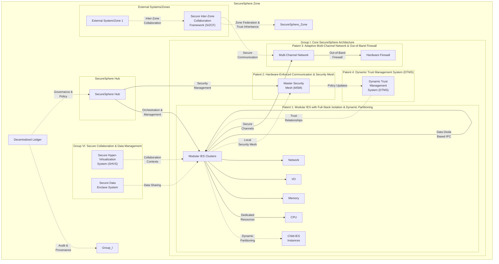
```mermaid
graph TD
    subgraph "SecureSphere Zone"
        subgraph "Group I: Core SecureSphere Architecture"
            subgraph "Patent 1: Modular IES with Full-Stack Isolation & Dynamic Partitioning"
                IES_Cluster["Modular IES Clusters"] -.-> |Dynamic<br>Partitioning| Child_IES["Child-IES<br>Instances"]
                IES_Cluster --> |Dedicated<br>Resources| CPU["CPU"]
                IES_Cluster --> Memory["Memory"]
                IES_Cluster --> IO["I/O"]
                IES_Cluster --> Network["Network"]
            end
            
            subgraph "Patent 2: Hardware-Enforced Communication & Security Mesh"
                IES_Cluster -.-> |Local<br>Security Mesh| Master_Security_Mesh["Master Security<br>Mesh (MSM)"]
                IES_Cluster ---->|Data Diode<br>Based IPC| IES_Cluster
            end
            
            subgraph "Patent 3: Adaptive Multi-Channel Network & Out-of-Band Firewall"
                IES_Cluster --> |Secure<br>Channels| Multi-Channel_Network["Multi-Channel Network"]
                Multi-Channel_Network --> |Out-of-Band<br>Firewall| Firewall["Hardware Firewall"]
            end

            subgraph "Patent 4: Dynamic Trust Management System (DTMS)"
                Dynamic_Trust_Management_System["Dynamic Trust<br>Management<br>System (DTMS)"] -.-> |Trust<br>Relationships| IES_Cluster
                Master_Security_Mesh -.-> |Policy Updates| Dynamic_Trust_Management_System
            end
        end
        
        subgraph "SecureSphere Hub"
            SecureSphere_Hub["SecureSphere Hub"] --> |Orchestration &<br>Management| IES_Cluster
            SecureSphere_Hub --> |Security<br>Management| Master_Security_Mesh
        end

        subgraph "Group VI: Secure Collaboration & Data Management"
            Secure_Hyper-Virtualization_System["Secure Hyper-<br>Virtualization<br>System (SHVS)"] -.-> |Collaboration<br>Contexts| IES_Cluster
            Secure_Data_Enclave_System["Secure Data<br>Enclave System"] -.-> |Data Sharing| IES_Cluster
        end

        subgraph "External Systems/Zones"
            External_System_1["External System/Zone 1"] -.-> |Inter-Zone<br>Collaboration| Secure_Inter-Zone_Collaboration["Secure Inter-Zone<br>Collaboration<br>Framework (SIZCF)"]
        end

        Secure_Inter-Zone_Collaboration -.-> |Zone Federation &<br>Trust Inheritance| SecureSphere_Zone
        Secure_Inter-Zone_Collaboration -.-> |Secure<br>Communication| Multi-Channel_Network

        Decentralized_Ledger["Decentralized Ledger"] -.-> |Audit &<br>Provenance| Group_I
        Decentralized_Ledger -.-> |Governance &<br>Policy| SecureSphere_Hub
    end
```

**Diagram 1 Description:**

-   **Group I Subgraph:** Contains the core elements from Patents 1, 2, 3, and 4, showing their interrelationships.
    -   **Patent 1:** Focuses on the IES structure, highlighting its full-stack isolation and dynamic partitioning capabilities.
    -   **Patent 2:** Emphasizes secure communication between IES instances and the role of the hierarchical security mesh.
    -   **Patent 3:** Illustrates the multi-channel network and out-of-band firewall, crucial for external communication.
    -   **Patent 4:** Shows the DTMS managing trust between IES instances based on input from the MSM.
-   **SecureSphere Hub Subgraph:** Depicts the central control point for the zone, highlighting its management and security oversight of Group I components.
-   **Group VI Subgraph:** Shows two key collaboration technologies (SHVS and Secure Data Enclaves) and their reliance on the secure foundation provided by Group I.
-   **External Systems/Zones Subgraph:** Represents external entities collaborating with the current SecureSphere zone through the SIZCF.
-   **Decentralized Ledger:** The ledger is loosely connected to both Group I and the SecureSphere Hub, highlighting its role in both security auditing/provenance and governance/policy management.

**Key Connections:**

-   **SecureSphere Hub to Group I:** Demonstrates how the Hub orchestrates and manages the core architectural elements.
-   **Group I to Group VI:** Shows how secure collaboration and data management depend on the foundational security provided by the isolated IES, secure communication, and multi-channel network.
-   **Inter-Zone Collaboration:** Highlights the SIZCF's role in connecting to external systems/zones while adhering to the zone's security policies and leveraging the multi-channel network.
-   **Decentralized Ledger Integration:** Shows how the ledger is vital for both auditing the core architecture and providing the foundation for governance and policy decisions.

Diagram 2:

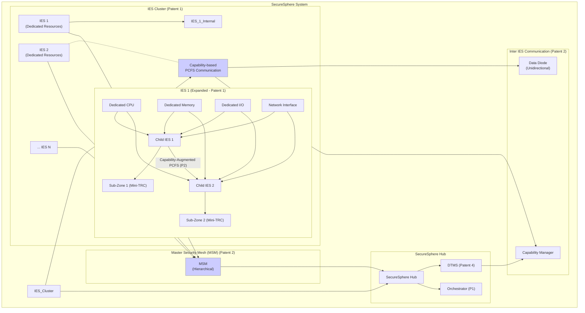
```mermaid
graph LR
    subgraph "SecureSphere System"
        direction LR
        subgraph "IES Cluster (Patent 1)"
            IES1["IES 1<br> (Dedicated Resources)"]
            IES2["IES 2<br> (Dedicated Resources)"]
            IESn["... IES N"]

            subgraph "IES 1 (Expanded - Patent 1)"
                CPU1["Dedicated CPU"]
                Memory1["Dedicated Memory"]
                IO1["Dedicated I/O"]
                NIC1["Network Interface"]
                Zone1["Sub-Zone 1 (Mini-TRC)"]
                Zone2["Sub-Zone 2 (Mini-TRC)"]

                CPU1 --> ChildIES1["Child IES 1"]
                Memory1 --> ChildIES1
                IO1 --> ChildIES1
                NIC1 --> ChildIES1
                ChildIES1 --> Zone1
                
                CPU1 --> ChildIES2["Child IES 2"]
                Memory1 --> ChildIES2
                IO1 --> ChildIES2
                NIC1 --> ChildIES2
                ChildIES2 --> Zone2
                
                ChildIES1 -- "Capability-Augmented PCFS (P2)" --> ChildIES2
            end
            IES1 --> IES_1_Internal

            IES2 -.- IECommunication

        end

        subgraph "Inter IES Communication (Patent 2)"
            IECommunication["Capability-based<br>PCFS Communication"]
            IECommunication --> DataDiode["Data Diode<br>(Unidirectional)"]
            IECommunication ----> CapManager["Capability Manager"]

        end


        IES_Cluster --> IECommunication
        
        subgraph "Master Security Mesh (MSM) (Patent 2)"
            MSM["MSM<br>(Hierarchical)"]
            IES1 --> MSM
            IES2 --> MSM
            IESn --> MSM
        end
        
        subgraph "SecureSphere Hub"
            Hub["SecureSphere Hub"] --> DTMS["DTMS (Patent 4)"]
            Hub --> Orchestrator["Orchestrator (P1)"]
            DTMS --> CapManager
        end
        
        IES_Cluster ----> Hub
        MSM ----> Hub


    end
    
    style MSM fill:#ccf,stroke:#888
    style IECommunication fill:#ccf,stroke:#888
```

**Diagram 2 Description:**

## Patent 1: Modular Isolated Execution Stacks with Hierarchical Zones, Decentralized Trust Management, and Capability-Based Inter-Component Communication

**Abstract:** This invention discloses a secure computing architecture featuring Modular Isolated Execution Stacks (IES), enhanced with hierarchical Zones, decentralized trust management, and path-based inter-component communication. Each IES provides complete hardware-enforced isolation, encompassing dedicated processing, memory, input/output (I/O), and networking resources, preventing unauthorized access and lateral movement of threats. Within each IES, child IES instances are organized into a hierarchy of sub-zones, each associated with a localized Trust Root Configuration (mini-TRC) defining trust roots and policies for granular control. Inter-child-IES communication utilizes a capability-enhanced Packet Carried Forwarding State (PCFS) mechanism, enabling flexible, policy-driven data sharing and resource access. A dynamic partitioning mechanism adjusts child IES instance configurations based on real-time demands and policies, optimizing performance.  A dedicated hardware Security Monitor enforces isolation and access control between child IES instances, while a distributed Resource Manager facilitates resource allocation based on zone-specific policies and resource availability, further leveraging a bandwidth reservation system for guaranteed resource access. This integrated approach establishes a robust and adaptable secure computing foundation.

**Diagram 1:**

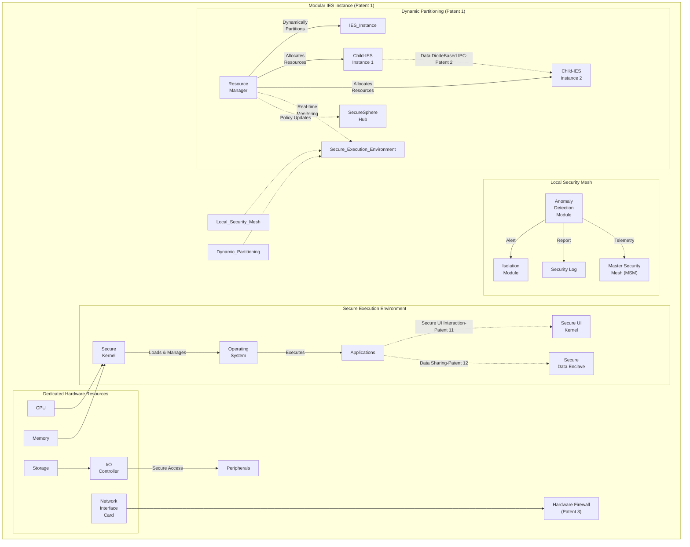
```mermaid
graph TD
    subgraph "Modular IES Instance (Patent 1)"
        subgraph "Dedicated Hardware Resources"
            CPU["CPU"]
            Memory["Memory"]
            Storage["Storage"]
            NIC["Network<br>Interface<br>Card"]
            IO["I/O<br>Controller"]
        end
    
        subgraph "Secure Execution Environment"
            Kernel["Secure<br>Kernel"] --> |Loads & Manages| OS["Operating<br>System"]
            OS --> |Executes| Applications["Applications"]
            Applications -.-> |Secure UI Interaction-Patent 11| Secure_UI_Kernel["Secure UI<br>Kernel"]
            Applications -.-> |Data Sharing-Patent 12| Secure_Data_Enclave["Secure<br>Data Enclave"]
        end

        subgraph "Local Security Mesh"
            Anomaly_Detection["Anomaly<br>Detection<br>Module"] --> |Alert| Isolation_Module["Isolation<br>Module"]
            Anomaly_Detection --> |Report| Security_Log["Security Log"]
            Anomaly_Detection -.-> |Telemetry| Master_Security_Mesh["Master Security<br>Mesh (MSM)"]
        end

        subgraph "Dynamic Partitioning (Patent 1)"
            Resource_Manager["Resource<br>Manager"] --> |Dynamically<br>Partitions| IES_Instance
            Resource_Manager --> |Allocates<br>Resources| Child_IES_1["Child-IES<br>Instance 1"]
            Resource_Manager --> |Allocates<br>Resources| Child_IES_2["Child-IES<br>Instance 2"]
            Child_IES_1 -.-> |Data DiodeBased IPC-Patent 2| Child_IES_2
            Resource_Manager -.-> |Real-time<br>Monitoring| Secure_Execution_Environment
            Resource_Manager -.-> |Policy Updates| SecureSphere_Hub["SecureSphere<br>Hub"]
        end
        CPU --> Kernel
        Memory --> Kernel
        Storage --> IO
        NIC ----> Firewall["Hardware Firewall<br>(Patent 3)"]
        IO --> |Secure Access| Peripherals["Peripherals"]
        Local_Security_Mesh -.-> Secure_Execution_Environment
        Dynamic_Partitioning -.-> Secure_Execution_Environment
    end
```

**Diagram 1 Description:**

-   **Modular IES Instance (Patent 1):** The top-level subgraph representing a single, self-contained IES instance.

-   **Dedicated Hardware Resources:** Subgraph showing the dedicated hardware components within each IES:
    -   **CPU:** Central processing unit for the instance.
    -   **Memory:** Physically isolated memory dedicated to the instance.
    -   **Storage:** Dedicated storage resources for the instance.
    -   **NIC:** Network Interface Card for secure network communication.
    -   **I/O Controller:** Manages secure access to peripherals.

-   **Secure Execution Environment:** Subgraph depicting the software stack running within the isolated IES:
    -   **Secure Kernel:** Loads and manages the operating system and enforces security policies.
    -   **Operating System:** Provides a secure runtime environment for applications.
    -   **Applications:** User-level software running within the IES.
    -   **Connections:** Dashed lines connect "Applications" to the "Secure UI Kernel" (from Patent 11) and "Secure Data Enclave" (from Patent 20), showing how the core IES enables these functionalities.

-   **Local Security Mesh:** Subgraph showing the security monitoring within the IES:
    -   **Anomaly Detection Module:** Monitors system behavior for anomalies.
    -   **Isolation Module:** Isolates the IES in case of a detected anomaly.
    -   **Security Log:** Records security events and alerts.
    -   **Connections:** A dashed line represents telemetry data sent to the "Master Security Mesh" (from Patent 2).

-   **Dynamic Partitioning (Patent 1):** Subgraph illustrating dynamic partitioning capabilities:
    -   **Resource Manager:** Monitors resource utilization, security metrics, and receives policy updates from the SecureSphere Hub to dynamically partition the IES into child-IES instances.
    -   **Child-IES Instances:** Smaller, independent execution units within the main IES, each with allocated resources.
    -   **Connections:** Dashed lines represent the connection to the SecureSphere Hub (for policy updates) and the Secure Execution Environment (for real-time monitoring data). The arrow between Child-IES instances represents secure communication via data diodes (Patent 2).

-   **Other Connections:**
    -   **Hardware to Kernel:** Connections between CPU, Memory, and the Secure Kernel represent the direct hardware access required for the kernel to operate.
    -   **Storage and I/O:** Connections between Storage, I/O Controller, and Peripherals illustrate secure access to peripheral devices.
    -   **Network to Firewall:** The NIC connects to the Hardware Firewall (from Patent 3) for secure external communication.
    -   **Security and Dynamic Partitioning:** Dashed lines connect the Local Security Mesh and Dynamic Partitioning components to the Secure Execution Environment, signifying their monitoring and management roles.

**Diagram 2:**

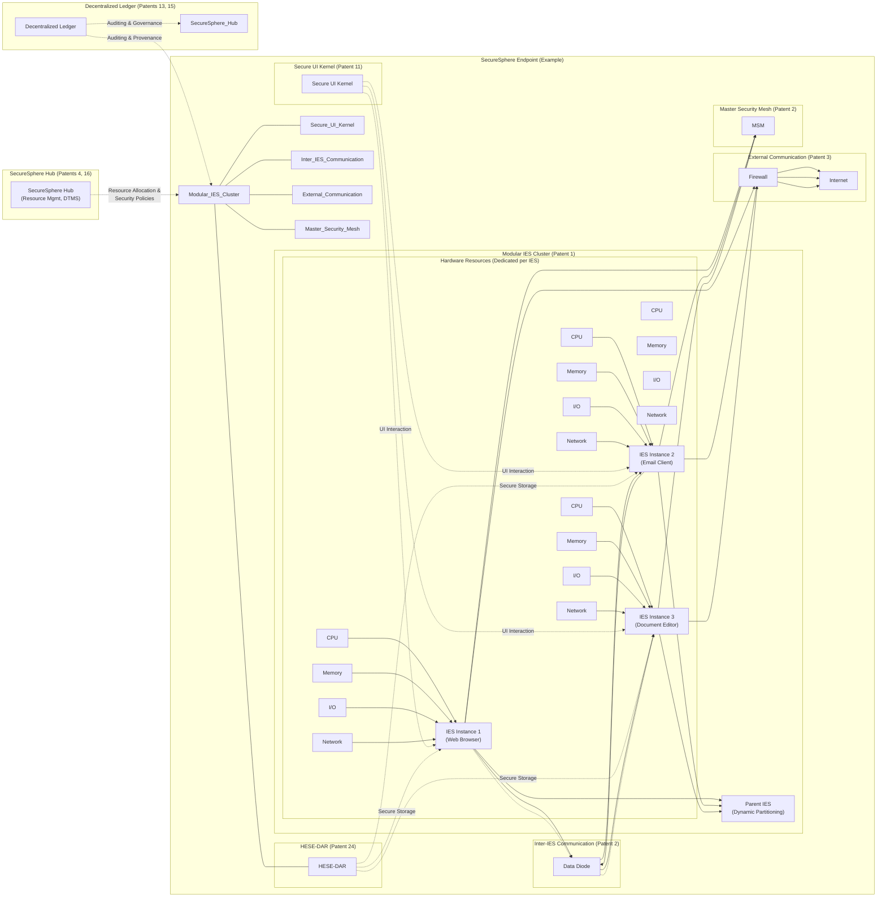
```mermaid
graph LR
    subgraph "SecureSphere Endpoint (Example)"
        direction LR
        subgraph "Modular IES Cluster (Patent 1)"
            IES_1["IES Instance 1<br>(Web Browser)"]
            IES_2["IES Instance 2<br>(Email Client)"]
            IES_3["IES Instance 3<br>(Document Editor)"]
            IES_Parent["Parent IES<br>(Dynamic Partitioning)"]
            IES_1 --> IES_Parent
            IES_2 --> IES_Parent
            IES_3 --> IES_Parent

            subgraph "Hardware Resources (Dedicated per IES)"
                CPU["CPU"]
                Memory["Memory"]
                IO["I/O"]
                Network["Network"]
                CPU_1["CPU"] --> IES_1
                Memory_1["Memory"] --> IES_1
                IO_1["I/O"] --> IES_1
                Network_1["Network"] --> IES_1
                CPU_2["CPU"] --> IES_2
                Memory_2["Memory"] --> IES_2
                IO_2["I/O"] --> IES_2
                Network_2["Network"] --> IES_2
                CPU_3["CPU"] --> IES_3
                Memory_3["Memory"] --> IES_3
                IO_3["I/O"] --> IES_3
                Network_3["Network"] --> IES_3

            end
        end


        subgraph "Secure UI Kernel (Patent 11)"
            UI_Kernel["Secure UI Kernel"]
            UI_Kernel -.-> |UI Interaction| IES_1
            UI_Kernel -.-> |UI Interaction| IES_2
            UI_Kernel -.-> |UI Interaction| IES_3
        end

        subgraph "HESE-DAR (Patent 24)"
            HESE_DAR["HESE-DAR"]
            HESE_DAR -.-> |Secure Storage| IES_1
            HESE_DAR -.-> |Secure Storage| IES_2
            HESE_DAR -.-> |Secure Storage| IES_3
        end

        subgraph "Inter-IES Communication (Patent 2)"
            Data_Diode["Data Diode"]
            IES_1 --> Data_Diode --> IES_2
            IES_2 --> Data_Diode --> IES_3
            IES_1 -.-> Data_Diode -.-> IES_3
        end


        subgraph "External Communication (Patent 3)"
            Firewall["Firewall"]
            IES_1 --> Firewall --> Internet["Internet"]
            IES_2 --> Firewall --> Internet
            IES_3 --> Firewall --> Internet
        end


        subgraph "Master Security Mesh (Patent 2)"
            MSM["MSM"]
            IES_1 --> MSM
            IES_2 --> MSM
            IES_3 --> MSM
        end


        %% Positioning and Connections
        Modular_IES_Cluster --- Secure_UI_Kernel
        Modular_IES_Cluster --- HESE_DAR
        Modular_IES_Cluster --- Inter_IES_Communication
        Modular_IES_Cluster --- External_Communication
        Modular_IES_Cluster --- Master_Security_Mesh

    end
    
    subgraph "SecureSphere Hub (Patents 4, 16)"
        Hub["SecureSphere Hub<br>(Resource Mgmt, DTMS)"] -.-> |Resource Allocation &<br>Security Policies| Modular_IES_Cluster
    end

    subgraph "Decentralized Ledger (Patents 13, 15)"
        Ledger["Decentralized Ledger"] -.-> |Auditing & Governance| SecureSphere_Hub
        Ledger -.-> |Auditing & Provenance| Modular_IES_Cluster
    end
```

**Diagram 2 Description:**

This diagram illustrates Patent 1 (Modular IES) within a broader SecureSphere Endpoint context, demonstrating its integration with other key SecureSphere technologies.  The focus is on showcasing how multiple IES instances operate concurrently and securely within a single endpoint, each with dedicated resources and secure communication channels.

Endpoint Focus: The largest subgraph, "SecureSphere Endpoint," contains all components operating within a single endpoint device.  This provides context for the IES cluster.

Modular IES Cluster (Patent 1): This subgraph depicts the core concept of the patent:

IES Instances: Three IES instances are shown, each dedicated to a specific application (Web Browser, Email Client, Document Editor). This exemplifies how different applications can run in isolated environments. Parent IES (Dynamic Partitioning): This visually represents the capability of a parent IES instance to be dynamically partitioned into child IES instances, enabling granular control and flexible resource allocation. Hardware Resources (Dedicated per IES): Each IES instance has its own dedicated set of hardware resources (CPU, Memory, I/O, Network), enforcing strong isolation.

Secure UI Kernel (Patent 11): Shows the secure UI kernel, which allows user interaction with the isolated IES instances without compromising security.

HESE-DAR (Patent 24): The Hardware-Enforced Secure Encrypted Enclave for Data at Rest is included, demonstrating how data stored by each IES instance can be securely encrypted.

Inter-IES Communication (Patent 2): Shows the use of Data Diodes for secure, unidirectional communication between IES instances, preventing unauthorized data flows.

External Communication (Patent 3):  Illustrates the Firewall mediating external network access for the IES instances, ensuring secure communication with the outside world.

Master Security Mesh (Patent 2): The MSM provides security monitoring and oversight for all IES instances on the endpoint.

SecureSphere Hub (Patents 4, 16): Shows the Hub's role in resource management (Patent 10 is implicitly included) and policy enforcement via the Dynamic Trust Management System (DTMS).

Decentralized Ledger (Patents 13, 15): The ledger is shown as providing auditing and governance functions for both the Hub and the IES cluster.

**Diagram 3:**

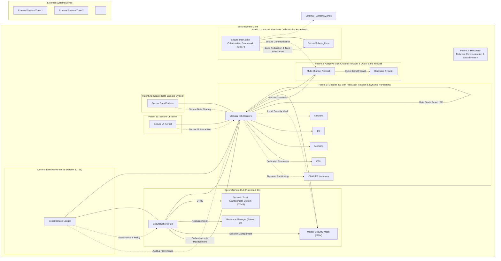
```mermaid
graph LR
    subgraph "SecureSphere Zone"
        direction LR
        
        subgraph "Patent 1: Modular IES with Full Stack Isolation & Dynamic Partitioning"
            IES_Cluster["Modular IES Clusters"] -.-> |Dynamic Partitioning| Child_IES["Child-IES Instances"]
            IES_Cluster --> |Dedicated Resources| CPU["CPU"]
            IES_Cluster --> Memory["Memory"]
            IES_Cluster --> IO["I/O"]
            IES_Cluster --> Network["Network"]
        end
        
        subgraph "SecureSphere Hub (Patents 4, 16)"
            SecureSphere_Hub["SecureSphere Hub"] --> |Orchestration & Management| IES_Cluster
            SecureSphere_Hub --> |Security Management| Master_Security_Mesh["Master Security Mesh (MSM)"]
            SecureSphere_Hub --> |Resource Mgmt| Resource_Manager["Resource Manager (Patent 10)"]
            SecureSphere_Hub --> |DTMS| Dynamic_Trust_Management_System["Dynamic Trust Management System (DTMS)"]
        end
        
        subgraph "Patent 2: Hardware-Enforced Communication & Security Mesh"
            IES_Cluster -.-> |Local Security Mesh| Master_Security_Mesh
            IES_Cluster ---->|Data Diode Based IPC| IES_Cluster
        end
        
        subgraph "Patent 3: Adaptive Multi Channel Network & Out of Band Firewall"
            IES_Cluster --> |Secure Channels| Multi-Channel_Network["Multi-Channel Network"]
            Multi-Channel_Network --> |Out-of-Band Firewall| Firewall["Hardware Firewall"]
        end
        
        subgraph "Patent 11: Secure UI Kernel"
            Secure_UI_Kernel["Secure UI Kernel"] -.-> |Secure UI Interaction| IES_Cluster
        end
        
        subgraph "Patent 20: Secure Data Enclave System"
            Secure_Data_Enclave["Secure Data Enclave"] -.-> |Secure Data Sharing| IES_Cluster
        end
        
        subgraph "Patent 22: Secure InterZone Collaboration Framework"
            Secure_Inter-Zone_Collaboration["Secure Inter-Zone Collaboration Framework (SIZCF)"] -.-> |Zone Federation & Trust Inheritance| SecureSphere_Zone
            Secure_Inter-Zone_Collaboration -.-> |Secure Communication| Multi-Channel_Network
        end
        
        subgraph "Decentralized Governance (Patents 13, 15)"
            Decentralized_Ledger["Decentralized Ledger"] -.-> |Audit & Provenance| IES_Cluster
            Decentralized_Ledger -.-> |Governance & Policy| SecureSphere_Hub
        end
        
        %% Connections
        SecureSphere_Hub --- IES_Cluster
        IES_Cluster --- Master_Security_Mesh
        IES_Cluster --- Multi-Channel_Network
        Secure_UI_Kernel --- IES_Cluster
        Secure_Data_Enclave --- IES_Cluster
        Secure_Inter-Zone_Collaboration --- SecureSphere_Zone
        Decentralized_Ledger --- SecureSphere_Hub
        Decentralized_Ledger --- IES_Cluster
        
    end
    
    subgraph "External Systems/Zones"
        External_System_1["External System/Zone 1"]
        External_System_2["External System/Zone 2"]
        External_System_3["..."]
    end
    
    Secure_Inter-Zone_Collaboration -.-> External_Systems/Zones
```

**Description for Diagram 3:**

This diagram illustrates the connections between the innovation from Patent 1 (Modular IES with Full-Stack Isolation & Dynamic Partitioning) and the rest of the SecureSphere architecture.

**Key Components and Connections:**

1.  **Patent 1: Modular IES**
    -   **IES Cluster**: Represents the core innovation with dynamic partitioning and dedicated resources.
    -   **Connections**:
        -   **SecureSphere Hub**: Orchestrates and manages IES clusters.
        -   **Master Security Mesh (MSM)**: Provides security oversight for IES clusters.
        -   **Resource Manager**: Manages resources for IES clusters.
        -   **Dynamic Trust Management System (DTMS)**: Manages trust for IES clusters.
2.  **SecureSphere Hub (Patents 4, 16)**
    -   **Connections**:
        -   **IES Cluster**: Manages and orchestrates IES clusters.
        -   **Master Security Mesh (MSM)**: Receives security updates from the MSM.
        -   **Resource Manager**: Utilizes resource management for IES clusters.
        -   **Dynamic Trust Management System (DTMS)**: Leverages DTMS for trust management.
3.  **Patent 2: Hardware-Enforced Communication & Security Mesh**
    -   **Connections**:
        -   **IES Cluster**: Enables local security mesh and data diode-based IPC.
        -   **Master Security Mesh (MSM)**: Integrates with the MSM for comprehensive security.
4.  **Patent 3: Adaptive Multi-Channel Network & Out-of-Band Firewall**
    -   **Connections**:
        -   **IES Cluster**: Provides secure channels for IES clusters.
        -   **Hardware Firewall**: Offers out-of-band firewall protection.
5.  **Patent 11: Secure UI Kernel**
    -   **Connections**:
        -   **IES Cluster**: Enables secure UI interaction with IES clusters.
6.  **Patent 20: Secure Data Enclave System**
    -   **Connections**:
        -   **IES Cluster**: Facilitates secure data sharing with IES clusters.
7.  **Patent 22: Secure Inter-Zone Collaboration Framework**
    -   **Connections**:
        -   **SecureSphere Zone**: Enables zone federation and trust inheritance.
        -   **Multi-Channel Network**: Utilizes secure communication channels.
8.  **Decentralized Governance (Patents 13, 15)**
    -   **Connections**:
        -   **IES Cluster**: Provides audit and provenance for IES clusters.
        -   **SecureSphere Hub**: Enables governance and policy management.

**How it Connects the Innovation to the Rest of SecureSphere:**

1.  **Security and Isolation**: The diagram shows how Patent 1's innovation in modular IES with full-stack isolation and dynamic partitioning connects with other security-focused components (Patent 2, Master Security Mesh, SecureSphere Hub).
2.  **Resource Management and Orchestration**: The connections between the IES cluster, Resource Manager, and SecureSphere Hub highlight the efficient management of resources and orchestration of IES clusters.
3.  **Secure Communication and Collaboration**: The diagram illustrates how Patent 1's innovation integrates with secure communication channels (Patent 3), secure UI interaction (Patent 11), and secure data sharing (Patent 20) for comprehensive security.
4.  **Governance and Policy Management**: The connections with Decentralized Governance (Patents 13, 15) and the SecureSphere Hub demonstrate the integration of audit, provenance, governance, and policy management.

**Diagram 4:**

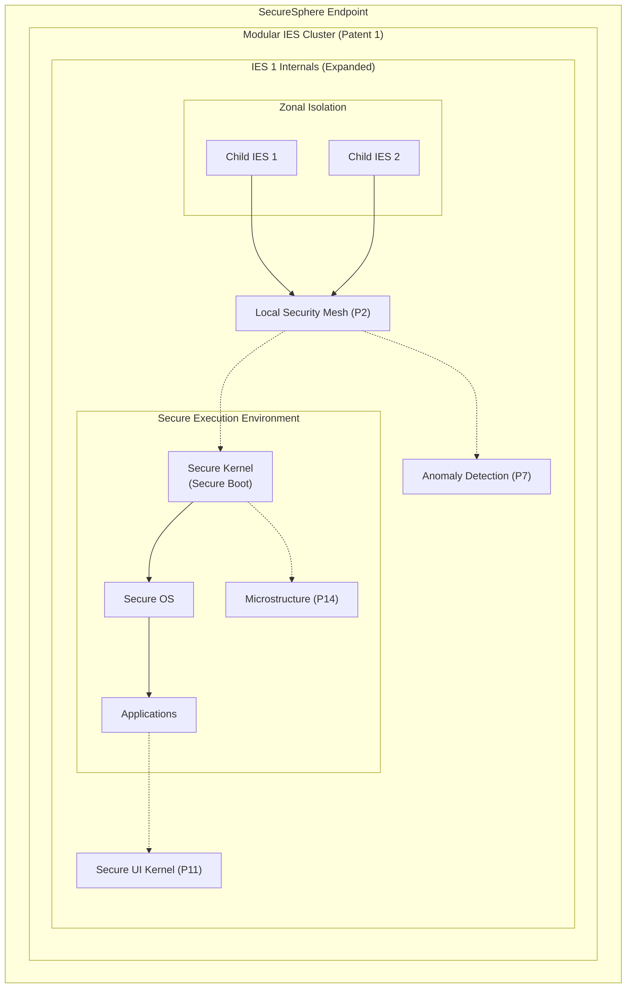
```mermaid
graph TD
    subgraph "SecureSphere Endpoint"
        subgraph "Modular IES Cluster (Patent 1)"
            subgraph "IES 1 Internals (Expanded)"
                subgraph "Zonal Isolation"
                    ChildIES1["Child IES 1"]
                    ChildIES2["Child IES 2"]
                end

                subgraph "Secure Execution Environment"
                    Kernel["Secure Kernel<br>(Secure Boot)"]
                    OS["Secure OS"]
                    Kernel --> OS --> Apps["Applications"]
                    Kernel -.-> Microstructure["Microstructure (P14)"]
                end
                
                LSM["Local Security Mesh (P2)"] -.-> AnomalyDetection["Anomaly Detection (P7)"]
                LSM -.-> Kernel
                ChildIES1 --> LSM
                ChildIES2 --> LSM
                Apps -.-> SecureUIKernel
                SecureUIKernel["Secure UI Kernel (P11)"]
            end
        end
    end
```

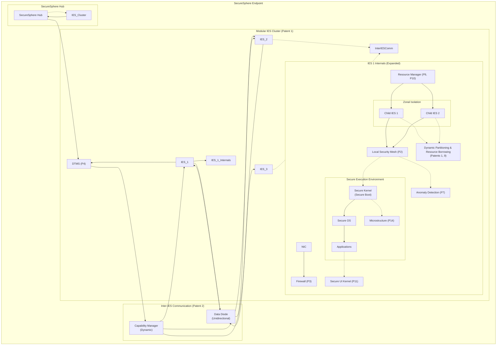
```mermaid
graph
    subgraph "SecureSphere Endpoint"
        subgraph "Modular IES Cluster (Patent 1)"
            subgraph "IES 1 Internals (Expanded)"
                subgraph "Zonal Isolation"
                    ChildIES1["Child IES 1"]
                    ChildIES2["Child IES 2"]
                end

                subgraph "Secure Execution Environment"
                    Kernel["Secure Kernel<br>(Secure Boot)"]
                    OS["Secure OS"]
                    Kernel --> OS --> Apps["Applications"]
                    Kernel -.-> Microstructure["Microstructure (P14)"]
                end
                
                LSM["Local Security Mesh (P2)"] -.-> AnomalyDetection["Anomaly Detection (P7)"]
                LSM -.-> Kernel
                ChildIES1 --> LSM
                ChildIES2 --> LSM
                RM["Resource Manager (P9, P10)"] --> ChildIES1
                RM --> ChildIES2
                ChildIES1 -.-> DynamicPartitioning
                ChildIES2 -.-> DynamicPartitioning
                DynamicPartitioning["Dynamic Partitioning & Resource Borrowing<br>(Patents 1, 9)"]
                
                NIC --> Firewall["Firewall (P3)"]
                
                Apps -.-> SecureUIKernel
                SecureUIKernel["Secure UI Kernel (P11)"]
            end
            IES_1 --> IES_1_Internals
            
            IES_2 -.-> InterIESComm
            IES_3 -.-> InterIESComm
            IES_1 ----> DTMS["DTMS (P4)"]
        end

        subgraph "Inter-IES Communication (Patent 2)"
            DataDiode["Data Diode<br>(Unidirectional)"]
            CapManager["Capability Manager <br>(Dynamic)"]
            IES_1 --> DataDiode --> IES_2
            IES_2 --> DataDiode --> IES_1
            DTMS --> CapManager
            CapManager --> IES_1
            CapManager --> IES_2
            CapManager --> IES_3
        end

        subgraph "SecureSphere Hub"
            Hub["SecureSphere Hub"] -.-> IES_Cluster
            Hub --> DTMS
        end
        IES_Cluster --> Hub
    end
```

**Description for Diagram 4:**

This diagram illustrates the detailed internals of a SecureSphere endpoint, focusing on the Modular IES Cluster as described in Patent 1 and its integration with the secure communication mechanisms of Patent 2.  The diagram uses a layered approach, highlighting the hardware and software components within an IES, the secure communication channels between IES instances, and the overarching management and security provided by the SecureSphere Hub and the Master Security Mesh (MSM).

**1. SecureSphere Endpoint (Example):** This top-level subgraph encapsulates the components and interactions within a representative SecureSphere endpoint.  The "direction LR" declaration sets the layout direction from left to right.

**2. Modular IES Cluster (Patent 1):** This subgraph represents a cluster of IES instances, the core of SecureSphere's isolation technology.

-   **IES Instances:** Shows three IES instances (IES 1, IES 2, IES 3) with labels indicating example applications (Web Browser, Email Client, Document Editor). This illustrates how different applications run in isolated environments.
-   **IES 1 Internals (Expanded):** This nested subgraph provides a detailed view inside a single IES instance.
    -   **Dedicated Resources:** Shows the dedicated hardware components: CPU, Memory, I/O, and Network Interface (NIC), emphasizing the full-stack hardware isolation of each IES.
    -   **Zonal Isolation:** This subgraph highlights the novel hierarchical zone concept *within* an IES.  Child IES instances (Child IES 1, Child IES 2) are associated with sub-zones (Zone 1, Zone 2), each with its own mini-TRC for granular trust and policy management. The capability-augmented PCFS (Patent 2) communication between child IES instances is shown, enabling controlled data sharing within the IES.
    -   **Secure Execution Environment:** This subgraph details the software stack within the IES: the Secure Kernel (with Secure Boot for trusted boot), the Secure OS, and the Applications. A dotted line to "Microstructure (P14)" indicates the integration of 3D microstructures for tamper evidence during boot and attestation.
    -   **Local Security Mesh (P2):** The LSM monitors internal activity within the IES and connects to the Anomaly Detection system (Patent 7).  It also interacts with the Secure Kernel for security policy enforcement. The LSM connects to both child IES instances, ensuring their security.
    -   **Resource Manager (P9, P10):** Manages resource allocation within the IES and interacts with both child IES instances. The dotted line to "Dynamic Partitioning & Resource Borrowing (Patents 1, 9)" indicates these functions.
    -   **Firewall (P3):** The dedicated firewall connected to the NIC provides network security for the IES.
    -   **Secure UI Kernel (P11):** A dotted line indicates the connection to the Secure UI Kernel for secure user interaction.
-   **Inter-IES Communication (P2):** Dotted lines connect IES 2 and IES 3 to this subgraph, highlighting how Patent 2's secure communication mechanisms facilitate inter-IES interaction.

**3. Inter-IES Communication (Patent 2):** This subgraph details the secure communication mechanisms between IES instances.

-   **Data Diode (Unidirectional):** Represents hardware-enforced unidirectional communication channels, providing strong isolation for sensitive data flows.
-   **Capability Manager (Dynamic):** Manages the dynamically reconfigurable capabilities used for controlling access between IES instances.  It receives input from the DTMS (Patent 4) for trust-based capability adjustments.
-   **Connections:** Arrows show unidirectional communication between IES instances via Data Diodes.  The Capability Manager distributes capabilities to all IES instances.

**4.  SecureSphere Hub:** Represents the central management entity.

-   **Connections:** A dotted line to the IES Cluster signifies its orchestration role.  The connection to the DTMS highlights the Hub's involvement in trust management.

This detailed description clarifies the components, interactions, and data flows within a SecureSphere endpoint, focusing on the innovations of Patents 1 and 2.  The layered structure and explicit patent references aid in understanding the system's architecture and security mechanisms. This visualization is instrumental in conveying the novel aspects and benefits of SecureSphere's hardware-rooted security approach.

**Diagram 5:**

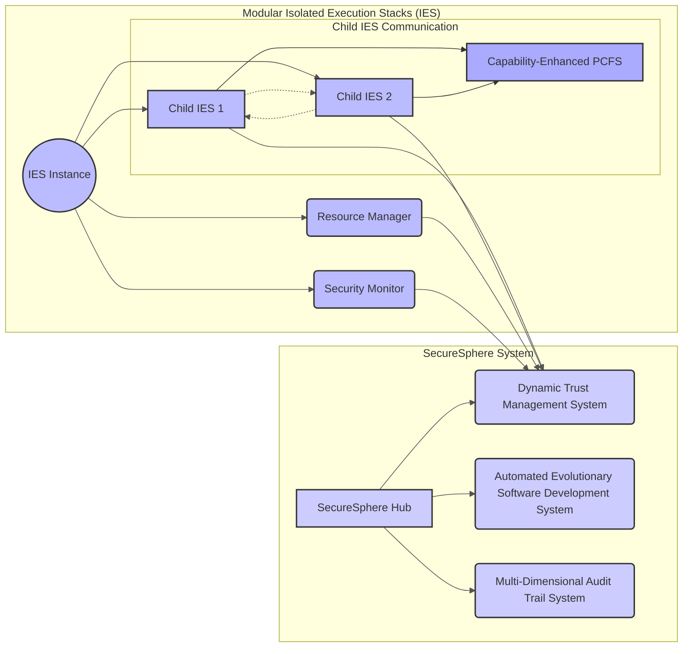
```mermaid
graph LR
    subgraph SecureSphere_System["SecureSphere System"]
        A[SecureSphere Hub] --> B(Dynamic Trust Management System);
        A --> C(Automated Evolutionary Software Development System);
        A --> D(Multi-Dimensional Audit Trail System);
        style A fill:#ccf,stroke:#333,stroke-width:2px
        style B fill:#ccf,stroke:#333,stroke-width:2px
        style C fill:#ccf,stroke:#333,stroke-width:2px
        style D fill:#ccf,stroke:#333,stroke-width:2px
        class A,B,C,D secure
    end

    subgraph IES_Module["Modular Isolated Execution Stacks (IES)"]
        E((IES Instance)) --> F(Resource Manager);
        E --> G(Security Monitor);
        E --> H[Child IES 1];
        E --> I[Child IES 2];
        F --> B;
        G --> B;
        H --> B;
        I --> B;
        H -.-> I;
        I -.-> H;
        style E fill:#bbf,stroke:#333,stroke-width:2px
        style F fill:#bbf,stroke:#333,stroke-width:2px
        style G fill:#bbf,stroke:#333,stroke-width:2px
        style H fill:#bbf,stroke:#333,stroke-width:2px
        style I fill:#bbf,stroke:#333,stroke-width:2px
        class E,F,G,H,I ies
        subgraph Child_IES_Communication["Child IES Communication"]
            H --> J[Capability-Enhanced PCFS];
            I --> J;
            style J fill:#aaf,stroke:#333,stroke-width:2px
            class J communication
        end
    end

    linkStyle 0,1,2,3,4,5,6,7,8,9,10,11,12 stroke:#555,stroke-width:1px

    classDef secure fill:#ccf,stroke:#333,stroke-width:2px
    classDef ies fill:#bbf,stroke:#333,stroke-width:2px
    classDef communication fill:#aaf,stroke:#333,stroke-width:2px
```

**Description for Diagram 5:**

**System for Secure and Trustworthy Computation and Communication**

This diagram presents a novel SecureSphere system and method for achieving secure and trustworthy computation and communication across multiple isolated execution environments (IES) and zones, even in the presence of compromised components or hostile external actors.  The SecureSphere system leverages a combination of hardware-enforced isolation, dynamic trust management, AI-driven security adaptations, and multi-dimensional auditing to provide an unprecedented level of security and resilience.

**1. System Architecture:**

The SecureSphere system comprises several interconnected modules, as illustrated in the accompanying diagram. The core components are:

-   **SecureSphere Hub:** A central orchestration and management unit that oversees the entire system, managing resources, policies, and inter-module communication.
-   **Dynamic Trust Management System (DTMS):**  A distributed system responsible for establishing, maintaining, and updating trust relationships between IES instances and zones. The DTMS uses Trust Root Configurations (TRCs), dynamic trust metrics, decentralized zone management (DZMS), policy negotiation, and distributed consensus to manage trust dynamically and adaptively.  TRCs are stored on a decentralized ledger for enhanced security and auditability.
-   **Automated Evolutionary Software Development System (AESDS):** An AI-driven system responsible for the development, testing, and deployment of software for all SecureSphere components.  The AESDS incorporates an Isomorphic Architecture Monitoring and Adaptation (IAMA) module that monitors and adapts to threats originating from integrated legacy systems.  Software updates are deployed securely through authenticated channels and verified using TRCs before installation.
-   **Multi-Dimensional Audit Trail System (MDATS):** A system for comprehensive auditing, encompassing both digital logs (stored on the decentralized ledger) and physical tamper-evident 3D-printed microstructures, correlated and analyzed by an AI to detect anomalies. MDATS creates a multi-dimensional audit trail encompassing software provenance, hardware attestation, and operational events.

**2. Secure Inter-IES Communication:**

Secure communication between IES instances is achieved through a novel dual-channel architecture:

-   **Data Diodes:** Provide unidirectional, high-assurance communication for sensitive data transfers.
-   **Capability-Enhanced Packet-Carried Forwarding State (CE-PCFS):**  A capability-based communication protocol that grants fine-grained control over data access at the packet level.  Capabilities are dynamically assigned and managed by the SecureSphere Hub's Capability Manager, based on real-time assessments of trust, resource availability, and policy. The CE-PCFS utilizes hop fields encoding capabilities and policy information to allow for secure routing and access control, reducing reliance on central management.

The communication architecture incorporates a hierarchical security mesh (MSM) for real-time monitoring and anomaly detection within individual IES instances and across the entire system.

**3. Supporting Technologies:**

The SecureSphere system utilizes a variety of supporting technologies, including but not limited to:

-   Secure Boot
-   Multi-Factor Authentication (MFA)
-   Secure UI Kernel
-   Chiplet Architecture
-   Decentralized Ledger Technology
-   Secure Hyper-Virtualization System (SHVS)
-   Federated Learning
-   Secure Data Enclaves
-   Quantum-Resistant Communication (QKD, DKM, PQC)
-   Zero-Knowledge Execution Environment (ZKEE)
-   Secure Resource Borrowing Mechanism (SRBM)
-   AI-powered Resource Allocation
-   Hardware-Enforced Anomaly Detection
-   Hardware-Based Memory Protection
-   Hardware-Enforced Secure Encrypted Enclave for Data at Rest (HESE-DAR)
-   Sovereign Trust Network (STN) for secure off-site connectivity
-   Dynamic Trust Gateway (DTG) for secure mediation with external networks

**4. Claims:**

This patent application claims:

1.  A system for secure computation and communication comprising the interconnected modules described above.
2.  A method for dynamic trust management using TRCs, dynamic trust metrics, and decentralized consensus.
3.  A method for secure inter-IES communication employing a dual-channel architecture with data diodes and CE-PCFS.
4.  A method for AI-driven software development, testing, and deployment utilizing sandboxing, secure distribution, and TRC-based verification.
5.  A multi-dimensional auditing system that combines digital and physical audit trails, leveraging AI for anomaly detection and software provenance tracking.
6.  The SecureSphere Hub’s orchestration and management of the interconnected modules and their dynamic interactions.
7.  The utilization of the CE-PCFS protocol for fine-grained control over data access.
8.  The use of the DTG for securely mediating communication between the SecureSphere system and external networks.
9.  The use of the STN for establishing highly secure, isolated communication channels with off-site systems.
10. The use of the HESE-DAR for secure storage of data at rest and key management.

**Claims:**

**Independent Claim 1:**

A secure communication system for a computing environment comprising a plurality of Modular Isolated Execution Stacks (IES), each IES having dedicated processing, memory, and communication resources, and organized into a hierarchy of Zones, each Zone associated with a Trust Root Configuration (TRC), the system comprising:

(a) secure communication channels between said IES instances, including:
    (i) hardware-enforced unidirectional communication channels ensuring data flows in a single, predetermined direction, said channels implemented using at least one of: miniaturized data diodes, dedicated unidirectional network interfaces, or dedicated hardware logic circuits; and
    (ii) dynamically reconfigurable, capability-augmented PCFS channels, wherein each PCFS channel utilizes a sequence of hop fields, each hop field encoding:
        (1) forwarding information, including source and destination IES instance identifiers, path segments through the multi-channel network (Patent 3), and intermediate relay points;
        (2) a dynamically issued capability granting specific access rights (read, write, execute) to designated memory regions or functionalities within the destination IES instance, said capability further specifying permitted address ranges, object types, and a limited lifetime, subject to revocation by a Capability Manager; and
        (3) fine-grained policy information, including at least one of: rate limiting parameters, quality of service (QoS) requirements, security check specifications, data sensitivity labels, or communication context metadata, expressed using a declarative language;

(b) a hierarchical Security Mesh, comprising:
    (i) a local security mesh within each IES instance, monitoring internal communication events and resource access attempts; and
    (ii) a Master Security Mesh (MSM) overseeing the system, receiving security telemetry from said local security meshes, enforcing system-wide security policies, and coordinating security responses, wherein said Security Mesh is integrated with a Dynamic Trust Management System (DTMS) (Patent 4) to manage trust relationships and enforce trust-based access control policies between IES instances;

(c) a consent protocol, wherein establishing a PCFS communication channel between two IES instances requires mutual agreement, said agreement based on at least one of: communication type, data sensitivity level, trust levels of participating IES instances, compliance with predefined communication policies, or resource availability; and

(d) a decentralized policy management system, wherein each Zone can define its own inter-IES communication policies, said policies expressed in a declarative language and stored on a distributed ledger (Patent 15), and wherein a distributed consensus mechanism is used to resolve policy conflicts between Zones.

**Dependent Claims:**

2.  The system of claim 1, wherein said dynamically issued capabilities are cryptographically protected using at least one of: digital signatures, message authentication codes (MACs), or keyed-hash message authentication codes (HMACs), or a combination thereof, ensuring integrity and authenticity.
3.  The system of claim 1, wherein said capabilities have limited lifetimes and are subject to revocation by a Capability Manager residing within the SecureSphere Hub, said revocation implemented using a secure revocation mechanism, including at least one of: certificate revocation lists (CRLs), online certificate status protocol (OCSP), or a distributed ledger-based revocation registry.
4.  The system of claim 1, wherein said Capability Manager dynamically adjusts capability permissions in real time based on at least one of: trust levels of said IES instances, real-time resource utilization metrics, system-wide security policies defined by a decentralized governance system (Patent 13), error handling feedback received from said IES instances, or a combination thereof.
5.  The system of claim 1, further comprising dedicated hardware within a central management entity for assisting in managing said capabilities, said hardware performing at least one of: capability storage, lookup, validation, secure distribution of said capabilities to said IES instances, or a combination thereof.
6.  The system of claim 5, wherein said dedicated hardware is implemented as at least one hot-swappable chiplet integrated into the SecureSphere Hub.
7.  The system of claim 1, wherein the integrity and authenticity of hop field data are verified using at least one of: digital signatures, message authentication codes (MACs), or a 3D-printed microstructure (Patent 14) corresponding to the hop field data or a cryptographic hash thereof, or a combination thereof.
8.  The system of claim 1, wherein said consent protocol utilizes cryptographically signed consent tokens exchanged between IES instances, said tokens representing mutual agreement based on the specified criteria.
9.  The system of claim 1, wherein said hierarchical security mesh monitors the timing of inter-IES communication events and detects timing anomalies indicative of potential side-channel attacks, wherein said detection triggers a security response, including at least one of: adjusting capability permissions, modifying routing policies within the multi-channel network (Patent 3), or isolating the affected IES instance.
10. The system of claim 1, wherein said hierarchical security mesh utilizes AI-powered anomaly detection techniques to identify suspicious communication patterns and deviations from established baselines, triggering security responses and dynamically updating security policies within the system.
11. The system of claim 1, wherein said multi-kernel computing system comprises a plurality of Modular Isolated Execution Stacks (IES) (Patent 1), and wherein said components correspond to said IES instances.
12. The system of claim 1, wherein said PCFS data plane utilizes a message authentication scheme based on message authentication code to enforce data integrity and authenticity at the granularity of each hop.

## Patent 3: Adaptive Multi-Channel Network with Declarative Policy Enforcement and Capability-Aware Forwarding

**Abstract:** This invention discloses a secure and adaptive multi-channel network architecture for physically isolated execution environments, specifically designed for systems utilizing Modular Isolated Execution Stacks (IES).  The architecture features dynamically configurable, physically segregated network channels, each dedicated to a specific security domain, communication purpose, or trust level, preventing cross-channel interference and data leakage.  A novel aspect of this invention is the use of declarative policies to define channel configurations, firewall rules, routing policies, and access control mechanisms.  These policies, expressed in a high-level language and stored on a decentralized, tamper-proof ledger, enable automated and auditable network management.  The architecture incorporates an out-of-band hardware firewall system, operating independently of the primary operating system and IES instances, providing dedicated firewall instances for each network channel with hardware-accelerated policy enforcement.  Furthermore, a capability-aware forwarding mechanism leverages capabilities embedded within hop fields of inter-IES communication packets (Patent 2), enabling fine-grained access control and dynamic traffic management based on trust levels, resource availability, and real-time security assessments. The inclusion of dedicated, isolated channels for legacy internet access ensures backward compatibility without compromising the security of the core network. This integrated approach creates a highly secure, adaptable, and efficient multi-channel network, enabling granular control, dynamic adaptation, and automated management while supporting diverse security requirements and legacy system integration.

**Diagram:**

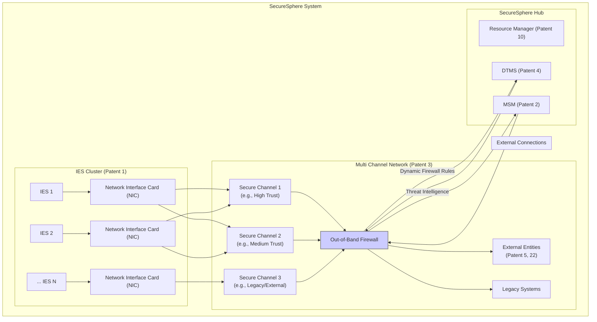
```mermaid
graph LR
    subgraph SecureSphere_System["SecureSphere System"]
        direction LR
        subgraph IES_Cluster["IES Cluster (Patent 1)"]
            IES_1["IES 1"]
            IES_2["IES 2"]
            IES_N["... IES N"]

            IES_1 --> NIC_1["Network Interface Card (NIC)"]
            IES_2 --> NIC_2["Network Interface Card (NIC)"]
            IES_N --> NIC_N["Network Interface Card (NIC)"]
        end

        subgraph Multi_Channel_Network["Multi Channel Network (Patent 3)"]
            Channel_1["Secure Channel 1<br>(e.g., High Trust)"]
            Channel_2["Secure Channel 2<br>(e.g., Medium Trust)"]
            Channel_3["Secure Channel 3<br>(e.g., Legacy/External)"]

            NIC_1 --> Channel_1
            NIC_1 --> Channel_2
            NIC_2 --> Channel_1
            NIC_2 --> Channel_2
            NIC_N --> Channel_3

            Channel_1 --> Firewall["Out-of-Band Firewall"]
            Channel_2 --> Firewall
            Channel_3 --> Firewall
            
            Firewall --> External_Entities
            Firewall --> Legacy_Systems
        end

        subgraph External_Connections["External Connections"]
            External_Entities["External Entities<br>(Patent 5, 22)"]
            Legacy_Systems["Legacy Systems"]
        end

        subgraph SecureSphere_Hub["SecureSphere Hub"]
            RM["Resource Manager (Patent 10)"]
            DTMS["DTMS (Patent 4)"]
            MSM["MSM (Patent 2)"]
            
            DTMS --> Firewall
            MSM --> Firewall
            
            Firewall --> |Dynamic Firewall Rules| DTMS
            Firewall --> |Threat Intelligence| MSM
        end
    end

    style Firewall fill:#ccf,stroke:#888,stroke-width:2px
```

**Description of Diagram:**

This diagram illustrates Patent 3, the Adaptive Multi-Channel Network with an Out-of-Band Firewall, within the SecureSphere System.  It demonstrates how physically segregated channels and the independent firewall enhance security.

1.  **SecureSphere System:** This top-level subgraph contains all the components of the multi-channel network and its related elements.
2.  **IES Cluster (Patent 1):** Shows multiple IES instances, each with a dedicated Network Interface Card (NIC).
3.  **Multi-Channel Network (Patent 3):** This subgraph represents the core of Patent 3.
    -   **Secure Channel 1, 2, 3:** Physically separate network channels, each dedicated to a specific security domain or purpose (e.g., high trust, medium trust, legacy/external).
    -   **Network Interface Cards (NICs):** Each IES instance connects to one or more secure channels via its NIC. The diagram illustrates how different IES instances can be connected to different channels or multiple channels based on their trust levels and communication needs.
    -   **Out-of-Band Firewall:** A hardware firewall operating independently of the IES instances and the main OS, providing separate firewall instances for each channel.
    -   **External Entities (Patents 5, 22):** Represent external systems or zones that SecureSphere communicates with, potentially using quantum-resistant communication (Patent 5) and the SIZCF (Patent 22).
    -   **Legacy Systems:** Represent older systems that require connection via a dedicated legacy channel.
4.  **SecureSphere Hub:**
    -   **Resource Manager (Patent 10):** Can dynamically adjust network channel allocation based on resource needs and security policies.
    -   **DTMS (Patent 4):** Provides dynamic firewall rules based on the trust level of communicating entities and zones.
    -   **MSM (Patent 2):** Provides real-time threat intelligence to the firewall for adaptive security responses.

**Key Features and Interactions:**

-   **Physically Segregated Channels:** The diagram clearly shows the physical separation of network channels, preventing cross-channel interference and data leakage.
-   **Out-of-Band Firewall:** The independent operation of the firewall is emphasized, enhancing security even if an IES instance is compromised.
-   **Adaptive Routing and Segmentation (Implicit):** While not explicitly shown, the diagram's structure supports the concept of adaptive routing and segmentation within each channel based on security policies and real-time threat assessments.
-   **Legacy System Compatibility:** The dedicated legacy channel ensures backward compatibility without compromising the security of other channels.
-   **Integration with SecureSphere:** The diagram highlights the integration with Patents 1, 2, 4, 5, 10, and 22, illustrating Patent 3's importance within the overall SecureSphere architecture.  The connections from the DTMS and MSM to the Firewall emphasize the dynamic and adaptive nature of the network security.

**Diagram 2:**

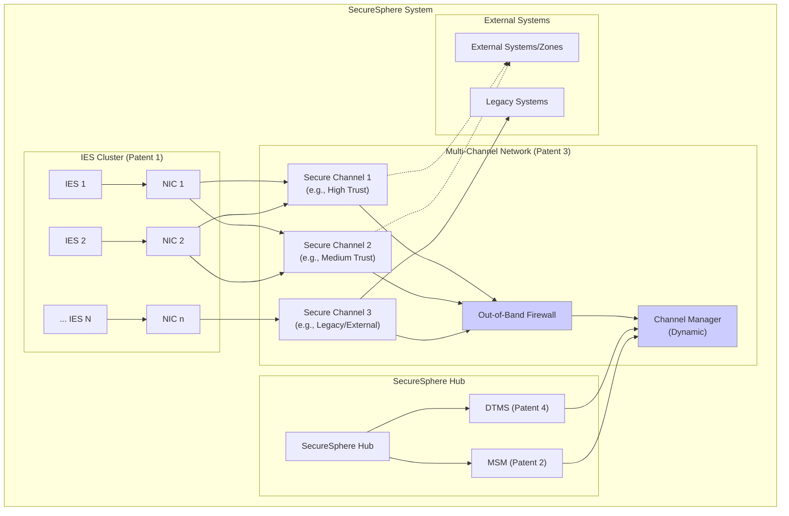
```mermaid
graph LR
    subgraph "SecureSphere System"
        direction LR
        subgraph "IES Cluster (Patent 1)"
            IES1["IES 1"]
            IES2["IES 2"]
            IESn["... IES N"]
            IES1 --> NIC1["NIC 1"]
            IES2 --> NIC2["NIC 2"]
            IESn --> NICn["NIC n"]
        end

        subgraph "Multi-Channel Network (Patent 3)"
            Channel1["Secure Channel 1<br>(e.g., High Trust)"]
            Channel2["Secure Channel 2<br>(e.g., Medium Trust)"]
            Channel3["Secure Channel 3<br>(e.g., Legacy/External)"]
            NIC1 --> Channel1
            NIC1 --> Channel2
            NIC2 --> Channel1
            NIC2 --> Channel2
            NICn --> Channel3
            Channel1 --> Firewall["Out-of-Band Firewall"]
            Channel2 --> Firewall
            Channel3 --> Firewall
            Firewall --> ChannelManager["Channel Manager<br>(Dynamic)"]
        end

        subgraph "SecureSphere Hub"
            Hub["SecureSphere Hub"] --> DTMS["DTMS (Patent 4)"]
            Hub --> MSM["MSM (Patent 2)"]
            DTMS --> ChannelManager
            MSM --> ChannelManager
        end

        subgraph "External Systems"
            External["External Systems/Zones"]
            Legacy["Legacy Systems"]
            Channel1 -.-> External
            Channel2 -.-> External
            Channel3 --> Legacy        
        end
    end
    style Firewall fill:#ccf,stroke:#888
    style ChannelManager fill:#ccf,stroke:#888
```

**Description for Diagram 2:**

This diagram focuses on Patent 3, showcasing the Adaptive Multi-Channel Network and its integration with other SecureSphere components.

-   **IES Cluster (Patent 1):** Shows several IES instances, each with its own Network Interface Card (NIC).  This emphasizes that each IES can communicate through the multi-channel network.
-   **Multi-Channel Network (Patent 3):** This subgraph contains the core elements of the patent:
    -   **Secure Channel 1, 2, 3:** Represents physically separate network channels with different trust levels or purposes. Example labels (High Trust, Medium Trust, Legacy/External) clarify this.
    -   **Out-of-Band Firewall:** The firewall is positioned outside the channels but connected to each, emphasizing its out-of-band nature and its role in protecting all channels.
    -   **Channel Manager (Dynamic):** Manages the network channels dynamically, based on input from the DTMS and MSM.  Its central position highlights its control over the network configuration.
-   **SecureSphere Hub:** Includes the DTMS (Patent 4) and MSM (Patent 2), which provide input to the Channel Manager.
-   **External Systems/Zones and Legacy Systems:** Represent external entities and legacy systems that SecureSphere communicates with. Channel 3 is specifically connected to Legacy Systems, showing the dedicated channel for backward compatibility.  Channels 1 and 2 connect to External Systems/Zones via dotted lines to represent the potential for dynamic routing and connection management.
-   **Interconnections:** Solid lines show direct connections, while dotted lines represent potential or dynamically managed connections.  Arrows indicate the direction of data flow.
-   **Color Coding:** The light blue highlights the core Patent 3 components (Firewall, Channel Manager).

**Key Features and Enhancements:**

-   **Patent 3 Focus:** This diagram clearly emphasizes the Multi-Channel Network and its key features.
-   **Out-of-Band Firewall:** The diagram visually separates the firewall from the channels to reinforce its out-of-band nature, a crucial security feature.
-   **Dynamic Channel Management:** The Channel Manager's connections to the DTMS and MSM show how security and trust information influence channel configuration.
-   **SecureSphere Integration:** The diagram illustrates how Patent 3 integrates with Patents 1, 2, and 4.

This diagram provides a concise and informative visualization of the key innovations of Patent 3. It highlights the adaptive, secure, and multi-layered nature of the network, making it easier for a technical audience to understand the patent's value proposition.  The focused approach allows for a more in-depth illustration of the network architecture and its integration within SecureSphere, compared to a diagram that attempts to cover all patents simultaneously. This clarity is particularly helpful for investors, partners, and technical discussions focused specifically on the adaptive multi-channel network technology.

**DIagram 3:**

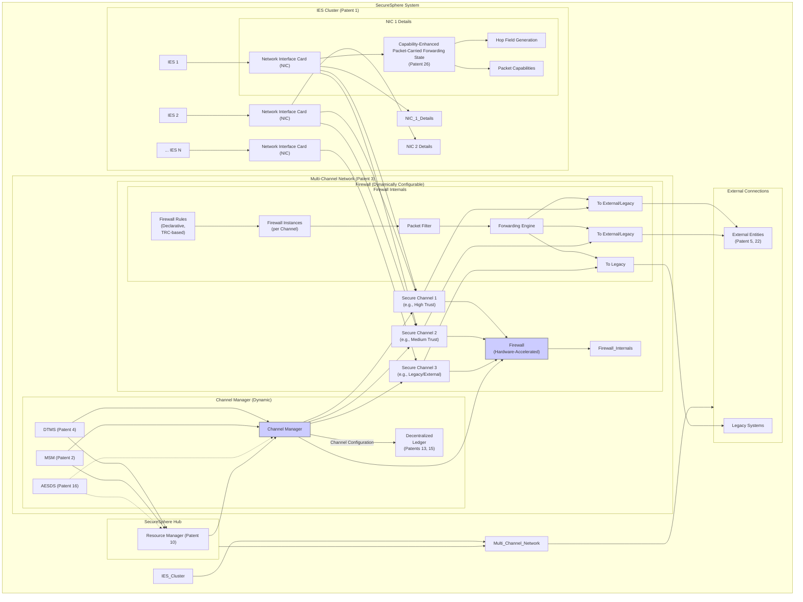
```mermaid
graph LR
    subgraph "SecureSphere System"
        direction LR
        subgraph "IES Cluster (Patent 1)"
            IES_1["IES 1"]
            IES_2["IES 2"]
            IES_N["... IES N"]
            IES_1 --> NIC_1["Network Interface Card (NIC)"]
            IES_2 --> NIC_2["Network Interface Card (NIC)"]
            IES_N --> NIC_N["Network Interface Card (NIC)"]

            subgraph "NIC 1 Details"
                NIC_1 --> CEPM["Capability-Enhanced Packet-Carried Forwarding State<br>(Patent 26)"]
                CEPM --> HF["Hop Field Generation"]
                CEPM --> PCAP["Packet Capabilities"]
            end
            NIC_1 --> NIC_1_Details
            NIC_2 --> NIC_2_Details["NIC 2 Details"]
        end
        subgraph "Multi-Channel Network (Patent 3)"
            subgraph "Firewall (Dynamically Configurable)"
              FW["Firewall<br>(Hardware-Accelerated)"]
              Channel_1 --> FW
              Channel_2 --> FW
              Channel_3 --> FW
              subgraph "Firewall Internals"
                FW_Instances["Firewall Instances<br>(per Channel)"]
                    Firewall_Rules["Firewall Rules<br>(Declarative,<br>TRC-based)"] --> FW_Instances
                FW_Instances --> Packet_Filter["Packet Filter"]
                Packet_Filter --> Forwarding_Engine["Forwarding Engine"]
                Forwarding_Engine --> Channel_1_Out & Channel_2_Out & Channel_3_Out
              end
              FW --> Firewall_Internals
            end
            Channel_1["Secure Channel 1<br>(e.g., High Trust)"]
            Channel_2["Secure Channel 2<br>(e.g., Medium Trust)"]
            Channel_3["Secure Channel 3<br>(e.g., Legacy/External)"]
            NIC_1 --> Channel_1
            NIC_1 --> Channel_2
            NIC_2 --> Channel_1
            NIC_2 --> Channel_2
            NIC_N --> Channel_3
            Channel_1 --> Channel_1_Out["To External/Legacy"]
            Channel_2 --> Channel_2_Out["To External/Legacy"]
            Channel_3 --> Channel_3_Out["To Legacy"]
            subgraph "Channel Manager (Dynamic)"
                Channel_Manager["Channel Manager"] --> Channel_1 & Channel_2 & Channel_3 & FW
                DTMS["DTMS (Patent 4)"] --> Channel_Manager
                MSM["MSM (Patent 2)"] --> Channel_Manager
                AESDS["AESDS (Patent 16)"] -.-> Channel_Manager
                Channel_Manager --> |"Channel Configuration"| DLT["Decentralized<br>Ledger<br>(Patents 13, 15)"]
            end
        end
        subgraph External_Connections["External Connections"]
            External_Entities["External Entities<br>(Patent 5, 22)"]
            Legacy_Systems["Legacy Systems"]
            Channel_1_Out --> External_Entities
            Channel_2_Out --> External_Entities
            Channel_3_Out --> Legacy_Systems
        end

        subgraph SecureSphere_Hub["SecureSphere Hub"]
            RM["Resource Manager (Patent 10)"]
            DTMS --> RM
            MSM --> RM
            AESDS -.-> RM
            RM --> Channel_Manager
        end
        
        IES_Cluster ----> Multi_Channel_Network
        Multi_Channel_Network ----> External_Connections
        SecureSphere_Hub ----> Multi_Channel_Network
    end

    style Channel_Manager fill:#ccf,stroke:#888,stroke-width:2px
    style FW fill:#ccf,stroke:#888,stroke-width:2px
```

**Diagram 3 Description:**

**SecureSphere System:** This top-level subgraph encapsulates all components related to the Multi-Channel Network.

**IES Cluster (Patent 1):** Shows how IES instances connect to the network. Includes details of how the NIC generates hop fields and capabilities based on Patent 26.

**Multi-Channel Network (Patent 3):** This subgraph represents the core of Patent 3.

-   **Secure Channel 1, 2, 3:** Physically segregated network channels with different trust levels (e.g., High, Medium, Legacy/External).
-   **Firewall (Dynamically Configurable):**  The out-of-band firewall, with a nested subgraph showing its internal structure. It emphasizes that firewall rules are declarative and TRC-based, connecting to Patents 13 and 15. It shows dedicated Firewall Instances per channel and how they filter traffic using the Packet Filter and route it via the Forwarding Engine to different destinations.
-   **Channel Manager (Dynamic):** Dynamically manages network channels, firewall rules, and routing policies.  Receives input from DTMS (trust policies), MSM (threat intelligence), and AESDS (software/policy updates). It stores channel configurations on the Decentralized Ledger.

**External Connections:** Illustrates how Secure Channels connect to external entities and legacy systems, referencing Patents 5 and 22 for secure external communication.

**SecureSphere Hub:** Shows the components within the hub that interact with the Multi-Channel Network.  Includes the Resource Manager (Patent 10), which receives input from the DTMS, MSM, and AESDS for dynamic resource allocation to network channels.

**Key Improvements and Connections:**

-   **Detailed Firewall:** Shows the internal components and data flow within the firewall, emphasizing its role in enforcing declarative, TRC-based rules and its dedicated instances for each channel.
-   **NIC Details (P26 Integration):** Explicitly includes the Capability-Enhanced Packet-Carried Forwarding State (CE-PCFS) from Patent 26 within the NIC, showing how hop fields and packet capabilities are generated.
-   **Channel Manager Enhancements:** Shows the Channel Manager's interaction with the Decentralized Ledger for storing channel configurations and its connections to the Resource Manager for dynamic resource allocation.
-   **Clear External Connections:** Explicitly shows the connections to external entities and legacy systems, referencing relevant patents.
-   **Stronger SecureSphere Integration:** Highlights the integration with Patents 1, 2, 4, 5, 10, 13, 15, 16, and 22.

**Claims:**

**Independent Claim 1:**

A secure multi-channel network architecture for a computing system comprising a plurality of Modular Isolated Execution Stacks (IES) organized into a hierarchy of Zones, each Zone associated with a Trust Root Configuration (TRC) stored on a decentralized, tamper-proof ledger, the architecture comprising:

(a) a plurality of dynamically configurable, physically segregated network channels, each channel dedicated to a specific security domain, communication purpose, or trust level, wherein each channel's configuration is determined by declarative policies expressed in a policy language and stored on said decentralized ledger;
(b) an out-of-band hardware firewall system, operating independently of the primary operating system and IES instances, and associated with each of said network channels, wherein said firewall system comprises:
    (i) dedicated, reconfigurable firewall instances for each network channel, enabling granular control over network traffic filtering, security policies, and resource allocation based on said declarative policies;
    (ii) hardware-accelerated policy enforcement mechanisms for efficient processing of firewall rules and access control policies; and
    (iii) secure communication interfaces with each IES instance, said interfaces employing at least one of hardware-enforced unidirectional communication channels or capability-augmented PCFS channels (Patent 2);
(c) a capability-aware forwarding mechanism that utilizes dynamically generated capabilities and policy metadata embedded within the hop fields of inter-IES communication packets (Patent 2), wherein said mechanism:
    (i) dynamically routes network traffic between IES instances and network channels based on capabilities, trust levels of said IES instances, workload requirements, real-time threat assessments, and policy information encoded within said hop fields; and
    (ii) enforces access control policies at the data plane level based on said capabilities and policy metadata; and
(d) a Channel Manager, residing within a central management entity and integrated with a Dynamic Trust Management System (DTMS) (Patent 4), dynamically managing said network channels, firewall rules, routing policies, and channel access control based on at least one of: trust levels of said IES instances, real-time resource utilization, system-wide governance policies, TRC configurations, or error handling feedback.

**Dependent Claims:**

2.  The system of claim 1, wherein said physically segregated network channels are implemented using at least one of: dedicated network interface cards (NICs) and physically separate network cabling, virtual network interfaces and logically isolated network segments within a shared physical network, or a combination thereof.
3.  The system of claim 1, wherein said declarative policies for network channel configuration, firewall rules, and routing are expressed using a policy language that supports at least one of: rule-based policies, attribute-based policies, or role-based policies, and wherein said policies are stored on said decentralized ledger, ensuring transparency and auditability.
4.  The system of claim 1, wherein said out-of-band hardware firewall system further comprises:
    (a) an AI-powered threat detection and analysis engine for identifying and mitigating potential network attacks; and
    (b) a mechanism for dynamic updates of firewall rules and policies based on real-time threat intelligence feeds, wherein said updates are authenticated and validated before application.
5.  The system of claim 1, wherein said capability-aware forwarding mechanism prioritizes secure communication pathways based on trust levels of IES instances and dynamically isolates compromised network segments or IES instances, wherein said isolation is enforced by the firewall system based on capabilities and policy metadata.
6.  The system of claim 1, further comprising dedicated, isolated network channels for legacy internet access, wherein said legacy channels utilize separate network interfaces and firewall instances, ensuring that legacy systems can access external networks without compromising the security of the primary network channels and IES instances.
7.  The system of claim 1, wherein said Channel Manager dynamically adjusts bandwidth allocation for each network channel based on real-time resource utilization, workload demands, and trust levels of IES instances.
8.  The system of claim 1, wherein the Channel Manager supports multipath routing, dynamically discovering, selecting, and managing multiple paths for inter-IES communication, wherein said path selection is based on trust levels, capability requirements, bandwidth availability, and network latency.
9.  The system of claim 1, wherein said policy language supports formal verification techniques for ensuring correctness and consistency of declarative network policies, mitigating the risk of policy errors or vulnerabilities.
10. The system of claim 1, further comprising a rollback mechanism that reverts network channel configurations, firewall rules, and routing policies to a previous known good state in case of errors or security breaches.
11. The system of claim 10, wherein the rollback mechanism utilizes the decentralized ledger to track policy changes and their associated microstructures (Patent 14), ensuring that the rollback process itself is secure, auditable, and consistent across all SecureSphere deployments (Patent 17).
12. The system of claim 1, further comprising a dedicated logging and auditing module that records all network events, policy changes, and firewall actions on the decentralized ledger, providing a tamper-proof audit trail and facilitating investigation and compliance reporting.
13. The system of claim 1, wherein inter-zone communication and data exchange is governed by the Secure Inter-Zone Collaboration Framework (SIZCF - Patent 22) which implements at least one of: Differential Privacy, Homomorphic Encryption, and Secure Multi-Party Computation (MPC).

## Patent 4: Dynamic Trust Management System (DTMS) with Decentralized Zone Management and TRC-Based Trust

**Abstract:**

This invention introduces a Decentralized Dynamic Trust Management System (DTMS) for the SecureSphere secure computing ecosystem, providing a robust and adaptive framework for secure collaboration and resource sharing within a physically segmented, multi-kernel, zoned environment. The DTMS establishes and manages trust relationships between Isolated Execution Stacks (IES) instances within and across Zones, leveraging distributed Trust Root Configurations (TRCs) stored on a tamper-proof decentralized ledger. The DTMS utilizes cryptographic identity verification, dynamic trust metrics, a distributed consensus-based validation mechanism, and declarative trust policies for fine-grained control. A Decentralized Zone Management System (DZMS) governs zone membership, inter-zone trust, and secure TRC distribution and consistency, utilizing a beaconing mechanism for efficient dissemination of TRC updates. Furthermore, a novel policy negotiation mechanism, enables zones to dynamically establish and agree upon shared trust policies, enhancing collaboration and adaptability. This integrated approach provides a secure, transparent, and resilient trust management system for dynamic and evolving workloads, mitigating the risks associated with centralized trust authorities and promoting flexible, zone-specific security configurations.

**Diagram 1:**

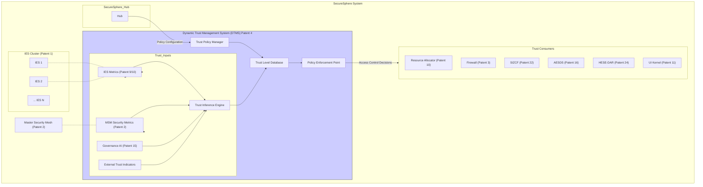
```mermaid
graph TD
    subgraph SecureSphere_System["SecureSphere System"]

        subgraph IES_Cluster["IES Cluster (Patent 1)"]
            IES_1["IES 1"]
            IES_2["IES 2"]
            IES_N["... IES N"]
        end

        subgraph DTMS["Dynamic Trust Management System (DTMS) Patent 4"]
            TI["Trust Inference Engine"]
            TPM["Trust Policy Manager"]
            Trust_Level["Trust Level Database"]
            PEP["Policy Enforcement Point"]

            TI --> Trust_Level
            TPM --> Trust_Level
            Trust_Level --> PEP
            
            subgraph Trust_Inputs
                Metrics_1["IES Metrics (Patent 9/10)"] --> TI
                Metrics_2["MSM Security Metrics (Patent 2)"] --> TI
                Gov_AI["Governance AI (Patent 15)"] --> TI
                Ext_TI["External Trust Indicators"] --> TI
            end
        end

        IES_1 -.- Metrics_1 --> DTMS
        IES_2 -.- Metrics_1 --> DTMS

        MSM_Node["Master Security Mesh (Patent 2)"] -.- Metrics_2 --> DTMS
        
        subgraph Consumers["Trust Consumers"]
            RA["Resource Allocator (Patent 10)"]
            Firewall["Firewall (Patent 3)"]
            SIZCF["SIZCF (Patent 22)"]
            AESDS["AESDS (Patent 16)"]
            HESE_DAR["HESE-DAR (Patent 24)"]
            UI_Kernel["UI Kernel (Patent 11)"]
        end

        PEP --> |Access Control Decisions| Consumers

        subgraph SecureSphere_Hub
            Hub["Hub"] --> |Policy Configuration| TPM
        end
    end

    style DTMS fill:#ccf,stroke:#888,stroke-width:2px
```

**Description of Diagram 1:**

This diagram illustrates Patent 4, the Dynamic Trust Management System (DTMS), and its integration within the SecureSphere System.  It showcases how the DTMS manages trust relationships and enforces policies, influencing various security-sensitive components.

1.  **SecureSphere System:** This top-level subgraph encapsulates the components related to trust management.
2.  **IES Cluster (Patent 1):** Represents the IES instances whose trust levels are managed by the DTMS.
3.  **Dynamic Trust Management System (DTMS) - Patent 4:** This subgraph details the core components of the DTMS.
    -   **Trust Inference Engine (TI):** Analyzes various trust inputs to determine the trust level of each IES instance.
    -   **Trust Policy Manager (TPM):** Manages trust policies and updates the Trust Level Database accordingly.  It receives policy configurations from the SecureSphere Hub.
    -   **Trust Level Database:** Stores the current trust level for each IES instance.
    -   **Policy Enforcement Point (PEP):** Enforces access control decisions based on the trust levels stored in the database.
    -   **Trust Inputs Subgraph:**
        -   **IES Metrics (Patents 9 & 10):** Resource usage, performance, and error rates from IES instances.
        -   **MSM Security Metrics (Patent 2):** Security-related events and anomalies detected by the Master Security Mesh.
        -   **Governance AI (Patent 15):** Recommendations from the Governance AI based on audit trails and policy analysis.
        -   **External Trust Indicators:** Trust information from external sources, such as reputation scores.
4.  **Trust Consumers:** This subgraph represents the components that rely on the DTMS for trust-based access control decisions.
    -   **Resource Allocator (Patent 10):** Uses trust levels for resource allocation.
    -   **Firewall (Patent 3):** Applies trust-based firewall rules.
    -   **SIZCF (Patent 22):** Uses trust levels for inter-zone collaboration.
    -   **AESDS (Patent 16):** Uses trust levels for software updates.
    -   **HESE-DAR (Patent 24):** Uses trust levels for data access control.
    -   **UI Kernel (Patent 11):** Uses trust levels for displaying information and managing user interaction.

**Key Features and Interactions:**

-   **Dynamic Trust Assessment:** The Trust Inference Engine continuously analyzes various inputs to dynamically adjust trust levels.
-   **Policy-Based Management:** The Trust Policy Manager allows administrators to define and update trust policies, providing granular control over trust relationships.
-   **Hardware-Enforced Isolation (Implicit):** The DTMS leverages the hardware-enforced isolation of IES instances to prevent unauthorized interactions between entities with different trust levels.
-   **Integration with SecureSphere:** The diagram illustrates the DTMS's central role in SecureSphere and its interaction with various components, including the MSM, Resource Allocator, Firewall, SIZCF, AESDS, HESE-DAR, and UI Kernel. It shows how DTMS receives security configurations from the Hub, demonstrating a clear management and control process.
-   **Zero-Trust Model (Implicit):** The continuous evaluation and enforcement of trust embodies the zero-trust security model.

This detailed diagram provides a comprehensive overview of Patent 4 and its role in managing trust and enforcing security policies within the SecureSphere System. It effectively communicates the dynamic, adaptive, and integrated nature of the DTMS, illustrating its importance for SecureSphere's robust security posture.

**Claims:**

**Independent Claim 1:**

A secure computing system comprising a plurality of Modular Isolated Execution Stacks (IES) (Patent 1) organized into a hierarchy of Zones (Patent 18), each Zone associated with a Trust Root Configuration (TRC) stored on a decentralized, tamper-proof ledger (Patent 15), and a secure communication mechanism (Patent 2) between said IES instances, further comprising:

a. a Dynamic Trust Management System (DTMS) comprising: i. a Trust Inference Engine analyzing trust evidence, including at least one of: real-time security assessments from a hierarchical security mesh (Patent 2), policy updates, operational behavior of IES instances, externally sourced trust indicators, or trust policies defined in the relevant TRCs; ii. a Trust Policy Manager managing declarative trust policies, expressed in a policy language, for controlling trust establishment and verification between IES instances; iii. a Trust Level Database storing and dynamically updating trust levels for each IES instance based on outputs from the Trust Inference Engine and Trust Policy Manager; and iv. a Policy Enforcement Point (PEP) enforcing access control decisions based on trust levels, capabilities (Patent 2), and policies defined in said TRCs, integrated with a secure communication agent (Patent 2) and resource management modules (Patent 9, Patent 10); and
b. a Decentralized Zone Management System (DZMS), integrated with said DTMS and said ledger, for: i. managing Zone membership, recording changes on said decentralized ledger, and utilizing a distributed consensus protocol for consistency and availability of membership updates; ii. establishing and managing trust relationships between Zones by storing, synchronizing, and verifying the authenticity and integrity of TRCs across a distributed network of SecureSphere Hubs, utilizing a secure communication protocol and a distributed consensus algorithm; iii. facilitating dynamic policy negotiation between Zones, enabling Zones to propose, exchange, and agree upon shared trust policies expressed using said policy language, using a distributed consensus protocol to achieve agreement and recording negotiated policies on said decentralized ledger; and iv. securely distributing TRC updates to relevant SecureSphere components, utilizing a beaconing mechanism across secure communication channels (Patent 3), including at least one of: unidirectional or capability-augmented PCFS channels (Patent 2), and cryptographic verification of said TRC updates.

**Dependent Claims:**

2.  The system of claim 1, wherein each TRC includes:
    a. a digitally signed set of public keys representing trust roots for said Zone; b. a set of rules, expressed using a declarative language, governing trust establishment and verification within said Zone; and c. policy information, expressed using a declarative language, specifying permitted interactions and data flows between IES instances within and across Zones.
3.  The system of claim 1, wherein said DTMS verifies the authenticity and integrity of TRCs using: a. digital signatures on the TRCs; b. cross-signatures between TRCs of connected Zones, establishing a chain of trust between said Zones; and c. a distributed consensus mechanism, providing fault tolerance and resilience against malicious TRC modifications.
4.  The system of claim 3, wherein said DTMS supports dynamic trust inheritance, where trust relationships established between lower-level Zones are automatically inherited by higher-level Zones based on the hierarchy defined in Patent 18.
5.  The system of claim 1, wherein said DTMS dynamically adjusts trust levels of IES instances based on a combination of factors, including: real-time security assessments, policy updates, operational behavior metrics, external trust indicators, and adherence to trust policies defined in the relevant TRCs.
6.  The system of claim 1, wherein said DTMS utilizes cryptographic techniques to verify the identity and authenticity of each IES instance before establishing a trust relationship, wherein each IES instance possesses a unique, cryptographically verifiable identifier.
7.  The system of claim 1, wherein said DTMS employs a distributed consensus mechanism to validate trust relationships between IES instances, requiring agreement from multiple designated validators before establishing a trust relationship.
8.  The system of claim 1, wherein said DTMS defines a hierarchy of trust levels, ranging from low-trust to high-trust, which determine the permissible interactions and resource sharing between IES instances, wherein said trust levels are dynamically adjusted based on real-time assessments of trust metrics, security policies, and TRC trust policies.
9.  The system of claim 1, wherein said DTMS mediates resource borrowing requests (Patent 9) and capability grants (Patent 2) between IES instances based on their established trust relationship and the trust policies defined in the relevant TRCs, and wherein the Capability Manager (Patent 2) interacts with the DTMS to dynamically adjust capability permissions based on trust levels.
10. The system of claim 1, wherein said DTMS incorporates a zero-trust framework that continuously re-evaluates trust relationships between IES instances, utilizing real-time monitoring data and policy updates.
11. The system of claim 1, wherein said DZMS utilizes a beaconing mechanism to disseminate TRC updates across zones, wherein said beacons are cryptographically signed and include versioning information, enabling efficient and secure propagation of trust root configurations.
12. The system of claim 11, wherein said beaconing mechanism utilizes SecureSphere's multi-channel network (Patent 3) and incorporates capability-aware forwarding to ensure secure and efficient dissemination of TRC updates to authorized SecureSphere components.
13. The system of claim 1, wherein said policy language supports policies based on at least one of: data sensitivity labels, communication type identifiers, time-based constraints, user identity attributes, resource utilization parameters, or other contextual parameters associated with trust and access control decisions.
14. The system of claim 1, further comprising a Policy Conflict Resolution Engine within said DZMS that detects policy conflicts between TRCs or between IES instances, and triggers automated negotiation procedures to resolve such conflicts based on predefined rules, preference orderings, or a distributed consensus mechanism.
15. The system of claim 1, further comprising a secure and auditable policy change management mechanism, wherein proposed policy changes to TRCs are implemented using digitally signed update tickets, said update tickets requiring validation and approval from a quorum of authorized entities within each affected zone using a distributed consensus protocol, and wherein approved policy changes are recorded on the decentralized, tamper-proof ledger.

# Patent Group II. Enhanced Security and Privacy

## Patent 5: Quantum-Resistant Secure Communication with Path-Aware Key Distribution, Dynamic QKD Endpoint Discovery, and SIBRA Bandwidth Reservation

**Abstract:** This invention discloses a quantum-resistant secure communication system for physically isolated execution environments (e.g., Modular Isolated Execution Stacks - Patent 1), integrating path-aware key distribution, dynamic QKD endpoint discovery, and SIBRA bandwidth reservation. The system utilizes Quantum Key Distribution (QKD) to generate and distribute cryptographic keys that are provably secure against attacks from quantum computers, with a distributed key management system (DKM) ensuring resilience and preventing single points of failure. Furthermore, the DKM integrates with SCION's path servers and beaconing process, enabling secure and efficient distribution of keys only along authenticated SCION paths (Patent 2, Patent 3) and dynamic discovery of available QKD endpoints. The system incorporates post-quantum cryptographic algorithms for additional long-term security and utilizes SIBRA (Patent 11) to reserve bandwidth for QKD key exchange and other quantum-resistant communication, ensuring quality of service (QoS) and resilience against denial-of-service attacks. This comprehensive approach provides a robust, adaptable, and future-proof secure communication system for diverse computing environments.

**Diagram:**

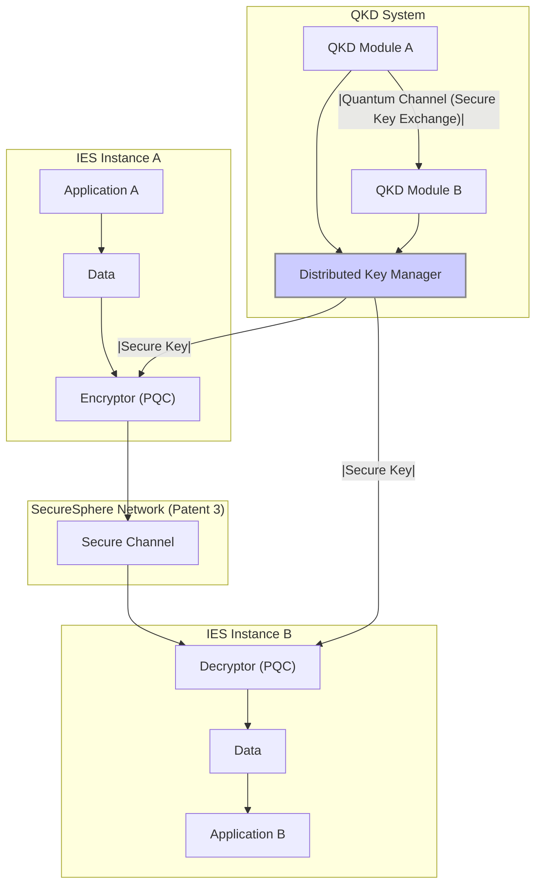
```mermaid
graph TD
    subgraph IES_A["IES Instance A"]
        App_A["Application A"] --> Data["Data"]
        Data --> Encryptor_A["Encryptor (PQC)"]
    end

    subgraph IES_B["IES Instance B"]
        Decryptor_B["Decryptor (PQC)"] --> Data_B["Data"]
        Data_B --> App_B["Application B"]
    end

    subgraph QKD_System["QKD System"]
        QKD_A["QKD Module A"] --|Quantum Channel (Secure Key Exchange)| --> QKD_B["QKD Module B"]
        QKD_A --> DKM["Distributed Key Manager"]
        QKD_B --> DKM
    end

    subgraph SecureSphere_Network["SecureSphere Network (Patent 3)"]
        Channel["Secure Channel"]
        Encryptor_A --> Channel --> Decryptor_B
    end

    DKM --|Secure Key|--> Encryptor_A
    DKM --|Secure Key|--> Decryptor_B

    style DKM fill:#ccf,stroke:#888,stroke-width:2px
```

**Description for Diagram:**

This diagram illustrates the key components and interactions of the Quantum-Resistant Secure Communication system described in Patent 5.

1.  **IES Instance A & IES Instance B:** These subgraphs represent two IES instances communicating securely.
    -   **Application A & Application B:** Represent the applications sending and receiving data.
    -   **Data & Data_B:** Represents the data being transmitted.
    -   **Encryptor_A (PQC) & Decryptor_B (PQC):** Perform encryption and decryption using Post-Quantum Cryptography (PQC) algorithms.
2.  **QKD System:** This subgraph represents the Quantum Key Distribution system.
    -   **QKD Module A & QKD Module B:** These modules perform the QKD protocol over a quantum channel to establish a secure, shared key.
    -   **Distributed Key Manager (DKM):** Securely stores and distributes the keys generated by the QKD system.
3.  **SecureSphere Network (Patent 3):** Represents the Secure Channel within the SecureSphere Network over which encrypted data is transmitted.
4.  **Key Distribution:** The DKM securely distributes keys to the Encryptor and Decryptor modules in the IES instances.

**Key Features and Interactions:**

-   **Quantum Key Distribution:** The QKD system is clearly shown establishing a secure key between the two IES instances. The quantum channel is labeled to emphasize its secure nature.
-   **Distributed Key Management:** The DKM plays a central role in securely storing and distributing keys, preventing single points of failure.
-   **Post-Quantum Cryptography:** The Encryptor and Decryptor modules utilize PQC, ensuring long-term security even against quantum computer attacks.
-   **SecureSphere Network Integration:** The secure communication takes place within the SecureSphere Network (Patent 3), leveraging its secure channels and other security features.
-   **End-to-End Security:** The diagram illustrates the entire process of secure communication, from data encryption at the source IES to decryption at the destination IES.

This diagram provides a clear visualization of how Patent 5 achieves quantum-resistant secure communication within SecureSphere. It highlights the key technologies employed (QKD, DKM, PQC) and their integration with the SecureSphere network architecture. This visualization clarifies the system's robust security posture and its readiness for future threats.

**Claims:**

1.  A quantum-resistant secure communication system for physically isolated execution environments, comprising:
    a. a Quantum Key Distribution (QKD) mechanism for generating and distributing cryptographic keys;
    b. a distributed Key Management System (DKM) for storing, managing, and distributing said keys, wherein said DKM integrates with a SCION-based path service (Patent 22) to distribute keys only along authenticated SCION paths;
    c. a QKD Endpoint Discovery mechanism that utilizes a beaconing process (Patent 2, Patent 3) to disseminate information about available QKD endpoints, enabling dynamic discovery and selection of quantum-secure communication channels; and
    d. a bandwidth reservation mechanism, integrated with SIBRA (Patent 11), that reserves bandwidth for QKD key exchange and other quantum-resistant communication.
2.  The system of claim 1, wherein the QKD mechanism uses a hardware-based QKD module to ensure the physical security of the key generation and distribution process.
3.  The system of claim 1, wherein the distributed key management system (DKM):    a)  stores cryptographic keys in multiple physically isolated locations, utilizing at least one of: secure storage elements (Patent 24), or a decentralized ledger (Patent 15); and    b) employs a secure multi-party computation (Patent 19) protocol for managing and accessing said keys.
4.  The system of claim 1, wherein the post-quantum cryptographic algorithms:    a) are selected from a suite of NIST-approved post-quantum cryptographic algorithms; and    b) provide resistance to attacks from both classical and quantum computers.
5.  The system of claim 1, further comprising a noise injection mechanism, wherein random noise is introduced into the QKD process and communication channels to enhance security and disrupt potential eavesdropping attempts.
6.  The system of claim 1, wherein said DKM integrates with a SCION-based path service (Patent 22) to securely distribute said keys only along authenticated SCION paths defined by hop fields within capability-augmented PCFS channels (Patent 2), utilizing a Dynamic Trust Management System (Patent 4) to manage trust levels and enforce access control policies for key distribution.
7.  The system of claim 1, wherein said QKD Endpoint Discovery mechanism utilizes a beaconing process to disseminate information about available QKD endpoints, including at least one of: endpoint locations, supported QKD protocols, key exchange parameters, or available bandwidth for QKD operations, wherein said information is included in beacon extensions within Path Construction Beacons (Patent 2) and is authenticated using digital signatures or other cryptographic techniques.
8.  The system of claim 1, wherein said bandwidth reservation mechanism utilizes SIBRA (Patent 11) to reserve bandwidth for at least one of: QKD key exchange, transmission of encrypted data using post-quantum cryptographic algorithms, or other quantum-resistant communication, ensuring quality of service (QoS) and resilience against denial-of-service attacks targeting quantum-secure communication channels.

## Patent 6: Zero-Knowledge Execution Environment with Decentralized Verification and Zone-Based Trust

**Abstract:** This invention discloses a zero-knowledge execution environment (ZKEE) for secure computing, enhanced with decentralized verification and zone-based trust, designed to protect sensitive data during processing. The ZKEE leverages zero-knowledge proofs, allowing computations to be performed on encrypted data without revealing the underlying information to the executing system.  A novel decentralized verification mechanism, distributes the verification process across multiple trusted entities within a SecureSphere Zone (Patent 18), utilizing a distributed consensus protocol to enhance trust and protect against malicious verification.  Hardware-enforced data integrity mechanisms, including memory integrity checks and cryptographic verification, guarantee the integrity of data and computations throughout the execution process.  Integration with SecureSphere's Trust Root Configurations (TRCs) and Dynamic Trust Management System (DTMS) (Patent 4) provides a robust security framework, while support for secure input and output channels enables confidential data transfer.  This combined approach provides a robust, secure, and privacy-preserving solution for computation on sensitive data in untrusted or potentially compromised environments.

**Diagram:**

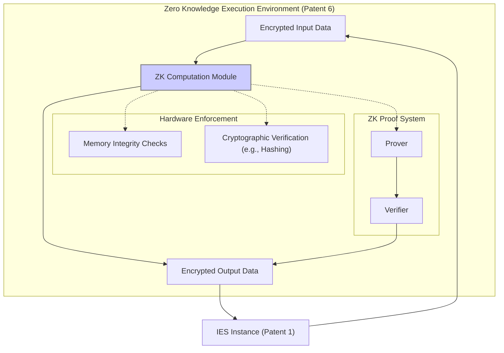
```mermaid
graph TD
    subgraph ZKEE["Zero Knowledge Execution Environment (Patent 6)"]
        direction LR
        Input["Encrypted Input Data"] --> ZK_Computation_Module["ZK Computation Module"]
        ZK_Computation_Module --> Output["Encrypted Output Data"]

        subgraph Hardware_Enforcement["Hardware Enforcement"]
            Memory_Integrity["Memory Integrity Checks"]
            Crypto_Verification["Cryptographic Verification (e.g., Hashing)"]
        end

        ZK_Computation_Module -.-> Memory_Integrity
        ZK_Computation_Module -.-> Crypto_Verification

        subgraph ZK_Proof_System["ZK Proof System"]
            Prover["Prover"] --> Verifier["Verifier"]
        end

        ZK_Computation_Module -.-> Prover
        Verifier --> Output
    end

    IES["IES Instance (Patent 1)"] --> Input
    Output --> IES

    style ZK_Computation_Module fill:#ccf,stroke:#888,stroke-width:2px
```

**Description for Diagram:**

This diagram illustrates the key components and interactions within the Zero-Knowledge Execution Environment (ZKEE) as described in Patent 6.

1.  **Zero-Knowledge Execution Environment (Patent 6):** This subgraph encapsulates the entire ZKEE and its internal components.
2.  **Input/Output:**
    -   **Encrypted Input Data:** Represents the encrypted data provided to the ZKEE for processing.
    -   **Encrypted Output Data:** Represents the encrypted results of the computation.
3.  **ZK Computation Module:** This is the core component of the ZKEE, responsible for performing computations on encrypted data without decrypting it.
4.  **Hardware Enforcement:** This subgraph emphasizes the hardware-based security mechanisms that ensure data integrity within the ZKEE.
    -   **Memory Integrity Checks:** Hardware mechanisms continuously verify the integrity of the memory used by the ZK Computation Module, preventing tampering or unauthorized access.
    -   **Cryptographic Verification (e.g., Hashing):** Hardware-assisted cryptographic operations, such as hashing, are used to verify the integrity of the computations and ensure that the results are correct.
5.  **ZK Proof System:** This subgraph represents the zero-knowledge proof system used to verify the correctness of the computation without revealing the underlying data.
    -   **Prover:** Generates a zero-knowledge proof demonstrating the validity of the computation.
    -   **Verifier:** Verifies the proof generated by the Prover, ensuring the computation's correctness.
6.  **IES Instance (Patent 1):** The ZKEE operates within the isolated environment of an IES instance, adding another layer of security. The IES instance provides the encrypted input data and receives the encrypted output data.

**Key Features and Interactions:**

-   **Data Privacy:** The diagram highlights that the ZK Computation Module operates on encrypted data, ensuring that sensitive information is never exposed in cleartext.
-   **Hardware-Enforced Integrity:** The Hardware Enforcement subgraph emphasizes the role of hardware in protecting the integrity of the data and computations.
-   **Zero-Knowledge Proofs:** The ZK Proof System subgraph shows how zero-knowledge proofs are used to verify the correctness of the computations without revealing the underlying data.
-   **IES Integration:** The connection to the IES Instance emphasizes the secure and isolated environment in which the ZKEE operates.

This diagram visually represents the core principles of Patent 6, showcasing how the ZKEE protects data privacy and integrity during computation. It clarifies the interactions between its components and emphasizes the role of hardware enforcement and zero-knowledge proofs in achieving its security goals. It also clearly shows the ZKEE's integration within the broader SecureSphere architecture.

**Claims:**

1.  **(Independent)** A zero-knowledge execution environment (ZKEE) for secure computing within a system comprising a plurality of Modular Isolated Execution Stacks (IES) (Patent 1) organized into a hierarchy of Zones (Patent 18), each Zone associated with a Trust Root Configuration (TRC), comprising:
    a. a zero-knowledge computation module for performing computations on encrypted data within a physically isolated execution environment; b. a decentralized verification system, wherein the verification process for zero-knowledge proofs generated by said computation module is distributed across multiple trusted entities within a Zone, utilizing a distributed consensus protocol to achieve agreement on proof validity and protect against malicious verification; and  c. hardware-enforced data integrity mechanisms, including memory integrity checks and cryptographic verification using hardware-based cryptographic modules, ensuring the integrity of data and computations throughout the execution process within said isolated environment.
2.  **(Dependent)** The environment of claim 1, wherein the zero-knowledge computation module utilizes zero-knowledge proofs to verify the correctness of computations without revealing the underlying data or the execution flow within said isolated environment.
3.  **(Dependent)** The environment of claim 1, wherein the hardware-enforced data integrity mechanisms include at least one of:    a) memory integrity checks, ensuring data within said isolated environment remains unaltered during processing; and    b) cryptographic hash functions and digital signatures (Patent 24) to verify the integrity of computations performed by said computation module.
4.  **(Dependent)** The environment of claim 1, further comprising secure input and output channels for transferring encrypted data into and out of the execution environment, wherein said channels utilize hardware-enforced unidirectional communication (Patent 2) and/or capability-augmented PCFS (Patent 25) to ensure confidentiality and integrity of data in transit.
5.  **(Dependent)** The environment of claim 1, wherein said decentralized verification system selects said trusted entities based on trust levels determined by a Dynamic Trust Management System (DTMS) (Patent 4) and trust policies defined in the relevant TRC, and wherein said distributed consensus protocol requires agreement from a quorum of said trusted entities before accepting the validity of a zero-knowledge proof.
6.  **(Dependent)** The environment of claim 1, wherein said isolated execution environment is at least one of: a Modular Isolated Execution Stack (IES) instance (Patent 1), a Secure Data Enclave (Patent 20), or other hardware-enforced isolated compartment, ensuring physical and logical separation from untrusted or potentially compromised components.
7.  **(Dependent)** The environment of claim 1, wherein said ZKEE supports the execution of multiple, isolated zero-knowledge computations concurrently within said isolated environment, utilizing dynamic resource allocation (Patent 10) and hardware-enforced isolation between said computations to prevent interference.
8.  **(Dependent)** The environment of claim 1, wherein the configuration and parameters of said ZKEE, including the set of trusted entities, the consensus protocol, and the cryptographic algorithms used for verification, are defined within a Zone-specific policy encoded in the associated TRC.

**Key Changes and Rationale:**

-   **Decentralized Verification:** Claim 1 now explicitly includes the decentralized verification system, a major innovation.  This distributes the verification process across multiple trusted entities, enhancing trust and protecting against malicious verification. The use of a distributed consensus protocol and the selection of trusted entities based on DTMS trust levels and TRC policies further strengthen this feature. The claims also explicitly mention hardware enforcement and additional hardware elements to increase isolation and security during computations.
-   **Integration with SecureSphere:** The claims now clearly integrate the ZKEE with SecureSphere's architecture, referencing IES instances, Zones, TRCs, the DTMS, hardware-enforced unidirectional communication, capability-augmented PCFS, secure data enclaves, and dynamic resource allocation.  This demonstrates how the ZKEE leverages SecureSphere's security features.
-   **Secure Input/Output:** Claim 4 strengthens the security of input and output channels by explicitly referencing SecureSphere's secure communication mechanisms.
-   **Zone-Based Configuration:** Claim 8 links the ZKEE's configuration to zone-specific policies, enabling granular control and customization based on the zone's security requirements.
-   **Concurrent Computations:** Claim 7 introduces support for concurrent zero-knowledge computations within the isolated environment, enhancing the ZKEE's functionality and flexibility.

## Patent 7: Hardware-Enforced Anomaly Detection, Isolation, and Self-Healing with Secure SCMP Reporting, Zonal Response Policies, and Timing Side-Channel Detection

**Abstract:** This invention discloses a robust and adaptive anomaly detection and recovery system for secure computing environments, enhanced with secure reporting, zonal response policies, and timing side-channel detection.  The system employs hardware-based anomaly detection mechanisms that continuously monitor system behavior, resource utilization, and communication patterns, including the timing of sensitive operations, to identify deviations from expected behavior and potential timing side-channel attacks.  A secure reporting mechanism ensures authenticated and tamper-proof transmission of anomaly reports.  Hardware-enforced isolation physically disconnects affected components upon anomaly detection, preventing the spread of threats. Automated self-healing procedures, guided by zone-specific policies and managed by a distributed recovery controller, restore system integrity while minimizing downtime.  This integrated approach provides a comprehensive and resilient security solution for dynamic and potentially hostile computing environments.

**Diagram:**

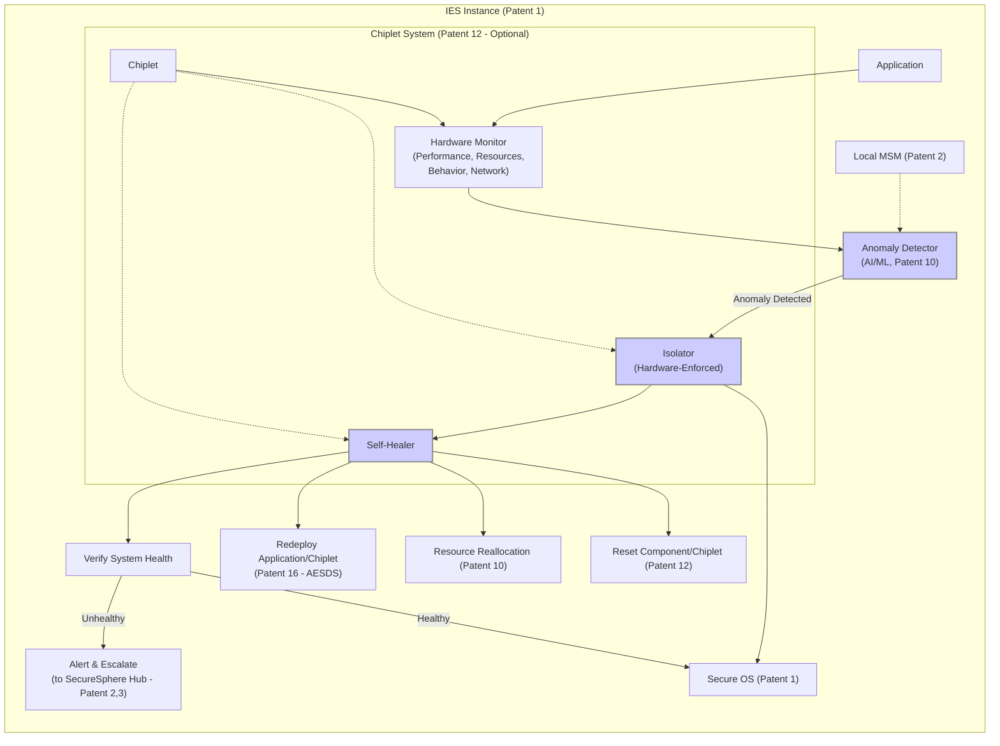
```mermaid
graph LR
    subgraph IES_Instance["IES Instance (Patent 1)"]
        App["Application"] --> HW_Monitor["Hardware Monitor<br>(Performance, Resources,<br>Behavior, Network)"]
        HW_Monitor --> Anomaly_Detector["Anomaly Detector<br>(AI/ML, Patent 10)"]
        Local_MSM["Local MSM (Patent 2)"] -.-> Anomaly_Detector
        
        Anomaly_Detector -- Anomaly Detected --> Isolator["Isolator<br>(Hardware-Enforced)"]
        Isolator --> Secure_OS["Secure OS (Patent 1)"]
        Isolator --> Self_Healer["Self-Healer"]
        
        Self_Healer --> Reset["Reset Component/Chiplet (Patent 12)"]
        Self_Healer --> Resource_Reallocation["Resource Reallocation (Patent 10)"]
        Self_Healer --> Redeploy["Redeploy Application/Chiplet<br>(Patent 16 - AESDS)"]
        Self_Healer --> Verify["Verify System Health"]
        
        Verify -- Healthy --> Secure_OS
        Verify -- Unhealthy --> Alert["Alert & Escalate<br>(to SecureSphere Hub - Patent 2,3)"]

        subgraph Chiplet_System["Chiplet System (Patent 12 - Optional)"]
            Chiplet["Chiplet"] --> HW_Monitor
            Chiplet -.-> Isolator
            Chiplet -.-> Self_Healer
        end
    end

    style Anomaly_Detector fill:#ccf,stroke:#888,stroke-width:2px
    style Isolator fill:#ccf,stroke:#888,stroke-width:2px
    style Self_Healer fill:#ccf,stroke:#888,stroke-width:2px
```

**Description of Diagram:**

This diagram illustrates the Hardware-Enforced Anomaly Detection, Isolation, and Self-Healing system within a SecureSphere IES instance, now including explicit integration with other patents and a clearer depiction of the self-healing process.

1.  **IES Instance (Patent 1):** This subgraph encapsulates the anomaly detection and recovery system within an isolated IES.
2.  **Monitoring and Detection:**
    -   **Application:** The application running within the IES.
    -   **Hardware Monitor:** Monitors performance, resource usage, application behavior, and network activity. The inclusion of network monitoring strengthens the anomaly detection capabilities, aligning with the security focus of SecureSphere.
    -   **Anomaly Detector (AI/ML, Patent 10):** Employs AI/ML algorithms (potentially leveraging Patent 10 for intelligent resource prediction) to detect anomalous behavior based on monitoring data.
    -   **Local MSM (Patent 2):** Provides real-time security context and threat intelligence, aiding the Anomaly Detector in distinguishing between normal fluctuations and genuine security threats.
3.  **Isolation:**
    -   **Isolator (Hardware-Enforced):** Upon anomaly detection, the Isolator physically isolates the affected component. This could be the entire IES or, if applicable, a specific chiplet (Patent 12), providing granular isolation.  It communicates with the Secure OS to isolate the affected entity.
4.  **Self-Healing:**
    -   **Self-Healer:** Orchestrates the automated recovery process.
    -   **Reset Component/Chiplet (Patent 12):** Resets the affected component to a known good state.
    -   **Resource Reallocation (Patent 10):** Dynamically reallocates resources (Patent 10) if the anomaly is due to resource exhaustion. This active remediation step adds robustness to the self-healing process.
    -   **Redeploy Application/Chiplet (Patent 16 - AESDS):** Redeploys the application or faulty chiplet, potentially using a known good version from AESDS (Patent 16).  This step reinforces the connection to SecureSphere's software management capabilities.
    -   **Verify System Health:** Checks if the system has returned to a healthy state.
5.  **Reintegration or Escalation:**
    -   If healthy, the IES or chiplet is reintegrated by the Isolator, communicating with the Secure OS.
    -   If unhealthy, an alert is generated and escalated to the SecureSphere Hub via the secure communication channels provided by Patents 2 and 3.
6.  **Chiplet System (Patent 12 - Optional):** This optional subgraph illustrates how Patent 7 integrates with the chiplet architecture. A faulty chiplet can be isolated, reset, or redeployed independently, demonstrating granular self-healing capabilities.

**Key Features of this Diagram:**

-   **Expanded Monitoring:** Includes network monitoring as a key input for anomaly detection.
-   **Granular Isolation:** Shows the ability to isolate not only the IES but also individual chiplets.
-   **Detailed Self-Healing:** Explicitly depicts the steps involved in the self-healing process, including resource reallocation and redeployment.
-   **Stronger SecureSphere Integration:** Highlights connections to Patents 2, 3, 10, 12, and 16.

This diagram provides a comprehensive and informative visualization of Patent 7, emphasizing its key features, adaptive nature, and tight integration with other SecureSphere components.  It clarifies how the system automatically responds to anomalies and takes corrective actions, enhancing the resilience and security of the overall system.

**Claims:**

1.  **(Independent)** An anomaly detection and recovery system for a secure computing system comprising a plurality of Modular Isolated Execution Stacks (IES) (Patent 1) organized into a hierarchy of Zones (Patent 18), each Zone associated with a Trust Root Configuration (TRC) stored on a decentralized, tamper-proof ledger, comprising:
    a. hardware-based anomaly detection mechanisms continuously monitoring system behavior, resource utilization, and communication patterns within and between said IES instances, further comprising monitoring the timing of sensitive operations to detect potential timing side-channel attacks; b. a hardware-enforced isolation mechanism for physically isolating affected components upon detection of an anomaly; c. an automated self-healing mechanism for restoring system integrity, guided by zone-specific recovery policies defined in the associated TRCs and managed by a distributed recovery controller; and d. a secure reporting mechanism for transmitting authenticated anomaly reports to designated authorities within a Zone.
2.  **(Dependent)** The system of claim 1, wherein said hardware-based anomaly detection mechanisms:    a) monitor performance metrics, resource utilization, communication patterns, and the timing of sensitive operations, such as cryptographic operations, memory accesses, or inter-IES communication; and    b) employ machine learning algorithms implemented in hardware to identify anomalies, using trust levels from a DTMS (Patent 4) and behavior baselines established for each Zone.
3.  **(Dependent)** The system of claim 1, wherein said hardware-enforced isolation mechanism physically disconnects affected components from communication channels and shared resources by at least one of: disabling network interfaces, modifying capability permissions (Patent 2), adjusting memory access control (Patent 8), or a combination thereof.
4.  **(Dependent)** The system of claim 1, wherein said automated self-healing mechanism:    a) resets isolated components to a known secure state, utilizing secure boot procedures (Patent 1);    b) redistributes workloads to unaffected components, employing a dynamic resource allocation mechanism (Patent 10) and considering the trust levels of available IES instances;    c) verifies system health using at least one of: integrity checks, functional tests, or behavior analysis, before reintegrating isolated components; and    d) escalates unresolved anomalies to a higher authority in the Zone hierarchy or a designated security management entity through authenticated communication channels (Patents 2, 3).
5.  **(Dependent)** The system of claim 1, wherein said secure reporting mechanism transmits authenticated anomaly reports through secure communication channels (Patents 2, 3), including at least one of: anomaly type, severity level, affected components, timestamp of detection, diagnostic information, or timing data related to detected timing side-channel attacks, to designated authorities within a Zone and/or a central monitoring system.
6.  **(Dependent)** The system of claim 1, wherein said designated authorities within a Zone are selected based on trust levels determined by the DTMS (Patent 4), trust policies defined in the relevant TRC, or a combination thereof.
7.  **(Dependent)** The system of claim 1, wherein said zone-specific recovery policies, stored within the corresponding TRC on a decentralized, tamper-proof ledger (Patent 15), define permitted self-healing actions, resource allocation constraints, and escalation procedures based on at least one of: anomaly type, severity level, or the trust level of the affected component.
8.  **(Dependent)** The system of claim 1, wherein said distributed recovery controller coordinates recovery actions across multiple IES instances within a Zone, utilizing a distributed consensus protocol (Patent 13) to ensure consistent system recovery.  Further, said distributed recovery controller dynamically adjusts its behavior based on feedback from the anomaly detection system, trust levels of IES instances, and resource availability within the Zone.
9.  **(Dependent)** The system of claim 1, wherein said anomaly detection mechanisms monitor timing of sensitive operations, and generate timing-based anomaly reports if the timing of said operations deviates from established baselines or expected behavior, wherein said timing data is cryptographically protected using a message authentication code or digital signature before transmission through secure communication channels.

## Patent 8: Hardware-Based Memory Protection with Capability-Based Access Control and Dynamic Obfuscation

**Abstract:**  This invention discloses a system for enhancing memory security within secure execution environments, utilizing a multi-faceted approach combining hardware-based memory obfuscation, segmentation, verification, and capability-based access control. Memory obfuscation techniques, such as address scrambling and randomization, updated dynamically at a frequency comparable to the processor clock, protect against memory probing and reverse engineering attacks, including those exploiting timing side channels. Hardware-enforced memory segmentation isolates critical memory regions, preventing unauthorized access and data leakage. Real-time memory verification mechanisms continuously monitor memory integrity, detecting and responding to any corruption or unauthorized modifications.  Furthermore, integration with a capability-based access control system provides fine-grained control over access to obfuscated memory regions, specifying permitted actions (read, write, execute) and address ranges for each capability.  This combined approach, augmented with an ORAM-like design for masking memory access patterns, provides robust protection against a wide range of memory-based attacks.

**Diagram:**

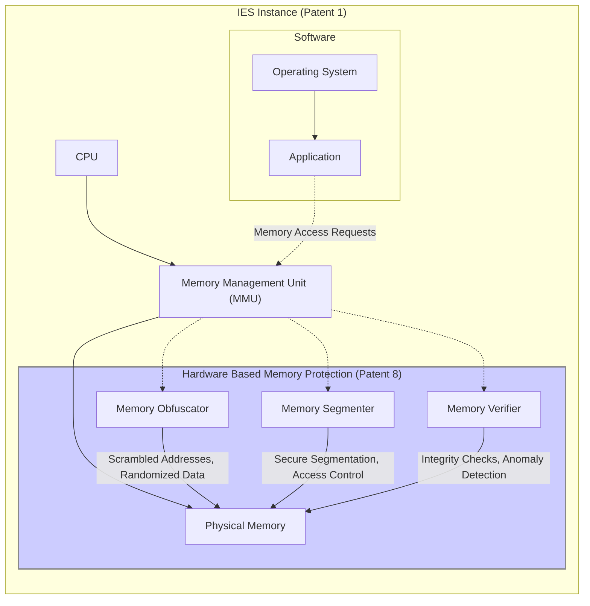
```mermaid
graph LR
    subgraph IES_Instance["IES Instance (Patent 1)"]
        CPU["CPU"] --> MMU["Memory Management Unit (MMU)"]
        MMU --> Memory["Physical Memory"]

        subgraph Memory_Protection["Hardware Based Memory Protection (Patent 8)"]
            Obfuscator["Memory Obfuscator"]
            Segmenter["Memory Segmenter"]
            Verifier["Memory Verifier"]

            Obfuscator --> |Scrambled Addresses, Randomized Data| Memory
            Segmenter --> |Secure Segmentation, Access Control| Memory
            Verifier --> |Integrity Checks, Anomaly Detection| Memory
        end

        MMU -.-> Obfuscator
        MMU -.-> Segmenter
        MMU -.-> Verifier

        subgraph Software["Software"]
            OS["Operating System"]
            Application["Application"]
            OS --> Application
        end

        Application -.-> |Memory Access Requests| MMU

    end

    style Memory_Protection fill:#ccf,stroke:#888,stroke-width:2px
```

**Description of Diagram:**

This diagram illustrates the hardware-based memory protection mechanisms described in Patent 8, integrated within an IES instance.

1.  **IES Instance (Patent 1):** This subgraph represents the isolated execution environment of an IES.
2.  **CPU, MMU, Memory:** These components represent the standard memory access pathway.
3.  **Hardware-Based Memory Protection (Patent 8):** This subgraph contains the core components of the patent.
    -   **Memory Obfuscator:** Performs memory obfuscation techniques, such as address scrambling and data randomization, to protect against memory probing and reverse engineering. The diagram visually connects it to Memory to represent the result of its operation: scrambled addresses and randomized data.
    -   **Memory Segmenter:** Implements hardware-enforced memory segmentation, isolating critical memory regions and enforcing access control policies at the hardware level.  The visual connection to Memory highlights segmentation and controlled access.
    -   **Memory Verifier:** Performs real-time memory verification, using integrity checks (e.g., checksums) and anomaly detection to detect and respond to memory corruption.  The arrow to Memory emphasizes active integrity checks and anomaly detection.
4.  **MMU Integration:** The MMU interacts with all three memory protection components, showing how these hardware mechanisms are integrated into the memory management process.
5.  **Software:** This subgraph represents the software stack running within the IES.
    -   **Operating System & Application:** These components make memory access requests through the MMU.

**Key Features and Interactions:**

-   **Hardware Enforcement:** The diagram emphasizes that the memory protection mechanisms are implemented in hardware, providing a strong security boundary against software-based attacks.
-   **Layered Protection:** The three components (Obfuscator, Segmenter, Verifier) provide multiple layers of protection against various memory-based attacks.
-   **IES Integration:** The integration within the IES instance ensures that memory protection is applied to each isolated execution environment.
-   **MMU Integration:** The MMU's interaction with the memory protection components shows how these mechanisms are integrated into the memory management process.
-   **Transparent to Software:** The diagram indicates that the memory protection mechanisms are transparent to the software running within the IES, simplifying application development.

This diagram clearly visualizes how Patent 8's hardware-based memory protection mechanisms operate within an IES instance. It clarifies the functions of each component and highlights their combined effect in creating a robust defense against a wide range of memory-based attacks.

**Claims:**

1.  **(Independent)** A memory security system for secure execution environments within a computing system comprising a plurality of Modular Isolated Execution Stacks (IES) (Patent 1), each IES having dedicated memory resources, comprising:
    a. a hardware-based memory obfuscation mechanism that dynamically scrambles memory addresses and randomizes data stored in memory, wherein the obfuscation parameters are updated at a frequency comparable to the processor clock to protect against timing-based attacks; b. a hardware-enforced memory segmentation mechanism that isolates critical memory regions and enforces access control policies at the hardware level; c. a real-time memory verification mechanism that continuously monitors memory integrity and detects memory corruption or unauthorized modifications; and d. a capability-based access control mechanism, integrated with said memory obfuscation and segmentation mechanisms, for managing access to obfuscated memory regions, wherein each capability grants specific access rights (read, write, execute) and address ranges to designated memory segments.
2.  **(Dependent)** The system of claim 1, wherein the hardware-based memory obfuscation mechanism employs at least one of: address scrambling, data randomization, or a combination thereof, and wherein the obfuscation parameters, including at least one of: encryption keys, randomization seeds, or lookup tables, are dynamically updated.
3.  **(Dependent)** The system of claim 1, wherein the hardware-enforced memory segmentation mechanism:    a) creates physically isolated memory regions for different security levels or trust domains; and     b) dynamically adjusts memory segmentation based on real-time security assessments, trust levels of execution contexts, or policy updates from a Dynamic Trust Management System (DTMS) (Patent 4), ensuring adaptability and responsiveness to changing security requirements.
4.  **(Dependent)** The system of claim 1, wherein the real-time memory verification mechanism:    a) employs checksums, error correction codes, or other integrity checks to detect memory corruption or unauthorized modifications; and    b) triggers security responses, such as isolation, self-healing (Patent 7), or escalation to a security management entity (Patent 2), upon detection of memory corruption.
5.  **(Dependent)** The system of claim 1, wherein said capability-based access control mechanism manages access to obfuscated memory regions using capabilities, wherein each capability specifies at least one of:    a) permitted actions (read, write, execute) for the corresponding memory segment, wherein write access to memory storing capabilities themselves is restricted to prevent capability forgery; and    b) address ranges accessible within said obfuscated memory region.
6.  **(Dependent)** The system of claim 5, wherein said capabilities are dynamically issued and managed by a Capability Manager residing within a central management entity, and wherein capability permissions and address ranges are dynamically adjusted based on at least one of: trust levels derived from the DTMS (Patent 4), real-time resource usage, security policies defined within Trust Root Configurations (TRCs), or a combination thereof.
7.  **(Dependent)** The system of claim 1, further comprising an ORAM-like design for masking memory access patterns, converting memory accesses to obfuscated addresses into randomized sequences of physical memory accesses, thus preventing disclosure of access patterns to external observers and enhancing resistance against timing or cache-based side-channel attacks.
8.  **(Dependent)** The system of claim 1, wherein said secure execution environment corresponds to a Modular Isolated Execution Stack (IES) instance (Patent 1), and wherein said memory obfuscation, segmentation, verification, and access control mechanisms operate within each IES instance to protect its dedicated memory resources.
9.  **(Dependent)** The system of claim 1, wherein said system integrates with a secure boot process (Patent 1), authenticating and verifying the integrity of memory management components and obfuscation mechanisms before initializing memory operations, and establishing a secure root of trust for memory access.
10. **(Dependent)** The system of claim 1, further comprising a hardware-assisted mechanism for managing and enforcing said capabilities and access control policies, enhancing the performance and security of memory access operations.
11. **(Dependent)** The system of claim 1, wherein all memory accesses are recorded on a 3D-printed microstructure audit trail (Patent 14), linked to corresponding digital records on a decentralized, tamper-proof ledger (Patent 15), providing a verifiable and tamper-evident record of memory operations for enhanced security and auditability.

# Patent Group III. Dynamic Resource Management and Optimization

## Patent 9: Secure Resource Borrowing and Granular I/O Management with TRC-Based Policies, Multipath Communication, and Hardware-Enforced Isolation

**Abstract:**

This invention presents a system for secure resource borrowing and granular I/O management within a secure, zoned computing environment utilizing Modular Isolated Execution Stacks (IES).  The system enhances resource utilization, security, and resilience by enabling IES instances to securely lend and borrow idle resources (e.g., processing power, memory, storage) while maintaining strict hardware-enforced isolation and adhering to trust policies defined in Trust Root Configurations (TRCs).  A hardware-enforced Secure Resource Borrowing Mechanism (SRBM), employing a PCFS-like mechanism with hop fields for efficient communication of requests and allocations, manages resource access.  Granular I/O management is achieved through a hardware-based Isolated I/O Gateway (IIG) incorporating a hardware I/O Switch Fabric and a Zero Trust I/O Handoff Protocol (ZTIOH) utilizing dynamically generated, cryptographically authenticated tokens and unique, verifiable IES identifiers for access control, strengthened with capability-based access rights. A Multipath Communication Manager (MCM) establishes and manages multiple secure communication paths for resource borrowing and I/O operations, optimizing for load balancing, bandwidth aggregation, and fault tolerance while integrating with the DTMS and capability system for enhanced security. Declarative policies, integrated with the DTMS and TRCs, provide flexible control over resource access, enhancing security and adaptability in dynamic computing environments. A Multi-Layered Virtual Console (MLVC) provides secure user interaction with multiple isolated IES environments, and contextual Input/Output Redirection Protocols route signals to the correct IES instance based on the active environment and TRC policies.  A secure Resource Return Protocol verifies the state of returned resources and utilizes secure communication channels for resource release notifications.

**Diagram:**

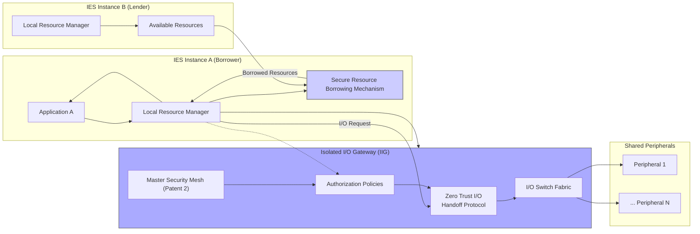
```mermaid
graph LR
    subgraph IES_A["IES Instance A (Borrower)"]
        App_A["Application A"] --> LRM_A["Local Resource Manager"]
        LRM_A --> SRBM["Secure Resource Borrowing Mechanism"]
    end

    subgraph IES_B["IES Instance B (Lender)"]
        LRM_B["Local Resource Manager"] --> Resource_Pool_B["Available Resources"]
        Resource_Pool_B --> SRBM
    end

    SRBM -- Borrowed Resources --> LRM_A
    LRM_A --> App_A

    subgraph Shared_Peripherals["Shared Peripherals"]
        Peripheral_1["Peripheral 1"]
        Peripheral_N["... Peripheral N"]
    end

    subgraph IIG["Isolated I/O Gateway (IIG)"]
        IOSF["I/O Switch Fabric"] --> Peripheral_1
        IOSF --> Peripheral_N
        ZTIOH["Zero Trust I/O<br>Handoff Protocol"] --> IOSF
        LRM_A -- I/O Request --> ZTIOH

        LRM_A -.-> Token_Manager["Dynamic Token Manager"] --> ZTIOH
        MSM["Master Security Mesh (Patent 2)"] --> Token_Manager["Authorization Policies"]


    end

    LRM_A ----> IIG


    style SRBM fill:#ccf,stroke:#888,stroke-width:2px
    style IIG fill:#aaf,stroke:#444
```

**Description for Diagram:**

This diagram illustrates the components and processes involved in Secure Resource Borrowing and Granular I/O Management as described in Patent 9.

1.  **IES Instances:** The diagram shows two IES instances: IES Instance A (Borrower) and IES Instance B (Lender). This setup illustrates the resource borrowing process.
    -   **Application A:** Represents the application in IES A requesting resources.
    -   **Local Resource Managers (LRM_A & LRM_B):** Manage resources within their respective IES instances and interact with the SRBM and IIG.
    -   **Resource_Pool_B:** Represents the available resources in IES B that can be borrowed.
2.  **Secure Resource Borrowing Mechanism (SRBM):** This central component mediates resource borrowing requests, ensuring secure and controlled resource sharing between IES instances.  It receives requests from the borrower (IES A) and allocates available resources from the lender (IES B).
3.  **Isolated I/O Gateway (IIG):** This subgraph represents the secure I/O management system.
    -   **I/O Switch Fabric (IOSF):** Provides hardware-level switching between IES instances and shared peripherals, ensuring exclusive access and preventing conflicts.
    -   **Zero Trust I/O Handoff Protocol (ZTIOH):** Secures I/O access using dynamically generated, hardware-based tokens, enforcing a zero-trust approach to peripheral access.
    -   **Dynamic Token Manager:** Generates and manages the tokens used by the ZTIOH.  It receives authorization policies from the Master Security Mesh (MSM).
    -   **Peripheral 1 & ... Peripheral N:** Represent shared peripherals accessible through the IIG.
4.  **Connections and Data Flow:**
    -   **Resource Borrowing:** Arrows show the flow of resource requests and allocations between the IES instances and the SRBM.
    -   **I/O Management:** Arrows illustrate the path of I/O requests from LRM_A to the IIG, through the ZTIOH and IOSF, to the peripherals. The dashed line shows the involvement of the Dynamic Token Manager in the process, under the supervision of the MSM (Patent 2).

**Key Features Highlighted:**

-   **Secure Isolation:** The diagram emphasizes that resource borrowing occurs without compromising the isolation between IES instances.
-   **Granular Control:** The IIG and ZTIOH provide granular control over access to shared peripherals.
-   **Zero-Trust I/O:** The use of dynamically generated tokens enforces a zero-trust model for peripheral access.
-   **Hardware Enforcement:** The IOSF and token-based authentication are implemented in hardware, providing a strong security boundary.
-   **Integration with SecureSphere:** The diagram shows the integration with the MSM (Patent 2) for I/O authorization policies, emphasizing the cohesive security approach.

This diagram provides a detailed and comprehensive view of Patent 9's functionalities, clarifying the secure resource borrowing mechanism and granular I/O management within SecureSphere.  It effectively communicates how the system optimizes resource utilization without compromising security and isolation.

**Claims:**

1.  A system for secure resource borrowing and granular I/O management within a secure computing system comprising a plurality of Modular Isolated Execution Stacks (IES) (Patent 1) organized into a hierarchy of Zones (Patent 18), each Zone associated with a Trust Root Configuration (TRC) stored on a decentralized, tamper-proof ledger (Patent 15), comprising:
    a. a hardware-enforced Secure Resource Borrowing Mechanism (SRBM) enabling an IES instance to securely borrow idle resources from another IES instance, utilizing a PCFS-like mechanism with hop fields carrying resource requests and allocation information, maintaining strict hardware-level isolation, and adhering to trust policies defined in said TRCs;
    b. a Granular I/O Management system, comprising:
        i. an Isolated I/O Gateway (IIG) with a hardware-based I/O Switch Fabric, providing secure, time-bound access to shared I/O devices for each IES instance, using unique, cryptographically verifiable identifiers to control and authenticate access; and
        ii. a Zero Trust I/O Handoff Protocol (ZTIOH) that secures I/O access through dynamically generated, cryptographically authenticated tokens and capability-based access control (Patent 2), wherein said tokens are verified by the IIG using a secure, side-channel resistant comparison process; and
    c. a Multipath Communication Manager (MCM) establishing and managing multiple secure communication paths between IES instances for resource borrowing and I/O operations, utilizing capabilities (Patent 2) and optimizing for at least one of: load balancing, bandwidth aggregation, or fault tolerance, wherein said MCM dynamically adjusts path selection and traffic distribution based on real-time network conditions, security assessments, and resource availability.
2.  The system of claim 1, wherein said SRBM:
    a. verifies the trust levels of both the borrowing and lending IES instances using a Dynamic Trust Management System (DTMS) (Patent 4);
    b. permits resource borrowing only between IES instances with sufficient trust levels according to the policies defined in the relevant TRCs; and c. utilizes a PCFS-like mechanism for efficient communication of resource requests and allocations, wherein requests and allocations are encoded within hop fields.
3.  The system of claim 1, further comprising a hardware-based Resource Allocation Controller that:
    a. continuously monitors the availability of resources and trust levels across all IES instances, retrieving real-time resource usage information and TRC-based trust policies from the DTMS (Patent 4); and
    b. facilitates secure resource borrowing based on real-time workload demands, available resources, and trust policies, communicating with IES instances using authenticated control messages.
4.  The system of claim 1, wherein said I/O Switch Fabric:
    a. enforces strict time-bound access to shared I/O devices, wherein access permissions are dynamically adjusted based on trust levels, resource availability, and real-time security assessments; and
    b. utilizes unique, cryptographically verifiable identifiers associated with said IES instances to control and authenticate access to shared I/O devices, enhancing isolation and preventing unauthorized access.
5.  The system of claim 1, further comprising a hardware-based I/O Monitoring Module that continuously tracks the status of all I/O operations across IES instances, reporting any anomalies or unauthorized access attempts to a Master Security Mesh (MSM) (Patent 2) using a secure communication channel (Patent 3).
6.  The system of claim 1, further comprising:
    a. a Multi-Layered Virtual Console (MLVC) that enables secure user interaction with multiple isolated IES environments via a unified display; and b. contextual Input and Output Redirection Protocols that dynamically route user input and output signals to the correct IES instance based on the active environment and trust policies defined in said TRCs.
7.  The system of claim 1, further comprising a secure Resource Arbitration Module that manages resource borrowing requests based on trust levels, resource availability, and predefined security policies defined in the relevant TRCs, utilizing a declarative policy language for expressing resource allocation rules.
8.  The system of claim 1, further comprising a secure Resource Return Protocol that:
    a. verifies the state of returned resources after a borrowing period ends, including hardware-based integrity checks; and b. utilizes secure communication channels (Patent 2) for transmitting resource release notifications.
9.  The system of claim 1, wherein said MCM:
    a. discovers and selects multiple communication paths between IES instances based on path availability, performance metrics (latency, bandwidth), trust levels of intermediate nodes and zones, resource availability, and declarative resource borrowing policies; b. distributes resource borrowing and I/O traffic across said multiple paths using multipath routing protocols; and c. dynamically adjusts path selection and traffic distribution based on real-time network conditions, security assessments, and resource availability.
10. The system of claim 9, wherein said MCM integrates with the DTMS (Patent 4) to incorporate trust policies defined in said TRCs into path selection and management, and utilizes capabilities (Patent 2) to control access to resources and I/O devices over said multiple communication paths.

## Patent 10: AI-Powered Predictive Resource Allocation and Adaptive Scaling for IES with Multipath Optimization, Declarative Policies, and Secure Sharing

**Abstract:**

This invention discloses an AI-powered system for predictive resource allocation and adaptive scaling of Modular Isolated Execution Stacks (IES) within a secure, zoned computing environment, enhancing performance, security, and resilience.  The system utilizes an AI-based Predictive Resource Allocation Engine, analyzing real-time workload characteristics, security conditions, historical data, and trust policies, to dynamically allocate resources to IES instances. A Dynamic Scaling Mechanism autonomously provisions or de-provisions IES instances based on real-time demands and security policies, while maintaining hardware-enforced isolation.  Furthermore, the system leverages multipath communication for optimized resource allocation and failover, dynamically adjusting resource distribution based on path availability and performance. A novel declarative policy framework enables flexible and expressive resource management, while a secure resource sharing protocol supports efficient and controlled sharing of idle resources between IES instances, utilizing dynamically generated capabilities and adhering to zone-specific trust policies. This integrated approach provides a robust, adaptable, and secure resource management solution for dynamic and evolving workloads.

**Diagram:**

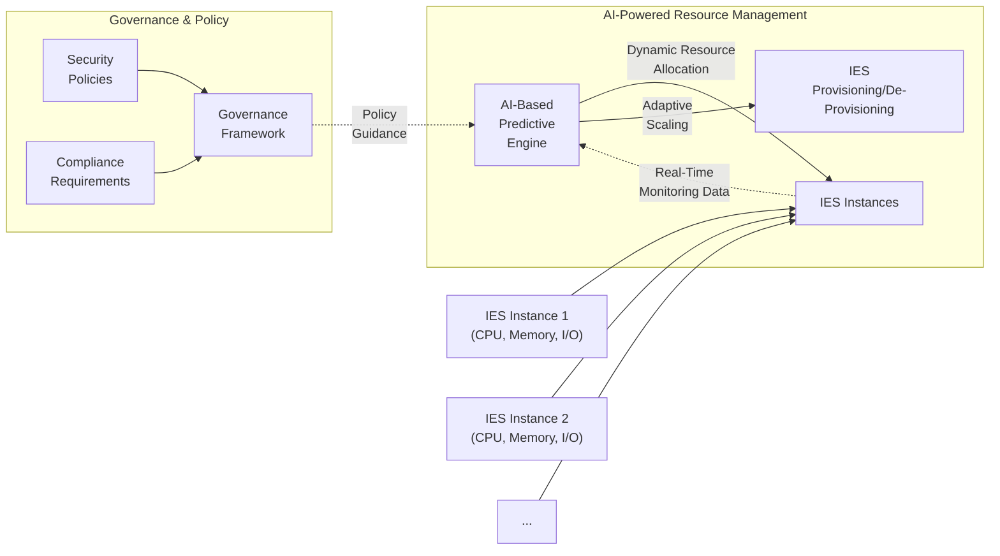
```mermaid
graph LR
    subgraph AI_Resource_Mgmt["AI-Powered Resource Management"]
        AI_Engine["AI-Based<br>Predictive<br>Engine"] --> |Dynamic Resource<br>Allocation| IES_Cluster["IES Instances"]
        AI_Engine --> |Adaptive<br>Scaling| IES_Provisioning["IES<br>Provisioning/De-Provisioning"]
    end
    
    IES_Cluster -.-> |Real-Time<br>Monitoring Data| AI_Engine


    IES_Instance_1["IES Instance 1<br>(CPU, Memory, I/O)"] --> IES_Cluster
    IES_Instance_2["IES Instance 2<br>(CPU, Memory, I/O)"] --> IES_Cluster
    IES_Instance_3["..."] --> IES_Cluster


    subgraph Governance_Policy["Governance & Policy"]
        Security_Policies["Security<br>Policies"] & Compliance["Compliance<br>Requirements"] --> Governance_Framework["Governance<br>Framework"]
    end

    Governance_Framework -.-> |Policy<br>Guidance| AI_Engine
```

**Diagram Description:**

-   **AI-Powered Resource Management:** The core subgraph contains the AI engine and its actions.
-   **IES Instances:** The IES Cluster subgraph shows multiple instances, each with its resource pool visualized.
-   **Real-Time Monitoring:** The dashed line from IES instances to the AI engine shows data flow.
-   **Dynamic Resource Allocation:** The arrow from the AI engine to IES instances represents resource adjustment.
-   **Adaptive Scaling:** The arrow to "IES Provisioning/De-Provisioning" represents scaling actions.
-   **Governance & Policy:** The "Governance & Policy" subgraph is loosely connected to the AI engine to show that policy guidance informs its actions.

**Claims:**

1.  **(Independent)** A system for AI-powered predictive resource allocation and adaptive scaling of Modular Isolated Execution Stacks (IES) (Patent 1) within a secure computing system comprising a plurality of IES instances organized into a hierarchy of Zones (Patent 18), each Zone associated with a Trust Root Configuration (TRC) stored on a decentralized, tamper-proof ledger (Patent 15), comprising:
    a. an AI-based Predictive Resource Allocation Engine that analyzes real-time workload characteristics, security conditions, historical data, and trust policies defined in the relevant TRCs to dynamically allocate resources to individual IES instances, wherein said Engine monitors the status of multiple communication paths (Patent 2, Patent 3) and dynamically adjusts resource allocation based on path availability, security posture and performance metrics; b. a Dynamic Scaling Mechanism that autonomously and securely provisions or de-provisions IES instances based on real-time workload demands, available resources, security conditions, and trust policies, while maintaining hardware-enforced isolation between IES instances, utilizing a declarative policy language for expressing scaling policies; and c. a Trust-Aware Resource Optimization module that dynamically adjusts resource allocation and scaling decisions based on trust levels, resource availability, real-time security assessments, performance requirements and predefined security policies, derived from a Dynamic Trust Management System (DTMS) (Patent 4), and trust policies defined in said TRCs.
2.  **(Dependent)** The system of claim 1, further comprising a hardware-based Monitoring System that continuously gathers data on workload demands, security status, resource utilization, trust levels, *and communication path performance*, and provides real-time feedback to said AI-based Predictive Resource Allocation Engine.
3.  **(Dependent)** The system of claim 1, wherein said Dynamic Scaling Mechanism:    a) ensures efficient resource utilization by securely creating new IES instances when needed and securely releasing underutilized instances to free up resources, according to the trust policies defined in said TRCs; and    b) records all scaling actions on the decentralized, tamper-proof ledger (Patent 15), creating an auditable history of scaling operations.
4.  **(Dependent)** The system of claim 1, further comprising a Governance-Aware Scaling Framework that incorporates predefined security policies, compliance requirements, and trust policies defined in the relevant TRCs into the scaling decision-making process, wherein said Framework utilizes a declarative policy language and a distributed consensus mechanism (Patent 13) for policy approval and enforcement.
5.  **(Dependent)** The system of claim 1, wherein said Dynamic Scaling Mechanism employs hardware-enforced isolation measures, including capability-based access control (Patent 2) and secure boot procedures (Patent 1), to ensure that newly provisioned or de-provisioned IES instances remain physically and logically isolated from other existing instances.
6.  **(Dependent)** The system of claim 1, wherein said AI-based Predictive Resource Allocation Engine: a) analyzes historical data on security threats, resource usage patterns, and trust levels derived from the DTMS to proactively adjust resource allocation and scaling decisions in anticipation of potential threats or performance bottlenecks; and b) generates predictive models using a combination of historical data, real-time monitoring data, and declarative resource allocation policies specified in a policy language.
7.  **(Dependent)** The system of claim 6, wherein said AI-based Predictive Resource Allocation Engine utilizes machine learning algorithms to refine predictive models dynamically based on feedback from the system's performance and security monitoring modules.
8.  **(Dependent)** The system of claim 1, further comprising a Resource Reconfiguration Module that dynamically adjusts resource allocation and scaling between IES instances based on real-time security assessments, performance requirements, and trust policies defined in the relevant TRCs, utilizing a secure, multipath communication mechanism (Patent 2, Patent 3) and hop fields encoding resource allocation updates, to exchange resource allocation updates and ensure reliable delivery of control messages.
9.  **(Dependent)** The system of claim 1, further comprising a Secure Resource Sharing Protocol that allows IES instances to securely share unused or idle resources with other authorized instances according to dynamically adjustable policies and capability grants (Patent 2), wherein:    a) authorization and resource access are managed by the DTMS (Patent 4), considering the trust levels of participating IES instances and the policies defined in the relevant TRCs;    b) resource sharing policies are expressed using a declarative language and stored on the decentralized, tamper-proof ledger (Patent 15); and    c) multiple secure communication paths are established and managed between IES instances for resource sharing using a multipath communication mechanism (Patent 22), enhancing fault tolerance and performance.

# Patent Group IV. Secure User Interface and Chiplet Integration

**Diagram:**

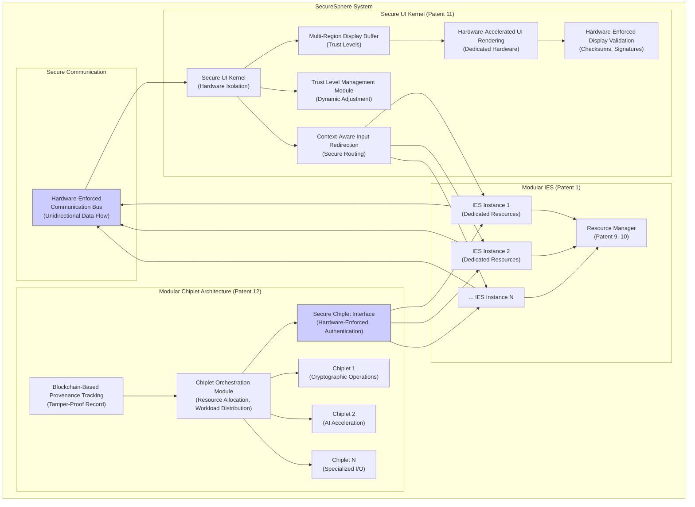
```mermaid
graph LR
    subgraph "SecureSphere System"
        direction LR
        subgraph "Modular IES (Patent 1)"
            IES_1["IES Instance 1<br>(Dedicated Resources)"]
            IES_2["IES Instance 2<br>(Dedicated Resources)"]
            IES_N["... IES Instance N"]
            Resource_Manager["Resource Manager<br>(Patent 9, 10)"]
            IES_1 --> Resource_Manager
            IES_2 --> Resource_Manager
            IES_N --> Resource_Manager
        end

        subgraph "Secure UI Kernel (Patent 11)"
            UI_Kernel["Secure UI Kernel<br>(Hardware Isolation)"]
            Multi_Region_Buffer["Multi-Region Display Buffer<br>(Trust Levels)"]
            Trust_Level_Mgmt["Trust Level Management Module<br>(Dynamic Adjustment)"]
            Input_Redirection["Context-Aware Input Redirection<br>(Secure Routing)"]
            UI_Rendering["Hardware-Accelerated UI Rendering<br>(Dedicated Hardware)"]
            Display_Validation["Hardware-Enforced Display Validation<br>(Checksums, Signatures)"]
            UI_Kernel --> Multi_Region_Buffer
            UI_Kernel --> Trust_Level_Mgmt
            UI_Kernel --> Input_Redirection
            Multi_Region_Buffer --> UI_Rendering
            UI_Rendering --> Display_Validation
            Input_Redirection --> IES_1
            Input_Redirection --> IES_2
            Input_Redirection --> IES_N
        end

        subgraph "Modular Chiplet Architecture (Patent 12)"
            Chiplet_Orchestration["Chiplet Orchestration Module<br>(Resource Allocation, Workload Distribution)"]
            Secure_Chiplet_Interface["Secure Chiplet Interface<br>(Hardware-Enforced, Authentication)"]
            Chiplet_Crypto["Chiplet 1<br>(Cryptographic Operations)"]
            Chiplet_AI["Chiplet 2<br>(AI Acceleration)"]
            Chiplet_IO["Chiplet N<br>(Specialized I/O)"]
            Blockchain_Provenance["Blockchain-Based Provenance Tracking<br>(Tamper-Proof Record)"]
            Chiplet_Orchestration --> Secure_Chiplet_Interface
            Secure_Chiplet_Interface --> IES_1
            Secure_Chiplet_Interface --> IES_2
            Secure_Chiplet_Interface --> IES_N
            Chiplet_Orchestration --> Chiplet_Crypto
            Chiplet_Orchestration --> Chiplet_AI
            Chiplet_Orchestration --> Chiplet_IO
            Blockchain_Provenance --> Chiplet_Orchestration


        end

        subgraph "Secure Communication"
            Secure_Comm_Bus["Hardware-Enforced<br>Communication Bus<br>(Unidirectional Data Flow)"]
            IES_1 --> Secure_Comm_Bus
            IES_2 --> Secure_Comm_Bus
            IES_N --> Secure_Comm_Bus
            Secure_Comm_Bus --> UI_Kernel
        end
    end
    
    style Secure_Comm_Bus fill:#ccf,stroke:#888,stroke-width:2px
    style Secure_Chiplet_Interface fill:#ccf,stroke:#888,stroke-width:2px
```

**Diagram Description:**

This detailed diagram illustrates the intricate integration of Patent 11 (Secure UI Kernel) and Patent 12 (Modular Chiplet Architecture) within the SecureSphere system's architecture based on Patent 1 (Modular IES).

**1. Modular IES (Patent 1):** This section depicts multiple independent IES instances, each with dedicated hardware resources.  A `Resource Manager` is included, highlighting the dynamic resource allocation and management capabilities, drawing from Patents 9 and 10.  This section emphasizes the foundational isolated execution environments.

**2. Secure UI Kernel (Patent 11):** This section details the inner workings of the Secure UI Kernel, including: * **Hardware Isolation:** Emphasizing the complete separation of the UI kernel from the main processing environments. * **Multi-Region Display Buffer:**  Each region has a dynamically adjustable trust level, enabling secure rendering of critical UI elements. * **Trust Level Management Module:** Adapts trust levels based on real-time security assessments, system events, and the origin of UI components. * **Context-Aware Input Redirection:** Securely routes user input to the correct IES instance. * **Hardware-Accelerated UI Rendering:** Leverages dedicated hardware for enhanced performance. * **Hardware-Enforced Display Validation:** Uses techniques like checksums and digital signatures to validate the integrity of rendered information.

**3. Modular Chiplet Architecture (Patent 12):** This section details the dynamic chiplet integration and management: * **Chiplet Orchestration Module:**  This central module is responsible for detecting the insertion and removal of chiplets, managing resource allocation, workload distribution, and communication paths. * **Secure Chiplet Interface:**  A hardware-enforced interface that uses a robust authentication mechanism to prevent unauthorized access. * **Chiplets (Crypto, AI, IO):** Illustrates diverse chiplets with specialized functions, enhancing system capabilities. * **Blockchain-Based Provenance Tracking:** Ensures the authenticity and origin of each chiplet are recorded on a blockchain, preventing counterfeit components.

**4. Secure Communication:** This section emphasizes the secure communication infrastructure. * **Hardware-Enforced Communication Bus:** Provides a secure, unidirectional communication path between the IES instances and the UI Kernel. This prevents unauthorized reverse communication.

**Patent References:**

-   **Patent 1:** Modular Isolated Execution Stacks (IES) form the foundation of the architecture.
-   **Patent 9 & 10:** Resource management is implicitly shown through the `Resource Manager`.
-   **Patent 11:** The diagram illustrates the secure UI kernel, its multi-region buffer, trust level management, and input redirection.
-   **Patent 12:** This diagram details the Chiplet Orchestration Module and the secure integration of various chiplets.

## Patent 11: Secure UI Kernel with Zonal Isolation, Hardware-Enforced Control-Flow Integrity, and Declarative Policy-Based Rendering

**Abstract:**

This invention introduces a secure user interface (UI) system for multi-kernel computing architectures, specifically designed for environments utilizing Modular Isolated Execution Stacks (IES). The system features a dedicated UI Kernel that operates in complete hardware isolation from the primary execution environments, ensuring that user interactions do not compromise the underlying system.  A key innovation is the treatment of the UI Kernel as a separate SecureSphere Zone, with its own Trust Root Configuration (TRC) and access control policies, enhancing isolation and preventing interference from potentially compromised IES instances.  The UI system employs a multi-region display buffer, with each region assigned a distinct, dynamically adjustable trust level, governed by declarative policies.  Hardware-based validation mechanisms, including checksums and digital signatures, ensure the integrity of content rendered in each region.  Furthermore, the UI Kernel incorporates hardware-enforced control-flow integrity (CFI) to protect against control-flow hijacking attacks, and critical UI Kernel services are implemented in hardware to minimize the trusted computing base (TCB).  A secure, unidirectional communication bus connects the IES instances to the UI Kernel, enforcing data flow control and preventing reverse communication attacks. This comprehensive approach provides a robust and secure UI system resistant to various attack vectors, including control-flow hijacking and display-related attacks, while supporting dynamic trust management and policy-based rendering.

**Diagram:**

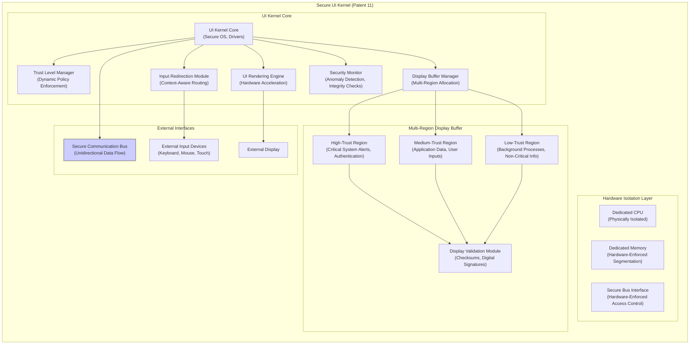
```mermaid
graph LR
    subgraph "Secure UI Kernel (Patent 11)"
        subgraph "Hardware Isolation Layer"
            Dedicated_CPU["Dedicated CPU<br>(Physically Isolated)"]
            Dedicated_Memory["Dedicated Memory<br>(Hardware-Enforced Segmentation)"]
            Secure_Bus_Interface["Secure Bus Interface<br>(Hardware-Enforced Access Control)"]
        end

        subgraph "UI Kernel Core"
            UI_Kernel_Core["UI Kernel Core<br>(Secure OS, Drivers)"]
            Trust_Level_Manager["Trust Level Manager<br>(Dynamic Policy Enforcement)"]
            Input_Redirection_Module["Input Redirection Module<br>(Context-Aware Routing)"]
            Display_Buffer_Manager["Display Buffer Manager<br>(Multi-Region Allocation)"]
            UI_Rendering_Engine["UI Rendering Engine<br>(Hardware Acceleration)"]
            Security_Monitor["Security Monitor<br>(Anomaly Detection, Integrity Checks)"]
            UI_Kernel_Core --> Trust_Level_Manager
            UI_Kernel_Core --> Input_Redirection_Module
            UI_Kernel_Core --> Display_Buffer_Manager
            UI_Kernel_Core --> UI_Rendering_Engine
            UI_Kernel_Core --> Security_Monitor
        end

        subgraph "Multi-Region Display Buffer"
            High_Trust_Region["High-Trust Region<br>(Critical System Alerts, Authentication)"]
            Medium_Trust_Region["Medium-Trust Region<br>(Application Data, User Inputs)"]
            Low_Trust_Region["Low-Trust Region<br>(Background Processes, Non-Critical Info)"]
            Display_Validation_Module["Display Validation Module<br>(Checksums, Digital Signatures)"]
            High_Trust_Region --> Display_Validation_Module
            Medium_Trust_Region --> Display_Validation_Module
            Low_Trust_Region --> Display_Validation_Module
            Display_Buffer_Manager --> High_Trust_Region
            Display_Buffer_Manager --> Medium_Trust_Region
            Display_Buffer_Manager --> Low_Trust_Region


        end

        subgraph "External Interfaces"
            Secure_Comm_Bus["Secure Communication Bus<br>(Unidirectional Data Flow)"]
            External_Input["External Input Devices<br>(Keyboard, Mouse, Touch)"]
            External_Display["External Display"]
            UI_Kernel_Core --> Secure_Comm_Bus
            Input_Redirection_Module --> External_Input
            UI_Rendering_Engine --> External_Display

        end
    end

    style Secure_Comm_Bus fill:#ccf,stroke:#888,stroke-width:2px
```

**Diagram Description:**

This diagram delves into the internal architecture of the Secure UI Kernel (Patent 11), illustrating its key components and their interactions.  The diagram emphasizes the hardware isolation, multi-region display buffer, and dynamic trust management mechanisms.

**1. Hardware Isolation Layer:** This layer ensures complete physical and logical isolation of the UI kernel. * **Dedicated CPU (Physically Isolated):**  A dedicated CPU prevents interference from other processes. * **Dedicated Memory (Hardware-Enforced Segmentation):**  Physically isolated memory prevents unauthorized access. * **Secure Bus Interface (Hardware-Enforced Access Control):** Controls access to the system bus to prevent unauthorized communication.

**2. UI Kernel Core:** This is the central processing unit of the secure UI kernel. * **UI Kernel Core (Secure OS, Drivers):**  A specialized operating system and drivers for secure UI management. * **Trust Level Manager (Dynamic Policy Enforcement):**  Dynamically adjusts trust levels for different regions of the display buffer. * **Input Redirection Module (Context-Aware Routing):**  Securely routes user input to the appropriate IES instance based on context. * **Display Buffer Manager (Multi-Region Allocation):**  Manages the allocation of memory within the multi-region display buffer. * **UI Rendering Engine (Hardware Acceleration):**  Utilizes dedicated hardware for high-performance UI rendering. * **Security Monitor (Anomaly Detection, Integrity Checks):** Continuously monitors the UI kernel for anomalies and ensures data integrity.

**3. Multi-Region Display Buffer:** This section highlights the key feature of the secure UI system.  Each region has a defined trust level that determines the type of information it can display and the access privileges it has. * **High-Trust Region (Critical System Alerts, Authentication):** Displays highly sensitive information. * **Medium-Trust Region (Application Data, User Inputs):** Displays less sensitive data. * **Low-Trust Region (Background Processes, Non-Critical Info):** Displays non-sensitive information. * **Display Validation Module (Checksums, Digital Signatures):** Ensures the integrity of information displayed in each region.

**4. External Interfaces:** These components handle communication with external systems and devices. * **Secure Communication Bus (Unidirectional Data Flow):**  Provides a secure unidirectional communication path to the main SecureSphere system, preventing any potential reverse attacks. * **External Input Devices (Keyboard, Mouse, Touch):**  Handles user input. * **External Display:** Connects to the physical display.

**Patent References:** This diagram is specifically designed to detail the internal workings of Patent 11, focusing on the claims related to hardware isolation, the multi-region display buffer, and the dynamic trust management.  The diagram’s structure and component call-outs reflect the key aspects of this patent.

This detailed diagram illustrates the internal design of the Secure UI Kernel, clarifying its security features and mechanisms.  The diagram’s components and their connections help to understand how hardware isolation, multi-region buffer, and dynamic trust level management work together to provide a secure user experience.  The layered approach and clear separation of concerns highlighted in the diagram contribute to the system's resilience and security.

**Claims:**

1.  A secure user interface (UI) system for a computing environment comprising a plurality of Modular Isolated Execution Stacks (IES) organized into a hierarchy of Zones, each Zone associated with a Trust Root Configuration (TRC) stored on a decentralized, tamper-proof ledger, the UI system comprising:
    (a) a dedicated UI Kernel operating in complete hardware isolation from said IES instances, said UI Kernel comprising: (i) a dedicated CPU and physically isolated memory with hardware-enforced segmentation, preventing unauthorized access from other components; (ii) a secure, hardware-enforced communication bus connecting said IES instances to said UI Kernel, enforcing unidirectional data flow from said IES instances to said UI Kernel; (iii) a multi-region display buffer, each region assigned a dynamically adjustable trust level based on the origin and sensitivity of displayed information, governed by declarative policies expressed in a policy language; (iv) a hardware-based Display Validation Module ensuring the integrity and authenticity of content rendered within each region of said display buffer, utilizing checksums, digital signatures, or a combination thereof; and (v) a hardware-enforced control-flow integrity (CFI) mechanism protecting the UI Kernel's execution flow from unauthorized modification or hijacking, said CFI mechanism integrated with access control policies based on program execution states.
    (b) a Trust Root Configuration (TRC) specifically for said UI Kernel, said TRC stored on said decentralized ledger, defining a set of trust roots, trust policies, and access control rules for the UI Kernel and its associated Zone;
    (c) a Policy Engine within said UI Kernel interpreting and enforcing said declarative policies, dynamically adjusting trust levels of display regions based on the origin of UI components, and controlling access to UI resources based on trust levels, capabilities (Patent 2), and TRC policies; and
    (d) a Secure UI Integration Module facilitating secure communication between the UI Kernel and the SecureSphere Hub, leveraging the Secure Inter-Zone Collaboration Framework (SIZCF - Patent 22) for inter-zone communication and coordinating policy updates, wherein said module supports remote attestation of the UI Kernel using hardware-rooted trust mechanisms.

**Dependent Claims:**

2.  The system of claim 1, wherein said declarative policies for UI rendering and access control are expressed using a policy language that supports at least one of: rule-based policies, attribute-based policies, or role-based policies.
3.  The system of claim 1, wherein said UI Kernel’s TRC is signed by a designated authority within the SecureSphere system and verified during the secure boot process of the UI Kernel, ensuring the integrity and authenticity of the TRC.
4.  The system of claim 1, wherein said Trust Level Manager dynamically adjusts trust levels for each display region based on at least one of: the origin of the UI component (e.g., which IES instance generated the component), the sensitivity level of the displayed data, real-time threat assessments from the Master Security Mesh (MSM - Patent 2), or policy changes from the SecureSphere Hub.
5.  The system of claim 1, wherein said Display Validation Module utilizes a combination of checksums for data integrity and digital signatures for origin authentication, ensuring that displayed information is both untampered with and originates from a trusted source.
6.  The system of claim 1, wherein the secure communication bus connecting IES instances to the UI Kernel enforces unidirectional data flow using data diodes (Patent 2), dedicated unidirectional network interfaces, or a combination thereof, preventing any communication from the UI Kernel back to the IES instances.
7.  The system of claim 1, wherein said UI Kernel supports hardware-accelerated UI rendering using a dedicated graphics processing unit (GPU) or hardware-accelerated rendering engine, ensuring a responsive and efficient UI experience while maintaining isolation.
8.  The system of claim 1, wherein at least a portion of critical operating system services within said UI Kernel are implemented in dedicated hardware, reducing the size and complexity of the trusted computing base.
9.  The system of claim 1, wherein an Input Validation and Sanitization Module within the UI Kernel validates and sanitizes all user inputs before passing them to the designated IES instance, preventing injection attacks or malicious input from affecting the system's integrity.
10. The system of claim 1, wherein said UI Kernel integrates with an accessibility framework, ensuring compliance with accessibility guidelines and providing a usable interface for all users.
11. The system of claim 1, wherein said Policy Engine prioritizes the rendering of critical system alerts and authentication prompts, ensuring that high-priority information is always displayed in a timely and secure manner, even under high system load.  This prioritization is enforced by pre-defined policies and managed by the Policy Engine.
12. The system of claim 1, wherein said secure communication between the UI kernel and other system components includes capabilities (Patent 2) to authorize data transmission and access control enforcement within the UI subsystem, with capabilities having limited lifetimes and being revocable for enhanced security.

## Patent 12: Secure and Adaptive Chiplet Architecture with Dynamic Resource Allocation, Capability-Based Access Control, and Hardware-Enforced Isolation

**Abstract:**

This invention discloses a secure and adaptive chiplet architecture for dynamic application execution within secure computing environments, such as those utilizing Modular Isolated Execution Stacks (IES). The architecture integrates hot-swappable chiplets, each dedicated to specific computational tasks, with a secure, hardware-enforced interface enabling dynamic and authenticated integration and removal during runtime. A Chiplet Orchestration Module, leveraging AI-driven workload analysis and dynamic resource allocation, manages chiplet integration, resource assignment, and workload distribution.  Furthermore, a capability-based access control system governs access to chiplet functionalities, enabling dynamic control over chiplet features based on trust levels, security policies, and resource availability.  Integration with SIBRA (Patent 11) provides bandwidth reservation and QoS guarantees for individual chiplets, enhancing performance and preventing resource contention.  A hardware-enforced isolation mechanism, combined with a Security Monitor, ensures secure chiplet operation and protects against unauthorized access or interference.  This modular architecture provides enhanced flexibility, performance, and security for evolving workloads and emerging applications in dynamic and potentially hostile environments.

**Diagram**

```mermaid
graph LR
    subgraph "SecureSphere System"
        direction LR
        subgraph "Modular IES (Patent 1)"
            IES_1["IES Instance 1<br>(Dedicated Resources)"]
            IES_2["IES Instance 2<br>(Dedicated Resources)"]
            IES_N["... IES Instance N"]
            Resource_Manager["Resource Manager<br>(Patent 9, 10)"]
            IES_1 --> Resource_Manager
            IES_2 --> Resource_Manager
            IES_N --> Resource_Manager
        end

        subgraph "Secure UI Kernel (Patent 11)"
            UI_Kernel["Secure UI Kernel<br>(Hardware Isolation)"]
            Multi_Region_Buffer["Multi-Region Display Buffer<br>(Trust Levels)"]
            Trust_Level_Mgmt["Trust Level Management Module<br>(Dynamic Adjustment)"]
            Input_Redirection["Context-Aware Input Redirection<br>(Secure Routing)"]
            UI_Rendering["Hardware-Accelerated UI Rendering<br>(Dedicated Hardware)"]
            Display_Validation["Hardware-Enforced Display Validation<br>(Checksums, Signatures)"]
            UI_Kernel --> Multi_Region_Buffer
            UI_Kernel --> Trust_Level_Mgmt
            UI_Kernel --> Input_Redirection
            Multi_Region_Buffer --> UI_Rendering
            UI_Rendering --> Display_Validation
            Input_Redirection --> IES_1
            Input_Redirection --> IES_2
            Input_Redirection --> IES_N
        end

        subgraph "Modular Chiplet Architecture (Patent 12)"
            Chiplet_Orchestration["Chiplet Orchestration Module<br>(Resource Allocation, Workload Distribution)"]
            Secure_Chiplet_Interface["Secure Chiplet Interface<br>(Hardware-Enforced, Authentication)"]
            Chiplet_Crypto["Chiplet 1<br>(Cryptographic Operations)"]
            Chiplet_AI["Chiplet 2<br>(AI Acceleration)"]
            Chiplet_IO["Chiplet N<br>(Specialized I/O)"]
            Blockchain_Provenance["Blockchain-Based Provenance Tracking<br>(Tamper-Proof Record)"]
            Chiplet_Orchestration --> Secure_Chiplet_Interface
            Secure_Chiplet_Interface --> IES_1
            Secure_Chiplet_Interface --> IES_2
            Secure_Chiplet_Interface --> IES_N
            Chiplet_Orchestration --> Chiplet_Crypto
            Chiplet_Orchestration --> Chiplet_AI
            Chiplet_Orchestration --> Chiplet_IO
            Blockchain_Provenance --> Chiplet_Orchestration

        end

        subgraph "Secure Communication"
            Secure_Comm_Bus["Hardware-Enforced<br>Communication Bus<br>(Unidirectional Data Flow)"]
            IES_1 --> Secure_Comm_Bus
            IES_2 --> Secure_Comm_Bus
            IES_N --> Secure_Comm_Bus
            Secure_Comm_Bus --> UI_Kernel
        end
    end
    
    style Secure_Comm_Bus fill:#ccf,stroke:#888,stroke-width:2px
    style Secure_Chiplet_Interface fill:#ccf,stroke:#888,stroke-width:2px
```

**Diagram Description:**

This detailed diagram illustrates the intricate integration of Patent 11 (Secure UI Kernel) and Patent 12 (Modular Chiplet Architecture) within the SecureSphere system's architecture based on Patent 1 (Modular IES).

**1. Modular IES (Patent 1):** This section depicts multiple independent IES instances, each with dedicated hardware resources.  A `Resource Manager` is included, highlighting the dynamic resource allocation and management capabilities, drawing from Patents 9 and 10.  This section emphasizes the foundational isolated execution environments.

**2. Secure UI Kernel (Patent 11):** This section details the inner workings of the Secure UI Kernel, including: * **Hardware Isolation:** Emphasizing the complete separation of the UI kernel from the main processing environments. * **Multi-Region Display Buffer:**  Each region has a dynamically adjustable trust level, enabling secure rendering of critical UI elements. * **Trust Level Management Module:** Adapts trust levels based on real-time security assessments, system events, and the origin of UI components. * **Context-Aware Input Redirection:** Securely routes user input to the correct IES instance. * **Hardware-Accelerated UI Rendering:** Leverages dedicated hardware for enhanced performance. * **Hardware-Enforced Display Validation:** Uses techniques like checksums and digital signatures to validate the integrity of rendered information.

**3. Modular Chiplet Architecture (Patent 12):** This section details the dynamic chiplet integration and management: * **Chiplet Orchestration Module:**  This central module is responsible for detecting the insertion and removal of chiplets, managing resource allocation, workload distribution, and communication paths. * **Secure Chiplet Interface:**  A hardware-enforced interface that uses a robust authentication mechanism to prevent unauthorized access. * **Chiplets (Crypto, AI, IO):** Illustrates diverse chiplets with specialized functions, enhancing system capabilities. * **Blockchain-Based Provenance Tracking:** Ensures the authenticity and origin of each chiplet are recorded on a blockchain, preventing counterfeit components.

**4. Secure Communication:** This section emphasizes the secure communication infrastructure. * **Hardware-Enforced Communication Bus:** Provides a secure, unidirectional communication path between the IES instances and the UI Kernel. This prevents unauthorized reverse communication.

**Patent References:**

-   **Patent 1:** Modular Isolated Execution Stacks (IES) form the foundation of the architecture.
-   **Patent 9 & 10:** Resource management is implicitly shown through the `Resource Manager`.
-   **Patent 11:** The diagram illustrates the secure UI kernel, its multi-region buffer, trust level management, and input redirection.
-   **Patent 12:** This diagram details the Chiplet Orchestration Module and the secure integration of various chiplets.

**Claims:**

1.  **(Independent)** A modular chiplet architecture for a secure computing system comprising a plurality of Modular Isolated Execution Stacks (IES) organized into a hierarchy of Zones, each Zone associated with a Trust Root Configuration (TRC) stored on a decentralized, tamper-proof ledger, the architecture comprising:
    (a) a plurality of hot-swappable chiplets, each chiplet dedicated to a specific computational task and having a secure cryptographic identifier, wherein said identifier is recorded on said decentralized ledger to ensure authenticity and provenance; (b) a secure, hardware-enforced interface enabling authenticated connection and disconnection of chiplets to/from an IES during runtime, utilizing at least one of: a challenge-response protocol, digital signatures, or other cryptographic authentication mechanisms to verify chiplet integrity and authenticity; (c) a Chiplet Orchestration Module that dynamically manages: (i) integration and removal of said chiplets; (ii) allocation of resources to said chiplets and IES instances based on workload demands, security policies defined in said TRCs, and real-time resource availability; (iii) distribution of workloads across said chiplets and IES instances; and (iv) secure communication between chiplets, utilizing dedicated channels and protocols, including hardware-enforced unidirectional channels (Patent 2) or capability-augmented PCFS channels (Patent 2), ensuring data integrity and confidentiality during inter-chiplet communication; (d) a capability-based access control system that manages access to chiplet functionalities based on dynamically issued and managed capabilities, wherein each capability grants specific access rights (read, write, execute) and address ranges to designated memory regions or functionalities within a chiplet, dynamically enabling or disabling chiplet features based on trust levels derived from a Dynamic Trust Management System (DTMS) (Patent 4), security policies defined in said TRCs, and resource availability; and (e) a hardware-enforced isolation mechanism, integrated with a Security Monitor, that isolates chiplet operations within a secure execution environment, preventing unauthorized access or interference between chiplets, or between chiplets and other system components, wherein said isolation mechanism utilizes at least one of: physically separate memory regions, dedicated communication channels, hardware-based access control lists (ACLs), or a combination thereof, and wherein said Security Monitor dynamically manages access control policies, resource allocation, and isolation boundaries based on policy updates from the DTMS and real-time threat assessments.
2.  **(Dependent)** The architecture of claim 1, wherein said Chiplet Orchestration Module utilizes AI-driven workload analysis and dynamically adjusts resource allocation, workload distribution, and chiplet selection based on real-time system conditions and predictive models.
3.  **(Dependent)** The architecture of claim 1, wherein said SIBRA (Scalable Internet Bandwidth Reservation Architecture) integration enables bandwidth reservation for individual chiplets and IES instances, wherein the Chiplet Orchestration Module dynamically reserves bandwidth based on workload demands, real-time resource availability, and trust levels derived from said DTMS and said TRCs to ensure quality of service (QoS) and prevent resource contention between chiplets.
4.  **(Dependent)** The architecture of claim 1, further comprising a secure programming framework that supports the development and secure execution of chiplet-specific code within isolated execution environments, wherein said framework includes: (a) domain-specific languages (DSLs) tailored to the functionality of each chiplet type, abstracting complex hardware operations and providing secure programming constructs; and (b) secure software development kits (SDKs) providing pre-built functions, libraries, and tools for secure integration of chiplet functionalities.
5.  **(Dependent)** The architecture of claim 1, wherein said chiplet architecture supports fault tolerance and redundancy through chiplet replication, allowing multiple instances of the same chiplet type to be integrated into an IES, and wherein the Chiplet Orchestration Module automatically detects and responds to chiplet failures, re-routing workloads to functioning chiplets and initiating replacement or recovery procedures.
6.  **(Dependent)** The architecture of claim 1, further comprising a chiplet virtualization layer that enables multiple IES instances to securely share access to a single physical chiplet, wherein said virtualization layer provides isolation between IES instances, ensuring data security and preventing interference.
7.  **(Dependent)** The architecture of claim 1, wherein chiplets can be provisioned and managed remotely through authenticated and encrypted communication channels (Patent 3), subject to access controls enforced by the DTMS (Patent 4), enabling remote updates, security patching, and configuration adjustments without physical access to the IES.
8.  **(Dependent)** The architecture of claim 1, wherein the integration, removal, resource allocation, workload distribution, access control policies, and inter-chiplet communication for said chiplets are governed by zone-specific policies defined in the relevant TRCs, and wherein changes to said policies are managed through a distributed consensus mechanism (Patent 13) and recorded on the decentralized, tamper-proof ledger (Patent 15).
9.  (Dependent) The architecture of claim 1, further comprising a remote attestation mechanism that verifies the integrity and authenticity of each chiplet before integration, wherein said attestation process utilizes a combination of hardware-rooted trust and remote attestation protocols.
