4-SecureSphere Patents 2of3 20241031

Written by: Paul Lowndes <[ZeroTrust@NSHkr.com](mailto:ZeroTrust@NSHkr.com)>

# Table of Contents

*   [Patent Group V. Decentralized Governance and Auditing](#h.eb4521su8kco)
    *   [Patent 13: Secure and Transparent Zonal Governance System with AI-Driven Authentication, Decentralized Ledger, and Secure Boot Integration](#h.vezmrzix04i8)
    *   [Patent 14: 3D-Printed Microstructure Audit Trail for Citizen Voting System](#h.ns3zock7kw96)
    *   [Patent 15: AI-Powered Governance Auditing and Transparency with TRC Monitoring and Automated Conflict Resolution](#h.f5mvs01uc9vm)
    *   [Patent 16: Automated Evolutionary Software Development with Secure, Zoned Deployment, TRC-Based Verification, and Adaptive AI-Driven Security](#h.l9r8vw1n66s8)
    *   [Patent 17: Multi-Dimensional Audit Trail System for SecureSphere with AI-Driven Microstructure Analysis and Software Provenance Tracking](#h.lit23sp20g1n)
*   [Patent Group VI. Secure Collaboration and Data Management](#h.91qvy7r7ua0z)
    *   [Patent 18: Secure and Adaptive Hyper-Virtualization System for Collaborative Workloads with Decentralized Policy Management, Real-time Security Monitoring, and Privacy-Preserving Data Sharing](#h.a8zsm6tverhk)
    *   [Patent 19: Privacy-Preserving Federated Learning System using Secure Multi-Party Computation across Isolated Execution Stacks](#h.ekuuxmkb8fes)
    *   [Patent 20: Secure Data Enclave System with Privacy-Preserving Collaborative Data Analytics](#h.sxs1x55ilftq)
    *   [Patent 21: Blockchain-Enabled Self-Evolving Software System with 3D-Printed Microstructure Provenance Tracking and AI-Driven Security](#h.417p99fmm63i)
    *   [Patent 22: Secure Inter-Zone Collaboration Framework with Privacy-Preserving Data Exchange and Distributed Ledger Synchronization](#h.msv79jegyp5k)
*   [Patent Group VII. Miscellaneous](#h.70ps2tipaw4k)
    *   [Patent 23: Adaptive Context-Aware MFA with Biometric and Behavioral Analysis](#h.8tj5sfj8efjw)
    *   [Patent 24: Hardware-Enforced Secure Encrypted Enclave for Data at Rest (HESE-DAR) with Dynamic Resource Allocation and Decentralized Governance Integration.](#h.cvi9m06m57nv)
    *   [Patent 25: Dynamically Reconfigurable Capability-Based Inter-IES Communication for SecureSphere](#h.iuql0l1674po)
    *   [Patent 26: Capability-Enhanced Packet-Carried Forwarding State for Secure Inter-Component Communication in Multi-Kernel Systems](#h.qtca4ey58exx)
    *   [Patent 27: Sovereign Trust Network for Secure Key Management and Authentication with Multi-Level Control and Recovery System](#h.g4vmh077vtbe)
    *   [Patent 28: System and Method for Adaptive Secure Inter-Zone Communication Across Authenticated and Sovereign Trust Networks](#h.sg83awz8ze1o)
    *   [Patent 29: Quantum-Entangled One-Time Pad Module for Secure Computing Architectures](#h.69ig1ogkpuk)
        *   [BRAINSTORM PATENT 29:](#h.2c1v1i1q5jt)

<br/>

# Patent Group V. Decentralized Governance and Auditing

<br/>

## Patent 13: Secure and Transparent Zonal Governance System with AI-Driven Authentication, Decentralized Ledger, and Secure Boot Integration

**Abstract:**

This invention presents a secure and transparent zonal governance system for a decentralized computing environment, leveraging AI-driven voter authentication, a distributed ledger, and secure boot integration. The system employs a multi-faceted, context-aware approach to voter authentication, dynamically adjusting security thresholds based on real-time risk assessments, contextual factors (user location, device posture, threat intelligence), voter reputation, voting history, and zone-specific trust policies.  Privacy-preserving techniques, including homomorphic encryption and zero-knowledge proofs, protect sensitive biometric data and ensure the confidentiality of votes.  Validated votes, voter registration information, eligibility criteria, and voting policies are securely recorded on a quantum-resistant decentralized ledger, using a distributed consensus protocol for integrity and immutability.  Furthermore, the system integrates with SecureSphere's Secure UI Kernel (Patent 11) for secure user interaction and a 3D-printed microstructure audit trail system (Patent 14) for enhanced auditability and tamper evidence.  A novel bootstrapping certificate mechanism ensures the authenticity and integrity of voting terminals and integrates seamlessly with the attestation process. This comprehensive solution provides a robust, adaptable, and privacy-preserving framework for trustworthy governance in a decentralized, zoned environment.

**Diagram:**

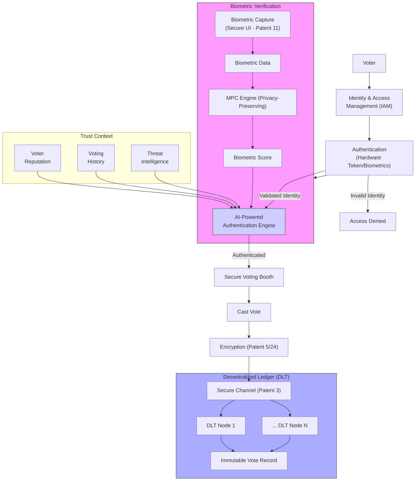
```mermaid
graph TD
    Voter["Voter"] --> IAM["Identity & Access<br> Management (IAM)"]
    IAM --> Authentication["Authentication<br>(Hardware Token/Biometrics)"]

    Authentication -- Validated Identity --> AI_Engine["AI-Powered<br>Authentication Engine"]
    Authentication -- Invalid Identity --> Access_Denied["Access Denied"]

    subgraph Biometric_Verification["Biometric Verification"]
        Biometrics["Biometric Capture<br>(Secure UI - Patent 11)"]
        Biometrics --> Bio_Data["Biometric Data"]
        Bio_Data --> MPC_Engine["MPC Engine (Privacy-Preserving)"] 
        MPC_Engine --> Bio_Score["Biometric Score"]
        Bio_Score --> AI_Engine
    end

    Authentication --> Biometric_Verification

    subgraph Trust_Context["Trust Context"]
        Reputation["Voter<br>Reputation"]
        History["Voting<br>History"]
        Threat_Intel["Threat<br>Intelligence"]

        Reputation --> AI_Engine
        History --> AI_Engine
        Threat_Intel --> AI_Engine
    end

    AI_Engine -- Authenticated --> Voting_Booth["Secure Voting Booth"]
    Voting_Booth --> Vote["Cast Vote"]
    Vote --> Encryption["Encryption (Patent 5/24)"]

    Encryption --> Secure_Channel["Secure Channel (Patent 3)"]

    subgraph DLT["Decentralized Ledger (DLT)"]
        Secure_Channel --> DLT_Node_1["DLT Node 1"]
        Secure_Channel --> DLT_Node_N["... DLT Node N"]
        DLT_Node_1 --> Ledger["Immutable Vote Record"]
        DLT_Node_N --> Ledger
    end

    style AI_Engine fill:#ccf,stroke:#888,stroke-width:2px
    style DLT fill:#aaf,stroke:#444
    style Biometric_Verification fill:#f9f,stroke:#333
```

**Description of Diagram:**

This diagram details the AI-driven voter authentication and decentralized ledger system described in Patent 13.

1.  **Voter and Initial Checks:**
    *   **Voter:** Represents the citizen attempting to vote.
    *   **Identity & Access Management (IAM):** Performs initial identity checks.
    *   **Authentication (Hardware Token/Biometrics):** Handles the multi-factor authentication process, using hardware tokens and/or biometrics.  If initial validation fails, access is denied.  If successful, it passes to the AI engine for final authentication.
2.  **AI-Powered Authentication Engine:** This is the core component that makes the final authentication decision, taking into account various factors:
    *   **Validated Identity:**  Initial identity information from the Authentication component.
    *   **Biometric Verification Subgraph:**
        *   Biometric capture occurs within a secure UI (Patent 11).
        *   Biometric data is processed using an MPC Engine for privacy preservation.
        *   The resulting Biometric Score is sent to the AI Engine.
    *   **Trust Context Subgraph:** Includes additional factors used for context-aware authentication:
        *   **Voter Reputation:**  A score representing the voter's past behavior or trustworthiness.
        *   **Voting History:**  The voter's past voting activity.
        *   **Threat Intelligence:** Real-time information about potential threats or attacks.
3.  **Secure Voting and Recording:**
    *   **Secure Voting Booth:** Once authenticated, the voter accesses the secure voting booth.
    *   **Cast Vote:** The action of casting a vote.
    *   **Encryption (Patents 5/24):** The vote is encrypted using quantum-resistant and/or hardware-enforced encryption before transmission.
    *   **Secure Channel (Patent 3):** The encrypted vote is transmitted through a secure channel to the Decentralized Ledger (DLT).
4.  **Decentralized Ledger (DLT):**
    *   The encrypted vote is recorded on a distributed, tamper-proof ledger.  Multiple DLT nodes are shown to illustrate the distributed nature. The ledger provides an immutable record of the vote.

**Key Features and Interactions:**

*   **Multi-Factor Authentication:** The diagram shows the use of hardware tokens and biometrics for authentication.
*   **AI-Driven Authentication:** The AI Engine makes context-aware decisions based on multiple factors, including biometrics, reputation, history, and threat intelligence.
*   **Privacy-Preserving Biometrics:**  Biometric data is processed using MPC to protect voter privacy.
*   **Secure Vote Recording:** Encryption and secure channels protect the integrity and confidentiality of votes.
*   **Decentralized Ledger:**  The DLT provides a tamper-proof and auditable record of votes.
*   **SecureSphere Integration:** The diagram illustrates integration with Patents 3, 5, 11, and 24, showcasing the system's layered security approach.

This diagram comprehensively visualizes Patent 13, clarifying the authentication process, the role of AI and biometrics, and how votes are securely recorded on the decentralized ledger.  It demonstrates the patent's contribution to SecureSphere's robust and transparent governance system.

**Claims:**

1.  **(Independent)** A secure governance system for a computing system comprising a plurality of Modular Isolated Execution Stacks (IES) (Patent 1) organized into a hierarchy of Zones (Patent 18), each Zone associated with a Trust Root Configuration (TRC) stored on a decentralized, tamper-proof ledger (Patent 15), comprising:

    a. a plurality of physically isolated Voting Terminals, each terminal associated with a specific Zone, having a unique cryptographic identifier, and further comprising a secure boot mechanism (Patent 1) that verifies the terminal's integrity using a bootstrapping certificate issued by a trusted authority within said Zone, and an attestation process (Patent 13) that generates a signed attestation report recording the terminal's security posture; b. an AI-powered Authentication Engine within each Voting Terminal that: i. analyzes authentication data, dynamically adjusting security thresholds based on real-time risk assessments, contextual factors (user location, device posture, threat intelligence), voter reputation, voting history, and trust policies defined in the TRC of the associated Zone; and ii. verifies presented voter credentials, using at least one of: hardware-based identity tokens, biometric verification, a unique, tamper-evident 3D-printed microstructure (Patent 14), or a combination thereof, wherein authentication methods and security thresholds are dynamically adjusted based on real-time risk assessments and trust policies defined in the relevant TRC; and c. a Decentralized Ledger (Patent 15) storing voter registration information, eligibility criteria, zone-specific voting policies, and validated votes recorded using privacy-preserving techniques, wherein said ledger uses a distributed consensus protocol and quantum-resistant cryptography (Patent 5) to ensure the integrity and immutability of records.

2.  **(Dependent)** The system of claim 1, wherein said AI-powered Authentication Engine utilizes machine learning algorithms to analyze biometric data, detect anomalies and potential fraud attempts, and dynamically adjust security thresholds and authentication methods during the authentication process.
3.  **(Dependent)** The system of claim 1, wherein voter registration information, eligibility criteria, and zone-specific voting policies stored on said Decentralized Ledger are cryptographically protected using a combination of digital signatures (Patent 24), secure multi-party computation (Patent 19), and zero-knowledge proofs (Patent 6).
4.  **(Dependent)** The system of claim 1, wherein validated votes are recorded on said Decentralized Ledger using homomorphic encryption (Patent 20) or other privacy-preserving techniques to ensure the confidentiality of individual votes while maintaining the integrity and verifiability of election results, and wherein the vote records are linked to corresponding voter identifiers and authentication audit trails (Patent 17) recorded during the authentication process.
5.  **(Dependent)** The system of claim 1, wherein said Voting Terminals are integrated with a Secure UI Kernel (Patent 11) to:   a) ensure that user interactions during the authentication process occur within a secure and isolated environment; and   b) dynamically adjust the trust levels of different UI regions based on the context and origin of displayed information, protecting against UI-based attacks and preventing information leakage.
6.  **(Dependent)** The system of claim 1, further comprising a 3D-printed microstructure audit trail system (Patent 14) that generates a unique, tamper-evident 3D microstructure for each voter or voting session, for recording validated votes and authentication events, and for use as a physical second factor for authentication, wherein each microstructure is cryptographically linked to corresponding records on the decentralized ledger.
7.  **(Dependent)** The system of claim 1, wherein said bootstrapping certificate for each Voting Terminal:   a) is issued by a designated Certificate Authority within the associated Zone, with certificate issuance and revocation managed by a decentralized governance system (Patent 13);   b) includes at least one of: the Voting Terminal's unique cryptographic identifier, a hash of its secure boot code, or other verifiable identification information; and    c) is verified by the AI-powered Authentication Engine during the boot process and before initiating any voter authentication procedures.
8.  **(Dependent)** The system of claim 1, wherein said attestation process integrates with said secure boot mechanism and generates a signed attestation report including the status of said bootstrapping certificate and other security-relevant information about the Voting Terminal.

## Patent 14: 3D-Printed Microstructure Audit Trail for Citizen Voting System

**Abstract:**

This invention introduces a novel system for generating a secure and verifiable physical audit trail for citizen voting in elections.  The system utilizes advanced 3D-printing technology to create unique, tamper-evident microstructures that serve as physical representations of individual votes. Each microstructure incorporates a unique identifier encoded in its physical geometry, providing a robust and compact audit trail that can be verified independently of electronic voting records.

These microstructures are generated during the voting process and stored securely within a tamper-evident container, forming a physical chain of custody.  The system seamlessly integrates with the SecureSphere governance and authentication system, ensuring secure voter identification and vote recording. A dedicated verification module enables authorized auditors to scan and decode the microstructures, providing a transparent and auditable record of each vote cast, bolstering public trust and confidence in the electoral process.

**Diagram:**

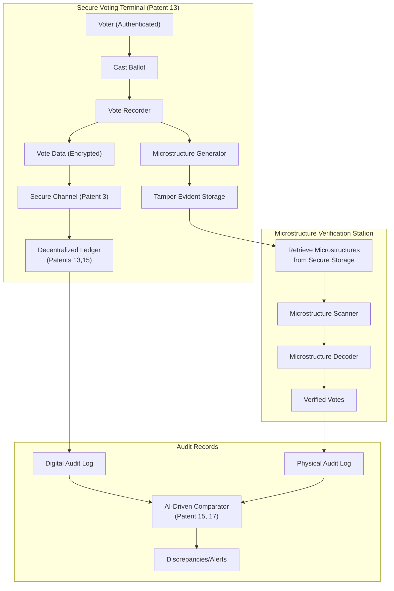
```mermaid
graph TD
    subgraph Voting_Terminal["Secure Voting Terminal (Patent 13)"]
        Voter["Voter (Authenticated)"] --> Ballot["Cast Ballot"]
        Ballot --> Vote_Recorder["Vote Recorder"]
        Vote_Recorder --> Data["Vote Data (Encrypted)"]
        Data --> Secure_Channel["Secure Channel (Patent 3)"]
        Secure_Channel --> DLT["Decentralized Ledger<br>(Patents 13,15)"]


        Vote_Recorder --> Microstructure_Gen["Microstructure Generator"]
        Microstructure_Gen --> Storage["Tamper-Evident Storage"]
    end

    subgraph Verification_Station["Microstructure Verification Station"]
        Storage_Retrieval["Retrieve Microstructures<br>from Secure Storage"]
        Storage --> Storage_Retrieval
        Storage_Retrieval --> Scanner["Microstructure Scanner"]
        Scanner --> Decoder["Microstructure Decoder"]
        Decoder --> Verified_Votes["Verified Votes"]
    end
    
    subgraph Audit_Records["Audit Records"]
        DLT --> Audit_Log["Digital Audit Log"]
        Verified_Votes --> Physical_Log["Physical Audit Log"]
        AI["AI-Driven Comparator <br> (Patent 15, 17)"] --> Discrepancies["Discrepancies/Alerts"]
        Audit_Log --> AI
        Physical_Log --> AI
    end
```

**Description of Diagram:**

This diagram illustrates the process of generating and verifying 3D-printed microstructures for a secure audit trail in a citizen voting system, as described in Patent 14.

1.  **Secure Voting Terminal (Patent 13):** This subgraph represents the secure voting terminal where votes are cast and microstructures are generated.
    *   **Voter (Authenticated):**  The voter, after being authenticated (Patent 13).
    *   **Cast Ballot:**  The act of casting a vote.
    *   **Vote Recorder:** Records the vote digitally and triggers microstructure generation.  Sends encrypted vote data through a secure channel (Patent 3) to the Decentralized Ledger.
    *   **Microstructure Generator:** Generates a unique 3D microstructure corresponding to the vote.
    *   **Tamper-Evident Storage:** Securely stores the generated microstructures.
2.  **Microstructure Verification Station:** This subgraph represents the station where microstructures are retrieved from storage, scanned, and decoded for verification and comparison.
3.  **Audit Records:** This subgraph represents the process of comparing digital and physical audit logs.
    *   **Decentralized Ledger (Patents 13, 15):**  Stores the digital voting records.
    *   **Digital Audit Log:** The digital record of votes from the decentralized ledger.
    *   **Physical Audit Log:** The decoded information from the verified microstructures.
    *   **AI-Driven Comparator (Patents 15, 17):**  Compares the digital and physical audit logs to detect discrepancies and generate alerts, using AI analysis.  This leverages features from Patents 15 and 17.

**Key Features and Interactions:**

*   **Secure Vote Recording:** The diagram shows the flow of vote data from the Voter to the Decentralized Ledger, highlighting encryption and secure channels.
*   **Microstructure Generation:**  The process of generating microstructures and storing them securely is clearly depicted.
*   **Independent Verification:**  The Microstructure Verification Station enables independent verification of the physical audit trail.
*   **Tamper Evidence:** The Tamper-Evident Storage and the brittle nature of the microstructures (mentioned in the patent description) provide strong tamper evidence.
*   **Automated Comparison:** The AI-Driven Comparator automates the process of comparing the digital and physical audit trails, improving efficiency and accuracy.
*   **SecureSphere Integration:**  The diagram shows integration with Patents 3, 13, 15, and 17, illustrating how Patent 14 works within the broader SecureSphere ecosystem.

This diagram visually explains the key innovations of Patent 14 and their role in creating a secure and verifiable audit trail for citizen voting. It clarifies the process of microstructure generation and verification, emphasizing the system's transparency and resistance to manipulation.

**Claims:**

1.  **3D-Printed Microstructure as a Physical Vote Representation:**
    *   A system for generating a physical audit trail for citizen voting, comprising a secure voting terminal equipped with a 3D-printer capable of producing unique, tamper-evident microstructures.
    *   Each microstructure represents a single vote cast by a citizen and incorporates a unique identifier encoded in its physical geometry, forming a physically verifiable representation of the vote.
2.  **Unique Microstructure Identifier Encoding:**
    *   The system of claim 1, wherein the unique identifier encoded in each microstructure is generated using a combination of:
        *   Randomized geometric patterns imprinted within the microstructure.
        *   Embedded micro-scale features, such as voids, cavities, or material variations, that are detectable through optical or other scanning methods.
        *   Secure cryptographic hash functions that link the physical identifier to the corresponding digital voting record.
3.  **Tamper-Evident Microstructure Design:**
    *   The system of claim 1, wherein the microstructures are designed with tamper-evident features, such as:
        *   Brittle or frangible materials that shatter or deform upon attempted tampering.
        *   Micro-scale security markings that become visibly altered if the microstructure is compromised.
        *   Embedded sensors that detect changes in the microstructure's physical integrity.
4.  **Secure Microstructure Storage and Chain of Custody:**
    *   The system of claim 1, further comprising a tamper-evident storage container for securely storing the generated microstructures after each vote is cast.
    *   The storage container maintains a chain of custody for the physical audit trail, ensuring that the microstructures are protected from unauthorized access, removal, or alteration.
5.  **Integration with SecureSphere Governance and Authentication:**
    *   The system of claim 1, wherein the voting terminal is integrated with the SecureSphere governance and authentication system, providing secure voter identification and vote recording using hardware tokens, biometrics, or other secure authentication methods.
    *   The unique identifier of each microstructure is securely linked to the corresponding voter's authenticated identity, ensuring the integrity and traceability of each vote.
6.  **Microstructure Verification Module for Audit Trail Validation:**
    *   The system of claim 1, further comprising a dedicated Microstructure Verification Module that enables authorized auditors to scan and decode the unique identifiers embedded in the microstructures.
    *   The verification module provides a transparent and auditable record of each vote cast, independent of electronic voting records, allowing for independent verification and validation of election results.
7.  **Compact and Scalable Microstructure Design:**
    *   The system of claim 1, wherein the microstructures are designed to be compact and scalable, enabling efficient storage and processing of large volumes of voting data.
    *   The microstructures utilize materials and fabrication techniques that allow for high-throughput production and cost-effective implementation at scale.

**Novel Claims Drawing on External Research:**

8.  **Multi-Material 3D Printing for Enhanced Security:**
    *   The system of claim 1, wherein the 3D-printer utilizes multi-material printing techniques to create microstructures with embedded security features using materials with different optical, electrical, or magnetic properties.
    *   [Reference: "Multi-material 3D printing for functionally graded materials" - ScienceDirect]
9.  **Microfluidic Channels for Tamper-Evident Ink Encapsulation:**
    *   The system of claim 1, wherein the microstructures incorporate microfluidic channels filled with a tamper-evident ink or dye that is released upon attempted tampering.
    *   [Reference: "Microfluidic fabrication of 3D microstructures" - Nature Reviews Materials]
10. **DNA-Based Microstructure Tagging for Ultimate Security:**
    *   The system of claim 1, wherein the microstructures are tagged with unique DNA sequences, providing an unparalleled level of security and tamper-proofing.
    *   [Reference: "DNA-based microstructures for information storage" - Nature Nanotechnology]

## Patent 15: AI-Powered Governance Auditing and Transparency with TRC Monitoring and Automated Conflict Resolution

**Abstract:**

This invention discloses an AI-powered governance auditing and transparency system for SecureSphere, enhancing accountability and trust within a decentralized, zoned environment. The system features an AI-driven Auditing Module that analyzes voting records, policy decisions, system events, and Trust Root Configurations (TRCs) for anomalies and inconsistencies, correlating digital records with physical microstructures and software provenance. An Automated Conflict Resolution mechanism addresses inconsistencies between TRCs, promoting system stability. A real-time policy simulation engine allows for proactive governance and citizen feedback. Integration with a decentralized, tamper-proof ledger ensures transparency and auditability, while access control mechanisms protect sensitive information. This comprehensive approach provides robust oversight and promotes trustworthy governance within SecureSphere.

**Diagram:**

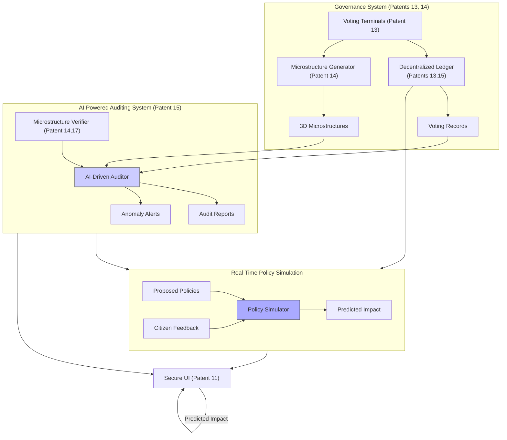
```mermaid
graph TD
    subgraph Governance_System["Governance System (Patents 13, 14)"]
        Voting["Voting Terminals (Patent 13)"] --> DLT["Decentralized Ledger<br>(Patents 13,15)"]
        DLT --> Voting_Records["Voting Records"]
        Voting --> Microstructure_Gen["Microstructure Generator (Patent 14)"]
        Microstructure_Gen --> Microstructures["3D Microstructures"]
    end

    subgraph Auditing_System["AI Powered Auditing System (Patent 15)"]
        Voting_Records --> AI_Auditor["AI-Driven Auditor"]
        Microstructures --> AI_Auditor
        Microstructure_Verifier["Microstructure Verifier (Patent 14,17)"] --> AI_Auditor
        AI_Auditor --> Audit_Reports["Audit Reports"]
        AI_Auditor --> Anomaly_Alerts["Anomaly Alerts"]
    end

    subgraph Policy_Simulation["Real-Time Policy Simulation"]
        Proposed_Policies["Proposed Policies"] --> Simulator["Policy Simulator"]
        Simulator --> Predicted_Impact["Predicted Impact"]
        Citizen_Feedback["Citizen Feedback"] --> Simulator
    end

    Auditing_System ----> Policy_Simulation
    DLT --> Policy_Simulation
    Auditing_System --> Secure_UI["Secure UI (Patent 11)"] -->|"Audit Reports/Alerts"| Secure_UI
    Policy_Simulation --> Secure_UI -->|"Predicted Impact"| Secure_UI

    style AI_Auditor fill:#ccf,stroke:#888,stroke-width:2px
    style Simulator fill:#aaf,stroke:#444
```

**Description of Diagram:**

This diagram illustrates the components and interactions of the AI-powered governance auditing and transparency system described in Patent 15.

1.  **Governance System (Patents 13, 14):**  This subgraph represents the core governance components.
    *   **Voting Terminals (Patent 13):**  Where citizens cast their votes.
    *   **Decentralized Ledger (Patents 13, 15):**  Securely records voting data.
    *   **Voting Records:** The digital records of the votes stored on the ledger.
    *   **Microstructure Generator (Patent 14):**  Creates physical microstructures corresponding to each vote.
    *   **3D Microstructures:** The physical, tamper-evident audit trail.
2.  **AI-Powered Auditing System (Patent 15):**  This subgraph represents the core auditing components.
    *   **AI-Driven Auditor:** Analyzes voting records and microstructures to generate audit reports and detect anomalies, leveraging the microstructure verifier from Patent 14 and MDATS (Patent 17).
    *   **Audit Reports:**  Reports generated by the AI_Auditor.
    *   **Anomaly Alerts:**  Alerts triggered by detected anomalies.
3.  **Real-Time Policy Simulation:** This subgraph represents the policy simulation engine.
    *   **Proposed Policies:**  Represents the input to the simulator.
    *   **Policy Simulator:** Simulates the impact of proposed policies.  It takes input from the Decentralized Ledger and the Auditing System
    *   **Predicted Impact:** The output of the simulation.
    *   **Citizen Feedback:**  Citizens can provide feedback on the predicted impact of policies, which feeds back into the simulator.
4.  **Secure UI (Patent 11):**  Displays audit reports, anomaly alerts, and predicted policy impacts to authorized users and citizens.

**Key Features and Interactions:**

*   **Multi-Dimensional Auditing:**  The AI-Driven Auditor analyzes both digital voting records and physical microstructures, ensuring a comprehensive audit trail.
*   **Transparency and Accountability:** The decentralized ledger and physical microstructures provide transparency and enable independent verification.
*   **AI-Driven Analysis:**  The AI_Auditor uses AI to detect anomalies and potential fraud.
*   **Citizen Engagement:**  The Real-Time Policy Simulation allows citizens to understand and provide feedback on proposed policies.
*   **SecureSphere Integration:** The diagram integrates Patents 11, 13, and 14, showing how Patent 15 leverages SecureSphere’s security and governance mechanisms. This diagram visually clarifies the functionalities of Patent 15 and its contribution to secure and transparent governance within SecureSphere.  It highlights the use of AI, blockchain, and 3D microstructures, demonstrating the system's innovative approach to auditing and citizen engagement.

**Claims:**

1.  A secure governance auditing system for a computing system comprising a plurality of Modular Isolated Execution Stacks (IES) (Patent 1) organized into a hierarchy of Zones (Patent 18), each Zone associated with a Trust Root Configuration (TRC) stored on a decentralized, tamper-proof ledger (Patent 15), comprising:

    a) a plurality of physically isolated execution environments for processing and auditing governance data; b) an AI-powered Auditing Module that analyzes voting records (Patent 13), policy decisions, system events, and TRCs for anomalies, inconsistencies, or potential security breaches, comparing digital records on the ledger with corresponding physical microstructures (Patent 14) and software provenance records (Patent 17); and c) an Automated Conflict Resolution mechanism that attempts to resolve detected inconsistencies between TRCs of different Zones based on predefined rules or a distributed consensus protocol, and records the resolution outcomes on the decentralized ledger.

2.  The system of claim 1, wherein said AI-powered Auditing Module:

    a) monitors TRCs for changes; b) verifies the authenticity and integrity of TRC updates using digital signatures and cross-signatures between TRCs of connected Zones (Patent 4); and c) records all TRC changes and verification results on the decentralized ledger.

3.  The system of claim 1, wherein said AI-powered Auditing Module detects and reports inconsistencies between TRCs of different Zones, including conflicts in at least one of:

    a) trust root configurations; b) security policies; or c) resource allocation rules.

4.  The system of claim 3, wherein said Automated Conflict Resolution mechanism:

    a) utilizes a distributed consensus protocol involving representatives from affected Zones to negotiate a compromise solution; and b) records the outcome of the negotiation on the decentralized ledger.

5.  The system of claim 1, wherein said AI-powered Auditing Module correlates digital records on the ledger with corresponding physical microstructures generated by a 3D-printed microstructure audit trail system (Patent 14), detecting anomalies that could indicate at least one of:

    a) tampering; or b) inconsistencies.

6.  The system of claim 1, further comprising a Real-Time Policy Simulation Engine that:

    a) allows users to interact with proposed policy changes and explore their potential impact on system behavior and security; b) allows users to provide feedback on proposed policy changes; and c) records the simulation results and feedback on the decentralized ledger.

7.  The system of claim 1, wherein:

    a) the decentralized ledger is accessible to authorized individuals and the public, providing transparent and auditable access to governance data, TRCs, and conflict resolution outcomes; and b) access control mechanisms are employed to protect sensitive information.

8.  The system of claim 1, wherein said AI-powered Auditing Module:

    a) employs machine learning algorithms to detect anomalies and potential vulnerabilities in real-time; and b) generates alerts and notifications to designated authorities.

9.  The system of claim 1, further comprising a Predictive Analysis Module that utilizes AI algorithms to identify potential governance issues or vulnerabilities before they manifest, based on at least one of:

    a) historical data; b) trend analysis; or c) trust levels derived from the DTMS (Patent 4).

## Patent 16: Automated Evolutionary Software Development with Secure, Zoned Deployment, TRC-Based Verification, and Adaptive AI-Driven Security

**Abstract:**

This invention presents an Automated Evolutionary Software Development System (AESDS) for the SecureSphere ecosystem, enabling secure, adaptable, and autonomous software evolution within a zoned, multi-kernel environment.  The AESDS integrates with Modular Isolated Execution Stacks (IES) and leverages AI-driven algorithms to generate, refine, and deploy software updates, adapting to evolving threats and user needs.  Informed by a knowledge base, performance metrics, user feedback, and threat intelligence, the AI engine produces software candidates that undergo rigorous testing for compatibility, security, and performance in isolated sandboxed environments within IES instances. A decentralized governance framework, incorporating blockchain technology and AI-driven policy analysis, governs software approval and deployment, ensuring transparency and accountability. The AESDS distributes software updates securely via authenticated SCION paths, preventing interception or tampering.  TRCs verify the authenticity and integrity of updates, ensuring that only authorized software is installed. An Adaptive AI-Driven Security module analyzes real-time system behavior, threat intelligence, and vulnerability reports delivered via SCION Control Message Protocol (SCMP), proactively generating security patches, policy adjustments, and resource allocation optimizations.  Furthermore, the AESDS proactively incorporates defenses against timing side-channel attacks by embedding mitigation techniques, such as constant-time algorithms and compiler-level obfuscation, directly into generated software artifacts. This comprehensive approach creates a self-evolving software ecosystem that continuously adapts to the dynamic threat landscape while maintaining robust security within SecureSphere.

**Diagram:**

```mermaid
graph TD
    subgraph "AESDS (Automated Evolutionary Software Development System)"
        KB["Knowledge Base<br>(Best Practices, Libraries)"] --> AI_Engine
        Metrics["Performance Metrics"] --> AI_Engine
        User_Feedback["User Feedback"] --> AI_Engine
        AI_Engine["AI Engine<br>(Code Gen & Refinement)"] --> Code_Gen
        Code_Gen["Code Generator"] --> Sandbox
        Threat_Intel["Threat Intelligence"] --> Adaptive_Security
        Sandbox["Sandbox Environment<br>(IES Instance)"] --> Multi_Layered_Validation
        
        subgraph "Multi-Layered Validation"
            Compatibility_Testing["Compatibility Testing"]
            Security_Testing["Security Testing"]
            Performance_Testing["Performance Testing"]
        end

        Multi_Layered_Validation --> Software_Artifact
        Software_Artifact["Software Artifact"] --> Policy_Analysis
        Adaptive_Security["Adaptive AI-Driven Security<br>(Patch Generation)"] --> Software_Artifact

        subgraph "Decentralized Governance Framework"
            Policy_Analysis["AI-Driven Policy Analysis"]
            Policy_Analysis -- Recommendation --> Consensus
            Consensus["Consensus Mechanism"] --> Blockchain
            Blockchain["Blockchain Ledger"] --> Secure_Repository
        end

        Secure_Repository["Secure Software Repository"] --> Secure_Distribution
        Secure_Distribution["Secure Distribution Network"] --> Deployment
        Deployment["Deployment to IES Instances"] --> Metrics
    end
```

**Diagram Description:**

This diagram provides a detailed view of the internal components and processes of the Automated Evolutionary Software Development System (AESDS).  It breaks down the AESDS functionalities and how they contribute to a secure and adaptive software development lifecycle.

*   **AESDS (Automated Evolutionary Software Development System):**  This encapsulates the entire system.
    *   **AI Engine (Code Generation & Refinement):** The core of the AESDS, responsible for generating and refining code using AI algorithms.  It leverages:
        *   **Knowledge Base (Best Practices, Libraries):** A repository of best practices, code libraries, and design patterns.
        *   **Performance Metrics (Resource Utilization, Execution Time):** Feedback from deployed software to optimize performance.
        *   **User Feedback:**  Input from users on software usability and functionality.
    *   **Code Generator:**  Produces software artifacts based on the AI Engine's instructions.
    *   **Sandbox Environment (IES Instance):** An isolated environment for testing software artifacts.
    *   **Multi-Layered Validation:**  A series of tests to ensure software quality and security.
        *   **Compatibility Testing:** Checks compatibility with existing systems.
        *   **Security Testing:**  Identifies potential vulnerabilities.
        *   **Performance Testing:** Evaluates resource utilization and execution speed.
    *   **Software Artifact:** The resulting software package after validation.
    *   **Decentralized Governance Framework:** Manages the approval and deployment of software updates.
        *   **AI-Driven Policy Analysis (Ethical & Regulatory Checks):** Evaluates the software against predefined policies and guidelines.
        *   **Blockchain Ledger (Immutable Audit Trail):**  Records all software changes and approvals.
        *   **Consensus Mechanism (Multi-Entity Approval):** Ensures that software updates are vetted by multiple authorized parties.
    *   **Adaptive AI-Driven Security (Patch Generation):**  Analyzes system behavior and threat intelligence to generate security patches.
        *   **Threat Intelligence:** Real-time feeds of security threats and vulnerabilities.
    *   **Secure Software Repository:** Stores validated and approved software artifacts.
    *   **Secure Distribution Network (Encrypted & Authenticated):**  Distributes software updates securely to IES instances.
    *   **Deployment to IES Instances:**  The final stage of the software development lifecycle.

**Patent References:**

*   **Patent 1:** Modular IES architecture provides the foundation for sandboxed environments.
*   **Patent 2:**  MSM integration ensures security monitoring during testing and deployment.
*   **Patent 4 & 16:** DTMS manages trust relationships and governs access to the AESDS and software repositories.
*   **Patent 12:** Integration with SecureSphere’s Physical Audit Trail is hinted at through the blockchain ledger, although not explicitly shown in this diagram.
*   **Patent 13 & 15:**  Decentralized Ledger technology is used for the Blockchain component.
*   **Patent 16:**  Covers the overall AESDS architecture and its components.
*   **Patent 20:** Secure Data Enclaves are used for certain aspects of testing and validation, though not explicitly shown here.

This diagram provides a comprehensive visual representation of the AESDS, illustrating its key components and functionalities. It clarifies the complex process of automated software development within the secure SecureSphere environment and how it integrates with other SecureSphere technologies. It also reinforces the intellectual property protection of Patent 16 by detailing its inner workings.

**Diagram 2 for Patent 16:**
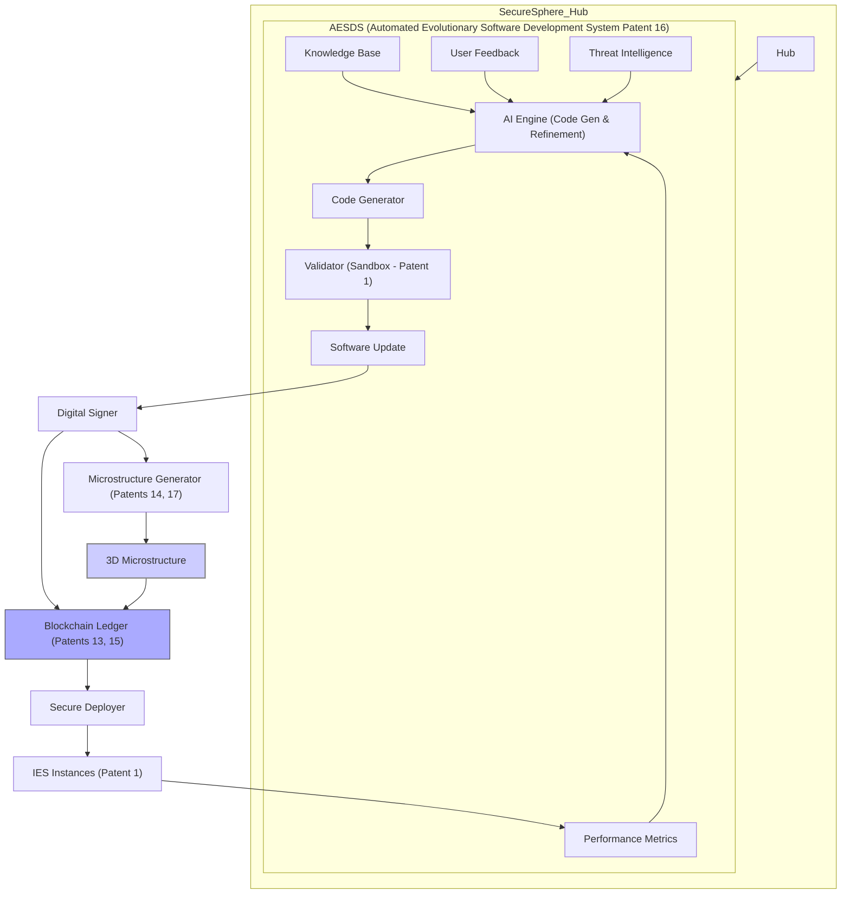
```mermaid
graph TD
    subgraph AESDS["AESDS (Automated Evolutionary Software Development System Patent 16)"]
        AI_Engine["AI Engine (Code Gen & Refinement)"] --> Code_Generator["Code Generator"]
        KB["Knowledge Base"] --> AI_Engine
        Metrics["Performance Metrics"] --> AI_Engine
        User_Feedback["User Feedback"] --> AI_Engine
        Threat_Intel["Threat Intelligence"] --> AI_Engine
        Code_Generator --> Validator["Validator (Sandbox - Patent 1)"]
        Validator --> Software_Update["Software Update"]
    end

    Software_Update --> Signer["Digital Signer"]
    Signer --> Microstructure_Gen["Microstructure Generator (Patents 14, 17)"]
    Microstructure_Gen --> Microstructure["3D Microstructure"]

    Signer --> Blockchain["Blockchain Ledger (Patents 13, 15)"]
    Microstructure --> Blockchain

    Blockchain --> Deployer["Secure Deployer"]
    Deployer --> IES_Instances["IES Instances (Patent 1)"]

    IES_Instances --> Metrics

    subgraph SecureSphere_Hub
        Hub["Hub"] --> AESDS
    end

    style Microstructure fill:#ccf,stroke:#888,stroke-width:2px
    style Blockchain fill:#aaf,stroke:#444
```

**Description for Diagram 2 for Patent 16:**

This diagram for Patent 21 (Blockchain-Enabled Self-Evolving Software System) clarifies the data flow, integrates relevant SecureSphere components, and emphasizes the security aspects of software evolution.

1.  **AESDS (Patent 16):** This subgraph represents the core of the automated software development process.
    *   Inputs:  Knowledge Base, Performance Metrics (from running IES instances), User Feedback, and Threat Intelligence.  The explicit link to performance metrics emphasizes data-driven evolution.
    *   AI Engine:  Generates and refines software updates based on these inputs.
    *   Code Generator: Creates the software update artifacts.
    *   Validator (Patent 1): Uses sandboxed IES instances for validation.
    *   Software Update: The generated update, ready for further processing.
    *   Adaptive Security (Patent 7): Integrates anomaly detection and self-healing feedback into the software evolution process.  This closed-loop system is a key strength.
2.  **SecureSphere Hub:**  Now explicitly included. The Hub provides triggers for software updates (e.g., based on scheduled updates, vulnerability reports, or governance decisions) and/or policy guidelines for the AESDS.  This highlights the managed aspect of the automated system.
3.  **Linking to Blockchain and Microstructures:**
    *   Digital Signer (Patent 24):  Cryptographically signs the software update using techniques from Patent 24 (HESE-DAR), ensuring its integrity.
    *   Microstructure Generator (Patents 14, 17): Creates a physical microstructure, embedding the update's signature, providing tamper evidence.
    *   Blockchain Ledger (Patents 13, 15): The digital signature and microstructure identifier are recorded on the blockchain, creating a permanent and auditable record.
4.  **Secure Deployment:**
    *   Secure Deployer (DTMS - Patent 4):  Deploys the software update to IES instances, leveraging the DTMS (Patent 4) to ensure only authorized and trusted updates are installed.  This adds a layer of security to the deployment process.
5.  **Feedback Loop:**  Performance Metrics from updated IES instances are fed back into the AESDS for continuous improvement.

**Key Features Highlighted:**

*   **Software Provenance:** The diagram clearly shows the link between the software update, its digital signature, the 3D microstructure, and the blockchain record.  This creates a tamper-proof chain of custody.
*   **AI-Driven Evolution:**  The AESDS, driven by AI, is central to the software development process.
*   **Secure Deployment:**  The Secure Deployer ensures that only validated and authenticated updates are installed.
*   **Continuous Improvement:**  The feedback loop from IES Instances to the AESDS enables continuous improvement and adaptation.
*   **Patent Integration:** The diagram references related patents, demonstrating how Patent 21 builds upon and integrates with other SecureSphere technologies.

This diagram provides a clear and concise visualization of Patent 21, effectively communicating its key innovations and their integration within the SecureSphere ecosystem.  It clarifies the process of secure and verifiable software evolution, emphasizing the system's adaptability and resilience.

**Diagram 3: Isomorphic Architecture Monitoring and Adaptation (IAMA)**

```mermaid
graph TD
    subgraph "AESDS (Patent 16)"

        subgraph "Isomorphic Architecture Monitoring & Adaptation (IAMA)"
            Legacy_System["Legacy System"] --> Data_Diode["Data Diode (Patent 2)"]
            Data_Diode --> Monitor["Legacy System Monitor"]
            Monitor --> Isomorphic_Model["Isomorphic Model<br>(Legacy System Representation)"]
            Isomorphic_Model --> AI_Engine_IAMA["AI Engine<br>(Anomaly Detection & Prediction)"]
            AI_Engine_IAMA -- Predicted Vulnerabilities --> Patch_Generator["Patch Generator"]
        end
        
        KB["Knowledge Base"] --> AI_Engine_AESDS["AI Engine<br>(Code Gen & Refinement)"]
        Metrics["Performance Metrics"] --> AI_Engine_AESDS
        User_Feedback["User Feedback"] --> AI_Engine_AESDS
        AI_Engine_AESDS --> Code_Gen["Code Generator"]
        Code_Gen --> Sandbox["Sandbox Environment (Patent 1)"]
        Threat_Intel["Threat Intelligence"] --> Adaptive_Security["Adaptive Security (Patent 7)"]

        subgraph "Multi-Layered Validation"
            Compatibility["Compatibility Testing"]
            Security["Security Testing"]
            Performance["Performance Testing"]
        end
        Sandbox --> Multi_Layered_Validation
        Patch_Generator --> Multi_Layered_Validation
        
        Multi_Layered_Validation --> Software_Artifact["Software Artifact"]
        Adaptive_Security --> Software_Artifact
        
        Software_Artifact --> Policy_Analysis_Gov["AI-Driven Policy Analysis (Patent 15)"]

        subgraph "Decentralized Governance (Patents 13, 15)"
            Policy_Analysis_Gov -- Recommendation --> Consensus["Consensus Mechanism"]
            Consensus --> Blockchain["Blockchain Ledger"]
        end
        Blockchain --> Secure_Repo["Secure Repository"]

        Secure_Repo --> Secure_Distribution["Secure Distribution (Patent 3)"]
        Secure_Distribution --> Deployment["Deployment<br>(to IES Instances)"]
        Deployment --> Metrics

        IAMA ----> AI_Engine_AESDS
    end
    style IAMA fill:#ccf,stroke:#888,stroke-width:2px
```

**Description for Diagram 3 Isomorphic Architecture Monitoring and Adaptation (IAMA):**

This detailed Mermaid diagram illustrates the integration of the Isomorphic Architecture Monitoring and Adaptation (IAMA) module within the Automated Evolutionary Software Development System (AESDS) of SecureSphere, corresponding to the new claims added to Patent 16.

**AESDS (Patent 16):**  This subgraph encompasses the entire AESDS, including the new IAMA module.

**Isomorphic Architecture Monitoring & Adaptation (IAMA):** This subgraph details the IAMA module and its interaction with the legacy system.

*   **Legacy System:** The external legacy system being monitored.
*   **Data Diode (Patent 2):** Ensures unidirectional data flow from the legacy system to SecureSphere, preventing reverse attacks.
*   **Legacy System Monitor:** Collects security-relevant data (system calls, network traffic) from the legacy system.  Does *not* collect sensitive data, only behavior patterns.
*   **Isomorphic Model:**  A representation of the legacy system's architecture and software within SecureSphere.
*   **AI Engine (Anomaly Detection & Prediction):**  Analyzes monitored data and uses the isomorphic model to predict potential vulnerabilities.
*   **Patch Generator:**  Creates patches for SecureSphere based on predicted vulnerabilities.

**Core AESDS Components:** These components represent the standard AESDS functionality.

*   **Knowledge Base:**  Stores best practices and libraries for software development.
*   **Performance Metrics:** Gathered from deployed IES instances.
*   **User Feedback:** Input from users regarding software functionality and usability.
*   **AI Engine (Code Gen & Refinement):**  Generates and refines code for SecureSphere.  Receives input from the IAMA module regarding predicted vulnerabilities.
*   **Code Generator:** Produces software artifacts.
*   **Sandbox Environment (Patent 1):**  Isolated environment for testing within an IES instance.
*   **Multi-Layered Validation:** Performs compatibility, security, and performance testing.
*   **Software Artifact:** The validated software package, including patches from the IAMA module.
*   **Adaptive Security (Patent 7):**  Provides real-time threat intelligence and generates security-related updates, integrated with the IAMA module's proactive approach.
*   **Threat Intelligence:**  External threat data feeds into the Adaptive Security module.

**Decentralized Governance (Patents 13, 15):**  This subgraph represents the governance framework for software approval.

*   **AI-Driven Policy Analysis (Patent 15):**  Analyzes the software artifact against policies.
*   **Consensus Mechanism:**  Provides multi-entity approval for software deployment.
*   **Blockchain Ledger:** Records software changes, approvals, and deployments.

**Deployment Process:**

*   **Secure Repository:** Stores validated and approved software artifacts.
*   **Secure Distribution (Patent 3):**  Distributes updates securely using authenticated SCION paths.
*   **Deployment (to IES Instances):**  Deploys the software to the target IES instances.

**Diagram 4:**
```mermaid
graph TD
    subgraph "Secure Deployment & Verification"
        K[Secure Software Repository] --> N(Authenticated SCION Paths)
        N --> L(IES Instances)
        K --> O(TRC Verification)
        O --> L
        style K fill:#bbf,stroke:#333,stroke-width:2px
        style N fill:#bbf,stroke:#333,stroke-width:2px
        style O fill:#bbf,stroke:#333,stroke-width:2px
    end
    
    subgraph "Automated Evolutionary Software Development (AESDS)"
        A[AI Engine] --> B(Knowledge<br>Base)
        A --> C(Performance<br>Metrics)
        A --> D(User<br>Feedback)
        A --> E(Threat Intelligence)
        A --> F{IAMA Module}
        A --> G[Code<br>Generator]
        G --> H(Sandbox<br>Environment)
        H --> I[Multi-Layered<br>Validation]
        I --> J(Software<br>Artifact)
        J --> K
        K --> L
        F --> M(Legacy System)
        M -.--> F
        style A fill:#ccf,stroke:#333,stroke-width:2px
        style J fill:#ccf,stroke:#333,stroke-width:2px
    end

    subgraph "Adaptive Security"
        L --> P(System Behavior Monitoring)
        P --> A
        E --> A
        style P fill:#aaf,stroke:#333,stroke-width:2px
    end

    linkStyle default stroke:#555,stroke-width:1px
```

**Description for Diagram 4:**

**Legend:**

*   **AI Engine:** The core AI responsible for software generation and refinement.
*   **Knowledge Base:**  Contains existing code, libraries, and security best practices.
*   **Performance Metrics:** Data gathered from deployed software.
*   **User Feedback:**  Information from users about the software's performance and usability.
*   **Threat Intelligence:**  Information about current security threats.
*   **IAMA Module (Isomorphic Architecture Monitoring & Adaptation):** Monitors a connected legacy system, identifies vulnerabilities, and generates patches specific to SecureSphere.
*   **Code Generator:** Generates new code based on the AI Engine's instructions.
*   **Sandbox Environment:**  A secure environment for testing new code before deployment.
*   **Multi-Layered Validation:**  A series of tests to verify the correctness, security, and performance of the generated code.
*   **Software Artifact:** The final, validated software ready for deployment.
*   **Secure Zoned Deployment:** The secure deployment mechanism using authenticated channels (SCION) and TRC verification.
*   **Authenticated SCION Paths:** Secure communication paths for deploying software updates.
*   **TRC Verification:** Verification of software integrity using Trust Root Configurations (TRCs).
*   **IES Instances:** The isolated execution environments where the software is deployed.
*   **System Behavior Monitoring:** Real-time monitoring to detect security issues and performance degradation.
*   **Legacy System:** An external system being monitored by the IAMA module.

This diagram clearly shows the AI-driven development process, the secure and verified deployment process using SCION and TRCs, and the feedback loop for adaptive security adjustments based on system behavior monitoring and threat intelligence.

**Claims:**

1.  A secure computing system comprising a plurality of Modular Isolated Execution Stacks (IES) (Patent 1) organized into a hierarchy of Zones (Patent 18), each Zone associated with a Trust Root Configuration (TRC) stored on a decentralized, tamper-proof ledger (Patent 15), and a secure communication mechanism (Patent 2) between said IES instances, further comprising an Automated Evolutionary Software Development System (AESDS) that:

    a. autonomously generates, refines, and updates software artifacts for execution within the IES environment, utilizing AI-driven algorithms informed by a knowledge base of best practices, performance metrics feedback from deployed software, user feedback, and threat intelligence; b. incorporates a multi-layered validation process, including compatibility testing, security testing, and performance testing within isolated sandboxed environments (Patent 1) inside IES instances, generating validation reports stored on the decentralized ledger; c. distributes software updates to IES instances through authenticated SCION paths (Patent 3), preventing interception or tampering and ensuring updates originate from authorized sources within defined zones; and d. verifies the authenticity and integrity of software updates using the trust policies and trust roots defined in the relevant TRCs, ensuring only authorized and trusted software is installed.

2.  The system of claim 1, wherein said AESDS further comprises a decentralized governance framework that governs the approval and deployment of software updates, utilizing:

    a. blockchain technology (Patent 15) to create a tamper-proof record of software changes, approvals, and deployments, wherein each software artifact is cryptographically signed and linked to a unique identifier on the blockchain; b. AI-driven policy analysis (Patent 15) to evaluate software updates against predefined security policies, ethical guidelines, and regulatory requirements, providing recommendations to authorized entities for approval or rejection of said updates; and c. a distributed consensus mechanism (Patent 13) to ensure updates are vetted and approved by multiple authorized entities before deployment, wherein approvals are recorded on the blockchain ledger.

3.  The system of claim 1, wherein said AESDS comprises an Adaptive AI-Driven Security module that:

    a. analyzes real-time system behavior, threat intelligence data, and vulnerability reports received via SCION Control Message Protocol (SCMP) to identify, assess, and classify security threats according to severity and potential impact; and b. automatically generates responses to identified threats, including generating security patches and enhancements for deployed software components and system configurations,  proactively addressing vulnerabilities, and wherein said responses comprise at least one of: code modifications, policy updates, or resource allocation adjustments (Patent 10).

4.  The system of claim 1, wherein said AESDS generates software artifacts that incorporate defenses against timing side-channel attacks, embedding at least one of: branch balancing techniques, constant-time algorithms, or compiler-level obfuscation, into generated code to minimize timing variations and enhance resistance to timing-based attacks.
5.  The system of claim 1, wherein said AESDS utilizes a modular software architecture enabling the development and deployment of individual software components that can be easily integrated and updated within the IES environment, promoting scalability and flexibility of the software ecosystem.
6.  The system of claim 1, further comprising a secure software repository and distribution network for:

    a. securely storing validated and approved software artifacts using encryption (Patent 5, Patent 24) and access controls based on TRC policies (Patent 4); and b. securely delivering software updates to IES instances using authenticated SCION paths (Patent 3) and a distributed consensus mechanism for secure and consistent update propagation and verification across zones.

7.  The system of claim 1, wherein said AESDS continuously monitors the performance and security of deployed software components within their respective IES instances, collecting data on resource utilization, execution time, and potential bottlenecks, and wherein said AESDS automatically triggers optimization or remediation procedures based on at least one of: detected performance bottlenecks, identified security vulnerabilities reported via SCMP, or policy updates from the decentralized governance framework, said procedures including at least one of: automated code refinement, resource reallocation (Patent 10), or dynamic scaling of IES instances (Patent 10), and recording all optimization and remediation actions on the decentralized ledger (Patent 15).
8.  The system of claim 1, wherein said AESDS integrates with SecureSphere's Multi-Dimensional Audit Trail System (MDATS - Patent 17) to:

    a. record a comprehensive audit trail of all software development actions, from initial code generation to final deployment, including validation results, approvals, and deployment timestamps; and b. link each software update to a unique physical microstructure (Patent 14) and a digital signature recorded on the decentralized ledger (Patent 15), ensuring transparency and accountability.

9.  A secure computing system comprising a plurality of Modular Isolated Execution Stacks (IES) and an Automated Evolutionary Software Development System (AESDS) as described in Claim 1, further comprising:

    an Isomorphic Architecture Monitoring and Adaptation (IAMA) module within said AESDS, wherein said IAMA module:

    a. creates and maintains an isomorphic model of a connected legacy system;

    b. monitors activity within said legacy system through secure, unidirectional communication channels;

    c. uses said isomorphic model and AI-driven analysis to predict potential vulnerabilities or attack vectors within said legacy system; and

    d. proactively generates and deploys security patches and updates for the SecureSphere system to mitigate predicted vulnerabilities, wherein said patches and updates are distributed and verified using the secure, zoned deployment mechanism of the AESDS.

10. The system of claim 9, wherein said isomorphic model reflects the structure, communication patterns, and functionalities of the legacy system without containing sensitive data from said legacy system.
11. The system of claim 9, wherein said unidirectional communication channels are implemented using data diodes.
12. The system of claim 9, wherein said AI-driven analysis employs machine learning algorithms to identify anomalies and predict vulnerabilities.
13. The system of claim 9, wherein said security patches and updates are deployed to IES instances through authenticated SCION paths and verified using Trust Root Configurations (TRCs).
14. The system of claim 9, wherein said IAMA module continuously monitors the effectiveness of deployed patches and provides feedback to the AI engine to refine predictive models.
15. The system of claim 9, wherein said IAMA module dynamically updates the isomorphic model to reflect changes in the legacy system’s architecture or software.
16. The system of claim 9, wherein said IAMA module prioritizes predicted vulnerabilities based on their potential impact and likelihood of exploitation.

**Description for Claim 9:**

**Isomorphic Architecture Monitoring and Adaptation Innovation:**

This innovation introduces a proactive security mechanism within the Automated Evolutionary Software Development System (AESDS) called Isomorphic Architecture Monitoring and Adaptation (IAMA). IAMA leverages an isomorphic model of the legacy system within SecureSphere.  This isomorphic model mirrors the structure and functionality of the legacy system, allowing the AI engine to analyze its behavior and predict potential vulnerabilities or attacks *before* they impact SecureSphere.

Here's how it works:

1.  **Isomorphic Model Creation:** The AESDS creates and maintains an isomorphic representation of the legacy system's architecture and software.  This model doesn't contain actual sensitive data from the legacy system, but it accurately reflects its structure, communication patterns, and functionalities.
2.  **Continuous Monitoring:** The AI engine continuously monitors the activity within the legacy system through secure, unidirectional communication channels (data diodes).  It analyzes system calls, network traffic, and other observable behaviors.  This monitoring focuses on security-relevant events and patterns, not on sensitive data itself.
3.  **Anomaly Detection and Prediction:**  Using machine learning and the isomorphic model, the AI engine identifies anomalies and predicts potential vulnerabilities or attack vectors that could be exploited in the legacy system. The isomorphic model helps to contextualize observed behaviors and identify patterns indicative of malicious activity.
4.  **Proactive Patch Generation:** Based on the predicted vulnerabilities, the AI engine proactively generates patches and updates for the *SecureSphere* system.  These updates address potential weaknesses *before* they can be exploited, effectively immunizing SecureSphere against attacks that might target the legacy system's vulnerabilities.
5.  **Automated Deployment:** The AESDS automatically deploys the generated patches through its secure, zoned deployment mechanism (as described in Patent 16).  This ensures that SecureSphere remains up-to-date and protected against evolving threats originating from the legacy environment.
6.  **Feedback Loop:**  The performance and effectiveness of the deployed patches are monitored, providing feedback to the AI engine to refine its predictive models and improve the accuracy of future patch generation.

**How it Fits into SecureSphere:**

IAMA enhances SecureSphere's proactive security capabilities. It complements the existing security features (IES, DTMS, etc.) by providing a forward-looking defense against attacks that might exploit vulnerabilities in legacy systems connected to SecureSphere. This strengthens SecureSphere’s position as a robust and adaptive security solution, particularly in environments where legacy system integration is necessary.

## Patent 17: Multi-Dimensional Audit Trail System for SecureSphere with AI-Driven Microstructure Analysis and Software Provenance Tracking

**Abstract:**

This invention presents a groundbreaking Multi-Dimensional Audit Trail System (MDATS) for the SecureSphere secure computing ecosystem, enhancing governance auditing and ensuring the integrity of software development processes.  The MDATS seamlessly integrates a 3D-printed microstructure audit trail (Patent 13) with AI-driven analysis and blockchain-based provenance tracking.

An AI-powered Auditing Module continuously monitors governance activities, correlating digital records on the decentralized ledger with their corresponding physical microstructures.  The AI module analyzes the physical characteristics of the microstructures for anomalies indicative of tampering or inconsistencies, providing an unparalleled level of auditability and security.

Furthermore, the MDATS extends the physical audit trail to encompass software development, securely linking each software update generated by the Automated Evolutionary Software Development System (AESDS) (Patent 15) to a unique microstructure.  This integration enables comprehensive tracking of software provenance, ensuring transparency and accountability throughout the software lifecycle.

**Diagram:**

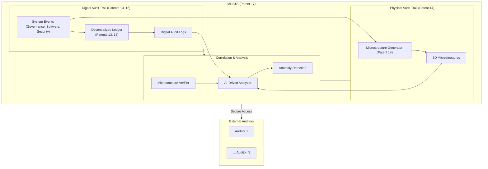
```mermaid
graph TD
    subgraph MDATS["MDATS (Patent 17)"]
        subgraph Digital_Audit_Trail["Digital Audit Trail (Patents 13, 15)"]
            Events["System Events (Governance, Software, Security)"] --> DLT["Decentralized Ledger<br>(Patents 13, 15)"]
            DLT --> Audit_Logs["Digital Audit Logs"]
        end

        subgraph Physical_Audit_Trail["Physical Audit Trail (Patent 14)"]
            Events --> Microstructure_Gen["Microstructure Generator (Patent 14)"]
            Microstructure_Gen --> Microstructures["3D Microstructures"]
        end

        subgraph Correlation_Analysis["Correlation & Analysis"]
            AI_Analyzer["AI-Driven Analyzer"] --> Anomaly_Detection["Anomaly Detection"]
            Audit_Logs --> AI_Analyzer
            Microstructures --> AI_Analyzer
            Microstructure_Verifier["Microstructure Verifier"] --> AI_Analyzer
        end

        Digital_Audit_Trail ----> Correlation_Analysis <---- Physical_Audit_Trail

    end

    subgraph External_Auditors["External Auditors"]
        Auditor_1["Auditor 1"]
        Auditor_N["... Auditor N"]
    end

    MDATS -->|"Secure Access"| External_Auditors
```

**Description of Diagram:**

This diagram illustrates the components and functionalities of the Multi-Dimensional Audit Trail System (MDATS) as described in Patent 17, emphasizing its multi-faceted approach to auditing.

1.  **MDATS (Patent 17):** This subgraph encapsulates the entire MDATS and its internal components.
2.  **Digital Audit Trail (Patents 13, 15):**  This subgraph represents the digital aspect of the audit trail.
    *   **System Events:**  Represents various system events from governance, software updates, security events, and error handling activities.
    *   **Decentralized Ledger (Patents 13, 15):**  Provides a secure and tamper-proof record of digital events.
    *   **Digital Audit Logs:**  Represents the digitally stored audit logs derived from the decentralized ledger.
3.  **Physical Audit Trail (Patent 14):** This subgraph represents the physical aspect of the audit trail.
    *   **Microstructure Generator (Patent 14):**  Generates unique 3D microstructures corresponding to significant system events.
    *   **3D Microstructures:** Represents the physical, tamper-evident audit trail.
4.  **Correlation & Analysis:** This subgraph represents the core of the MDATS, where the digital and physical audit trails are correlated and analyzed.
    *   **AI-Driven Analyzer:**  Analyzes both digital audit logs and physical microstructures, using AI to detect anomalies and inconsistencies.
    *   **Anomaly Detection:** Represents the output of the AI-driven analysis, highlighting potential security breaches or irregularities.
    *   **Microstructure Verifier:** A dedicated component for verifying the integrity and authenticity of the 3D microstructures.
5.  **External Auditors:** This subgraph represents authorized external auditors who can securely access the MDATS for independent verification.

**Key Features and Interactions:**

*   **Multi-Dimensional Approach:** The diagram visually represents the two dimensions of the audit trail: digital and physical.  It showcases how the MDATS correlates these two dimensions for comprehensive auditing.
*   **Secure and Tamper-Proof:** The use of a decentralized ledger and 3D microstructures ensures the integrity and tamper-proof nature of the audit trail.
*   **AI-Driven Analysis:**  The AI-Driven Analyzer plays a crucial role in automatically detecting anomalies and potential security breaches.
*   **External Auditability:** The connection to External Auditors highlights the transparency and accountability facilitated by the MDATS.
*   **Patent Integration:** The diagram clearly references the related patents, showcasing how Patent 17 integrates with and builds upon other SecureSphere technologies.

This diagram effectively communicates the innovative aspects of the MDATS and its importance within the SecureSphere ecosystem.  It visually represents the key components and their interactions, emphasizing the multi-dimensional approach, security features, and transparency provided by the system.

**Claims:**

1.  **Multi-Dimensional Audit Trail System (MDATS) for SecureSphere:**
    *   A secure computing system comprising a decentralized, tamper-proof ledger for recording governance data, a 3D-printed microstructure audit trail system (Patent 13), and an AI-powered Auditing Module.
    *   The MDATS seamlessly integrates digital records on the ledger with their corresponding physical microstructures, enabling multi-dimensional verification and analysis of governance activities.
2.  **AI-Driven Microstructure Analysis for Enhanced Auditing:**
    *   The system of claim 1, wherein the AI-powered Auditing Module analyzes the physical characteristics of the microstructures, such as geometry, material composition, and micro-scale features, to detect anomalies indicative of tampering or inconsistencies with the corresponding digital records.
    *   This AI-driven analysis provides an additional layer of security, ensuring the integrity of both the physical and digital components of the audit trail.
3.  **Microstructure-Assisted Vote Verification:**
    *   The system of claim 1, wherein authorized auditors can utilize a Microstructure Verification Module (Patent 13) to selectively scan and decode individual microstructures, verifying the physical representation of specific votes and comparing them to the corresponding records on the decentralized ledger.
    *   This targeted verification capability enables efficient and precise audits, strengthening confidence in the accuracy of election results.
4.  **Software Provenance Tracking with Microstructure Correlation:**
    *   The system of claim 1, wherein the MDATS is integrated with the Automated Evolutionary Software Development System (AESDS) (Patent 15), linking each software update generated by the AESDS to a unique microstructure.
    *   The digital signature of each software update is encoded within the microstructure's physical geometry, providing a tamper-evident link between the software artifact and its physical representation.
5.  **Blockchain-Based Software Provenance Ledger:**
    *   The system of claim 4, further comprising a blockchain-based ledger that records the unique identifiers of microstructures associated with software updates, providing a tamper-proof and transparent record of software development history.
    *   This provenance ledger enables auditing of software changes, tracking the origin, modifications, and deployment of software components within the SecureSphere environment.
6.  **Secure Microstructure-to-Ledger Linkage:**
    *   The system of claim 1, wherein the linkage between digital records on the decentralized ledger and their corresponding microstructures is secured using cryptographic hash functions and digital signatures.
    *   This secure linkage prevents unauthorized modifications or tampering with the correlation between the physical and digital components of the audit trail.
7.  **Real-Time Anomaly Reporting and Alerting:**
    *   The system of claim 1, wherein the AI-powered Auditing Module triggers real-time alerts and notifications to designated authorities upon detecting anomalies in the physical microstructures or inconsistencies between the physical and digital audit trail components.
    *   This real-time alerting system enables prompt response to potential security breaches or attempts to manipulate the voting or software development processes.
8.  **Decentralized Auditing and Verification:**
    *   The system of claim 1, wherein the MDATS supports decentralized auditing and verification, allowing multiple independent entities to access and verify the physical and digital components of the audit trail.
    *   This distributed approach enhances transparency and trust in the auditing process, ensuring that no single entity has sole control over the verification and validation of governance data or software provenance.

# Patent Group VI. Secure Collaboration and Data Management

## Patent 18: Secure and Adaptive Hyper-Virtualization System for Collaborative Workloads with Decentralized Policy Management, Real-time Security Monitoring, and Privacy-Preserving Data Sharing

**Abstract:**

This invention discloses a Secure Hyper-Virtualization System (SHVS) for a secure, multi-kernel, zoned computing environment, enabling secure collaboration and controlled data sharing between Modular Isolated Execution Stacks (IES).  The SHVS establishes and manages collaboration contexts using dynamically configurable capabilities, defining fine-grained access rights and permissions for participating IES instances within and across Zones. A Secure Communication Agent establishes and manages multiple secure communication paths, leveraging a multi-channel network, quantum-resistant communication, and an adaptive routing mechanism optimized for performance, security, and fault tolerance in collaborative operations.  A novel decentralized policy management system enables individual zones or IES instances to define and enforce their own collaboration policies, utilizing a distributed consensus protocol for conflict resolution.  Real-time security monitoring, incorporating a hierarchical security mesh and AI-powered anomaly detection, detects and responds to security violations, dynamically adjusting access control and communication policies.  Furthermore, the SHVS integrates Secure Data Enclaves for privacy-preserving data sharing and analytics during collaboration, leveraging techniques such as differential privacy, homomorphic encryption, and secure multi-party computation. This integrated, capability-based approach ensures secure, efficient, and adaptable collaboration for dynamic and sensitive workloads in a decentralized environment.

**Diagram:**

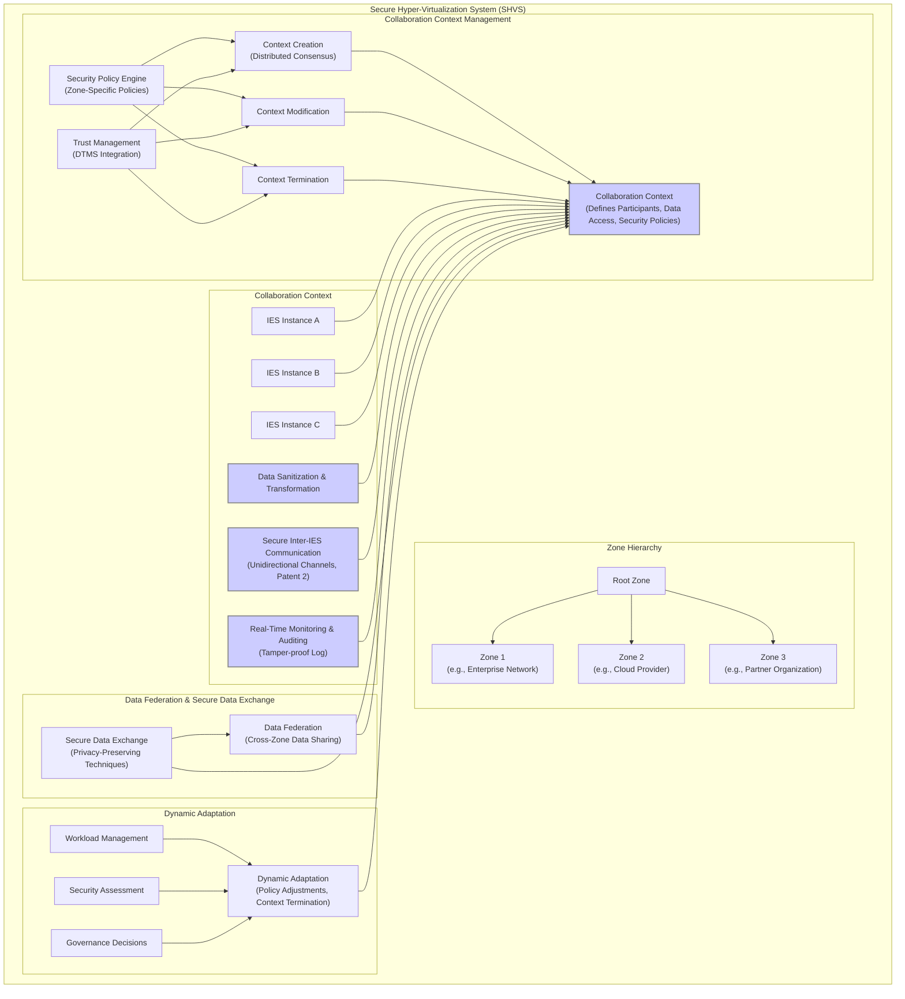
```mermaid
graph LR
    subgraph "Secure Hyper-Virtualization System (SHVS)"
        direction LR
        subgraph "Zone Hierarchy"
            Zone_Root["Root Zone"]
            Zone_1["Zone 1<br>(e.g., Enterprise Network)"]
            Zone_2["Zone 2<br>(e.g., Cloud Provider)"]
            Zone_3["Zone 3<br>(e.g., Partner Organization)"]
            Zone_Root --> Zone_1
            Zone_Root --> Zone_2
            Zone_Root --> Zone_3
        end

        subgraph "Collaboration Context Management"
            Context_Creation["Context Creation<br>(Distributed Consensus)"]
            Context_Modification["Context Modification"]
            Context_Termination["Context Termination"]
            Context_Creation --> Collaboration_Context
            Context_Modification --> Collaboration_Context
            Context_Termination --> Collaboration_Context
            Policy_Engine["Security Policy Engine<br>(Zone-Specific Policies)"] --> Context_Creation
            Policy_Engine --> Context_Modification
            Policy_Engine --> Context_Termination
            Trust_Mgmt["Trust Management<br>(DTMS Integration)"] --> Context_Creation
            Trust_Mgmt --> Context_Modification
            Trust_Mgmt --> Context_Termination
        end

        subgraph "Collaboration Context"
            Collaboration_Context["Collaboration Context<br>(Defines Participants, Data Access, Security Policies)"]
            IES_A["IES Instance A"] --> Collaboration_Context
            IES_B["IES Instance B"] --> Collaboration_Context
            IES_C["IES Instance C"] --> Collaboration_Context
            Data_Sanitization["Data Sanitization & Transformation"] --> Collaboration_Context
            Secure_Communication["Secure Inter-IES Communication<br>(Unidirectional Channels, Patent 2)"] --> Collaboration_Context
            Monitoring["Real-Time Monitoring & Auditing<br>(Tamper-proof Log)"] --> Collaboration_Context
        end

        subgraph "Data Federation & Secure Data Exchange"
            Data_Federation["Data Federation<br>(Cross-Zone Data Sharing)"]
            Secure_Data_Exchange["Secure Data Exchange<br>(Privacy-Preserving Techniques)"]
            Data_Federation --> Collaboration_Context
            Secure_Data_Exchange --> Collaboration_Context
            Secure_Data_Exchange --> Data_Federation
        end

        subgraph "Dynamic Adaptation"
            Dynamic_Adaptation["Dynamic Adaptation<br>(Policy Adjustments, Context Termination)"]
            Dynamic_Adaptation --> Collaboration_Context
            Workload_Mgmt["Workload Management"] --> Dynamic_Adaptation
            Security_Assessment["Security Assessment"] --> Dynamic_Adaptation
            Governance_Decisions["Governance Decisions"] --> Dynamic_Adaptation
        end
    end

    style Collaboration_Context fill:#ccf,stroke:#888,stroke-width:2px
    style Secure_Communication fill:#ccf,stroke:#888,stroke-width:2px
    style Data_Sanitization fill:#ccf,stroke:#888,stroke-width:2px
    style Monitoring fill:#ccf,stroke:#888,stroke-width:2px
```

**Description of Diagram:**

This detailed diagram illustrates the internal workings of the Secure Hyper-Virtualization System (SHVS) and its key components. It focuses on the management of collaboration contexts, data exchange, security policies, and dynamic adaptation.

*   **Zone Hierarchy:**  Represents the hierarchical structure of SecureSphere zones, showing how zones can be nested to accommodate various scales of collaboration.  This reflects the scalable nature of the SHVS.
*   **Collaboration Context Management:** This section details the lifecycle of collaboration contexts.
    *   **Context Creation (Distributed Consensus):**  Multiple trusted entities agree on the parameters of a new collaboration context.  This ensures secure establishment and prevents unauthorized contexts.
    *   **Context Modification & Termination:**  Mechanisms for modifying existing contexts or terminating them based on changing security conditions or needs.
    *   **Security Policy Engine (Zone-Specific Policies):**  Defines and enforces security policies specific to each zone.  Higher-level zones can inherit or override policies from lower levels.
    *   **Trust Management (DTMS Integration):**  Leverages the SecureSphere Dynamic Trust Management System (DTMS) to assess and manage trust relationships between participating IES instances.
*   **Collaboration Context:**  Represents an active collaboration session.
    *   **Defines Participants, Data Access, Security Policies:** Each context defines which IES instances can participate, what data they can access, and what operations are permitted.
    *   **Data Sanitization & Transformation:**  Mechanisms to protect sensitive information during data exchange.
    *   **Secure Inter-IES Communication (Unidirectional Channels, Patent 2):**  Leverages secure communication channels to prevent unauthorized data leakage.
    *   **Real-Time Monitoring & Auditing (Tamper-proof Log):**  Continuously monitors and audits collaboration activities to detect potential breaches.
*   **Data Federation & Secure Data Exchange:** This section describes how data is securely shared across zones.
    *   **Data Federation (Cross-Zone Data Sharing):**  Facilitates secure data sharing across zone boundaries.
    *   **Secure Data Exchange (Privacy-Preserving Techniques):**  Uses techniques like encryption, differential privacy, and secure multi-party computation to protect data during exchange.
*   **Dynamic Adaptation:**  This section highlights how the SHVS adapts to changing conditions.
    *   **Dynamic Adaptation (Policy Adjustments, Context Termination):**  The SHVS can adjust policies or terminate contexts in real-time.
    *   **Workload Management, Security Assessment, Governance Decisions:** These factors influence the dynamic adaptation of the SHVS.

**Patent References:**

*   **Patent 1:** The foundation of the SHVS relies on the Modular Isolated Execution Stacks (IES).
*   **Patent 2:** Secure Inter-IES Communication leverages hardware-enforced unidirectional channels.
*   **Patent 4 & 16:** DTMS is integrated for trust management and dynamic policy enforcement.
*   **Patent 17:** This patent specifically addresses the architecture and functionality of the SHVS, including the concepts of zones and collaboration contexts.
*   **Patent 20:** Secure Data Enclaves could be employed for secure data processing within the collaboration context, though this is not explicitly illustrated.
*   **Patent 22:** The SIZCF would likely be used for secure inter-zone communication, though this diagram focuses on the internal mechanisms of SHVS.

This detailed diagram provides a comprehensive visualization of the SHVS's architecture, highlighting its key components, functionalities, and how it enables secure and scalable collaboration across SecureSphere deployments. The emphasis on security and dynamic adaptation underscores the SHVS’s ability to accommodate evolving requirements and maintain a robust security posture.

**Claims:**

1.  A secure hyper-virtualization system (SHVS) for a computing system comprising a plurality of Modular Isolated Execution Stacks (IES) (Patent 1) organized into a hierarchy of Zones (Patent 18), each Zone associated with a Trust Root Configuration (TRC) stored on a decentralized, tamper-proof ledger (Patent 15), and a secure communication mechanism (Patent 2) between said IES instances, wherein said SHVS enables secure collaboration and controlled data sharing between authorized IES instances within and across Zones, comprising:

    a. a Collaboration Context Management module that establishes and manages collaboration contexts, wherein:

        i. each context defines a set of participating IES instances identified by unique, cryptographically verifiable identifiers (Patent 4), permitted actions authorized by dynamically configurable capabilities (Patent 2), data access policies governed by trust policies and resource borrowing rules defined in said TRCs, and inter-IES communication rules enforced by the Secure Communication Agent;

        ii. collaboration contexts are established based on mutual consent of participating IES instances or Zones, using a consent protocol and requiring agreement on shared collaboration policies, expressed using a declarative language; and

        iii. the parameters and policies of each collaboration context are dynamically adjusted in real-time based on feedback from the Real-Time Security Monitoring module, changes in trust levels of participating IES instances, resource availability, and policy updates from the DTMS (Patent 4);

    b. a Secure Communication Agent (SCA) (Patent 2, Patent 3) that dynamically discovers, selects, establishes, and manages multiple secure communication paths between said participating IES instances, wherein said SCA:

        i. utilizes dynamically configurable capabilities (Patent 2), a multi-channel network (Patent 3), and quantum-resistant communication (Patent 5) to enhance availability, fault tolerance, and security;

        ii. selects communication paths based on path availability, performance metrics (latency, bandwidth), trust levels of intermediate nodes and zones, and dynamically reconfigurable capabilities;

        iii. incorporates hardware-enforced unidirectional communication channels (Patent 2) to ensure strict data flow control for highly sensitive data; and

        iv. monitors the status, availability and performance of established communication paths, automatically detecting and removing failed or degraded paths, and dynamically rerouting traffic to maintain communication integrity and optimize performance during collaborative operations; and

    c. a Real-Time Security Monitoring module, integrated with a hierarchical security mesh (Patent 2) and an AI-powered anomaly detection system (Patent 7), that continuously monitors collaborative operations within each context for security violations, dynamically adjusts access control policies based on detected threats, trust levels, resource availability, and policy updates from said DTMS, and transmits authenticated security reports using a secure communication protocol (Patents 2, 3).

2.  The system of claim 1, wherein said SHVS integrates with a Secure Resource Borrowing Mechanism (Patent 9) and said DTMS (Patent 4) to enable secure and dynamic sharing of idle resources between said IES instances within a collaboration context, wherein:

        a. resource allocation is managed by said DTMS based on trust policies defined in said TRCs, dynamically configurable capabilities, real-time resource availability, and resource requests encoded within hop fields; and

        b. resource borrowing requests are prioritized using a queuing mechanism (Patent 3) that prioritizes requests from trusted IES instances or zones based on their trust levels, enhancing efficiency and preventing denial-of-service attacks targeting resource borrowing.

3.  The system of claim 1, wherein said SHVS incorporates Secure Data Enclaves (Patent 20) and Privacy-Preserving Data Exchange Protocols (Patent 22) to enable privacy-preserving collaborative data analytics within a collaboration context, utilizing at least one of: Differential Privacy, Homomorphic Encryption, or Secure Multi-Party Computation (MPC), wherein the selection and configuration of said protocols are dynamically adjusted based on the sensitivity of the data being exchanged, trust levels between collaborating IES instances, and policies defined in said TRCs.
4.  The system of claim 1, wherein:

        a. collaboration contexts are governed by Zone-specific policies defined in the relevant TRCs, allowing for differentiated collaboration rules and access control restrictions based on Zone membership;

        b. said Collaboration Context Management module enforces access control policies using dynamically issued and managed capabilities (Patent 2) that define permitted actions and accessible address ranges for each participating IES instance within a collaboration context, and automatically revokes or restricts capabilities in response to security violations or changes in trust levels;

        c. said IES instances can dynamically join or leave collaboration contexts based on authorization granted by said Collaboration Context Management module, subject to trust policies defined in the relevant TRCs and using a secure, authenticated handshake protocol; and

        d. a secure resource discovery mechanism, utilizing authenticated control messages (Patent 2) and a distributed resource directory, allows IES instances within a collaboration context to discover and interact with authorized resources and services offered by other participating IES instances.

        e. data sanitization and transformation mechanisms protect sensitive information during inter-IES collaborations within a context, including anonymization, aggregation, and format transformation before data is shared between instances.

        f. a tamper-proof audit log records relevant events and data exchanges, including timestamps, participating IES instance identifiers, and actions performed, for all collaborative operations within each context.

5.  The system of claim 1, wherein multiple Zones can be federated to create larger, interconnected collaboration domains, subject to trust relationships established between participating Zones, as defined by their TRCs and managed by the DTMS, and wherein inter-zone collaboration policies are negotiated and agreed upon using a distributed consensus mechanism (Patent 13), promoting secure and flexible collaboration across multiple zones.
6.  The system of claim 5, wherein the zone hierarchy abstracts the physical location and network configuration of SecureSphere deployments, enabling seamless collaboration between IES instances regardless of their physical separation.
7.  The system of claim 1, wherein said SHVS supports dynamic adaptation and optimization of collaboration contexts and communication paths, based on at least one of: real-time workload demands, security assessments from the security monitoring module, dynamic trust metric updates from the DTMS, or changes in zone-specific policies, enhancing the efficiency, adaptability, and security of cross-IES collaborations.

## Patent 19: Privacy-Preserving Federated Learning System using Secure Multi-Party Computation across Isolated Execution Stacks

**Abstract:**

This invention presents a Privacy-Preserving Federated Learning System for SecureSphere that enables collaborative machine learning across physically isolated Modular Isolated Execution Stacks (IES) while upholding data privacy and security. The system utilizes Secure Multi-Party Computation (MPC) to aggregate model updates from participating IES instances without directly exchanging raw data, ensuring that sensitive information remains protected within its respective isolated environment.

The Federated Learning System incorporates a dynamic orchestrator that adapts model selection, aggregation strategies, and privacy-preserving techniques based on the characteristics of the data and the desired security level.  By leveraging SecureSphere's hardware-enforced isolation, unidirectional communication, and hierarchical zone management, this invention provides a robust and scalable framework for secure and collaborative machine learning in privacy-sensitive domains.

**Diagram:**

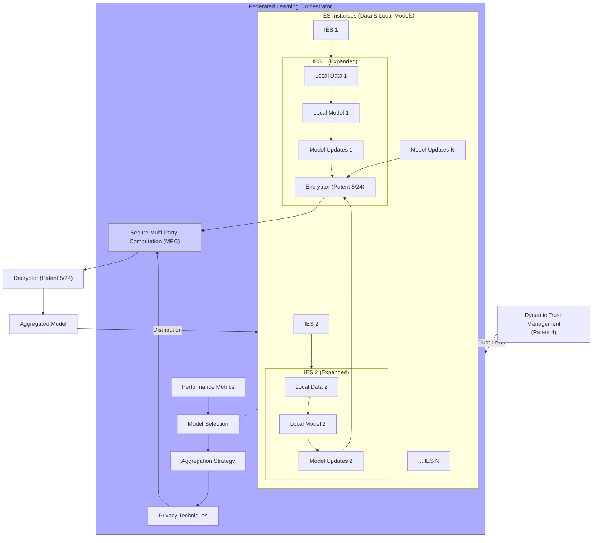
```mermaid
graph TD
    subgraph IES_Instances["IES Instances (Data & Local Models)"]
        IES_1["IES 1"]
        IES_2["IES 2"]
        IES_N["... IES N"]

        subgraph IES_1_Details["IES 1 (Expanded)"]
            Data_1["Local Data 1"] --> Model_1["Local Model 1"]
            Model_1 --> Updates_1["Model Updates 1"]
            Updates_1 --> Encryptor["Encryptor (Patent 5/24)"]
        end

        IES_1 --> IES_1_Details

        subgraph IES_2_Details["IES 2 (Expanded)"]
            Data_2["Local Data 2"] --> Model_2["Local Model 2"]
            Model_2 --> Updates_2["Model Updates 2"]
            Updates_2 --> Encryptor
        end

        IES_2 --> IES_2_Details

        Updates_N["Model Updates N"] --> Encryptor

    end

    Encryptor --> MPC["Secure Multi-Party Computation (MPC)"]
    MPC --> Decryptor["Decryptor (Patent 5/24)"]
    Decryptor --> Aggregated_Model["Aggregated Model"]

    Aggregated_Model -- Distribution --> IES_Instances


    subgraph Federated_Learning_Orchestrator["Federated Learning Orchestrator"]
        Model_Selection["Model Selection"]
        Aggregation_Strategy["Aggregation Strategy"]
        Privacy_Techniques["Privacy Techniques"]
        Model_Selection --> Aggregation_Strategy
        Aggregation_Strategy --> Privacy_Techniques
        Privacy_Techniques --> MPC
        IES_Instances -.- Model_Selection
        Metrics_FL["Performance Metrics"] --> Model_Selection

    end
    DTMS["Dynamic Trust Management<br>(Patent 4)"] -->|"Trust Level"| Federated_Learning_Orchestrator
    style MPC fill:#ccf,stroke:#888,stroke-width:2px
    style Federated_Learning_Orchestrator fill:#aaf,stroke:#444
```

**Description of Diagram:**

This diagram illustrates the Privacy-Preserving Federated Learning System using Secure Multi-Party Computation (MPC) across Isolated Execution Stacks (IES).

1.  **IES Instances (Data & Local Models):** This subgraph represents the distributed nature of the system, with each IES instance holding its own local data and model.  Two IES instances are expanded to show internal details.  Data flow within each IES instance is shown, including data encryption before transmission to the MPC engine.
2.  **Secure Multi-Party Computation (MPC):** This component performs the secure aggregation of model updates from the IES instances, preserving privacy.  Encrypted updates are sent to this component.
3.  **Aggregated Model:** This represents the combined model generated by the MPC process.  This model is then distributed back to the IES instances.
4.  **Federated Learning Orchestrator:** This subgraph manages the federated learning process.
    *   **Model Selection:** Chooses the appropriate machine learning model based on data characteristics and performance metrics.  It receives input from the DTMS regarding the trust level of each IES instance.
    *   **Aggregation Strategy:** Determines the best strategy for aggregating model updates.
    *   **Privacy Techniques:** Selects the appropriate privacy-preserving techniques (e.g., differential privacy).

**Key Features and Interactions:**

*   **Data Privacy:**  The diagram emphasizes that raw data never leaves the IES instances. Only encrypted model updates are shared, preserving privacy.
*   **Secure Aggregation:** MPC ensures secure and private aggregation of model updates.
*   **Dynamic Orchestration:** The Federated Learning Orchestrator adapts the learning process to different data and security requirements.
*   **SecureSphere Integration:** The diagram shows the integration with Patent 1 (IES), Patent 3 (Secure Channels), Patent 4 (DTMS), and Patents 5/24 (Encryption/Decryption) to highlight how this patent leverages SecureSphere's security features.

This diagram clearly visualizes the key innovations of Patent 19 and how it enables privacy-preserving federated learning within the SecureSphere architecture. It clarifies the interactions between components and emphasizes the system's dynamic and secure nature.

**Claims:**

1.  **Federated Learning Across Isolated Execution Stacks:**
    *   A secure computing system comprising a plurality of Modular Isolated Execution Stacks (IES), each housing a local machine learning model and training data.
    *   A Federated Learning System that enables collaborative model training across the physically isolated IES instances without directly exchanging raw data, utilizing Secure Multi-Party Computation (MPC) for privacy-preserving aggregation of model updates.
2.  **Secure Multi-Party Computation for Model Aggregation:**
    *   The system of claim 1, wherein the Federated Learning System employs Secure Multi-Party Computation (MPC) to aggregate model updates from the participating IES instances.
    *   The MPC protocol ensures that no single IES instance or external entity can access the raw model updates or training data from other instances, preserving data privacy and confidentiality during the aggregation process.
3.  **Hardware-Enforced Isolation for Secure Computation:**
    *   The system of claim 1, wherein the MPC computations are performed within the secure and isolated environments of the IES instances (Patent 1), leveraging hardware-enforced isolation to prevent unauthorized access or manipulation of the computation process.
    *   The use of hardware-based security mechanisms, such as data diodes (Patent 2) for unidirectional communication, further enhances the security of the MPC protocol.
4.  **Dynamic Model Selection and Aggregation Strategies:**
    *   The system of claim 1, further comprising a Federated Learning Orchestrator that dynamically selects the participating IES instances and determines the appropriate MPC protocol and aggregation strategy based on factors like:
        *   The availability and computational capabilities of IES instances.
        *   The sensitivity and distribution of the training data.
        *   The desired level of privacy and security.
5.  **Adaptive Privacy-Preserving Techniques:**
    *   The system of claim 1, wherein the Federated Learning System incorporates adaptive privacy-preserving techniques, such as differential privacy or homomorphic encryption, in conjunction with MPC to further enhance data protection.
    *   These techniques add an additional layer of security by adding noise to model updates or enabling computations on encrypted data without decryption.
6.  **Zone-Aware Federated Learning for Scalable Collaboration:**
    *   The system of claim 1, wherein the Federated Learning System leverages the Secure Hyper-Virtualization System (SHVS) (Patent 17) with its hierarchical zone management to enable scalable and secure collaboration across multiple SecureSphere deployments.
    *   This allows IES instances in different zones, potentially spanning geographical regions or organizations, to participate in federated learning while adhering to zone-specific security policies and data handling rules.
7.  **AI-Driven Model Optimization and Personalization:**
    *   The system of claim 1, wherein the Federated Learning System employs AI algorithms to analyze the performance of the aggregated model and dynamically adjust training parameters, model architecture, or data selection to optimize model accuracy and personalization.
8.  **Blockchain-Based Model Provenance and Integrity Tracking:**
    *   The system of claim 1, wherein a blockchain-based ledger records the provenance and integrity of the federated learning process.
    *   This ledger tracks the contributions of each IES instance, the aggregation steps performed using MPC, and the final model parameters, providing a tamper-proof and transparent record of the collaborative learning process.

## Patent 20: Secure Data Enclave System with Privacy-Preserving Collaborative Data Analytics

**Abstract:**

This invention presents a Secure Data Enclave System for SecureSphere, enabling secure and privacy-preserving collaborative data analytics across physically isolated Modular Isolated Execution Stacks (IES).  By leveraging the inherent security features of SecureSphere's hardware-enforced isolation, unidirectional communication, and dynamic trust management, the system allows multiple IES instances, each hosting a secure data enclave, to engage in joint data analysis tasks without compromising data confidentiality or integrity.

The system incorporates a suite of privacy-preserving data sharing mechanisms, including differential privacy, homomorphic encryption, and Secure Multi-Party Computation (MPC), to protect sensitive information during data ingestion, analysis, and inter-enclave communication.  The Secure Data Enclave System provides a robust and scalable solution for collaborative data analytics in privacy-sensitive domains, such as healthcare, finance, and government, facilitating data sharing and insights generation while upholding stringent security and privacy standards.

**Diagram:**

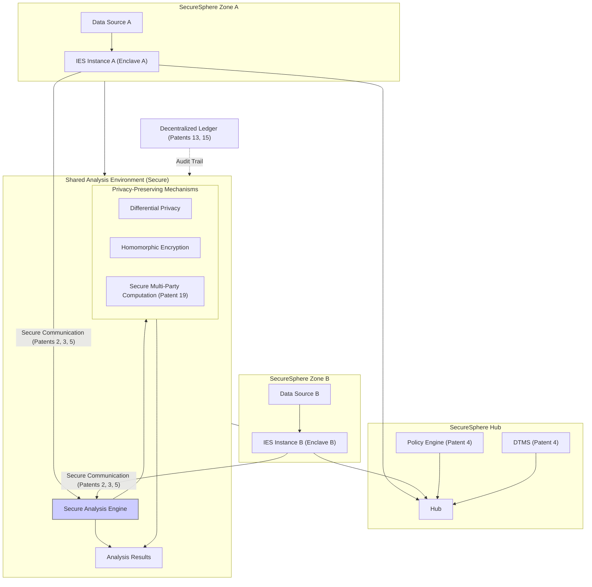
```mermaid
graph TD
    subgraph Zone_A["SecureSphere Zone A"]
        IES_A["IES Instance A (Enclave A)"]
        Data_A["Data Source A"] --> IES_A
    end

    subgraph Zone_B["SecureSphere Zone B"]
        IES_B["IES Instance B (Enclave B)"]
        Data_B["Data Source B"] --> IES_B
    end

    subgraph "SecureSphere Hub"
        Hub["Hub"]
        IES_A --> Hub
        IES_B --> Hub
        Policy["Policy Engine (Patent 4)"] --> Hub
        DTMS_Hub["DTMS (Patent 4)"] --> Hub
    end

    subgraph Shared_Analysis_Env["Shared Analysis Environment (Secure)"]
        IES_A -- Secure Communication (Patents 2, 3, 5) --> SAE["Secure Analysis Engine"]
        IES_B -- Secure Communication (Patents 2, 3, 5) --> SAE
        SAE --> Results["Analysis Results"]
        
        subgraph Privacy_Preserving_Mechanisms["Privacy-Preserving Mechanisms"]
            DP["Differential Privacy"]
            HE["Homomorphic Encryption"]
            MPC_SDE["Secure Multi-Party Computation (Patent 19)"]
        end
        SAE --> Privacy_Preserving_Mechanisms
        Privacy_Preserving_Mechanisms --> Results

    end


    Zone_A ----> Shared_Analysis_Env <---- Zone_B
    Ledger["Decentralized Ledger (Patents 13, 15)"] -.->|"Audit Trail"| Shared_Analysis_Env
    style SAE fill:#ccf,stroke:#888,stroke-width:2px
```

**Description of Diagram:**

This diagram illustrates the components and functionalities of the Secure Data Enclave System as described in Patent 20, emphasizing its multi-faceted approach to auditing.

1.  **SecureSphere Zones:** Two zones, A and B, are shown, each with an IES instance hosting a Secure Data Enclave. Each enclave receives data from its respective data source. This setup visualizes the collaborative aspect across different data sources and zones.  The IES instances communicate securely with the Hub, influenced by policy decisions from the policy engine and the state of DTMS.
2.  **Shared Analysis Environment:** This central subgraph depicts the secure environment where collaborative analysis occurs.
    *   **Secure Analysis Engine (SAE):** This core component performs the data analysis, receiving input from the enclaves via secure communication channels.
    *   **Privacy-Preserving Mechanisms:**  This subgraph highlights the privacy-preserving techniques employed:
        *   **Differential Privacy:** Adds noise to protect individual data points.
        *   **Homomorphic Encryption:** Allows computations on encrypted data.
        *   **Secure Multi-Party Computation (Patent 19):** Enables collaborative analysis without revealing raw data.
    *   **Analysis Results:**  The output of the analysis, after applying privacy-preserving mechanisms.
    *   **Decentralized Ledger (Patents 13 & 15):**  Provides an audit trail of data access and analysis activities, ensuring transparency and accountability.
3.  **Secure Communication:**  The connections between IES instances and the SAE utilize SecureSphere's secure communication channels (Patents 2, 3, and 5), including data diodes and quantum-resistant encryption.

**Key Features and Interactions:**

*   **Data Enclave Isolation:**  The diagram emphasizes that data remains within the secure enclaves hosted within IES instances, preserving confidentiality.
*   **Privacy-Preserving Collaboration:** The diagram highlights the privacy-preserving mechanisms used to protect data during collaborative analysis.
*   **Secure Communication:** The secure communication channels prevent unauthorized data access and interception.
*   **Auditing and Transparency:** The Decentralized Ledger provides a tamper-proof record of all data access and analysis activities.
*   **SecureSphere Integration:** The diagram shows the integration with Patents 1, 2, 3, 5, 13, 15, and 19, emphasizing the cohesive security approach of SecureSphere.

**Claims:**

1.  **Secure Data Enclave System for SecureSphere:**
    *   A secure computing system comprising a plurality of Modular Isolated Execution Stacks (IES) (Patent 1), each capable of hosting a secure data enclave.
    *   A Secure Data Enclave System that enables multiple IES instances to collaboratively analyze data within a secure, isolated environment, ensuring data confidentiality, integrity, and access control.
2.  **Hardware-Enforced Isolation for Data Enclaves:**
    *   The system of claim 1, wherein each data enclave resides within a dedicated IES instance, leveraging the hardware-enforced isolation (Patent 1) of the IES architecture to protect the enclave from unauthorized access or interference.
    *   The data enclave utilizes dedicated processing, memory, and storage resources within the IES, ensuring that data remains confined to a trusted and physically isolated environment.
3.  **Secure Data Ingestion and Access Control:**
    *   The system of claim 1, wherein each data enclave has a secure data ingestion mechanism that validates and authorizes data sources before importing data into the enclave.
    *   Access control policies, enforced at the hardware level, restrict access to the enclave and its data to authorized users and applications.
4.  **Privacy-Preserving Data Sharing and Transformation:**
    *   The system of claim 1, wherein the Secure Data Enclave System incorporates privacy-preserving data sharing mechanisms, such as:
        *   **Differential Privacy:** Adding noise to query results while preserving statistical accuracy, protecting individual data points.
        *   **Homomorphic Encryption:** Enabling computations on encrypted data without decryption, preserving data confidentiality during analysis.
        *   **Secure Multi-Party Computation (MPC):**  Allowing multiple parties to jointly compute on data without revealing their individual inputs, enabling collaborative analysis on sensitive data.
5.  **Collaborative Data Analytics within Secure Enclaves:**
    *   The system of claim 1, wherein multiple IES instances, each hosting a secure data enclave, can participate in collaborative data analytics tasks.
    *   The Secure Data Enclave System facilitates secure communication and data exchange between enclaves using hardware-enforced unidirectional channels (Patent 2) and the dynamic trust management system (Patent 16), ensuring that only authorized and trusted enclaves can collaborate.
6.  **Dynamic Enclave Configuration and Policy Management:**
    *   The system of claim 1, wherein data enclave configurations, security policies, and access control rules can be dynamically managed and updated by authorized administrators.
    *   The Secure Data Enclave System allows for fine-grained control over data access, computation permissions, and data retention policies within each enclave.
7.  **AI-Driven Data Analysis and Insights Generation:**
    *   The system of claim 1, wherein the secure data enclaves leverage AI algorithms to perform complex data analysis tasks, generating insights, predictions, or recommendations based on the aggregated data from multiple sources.
    *   The AI-powered analysis is performed within the secure and isolated environment of the enclave, ensuring data confidentiality and integrity throughout the process.
8.  **Zone-Aware Data Enclave Federation:**
    *   The system of claim 1, wherein data enclaves can be federated across different SecureSphere zones (Patent 17), enabling collaborative data analysis between organizations or geographically distributed locations.
    *   The Secure Data Enclave System ensures that inter-zone data sharing complies with zone-specific security policies and regulatory requirements, maintaining a consistent security posture across different deployments.
9.  **Blockchain-Based Data Provenance and Auditability:**
    *   The system of claim 1, wherein a blockchain-based ledger records the provenance and usage history of data within each enclave, providing a transparent and tamper-proof audit trail.
    *   This blockchain integration enables tracking of data origin, access logs, analysis operations, and data sharing events, enhancing accountability and facilitating data governance.
10. **Secure Data Enclave as a Service (SDEaaS):**
    *   The system of claim 1, wherein the Secure Data Enclave System can be offered as a service (SDEaaS), allowing organizations to securely store, share, and analyze sensitive data in a collaborative environment without managing the underlying infrastructure.
    *   The SDEaaS model provides a scalable and cost-effective solution for secure and privacy-preserving data collaboration.

## Patent 21: Blockchain-Enabled Self-Evolving Software System with 3D-Printed Microstructure Provenance Tracking and AI-Driven Security

**Abstract:**

This invention presents a Blockchain-Enabled Self-Evolving Software System for SecureSphere that ensures the secure and verifiable evolution of software within a physically isolated, multi-kernel computing environment.  The system combines an AI-driven Automated Evolutionary Software Development System (AESDS) with a 3D-printed microstructure audit trail and a blockchain-based provenance ledger. Each software update generated by the AESDS is linked to a unique, tamper-evident microstructure, providing a physical representation of the software's integrity and a permanent record of its development history.

The blockchain ledger anchors the microstructure identifiers and validation records, enabling transparent and auditable tracking of software provenance. AI-driven security mechanisms continuously monitor system behavior and automatically generate security updates, each linked to a corresponding microstructure for verification.  This multi-dimensional approach ensures secure, adaptable, and trustworthy software development within the SecureSphere ecosystem, setting a new standard for transparency, accountability, and security in critical systems.

**Diagram:**

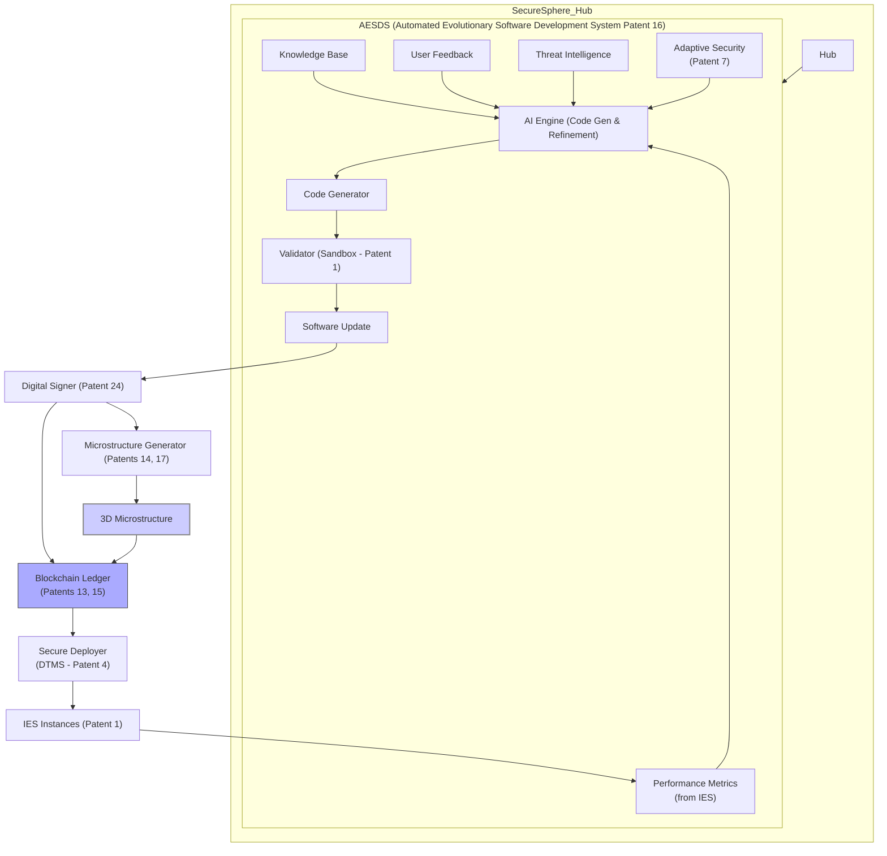
```mermaid
graph TD
    subgraph AESDS["AESDS (Automated Evolutionary Software Development System Patent 16)"]
        AI_Engine["AI Engine (Code Gen & Refinement)"] --> Code_Generator["Code Generator"]
        KB["Knowledge Base"] --> AI_Engine
        Metrics["Performance Metrics<br>(from IES)"] --> AI_Engine
        User_Feedback["User Feedback"] --> AI_Engine
        Threat_Intel["Threat Intelligence"] --> AI_Engine
        Code_Generator --> Validator["Validator (Sandbox - Patent 1)"]
        Validator --> Software_Update["Software Update"]
        Adaptive_Security["Adaptive Security<br>(Patent 7)"] --> AI_Engine
    end

    Software_Update --> Signer["Digital Signer (Patent 24)"]
    Signer --> Microstructure_Gen["Microstructure Generator (Patents 14, 17)"]
    Microstructure_Gen --> Microstructure["3D Microstructure"]

    Signer --> Blockchain["Blockchain Ledger<br>(Patents 13, 15)"]
    Microstructure --> Blockchain

    Blockchain --> Deployer["Secure Deployer<br>(DTMS - Patent 4)"]
    Deployer --> IES_Instances["IES Instances (Patent 1)"]

    IES_Instances --> Metrics

    subgraph SecureSphere_Hub
        Hub["Hub"] --> AESDS
    end

    style Microstructure fill:#ccf,stroke:#888,stroke-width:2px
    style Blockchain fill:#aaf,stroke:#444
```

**Description of Diagram:**

This diagram for Patent 21 (Blockchain-Enabled Self-Evolving Software System) clarifies the data flow, integrates relevant SecureSphere components, and emphasizes the security aspects of software evolution.

1.  **AESDS (Patent 16):** This subgraph represents the core of the automated software development process.
    *   Inputs:  Knowledge Base, Performance Metrics (from running IES instances), User Feedback, and Threat Intelligence.  The explicit link to performance metrics emphasizes data-driven evolution.
    *   AI Engine:  Generates and refines software updates based on these inputs.
    *   Code Generator: Creates the software update artifacts.
    *   Validator (Patent 1): Uses sandboxed IES instances for validation.
    *   Software Update: The generated update, ready for further processing.
    *   Adaptive Security (Patent 7): Integrates anomaly detection and self-healing feedback into the software evolution process.  This closed-loop system is a key strength.
2.  **SecureSphere Hub:**  Now explicitly included. The Hub provides triggers for software updates (e.g., based on scheduled updates, vulnerability reports, or governance decisions) and/or policy guidelines for the AESDS.  This highlights the managed aspect of the automated system.
3.  **Linking to Blockchain and Microstructures:**
    *   Digital Signer (Patent 24):  Cryptographically signs the software update using techniques from Patent 24 (HESE-DAR), ensuring its integrity.
    *   Microstructure Generator (Patents 14, 17): Creates a physical microstructure, embedding the update's signature, providing tamper evidence.
    *   Blockchain Ledger (Patents 13, 15): The digital signature and microstructure identifier are recorded on the blockchain, creating a permanent and auditable record.
4.  **Secure Deployment:**
    *   Secure Deployer (DTMS - Patent 4):  Deploys the software update to IES instances, leveraging the DTMS (Patent 4) to ensure only authorized and trusted updates are installed.  This adds a layer of security to the deployment process.
5.  **Feedback Loop:**  Performance Metrics from updated IES instances are fed back into the AESDS for continuous improvement.

**Claims:**

1.  **Blockchain-Enabled Self-Evolving Software System:**
    *   A secure computing system comprising a plurality of Modular Isolated Execution Stacks (IES) (Patent 1), an AI-driven Automated Evolutionary Software Development System (AESDS) (Patent 15), a 3D-printed microstructure fabrication system (Patent 13), and a blockchain-based ledger.
    *   This system enables autonomous software generation, refinement, and secure deployment within the IES environment, with each software update linked to a unique, physically verifiable microstructure recorded on the blockchain.
2.  **Microstructure-Based Software Provenance Tracking:**
    *   The system of claim 1, wherein each software update generated by the AESDS is assigned a unique digital signature, which is then encoded within the physical geometry of a corresponding 3D-printed microstructure.
    *   This microstructure serves as a physical, tamper-evident representation of the software update, providing a tangible link between the digital code and its physical manifestation.
3.  **Blockchain-Anchored Microstructure Records:**
    *   The system of claim 2, wherein the unique identifier of each software-linked microstructure is recorded on a blockchain-based ledger, creating a tamper-proof and transparent chain of custody for all software updates.
    *   The blockchain ledger provides a permanent, auditable history of software development actions, including the creation, modification, validation, and deployment of each software artifact.
4.  **AI-Driven Security with Microstructure Correlation:**
    *   The system of claim 1, further comprising an AI-driven security module that continuously monitors system behavior and threat intelligence data, generating security patches and enhancements as needed.
    *   Each security update is linked to a unique microstructure, allowing for physical verification of the patch's origin and integrity, and correlation with the blockchain record for a comprehensive audit trail.
5.  **Multi-Layered Validation with Sandboxed Environments:**
    *   The system of claim 1, wherein the AESDS employs a multi-layered validation process, utilizing isolated sandboxed environments within IES instances to rigorously test software updates for compatibility, security, and performance before deployment.
    *   The results of these validations are recorded on the blockchain ledger, providing a transparent record of the software verification process.
6.  **Decentralized Governance with Microstructure Verification:**
    *   The system of claim 1, wherein a decentralized governance framework, utilizing the blockchain ledger, governs the approval and deployment of software updates.
    *   Authorized entities can validate the integrity of software updates by verifying the corresponding microstructures and comparing their encoded information to the blockchain records, ensuring accountability and preventing unauthorized modifications.
7.  **User Feedback Integration for Adaptive Software Evolution:**
    *   The system of claim 1, wherein the AESDS incorporates user feedback mechanisms, securely collecting and analyzing user data on software performance, usability, and security issues.
    *   This feedback is used to refine the AI-driven software development process, enabling the system to adapt to evolving user needs and preferences while maintaining security.
8.  **Dynamic Software Rollback with Microstructure Verification:**
    *   The system of claim 1, wherein the SecureSphere environment supports secure rollback to previous software versions in case of unforeseen issues or security vulnerabilities.
    *   The rollback process verifies the integrity of the previous software version using its corresponding microstructure and the blockchain record, ensuring that the system reverts to a secure and validated state.
9.  **Secure Remote Software Deployment and Verification:**
    *   The system of claim 1, wherein software updates can be deployed remotely to SecureSphere systems in geographically distributed locations.
    *   The recipient system verifies the integrity of the received software update using its associated microstructure and the blockchain record, ensuring secure and tamper-proof deployment across multiple locations.
10. **Open-Source Microstructure Verification Tools:**
    *   The system of claim 1, wherein the specifications and tools for verifying the microstructures are made publicly available, allowing independent researchers and auditors to validate the integrity of the audit trail and contribute to the transparency of the system.

## Patent 22: Secure Inter-Zone Collaboration Framework with Privacy-Preserving Data Exchange and Distributed Ledger Synchronization

**Abstract:**

This invention introduces a Secure Inter-Zone Collaboration Framework (SIZCF) that enables secure and controlled data sharing and collaborative operations between SecureSphere deployments operating across a hierarchy of zones. The SIZCF leverages SecureSphere's foundational security principles, including hardware-enforced isolation, unidirectional communication, and dynamic trust management, to extend these safeguards to inter-zone interactions.

The framework incorporates privacy-preserving data exchange protocols, such as differential privacy, homomorphic encryption, and Secure Multi-Party Computation (MPC), to protect sensitive information during collaborative data analysis and cross-zone data sharing. A distributed ledger synchronization mechanism ensures data consistency and integrity across the ledgers of collaborating zones. The SIZCF empowers SecureSphere deployments to securely collaborate and share data at scale, facilitating secure and trustworthy interactions between organizations, government agencies, or geographically distributed systems, while upholding stringent security and privacy standards.

**Diagram:**

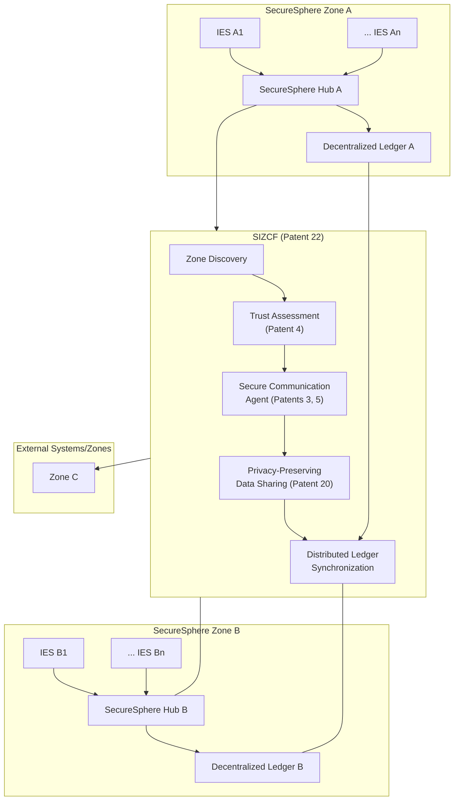
```mermaid
graph TD
    subgraph Zone_A["SecureSphere Zone A"]
        IES_A1["IES A1"]
        IES_A2["... IES An"]
        Hub_A["SecureSphere Hub A"]
        Ledger_A["Decentralized Ledger A"]

        IES_A1 --> Hub_A
        IES_A2 --> Hub_A
        Hub_A --> Ledger_A
    end

    subgraph Zone_B["SecureSphere Zone B"]
        IES_B1["IES B1"]
        IES_B2["... IES Bn"]
        Hub_B["SecureSphere Hub B"]
        Ledger_B["Decentralized Ledger B"]

        IES_B1 --> Hub_B
        IES_B2 --> Hub_B
        Hub_B --> Ledger_B
    end

    subgraph SIZCF["SIZCF (Patent 22)"]
        direction LR
        ZD["Zone Discovery"]
        TA["Trust Assessment<br>(Patent 4)"]
        SCA["Secure Communication<br>Agent (Patents 3, 5)"]
        PDS["Privacy-Preserving<br>Data Sharing (Patent 20)"]
        Ledger_Sync["Distributed Ledger<br>Synchronization"]

        ZD --> TA
        TA --> SCA
        SCA --> PDS
        PDS --> Ledger_Sync

    end

    Hub_A ----> SIZCF <---- Hub_B
    Ledger_A ----> Ledger_Sync <---- Ledger_B


    subgraph External_Systems["External Systems/Zones"]
        Zone_C["Zone C"]
    end
    SIZCF ----> Zone_C
```

**Description for Diagram:**

This diagram illustrates the Secure Inter-Zone Collaboration Framework (SIZCF) and its role in enabling secure communication and data sharing between different SecureSphere Zones.

1.  **SecureSphere Zone A & Zone B:**  These subgraphs represent two independent SecureSphere zones, each with its own IES instances, SecureSphere Hub, and Decentralized Ledger. This emphasizes the decentralized nature of SecureSphere.
2.  **SIZCF (Patent 22):** This subgraph represents the core components of the SIZCF.  The components are arranged left-to-right to visualize the typical flow of a collaboration request.
    *   **Zone Discovery:** This component allows SecureSphere zones to discover each other and their available resources or services.
    *   **Trust Assessment (Patent 4):** Leverages the DTMS to assess the trust level of the requesting zone and the target zone. This ensures that collaboration occurs only between trusted entities.
    *   **Secure Communication Agent (Patents 3, 5):** Establishes secure communication channels between the zones, utilizing the Multi-Channel Network and Quantum-Resistant Communication for secure data transfer.
    *   **Privacy-Preserving Data Sharing (Patent 20):** Implements privacy-preserving techniques (e.g., differential privacy, homomorphic encryption, secure multi-party computation) to protect data during inter-zone exchange.  This component leverages the Secure Data Enclave System.
    *   **Distributed Ledger Synchronization:**  Synchronizes relevant data and events between the decentralized ledgers of the collaborating zones, maintaining consistency and enabling a shared audit trail.
3.  **Connections and Data Flow:**
    *   **Hubs to SIZCF:** The SecureSphere Hubs in each zone connect to the SIZCF to initiate and manage collaboration requests.
    *   **Ledgers to Ledger Sync:** The Decentralized Ledgers in each zone connect to the SIZCF's Ledger Synchronization component to ensure data consistency and a shared audit trail.
    *   **SIZCF to External Systems/Zones:**  A dotted line indicates the SIZCF's ability to connect to external systems or other SecureSphere zones, expanding collaboration possibilities.

**Key Features Illustrated:**

*   **Decentralized Collaboration:** The diagram emphasizes the decentralized nature of SecureSphere and how zones collaborate through the SIZCF.
*   **Trust and Security:** The inclusion of Trust Assessment and Secure Communication Agent highlights the security measures in place for inter-zone collaboration.
*   **Privacy Preservation:** The Privacy-Preserving Data Sharing component demonstrates SecureSphere's commitment to data privacy.
*   **Auditability:** The Distributed Ledger Synchronization component ensures a tamper-proof audit trail of all inter-zone activities.
*   **Extensibility:** The connection to external systems shows the SIZCF's potential to facilitate collaboration with a wide range of entities.

**Claims:**

1.  A secure inter-zone collaboration framework (SIZCF) for a computing system comprising a plurality of SecureSphere deployments (Patent 17), each deployment having a set of Modular Isolated Execution Stacks (IES) (Patent 1) and operating across a hierarchy of Zones (Patent 18), each Zone associated with a Trust Root Configuration (TRC) stored on a decentralized, tamper-proof ledger (Patent 15), wherein said SIZCF enables secure communication, data sharing, and collaborative operations between authorized IES instances located in different Zones, comprising:

    a) a Zone Discovery mechanism for: i) identifying participating Zones; and ii) authenticating participating Zones based on their TRCs;

    b) a Trust Assessment mechanism (Patent 4) for establishing trust relationships between Zones based on at least one of: i) their respective TRCs; ii) real-time security assessments; or iii) historical behavior;

    c) a Secure Communication Agent (Patents 2, 3) for: i) establishing and managing multiple secure communication paths between Zones; ii) utilizing a multi-channel network (Patent 3) and quantum-resistant communication (Patent 5); and iii) dynamically selecting communication paths based on path availability, performance metrics, and trust levels;

    d) Privacy-Preserving Data Exchange Protocols (Patent 20) for protecting sensitive information during inter-zone collaborations, including at least one of: i) Differential Privacy; ii) Homomorphic Encryption; or iii) Secure Multi-Party Computation (MPC); and

    e) a Distributed Ledger Synchronization mechanism for: i) ensuring data consistency and integrity across the decentralized ledgers of collaborating Zones; and ii) utilizing a distributed consensus protocol (Patent 13) for secure and consistent ledger updates.

2.  The system of claim 1, wherein said Zone Discovery mechanism utilizes a decentralized directory service for discovering and registering participating Zones, wherein each Zone's registration information includes its TRC and other relevant metadata.
3.  The system of claim 1, wherein said Trust Assessment mechanism integrates with the DTMS (Patent 4) to dynamically adjust trust levels between Zones based on real-time security assessments, historical behavior, and adherence to trust policies defined in the relevant TRCs.
4.  The system of claim 1, wherein said Secure Communication Agent:

    a) utilizes dynamically configurable capabilities (Patent 2) to control access to resources and services across Zones; and b) encrypts inter-zone communication using quantum-resistant encryption (Patent 5) and hardware-enforced unidirectional communication channels (Patent 2) where appropriate.

5.  The system of claim 1, wherein said Privacy-Preserving Data Exchange Protocols are dynamically selected and configured based on the sensitivity of the data being exchanged and the trust levels between collaborating Zones.
6.  The system of claim 1, wherein said Distributed Ledger Synchronization mechanism:

    a) selectively synchronizes only relevant data and events between collaborating Zones, minimizing communication overhead and storage requirements; and b) provides a tamper-proof audit trail of all inter-zone data exchanges and collaborative operations.

# Patent Group VII. Miscellaneous

## Patent 23: Adaptive Context-Aware MFA with Biometric and Behavioral Analysis

**Abstract:**

This invention enhances SecureSphere's Multi-Factor Authentication (MFA) capabilities by introducing an adaptive, context-aware system that integrates biometric and behavioral analysis with out-of-band token verification.  Leveraging the existing IES and multi-channel architecture (Patents 1, 2, 3, and 8), this system dynamically adjusts authentication requirements based on real-time risk assessments derived from user behavior, environmental factors, and threat intelligence. Biometric authentication methods, integrated with the Secure UI Kernel (Patent 11), provide an additional layer of security. The system utilizes Secure Multi-Party Computation (MPC) for privacy-preserving analysis of biometric data, ensuring user privacy while enhancing authentication accuracy.  A decentralized ledger records all authentication events, providing a transparent and auditable trail. This adaptive approach strengthens SecureSphere's security posture by tailoring authentication rigor to the specific context of each access request.

**Diagram 1:**
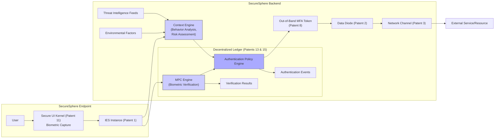
```mermaid
graph LR
    subgraph "SecureSphere Endpoint"
        direction LR
        User --> Secure_UI_Kernel["Secure UI Kernel (Patent 11)<br>Biometric Capture"]
        Secure_UI_Kernel --> IES["IES Instance (Patent 1)"]
    end

    subgraph "SecureSphere Backend"
        direction LR
        IES --> Context_Engine["Context Engine<br>(Behavior Analysis,<br>Risk Assessment)"]
        Threat_Intel["Threat Intelligence Feeds"] --> Context_Engine
        Env_Factors["Environmental Factors"] --> Context_Engine
        Context_Engine --> Auth_Policy["Authentication Policy Engine"]

        Auth_Policy --> MFA_Token["Out-of-Band MFA Token<br>(Patent 8)"]
        MFA_Token --> Data_Diode["Data Diode (Patent 2)"]
        Data_Diode --> Network_Channel["Network Channel (Patent 3)"]

        IES --> MPC_Engine["MPC Engine<br>(Biometric Verification)"]
        MPC_Engine --> Auth_Policy

        subgraph "Decentralized Ledger (Patents 13 & 15)"
            Auth_Policy --> Ledger_Auth_Events["Authentication Events"]
            MPC_Engine --> Ledger_Ver_Results["Verification Results"]
        end
    end

    Network_Channel --> External_Service["External Service/Resource"]

    style Context_Engine fill:#ccf,stroke:#888,stroke-width:2px
    style Auth_Policy fill:#aaf,stroke:#666,stroke-width:1px
    style MPC_Engine fill:#ccf,stroke:#888,stroke-width:2px
```

**Diagram 1 Description:**

This Merlin diagram illustrates the data flow and component interactions within the Adaptive Context-Aware MFA system.

*   **SecureSphere Endpoint:** This section represents the user's interaction point.  The user interacts with the Secure UI Kernel (Patent 11), which captures biometric data and communicates with the IES instance.
*   **SecureSphere Backend:** This section represents the core authentication and verification logic.
    *   **Context Engine:**  Analyzes user behavior, environmental factors, and threat intelligence to perform real-time risk assessments.
    *   **Authentication Policy Engine:**  Determines the appropriate authentication requirements based on the risk assessment and triggers the MFA token generation if necessary.
    *   **Out-of-Band MFA Token (Patent 8):** Generates and transmits the MFA token via a Data Diode (Patent 2) to the appropriate Network Channel (Patent 3).
    *   **MPC Engine:** Performs privacy-preserving biometric verification using Secure Multi-Party Computation.
    *   **Decentralized Ledger (Patents 13 & 15):** Records all authentication events and verification results for auditing and transparency.
*   **External Service/Resource:**  The resource the user is attempting to access.

**Diagram 2:**
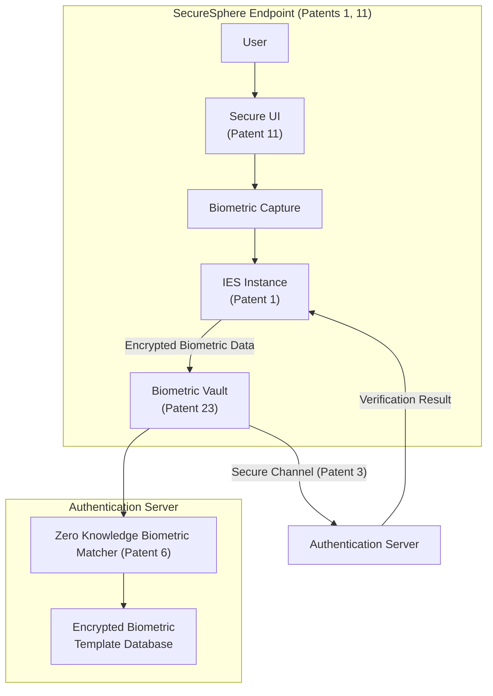
```mermaid
graph TD
    subgraph "SecureSphere Endpoint (Patents 1, 11)"
        User --> UI["Secure UI<br>(Patent 11)"]
        UI --> Biometric_Capture["Biometric Capture"]
        Biometric_Capture --> IES["IES Instance<br>(Patent 1)"]
        IES -->|"Encrypted Biometric Data"| Biometric_Vault["Biometric Vault<br>(Patent 23)"]
    end
    Biometric_Vault -- "Secure Channel (Patent 3)" --> Authentication_Server["Authentication Server"]
    Authentication_Server -- "Verification Result" --> IES
    subgraph "Authentication Server"
        ZK_Matcher["Zero Knowledge Biometric Matcher (Patent 6)"]
        Template_Database["Encrypted Biometric<br>Template Database"]
        ZK_Matcher --> Template_Database
        Biometric_Vault --> ZK_Matcher
    end
```

**Description of Diagram 2:**

Diagram Description for **Patent 23 (Adaptive Context-Aware MFA)**:

This diagram focuses specifically on the biometric authentication aspect of the **Adaptive Context-Aware MFA system** described in **Patent 23**, highlighting the secure handling and verification of biometric data.

**SecureSphere Endpoint (Patents 1, 11):** This subgraph represents the user interaction and initial biometric data handling within the secure endpoint.

**User:** Initiates the authentication process.
*   **Secure UI (Patent 11)**: The user interacts with the secure UI, which facilitates biometric capture.
*   **Biometric Capture**: The process of capturing the user's biometric data (e.g., fingerprint, facial scan).
*   **IES Instance (Patent 1)**: The isolated execution environment where initial processing occurs.
*   **Biometric Vault (Patent 23)**: Securely stores the encrypted biometric data within the IES before transmission.

**Authentication Server:** This component houses the core biometric verification logic.

**Zero-Knowledge Biometric Matcher (Patent 6):** This component performs the biometric matching against stored templates without exposing the raw biometric data, utilizing zero-knowledge proofs.

**Encrypted Biometric Template Database**: Stores the encrypted biometric templates for registered users.

**Data Flow and Connections:** The arrows indicate the flow of data and control information:
*   The user initiates the process through the Secure UI.
*   Captured biometric data is passed to the IES.
*   The IES encrypts the data and stores it in the Biometric Vault.
*   Encrypted data is transmitted via a secure channel (Patent 3) to the Authentication Server.
*   The Zero-Knowledge Matcher compares the encrypted data to the encrypted templates.
*   The verification result is returned to the IES.

**Patent Integration:** The diagram clearly indicates the integration with:
*   **Patent 1 (IES)** for secure processing.
*   **Patent 3 (Multi-Channel Network)** for secure communication.
*   **Patent 6 (Zero-Knowledge Execution)** for private biometric matching.
*   **Patent 11 (Secure UI Kernel)** for secure user interaction.
*   **Patent 23** itself for the overall context-aware MFA system and the introduction of the **Biometric Vault**.

**Key Features Highlighted:**

*   **Secure Handling of Biometrics:** The Biometric Vault and encrypted transmission emphasize the secure handling of sensitive biometric information.
*   **Privacy-Preserving Verification:** The Zero-Knowledge Matcher highlights the privacy-preserving nature of the biometric verification process.
*   **Integration with SecureSphere:** The diagram clearly demonstrates how the biometric authentication component integrates within the broader SecureSphere security architecture.

**Diagram 3:**
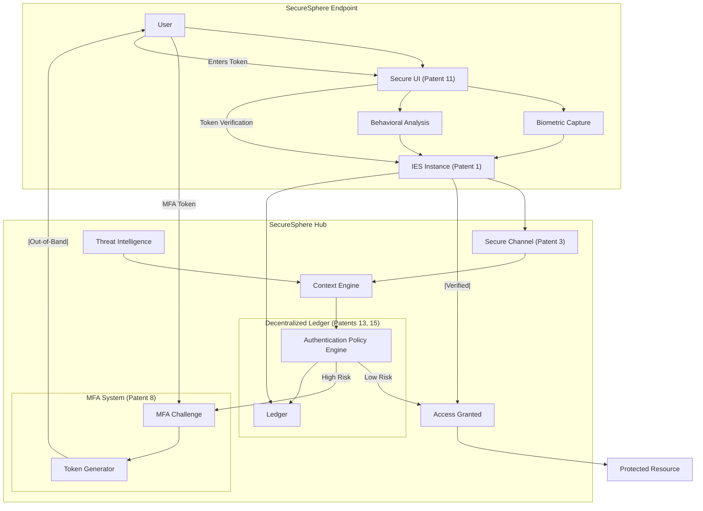
```mermaid
graph TD
    subgraph SecureSphere_Endpoint["SecureSphere Endpoint"]
        User --> UI["Secure UI (Patent 11)"]
        UI --> Biometrics["Biometric Capture"]
        UI --> Behavior["Behavioral Analysis"]
        Biometrics --> IES["IES Instance (Patent 1)"]
        Behavior --> IES
    end

    IES --> Secure_Channel["Secure Channel (Patent 3)"]

    subgraph SecureSphere_Hub["SecureSphere Hub"]
        Secure_Channel --> Context_Engine["Context Engine"]
        Threat_Intel["Threat Intelligence"] --> Context_Engine
        Context_Engine --> Policy_Engine["Authentication Policy Engine"]
        Policy_Engine -- Low Risk --> Access_Granted["Access Granted"]
        Policy_Engine -- High Risk --> MFA["MFA Challenge"]

        subgraph MFA_System["MFA System (Patent 8)"]
            MFA --> Token_Gen["Token Generator"]
            Token_Gen --|Out-of-Band|--> User
            User -->|MFA Token| MFA
        end
        
        User -->|Enters Token| UI
        UI -->|Token Verification| IES
        IES --|Verified|--> Access_Granted

        subgraph "Decentralized Ledger (Patents 13, 15)"
            Ledger["Ledger"]
            Policy_Engine --> Ledger
            IES --> Ledger
        end
    end
    Access_Granted --> Resource["Protected Resource"]
```

**Description for Diagram 3:**

1.  **SecureSphere Endpoint:**
    *   The diagram starts with the User interacting with the Secure UI (Patent 11).
    *   Biometric capture and behavioral analysis occur at the endpoint.
    *   The IES instance receives both biometric and behavioral data.
2.  **Secure Channel (Patent 3):**  The IES communicates with the SecureSphere Hub through a secure channel, emphasizing the protection of sensitive authentication data.
3.  **SecureSphere Hub:**
    *   **Context Engine:**  The central component analyzing context.  It receives input from the IES (biometric and behavioral data) and Threat Intelligence feeds.
    *   **Authentication Policy Engine:**  Makes real-time risk assessments based on the context.
        *   **Low Risk:** Grants access directly.
        *   **High Risk:**  Triggers an MFA challenge.
    *   **MFA System (Patent 8):**  Generates and delivers an out-of-band MFA token to the user.  This is visually separated to highlight the out-of-band nature of the MFA process.
    *   **Token Verification:** The user enters the token, which is verified by the IES instance.
    *   **Decentralized Ledger (Patents 13, 15):**  Logs authentication events and policy decisions for auditing and transparency.
4.  **Protected Resource:** The user gains access to the protected resource upon successful authentication.

**Claims:**

1.  **Adaptive Context-Aware MFA System:** A secure computing system comprising a plurality of Modular Isolated Execution Stacks (IES) (Patent 1) with physically segregated network channels (Patent 3), an out-of-band MFA token mechanism (Patent 8), and a Secure UI Kernel (Patent 11).  An adaptive context-aware MFA system dynamically adjusts authentication requirements based on real-time risk assessments derived from:
    *   User behavior analysis, including access patterns, location, and device usage.
    *   Environmental factors, such as network conditions, threat intelligence feeds, and system load.
    *   Biometric authentication data collected via the Secure UI Kernel, processed using privacy-preserving Secure Multi-Party Computation (MPC).
2.  **Privacy-Preserving Biometric Authentication:** The system of claim 1, wherein biometric authentication data is collected and processed using Secure Multi-Party Computation (MPC). This ensures that raw biometric data remains within the isolated environment of the IES, preventing unauthorized access while enabling accurate and private biometric verification.
3.  **Behavioral Biometric Analysis:** The system of claim 1, wherein user behavior analysis includes continuous monitoring of user interactions within the Secure UI Kernel.  Deviations from established behavioral baselines trigger dynamic adjustments to authentication requirements, enhancing security against compromised or impersonated users.
4.  **Decentralized Audit Trail:** The system of claim 1, wherein all authentication events, including risk assessments, authentication challenges, and biometric verification results, are recorded on a decentralized, tamper-proof ledger (Patents 13 & 15). This provides a transparent and auditable record of all authentication activities, facilitating investigation and accountability.
5.  **Integration with Threat Intelligence Feeds:** The system of claim 1, wherein the context-aware MFA system integrates with real-time threat intelligence feeds.  Elevated threat levels trigger increased authentication rigor, proactively mitigating potential attacks.

## Patent 24: Hardware-Enforced Secure Encrypted Enclave for Data at Rest (HESE-DAR) with Dynamic Resource Allocation and Decentralized Governance Integration

**Abstract:**

This invention discloses a Hardware-Enforced Secure Encrypted Enclave for Data at Rest (HESE-DAR) designed for secure computing endpoints utilizing Modular Isolated Execution Stacks (IES). The HESE-DAR provides dedicated, encrypted storage for each IES instance, performing encryption and decryption operations in isolated hardware.  Granular access control policies enforced within the HESE-DAR restrict access to encrypted data based on user identity, application context, and predefined access control lists.  Dynamic resource allocation within the HESE-DAR optimizes storage utilization for each IES instance based on real-time demands.  Integration with a Dynamic Trust Management System (DTMS) enables secure sharing of encrypted data between trusted IES instances, while a 3D-printed microstructure system generates a tamper-evident audit trail for key management operations, enhancing security and accountability. The HESE-DAR further incorporates anti-tamper mechanisms and post-quantum cryptographic algorithms, providing robust protection against physical and software-based attacks, including threats from quantum computers.  This comprehensive approach safeguards data at rest, complementing SecureSphere's existing protections for data in use and in transit.

**Diagram 1:**
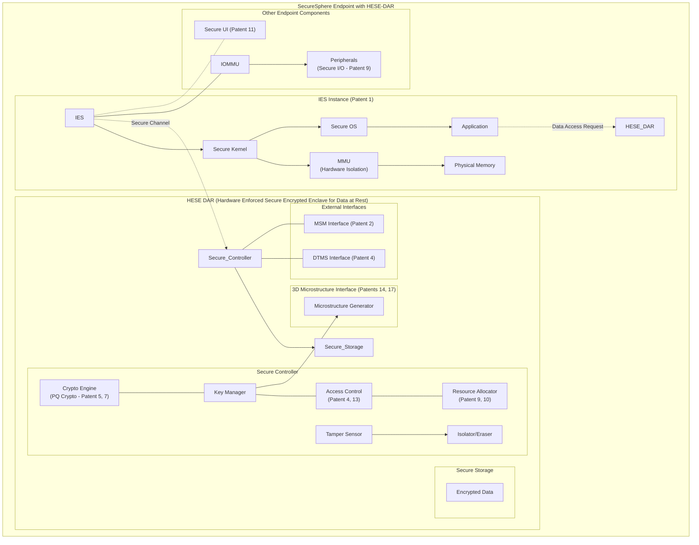
```mermaid
graph LR
    subgraph "SecureSphere Endpoint with HESE-DAR"
        direction LR
        subgraph "IES Instance (Patent 1)"
            IES["IES"] --> Secure_Kernel["Secure Kernel"]
            Secure_Kernel --> MMU["MMU<br>(Hardware Isolation)"]
            MMU --> Phys_Mem["Physical Memory"]
            Secure_Kernel --> Secure_OS["Secure OS"]
            Secure_OS --> App["Application"]
            App -.->|"Data Access Request"| HESE_DAR
        end

        subgraph "HESE DAR (Hardware Enforced Secure Encrypted Enclave for Data at Rest)"
            direction TB
            subgraph "Secure Controller"
                Crypto_Engine["Crypto Engine<br>(PQ Crypto - Patent 5, 7)"]
                Key_Manager["Key Manager"]
                Access_Control["Access Control<br>(Patent 4, 13)"]
                Resource_Allocator["Resource Allocator<br>(Patent 9, 10)"]
                Tamper_Sensor["Tamper Sensor"]
                Crypto_Engine --- Key_Manager
                Key_Manager --- Access_Control
                Access_Control --- Resource_Allocator
                Tamper_Sensor --> Isolator["Isolator/Eraser"]
            end

            subgraph "Secure Storage"
                Encrypted_Data["Encrypted Data"]
            end

            Secure_Controller --> Secure_Storage
            IES -.->|"Secure Channel"| Secure_Controller

            subgraph "3D Microstructure Interface (Patents 14, 17)"
                Microstructure_Gen_HESE["Microstructure Generator"]
            end
            Key_Manager --> Microstructure_Gen_HESE

            subgraph "External Interfaces"
                DTMS_Interface["DTMS Interface (Patent 4)"]
                MSM_Interface["MSM Interface (Patent 2)"]
            end
            Secure_Controller --- DTMS_Interface
            Secure_Controller --- MSM_Interface
        end

        subgraph "Other Endpoint Components"
           IOMMU_HESE["IOMMU"] --> Peripherals_HESE["Peripherals<br>(Secure I/O - Patent 9)"]
           Secure_UI_HESE["Secure UI (Patent 11)"]
           IES --- IOMMU_HESE
           IES -.- Secure_UI_HESE
        end
    end
```

**Diagram 1 Description and Explanation:**

*   **Endpoint Focus:** The diagram zooms in on a single SecureSphere endpoint, highlighting the HESE-DAR's integration with other endpoint components.
*   **IES Integration (Patent 1):** Shows how the IES interacts with the HESE-DAR through a secure channel for data access requests.  This emphasizes the per-IES isolation of encrypted data.
*   **HESE-DAR Internal Structure:** The HESE-DAR subgraph is broken down into key components:
    *   **Secure Controller:** This is the brain of the HESE-DAR, containing:
        *   **Crypto Engine (Patents 5, 7):** Performs encryption/decryption using post-quantum cryptography and potentially integrates anomaly detection for cryptographic operations.
        *   **Key Manager:**  Handles key generation, storage, and secure access.  Connects to the 3D Microstructure Generator.
        *   **Access Control (Patents 4, 13):** Enforces granular access control policies based on user/application identity and decentralized governance policies.
        *   **Resource Allocator (Patents 9, 10):**  Dynamically allocates resources within the HESE-DAR.
        *   **Tamper Sensor:** Detects physical tampering attempts and triggers the Isolator/Eraser.
        *   **Isolator/Eraser:**  Physically isolates the Secure Storage or securely erases encryption keys upon tamper detection.
    *   **Secure Storage:** Physically isolated non-volatile memory for storing encrypted data.
    *   **3D Microstructure Interface (Patents 14, 17):** The Key Manager connects to the Microstructure Generator to create a physical audit trail for key generation.
    *   **External Interfaces:**  Shows the connections to the DTMS and MSM for trust management and security monitoring.
*   **Other Endpoint Components:** Includes essential endpoint components like IOMMU (for peripheral security) and the Secure UI, connected to the IES.
*   **Security Emphasis:** The diagram highlights the HESE-DAR's security features, including physical isolation, hardware encryption, access control, tamper detection, key management, and integration with SecureSphere's security mesh.

**Diagram 2:**
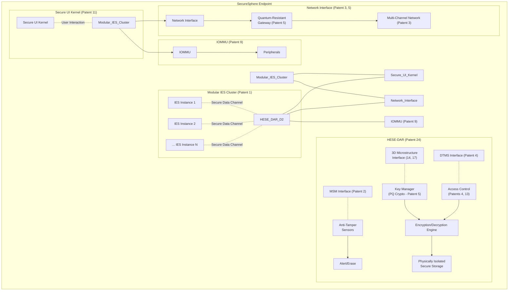
```mermaid
graph LR
    subgraph "SecureSphere Endpoint"
        direction LR
        subgraph "Modular IES Cluster (Patent 1)"
            IES_1_D2["IES Instance 1"]
            IES_2_D2["IES Instance 2"]
            IES_N_D2["... IES Instance N"]
            IES_1_D2 -.- |"Secure Data Channel"| HESE_DAR_D2
            IES_2_D2 -.- |"Secure Data Channel"| HESE_DAR_D2
            IES_N_D2 -.- |"Secure Data Channel"| HESE_DAR_D2
        end

        subgraph "HESE-DAR (Patent 24)"
            direction TB
            Key_Manager_D2["Key Manager<br>(PQ Crypto - Patent 5)"]
            Access_Control_D2["Access Control<br>(Patents 4, 13)"]
            Crypto_Engine_D2["Encryption/Decryption Engine"]
            Secure_Storage_D2["Physically Isolated<br>Secure Storage"]
            Tamper_Sensor_D2["Anti-Tamper<br>Sensors"] --> Alert_D2["Alert/Erase"]
            Key_Manager_D2 --> Crypto_Engine_D2
            Access_Control_D2 --> Crypto_Engine_D2
            Crypto_Engine_D2 --> Secure_Storage_D2

            Microstructure_Interface_D2["3D Microstructure<br>Interface (14, 17)"] -.- Key_Manager_D2

            DTMS_Interface_D2["DTMS Interface (Patent 4)"] -.- Access_Control_D2
            MSM_Interface_D2["MSM Interface (Patent 2)"] -.- Tamper_Sensor_D2
        end

        subgraph "Secure UI Kernel (Patent 11)"
            UI_Kernel_D2["Secure UI Kernel"]
            UI_Kernel_D2 -.- |"User Interaction"| IES_Cluster_D2["Modular_IES_Cluster"]
        end

        subgraph "IOMMU (Patent 9)"
            IOMMU_D2["IOMMU"] --> Peripherals_D2["Peripherals"]
            IES_Cluster_D2 --> IOMMU_D2
        end

        subgraph "Network Interface (Patent 3, 5)"
            NIC_D2["Network Interface"] --> QR_Gateway_D2["Quantum-Resistant<br>Gateway (Patent 5)"]
            QR_Gateway_D2 --> Multi_Channel_Network_D2["Multi-Channel Network (Patent 3)"]
            IES_Cluster_D2 --> NIC_D2
        end
        
        Modular_IES_Cluster --- Secure_UI_Kernel
        HESE_DAR_D2 --- Secure_UI_Kernel
        Modular_IES_Cluster --- Network_Interface
        HESE_DAR_D2 --- Network_Interface
        HESE_DAR_D2 --- IOMMU_Peripherals["IOMMU (Patent 9)"]
    end
```

**Diagram 2 Description:**

*   **Endpoint Focus:** The diagram clearly shows the HESE-DAR integrated within the SecureSphere Endpoint architecture.
*   **Modular IES Cluster (Patent 1):** Multiple IES instances are shown, each with a dedicated secure data channel to the HESE-DAR, emphasizing the per-application data isolation.
*   **HESE-DAR (Patent 24):**  The core components are included, but with less internal detail than the dedicated HESE-DAR diagram:
    *   **Key Manager (Patent 5):** Handles key management using post-quantum cryptography.  A dashed line connects it to the 3D Microstructure Interface.
    *   **Access Control (Patents 4, 13):** Enforces access control policies, integrating with the DTMS.
    *   **Encryption/Decryption Engine:**  Performs the core cryptographic operations.
    *   **Secure Storage:**  Represents the physically isolated, encrypted storage.
    *   **Anti-Tamper Sensors:**  Connected to an "Alert/Erase" block representing the response to tampering.
    *   **3D Microstructure Interface (Patents 14, 17):**  Visually represents the integration with the physical audit trail system.
    *   **DTMS and MSM Interfaces (Patents 2, 4):**  Show the connections for trust management and security monitoring.
*   **Secure UI Kernel (Patent 11):**  Included to show its presence on the endpoint and its interaction with the IES cluster.
*   **IOMMU (Patent 9) and Peripherals:** Demonstrates how peripherals are securely managed.
*   **Network Interface (Patents 3, 5):**  Shows how the endpoint connects to the SecureSphere network using a quantum-resistant gateway and the Multi-Channel Network.

**Diagram 3:**
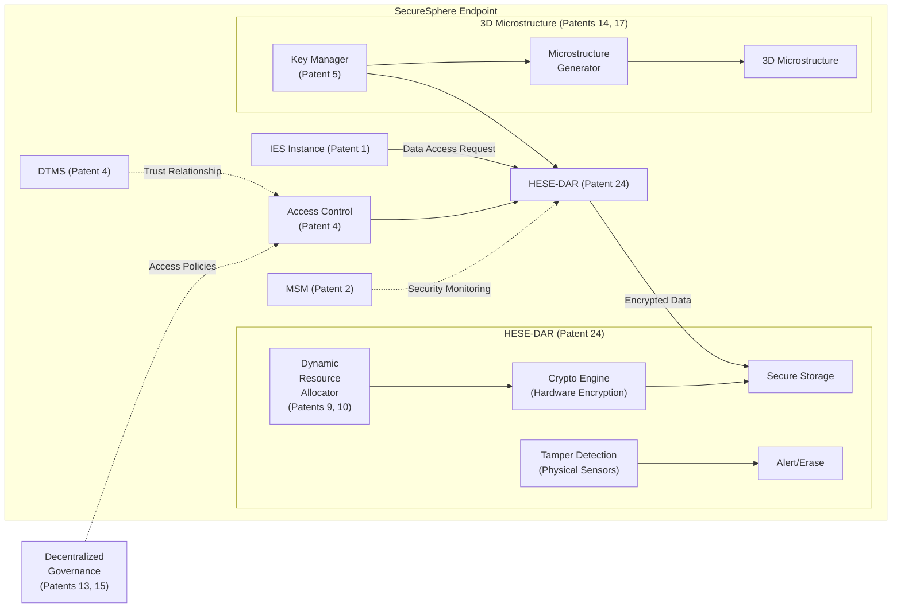
```mermaid
graph LR
    subgraph "SecureSphere Endpoint"
        IES["IES Instance (Patent 1)"] -->|"Data Access Request"| HESE_DAR_D3["HESE-DAR (Patent 24)"]
        HESE_DAR_D3 -->|"Encrypted Data"| Secure_Storage_D3["Secure Storage"]
        Key_Manager_D3["Key Manager<br>(Patent 5)"] --> HESE_DAR_D3
        Access_Control_D3["Access Control<br>(Patent 4)"] --> HESE_DAR_D3
        DTMS_D3["DTMS (Patent 4)"] -.->|"Trust Relationship"| Access_Control_D3
        MSM_D3["MSM (Patent 2)"] -.->|"Security Monitoring"| HESE_DAR_D3

        subgraph "HESE-DAR (Patent 24)"
            direction LR
            Crypto_Engine_D3["Crypto Engine<br>(Hardware Encryption)"]
            Tamper_Detection_D3["Tamper Detection<br>(Physical Sensors)"]
            Resource_Manager_D3["Dynamic<br>Resource<br>Allocator<br>(Patents 9, 10)"]
            Crypto_Engine_D3 --> Secure_Storage_D3
            Tamper_Detection_D3 --> Alert_D3["Alert/Erase"]
            Resource_Manager_D3 --> Crypto_Engine_D3
        end

        subgraph "3D Microstructure (Patents 14, 17)"
             Microstructure_Generator_D3["Microstructure<br>Generator"]
             Key_Manager_D3 --> Microstructure_Generator_D3
             Microstructure_Generator_D3 --> Microstructure_D3["3D Microstructure"]
        end
    end

    Decentralized_Governance["Decentralized<br>Governance<br>(Patents 13, 15)"] -.->|"Access Policies"| Access_Control_D3
```

**Description for Diagram 3:**

**Concept:**

The HESE-DAR would be a dedicated, hardware-based security module integrated directly into SecureSphere endpoints.  Its primary function would be to provide strong encryption and access control for sensitive data at rest, protecting against unauthorized access even if the endpoint's operating system or other software components are compromised.

**Key Features and Benefits:**

*   **Hardware-Based Encryption and Decryption:**  The HESE-DAR would perform all encryption and decryption operations using dedicated hardware, isolated from the main CPU and memory. This prevents software-based attacks from accessing decryption keys or manipulating the encryption process.
*   **Physically Isolated Secure Storage:**  The enclave would include physically isolated non-volatile memory for storing encrypted data.  This isolation ensures that even if an attacker gains physical access to the endpoint, they cannot directly access the encrypted data.
*   **Granular Access Control:**  The HESE-DAR would implement granular access control policies, allowing different users or applications to access only the specific data they are authorized to use. Access control decisions would be made within the secure enclave, preventing unauthorized bypasses.
*   **Key Management within Secure Enclave:**  Encryption keys would be generated, stored, and managed within the secure enclave itself, protected by hardware-based security measures.  This eliminates the risk of key compromise due to software vulnerabilities.
*   **Integration with SecureSphere Components:** The HESE-DAR would seamlessly integrate with other SecureSphere components, such as the DTMS (for trust management) and the MSM (for security monitoring).  The DTMS could be used to establish trust relationships for sharing encrypted data between endpoints, while the MSM could monitor the enclave's security status and detect anomalies.
*   **Secure Boot Integration:**  The HESE-DAR could be integrated into the secure boot process, ensuring that the enclave's firmware and software are authenticated before the endpoint starts. This prevents the use of compromised firmware or drivers.
*   **Anti-Tamper Mechanisms:**  The HESE-DAR would incorporate anti-tamper mechanisms to detect and respond to physical attacks.  This could include sensors that detect physical intrusion or attempts to modify the enclave's hardware, triggering alarms or self-destruct mechanisms to protect sensitive data.

**How it Fills a Gap:**

Currently, SecureSphere focuses on protecting data in use and in transit.  While the IES architecture provides isolation for running applications, data stored on the endpoint's disk is still vulnerable if the OS is compromised. The HESE-DAR addresses this vulnerability by providing a dedicated, hardware-enforced layer of protection for data at rest.

**Alignment with SecureSphere Portfolio:**

This innovation aligns perfectly with the SecureSphere philosophy of hardware-enforced security and zero-trust principles. It complements the existing technologies by adding a crucial layer of protection for sensitive data stored on endpoints, completing the security lifecycle for data across all states (at rest, in use, and in transit).

**Discussion of Claims:**

*   A secure computing endpoint comprising a hardware-enforced secure encrypted enclave for data at rest (HESE-DAR), physically isolated from the main processing unit and memory, said HESE-DAR performing encryption and decryption operations in hardware and storing encrypted data in dedicated, physically isolated non-volatile memory.
*   The endpoint of claim 1, wherein the HESE-DAR implements granular access control policies enforced in hardware, restricting access to encrypted data based on user identity, application context, or other pre-defined criteria.
*   The endpoint of claim 1, wherein the HESE-DAR generates, stores, and manages encryption keys within the secure enclave, protected by hardware-based security mechanisms, preventing software-based access to said keys.
*   **Integration with SecureSphere's IES Architecture:**  This is the most significant differentiator.  Apple's secure enclave operates within a relatively traditional OS architecture.  HESE-DAR, however, would be deeply integrated with SecureSphere's IES, allowing for granular, hardware-enforced isolation *per application*.  This means data for different applications within different IES instances can be encrypted and protected independently, even from each other.  This fine-grained isolation is not present in Apple's approach.  A compromised application in one IES wouldn't be able to access data encrypted by the HESE-DAR in another IES.
*   **Dynamic Security Partitioning and Resource Allocation:**  Tie HESE-DAR's resource allocation (secure memory, processing cycles for encryption/decryption) to SecureSphere's dynamic resource management (Patents 9 and 10).  The HESE-DAR could dynamically adjust its resource usage based on real-time threat assessments or application needs. For example, if an application becomes more critical, the HESE-DAR could dedicate more resources to its data protection.  This dynamic adaptability is not a feature of Apple's T2/T3.
*   **Decentralized Governance Integration:**  Connect HESE-DAR's access control policies to SecureSphere's decentralized governance system (Patents 13 and 15).  This would allow for democratic and transparent control over data access policies, rather than relying on a centralized authority.  A distributed consensus mechanism could be used to approve changes to data encryption policies.
*   **3D-Printed Microstructure Integration (Patents 14, 17):**  Link the HESE-DAR's key generation or audit logs to the 3D-printed microstructure system for enhanced tamper evidence.  This creates a physical record of key generation and usage, providing an additional layer of security and auditability beyond what Apple's system offers.
*   **Focus on specific threat models:** Position HESE-DAR as specifically designed to address certain threat models that Apple's system might not explicitly target. This could include protection against specific side-channel attacks, advanced persistent threats (APTs), or supply chain attacks.
*   **Quantum-Resistant Encryption:** While Apple's future chips *might* integrate this, explicitly emphasize post-quantum cryptography in HESE-DAR's encryption and key management (Patent 5). This future-proofs the system against attacks from quantum computers.
*   **Open Standards and Interoperability:**  Design HESE-DAR to be compatible with open standards for encryption and key management. This contrasts with Apple's more closed ecosystem and provides greater flexibility for users.
*   **Secure Chiplet Integration (Patent 12):**  If the HESE-DAR itself is designed as a hot-swappable chiplet, its integration with the secure chiplet interface within the IES allows secure replacement and upgrades of the encryption hardware.

**Independent Claim 11:**

A method for securing data at rest within a secure computing endpoint comprising a plurality of Modular Isolated Execution Stacks (IES), the method comprising:

*   encrypting data associated with each IES instance using a dedicated hardware-enforced secure encrypted enclave for data at rest (HESE-DAR), wherein said HESE-DAR is physically isolated from the main processing unit and memory of the endpoint;
*   generating, storing, and managing encryption keys within said HESE-DAR, independent of the IES processing resources;
*   enforcing granular access control policies to the encrypted data within said HESE-DAR based on user identity, application context, and pre-defined access control lists;
*   dynamically allocating storage resources within said HESE-DAR to each IES instance according to real-time workload demands and security policies;
*   integrating said HESE-DAR with a Dynamic Trust Management System (DTMS) to enable secure sharing of encrypted data between IES instances based on established trust relationships; and
*   generating a tamper-evident audit trail of key management operations within said HESE-DAR.

**Dependent Claims (for Independent Claim 11):**

*   **Claim 12:** The method of claim 11, wherein said encrypting further comprises utilizing post-quantum cryptographic algorithms to protect against attacks from quantum computers. *This links to Patent 5 and strengthens the future-proofing aspect.*
*   **Claim 13:** The method of claim 11, wherein said enforcing further comprises utilizing a hardware-based access control module within said HESE-DAR to enforce access policies based on the aforementioned criteria, independent of the endpoint's main operating system. *This emphasizes the hardware enforcement and isolation from the OS.*
*   **Claim 14:** The method of claim 11, wherein said dynamically allocating further comprises adjusting the allocated storage resources in real-time based on workload demands and security policies received from a central management system. *This highlights the dynamic and responsive nature of the resource allocation.*
*   **Claim 15:** The method of claim 11, wherein said integrating further comprises encrypting data shared between trusted IES instances using keys managed by the DTMS, ensuring secure inter-IES communication. *This links to the secure collaboration aspects of SecureSphere.*
*   **Claim 16:** The method of claim 11, wherein said generating further comprises creating a 3D-printed microstructure corresponding to each encryption key generated, stored, or managed, providing a physical, tamper-evident record of key operations. *This links Patent 24 to Patents 14 and 17, strengthening the audit trail.*
*   **Claim 17:** The method of claim 16, wherein said 3D-printed microstructure incorporates a unique identifier linked to the corresponding encryption key, and wherein said identifier is recorded on a decentralized, tamper-proof ledger. *This further enhances the security and auditability of the key management process by linking the physical microstructure to the digital ledger.*
*   **Claim 18:** The method of claim 11, wherein said HESE-DAR is implemented as a hot-swappable chiplet integrated into the endpoint architecture, enabling secure replacement and upgrades of the encryption hardware. *This incorporates the chiplet architecture from Patent 12 and adds flexibility for hardware upgrades.*
*   **Claim 19:** The method of claim 11, further comprising monitoring the integrity of said HESE-DAR using a Master Security Mesh (MSM), and wherein said monitoring comprises detecting and reporting anomalies in HESE-DAR operation to the MSM for system-level security responses. *This integrates with SecureSphere's security monitoring capabilities (Patent 2).*
*   **Claim 20:** The method of claim 11, further comprising detecting tampering with said HESE-DAR using physical sensors, and wherein detection of tampering triggers an alert and initiates a secure erasure of encryption keys stored within said HESE-DAR. *This strengthens the physical security and protection against tampering.*

## Patent 25: Dynamically Reconfigurable Capability-Based Inter-IES Communication for SecureSphere

**Abstract:**

This invention discloses a novel secure inter-IES communication mechanism for the SecureSphere system, called Dynamically Reconfigurable Capability-based Inter-IES Communication (DRCI). DRCI enhances security and flexibility by using dynamically reconfigurable capabilities to control data sharing and resource access between Isolated Execution Stacks (IES).  Instead of statically configured communication pathways, each IES instance is assigned a set of capabilities that define its access rights to memory regions in other IES instances. These capabilities, specifying permitted operations (read, write, execute) and valid address ranges, are dynamically managed by a Capability Manager within the SecureSphere Hub.  This manager adjusts capability permissions in real-time based on trust levels from the Dynamic Trust Management System (DTMS), workload demands, governance policies, and error handling feedback. This dynamic approach enables fine-grained access control, adaptive security responses, and secure collaboration between IES instances while optimizing resource utilization and maintaining strong isolation.  Hardware-assisted capability management within the Hub ensures efficient operation, providing a robust and adaptable secure inter-IES communication framework.

**Brief Description:**

DRCI addresses a key challenge in secure multi-kernel systems:  controlling data sharing between isolated execution environments. SecureSphere's current design leverages data diodes (Patent 2) for unidirectional communication and the DTMS (Patent 4) for managing trust relationships during resource borrowing (Patent 9).  However, these mechanisms lack the flexibility and fine-grained control needed for secure, bidirectional data sharing.

DRCI introduces a capability-based approach.  Instead of static data diodes, inter-IES communication is governed by capabilities.  Each IES instance holds a set of capabilities that grant it specific access rights (read, write, execute) to memory regions within other IES instances. These capabilities also specify permitted address ranges within those regions.

The key innovation is the *dynamic reconfigurability* of these capabilities. A dedicated Capability Manager, residing within the SecureSphere Hub, actively manages these inter-IES capabilities. This manager can issue, revoke, or modify capability permissions in real time based on:

*   **DTMS Trust Levels (Patent 4):**  Capabilities are granted or revoked based on the trust level of each IES instance.  Changes in trust levels dynamically affect access rights.
*   **Real-time Workload Demands (Patent 10):**  The Capability Manager can adjust capabilities based on resource usage and performance metrics, preventing overloaded IES instances from impacting others.
*   **Governance Policies (Patents 13, 15):**  System-wide governance policies can influence capability distribution and access control decisions.
*   **Error Handling Feedback:**  Errors or security anomalies detected during inter-IES communication can trigger capability adjustments, dynamically restricting access or isolating potentially compromised IES instances.
*   **Inter-IES Collaboration Context (Patents 18, 22):**  Capabilities can be dynamically adjusted to support specific collaboration contexts (Patent 18 - SHVS) and inter-zone collaboration policies (Patent 22 - SIZCF).

This dynamic approach allows the system to adapt to changing conditions and enforce flexible security policies.  It enables secure collaboration by granting and revoking access as needed for specific tasks.

For efficiency, the Capability Manager is assisted by dedicated hardware within the SecureSphere Hub. This hardware, potentially implemented as a specialized chiplet (Patent 12), performs capability storage, lookup, validation, and secure distribution to IES instances.

**Diagram:**
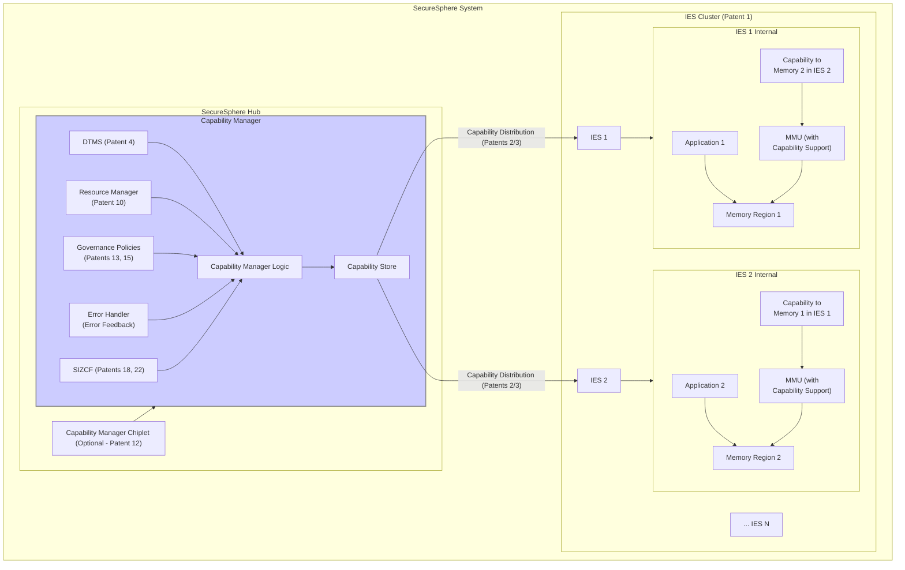
```mermaid
graph LR
    subgraph SecureSphere_System["SecureSphere System"]
        direction LR
        subgraph IES_Cluster["IES Cluster (Patent 1)"]
            IES_1["IES 1"]
            IES_2["IES 2"]
            IES_N["... IES N"]

            subgraph IES_1_Internal["IES 1 Internal"]
                App_1["Application 1"] --> Memory_1["Memory Region 1"]
                Cap_1["Capability to<br>Memory 2 in IES 2"] --> MMU_1["MMU (with<br>Capability Support)"]
                MMU_1 --> Memory_1
            end
            IES_1 --> IES_1_Internal

            subgraph IES_2_Internal["IES 2 Internal"]
                App_2["Application 2"] --> Memory_2["Memory Region 2"]
                Cap_2["Capability to<br>Memory 1 in IES 1"] --> MMU_2["MMU (with<br>Capability Support)"]
                MMU_2 --> Memory_2
            end
            IES_2 --> IES_2_Internal
            
        end

        subgraph SecureSphere_Hub["SecureSphere Hub"]
            subgraph Capability_Manager_Hub["Capability Manager"]
                CM["Capability Manager Logic"] --> Capability_Store["Capability Store"]
                DTMS_CM["DTMS (Patent 4)"] --> CM
                RM_CM["Resource Manager<br>(Patent 10)"] --> CM
                GP_CM["Governance Policies<br>(Patents 13, 15)"] --> CM
                EH_CM["Error Handler<br>(Error Feedback)"] --> CM
                SIZCF_CM["SIZCF (Patents 18, 22)"] --> CM

                Capability_Store -- "Capability Distribution (Patents 2/3)" --> IES_1
                Capability_Store -- "Capability Distribution (Patents 2/3)" --> IES_2
            end

            Chiplet_CM["Capability Manager Chiplet (Optional - Patent 12)"] --> Capability_Manager_Hub["Hardware Assistance"]

        end
    end

    style Capability_Manager_Hub fill:#ccf,stroke:#888,stroke-width:2px
```

**Description of Diagram:**

This diagram illustrates the Dynamically Reconfigurable Capability-based Inter-IES Communication (DRCI) system, highlighting its key components, interactions, and integration with SecureSphere.

1.  **SecureSphere System:**  Encompasses all the components of DRCI and the relevant SecureSphere elements.
2.  **IES Cluster (Patent 1):** Shows two IES instances (IES 1 and IES 2) with expanded internal views to illustrate how capabilities control memory access.
    *   **IES 1 Internal & IES 2 Internal:**
        *   **Application 1 & Application 2:** Applications running within the IES instances.
        *   **Memory Region 1 & Memory Region 2:**  Memory regions within each IES, potentially containing sensitive data.
        *   **Cap_1 & Cap_2:** Capabilities held by each IES, granting access to a memory region in the *other* IES.
        *   **MMU (with Capability Support):**  The Memory Management Unit within each IES is enhanced to understand and enforce capability-based access control.
3.  **SecureSphere Hub:** This subgraph contains the core components of DRCI.
    *   **Capability Manager:**  The central entity responsible for dynamic capability management.
        *   **Capability Manager Logic (CM):** The logic that determines capability permissions based on various inputs.
        *   **Capability Store:** Securely stores the capabilities and their associated metadata.
        *   **Inputs to Capability Manager Logic:**
            *   **DTMS (Patent 4):**  Provides trust level information for IES instances.
            *   **Resource Manager (Patent 10):** Provides real-time resource utilization metrics.
            *   **Governance Policies (Patents 13 & 15):** Provides system-wide governance rules for capability management.
            *   **Error Handler (Error Feedback):** Provides feedback on errors or security anomalies during inter-IES communication.
            *   **SIZCF (Patents 18 & 22):** Provides context and policy information for secure collaboration.
4.  **Capability Distribution:** The diagram shows the Capability Store distributing capabilities to the IES instances through secure communication channels, leveraging the security of Patents 2 and 3.
5.  **Optional Chiplet Integration (Patent 12):**  Illustrates the optional integration of a dedicated chiplet for hardware-assisted capability management, enhancing efficiency.

**Key Features and Interactions Highlighted:**

*   **Capability-Based Access Control:** The diagram clearly shows how capabilities control access between IES instances.
*   **Dynamic Reconfiguration:** The Capability Manager's connections to DTMS, Resource Manager, Governance Policies, and Error Handler visualize the dynamic nature of capability management.
*   **Secure Capability Distribution:** The secure communication pathways for capability distribution are emphasized.
*   **Hardware Assistance:**  The optional chiplet for capability management highlights the potential for hardware acceleration.
*   **SecureSphere Integration:** The diagram explicitly shows how DRCI integrates with Patents 1, 2, 3, 4, 10, 12, 13, 15, 18, and 22, emphasizing its role within the broader SecureSphere architecture.

**Claim 1:**

A secure computing system comprising a plurality of Isolated Execution Stacks (IES) and a secure communication mechanism between said IES instances, wherein said communication mechanism comprises:

a) a capability-based access control system, wherein each IES instance holds a set of capabilities granting specific access rights (read, write, execute) to designated memory regions within other IES instances, said capabilities further specifying permitted address ranges within those regions; and b) a Capability Manager, residing within a central management entity, dynamically reconfiguring said capabilities in real-time based on at least one of: trust levels of said IES instances, real-time resource utilization, system-wide governance policies, or error handling feedback.

**Dependent Claims:**

*   **Claim 2:** The system of claim 1, wherein said Capability Manager adjusts said capabilities based on trust levels provided by a Dynamic Trust Management System (DTMS).
*   **Claim 3:** The system of claim 1, wherein said Capability Manager adjusts said capabilities based on real-time resource utilization metrics obtained from said IES instances.
*   **Claim 4:** The system of claim 1, wherein said Capability Manager adjusts said capabilities based on system-wide governance policies defined by a decentralized governance system.
*   **Claim 5:** The system of claim 1, wherein said Capability Manager adjusts said capabilities based on error handling feedback received from said IES instances or a system-wide error management module.
*   **Claim 6:** The system of claim 1, further comprising dedicated hardware within said central management entity for managing said capabilities, said hardware performing at least one of: capability storage, lookup, validation, or secure distribution of said capabilities to said IES instances.
*   **Claim 7:** The system of claim 6, wherein said dedicated hardware is implemented as a hot-swappable chiplet.
*   **Claim 8:** The system of claim 1, wherein said capabilities are cryptographically protected to prevent unauthorized modification or forgery.
*   **Claim 9:** The system of claim 1, wherein said capabilities are integrated with a Secure Hyper-Virtualization System (SHVS) to enable secure collaboration contexts between said IES instances.
*   **Claim 10:** The system of claim 1, wherein said capabilities are integrated with an Inter-Zone Collaboration Framework (SIZCF) to enable secure data sharing and collaboration across different security zones.
*   **Claim 11:** The method of claim 1, wherein the integrity and authenticity of said capabilities are verified using a 3D-printed microstructure corresponding to the capability or components thereof, such as the unique identifier and/or object type.

This comprehensive set of claims covers the core innovations of DRCI and its integration with SecureSphere's existing security mechanisms.  The claims emphasize the dynamic reconfigurability of capabilities, the integration with trust levels, resource management, governance policies, and error handling, as well as the use of dedicated hardware for efficient capability management.  The inclusion of dependent claims broadens the scope of protection and strengthens the patent's overall value.

## Patent 26: Capability-Enhanced Packet-Carried Forwarding State for Secure Inter-Component Communication in Multi-Kernel Systems
**Abstract:**

This invention discloses a novel secure communication mechanism for multi-kernel computing systems, called Capability-Enhanced PCFS (CE-PCFS). CE-PCFS improves security, flexibility, and efficiency of inter-component communication by integrating capabilities directly into the Packet-Carried Forwarding State (PCFS). Each communication packet's header includes a set of hop fields, each containing both forwarding information and a capability. The capability grants specific access rights to designated memory regions or functionalities within the destination component. These capabilities specify permitted actions (read, write, execute) and address ranges, enabling fine-grained access control at the data plane level.  A central Capability Manager dynamically reconfigures these capabilities based on trust levels, resource usage, and security policies, enabling adaptive security responses and optimized resource allocation. CE-PCFS reduces reliance on centralized trust management for individual access decisions, improving performance and scalability while maintaining strong isolation between components. This innovative approach provides a robust and adaptable secure communication framework for multi-kernel systems.

**Claims:**

**Independent Claim 1:**

A secure communication system for a multi-kernel computing system comprising a plurality of isolated computing components, wherein each component has dedicated processing, memory, and communication resources, and a secure communication mechanism between said components, comprising:

a) Packet-Carried Forwarding State (PCFS), wherein each communication packet includes a header comprising a sequence of hop fields, each hop field associated with a component along a communication path; and b) Capability-Enhanced Hop Fields, wherein each hop field further comprises a capability granting specific access rights (read, write, execute) and address ranges to designated memory regions or functionalities within the destination component specified by said hop field.

**Dependent Claims:**

*   **Claim 2:** The system of claim 1, wherein said capabilities within said hop fields are dynamically reconfigured by a Capability Manager, said Capability Manager adjusting capability permissions based on at least one of: trust levels of said components, real-time resource utilization metrics, or system-wide security policies.
*   **Claim 3:** The system of claim 2, wherein said Capability Manager resides within a central management entity and utilizes secure communication channels to distribute updated capabilities to said components.
*   **Claim 4:** The system of claim 1, wherein said hop fields further encode policy information restricting permitted actions within the destination component.
*   **Claim 5:** The system of claim 1, wherein said capabilities are cryptographically protected using digital signatures, message authentication codes, or other cryptographic techniques to ensure their integrity and authenticity.
*   **Claim 6:** The system of claim 1, wherein the validity of capabilities is bound to a time interval or other defined conditions.
*   **Claim 7:** The system of claim 1, further comprising dedicated hardware within a central management entity for managing said capabilities, said hardware performing at least one of: capability storage, lookup, validation, or secure distribution of said capabilities to said components.
*   **Claim 8:** The system of claim 7, wherein said dedicated hardware is implemented as a hot-swappable chiplet.
*   **Claim 9:** The system of claim 1, wherein said hop fields and/or capabilities are recorded on a decentralized, tamper-proof ledger to create an audit trail of communication activities and access control decisions.
*   **Claim 10:** The system of claim 1, wherein said multi-kernel computing system comprises a plurality of Modular Isolated Execution Stacks (IES), and wherein said components correspond to said IES instances.

These claims aim to broadly cover the core innovation of CE-PCFS, its integration with dynamic capability management, and its application within multi-kernel systems like SecureSphere. The claims emphasize the integration of capabilities within hop fields, enabling fine-grained access control in the data plane. They also cover the dynamic aspect of capability management and potential hardware acceleration using chiplets.

## Patent 27: Sovereign Trust Network for Secure Key Management and Authentication with Multi-Level Control and Recovery System

**Abstract:**

This invention discloses a Sovereign Trust Network (STN) within a secure, multi-kernel computing system, providing an isolated and secure environment for managing cryptographic keys, authentication credentials, and other sensitive information. The STN features a novel multi-level control system, enabling granular management and recovery of cryptographic keys. A primary control plane manages operational aspects of the STN, while a highly secure, independent recovery control plane is dedicated to key recovery operations. This separation enhances security by isolating critical recovery functions. The STN operates with complete data plane isolation and minimal coupling to the primary control plane, minimizing attack surfaces. Access to and operations within the STN are secured by strong, multi-factor authentication, including passkeys and hardware-rooted trust. Secure communication with external high-trust environments is achieved through dedicated, authenticated channels, logically separated from the standard internet and the primary control plane of the STN. Integration with hardware-enforced secure enclaves provides robust protection for data at rest within the STN.  The system enables seamless key recovery through authenticated trust networks by leveraging a hierarchical, globally distributed network of trusted synchronization nodes.  This hierarchical structure allows for efficient and secure synchronization of recovery information, enabling authorized users to recover keys even in the event of localized outages or compromises.

**Diagrams:**
```mermaid
graph TD
    subgraph "Sovereign Trust Network (STN) (Patent 27)"
        subgraph "Dedicated Data Plane"
            Data_Input["Data Input"] --> NonSwitched_Firewall["Non-Switched Firewall Segment<br>(Dedicated to STN)"]
            NonSwitched_Firewall --> Router["STN Router"]
            Router --> IES_Cluster["STN IES Cluster<br>(Patent 1)"]
            IES_Cluster --> HESE_DAR["HESE-DAR (Patent 24)"]
            Data_Diode["Data Diode (Patent 2)"] --> External_High_Trust["External High-Trust Environments"]
            IES_Cluster ----> Data_Diode
        end

        subgraph "Minimal Control Plane Interface"
            Dedicated_Control_Channel["Dedicated Control Channel<br>(Authenticated & Encrypted)"] --> STN_Control_Plane["STN Control Plane"]
            STN_Control_Plane --> Auth_Manager["Authentication Manager<br>(Passkeys, Hardware-Rooted Trust)"]
            STN_Control_Plane --> Resource_Manager["Resource Manager (Patents 9, 10)"]
            SecureSphere_Control_Plane["SecureSphere Control Plane"] -.-> Dedicated_Control_Channel
        end
        
        subgraph "Isomorphic Security Stack (Claim 8)"
            IAMA["IAMA Module<br>(Patent 16, Claim 9)"] --> Iso_MSM["Isomorphic MSM (Patent 2)"]
            Legacy_System["Legacy System"] --> Data_Diode_Monitor["Data Diode (Patent 2)"]
            Data_Diode_Monitor --> Legacy_Monitor["Legacy System Monitor"]
            Legacy_Monitor --> IAMA
            Iso_MSM --> Iso_DTMS["Isomorphic DTMS (Patent 4)"]
            Iso_DTMS --> Iso_Security_Modules["Isomorphic Security Modules"]
            Iso_Security_Modules --> IES_Cluster
        end
        
        subgraph "Key Recovery System"
            Sync_Nodes["Hierarchical Network of<br>Trusted Synchronization Nodes"] --> Recovery_Controller["Recovery Controller"]
            Recovery_Controller --> Key_Manager_Recovery["Key Manager"]
            Key_Manager_Recovery --> HESE_DAR
        end

        Dedicated_Data_Plane --- Minimal_Control_Plane_Interface
        Minimal_Control_Plane_Interface --- Isomorphic_Security_Stack
        Isomorphic_Security_Stack --- Key_Recovery_System
    end

    style Dedicated_Data_Plane fill:#ccf,stroke:#888
    style Isomorphic_Security_Stack fill:#aaf,stroke:#666
```

---

```mermaid
graph TD
    subgraph "Sovereign Trust Network (STN) (Patent 27)"
        subgraph "Dedicated Data Plane"
            Data_Input_STN["Data Input"] --> NonSwitched_Firewall_STN["Non-Switched Firewall Segment<br>(Dedicated to STN)"]
            NonSwitched_Firewall_STN --> Router_STN["STN Router"]
            Router_STN --> IES_Cluster_STN["STN IES Cluster<br>(Patent 1)"]
            IES_Cluster_STN --> HESE_DAR_STN["HESE-DAR (Patent 24)"]
            Data_Diode_STN["Data Diode (Patent 2)"] --> External_High_Trust_STN["External High-Trust Environments"]
            IES_Cluster_STN ----> Data_Diode_STN
        end

        subgraph "Isomorphic Security Stack (Claim 8)"
            IAMA_STN["IAMA Module<br>(Patent 16, Claim 9)"] --> Iso_MSM_STN["Isomorphic MSM (Patent 2)"]
            Legacy_System_STN["Legacy System"] --> Data_Diode_Monitor_STN["Data Diode (Patent 2)"]
            Data_Diode_Monitor_STN --> Legacy_Monitor_STN["Legacy System Monitor"]
            Legacy_Monitor_STN --> IAMA_STN
            Iso_MSM_STN --> Iso_DTMS_STN["Isomorphic DTMS (Patent 4)"]
            Iso_DTMS_STN --> Iso_Security_Modules_STN["Isomorphic Security Modules"]
            Iso_Security_Modules_STN --> IES_Cluster_STN
        end
        
        subgraph "Key Recovery System_STN"
            Sync_Nodes_STN["Hierarchical Network of<br>Trusted Synchronization Nodes"] --> Recovery_Controller_STN["Recovery Controller"]
            Recovery_Controller_STN --> Key_Manager_STN["Key Manager"]
            Key_Manager_STN --> HESE_DAR_STN
        end
    end
```
```mermaid
graph TD
    subgraph "Sovereign Trust Network (STN) (Patent 27)"
        direction LR
        subgraph "Minimal Control Plane Interface"
            Minimal_Control_Plane_Interface_Node["Control Plane Interface"]
            subgraph "Internals"
                Dedicated_Control_Channel_STN["Dedicated Control Channel<br>(Authenticated & Encrypted)"] --> STN_Control_Plane_Node["STN Control Plane"]
                STN_Control_Plane_Node --> Auth_Manager_STN["Authentication Manager<br>(Passkeys, Hardware-Rooted Trust)"]
                STN_Control_Plane_Node --> Resource_Manager_STN["Resource Manager (Patents 9, 10)"]
                SecureSphere_Control_Plane_STN["SecureSphere Control Plane"] -.-> Dedicated_Control_Channel_STN
            end
        end
        Dedicated_Data_Plane_Node["Dedicated<br>Data<br>Plane"] --- Minimal_Control_Plane_Interface_Node
        Minimal_Control_Plane_Interface_Node --- Isomorphic_Security_Stack_Node["Isomorphic<br>Security<br>Stack"]
        Isomorphic_Security_Stack_Node --- Key_Recovery_System_Node["Key<br>Recovery<br>System"]
    end

    style Dedicated_Data_Plane_Node fill:#ccf,stroke:#888
    style Isomorphic_Security_Stack_Node fill:#aaf,stroke:#666
```

**Diagram Description for Patent 27 (Detailed Internals):**

This diagram provides a comprehensive visualization of the internal components and security mechanisms of the Sovereign Trust Network (STN) as described in Patent 27, incorporating the new claims related to the isolated data plane, minimal control plane, and isomorphic security stack.

Sovereign Trust Network (STN) (Patent 27): This top-level subgraph encapsulates all components and functionalities of the STN.

Dedicated Data Plane:  Highlights the complete isolation of the STN's data plane.

Data Input:  Entry point for data into the STN.
Non-Switched Firewall Segment: A dedicated segment within the firewall, ensuring no switching to other networks.
STN Router:  Handles routing within the STN.
STN IES Cluster (Patent 1): Provides isolated execution environments within the STN.
HESE-DAR (Patent 24): Securely stores encrypted data within the STN.
Data Diode (Patent 2):  Enables secure, unidirectional communication with external high-trust environments.
Minimal Control Plane Interface:  Illustrates the restricted control plane access.

Dedicated Control Channel (Authenticated & Encrypted): A secure, isolated channel for management functions, separate from SecureSphere’s main control plane and inaccessible from external networks.
STN Control Plane: The control plane managing STN-specific configurations and policies.
Authentication Manager:  Handles authentication for accessing the STN control plane, using passkeys and hardware-rooted trust.
Resource Manager (Patents 9, 10):  Manages resource allocation within the STN.
SecureSphere Control Plane: SecureSphere's main control plane, with minimal, restricted access to the STN control plane.

Isomorphic Security Stack (Claim 8): This subgraph details the isolated, duplicated security infrastructure.

IAMA Module (Patent 16, Claim 9):  Monitors the legacy system for potential threats.
Legacy System:  Represents the connected legacy system.
Data Diode (Patent 2): Ensures unidirectional data flow from the legacy system for monitoring purposes.
Legacy System Monitor: Collects security-relevant data from the legacy system, without accessing sensitive data.
Isomorphic MSM (Patent 2), Isomorphic DTMS (Patent 4), Isomorphic Security Modules:  Represent the duplicated security infrastructure, operating in isolation and dedicated to the STN.

**Key Recovery System:**

Hierarchical Network of Trusted Synchronization Nodes:  Represents the globally distributed network for key recovery.
Recovery Controller: Manages key recovery operations.
Key Manager: Handles key generation, storage, and recovery.

**Connections and Data Flow:**

Solid arrows represent the primary data and control paths. Dashed lines indicate interactions and dependencies.  The diagram clearly shows the separation between the STN's components and SecureSphere's main infrastructure.  The integration with Patent 16, Claim 9 (IAMA), and Patent 24 (HESE-DAR) is visually highlighted.

**Key Features Highlighted:**

*    Data Plane Isolation: The diagram emphasizes the complete separation of the STN's data plane, a crucial security feature.
*    Minimal Control Plane Coupling: The dedicated control channel and restricted access highlight the minimized interaction with the main SecureSphere control plane.
*    Isomorphic Security Stack:  The dedicated, isolated security infrastructure is clearly depicted, showing its components and connections.
*    Key Recovery System:  The integration with the hierarchical network of synchronization nodes is visualized.
*    Patent Integration: The diagram shows the connection to other patents, such as Patents 1, 2, 4, 9, 10, 16 (Claim 9), and 24.

**Claims:**

1.  A secure computing system comprising a Sovereign Trust Network (STN) for managing cryptographic keys and authentication credentials, said STN comprising:

    a. a dedicated, isolated data plane for transmitting sensitive information within the STN, said data plane being physically and logically separated from all other network data planes within the system; b. a primary control plane for managing operational aspects of the STN, including access control, resource allocation, and communication; c. a recovery control plane, independent of said primary control plane, dedicated exclusively to key recovery operations, said recovery control plane having minimal coupling to said primary control plane to enhance security; d. a multi-level control system that manages interactions between said primary control plane and said recovery control plane, wherein access to said recovery control plane is restricted to authorized entities and operations within said recovery control plane are governed by stricter security policies than those applied to said primary control plane; and e. a hierarchical, globally distributed network of trusted synchronization nodes for secure and efficient synchronization of key recovery information, enabling authorized users to recover keys through authenticated trust networks even in the event of localized outages or compromises, wherein said synchronization nodes are organized into a hierarchical structure with different levels of trust and access control.

2.  The system of claim 1, wherein said STN further comprises:

    a. strong, multi-factor authentication mechanisms, including passkeys and hardware-rooted trust, for controlling access to and operations within the STN; b. dedicated hardware and software resources, logically and physically isolated from less trusted network segments, for ensuring the integrity and confidentiality of data within the STN; and c. hardware-enforced secure enclaves for protecting data at rest within the STN.

3.  The system of claim 1, wherein said hierarchical, globally distributed network of trusted synchronization nodes:

    a. utilizes a secure communication protocol for exchanging key recovery information between synchronization nodes; b. employs a distributed consensus mechanism to ensure consistency and integrity of key recovery information across the network; and c. incorporates access control policies based on trust levels and authentication credentials to restrict access to sensitive recovery information.

4.  The system of claim 1, wherein communication between said STN and external high-trust environments is achieved through dedicated, authenticated channels that are logically separated from the standard internet and the primary control plane of the STN.
5.  The system of claim 1, wherein said multi-level control system dynamically adjusts access control policies and security thresholds for said primary control plane and said recovery control plane based on real-time risk assessments, threat intelligence, and trust levels of participating entities.
6.  The system of claim 1, wherein said recovery control plane is further protected by hardware-enforced isolation and tamper-detection mechanisms, including physical sensors and secure boot processes.
7.  The system of claim 1, wherein said key recovery operations utilize a combination of multi-factor authentication, including biometrics, hardware tokens, and 3D-printed microstructures, to verify the identity and authorization of requesting entities.
8.  A secure computing system comprising a Sovereign Trust Network (STN) for managing cryptographic keys and authentication credentials, said STN comprising the components of Claim 1, further comprising:

    a. a dedicated, isolated segment within a network firewall and switching fabric through which all STN data plane traffic is routed, wherein no switching is permitted between said dedicated segment and any other network segment within the system; b. a minimal control plane interface for managing said STN, said interface utilizing a dedicated, secure control channel logically and physically separated from the primary SecureSphere control plane and inaccessible from the standard internet or other external networks; and c. an isomorphic security stack, duplicitous and isolated from the primary SecureSphere security infrastructure, dedicated to monitoring and protecting said STN, said isomorphic security stack leveraging an Isomorphic Architecture Monitoring and Adaptation (IAMA) module (Patent 16, Claim 9) to analyze hostile intelligence from a legacy system connected to the STN and proactively generate and deploy security patches and updates exclusively to the STN’s isolated infrastructure.

9.  The system of claim 8, wherein said dedicated segment within the network firewall enforces strict access control policies and prevents any data flow between the STN's data plane and other network segments.
10. The system of claim 8, wherein said dedicated control channel for the STN's minimal control plane interface utilizes authenticated and encrypted communication protocols to protect against unauthorized access and tampering.
11. The system of claim 8, wherein said isomorphic security stack includes an independent Master Security Mesh (MSM), Dynamic Trust Management System (DTMS), and other security components operating in isolation from the primary SecureSphere security infrastructure.
12. The system of claim 8, wherein said IAMA module within the isomorphic security stack creates and maintains an isomorphic model of a connected legacy system, monitors activity within said legacy system, and proactively generates security patches and updates for the STN based on predicted vulnerabilities in the legacy system.
13. The system of claim 8, wherein said IAMA module utilizes secure, unidirectional communication channels, such as data diodes, to monitor activity within the connected legacy system without exposing the STN to potential attacks.
14. The system of claim 8, wherein said isomorphic security stack dynamically adjusts security policies and access controls for the STN based on analysis of hostile intelligence from the connected legacy system, providing adaptive security responses.
15. The system of claim 8, wherein all security-relevant events and actions taken by the isomorphic security stack are recorded on a dedicated, tamper-proof audit log within the STN, separate from SecureSphere's primary audit trail.

Description of Claim 8:

**Non-Switched Data Plane:**  The STN's data plane is completely isolated within a dedicated segment of the firewall and network infrastructure.  *No switching* is allowed between the STN's data plane and any other network segment, eliminating vulnerabilities associated with dynamic routing or shared resources.  This provides a higher level of security than traditional VLANs or logically separated networks.

**Minimal Control Plane Integration:** While the STN requires some control plane interaction for management functions, this interaction is minimized and strictly controlled.  A dedicated, secure control channel, separate from the main SecureSphere control plane, is used for these limited interactions.

**Isomorphic Security Stack (Patent 16, Claim 9 Integration):**  This is the novel aspect.  A complete, *isomorphic* copy of SecureSphere's security infrastructure (MSM, DTMS, etc.) is created and dedicated *solely* to the STN.  This isomorphic security stack monitors the STN in isolation from the primary security infrastructure.  This allows for specialized security policies and monitoring tailored to the STN's unique requirements.

**Segmented Duplicity:** This isomorphic security stack operates in complete isolation from the primary security mesh, essentially creating a "shadow" security infrastructure dedicated to the STN.  This segmented duplicity adds another layer of defense.  Even if the primary security mesh is compromised, the STN remains protected by its independent, isolated security stack.  This isolated monitoring system leverages the IAMA mechanism from Patent 16, Claim 9, to analyze data from a hostile legacy environment connected to the STN and proactively apply security fixes and updates *only* to the STN's isomorphic security stack.  This enhances the STN's resilience by preventing the propagation of vulnerabilities or attacks from the legacy environment to the primary SecureSphere infrastructure.

## Patent 28: System and Method for Adaptive Secure Inter-Zone Communication Across Authenticated and Sovereign Trust Networks

**Abstract:**

This invention discloses a system and method for adaptive secure inter-zone communication between Authenticated Trust Networks (ATNs) and a Sovereign Trust Network (STN) within a multi-kernel, zoned computing environment. The system establishes a hierarchy of trust, with the ATN providing authenticated communication between authorized entities and the STN serving as a dedicated, isolated enclave for managing highly sensitive authentication data and cryptographic keys.  The core innovation lies in the Dynamic Trust Gateway (DTG), which mediates all communication between the ATN and STN. The DTG dynamically provisions and secures communication channels based on real-time trust levels, resource availability, and security policies defined within each zone.  This adaptive approach utilizes dynamically configurable capabilities, declarative policies, and a distributed consensus protocol for governing interactions.  A secure communication agent within the DTG dynamically manages multiple communication paths for enhanced resilience and performance, adapting to changing conditions and enforcing zone-specific policies.  The STN's complete data plane isolation and minimal control plane coupling enhance security by minimizing attack surfaces. The DTG further employs a novel multi-path capability aggregation mechanism, combining capabilities from multiple paths to provide a consolidated view of access rights for enhanced flexibility and fault tolerance.

**Diagram:**
```mermaid
graph TD
    subgraph "Dynamic Trust Gateway (DTG) (Patent 28)"
        subgraph "Secure Communication Agent (SCA)"
            ATN_Interface["ATN Interface<br>(Multi-Channel Network - Patent 3)"] --> Path_Manager["Multi-Path Manager<br>(Dynamic Path Selection)"]
            Path_Manager --> Path1["Secure Path 1<br>(Quantum-Resistant - Patent 5)"]
            Path_Manager --> PathN["... Secure Path N"]
            Path1 --> STN_Interface["STN Interface"]
            PathN --> STN_Interface
            DTMS["DTMS (Patent 4)"] --> Path_Manager
            AESDS_IAMA["AESDS IAMA (Patent 16, Claim 9)"] -.-> Path_Manager
            Path_Manager -->|"Path Status & Metrics"| Metrics_Engine["Metrics Engine"]
        end

        subgraph "Capability Manager"
            Policy_Engine_CM["Policy Engine (TRC-based)"] --> Capability_Gen["Capability Generator"]
            Capability_Gen --> Capability_Store["Capability Store"]
            Capability_Store -->|"Capabilities"| SCA
            DTMS --> Capability_Gen
            Metrics_Engine --> Capability_Gen
            MPA["Multi-Path Capability Aggregator"] --> Capability_Store
            SCA -->|"Path Capabilities"| MPA
        end

        subgraph "Data Handling & Security"
            STN_Interface --> DPI["Deep Packet Inspection (DPI)"]
            DPI --> Sanitizer["Data Sanitizer"]
            Sanitizer --> AuthZ["Authorization Engine (Capability-Based)"]
            AuthZ -- Authorized --> Data_Handler["Data Handler"]
            AuthZ -- Unauthorized --> Access_Denied["Access Denied"]
            Data_Handler --> STN_PAT27["Sovereign Trust Network (Patent 27)"]
            MSM["Master Security Mesh (Patent 2)"] --> DPI
        end

        subgraph "Decentralized Governance & Auditing"
            Ledger_DGA["Decentralized Ledger (Patents 13, 15)"]
            DTG_Controller["DTG Controller"] --> Ledger_DGA
            Metrics_Engine --> Ledger_DGA
            Data_Handler --> Ledger_DGA
            Policy_Engine_CM -.-> Ledger_DGA
        end
        
        SCA --- Capability_Manager
        Capability_Manager --- Data_Handling_Security
        Data_Handling_Security --- Decentralized_Governance_Auditing
    end

    ATN["Authenticated Trust Network"] --> ATN_Interface
    STN_Interface --> STN_PAT27
```

**Diagram Description for Patent 28 (Detailed Internals):**

This diagram provides a comprehensive view of the Dynamic Trust Gateway (DTG)'s internal components and their interactions within the SecureSphere system, emphasizing its role in mediating secure communication between the Authenticated Trust Network (ATN) and the Sovereign Trust Network (STN).

Dynamic Trust Gateway (DTG) (Patent 28): This top-level subgraph encapsulates all DTG components.

Secure Communication Agent (SCA):  Manages multiple secure communication paths between the ATN and STN.

ATN Interface:  Connects to the Authenticated Trust Network via the Multi-Channel Network (Patent 3).

Multi-Path Manager: Dynamically selects and manages multiple secure paths.  Receives input from the DTMS and the AESDS IAMA module (Patent 16, Claim 9).

Secure Path 1 & ... Secure Path N: Represent multiple independent, secure communication paths (potentially using quantum-resistant communication - Patent 5).

STN Interface: Connects to the Sovereign Trust Network (Patent 27).

Metrics Engine: Collects performance metrics and path status information.  Provides feedback to the Multi-Path Manager and the Capability Manager. Also logs data to the Decentralized Ledger.

Capability Manager:  Dynamically manages capabilities for access control.

Policy Engine: Defines policies for capability generation based on TRCs.

Capability Generator: Creates capabilities based on policy and real-time metrics.

Capability Store: Securely stores generated capabilities.

Multi-Path Capability Aggregator (MPA): Aggregates capabilities from multiple paths for a consolidated view of access rights.

Data Handling & Security:  Handles data inspection, sanitization, and authorization.

Deep Packet Inspection (DPI): Inspects packets for malicious content and policy violations, informed by the Master Security Mesh (MSM).

Data Sanitizer: Sanitizes data to prevent injection attacks or data leakage.

Authorization Engine: Authorizes access based on capabilities and policies.

Data Handler: Handles authorized data transfer between the ATN and STN.

Access Denied: Represents the path for denied requests.

Decentralized Governance & Auditing: Ensures transparency and accountability.

Decentralized Ledger (Patents 13, 15): Stores audit trails and policy information.

DTG Controller: Manages and configures the DTG, logging events to the ledger.

**Key Features Highlighted:**

*    Multi-Path Communication: The SCA manages multiple paths for redundancy and performance.
*    Dynamic Capability Management:  Capabilities are dynamically generated and aggregated, adapting to changing trust levels, resource availability, and policies.
*    Deep Packet Inspection and Sanitization:  Provides strong security against malicious data.
*    Decentralized Governance: The Decentralized Ledger and TRC-based policies ensure transparency and accountability.
*    SecureSphere Integration: The diagram demonstrates how Patent 28 integrates with other SecureSphere patents and components.
*    Isomorphic Model Integration:  The connection from AESDS IAMA to the path manager shows how knowledge of legacy system vulnerabilities influences path selection and capability assignments.

**Claims:**

1.  A secure computing system comprising a plurality of Modular Isolated Execution Stacks (IES) organized into zones, each zone associated with a Trust Root Configuration (TRC), the system further comprising:

    a. an Authenticated Trust Network (ATN) for secure communication between authorized entities within and across zones; b. a Sovereign Trust Network (STN) dedicated to managing sensitive authentication data and cryptographic keys, said STN having complete data plane isolation and minimal control plane coupling to the rest of the system; and c. a Dynamic Trust Gateway (DTG) mediating all communication between said ATN and said STN, said DTG dynamically provisioning and securing communication channels based on real-time trust levels derived from a Dynamic Trust Management System (DTMS), resource availability, and security policies defined within each zone.

2.  The system of claim 1, wherein said DTG comprises:

    a. a secure communication agent that dynamically manages multiple communication paths between the ATN and STN, adapting to changing conditions and enforcing zone-specific policies; b. a capability manager that dynamically configures capabilities for controlling access between the ATN and STN based on trust levels, resource availability, and security policies; and c. a multi-path capability aggregation mechanism that combines capabilities from multiple communication paths to provide a consolidated view of access rights for enhanced flexibility and fault tolerance.

3.  The system of claim 1, wherein said DTG utilizes a distributed consensus protocol to ensure consistent and secure management of communication channels and access control policies between the ATN and STN.
4.  The system of claim 1, wherein said STN's minimal control plane coupling is achieved through a dedicated control channel, logically and physically separated from the ATN, for secure management functions.
5.  The system of claim 1, wherein said DTG enforces declarative policies expressed in a policy language for managing communication between the ATN and STN, said policies specifying permitted data flows, access control restrictions, and security requirements.
6.  The system of claim 1, wherein the DTG integrates with a hierarchical security mesh (Patent 2) to monitor communication between the ATN and STN, detecting and mitigating potential security threats.
7.  The system of claim 1, wherein said DTG employs privacy-preserving techniques, such as differential privacy, homomorphic encryption, or secure multi-party computation, to protect sensitive information during data exchange between the ATN and STN.
8.  The system of claim 1, wherein said multi-path capability aggregation mechanism within said DTG:

    a. receives capabilities from multiple communication paths established between the ATN and STN; b. aggregates said capabilities to determine a consolidated set of access rights for a given request; c. resolves potential conflicts between capabilities from different paths based on predefined precedence rules or a distributed consensus protocol; and d. dynamically adjusts the aggregation strategy based on real-time path availability, performance metrics, and trust levels of individual paths.

9.  The system of claim 1, wherein said DTG performs deep packet inspection and sanitization on all data transmitted between the ATN and STN based on security policies defined within each zone's TRC, preventing the transmission of unauthorized or malicious data.
10. The system of claim 1, wherein the DTG generates and maintains a tamper-proof audit trail of all communication events, access control decisions, and capability changes between the ATN and STN, recording said audit trail on a decentralized, tamper-proof ledger (Patent 15) and correlating it with a physical microstructure audit trail (Patents 14, 17).
11. The system of claim 1, wherein the DTG isolates compromised or untrusted communication paths between the ATN and STN using hardware-enforced isolation mechanisms, including data diodes (Patent 2) and dynamically reconfigurable network segments (Patent 3).
12. The system of claim 1, wherein said DTG supports a variety of communication protocols and data formats for interoperability with different types of IES instances and external systems.
13. The method of claim 1, wherein said DTG further incorporates automated recovery and failover mechanisms in response to at least one of: communication path failures, security breaches, or resource exhaustion.  This recovery mechanism utilizes alternate available paths or reconfigures the system to maintain essential services and data integrity during disruptions, logging all events and actions taken during the recovery process to the decentralized, tamper-proof ledger.
 
## Patent 29: Quantum-Entangled One-Time Pad Module for Secure Computing Architectures

**Abstract:**

This patent discloses a quantum-entangled one-time pad (OTP) module for enhancing the security of data communication within secure computing architectures. The module leverages quantum entangled key distribution (QEKD) to distribute key fragments instantaneously and securely between communicating entities. Dynamic key generation (DKG) within a hardware-enforced secure encrypted enclave (HESE-DAR) eliminates the need for pre-shared keys and reduces storage requirements. Fragmented key management (FKM) further optimizes storage and transmission overhead. The module integrates seamlessly with the secure computing architecture, utilizing its dynamic trust management system (DTMS), isolated execution stacks (IES), and multi-channel network for enhanced security and scalability. An isomorphic legacy system integration (ILSI) mechanism provides backward compatibility with non-quantum-enabled devices. This combination of quantum technologies, innovative key management, and secure architecture integration provides a highly secure, scalable, and practical OTP solution for diverse communication scenarios.

**Diagram 1:**

```mermaid
graph TD
    subgraph SecureSphere_Architecture["SecureSphere Architecture"]
        A[SecureSphere Hub] --> B(DTMS);
        A --> C(AESDS);
        A --> D(MDATS);
        B --> E{IES Instance 1};
        B --> F{IES Instance 2};
        C --> E;
        C --> F;
        D --> E;
        D --> F;
        E --> G((HESE-DAR));
        F --> H((HESE-DAR));
        G --> I[Quantum-Entangled OTP Module];
        H --> J[Quantum-Entangled OTP Module];
        subgraph "Multi-Channel Network (P3)"
            K[External Network] -.-.> L(Firewall);
            L --> M[Secure Channel];
            M --> E;
            M --> F;
            M --> N[Quantum Channel];
            N --> I;
            N --> J;
        end
        subgraph "Isomorphic Legacy System Integration (ILSI - P16 Adaptation)"
            O[Legacy System] -.-> P(Data Diode);
            P --> Q["Classical Cryptography (PQC)"];
            Q --> E;
            Q --> F;
        end
    end
    subgraph "Quantum-Entangled OTP Module Internals"
        I --> R(QEKD Module);
        I --> S(DKG Module);
        I --> T(FKM Module);
        S --> U(QRNG);
        R --> T;
        S --> T;
    end

    style A fill:#ccf,stroke:#333,stroke-width:2px
    style B fill:#ccf,stroke:#333,stroke-width:2px
    style C fill:#ccf,stroke:#333,stroke-width:2px
    style D fill:#ccf,stroke:#333,stroke-width:2px
    style G fill:#ccf,stroke:#333,stroke-width:2px
    style H fill:#ccf,stroke:#333,stroke-width:2px
    style I fill:#ccf,stroke:#333,stroke-width:2px
    style J fill:#ccf,stroke:#333,stroke-width:2px
    style R fill:#f9f,stroke:#333,stroke-width:2px
    style S fill:#f9f,stroke:#333,stroke-width:2px
    style T fill:#f9f,stroke:#333,stroke-width:2px

    classDef secure fill:#ccf,stroke:#333,stroke-width:2px
    classDef module fill:#f9f,stroke:#333,stroke-width:2px

    class A,B,C,D,G,H,I,J secure
    class R,S,T module
```


**Description of Diagram 1:**

**A. SecureSphere Architecture:**

The diagram starts by outlining the core components of the SecureSphere architecture, all of which are relevant to the successful operation and security of the proposed Quantum-Entangled OTP module.  These components are:

*   **SecureSphere Hub (A):** The central orchestrator of the SecureSphere system.  It manages and monitors all components, providing centralized control and coordination.  This is implicitly referenced in many claims, particularly the integration claims of the Quantum-Entangled OTP patent.  Specifically, the Hub would likely manage policy updates to the DTMS and initiate updates to the Quantum-Entangled OTP module (via the AESDS, dependent claim 7).
*   **Dynamic Trust Management System (DTMS) (B):**  A crucial component for managing trust relationships between the different SecureSphere components. The DTMS provides crucial context for access control to the HESE-DAR and the OTP module (Independent claim 1). This is directly supported by dependent claims 4 and 7.
*   **Automated Evolutionary Software Development System (AESDS) (C):** Responsible for the continuous monitoring and update of software across the SecureSphere architecture. The AESDS ensures that the Quantum-Entangled OTP Module remains up-to-date with the latest security patches and improvements (dependent claim 7, as well as implicitly in the general function description of the patent).
*   **Multi-Dimensional Audit Trail System (MDATS) (D):**  Provides comprehensive and tamper-evident auditing capabilities.  The MDATS would log key generation and usage events within the HESE-DAR, ensuring transparency and accountability (dependent claim 4).
*   **Isolated Execution Stacks (IES) (E & F):**  Provide hardware-enforced isolation for different applications and processes. This is crucial to the security of the HESE-DAR and the OTP module itself (Independent claim 1).
*   **Hardware-Enforced Secure Encrypted Enclave (HESE-DAR) (G & H):**  Provides a hardware-protected environment for storing and processing sensitive data. The Quantum-Entangled OTP Module resides within the HESE-DAR, ensuring its security (Independent claim 1, dependent claim 3).
*   **Multi-Channel Network (P3):**  Provides secure and physically segregated communication pathways.  A dedicated quantum channel is included to support the QEKD, reflecting the capabilities described in Patent 3.

**B. Quantum-Entangled OTP Module Internals:**

The diagram's second main area showcases the internal workings of the Quantum-Entangled OTP module, composed of three main modules:

*   **Quantum Entangled Key Distribution (QEKD) Module (R):**  Responsible for generating and exchanging entangled key fragments between communicating IES instances. This addresses the key distribution challenges of traditional OTPs and is the cornerstone of the invention (Independent Claim 1 and Dependent Claim 2).
*   **Dynamic Key Generation (DKG) Module (S):** Generates truly random key fragments on-demand using a QRNG (Quantum Random Number Generator), eliminating the need for pre-shared keys and increasing flexibility (Independent Claim 1).
*   **Fragmented Key Management (FKM) Module (T):** Combines the key fragments from the QEKD and DKG modules to create the complete OTP key only when necessary for encryption/decryption. This significantly reduces storage needs (Independent Claim 1).

**C. Integration and Interactions:**

The diagram shows the following key interactions:

*   **DTMS (B) interacts with HESE-DAR (G & H):**  The DTMS enforces access control policies to the HESE-DAR, governing access to the Quantum-Entangled OTP Module (Independent Claim 1 and Dependent Claim 4).
*   **AESDS (C) interacts with the Quantum-Entangled OTP Module (I & J):**  The AESDS provides automated updates and security patches for the module (Dependent Claim 7).
*   **MDATS (D) interacts with HESE-DAR (G & H):**  The MDATS logs all key generation and usage events (Dependent Claim 4).
*   **IES (E & F) provide isolated execution environments for the Quantum-Entangled OTP module (I & J):** The module is protected from external interference (Independent Claim 1).
*   **The Multi-Channel Network (P3) provides secure communication channels, with a dedicated quantum channel for QEKD (R):** Reflecting features found in Patent 3 (for secure channels) and supporting Dependent Claim 2 (for quantum key distribution).
*   **The Isomorphic Legacy System Integration (ILSI) provides fallback to classical PQC for communication with non-quantum-enabled systems:** This addresses compatibility issues and is a unique feature of the patent (Dependent Claims 5 and 6).

**Diagram 2:**

```mermaid
graph LR
    subgraph Quantum-Entangled_OTP_Module_Internals["Quantum-Entangled OTP Module Internals"]
        I[Quantum-Entangled OTP Module] --> R[QEKD Module];
        I --> S[DKG Module];
        I --> T[FKM Module];

        subgraph QEKD_Module["QEKD Module"]
            R --> R1(Entangled Photon Pair Generation);
            R1 --> R2(Quantum Channel Transmission);
            R2 --> R3(Entangled Key Fragment Extraction);
            R3 --> R4(Secure Key Fragment Storage);
            R4 --> T;
            style R fill:#f9f,stroke:#333,stroke-width:2px
        end

        subgraph DKG_Module["DKG Module"]
            S --> S1(QRNG);
            S1 --> S2(Random Number Generation);
            S2 --> S3(Key Fragment Generation);
            S3 --> S4(Secure Key Fragment Storage);
            S4 --> T;
            style S fill:#f9f,stroke:#333,stroke-width:2px
        end

        subgraph FKM_Module["FKM Module"]
            T --> T1(Secure Key Fragment Retrieval);
            T1 --> T2(Key Fragment Combination);
            T2 --> T3(Complete OTP Key Generation);
            T3 --> T4(Encryption/Decryption);
            style T fill:#f9f,stroke:#333,stroke-width:2px
        end

        subgraph QRNG_Module["QRNG Module"]
            U[QRNG] --> S2;
            style U fill:#ccf,stroke:#333,stroke-width:2px
        end

        style I fill:#ccf,stroke:#333,stroke-width:2px
        classDef secure fill:#ccf,stroke:#333,stroke-width:2px
        classDef module fill:#f9f,stroke:#333,stroke-width:2px

        class I secure
        class R,S,T module
    end
```


**Description of Diagram 2:**

**Legend:**

*   **I (Quantum-Entangled OTP Module):** The overall module coordinating the key generation and management.
*   **R (QEKD Module):**  Handles Quantum Entangled Key Distribution.
    *   **R1 (Entangled Photon Pair Generation):** Generates pairs of entangled photons.
    *   **R2 (Quantum Channel Transmission):** Transmits the entangled photons through a quantum channel.
    *   **R3 (Entangled Key Fragment Extraction):** Extracts key fragments from the entangled photons.
    *   **R4 (Secure Key Fragment Storage):** Stores the extracted key fragments securely.
*   **S (DKG Module):** Handles Dynamic Key Generation.
    *   **S1 (QRNG):** Quantum Random Number Generator, providing true randomness.
    *   **S2 (Random Number Generation):** Generates random numbers using the QRNG.
    *   **S3 (Key Fragment Generation):** Generates key fragments based on the random numbers.
    *   **S4 (Secure Key Fragment Storage):** Stores the generated key fragments securely.
*   **T (FKM Module):** Handles Fragmented Key Management.
    *   **T1 (Secure Key Fragment Retrieval):** Retrieves key fragments from secure storage.
    *   **T2 (Key Fragment Combination):** Combines the key fragments to create the complete OTP key.
    *   **T3 (Complete OTP Key Generation):** Generates the complete one-time pad key.
    *   **T4 (Encryption/Decryption):** Uses the OTP key for encryption or decryption.
*   **U (QRNG):** The Quantum Random Number Generator providing the source of randomness for the DKG module.

This diagram details the internal architecture and operational flow of the Quantum-Entangled One-Time Pad (QE-OTP) Module, a core component of the SecureSphere system (Patent 29). The module leverages quantum mechanics and cryptographic techniques to provide a highly secure and efficient one-time pad (OTP) solution for communication within the SecureSphere architecture.  The QE-OTP module resides within a Hardware-Enforced Secure Encrypted Enclave for Data at Rest (HESE-DAR) to protect against unauthorized access and tampering.

The module consists of three primary sub-modules: the Quantum Entangled Key Distribution (QEKD) Module, the Dynamic Key Generation (DKG) Module, and the Fragmented Key Management (FKM) Module.  Each sub-module performs specific functions, working in concert to generate, distribute, and manage OTP keys securely.  A Quantum Random Number Generator (QRNG) module provides the source of true randomness necessary for key generation.

**1. Quantum Entangled Key Distribution (QEKD) Module:**

This module utilizes the principles of quantum entanglement to securely distribute key fragments between communicating entities within the SecureSphere system.  The process unfolds as follows:

*   **Entangled Photon Pair Generation (R1):**  A source generates pairs of entangled photons. The entanglement ensures that the quantum state of one photon is intrinsically linked to the state of its partner, regardless of the distance separating them.
*   **Quantum Channel Transmission (R2):** These entangled photon pairs are transmitted through a dedicated quantum channel (N) within the SecureSphere's Multi-Channel Network (P3), designed to protect the photons from external interference.  This channel is physically isolated and secured against eavesdropping.
*   **Entangled Key Fragment Extraction (R3):** Upon arrival at the receiving end, a measurement of the entangled photons' quantum states is performed. The measured states are then converted into key fragments. The act of measurement, due to the nature of quantum mechanics, destroys the entangled state and renders the key fragments unusable for anyone who attempted interception, even if they had access to the quantum channel.
*   **Secure Key Fragment Storage (R4):** The extracted key fragments are stored securely within the HESE-DAR, ensuring their protection from unauthorized access.  Access is strictly controlled via the SecureSphere's Dynamic Trust Management System (DTMS).

**2. Dynamic Key Generation (DKG) Module:**

This module generates additional key fragments on demand, supplementing those obtained through QEKD. This dynamic generation eliminates the need for pre-shared keys and adds flexibility to the system. The process is as follows:

*   **QRNG (U):** A Quantum Random Number Generator provides a source of true randomness, essential for cryptographic security.
*   **Random Number Generation (S2):**  The QRNG generates a series of random numbers.
*   **Key Fragment Generation (S3):**  These random numbers are processed by the DKG module to generate additional key fragments.  These fragments, while independent of the entangled fragments from QEKD, add to the overall key's entropy and further enhance its security.
*   **Secure Key Fragment Storage (S4):** The generated key fragments are stored securely within the HESE-DAR, alongside those from the QEKD module.

**3. Fragmented Key Management (FKM) Module:**

The FKM module is the central coordinator for managing the key fragments generated by both QEKD and DKG.  Its purpose is to combine these fragments into a complete OTP key only when needed for encryption or decryption.  This reduces storage requirements and minimizes the exposure time of the full key:

*   **Secure Key Fragment Retrieval (T1):**  Retrieves the necessary key fragments from secure storage (R4 and S4) within the HESE-DAR.
*   **Key Fragment Combination (T2):**  The retrieved fragments are combined using a secure cryptographic algorithm to generate the complete OTP key.  This process occurs only when an encryption or decryption operation is requested.
*   **Complete OTP Key Generation (T3):** The result is a full-length OTP key perfectly suited to the length of the message to be encrypted or decrypted.
*   **Encryption/Decryption (T4):** The generated OTP key is then immediately used for encryption or decryption of the data. Once used, the key is discarded, fulfilling the one-time nature of the OTP.

**4. SecureSphere Integration and Overall Operation:**

The QE-OTP module integrates seamlessly with other SecureSphere components:

*   **SecureSphere Hub (A):** Orchestrates and manages the QE-OTP module, ensuring its proper operation and integration with other SecureSphere components.
*   **DTMS (B):** Enforces access control policies and manages trust relationships, preventing unauthorized access to the key fragments stored within the HESE-DAR.
*   **AESDS (C):** Provides software updates and security patches to all components of the QE-OTP module.
*   **MDATS (D):** Records a complete and tamper-evident audit trail of key generation and usage.
*   **IES Instances (E, F):** Provide the isolated execution environments where encryption and decryption take place.

This design ensures that the entire key generation and management process remains protected within the secure environment of the HESE-DAR, minimizing the risk of key compromise. The dynamic key generation and fragmented key management techniques further enhance efficiency and scalability.  The integration with SecureSphere's various modules provides comprehensive security and auditability.  The system also includes a fallback mechanism, the Isomorphic Legacy System Integration (ILSI), using classical post-quantum cryptography to support communication with systems that do not support quantum communication, ensuring backward compatibility without significant security trade-offs.

**Independent Claims:**

1.  A quantum-entangled one-time pad (OTP) module for secure communication within a secure computing architecture, comprising:
    *   a quantum entangled key distribution (QEKD) module configured to generate and distribute entangled key fragments between communicating entities within the secure computing architecture;
    *   a dynamic key generation (DKG) module located within a hardware-enforced secure encrypted enclave (HESE-DAR) and configured to generate truly random key fragments on demand using a quantum random number generator (QRNG);
    *   a fragmented key management (FKM) module configured to combine the entangled key fragments within the HESE-DAR to form a complete OTP key only when needed for encryption or decryption; and
    *   an integration module configured to interface with the secure computing architecture's dynamic trust management system (DTMS), isolated execution stacks (IES), and multi-channel network to manage access control, ensure isolated execution, and facilitate secure communication.

**Dependent Claims:**

2.  The quantum-entangled OTP module of claim 1, wherein the QEKD module utilizes entangled photon pairs for distributing the key fragments, such that any attempt to intercept a key fragment alters its state and alerts the communicating entities to the compromise.
3.  The quantum-entangled OTP module of claim 1, wherein the HESE-DAR further comprises a secure storage module configured to store the entangled key fragments securely until needed for key combination.
4.  The quantum-entangled OTP module of claim 1, wherein the integration module further interfaces with a multi-dimensional audit trail system (MDATS) to generate audit trails of key generation, distribution, and usage.
5.  The quantum-entangled OTP module of claim 1, further comprising an isomorphic legacy system integration (ILSI) module configured to interface with non-quantum-enabled devices using classical cryptographic methods as a fallback mechanism while minimizing security risks.
6.  The quantum-entangled OTP module of claim 5, wherein the ILSI module utilizes post-quantum cryptography (PQC) for secure communication with non-quantum-enabled devices.
7.  The quantum-entangled OTP module of claim 1, wherein the integration module further interfaces with an automated evolutionary software development system (AESDS) to receive software updates and security patches for the QEKD, DKG, and FKM modules.
8.  A method for secure communication within a secure computing architecture using a quantum-entangled OTP module, comprising the steps of:
    *   generating entangled key fragments using a QEKD module;
    *   distributing the entangled key fragments to communicating entities within the secure computing architecture;
    *   generating additional key fragments on demand within a HESE-DAR using a DKG module and a QRNG;
    *   combining the entangled key fragments and the on-demand generated key fragments within the HESE-DAR to form a complete OTP key;
    *   encrypting a message using the complete OTP key; and
    *   transmitting the encrypted message through the secure computing architecture's multi-channel network.
9.  The method of claim 8, further comprising the step of decrypting the encrypted message using the complete OTP key at the receiving entity.
10. A secure computing architecture comprising the quantum-entangled OTP module of claim 1.

This patent describes a novel One-Time Pad (OTP) module designed to address the limitations of traditional OTPs while seamlessly integrating with the SecureSphere architecture. It leverages quantum entanglement for secure key distribution and dynamic key generation, overcoming the key distribution and management challenges inherent in traditional OTP systems.

**1. Core Concepts and Technologies:**

*   **Quantum Entangled Key Distribution (QEKD):** Utilizes entangled photon pairs for instantaneous key distribution between sender and receiver. Entanglement ensures that any attempt to intercept the key alters its state, alerting both parties to the compromise.
*   **Dynamic Key Generation (DKG) within HESE-DAR:** Employs a dedicated hardware module within the HESE-DAR enclave for on-demand generation of truly random keys using a quantum random number generator (QRNG). This eliminates the need for pre-shared keys and significantly reduces storage requirements.
*   **Fragmented Key Management (FKM):** Instead of requiring a key as long as the message, this system generates smaller entangled key fragments. These fragments are combined within HESE-DAR to form the full key only when needed, further reducing storage and transmission overhead.
*   **SecureSphere Integration:**  Integrates with SecureSphere's DTMS (P4), IES (P1), Multi-Channel Network (P3), and HESE-DAR (P24) for secure key management, isolated execution, and encrypted storage. Leverages MDATS (P17) for audit trails and AESDS (P16) for automated updates and security patching.
*   **Isomorphic Legacy System Integration (ILSI - P16 adaptation):** Creates an isomorphic model of legacy systems using IAMA. Allows limited secure integration with non-quantum-enabled devices by providing classical cryptographic alternatives (PQC - P5) as fallback while minimizing security risks.

**2. Key Features and Functionality:**

*   **Instantaneous Key Distribution:** QEKD eliminates the logistical and security challenges associated with traditional key distribution methods.
*   **On-Demand Key Generation:** DKG within HESE-DAR removes the need for pre-shared keys and allows for generating keys of arbitrary length as needed.
*   **Reduced Storage Requirements:**  FKM significantly reduces storage requirements compared to storing full-length OTP keys.
*   **Enhanced Security:**  Quantum entanglement provides inherent security against eavesdropping and key compromise attempts. Integration with SecureSphere strengthens defenses against various attack vectors.
*   **Improved Scalability:** The on-demand key generation and fragmented key management makes this system scalable for higher-volume communication than traditional OTPs.
*   **Legacy System Compatibility:** ILSI (Isomorphic Legacy System Integration) ensures backward compatibility with legacy systems without compromising overall security.

**3. Key Relationships and Interactions:**

*   **QEKD Module <-> QEKD Module:**  Secure key fragment exchange via quantum channel.
*   **QEKD Module <-> HESE-DAR (P24):**  Secure storage and retrieval of key fragments.
*   **DKG Module (within HESE-DAR) -> QEKD Module:** Seeds QEKD with initial entangled states.
*   **DTMS (P4) -> HESE-DAR:**  Manages access control to key fragments and enforces usage policies.
*   **IES (P1) <-> HESE-DAR:** Isolated execution environment for encryption/decryption.
*   **AESDS (P16) <-> QEKD/DKG Modules:**  Automated software updates and security patches.
*   **MDATS (P17) <-> HESE-DAR:** Audit trails of key generation and usage.
*   **ILSI <-> Legacy System (via classical channels and PQC):** Enables limited secure communication with non-quantum enabled devices.

**Integration with SecureSphere:**

This OTP module strengthens SecureSphere's security by providing a highly secure communication channel within and between IES instances and zones.  It specifically enhances:

*   **Data confidentiality:**  Perfect secrecy of OTP encryption protects sensitive data during transmission.
*   **Data integrity:** The inherent properties of entanglement ensure key integrity.
*   **Authentication:** QEKD's inherent anti-tampering mechanisms aid authentication by ensuring key integrity.
*   **Key management:** DKG eliminates pre-sharing, FKM reduces storage, HESE-DAR and DTMS enhance access control, and QEKD addresses distribution securely.

This module can be deployed within HESE-DAR as a specialized chiplet (P12), managed and orchestrated by SecureSphere Hub and subject to decentralized governance rules.

**Novelty and Advantages over Prior Art:**

This patent proposes a novel approach to OTP implementation by:

1.  Using quantum entanglement for secure and instant key distribution, eliminating logistical challenges and vulnerabilities of traditional methods.
2.  Generating keys on-demand within a secure hardware enclave, minimizing storage requirements and the risk of key compromise.
3.  Leveraging fragmented key management to further enhance efficiency and security.
4.  Seamlessly integrating with SecureSphere, utilizing its architecture for strengthened defenses against numerous attack vectors.
5.  Providing a backward compatibility solution for non-quantum enabled devices via an isomorphic security stack that provides fallback to post-quantum cryptography (PQC)

**Independent Claim 11 (Focus: Secure Read-Once with Verification):**

1.  A quantum-entangled one-time pad (OTP) system for secure communication, comprising:
    *   a key generation module configured to generate entangled key fragments;
    *   a distribution module configured to distribute said entangled key fragments to communicating entities;
    *   a secure storage medium containing a plurality of pre-generated entangled key fragments, wherein said medium is configured for read-once access to each key fragment;
    *   a read verification module configured to generate a cryptographic proof of read-once access for each accessed key fragment, said proof attesting to the confidentiality and integrity of the read operation and the destruction of the accessed key fragment on the storage medium after a single read, without revealing the value of the key fragment; and
    *   a communication module configured to exchange said cryptographic proofs between communicating entities prior to using corresponding key fragments for encryption or decryption.

**Independent Claim 12 (Focus: State-Based Key Fragment Progression):**

1.  A quantum-entangled one-time pad (OTP) system for secure communication, comprising:
    *   a key generation module configured to generate entangled key fragments and associate each fragment with a unique quantum state;
    *   a distribution module configured to distribute said entangled key fragments and their associated quantum states to communicating entities;
    *   a quantum state evolution module configured to irreversibly evolve the quantum state associated with each key fragment upon access, wherein said evolution serves as an indicator of key fragment usage;
    *   a state verification module configured to verify the quantum state of each key fragment before use, rejecting fragments with evolved states; and
    *   a communication module configured to transmit the evolved quantum state associated with each used key fragment to all authorized entities, thereby synchronizing key fragment usage across the system.

**Explanation of Novelty and Addressing Real-World Challenges:**

These independent claims introduce two novel approaches to managing the read-once nature of OTP keys and addressing the synchronization challenges inherent in distributed systems.

**Claim 1** focuses on creating a *verifiable read-once* mechanism. It relies on generating a cryptographic proof that a key fragment has been accessed only once and subsequently destroyed on the storage medium. This proof can be exchanged between communicating parties to ensure that neither party attempts to reuse a key fragment. Importantly, the proof doesn't reveal the key fragment's value, preserving its secrecy.  This addresses both the read-once requirement and the synchronization challenge by providing a secure mechanism for verifying that a specific key fragment is used only once across the entire system.

**Claim 2** introduces a *state-based key fragment progression* system.  By associating each key fragment with a unique, evolving quantum state, the system creates a built-in mechanism for tracking key usage.  The irreversible evolution of the quantum state acts as an intrinsic indicator of whether a fragment has been used. This approach eliminates the need for separate read verification and destruction mechanisms, as the quantum state itself provides the necessary information about key fragment usage.  The broadcast of the evolved state to all authorized entities further ensures synchronization, preventing reuse and maintaining the integrity of the OTP system.  This innovation leverages the inherent properties of quantum systems to simplify key management and synchronization.

These claims seek to offer practical solutions to the challenges of implementing true one-time pad systems, offering verifiable read-once, secure synchronization, and potentially simpler operation than traditional methods that rely on physical destruction or complex tracking mechanisms.  The use of quantum entanglement and quantum state evolution provides intrinsic security features that are difficult to replicate with classical systems.

### BRAINSTORM PATENT 29:

The provided text focuses on optimizing and securing Non-Volatile Main Memory (NVMM) using encryption, particularly addressing the overhead of data shredding. While it doesn't directly address *self-destructing* one-time pads in the physical sense, it offers several relevant concepts that could be adapted for your Patent 29 QE-OTP module:

1.  **Re-purposing Initialization Vectors (IVs):** Silent Shredder's core concept is to manipulate IVs in counter-mode encryption to render data unintelligible *without* physically overwriting the memory.  This could be adapted to your QE-OTP. Instead of physically destroying the pad, you could cryptographically "shred" it by changing a portion of the key or IV associated with that specific pad segment. This would make the pad unrecoverable without the original key/IV, effectively achieving a "virtual" self-destruction. The FKM (Fragmented Key Management) module from Patent 29 could be modified to manage this cryptographic shredding process.
2.  **Counter Cache Invalidation:** Silent Shredder invalidates cached copies of shredded data. A similar approach can be used in your QE-OTP.  After a key fragment is used (and cryptographically shredded), invalidate any cached copies of that fragment across all IES instances. This prevents accidental or malicious reuse.
3.  **Zeroing on Read (for specific use cases):**  While not directly applicable to a self-destructing OTP, Silent Shredder's concept of returning zeros on a read of "shredded" data could be useful for *specific* applications within SecureSphere that might require zeroed memory initialization.  This wouldn't apply to the OTP itself but could be a useful feature for other SecureSphere services.
4.  **Focus on Minimizing Writes:** The paper emphasizes the importance of minimizing writes to NVMM due to performance and endurance limitations. This reinforces the design choice of using fragmented keys in your QE-OTP (Patent 29), as it minimizes both storage requirements and the number of writes needed for key management.  Furthermore, the concept of cryptographic shredding aligns with minimizing physical writes, enhancing the longevity of the NVMM and reducing write-related power consumption, directly addressing one of the key challenges for NVMM deployment, as discussed in detail in the provided paper.  This emphasizes a significant advantage of the proposed approach.
5.  **Security Considerations:** The paper outlines several security concerns related to counter-mode encryption and provides potential mitigations (tampering with counter values, persistence of counter caches). These considerations are highly relevant to the design of your QE-OTP module, particularly for preventing replay attacks or unauthorized key access.  SecureSphere technologies such as the DTMS, the hierarchical security mesh (MSM), and the MDATS could be employed to address these vulnerabilities effectively. The emphasis on tamper-proofing counter values using techniques like Merkle trees is directly applicable to the protection of key fragments within the QE-OTP module. Integrating these robust integrity-checking mechanisms would significantly strengthen the overall security of the key management system, addressing potential vulnerabilities highlighted in the Silent Shredder paper.

By adapting these ideas, you can potentially design your QE-OTP with a cryptographically secure self-destruct mechanism for used pad fragments, reducing write overhead, enhancing security, and leveraging the existing SecureSphere infrastructure.  Remember that any cryptographic self-destruct mechanism must be carefully designed and analyzed to ensure it provides the required level of security and prevents any possibility of key recovery or pad reuse.  Thorough security analysis and testing are essential.

This text focuses on the challenges and solutions for achieving persistent security in Non-Volatile Memory (NVM) systems, especially those employing encryption and integrity protection. While it doesn't deal with quantum entanglement or one-time pads directly, the concepts discussed are highly relevant to the design and implementation of a secure, self-destructing QE-OTP module within the SecureSphere architecture. Here's a breakdown of the key takeaways:

1.  **Persistent-Security:** The paper introduces the concept of "Persistent-Security," emphasizing that security metadata (encryption counters, Merkle Tree data) must be *persistently* stored and recoverable to ensure secure recovery from crashes or power failures. This directly applies to your QE-OTP design.  The cryptographic "shredding" of used pad fragments must be a persistent operation. If the system crashes before the shredding is persisted, the system must be able to recover and complete the shredding process upon restart, ensuring that no key material can be recovered from the previously used pad fragments.  This aligns with the broader principle of crash consistency discussed in the text.
2.  **Challenges of Persisting Security Metadata:**  The text highlights the significant overhead associated with persisting security metadata, especially for integrity-protected systems using Merkle Trees. This reinforces the importance of optimizing your QE-OTP's key management (FKM module) to minimize the amount of metadata that needs to be persistently stored. The use of key fragments, as opposed to full-length keys, is a step in the right direction.
3.  **Relaxation Schemes and Trade-offs:** The paper discusses "relaxation schemes" for persisting security metadata, trading off performance against recovery time and resilience. This is a critical consideration for your QE-OTP design. While strict persistence of every key fragment operation is ideal for security, it could negatively impact performance.  You might need to explore relaxation schemes for non-critical key fragments or operations, carefully balancing security with performance.
4.  **Secure Recovery of Non-Persistent Data:**  The paper emphasizes the importance of protecting the security of *non-persistent* data even if its content isn't recoverable after a crash.  This principle applies to your QE-OTP. Even if some key fragments are designated as non-persistent (meaning their *values* aren't recoverable after a crash), you must still ensure that their associated counters or other metadata are managed securely to prevent reuse and maintain the integrity of the OTP system.
5.  **Partitioning of Persistent and Non-Persistent Regions:** The paper mentions how modern systems (like Linux) define persistent memory regions during boot. Your QE-OTP design could leverage this partitioning. Key fragments critical for recovery could be stored in the persistent region, while less critical fragments could reside in the non-persistent region, utilizing different keys for each region as suggested in the paper.  This reduces the burden of persisting *all* key fragment operations.
6.  **Optimized Merkle Tree Persistence:** The paper discusses optimizing Merkle Tree persistence by storing only lower levels of the tree or using internal NVM registers within the processor.  This idea could be applied to your QE-OTP's integrity protection mechanisms.  Instead of persisting the entire Merkle Tree associated with the key fragments, you could explore storing only essential parts, reducing write overhead while maintaining sufficient information for recovery and verification.
7.  **Lazy Recovery of Non-Persistent Subtrees:**  This concept, suggested in the paper, might be adaptable to your QE-OTP.  If some key fragments are designated as non-persistent, their associated Merkle Tree subtrees could be lazily reconstructed during recovery, rather than immediately after a crash.  This prioritizes quick system recovery, handling the non-persistent data's integrity later.
8.  **Avoiding Counter Reuse:** The paper clearly explains the vulnerability of reusing encryption counters, even for non-persistent data. This reinforces the need for a robust mechanism in your QE-OTP to prevent counter or IV reuse after a crash, even for non-persistent key fragments.  The use of separate keys for persistent and non-persistent data, as suggested in the paper, is a possible solution.

By incorporating these principles into the design of your QE-OTP module, particularly the FKM and its integration with SecureSphere's security and recovery mechanisms (DTMS, HESE-DAR, MDATS), you can create a more robust, secure, and efficient system. The key is to find the right balance between strict persistence (for maximum security) and optimized persistence (for better performance) based on the specific requirements and characteristics of different key fragments within the QE-OTP module.

**For Patent 29 (QE-OTP) and SecureSphere:**

*   **Converging Storage and Memory (Keynote 1):** The keynote highlights the emergence of new non-volatile memory technologies (like Intel Optane) and their integration into the memory hierarchy. This reinforces the rationale behind SecureSphere's use of NVMM and its focus on secure and efficient key management within the QE-OTP module. The keynote emphasizes the need for "rethinking algorithms" for these new memory technologies.  This aligns with the innovative key management approach of the QE-OTP (fragmented keys, dynamic generation, etc.) and its integration with SecureSphere's other components.
*   **Evaluation of Intel Memory Drive Technology (Paper 2):** This paper focuses on using Optane SSDs as system memory via IMDT. While not directly related to quantum OTPs, it provides valuable data on the performance characteristics of NVMM in a real-world setting. This information can inform the design and optimization of the QE-OTP module, particularly regarding performance trade-offs between storing key fragments in DRAM vs. NVMM.
*   **xBGAS: RISC-V ISA Extension (Paper 3):** This work on a RISC-V extension for global shared memory could be relevant for future iterations of SecureSphere. While SecureSphere currently relies on a specific hardware architecture, exploring a more flexible, ISA-based approach for secure communication between IES instances could enhance portability and adaptability.
*   **Understanding Application Recomputability (Paper 4):** This paper's focus on application recomputability in the face of inconsistent data in NVMM is relevant to SecureSphere's recovery mechanisms.  While not directly related to the QE-OTP, it highlights the importance of designing SecureSphere components to be resilient to data corruption or inconsistency, a key aspect of overall system security.
*   **Heterogeneous Memory and Arena-Based Heap Allocation (Paper 9):** This paper directly addresses the challenges of managing heterogeneous memory (like HBM and DRAM) using NUMA.  This is highly relevant to SecureSphere, as it also deals with different memory types (NVMM, DRAM, etc.). The proposed arena-based heap management could be incorporated into SecureSphere's resource management system, improving the efficiency of memory allocation and data migration between different memory types, including the secure storage of key fragments within the QE-OTP module.

**General Security Design Improvements for SecureSphere:**

*   **Challenges of High-Capacity DRAM Stacks (Paper 1):** This paper discusses the challenges of scaling DRAM capacity, particularly in 3D-stacked configurations. While SecureSphere doesn't currently use 3D-stacked DRAM, understanding these challenges is valuable for future scalability planning.  Moreover, the focus on TSV speed and reliability has implications for any system utilizing advanced packaging technologies, including potential future iterations of SecureSphere.
*   **Data Placement Optimization (Paper 6):** This research on data placement optimization for GPUs could inspire similar optimizations within SecureSphere, particularly for managing data within the IES instances or across different memory types.
*   **Online Memory Access Tracking (Paper 7):** This paper's exploration of using PEBS for real-time memory access tracking could be beneficial for SecureSphere's dynamic resource management.  By monitoring memory access patterns, the system could proactively migrate data between different memory types (e.g., from NVMM to DRAM) or adjust resource allocation for optimal performance.

**Specific Points for QE-OTP (Patent 29):**

*   The discussion of persistent security in the "Triad-NVM" paper highlights the absolute necessity of persisting the cryptographic shredding of OTP key fragments. This reinforces a critical security requirement for Patent 29, ensuring that even in the event of a system crash, used key material cannot be recovered.
*   The exploration of relaxation schemes for metadata persistence suggests potential performance optimizations for Patent 29.  You could consider designating certain key fragments or associated metadata as non-persistent if their recovery isn't critical for system operation, thereby reducing the performance impact of persistence operations.
*   The "xBGAS" paper’s focus on hardware support for global shared memory could influence how future iterations of SecureSphere manage access to key fragments within the QE-OTP module.  An ISA-level approach could improve performance and simplify key sharing between IES instances.

By incorporating these insights into SecureSphere's design, you can potentially enhance its security, optimize performance, and strengthen its novelty claims. Remember, thorough prior art searches and careful consideration of implementation details are crucial before incorporating any of these ideas into your patents or system design.
```