```mermaid
graph LR
    subgraph "Spatiotemporal Digest Verification System"
        A[Sensor Array] --> B(Spatiotemporal Digest Generation Module);
        C[Raster Capture Device] --> B;
        B --> D{Spatiotemporal Digest};
        D --> E[Verification Module];
        F[Raster Content] --> E;
        E -- Match --> G[Authentic]
        E -- No Match --> H[Tampered]
        B -.-> I(Cryptographic Signature Module);
        C --> I;
        I --> D;
        style I fill:#ccf,stroke:#333,stroke-width:2px
        class I optional

        subgraph "Spatiotemporal Digest Generation Module"
            B --> J[Proprietary Algorithm];
            J --> D;
            style J fill:#bbf,stroke:#333,stroke-width:2px
        end
        
        subgraph Verification Module
            E --> K[Digest Regeneration];
            K --> E;
            style K fill:#bbf,stroke:#333,stroke-width:2px
        end
        
        subgraph Optional Components
            I --> D;
            B --> L(Challenge-Response Module);
            L --> E;
            style L fill:#ccf,stroke:#333,stroke-width:2px
        end

        style A fill:#ccf,stroke:#333,stroke-width:2px
        style B fill:#ccf,stroke:#333,stroke-width:2px
        style C fill:#ccf,stroke:#333,stroke-width:2px
        style D fill:#ccf,stroke:#333,stroke-width:2px
        style E fill:#ccf,stroke:#333,stroke-width:2px
        style G fill:#ccf,stroke:#333,stroke-width:2px
        style H fill:#ccf,stroke:#333,stroke-width:2px


        class A,B,C,D,E,G,H secure
        class J,K,L module
    end

    classDef secure fill:#ccf,stroke:#333,stroke-width:2px
    classDef module fill:#bbf,stroke:#333,stroke-width:2px
    linkStyle default stroke:#555,stroke-width:1px
    linkStyle 13,14 stroke:#aaa,stroke-width:1px,stroke-dasharray: 5 5
```

# 5-SecureSphere Patents 3of3 20241031

Written by: Paul Lowndes <[ZeroTrust@NSHkr.com](mailto:ZeroTrust@NSHkr.com)>

# Table of Contents

- [Patent Group VII - MEDIA INTEGRATION](#h.hg1nkp8hxst5)
  - [Patent 30: Spatiotemporal Digest for Raster Content Verification](#h.q48fexqj6gmh)
  - [Patent 31: SecureSphere System with Integrated Spatiotemporal Raster Content Verification](#h.bfwh74hp8j95)
  - [Patent 32: Decentralized Privacy Blurring Standard with SecureSphere Integration](#h.lxrhj17g976n)
  - [Patent 33: System and Method for Decentralized, Hierarchical Bootstrapping and Attestation with Dynamic Trust Integration and Tamper-Evident Audit Trail](#h.6s9c15xevi9d)
  - [Patent 34a: Quantum-Entangled Auxiliary Memory System for Out-of-Band Integrity Verification](#h.5m1w9a3mtr17)
  - [Patent 34b: (Alt 1) Spatiotemporal Auxiliary Memory System for Out-of-Band Integrity Verification](#h.efb9tqv90jg5)
  - [Patent 34c: (Alt 2) Passively Radiative, Spatiotemporal Auxiliary Memory System for Out-of-Band Integrity Verification](#h.8ewpp7hwgwxo)

# Patent Group VII - MEDIA INTEGRATION

**Diagram for Patent 30, 31, 32 Integration:**

**Description of Diagram for Patent 30, 31, 32 Integration**

This diagram illustrates the synergistic integration of Patents 30, 31, and 32 within the SecureSphere architecture. The diagram uses color-coding to visually distinguish the components associated with each patent.

**SecureSphere Core (Blue):** Represents the foundational SecureSphere components including the Hub, DTMS, AESDS, IES, and HESE-DAR. The HESE-DAR acts as a central secure enclave for sensitive data processing.

**Spatiotemporal Digest Verification (Patent 30, Light Blue):** This subsystem focuses on verifying the authenticity of raster content based on its spatiotemporal context. The sensor array captures environment data, the digest generation module creates a digest from that data, and the verification module compares it to a recreated digest from the raster content. A match indicates the content is authentic and not altered.

**SecureSphere Spatiotemporal Verification (Patent 31, Blue):** This module (within the HESE-DAR) integrates with Patent 30's verification process. It leverages the spatiotemporal digest, ensuring a tamper-evident link between the raster content and the real world environment. It is essential to the privacy module, as it provides an additional way to verify the integrity of the content itself.

**Decentralized Privacy Blurring (Patent 32, Light Green):** This subsystem enables privacy protection. The Privacy Blurring AI Agent (on a device) identifies faces in images, performs anonymized hashing, and interacts with SecureSphere. A Local Policy Enforcement Engine helps to pre-blur data according to locally defined policies. The Privacy Verification & Blurring Module (within SecureSphere's HESE-DAR) performs identity verification against a Decentralized Privacy Ledger, applying blurring based on verified matches, also utilizing spatiotemporal verification. This module is managed by the SecureSphere DTMS for access control. A Government-Recognized Trusted Authority authenticates the identities stored on the Decentralized Privacy Ledger.

**Key Interactions:**

- The Spatiotemporal Digest Verification (Patent 30) feeds into the SecureSphere Spatiotemporal Verification Module (Patent 31) for content authenticity.
- The SecureSphere Spatiotemporal Verification Module (Patent 31) provides an additional layer of security to the Privacy Verification & Blurring Module (Patent 32).
- The Decentralized Privacy Blurring system (Patent 32) leverages the SecureSphere architecture (DTMS, HESE-DAR, MCN, MDATS) for secure processing, access control, and auditing. The Government-Recognized Trusted Authority verifies user identities.

This integrated diagram illustrates how these three patents synergistically enhance the security and privacy of raster content within SecureSphere, providing a comprehensive and robust solution for managing sensitive data. It also showcases the interaction and integration between each patent, and how these work together to implement a system that is both secure and privacy-preserving.

Diagram 2:

**Description for Diagram 2:**

This diagram illustrates the integration of the Spatiotemporal and Privacy Subsystem within the SecureSphere architecture. This subsystem comprises functionalities described in Patents 30 (Spatiotemporal Digest for Raster Content Verification), 31 (SecureSphere System with Integrated Spatiotemporal Raster Content Verification), and 32 (Decentralized Privacy Blurring Standard with SecureSphere Integration). While each patent is represented by a simplified block, the diagram highlights the detailed interactions with other SecureSphere components and external entities.

**1. Spatiotemporal & Privacy Subsystem:**

- **Spatiotemporal Content Verification (P30/P31 - A):** This block encapsulates the functionality of generating, binding, and verifying spatiotemporal digests for raster content (images, videos, audio). It receives input from Raster Capture Devices (I) and interacts with the SecureSphere Hub (C) for management and integration with core SecureSphere services. It also interacts with Legacy Systems (J) via appropriate adaptation mechanisms. Internally, it performs sensor data acquisition, digest generation, secure binding to the content, and verification processes.
- **Decentralized Privacy Blurring (P32 - B):** This block represents the functionality of blurring individuals' likenesses in raster content based on their privacy preferences recorded on a decentralized ledger. It receives input from users (L) regarding their privacy settings and interacts with a Government Trusted Authority (K) for identity verification. It relies heavily on the SecureSphere Hub (C) and DTMS (D) for secure operation and policy enforcement. Internally, it utilizes a Privacy Blurring AI Agent and interacts with the Decentralized Privacy Ledger.
- **Interaction (A --> B):** The Spatiotemporal Content Verification module provides context to the Decentralized Privacy Blurring module. This context, including the location and time of content capture, helps determine the appropriate level of blurring and prevents unnecessary or excessive blurring based on verified spatiotemporal data.

**2. SecureSphere Core Integration:**

- **SecureSphere Hub (C):** The central orchestrator and management point for the entire subsystem. It controls policy distribution, resource allocation, and communication between modules.
- **DTMS (D):** Manages trust relationships and access control for the entire subsystem, including the HESE-DAR, decentralized ledger, and other components. It enforces privacy policies and ensures that only authorized entities can access sensitive data.
- **AESDS (E):** Responsible for secure software updates and patches for all modules within the subsystem, ensuring its continued secure operation and adaptation to evolving threats.
- **MDATS (F):** Provides comprehensive audit trails for all operations within the subsystem, logging events related to spatiotemporal digest generation, verification, privacy blurring, and access control decisions. This ensures transparency and accountability.
- **Multi-Channel Network (G):** Securely transmits data between various components, including the spatiotemporal sensors, raster capture devices, HESE-DAR, and external entities.
- **HESE-DAR (H):** Provides a secure enclave for processing sensitive data, such as biometric templates used for privacy blurring and the spatiotemporal digests themselves.

**3. External Interactions:**

- **Raster Capture Devices (I):** Provide the input raster content (images, videos, audio) and associated spatiotemporal data to the Spatiotemporal Content Verification module.
- **Legacy Systems (J):** Integration with legacy systems is facilitated through appropriate adaptation layers, allowing the subsystem to handle content from older devices that may not provide spatiotemporal data.
- **Government Trusted Authority (K):** Provides identity verification and validation services for the Decentralized Privacy Blurring module, ensuring that privacy preferences are associated with legitimate users.
- **Users/Clients (L):** Interact with the system to set their privacy preferences, which are then recorded on the Decentralized Privacy Ledger.

This architecture demonstrates a robust and integrated approach to securing and managing raster content within the SecureSphere system. The diagram highlights the key functionalities of each patent (P30, P31, P32) and their interactions with SecureSphere's core components. The inclusion of external interactions illustrates the practical application of the subsystem in real-world scenarios.

## Patent 30: Spatiotemporal Digest for Raster Content Verification

**Abstract:**

This patent discloses a novel system and method for verifying the authenticity and integrity of raster content (audio, images, video) by generating a spatiotemporal digest representing the physical reality captured by the raster data. This spatiotemporal metadata digest is derived from detailed sensor measurements of the physical environment, including spatial, temporal, and other relevant physical parameters. The digest, generated through a presently undisclosed process based on private theoretical and experimental research, exhibits provable non-isomorphism with the raster content itself. This system provides a one-way verification link between the raster content and the physical reality it represents. The system further incorporates traditional cryptographic signature verification for additional security and legal verifiability, operating independently of the spatiotemporal digest. This dual-layered approach provides robust protection against content manipulation and forgery.

**Diagram:**

**Description of Diagram:**

The accompanying diagram illustrates the architecture of the Spatiotemporal Digest for Raster Content Verification system (Patent 30). The system comprises a sensor array, a raster capture device, and a verification module, working in conjunction with a proprietary spatiotemporal digest generation algorithm. Optional components include a cryptographic signature module and a challenge-response module, enhancing security and verification efficiency.

**1. Spatiotemporal Data Acquisition and Digest Generation:**

- **Sensor Array (A):** This array captures multi-parameter spatiotemporal data representing the physical environment surrounding the raster content capture. This data includes, but is not limited to, spatial coordinates, temporal information, temperature, pressure, electromagnetic fields, gravitational fields, acoustic waves, and particle density. The specific parameters and sampling rate are configurable based on the application requirements.
- **Raster Capture Device (C):** This device captures the raster content (audio, images, video) from the physical environment. This device may be integrated with the sensor array (A) to ensure precise synchronization of spatiotemporal data and raster content acquisition.
- **Spatiotemporal Digest Generation Module (B):** This module processes the spatiotemporal data acquired by the sensor array (A), utilizing a proprietary algorithm (J) to generate a unique spatiotemporal digest (D). This algorithm is based on private research and exhibits a provable lack of isomorphism between the input spatiotemporal data and the resulting digest, ensuring its non-invertibility and resistance to forgery. The detailed workings of this algorithm are considered proprietary information.
- **Proprietary Algorithm (J):** This module houses the core intellectual property, a proprietary algorithm for generating the spatiotemporal digest. This algorithm leverages principles of non-isomorphism, ensuring that the digest cannot be easily reverse-engineered to reconstruct the original spatiotemporal data. The exact implementation details are undisclosed for proprietary reasons.

**2. Verification and Authentication:**

- **Spatiotemporal Digest (D):** This is the output of the Spatiotemporal Digest Generation Module (B). It represents a unique, cryptographically secure fingerprint of the physical environment at the time of raster content capture.
- **Verification Module (E):** This module is responsible for verifying the authenticity of the raster content. It receives as input both the raster content (F) and a purported spatiotemporal digest. To perform verification, it regenerates the digest using the associated spatiotemporal data (via the Digest Regeneration module, K). A comparison between the provided digest and the regenerated digest determines the authenticity of the raster content. A match indicates authenticity (G), while a mismatch signifies tampering (H).
- **Digest Regeneration (K):** This sub-module within the Verification Module (E) recreates the spatiotemporal digest based on the spatiotemporal data associated with the received raster content. This is crucial for the comparison process.

**3. Optional Security Enhancements:**

- **Cryptographic Signature Module (I):** This module (optional) generates and verifies digital signatures for the raster content using standard cryptographic techniques. This signature acts as a secondary layer of verification and provides independent legal verifiability of the raster content. The cryptographic signature is linked to the spatiotemporal digest (D) to improve the verification process.
- **Challenge-Response Module (L):** This module (optional) is designed for quick verification. It generates a challenge-response token based on a cryptographic hash of a subset of the spatiotemporal data, allowing for efficient verification without transmitting the entire spatiotemporal data set.

The system is designed to ensure the integrity and authenticity of the raster content by linking it to a unique spatiotemporal representation of its capture environment, protected by non-isomorphism, cryptography, and optional redundancy.

**Claims:**

1.  A system for verifying the authenticity and integrity of raster content, comprising:
    - a sensor array configured to capture spatiotemporal data representing a physical environment;
    - a digest generation module configured to process said spatiotemporal data and generate a spatiotemporal digest, wherein said digest exhibits provable non-isomorphism with any raster content derived from the captured physical environment;
    - a raster capture device configured to capture raster content of the physical environment; and
    - a verification module configured to compare a spatiotemporal digest with a claimed association to said raster content, wherein a match indicates authenticity of said raster content.
2.  The system of claim 1, wherein the sensor array captures data related to at least three of the following physical parameters: spatial coordinates, time, temperature, pressure, electromagnetic fields, gravitational fields, acoustic waves, and particle density.
3.  The system of claim 1, wherein the digest generation module utilizes a proprietary algorithm based on private theoretical and experimental research, demonstrating a provable lack of isomorphism between the spatiotemporal data and the generated digest.
4.  The system of claim 1, further comprising a cryptographic signature module configured to generate and verify digital signatures for said raster content, wherein said digital signatures operate independently of the spatiotemporal digest.
5.  A method for verifying the authenticity and integrity of raster content, comprising the steps of:
    - capturing spatiotemporal data of a physical environment using a sensor array;
    - generating a spatiotemporal digest from said spatiotemporal data using a digest generation module;
    - capturing raster content of the physical environment using a raster capture device;
    - associating the spatiotemporal digest with said raster content; and
    - verifying the authenticity of said raster content by comparing the associated spatiotemporal digest with a provided spatiotemporal digest.
6.  The method of claim 5, further comprising the steps of:
    - generating a digital signature for the raster content using a cryptographic signature module; and
    - verifying the digital signature of the raster content.
7.  The system of claim 1, wherein the provable non-isomorphism ensures that the spatiotemporal digest cannot be used to reconstruct the original spatiotemporal data or any raster content derived therefrom.
8.  The method of claim 5, wherein the spatiotemporal digest is generated using a quantum-resistant hashing algorithm.
9.  The system of claim 4, wherein the cryptographic signature module utilizes post-quantum cryptography (PQC).
10. The system of claim 1, wherein the raster content includes at least one of the following: audio recordings, images, and video recordings.
11. The system of claim 1, wherein the verification module is located within a hardware-enforced secure encrypted enclave (HESE-DAR), thereby protecting the verification process from unauthorized access and tampering.
12. The system of claim 1, wherein the sensor array is integrated into a raster capture device, thereby synchronizing the capture of spatiotemporal data and raster content.
13. The system of claim 1, wherein the spatiotemporal digest is encrypted using a post-quantum cryptography (PQC) algorithm, enhancing security against future cryptographic threats.
14. The system of claim 1, wherein the spatiotemporal digest is stored within a tamper-evident storage medium, further improving the system's integrity.
15. The system of claim 1, further comprising a module for generating a challenge-response using a hash of selected segments of the spatiotemporal data for quick verification without transmitting full spatiotemporal data.
16. A method according to claim 5, wherein said association of spatiotemporal digest and raster content includes metadata generated by the sensor array, timestamping said association with precise temporal information.

## Patent 31: SecureSphere System with Integrated Spatiotemporal Raster Content Verification

**Abstract:**

This invention enhances secure computing architectures like SecureSphere with a novel spatiotemporal content verification module. Located within a HESE-DAR enclave and controlled by the DTMS, this module generates unique, non-invertible spatiotemporal digests ("spatiotemporal metadata digests") from sensor data captured synchronously with raster content. These digests are cryptographically bound to the content, creating an immutable link to its physical origin. Verification occurs within the HESE-DAR, comparing received digests against regenerated ones, with digital signatures providing a secondary layer of security. Quick verification and legacy system compatibility enhance practicality. This integration significantly improves content authenticity and integrity validation.

These revised claims are narrower, focusing specifically on the novel SecureSphere module and its components, detailing the integration with HESE-DAR and DTMS. The claims emphasize the non-invertibility and non-isomorphism of the spatiotemporal digest, which are key aspects of the innovation. They also incorporate the quick verification and legacy system compatibility features for added practicality. This approach strikes a balance between novelty and breadth, offering robust protection for the core invention while providing specific implementation details within the SecureSphere context.

**Field of the Invention:** This invention pertains to secure computing architectures and specifically to verifying the authenticity and integrity of raster content (audio, images, video) integrated into such a system using spatiotemporal data binding.

**Background of the Invention:**

Existing secure computing architectures, while offering robust protection against various software and hardware attacks, lack a mechanism to irrefutably link ingested raster content to the physical reality it represents. Traditional methods relying on cryptographic hashes or digital signatures applied to the raster data itself fail to address potential manipulation of the original capture environment or subsequent metadata alteration. This necessitates a novel approach to verify the provenance and integrity of raster content within a secure computing architecture.

**Summary of the Invention:**

This invention discloses a novel system and method within a secure computing architecture, such as SecureSphere, integrating spatiotemporal data binding for comprehensive raster content verification. A dedicated SecureSphere module, operating within a Hardware-Enforced Secure Encrypted Enclave (HESE-DAR) under the control of the Dynamic Trust Management System (DTMS), generates a unique, non-invertible spatiotemporal digest ("spatiotemporal metadata digest") derived from sensor data captured concurrently with the raster content. This digest, provably non-isomorphic to the raster data and its associated metadata, is inextricably linked to the content within the secure architecture. This architecture not only verifies content integrity but also cryptographically binds it to its spatiotemporal origin, providing robust protection against sophisticated manipulation and forgery. Quick verification and legacy system compatibility enhance practicality.

**Diagram:**

**Description of Diagram:**

The accompanying diagram illustrates the architecture of a secure computing system enhanced with integrated spatiotemporal raster content verification. The system comprises existing SecureSphere components and a novel Spatiotemporal Content Verification Module.

**1. SecureSphere Core Components:**

- **SecureSphere Hub (A):** Orchestrates and manages all system components, including the Dynamic Trust Management System (DTMS), the Automated Evolutionary Software Development System (AESDS), Isolated Execution Stacks (IES), and the Hardware-Enforced Secure Encrypted Enclave (HESE-DAR).
- **Dynamic Trust Management System (DTMS) (B):** Manages trust relationships and access control across SecureSphere components, including the HESE-DAR and the Spatiotemporal Content Verification Module.
- **Automated Evolutionary Software Development System (AESDS) (C):** Provides continuous software monitoring, updates, and security patching for all SecureSphere components.
- **Isolated Execution Stacks (IES) (D):** Provide hardware-enforced isolation for applications and processes, ensuring secure execution environments.
- **Hardware-Enforced Secure Encrypted Enclave (HESE-DAR) (E):** A hardware-protected enclave for secure storage and processing of sensitive data and the Spatiotemporal Content Verification Module.

**2. Spatiotemporal Content Verification Module (F):**

This module, residing within the HESE-DAR under DTMS control, comprises the following sub-modules:

- **Spatiotemporal Data Acquisition Module (SDAM) (I):** Captures multi-parameter spatiotemporal data from the physical environment concurrent with raster content acquisition.
- **Spatiotemporal Digest Generation Module (SDGM) (J):** Processes the spatiotemporal data from the SDAM, utilizing a proprietary non-invertible algorithm, generating a unique spatiotemporal digest ("spatiotemporal metadata digest") exhibiting provable non-isomorphism with the raster content.
- **Secure Binding Module (SBM) (K):** Cryptographically binds the spatiotemporal digest generated by the SDGM to the raster content within the HESE-DAR. This binding is recorded on the SecureSphere Decentralized Ledger.
- **Spatiotemporal Verification Module (SVM) (L):** Compares a received spatiotemporal digest with a regenerated digest from associated spatiotemporal data within the HESE-DAR, confirming authenticity.
- **Quick Verification Module (QVM) (M):** Performs rapid verification using a challenge-response mechanism, based on a hash of select spatiotemporal data segments, without requiring full data transmission.
- **Legacy System Integration Module (LSIM) (N):** Facilitates integration with legacy systems lacking spatiotemporal data acquisition capabilities, utilizing established cryptographic methods as a fallback verification mechanism.

**3. Data Flow and System Interactions:**

The SDAM acquires spatiotemporal data, which is processed by the SDGM within the HESE-DAR to generate a spatiotemporal digest. The SBM securely binds this digest to the raster content. The SVM performs verification, comparing received digests with those regenerated from associated data within the HESE-DAR. The QVM provides a fast verification path, while the LSIM facilitates legacy system compatibility. The DTMS controls access to all modules within the HESE-DAR. All significant events are recorded on the Decentralized Ledger, ensuring auditability and transparency.

This architecture integrates a novel spatiotemporal verification system into the existing SecureSphere framework, providing a robust and verifiable method for linking raster content to its physical origin, thus enhancing the overall security and trustworthiness of the system.

**Detailed Description:**

This invention enhances the SecureSphere architecture with the following integrated components:

1.  **Spatiotemporal Data Acquisition Module (SDAM):** Comprising a sensor array integrated with or synchronized with the raster capture device, the SDAM acquires multi-parameter spatiotemporal data (spatial coordinates, time, temperature, pressure, electromagnetic fields, gravitational fields, acoustic waves, particle density, etc.) representing the physical environment during raster content capture. This data is securely transmitted to the HESE-DAR via dedicated, authenticated SecureSphere channels (P3).
2.  **Spatiotemporal Digest Generation Module (SDGM) (within HESE-DAR):** Utilizing a proprietary, non-invertible algorithm based on private research, the SDGM processes the received spatiotemporal data and generates a unique spatiotemporal digest ("spatiotemporal metadata digest"). This digest is provably non-isomorphic to the raster content and its associated metadata, ensuring it cannot be reconstructed from the raster data alone.
3.  **Secure Binding Module (SBM) (within HESE-DAR):** The SBM cryptographically binds the spatiotemporal digest to the acquired raster content within the HESE-DAR, creating an immutable link between the content and its spatiotemporal origin. This binding is recorded on the SecureSphere Decentralized Ledger (P13, P15) under DTMS control, ensuring tamper-evident provenance tracking.
4.  **Spatiotemporal Verification Module (SVM) (within HESE-DAR):** Upon receiving a verification request, the SVM, operating within the HESE-DAR, regenerates the spatiotemporal digest from the associated data and compares it with the stored, bound digest. A match confirms content authenticity and integrity. Cryptographic signature verification (P24) provides an independent, secondary authentication layer.
5.  **Quick Verification Module (QVM) (within HESE-DAR):** The QVM employs a challenge-response mechanism based on a hash of select portions of the spatiotemporal data, enabling rapid verification without full data transmission.
6.  **Legacy System Integration Module (LSIM):** The LSIM, leveraging the Isomorphic Architecture Monitoring and Adaptation (IAMA) module (P16), enables secure integration with legacy systems lacking spatiotemporal data acquisition capabilities, utilizing cryptographic verification (PQC - P5) as a fallback mechanism.

**Claims:**

**Independent Claim 1:**

A secure computing architecture, such as SecureSphere, comprising a Hardware-Enforced Secure Encrypted Enclave (HESE-DAR) and a Dynamic Trust Management System (DTMS), characterized by a Spatiotemporal Content Verification Module located within said HESE-DAR, said module comprising:

a) a Spatiotemporal Data Acquisition Module (SDAM) configured to capture multi-parameter spatiotemporal data from a physical environment; b) a Spatiotemporal Digest Generation Module (SDGM) configured to generate a unique, non-invertible spatiotemporal digest from said spatiotemporal data, wherein said digest exhibits provable non-isomorphism with raster content captured from said environment; c) a Secure Binding Module (SBM) configured to cryptographically bind said spatiotemporal digest to said raster content within the HESE-DAR under DTMS control; and d) a Spatiotemporal Verification Module (SVM) configured to verify the authenticity and integrity of said raster content by comparing a received spatiotemporal digest against a regenerated digest from the associated data, said verification occurring within the HESE-DAR.

**Dependent Claims:**

2.  The architecture of claim 1, wherein the SDAM synchronizes the capture of spatiotemporal data with the raster content acquisition process.
3.  The architecture of claim 1, wherein the SDGM utilizes a proprietary algorithm based on private research, demonstrating provable non-isomorphism between the spatiotemporal data and the generated digest.
4.  The architecture of claim 1, wherein the SBM records the binding of the spatiotemporal digest and the raster content on a Decentralized Ledger under DTMS control.
5.  The architecture of claim 1, further comprising a Quick Verification Module (QVM) that employs a challenge-response mechanism based on a hash of select portions of the spatiotemporal data for efficient verification.
6.  The architecture of claim 1, further comprising a Legacy System Integration Module (LSIM) that leverages an Isomorphic Architecture Monitoring and Adaptation (IAMA) module to enable secure integration with legacy systems and employs cryptographic methods as a fallback verification mechanism.
7.  The architecture of claim 1, wherein said HESE-DAR and said DTMS are components of a SecureSphere secure computing system.

## Patent 32: Decentralized Privacy Blurring Standard with SecureSphere Integration

This innovation proposes a society-wide standard for the "right to be private in public," leveraging blockchain technology, AI, and SecureSphere for automated privacy blurring in raster content (images and video). Individuals can opt into a privacy protection program by registering their biometric data (faces) on a decentralized, permissioned blockchain ledger managed under SecureSphere's Dynamic Trust Management System (DTMS).

System Architecture:

Privacy Ledger (managed by SecureSphere DTMS): A permissioned blockchain ledger records individuals who have opted into the privacy protection program. This includes securely stored and anonymized biometric templates (faces), potentially using homomorphic encryption, linked to a unique identifier. SecureSphere's Decentralized Governance mechanisms are used to allow verified changes and edits and govern this system's functions and operational modes of use and access control and enforcement parameters.

Privacy Blurring AI Agent: Residing on raster capture devices (smartphones, professional cameras), this AI agent uses a combination of AI models. First, it identifies human faces in raster content. This then runs through SecureSphere-validated processes. This agent attempts to match a identified subject against the anonymized templates securely and transparently fetched from the Privacy Ledger (by SecureSphere-authorized means). Matches are automatically reported via authenticated communication using SecureSphere technologies (possibly Quantum-Resistant communication for increased trust, or a high integrity mechanism) to the secure central component for further checks and processing and potential metadata association linking and confirmation.

SecureSphere Verification & Blurring Module (in HESE-DAR): SecureSphere has an additional module to check face matches to protect against manipulation and adversarial attacks. This operates within the HESE-DAR (P24), secured by DTMS (P4). Using authenticated and trusted queries that conform to DTMS policy mechanisms and trust negotiations (possibly with MPC, referencing innovation idea #6 from prior), it receives anonymized identifiers and confirmation reports for verified faces from multiple devices, performs cross-checks to handle false-positive and other system limitations or challenges, and can handle partial obscuring requests based on verified matches and related security parameters based on metadata context during matching and other privacy parameters as required. Once the matching process concludes, the metadata confirming this result will be saved back onto the ledger through verifiable secure pathways (SecureSphere processes again).

Blurring Mechanism (in Privacy Blurring Agent): Based on verified confirmation reports received, the identified subject’s likeness is automatically blurred within the raster content (by privacy policies). This could entail blurring just a portion of a frame based on the context provided from a human interaction request via a private and authenticated communications channel; an option to implement for greater context and operational freedom that will make the use more practically viable and widely adoptable and accepted in legal practice across many professional usages such as surveillance and enforcement processes and legal proceedings. Further aspects can be handled by this process in more sophisticated implementations using the IAMA technology described in our existing SecureSphere designs.
This invention discloses a novel Passively Radiative, Spatiotemporal Auxiliary Memory System (PR-SAMS) for out-of-band data integrity verification of memory and persistent storage. PR-SAMS employs a low-power, passive radiative sensor array that captures real-world physical world context physical context metadata. A spatiotemporal digest generation module creates spatiotemporal metadata digests representing the unique spatiotemporal context of each data write and ties the integrity signatures from multiple data streams across endpoints from any system devices via timestamps using hardware authorized validation steps when logging this into the secure distributed ledger after comparing digital signatures. It’s managed passively via a secureSphere network regardless device capabilities through various means including with uncertified devices across trust levels using any available technology whether as separate standalone unit with or as an external, independent system managing these across entire regions and with full compliance by employing any methods locally by existing policy at every place that needs using the parameters as previously established (either locally by endpoints from rules specified through each own, by using directives from securesphere during attestation/registration event from central authorities within that ecosystem’s managed architecture. This minimizes transmission requirements.

This data is stored on a physically separate, non-volatile Auxiliary Memory System. It uses a combination of read-only physically encoded media along with cryptographic digital hashes maintained elsewhere via SecureSphere’s protected functionalities. A spatiotemporal verification module independently verifies these two data types on any attempted access (if needed such to ensure higher integrity from those less assured environments. SecureSphere ensures the data during this transport as explained previously using those mechanisms). These results immediately triggers secureSphere to trigger anomaly detection upon noticing mismatch by alerting SecureSphere’s Hub via the hierarchical security mesh in response regardless primary storage system, even at remote or uncertified physical endpoints.

**Design Approach:**

Let's rethink the out-of-band memory verification approach to focus on a more concrete and potentially novel innovation. Traditional memory and SSD storage have some unavoidable power costs: either they have a dynamic read operation at retrieval and are otherwise non-destructive of its contents during every other type, or they have static cost for persisting its existing current saved information while powered on such in case of Flash memory or persistent DRAM (the latest generation NVRAM) or with ferroelectric memory (FRAM). For both we want to overcome and minimize each individual instance. Therefore we must improve the design of traditional memory and/or ssd hardware by increasing capacity, lowering energy costs at retrieval, enhancements to performance to handle huge datasets.

**Thought Process & Scientific Innovation Exploration:**

1.  **Challenge:** Traditional read operations involve power and time whether through electrical activity (DRAM, Flash/SSD, FRAM).
2.  **Potential Solution:** Leverage passive state to overcome this inherent limitation with an existing technique called passive radiative readout. This innovative approach uses a sensing circuit whose power can then greatly be minimized, since reading it is non-destructive when those measurement events happen:
3.  **Novelty and Scientific Basis:** To date there has been substantial progress and publications demonstrating feasibility as proofs-of-concept with working physical prototypes created in laboratories, such passively detecting state values through a sensor or antenna utilizing radiation's various physical properties and forms: RF, microwaves (dielectric resonators are used in the MHz), Terahertz, photonic (optical resonators are commonly used today within laser spectroscopy implementations whose range extends even further even at scale down too in this electromagnetic wave regime). Current research further supports that scaling existing technologies to be massively smaller while achieving huge increases in data rates, performance is likely possible (but further scientific validation/optimization efforts and financial funding support remains critical here, too) for integrating more antennas (receivers in these instances) that monitor distinct radiation signal variations, which may get tailored according specific requirements like for sensitivity parameters, wavelengths using well-defined physical design methodologies). Hence there high likelihood we can adapt this novel read only data verification technique to operate on various data densities, capacities too despite other differences as well by following a pattern from current designs such where logical functions never depend directly on what their implemented substrates have by separating levels through virtualization via secured boundaries around each layer at each step that uses it like we demonstrated before when explaining some similar uses within the SecureSphere designs) allowing scaling it at industrial volumes regardless which memory technology gets used for implementing those storage elements locally (including ones not yet envisioned) with ease in the near-term across endpoints like devices or for enterprise deployments into high performance large server stacks or using various memory systems, SSDs. All of these advantages enhance existing protection methodologies from SecureSphere with low power and higher performance too through a simpler verification by requiring just one match check across distinct pathways.
4.  **Further Enhancement:** Current spatiotemporal approach from P31 creates a physical side-channel that passively records events concurrent during data operations (as already mentioned for Patent 30) creating an additional security tier based where integrity becomes tied securely across spacetime with every update and access request securely validated (or immediately triggering security anomalies as defined throughout specifications already mentioned in greater depth during its initial description; mechanisms we discussed before like cryptographic techniques enhance these guarantees in these processes when checking existing signatures and for ensuring authenticity of these signatures when added there independently which reinforces trust). However, its hardware implementations based on miniaturization technology can impose its own practical challenges. To remedy, a simple checksum is computed whenever each integrity hash generated by our modified passively-sensing auxiliary system module too, which could either utilize methods we invented (by quantum entangled methods from patent 29) as explained from before wherein it created additional protections impossible previously without that novel capability or simply just leveraging standard existing technologies where performance requires high fidelity but still require also secure integrity for each as guaranteed within any certified HESE-DAR devices when using standard algorithms too (already commonly employed), which can all get updated, retrieved by our spatiotemporal module in conjunction during any read verify or change. This makes this hybrid approach’s forensic potential extremely effective too (since the timestamps would permit precise determination which spatiotemporal physical data correlates each change from existing secureSphere mechanisms).

**Diagram:**

**Diagram Description:**

This diagram illustrates the architecture of the Passively Radiative, Spatiotemporal Auxiliary Memory System (PR-SAMS) for out-of-band data integrity verification.

1.  **Data Write Process (A):** When data is written to primary storage (memory or SSD), the following happens:
    - **Spatiotemporal Metadata Capture (SMC):** A passive radiative sensor array continuously and passively monitors environmental parameters (temperature, vibrations, electromagnetic fluctuations, etc.) *without* actively emitting radiation. These readings are timestamped and authenticated, creating a trusted physical world context record of the physical context surrounding the write.
    - **Spatiotemporal Digest Generation (SDG):** This module retrieves any existing cryptographic hashes and metadata linked to the data from SecureSphere's systems. It combines this information with the captured spatiotemporal metadata to generate a spatiotemporal metadata digest (a unique digest representing the spatiotemporal context), utilizing the same secureSphere processes, algorithms and security components involved in ensuring that this data's provenance, integrity, time-stamp associations for verification are secure, reliable across domains) It also generates a new traditional cryptographic signature for those regions deemed most important from security analysis that may require this too or to maintain consistency using methods presented earlier (when discussing data and integrity verifications from SecureSphere's architectures and from those systems which employ or incorporate digital signature and multi-dimensional audit trails, utilizing established standards of hardware certification during access events). Both digests are stored: the spatiotemporal metadata digest in the Auxiliary Memory System (AMS) as read-only and the cryptographic signature in the SecureSphere Signature Database.
2.  **Auxiliary Memory System (AMS):**
    - **Physical Microfeatures:** The spatiotemporal metadata digest is encoded in a tamper-evident format using physical microfeatures. A secondary record also links secureSphere's identifier to corresponding entry.
    - This is designed to have a physically independent and distinct data encoding pathway separate those in the original write mechanisms to minimize issues by malicious activity like from MIM, physical tamper. These dual record of our dual tiered signature mechanisms described enhance overall confidence for our approach in many scenarios particularly relevant across SecureSphere architectures because its integrity now linked across physical space and also through timestamp provenance (since this also using standard processes during verification step by design if using SecureSphere) even within a hostile environment on a single machine during writes up through globalized decentralized storage/access via distributed networks for extremely high availability in near real time despite its underlying implementation details which are irrelevant to securing it as demonstrated previously throughout testing protocols that demonstrate efficacy and scale already discussed and presented.
    - Its modular format enables simple integration through standard libraries into commodity or high-performance devices like servers, using hardware if able such for endpoints through SecureSphere-managed endpoints using validated technology whose trust-level assessment described, to create portable audit trails independently too wherever implemented while further improving capabilities elsewhere and extends the trust provided in its verifications from these additional independent safeguards when added (similar processes outlined before regarding dynamically managing capabilities) that securely links those data elements across tiers even outside trusted domain via hardware secured, tamper-evident method across endpoints too) enhancing all existing secure sphere technologies immediately whenever applicable, from enhancing current safeguards even at lower plane, independently even with untrusted entities involved or even when working where security lacking since it enables independent cross check through many protocols and leveraging technologies of each device type appropriately based those local constraints for example implementing a smaller lower power persistent medium like via custom chip at its local processor embedded locally rather than across any communication bus) such in specialized cases from endpoints, from embedded in professional camera designs up through entire datacenter, via custom module attached. These novel approach allow SecureSphere security system’s guarantees about trust assurances to grow dynamically to handle those changing security conditions encountered during their usage and when handling new kinds of data capture mechanism’s too (as demonstrated throughout other patent submissions. Hence maximizes SecureSphere systems adoption in wider marketplace while addressing emerging trends at every sector via modular adaptations while maintaining existing investment on already deployed devices from existing SecureSphere based architectures wherever employed like by extending endpoints capabilities where uncertified locally as in simpler form that would otherwise unable have access to central authentication.
3.  Data Read Request (F) invokes SecureSphere's established authorization methodology; these protocols utilize those innovations we described from elsewhere extensively, which combine established protocols along with unique adaptations and augmentations based what components actually run and/or from those remote (such on endpoint managed by embedded securesphere that securely establishes verified high assurance connection back central servers through using existing secured pathway). All secure data storage access using cryptographic methods described by their specifics elsewhere such to HESE-DAR with its end-to-end process integrity using both data and control-planes isolation for security will run across any media or communications medium regardless those trust thresholds using methods we’ve designed earlier (including leveraging trusted mechanisms elsewhere within the SecureSphere architectural) from dedicated interfaces with proprietary protocol for physically hardened chiplets in each through cloud, etc)
4.  Spatiotemporal Verification Module (SVM): Using methods described above which verifies data authenticity against an out-of band record retrieved securely using dual tiered verification process, if detected mismatch it sends high integrity validated event signal through secure sphere communication paths as before onto hub's msm and creates incident entry for its logging and audits that event through mdats’ standard procedure on chain as well optionally by generating 3d physical copy from those specifications for highest possible guarantees based both by timestamped digital certificate recorded for every entry too from initial access along pathway in multi-dimensional audit. This provides substantial forensic capabilities at each secure sphere node for investigations.

**Claims:**

1.  (Independent) A passive, radiative, out-of-band integrity verification system for data stored in volatile or non-volatile memory and/or storage within a secure computing architecture, comprising:
    a. A passive radiative sensor array co-located with memory/storage hardware but implemented using physically and electrically isolated systems, circuitry to prevent those components from actively emitting electromagnetic (EM) radiation during read operations across a wide spectrum for maximizing performance, lowering its power requirements during use across these designs’ operating range such as across near to mid-infrared range, up through THz region and across standard spectrum such microwaves/RF ranges where passive retrieval with an external antenna (e.g. from a hardware controller circuit located near RAM slots) on this secondary data path achieves higher accuracy via measurements of subtle perturbations and state change behaviors (caused naturally by writing/re-writing information there onto either non-volatile solid state drives storage) that cause deviations or transient alterations detectable as side channel variations when sampled at rates faster to those than done while performing usual integrity hashing checks on this independent secondary network. This passive system operates continuously in an unobtrusive manner for all those regions using them as designated based from the existing SecureSphere hardware architecture specifications, utilizing features and functionalities established as standard when defining that module’s behavior; for instance via parameters governing allocation, policy determination.
    b. A spatiotemporal digest generation module for secure capture, encoding and recording via secureSphere-protected channels of environmental conditions surrounding both time events (writes, reads with timestamp authentication, verified chain integrity across all relevant hardware using principles like those we’ve developed already via the MDATS components (for details) if necessary to determine accurate data-provenance trails if stored outside these secureSphere memory/HESE-DAR protection regimes at those nodes operating those) wherein digests get associated by timestamp from data acquisition unit along each hash stored from these read operations within those secured memory spaces under these conditions in compliance within its appropriate secureSphere policy-governed regime using methodologies explained for its functionality across similar operations as described in further detail. Securely storing every integrity digest record through multi-factor authenticated protocols which integrate tamper evident storage from existing devices implementing it using any existing SecureSphere technologies based either at system or for endpoint integration during local operation too). Its design for passive, unobtrusive acquisition using external monitoring (by antenna to pick up deviations, see prior art that outlines its scientific mechanism) eliminates risk by those high integrity systems that require immediate updates like on mobile platforms and for data-center rackmount environments because their active scanning of sensitive zones to update existing timestamps creates further vulnerabilities (due higher levels of potential exposure and risk from both intentional attacks on their communications and/or accidentally broadcasting via side-channels if those endpoints themselves may not secure its generated information with sufficient guarantees at level acceptable based how secure those locations themselves should generally.
    c. A hardware device using tamper-evident storage based technology integrated seamlessly onto each endpoint for keeping logs as those from generated spatiotemporal digest values to validate from before performing cryptographic signature comparison or state measurement. i. Secure storage may utilize any validated existing methodology by any existing implementation mechanism with minimum security defined previously from either those using HESE-DAR capabilities integrated at processor or in physical components managing data where stored on drives via standard implementations and even within simpler hardware itself so long securely auditable. Optional integration physical 3D printed microstructures adds capability generating its secure tamper-evident version record whenever an attestation needs high levels verification like critical transactions when managing credentials onto those loosely coupled or uncertified endpoint hardware by standard protocols when logging access parameters from within existing SecureSphere architectures regardless that endpoints actual current certification state as determined previously when doing its assessments and/or monitoring for anomalous activities at either endpoint, zone via distributed network or at SecureSphere managed servers, leveraging similar procedures elsewhere we previously outlined throughout technical and design documentation presented (from earlier specifications). ii. Secure Sphere Identifier generation for secure association digest records each with other such such during lookup during a read verified at any location as long is able securely communicate through standard or using any mechanisms that utilize secure protocols defined during architecture blueprints earlier for cross-zone capabilities such implemented via a distributed tamper proof consensus system via an audited provenance trail too (as those based using hashes or similar cryptographically based and verified methods) along with digitally recorded signature produced within a trusted endpoint environment either via device SecureSphere management, or if remote at trusted secureSphere infrastructure leveraging techniques outlined elsewhere throughout designs (HESE-DAR, SIZCF). It enables decentralized high availability at lower overhead via independent means compared more sophisticated hardware which usually needed extra layers including ones on top operating too otherwise not possible previously, especially by using commodity non certified systems even under adverse conditions because verification can still happens during post acquisition securely from endpoints remotely communicating on insecure paths by established mechanisms in its design using QKD technologies as mentioned.
    d. An access method via dedicated module for out-of-band data verification of media that verifies state across physically separated medium before each load securely on devices as part memory or network system using a hybrid technique employing separate but validated channels to confirm those locations by the following using established, trusted SecureSphere based protocol already designed previously during our existing patents such described more specifically: i. Compare digitally signed certificates (hashes). This ensures provenance while requiring minimal resources by integrating with hardware like an external antenna communicating data across an air gap by reading microstructures which optionally provide timestamp during its process; for improved provenance from devices already using similar tech whose implementation described before (Patents 17,14).
    ii. Detect change status in entangled states if required by security profile when operating at very high threat environment or whenever other protections from storage mechanism can not fully verify their correctness independently as further enhanced safeguards against those issues; alerts generate in MDATS and from secureSphere anomalies by same procedures via hub as explained before. All accesses including tampering attempts by both secure sphere module via protected components by dynamic capability and by those directly manipulating using less restricted channels at data medium trigger alarms as defined for our designs using hierarchical MSM/zone methodology previously). All system component events along secure sphere devices including physical intrusion at lower hardware and those from MIM (attacks, attempted accesses across any channels using both software, physical contact that generate abnormal noise across those environments even including remote or non-certified ones within securesphere zone via dynamically generated network through shared medium via QKD when interacting via any devices managed from remote attestation services as those at embedded hardware level secured by secureSphere architecture specifications to leverage their trusted modules whenever available or from any uncertifiable) gets logged onto our secure blockchain ledger with 3D printed microstructure optional feature implemented everywhere SecureSphere has modules present or used. Its high level transparency provides greater control over sensitive data using multiple dimensions independently, maximizing compliance efforts wherever required with minimal overhead in both normal operations such access by software onto secure Sphere infrastructure such server within data-center, and even endpoint (in simplest form that just timestamps any unauthorized change and logs that when its state value from measurement read shows no mismatch yet locally since the integrity signature comparison would reveal these anomalies upon receiving trusted report later during audit procedures implemented in system within zones across these diverse domains already implemented via securesphere network design philosophy). Therefore provides higher security in those hostile instances across all endpoints when noncertified systems used and where security profile needs enhancement at each using less intrusive processes where other options insufficient such for limited data sets, less robust infrastructure to protect, like cameras (which might require secure communication if deployed remotely via network or non-secured places during data collection, analysis as defined more earlier using principles established elsewhere for extending SecureSphere). Its lightweight minimal design makes them easily embeddable, using already readily deployed miniaturized manufacturing techniques at minimal costs compared alternative models based designs we initially explored at laboratory already across various environments using common memory and drives without the substantial changes usually encountered during such integrations where the architecture may be incompatible with certain technology making adoption into most situations both highly flexible yet very simple once our firmware gets downloaded, installed (securely via a AESDS-managed verified method), with hardware capabilities (enabled on some architectures or remotely in less trusted, enhancing trust when integrated regardless their individual capabilities because they are secured via those interfaces and managed based policy using those mechanisms and principles developed in detail with secureSphere architecture. This dual channel method of storing metadata that’s independently created allows greater diversity and easier deployments with legacy.
2.  (Dependent) The system of claim 1, wherein the SMC unit comprises a diverse array of sensors capturing various environmental parameters and wherein sensor readings are timestamped with high precision, synchronized clocks, and transmitted over authenticated, encrypted channels to prevent spoofing and tampering.
3.  (Dependent) The system of claim 1, wherein the SDG module generates spatiotemporal digests (spatiotemporal metadata digests) based on configurable sampling regimes determined either by automated learning algorithms from our adaptive ai security modules or via centrally defined parameters implemented via declarative policies managed by the securesphere hub or a combination thereof wherein this dynamic flexibility ensures efficiency based on those area's particular risk profile by balancing energy, performance, resource use (by selecting only those features with greatest entropy and adjusting their sample rates to optimize coverage, increasing them where anomalies get identified or trust level goes low by appropriate secureSphere assessment technique for added verification dynamically), storage for optimized allocation for audit log.
4.  (Dependent) The system of claim 1, wherein the AMS utilizes a non-volatile, low-power storage technology such as ferroelectric RAM (FeRAM) or magnetic RAM (MRAM) organized in blocks (analogous to pages, using SecureSphere P1 modular techniques) or persistent 3D printed physical storage substrates capable of multi-tier high density secure embedded signature integration for tamper-proofing in various ways through utilization of various physical microfeatures with secureSphere cryptographic identifiers and data stored via non-reversible processes whose underlying technologies and parameters can all change independent from its logical functionality or purpose or type in that instance so these storage details for secure media access like our spatiotemporal digest records never becomes impediment. Further features for flexibility enhance their value based on specific configurations like dynamic allocation algorithms described before allowing secure storage in many environments)
5.  (Dependent) The system of claim 1, wherein the SVM integrates with existing security protocols including those within a cryptographic module and other mechanisms such as block chain and/or a decentralized tamper-proof audit system for validating signatures by comparing it against the one stored locally using secure authenticated communication techniques designed to maintain data and process integrity and through using any hardware validated capture mechanisms when data or associated data or states have changes with any parameters stored linked with the spatiotemporal digest being monitored for tampering even across loosely connected systems regardless of level used during this assessment based on its risk profile evaluation such as determined using adaptive security protocols within secureSphere.
6.  (Dependent) The system of claim 1, wherein SAMS is integrated with SecureSphere and implemented as a specialized, hot-swappable chiplet operating within IES instances, leveraging the multi-channel network, DTMS, and MDATS for enhanced security monitoring and automated data and integrity verifications via those secure channels at system and also using established SecureSphere mechanisms and by also utilizing hardware-rooted trust wherever feasible when these hardware modules are used to secure less trusted devices for both local verifications based on system security needs during data operations for example at disk io operations through a custom hardware based adapter (using PCIe, or similar mechanism like implemented by our existing high-bandwidth memory interconnect designs) implementing or following securesphere protocols to manage access by both its components and secureSphere agents (such as running in local VM where needed)) for various endpoint deployments independently or by creating authenticated pathways across a loosely defined communications transport level medium.
