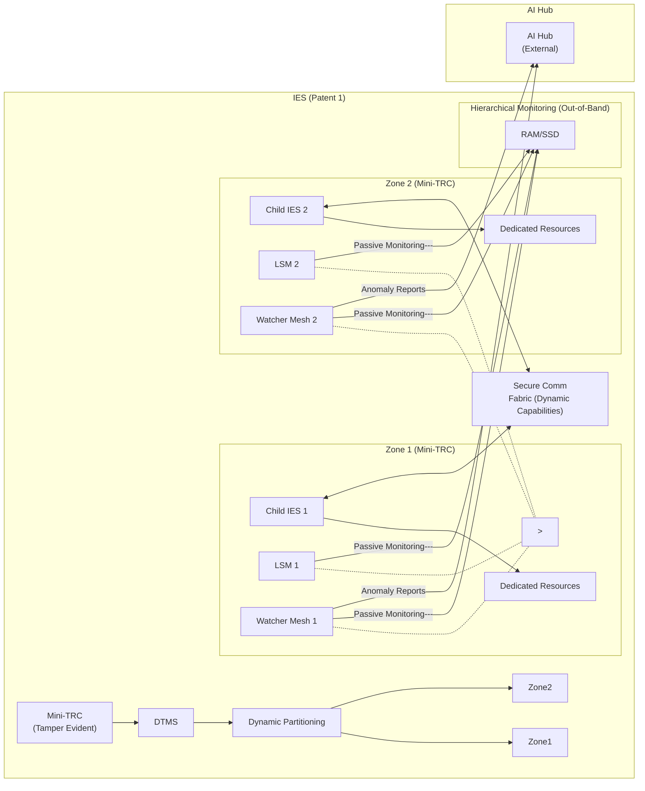
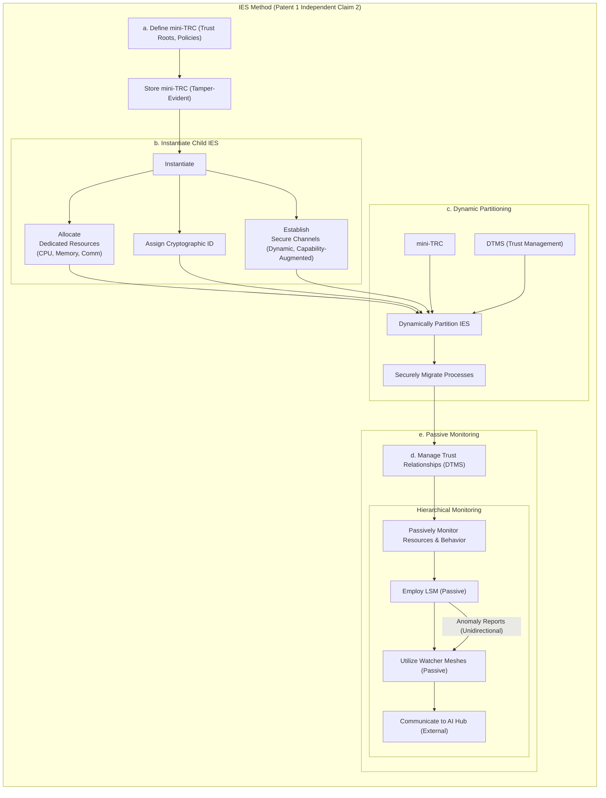

**6-SecureSphere Patents Brainstorm 20241031**
Written by: Paul Lowndes <[ZeroTrust@NSHkr.com](mailto:ZeroTrust@NSHkr.com)>

## Table of Contents {#h.wnc5nakeeueb}

-   [New Claims for Patents 1&2 re: security meshes](#h.eqvjajrepou7)
    -   [P1 Claim 1new:](#h.j2ssh9fmzlg7)
    -   [Patent 1:  Modular Isolated Execution Stacks with Hierarchical Zones, Decentralized Trust Management, and Capability-Based Inter-Component Communication](#h.rtt2aks4lir)
    -   [Claim 1:](#h.6u3z8f3udcbx)
    -   [Claim 2:](#h.tzsfdxdr9o6x)
    -   [P2 Claim 1new:](#h.tjpteupgxqo3)
    -   [P2 Claim 2new:](#h.xjv42s1d9y4d)
    -   [Rewritten Claim 1 (Decentralized Enforcement):](#h.kbsvsyeorcy9)
    -   [Rewritten Claim 2 (Hybrid Enforcement):](#h.5rwtvm6f9bhp)
    -   [P2 Claim 3new:](#h.8qm6rq92a2b)
    -   [Claim 1: Secure UI Monitoring and Contextual Analysis within an Isolated Execution Environment](#h.9wr4h6n6sk5r)
    -   [Claim 2:  Secure and Verifiable AI Agent Update Mechanism within an Isolated Execution Environment](#h.97zo2yaxlpll)
    -   [Claim 3: Consensus-Driven Security Orchestration with an AI Agent](#h.7ejx4du5fgmm)
-   [NEW CLAIMS FOR UI PATENT 11](#h.dfqmxiqcvyq9)
    -   [NEW AI AGENT PATENT](#h.ki215l2sykgf)
-   [NEW Patent P36: Secure and Adaptive Onboard AI Agent for Multi-Kernel Architectures](#h.msnsowqfk6wk)
-   [NEW claim for PATENT xx  Dynamically Reconfigurable Trust Zones based on Real-Time Threat Assessment](#h.flu1uvij583h)
-   [NEW claim for PATENT xx : AI-Driven Predictive Security Policy Generation and Deployment](#h.1a2ukk8k7e7w)
-   [NEW PATENT 37: System and Method for Secure UI Interaction Auditing with Tamper-Evident Data Lineage](#h.6rdzrnr5tbcl)
-   [ADDITIONAL INFO:](#h.9txonj85a0r4)
    -   [BRAINSTORM 20 NEW IDEAS FOR SECURESPHERE:](#h.us7xiggd8qv1)
    -   [BRAINSTORM 10 MORE IDEAS FOR SECURESPHERE](#h.7r91lhb2huwn)
    -   [Provisional Patent 30 Application: Title: System and Method for Verifying the Authenticity and Integrity of Raster Content using a Spatiotemporal Digest](#h.m75rkcptb6qh)
    -   [INTEGRATION WITH SECURESPHERE](#h.8icvm3clmgz0)

# New Claims for Patents 1&2 re: security meshes {#h.eqvjajrepou7}

Based on your provided text and diagrams for the Security Mesh, here are three novel independent claims, assigned to either Patent 1 or Patent 2:

## P1 Claim 1new: {#h.j2ssh9fmzlg7}

A method for **enhancing security within a modular isolated execution stack (IES)** comprising a plurality of child IES instances, each child IES instance having dedicated processing, memory, and communication resources, the method comprising:

a. **passively monitoring**, by a Local Security Mesh (LSM), resource access patterns of said child IES instances, said monitoring performed out-of-band and without direct interaction with said resources, wherein said resource access patterns include at least one of: memory access patterns, storage access patterns, or peripheral device access patterns;

b. **analyzing, by a Watcher Mesh**, said resource access patterns for anomalies indicative of potential security threats, wherein said Watcher Mesh receives anomaly reports from said LSM via a unidirectional communication channel, preventing a compromised LSM from sending malicious instructions to said Watcher Mesh; and

c. **communicating, by said Watcher Mesh**, detected anomalies to a central analysis hub (AI Hub) via a bidirectional communication channel for further investigation and response coordination, wherein said AI Hub is logically and physically separated from said IES and said LSM, enhancing security and resilience against compromise.

You're seeking to refine the core claim of Patent 1, the foundation of SecureSphere. This requires careful consideration of what constitutes true novelty.

**Review of Patent 1 Claim 1 and Proposed Claim 1new:**

The current Patent 1 Claim 1 focuses on the structural elements of the IES, including hierarchical zones, mini-TRCs, dynamic partitioning, and capability-based communication.  The proposed `P1 Claim 1new` shifts the focus to the *method* of enhancing security within an IES, emphasizing passive monitoring by the LSM and Watcher Mesh.

**Categorization of Insights (Novel vs. Not Novel):**

-   **Novel:**
    -   **Hierarchical, out-of-band monitoring architecture:** The layered approach with LSM and Watcher Mesh, operating passively and out-of-band, is a significant innovation in security monitoring.
    -   **Passive Monitoring by LSM:** The LSM's ability to passively monitor resource access *without* direct interaction is novel and enhances security.
    -   **Unidirectional Communication (LSM to Watcher Mesh):**  This unidirectional communication protects the Watcher Mesh from a potentially compromised LSM.
    -   **Independent Analysis Hub:** The separation of the AI Hub from the IES and LSM increases resilience.

-   **Not Novel (Already Covered or Implied):**
    -   Dedicated resources for child IES instances: This is inherent in the concept of an IES and is already covered in the current claim.
    -   Secure communication between child IES instances:  While important, this is already addressed by the capability-based communication aspects of the existing claim.
    -   Dynamic partitioning:  Covered in the current claim.
    -   Resource management: Also present in the current claim.

## Patent 1:  Modular Isolated Execution Stacks with Hierarchical Zones, Decentralized Trust Management, and Capability-Based Inter-Component Communication {#h.rtt2aks4lir}
## Claim 1: {#h.6u3z8f3udcbx}

A secure computing system comprising a plurality of Modular Isolated Execution Stacks (IES), each IES comprising:

a. a hierarchy of Zones, each Zone associated with a localized Trust Root Configuration (mini-TRC) defining trust roots and policies, wherein said mini-TRC is stored on a tamper-evident storage medium;

b. a plurality of child IES instances, each associated with a Zone and comprising dedicated processing, memory, and communication resources, and a unique, cryptographically verifiable identifier;

c. a secure communication fabric between said child IES instances, including dynamically reconfigurable, capability-augmented communication channels;

d. a dynamic partitioning mechanism for securely managing child IES instances and their resources based on workload demands, security requirements, and trust policies; and

e. a hierarchical, out-of-band security monitoring system comprising: i. a Local Security Mesh (LSM) passively monitoring resource access patterns of child IES instances without direct interaction, enabling compromise resilience; ii. a plurality of Watcher Meshes, each associated with an LSM, passively monitoring said LSM and its associated child IES instances, receiving anomaly reports from said LSM via unidirectional channels; and iii. a central analysis hub (AI Hub), logically separated from said IES and LSM, receiving anomaly reports and analysis from said Watcher Meshes via bidirectional channels for investigation and response coordination.

Diagram for Claim 1:



<!-- h2 with image removed as per instruction to use inline mermaid -->

Description of Diagram for Claim 1:

-   **IES (Patent 1):** Represents the main IES instance, containing Zones and child IES instances.
-   **Zone 1 & Zone 2 (Mini-TRC):** Illustrates the hierarchical Zones within the IES. Each zone has its own mini-TRC for local trust and policies, stored on tamper-evident media.
-   **Child IES 1 & 2:**  Represent the isolated execution environments with dedicated resources.
-   **Dedicated Resources:** Represents dedicated processing, memory, and communication resources assigned to each child IES.
-   **Secure Comm Fabric (Dynamic Capabilities):** Illustrates the capability-augmented communication channels between child IES instances.  Dynamic reconfiguration is implied by the "(Dynamic Capabilities)" label.
-   **Dynamic Partitioning:**  Represents the dynamic partitioning mechanism managed by the DTMS and influenced by Mini-TRCs.  This system adjusts child IES configuration and performs migrations between child IES instances while still adhering to local mini-TRC based policy enforcement. The dotted lines to Zone 1 and Zone 2 emphasize the effect on dynamic resource allocation for running tasks as it reallocates resources based on various factors.
-   **Hierarchical Monitoring (Out-of-Band):** Shows the out-of-band monitoring system.
    -   **LSM 1 & 2:** Passively monitor resource access patterns.  The dashed lines indicate they do not interfere directly with operations or other data channels, similar to Apple Intelligence, while still receiving context from these for use in their security and compliance checks.  We may integrate hardware modifications later so passive out of band channels such as RF sensors observing the electromagnetic changes caused by current through circuits during computations at high speed may inform the Local Security Mesh further by providing the LSMs additional real-time awareness about what is occuring from lower hardware levels directly.
    -   **Watcher Mesh 1 & 2:**  Passively monitor the LSMs and child IES instances. They also passively monitor access to system resources. They receive anomaly reports via unidirectional channels from the LSMs. They then transmit this data over a secure, encrypted, and authenticated data stream (e.g. VPN with quantum entanglement key exchange encryption) out of band to the AI Hub for additional processing using a specific subset of ports on the associated SecureSphere device.
    -   **AI Hub (External):** Receives reports and performs analysis. It is logically separate from the IES and LSMs.
-   **DTMS:**  Represents the Dynamic Trust Management System, influencing dynamic partitioning.
-   **Mini-TRC:** Shows that policies defined by mini-TRCs impact DTMS processes, thus informing resource management.

## Claim 2: {#h.tzsfdxdr9o6x}

A method for enhancing security in a computing environment using a plurality of Modular Isolated Execution Stacks (IES), each comprising a hierarchy of Zones and a plurality of child IES instances, the method comprising:

a. defining, for each Zone within an IES, a localized Trust Root Configuration (mini-TRC) specifying trust roots and security policies, and storing said mini-TRC on a tamper-evident storage medium;

b. instantiating a plurality of child IES instances, each associated with a Zone and comprising: i. allocating dedicated processing, memory, and communication resources to each child IES instance; ii. assigning a unique, cryptographically verifiable identifier to each child IES instance; and iii. establishing secure communication channels between child IES instances using dynamically configurable, capability-augmented protocols;

c. dynamically partitioning said IES into said child IES instances based on real-time workload demands, security requirements, and trust policies defined in said mini-TRCs, securely migrating active processes between child IES instances while maintaining isolation and resource integrity;

d. managing trust relationships between child IES instances and across Zones using a Dynamic Trust Management System (DTMS), said DTMS utilizing said mini-TRCs, cryptographic identity verification, and dynamic trust metrics derived from observed behavior and declared security posture; and

e. passively monitoring resource access patterns and system behavior of said child IES instances and associated system resources using a hierarchical, out-of-band security monitoring system comprising: i. employing a Local Security Mesh (LSM) for each IES to monitor resource access patterns without direct interaction, enhancing compromise resilience and enabling detection of anomalies indicative of security threats; ii. utilizing a plurality of Watcher Meshes, each associated with an LSM, to passively monitor said LSM and its corresponding IES, receiving anomaly reports from said LSM via unidirectional communication channels, preventing compromised LSMs from influencing Watcher Meshes; and iii. communicating, by said Watcher Meshes, detected anomalies and security telemetry to a central analysis hub (AI Hub), logically separated from said IES and LSM, for further investigation and coordinated response.

Diagram for Claim 2:



Description for Diagram 2:

(See Independent Method Claim 2)

## P2 Claim 1new: {#h.tjpteupgxqo3}

A system for **decentralized security enforcement** within a computing environment comprising a plurality of Isolated Execution Stacks (IES), each IES having a Local Security Mesh (LSM), the system comprising:

a. a **plurality of Watcher Meshes**, each Watcher Mesh associated with an LSM and configured to receive anomaly reports from said LSM via a unidirectional communication channel;

b. a **distributed Consensus Engine**, logically separated from said IES and LSM, said Consensus Engine **receiving anomaly analysis** and **recommended actions** from a central analysis hub (AI Hub) and said Watcher Meshes; and

c. a **decentralized enforcement mechanism**, wherein said Consensus Engine uses a distributed consensus protocol to determine and disseminate enforcement actions to said LSMs, enabling independent enforcement by each LSM based on the consensus decision and preventing a compromised AI Hub or Watcher Mesh from unilaterally enforcing actions.

## P2 Claim 2new: {#h.xjv42s1d9y4d}

A system for **hybrid security enforcement** within a computing environment comprising a plurality of Isolated Execution Stacks (IES), each IES having a Local Security Mesh (LSM), the system comprising:

a. a **plurality of Watcher Meshes**, each Watcher Mesh associated with an LSM and configured to receive anomaly reports from said LSM via a unidirectional communication channel;

b. a **central analysis hub (AI Hub)** receiving anomaly analysis from said Watcher Meshes and generating recommended actions, wherein said AI Hub communicates with a central management entity (SecureSphere Hub);

c. a **staged enforcement mechanism** comprising:

  i. a **limited action set,** wherein said AI Hub can directly instruct said Watcher Mesh to perform limited, pre-approved actions; and

  ii. a **critical action set**, wherein for critical actions, said AI Hub sends recommended actions to said SecureSphere Hub, which evaluates said actions against pre-defined policies and trust levels before issuing enforcement commands to said LSMs, limiting the AI Hub’s direct control and enhancing security.

## Rewritten Claim 1 (Decentralized Enforcement): {#h.kbsvsyeorcy9}

A security monitoring system for a computing environment with multiple Isolated Execution Stacks (IES), each having a dedicated Local Security Mesh (LSM), the system comprising:

a. a hierarchical, out-of-band monitoring architecture including LSMs passively monitoring resource access patterns without direct interaction, Watcher Meshes passively monitoring LSMs and their associated IES while receiving anomaly reports from LSMs via unidirectional channels, and a Master Security Mesh (MSM) receiving aggregated reports from Watcher Meshes; and

b. a distributed Consensus Engine, separate from IES and LSMs, receiving anomaly analysis from a central AI Hub *and* Watcher Meshes, using a distributed consensus protocol to determine and disseminate enforcement actions to LSMs via unidirectional channels, preventing unilateral actions by compromised components.

## Rewritten Claim 2 (Hybrid Enforcement): {#h.5rwtvm6f9bhp}

A security monitoring system for a computing environment with multiple Isolated Execution Stacks (IES) each having a dedicated Local Security Mesh (LSM), the system comprising:

a. a hierarchical, out-of-band monitoring architecture including LSMs passively monitoring resource access patterns without direct interaction, Watcher Meshes passively monitoring LSMs and their associated IES while receiving anomaly reports from LSMs via unidirectional channels and communicating them to a central AI Hub and Master Security Mesh (MSM), and the MSM distributing security policies and updates to LSMs unidirectionally; and

b. a hybrid enforcement mechanism with a closed-loop pathway for the AI Hub to instruct Watcher Meshes to perform limited, non-disruptive actions, and an open-loop pathway where, for critical actions, the AI Hub sends recommendations to a SecureSphere Hub, which evaluates them against predefined policies and DTMS trust levels before issuing enforcement commands to LSMs, thereby limiting the AI Hub’s direct control over critical actions.

## P2 Claim 3new: {#h.8qm6rq92a2b}

A **security monitoring system** for a computing environment comprising a plurality of Isolated Execution Stacks (IES), each IES associated with a dedicated Local Security Mesh (LSM), the system comprising:

a. a **hierarchical, out-of-band monitoring architecture**, comprising:

  i. said LSMs passively monitoring resource access patterns of respective IES instances and associated system resources, said monitoring performed without direct interaction with said resources, enabling compromise resilience and enhanced system stability;

  ii. a **plurality of Watcher Meshes**, each Watcher Mesh **associated with an LSM** and **configured to**:

      1. **passively monitor said LSM** and its associated IES instance, mirroring said LSM’s passive monitoring of resources and providing a second layer of independent oversight;

      2. **receive anomaly reports** from said LSM via a unidirectional communication channel, preventing compromised LSMs from influencing said Watcher Mesh; and

      3. **communicate anomaly reports** and analysis to a central analysis hub (AI Hub) and a Master Security Mesh (MSM);

  iii. said MSM **receiving aggregated anomaly reports** from said Watcher Meshes and distributing security policies and updates to said LSMs via unidirectional communication channels, preventing compromised LSMs from propagating malicious instructions; and

b. a **hybrid enforcement mechanism comprising**:

  i. a **closed-loop pathway for limited actions**, wherein said AI Hub can directly instruct said Watcher Meshes to perform a pre-defined set of limited, non-disruptive actions within their associated IES instances, enabling rapid response to low-risk anomalies; and

  ii. an **open-loop pathway for critical actions**, wherein said AI Hub communicates recommendations for critical actions to a central management entity (SecureSphere Hub), which evaluates said recommendations against pre-defined policies and trust levels derived from a Dynamic Trust Management System (DTMS) before issuing enforcement commands to said LSMs, limiting the AI Hub’s direct control over high-impact actions and enhancing security.

**Rationale for Assigning to Patent 2:**

This claim focuses on the *interaction and communication* between various security components (LSMs, Watcher Meshes, MSM, AI Hub, SecureSphere Hub). This aligns with Patent 2's focus on inter-IES communication and adaptive security.  While the LSM is mentioned, the claim's emphasis is on the overarching system and the communication pathways, not the internal workings of an individual IES.  The claim also explicitly addresses the hybrid enforcement mechanism (closed-loop and open-loop), which is a key innovation in mitigating feedback loop vulnerabilities.  The hierarchical and out-of-band nature are also features detailed in Patent 2's specifications.

**Detailed Analysis of the Diagram and its Relationship to the Claim:**

The diagram provides a visual representation of the claim's elements:

-   **Hierarchical, Out-of-Band Monitoring:** The layered structure of IES, LSM, Watcher Mesh, and MSM, with their passive, read-only data plane connections to RAM/SSD, clearly illustrates the hierarchical, out-of-band monitoring architecture.
-   **Unidirectional Communication for Security:** The one-way control plane connections from Watcher Mesh to LSM and from MSM to LSM demonstrate the principle of unidirectional communication for enhanced security.
-   **Bidirectional Communication for Analysis:** The bidirectional control plane connections between Watcher Mesh and AI Hub enable detailed reporting and instruction exchange for analysis and response coordination.
-   **Centralized Analysis and Policy Distribution:** The AI Hub and MSM serve as central points for anomaly analysis and security policy distribution, respectively.
-   **Implicit Hybrid Enforcement:** While not explicitly shown, the diagram's structure implies the hybrid enforcement mechanism. The AI Hub's connection to the Watcher Mesh enables closed-loop limited actions, while the presence of the MSM suggests an open-loop pathway for critical actions via the SecureSphere Hub (not shown in this specific diagram but referenced in the claim).

This claim, informed by a thorough analysis of the diagram, aims to comprehensively capture the novel aspects of the Security Mesh architecture and its integration within the SecureSphere system.  By addressing both the monitoring architecture and the hybrid enforcement mechanism, the claim strengthens the patent's protection of this key innovation.

## Claim 1: Secure UI Monitoring and Contextual Analysis within an Isolated Execution Environment {#h.9wr4h6n6sk5r}

A system for **secure user interface (UI) monitoring and analysis** within a secure computing environment, comprising:

a. an **isolated execution environment (IES)** hosting an AI agent, said IES providing hardware-enforced isolation from other system components, including said UI;

b. a **UI monitoring module** configured to passively observe user interactions with said UI via a unidirectional communication channel, preventing said AI agent from directly manipulating said UI;

c. a **data sanitization and filtering module** within said IES receiving data from said UI monitoring module, removing potentially malicious or sensitive information before providing said data to said AI agent; and

d. a **contextual analysis engine** within said IES, said engine processing sanitized UI interaction data, correlating said data with system events and security telemetry, and generating contextualized alerts and recommendations, enhancing security by incorporating user context into anomaly detection and threat analysis.

## Claim 2:  Secure and Verifiable AI Agent Update Mechanism within an Isolated Execution Environment {#h.97zo2yaxlpll}

A method for **securely updating an AI agent** operating within an isolated execution environment (IES), the method comprising:

a. **receiving a digitally signed update package** via a secure communication channel;

b. **verifying the digital signature** of said update package and its integrity using a trust root configuration (TRC);

c. **creating an isomorphic model** of the target system within a sandboxed environment within said IES, said isomorphic model reflecting the structure, communication patterns, and functionalities of the system without exposing sensitive data;

d. **validating** said update package within said sandboxed environment using said isomorphic model, generating validation results; and

e. **conditionally installing** said update package within said IES based on said validation results, wherein a rollback mechanism is provided to revert to a previous version of said AI agent in case of failure or security violations, preserving system integrity and availability.

## Claim 3: Consensus-Driven Security Orchestration with an AI Agent {#h.7ejx4du5fgmm}

A system for **security orchestration** within a secure computing environment, comprising:

a. a master security mesh (MSM) **monitoring system events** and generating security alerts;

b. an AI agent operating within an isolated execution environment (IES), **receiving security alerts** from said MSM and user interaction data from a secure UI monitoring module;

c. a plurality of AI modules within said AI agent, each AI module **independently analyzing data** from a respective source and proposing security actions, said sources including at least one of: system events, user behavior, threat intelligence feeds, or audit logs;

d. a consensus engine, logically separated from said MSM and AI agent, **receiving proposed security actions** from said AI modules and using a distributed consensus protocol to determine a final security action, enhancing security by preventing any single compromised AI module from unilaterally enforcing potentially disruptive actions; and

e. a response system **executing** said **final security action**, said response system comprising at least one of: an isolator for isolating compromised components, a self-healer for restoring system integrity, or a resource manager for adjusting resource allocation.

**Preliminary Novelty Assessment and Rationale:**

These claims address novel aspects of SecureSphere's AI agent integration:

-   **Claim 1:** Focuses on the *secure and unidirectional* UI monitoring, protecting the AI agent from UI manipulation while allowing it to leverage user context for enhanced security analysis.  This combination of unidirectional data flow and contextual analysis within an isolated environment is a novel security approach.
-   **Claim 2:** Highlights the secure update mechanism with *isomorphic model validation* within a sandboxed IES.  This approach allows for rigorous testing of updates without exposing the live system to potential risks, enhancing security and reliability while also addressing concerns related to AI model validation with sandboxing and secure, auditable rollback capabilities.
-   **Claim 3:** Emphasizes the *consensus-driven orchestration* mechanism, mitigating the risk of a compromised AI agent by requiring consensus among multiple AI modules before executing critical security actions.  This distributed consensus approach enhances resilience and trustworthiness, improving both security and the potential for formal verification testing.

# NEW CLAIMS FOR UI PATENT 11 {#h.dfqmxiqcvyq9}

Patent 11:  **Secure UI Subsystem with Hierarchical Isolation, Unidirectional Communication, and Consensus-Driven Security Orchestration**

**Secure UI Subsystem with Hierarchical Isolation, Enhanced Security Update Mechanism, and Decentralized Security Orchestration**

**Revised Abstract:**

This invention introduces a secure UI subsystem with hierarchical isolation, unidirectional communication, and consensus-driven security orchestration. The dedicated UI Kernel operates in complete hardware isolation, with a secure communication bus enforcing unidirectional data flow from IES instances to the UI Kernel, preventing reverse communication attacks. A multi-region display buffer with dynamically adjustable trust levels, governed by declarative policies and enforced by a hardware Display Validation Module, enhances security and supports flexible UI rendering.  Hardware-enforced control-flow integrity (CFI) protects the UI Kernel's execution flow. A dedicated TRC and Policy Engine provide granular control over UI security.  A Secure UI Integration Module facilitates communication with the SecureSphere Hub, using SIZCF for inter-zone communication and supporting remote attestation.  A secure AI agent update mechanism, using isomorphic model validation within a sandboxed environment and a secure rollback capability, ensures the integrity of the AI agent.  Consensus-driven security orchestration, using multiple AI modules and a consensus engine logically separated from the MSM and AI agent, enhances security and prevents unilateral actions by potentially compromised components. A response system executes the consensus decision, providing isolation, self-healing, and resource management capabilities.

**Claims:**

1.  A secure user interface (UI) system for a computing environment comprising a plurality of Modular Isolated Execution Stacks (IES) organized into a hierarchy of Zones, each Zone associated with a Trust Root Configuration (TRC) stored on a decentralized, tamper-proof ledger, the UI system comprising:

    a. a dedicated UI Kernel operating in complete hardware isolation from said IES instances, said UI Kernel further comprising:

        i. a dedicated CPU and physically isolated memory with hardware-enforced segmentation, preventing unauthorized access from other components;

        ii. a secure, unidirectional, hardware-enforced communication bus connecting said IES instances to said UI Kernel, preventing reverse communication attacks and enforcing data flow control;

        iii. a multi-region display buffer, each region assigned a dynamically adjustable trust level based on the origin and sensitivity of displayed information, governed by declarative policies expressed in a policy language, wherein said policies specify permitted actions and data types for each trust level and region;

        iv. a hardware-based Display Validation Module ensuring the integrity and authenticity of content rendered within each region of said display buffer, utilizing checksums, digital signatures, or a combination thereof for each data element rendered, and further logging all validation events to a tamper-proof audit log on said decentralized ledger; and

        v. a hardware-enforced control-flow integrity (CFI) mechanism protecting the UI Kernel's execution flow from unauthorized modification or hijacking, said CFI mechanism integrated with access control policies based on program execution states and dynamically updated based on trust levels of interacting IES instances;

    b. a Trust Root Configuration (TRC) specific to said UI Kernel, said TRC stored on said decentralized ledger and cryptographically linked to the UI Kernel’s identity, defining trust roots, trust policies, and access control rules specific to the UI Kernel and its associated Zone, wherein said TRC is verifiable by other SecureSphere components;

    c. a Policy Engine within said UI Kernel interpreting and enforcing said declarative policies, dynamically adjusting trust levels of display regions based on the origin of UI components, data sensitivity labels, real-time threat assessments, and changes propagated from the SecureSphere Hub, and controlling access to UI resources based on a combination of trust levels, dynamically issued capabilities (Patent 2), and TRC policies; and

    d. a Secure UI Integration Module facilitating secure communication between the UI Kernel and the SecureSphere Hub, leveraging the Secure Inter-Zone Collaboration Framework (SIZCF - Patent 22) for authenticated and encrypted inter-zone communication, coordinating policy updates from the SecureSphere Hub, supporting remote attestation of the UI Kernel using hardware-rooted trust mechanisms, and maintaining a session-specific audit trail on said decentralized ledger.

13. A method for securely updating an AI agent operating within an isolated execution environment (IES), the method comprising:

    a. receiving a digitally signed update package via a secure, authenticated communication channel, wherein said channel is established using mutual authentication between a trusted authority and said IES;

    b. verifying the digital signature and integrity of said update package using a trust root configuration (TRC), including checks for version compatibility and policy compliance, rejecting the update if verification fails;

    c. creating an isomorphic model of the target system within a sandboxed environment within said IES, said isomorphic model mirroring the structure, communication patterns, and functionalities of the target system, including security policies and trust relationships, without exposing sensitive data or live system connections;

    d. validating said update package within said sandboxed environment using said isomorphic model, generating detailed validation results that are logged to a tamper-proof audit trail; and

    e. conditionally installing said update package within said IES based on said validation results and authorization from a central management entity, wherein a secure rollback mechanism is provided to revert to a previous, validated version of said AI agent in case of failure or security violations, ensuring system integrity and availability, and wherein all update and rollback actions are logged to a tamper-proof audit trail.

20. A system for consensus-driven security orchestration within a secure computing environment, comprising:

    a. a master security mesh (MSM) monitoring system events, aggregating security telemetry from local security meshes (LSMs) associated with isolated execution environments (IES), and generating security alerts based on pre-defined rules, anomaly detection patterns, and threat intelligence feeds;

    b. an AI agent operating within an isolated execution environment (IES), receiving security alerts from said MSM and user interaction data from a secure UI monitoring module via a unidirectional communication channel, wherein said UI monitoring module passively observes user interactions without influencing said UI;

    c. a plurality of diverse AI modules within said AI agent, each AI module independently analyzing data from a respective source (including system events, user behavior, threat intelligence feeds, and/or audit logs) and proposing security actions, wherein said AI modules employ diverse analytical techniques and algorithms, and wherein the trustworthiness of each AI module is dynamically assessed based on its performance, accuracy, and adherence to pre-defined security policies;

    d. a consensus engine, logically and physically separated from said MSM and AI agent and operating within a trusted execution environment, receiving proposed security actions from said AI modules, dynamically weighting said actions based on trustworthiness, and using a distributed consensus protocol to determine a final security action; and

    e. a response system executing said final security action after authorization from a central management entity (SecureSphere Hub), said response system comprising:

        i. an isolator for securely isolating compromised components, including network segmentation, capability revocation, and IES termination;

        ii. a self-healer for restoring system integrity through automated rollback mechanisms, software updates, and reconfiguration of affected components; and

        iii. a resource manager for dynamically adjusting resource allocation to support isolation and self-healing actions, minimizing disruption to other system processes.

## NEW AI AGENT PATENT {#h.ki215l2sykgf}

# NEW Patent P36: Secure and Adaptive Onboard AI Agent for Multi-Kernel Architectures {#h.msnsowqfk6wk}

**Abstract:** This invention discloses a secure and adaptive onboard AI agent for enhancing security within a multi-kernel computing architecture, such as SecureSphere. The AI agent operates within a hardware-isolated execution environment (IES), ensuring its integrity and protection against compromise.  A secure UI monitoring module passively observes user interactions, providing context for the AI agent's analysis without allowing the agent to manipulate the UI.  The AI agent integrates with SecureSphere components (DTMS, MSM, AESDS, Decentralized Ledger) through secure communication channels and capability-based access control, receiving security telemetry, trust information, and software updates. A local LLM engine, securely storing model weights and managing context, provides AI capabilities within the isolated environment. A secure API allows controlled access to the AI agent's functionalities by other SecureSphere components. Optional integration with Federated Learning and external systems expands the agent's potential applications. This architecture provides a robust and adaptive AI-powered security enhancement, protecting user privacy, ensuring system integrity, and enabling dynamic adaptation to evolving threats.

**Claim 1:** A secure onboard AI agent system for a multi-kernel computing architecture comprising a plurality of Isolated Execution Stacks (IES), a Dynamic Trust Management System (DTMS), a Master Security Mesh (MSM), and an Automated Evolutionary Software Development System (AESDS), the AI agent system comprising:

a. a dedicated IES instance for hosting said AI agent, providing hardware-enforced isolation from other system components and the external network;

b. a secure UI monitoring module within said IES, passively observing user interactions with a Secure UI Kernel via a unidirectional communication channel, capturing user input, UI state, and system events without influencing said UI;

c. a local Large Language Model (LLM) engine within said IES, comprising: i. secure model storage for encrypting and storing LLM model weights; ii. an inference engine for executing said LLM model; iii. a tokenizer for preprocessing text input; and iv. a context management module for maintaining conversation context and history;

d. a set of SecureSphere integration modules within said IES, comprising: i. a DTMS integration module for receiving trust information and policy updates from said DTMS via secure communication channels and dynamically adjusting the agent’s behavior based on said trust information; ii. an MSM integration module for receiving security alerts and anomaly reports from said MSM via unidirectional communication channels; iii. an AESDS integration module for securely receiving and applying software updates and patches for said AI agent and LLM engine; and iv. a Decentralized Ledger integration module for securely logging agent activity and API interactions to a tamper-proof audit trail;

e. a secure API within said IES, enabling controlled access to said AI agent’s functionalities by other SecureSphere components via capability-based access control; and

f. an Aggregation and Processing Hub, external to said IES but within the secure computing architecture, securely receiving outputs from said AI agent via said secure API, correlating said outputs with data from other SecureSphere components, and disseminating results to authorized components and users via secure communication channels, wherein access to said results is controlled by capability-based access control.

**Claim 2:** A method for enhancing security in a multi-kernel computing architecture using an onboard AI agent, the method comprising:

a. passively monitoring user interactions with a Secure UI Kernel within a dedicated, isolated execution environment (IES) using a unidirectional communication channel;

b. processing the monitored UI interactions with a local Large Language Model (LLM) engine within said IES, leveraging context and SecureSphere-specific knowledge;

c. generating insights, recommendations, or security actions based on the processed UI interactions and other SecureSphere telemetry received via secure integration modules;

d. securely communicating the generated outputs to an Aggregation and Processing Hub via a secure API within said IES; and

e. correlating the AI agent's outputs with data from other SecureSphere components within said Hub and disseminating the results to authorized components and users via secure communication channels.

**Assessment of Claims:**

-   **Claim 1 (System Claim):** This claim comprehensively covers the *structure* of the AI agent system, addressing all core design principles:
    1.  **IES Isolation:** Explicitly stated in (a).
    2.  **Secure Communication:** Covered by the integration modules in (d) and the secure API in (e).
    3.  **DTMS Integration:** Addressed by the DTMS integration module in (d).
    4.  **Capability-Based Access Control:**  Mentioned in (e) and (f).
    5.  **UI Monitoring:** Detailed in (b), emphasizing unidirectional communication.
    6.  **LLM Engine:**  Specifically described in (c).
    7.  **Input Sanitization:** Implicitly covered by the UI monitoring module and LLM Engine's processing within the secure IES.
    8.  **Session Monitoring:**  Covered by the MSM integration module in (d) and implied by the overall secure architecture.  Also, note that this claim adds the Aggregation and Processing Hub (f), a critical component not fully detailed before.

-   **Claim 2 (Method Claim):**  This claim focuses on the *method* of using the AI agent, covering the key steps involved:
    1.  **Passive UI Monitoring:** (a)
    2.  **LLM Processing:** (b)
    3.  **Insight Generation:** (c)
    4.  **Secure Communication:** (d)
    5.  **Correlation and Dissemination:** (e)

# NEW claim for PATENT xx  Dynamically Reconfigurable Trust Zones based on Real-Time Threat Assessment {#h.flu1uvij583h}

Let's devise two novel, robust independent method claims for SecureSphere, focusing on addressing potential gaps and inspiring new architectural diagrams.

**Claim 1:  Dynamically Reconfigurable Trust Zones based on Real-Time Threat Assessment**

A method for dynamically reconfiguring trust zones within a secure computing system comprising a plurality of Isolated Execution Stacks (IES) and a Dynamic Trust Management System (DTMS), the method comprising:

a. Continuously monitoring system events, network traffic, and user behavior within each IES using a combination of hardware and software sensors;

b. Analyzing the monitored data using an AI-powered threat assessment engine to identify potential security risks and assign dynamic trust scores to each IES;

c. Adapting trust zone boundaries in real-time based on the dynamic trust scores, wherein an IES can dynamically join or leave a trust zone based on its assigned trust score, enforcing appropriate access controls and security policies based on the dynamic trust zones;

d. Recording all trust zone changes and related security events on a distributed immutable ledger, ensuring auditability and transparency, wherein each trust zone maintains an isolated audit log;

e. Triggering re-attestation of IES instances joining a new trust zone based on dynamic trust configuration thresholds, said re-attestation including the creation of tamper-evident microstructures logged to said immutable ledger to ensure provenance tracking and provenance analysis during or after these attestation attempts; and

f. Providing user notifications through an out-of-band channel that can be disconnected, with user-configurable notification policies defining types and severity levels of events to notify users about trust zone changes or other information, wherein sensitive notifications containing potential secrets undergo AI-driven redaction (Patent P35) and other sanitization methods based on policy before being presented, with user notifications being ephemeral or archived within secure enclaves.

-   **Novelty Focus:** This claim introduces *dynamic* trust zones that adapt based on real-time threat assessments.  This differs from SecureSphere's current static zones, adding a new layer of proactive, adaptive security. The integration with user notification system enhancements, out-of-band channels, secure logging, policy controls, and sensitive notification filtering further addresses user experience, data sovereignty and trust related to transparency, further enhancing the security and applicability of this innovation. The connection to microstructures during attestations enhances security further and extends the usage and applicability of microstructure security into another relevant SecureSphere scenario and component.

# NEW claim for PATENT xx : AI-Driven Predictive Security Policy Generation and Deployment {#h.1a2ukk8k7e7w}

A method for proactive security policy management in a multi-kernel computing environment comprising a plurality of Isolated Execution Stacks (IES) and a Dynamic Trust Management System (DTMS), the method comprising:

a. Monitoring runtime security parameters, including software attestation logs (Patent P33), resource utilization reports, communications analysis, user activity, intrusion detection triggers, threat intelligence, resource conflicts (Patent P9), capability and consent denials (Patent P2), UI rendering analysis (Patent P11), hardware health diagnostics (Patent P7), memory protection logs, network firewall (P3) event triggers, secure data storage access logs (P24), zone transitions (P22), security configuration validation data, resource sharing negotiations (Patents P1, P9), trust establishment and violation attempts (P4), system audit logs, model validations and training (Patents P16, P19, P20), network intrusions and denial of service (DOS) attempts, AI security alerts and predictions (Patents P2, P7, P15), user- and entity behavior analytics, external authentication and authorization records, application state and environment metadata, policy status and conflicts (Patent P15), or key management logs (P27, P28, P29);

b. Generating a vector embedding for the collected monitoring parameters;

c. Employing a predictive AI model, trained offline on labeled historic security incidents or system simulations (with attack simulations), to anticipate potential threats and security policy needs by receiving and processing the parameter vector;

d. Synthesizing declarative security policies within isolated execution stacks (IES) and secure execution enclaves, expressing policies in a domain-specific language (DSL);

e.  Deploying synthesized security policies, validated and verified through isomorphic validation against synthesized simulated scenarios, leveraging capabilities to restrict distribution and modification;

f. Using policy voting from federated zones, where each node with existing and new policies for overlapping context vote based on policies’ weights;  g. Providing an API to query security incident predictions, expected risks, policy justification, recommended configurations, simulated outcomes, threat level trends, validation report details, policy coverage status, model training specifics, network and zone statistics, key strength predictions (based on observed attempted intrusions and patterns analysis on known breaches, AI predictions, entropy level, etc.),  hardware performance or stability forecasts; and

h. Receiving policy review or policy change suggestions for human override of automatically generated policies based on individual trust weights for security review committee for specific policy domains and for groups and committees across domains where overlaps exists.

-   **Novelty Focus:**  This claim proposes the innovative use of predictive AI to synthesize declarative security policies automatically and securely deploy these policies through existing components in SecureSphere, validated via simulated attack and incident scenarios within virtual contexts on a zone. Furthermore, this new system ties security policy configuration management through distributed voting on existing and newly proposed policies.  The concept of vectorizing a comprehensive range of current and logged information within SecureSphere also serves as a solid addition for the claim and informs additional enhancements, which can in turn lead to additional claims and patents, in and of themselves.  It creates a more generalized and holistic system level understanding that AI is able to understand at high-speed with minimal computing overhead due to the nature of linear matrix-based computational optimizations now being built-in from hardware in silicon for recent AI algorithms in leading edge platforms. Furthermore, we anticipate threats and adapt by having the system make changes dynamically using the best insights and reasoning from various available sources, enhancing user trust of AI security within the system.

Both of these new claims center around novel method-based strategies for security enhancements for SecureSphere with hooks back to existing subsystems to more tightly couple into those capabilities, using AI and other enhancements in useful and security-centric ways while also creating a framework by which human control is present and adaptable with a variety of configuration knobs in a robust administrative dashboard.  These also inspire other new areas, such as data lineage for auditing on secure user input tracking for UI integrity over the wire and using AI, blockchain or even 3D printed audit trails where data sanitization or potentially malicious input modification occurred from the system or AI's side before showing information in UI to the user -  giving additional levels of confidence, safety and verifiable trust at any historical point of time via rapid analysis tools and technologies - another broad system enhancement for another Patent and set of patent Claims

# NEW PATENT 37: System and Method for Secure UI Interaction Auditing with Tamper-Evident Data Lineage {#h.6rdzrnr5tbcl}

You've proposed a very interesting and valuable security enhancement for SecureSphere related to UI integrity and data lineage. Here's a breakdown and how it fits into the patent portfolio:

**Concise Explanation:**

The idea is to create a tamper-proof audit trail of *all* user interactions with the Secure UI, including any modifications made by SecureSphere (sanitization, filtering, etc.). This audit trail would leverage AI, blockchain, or 3D microstructures to ensure integrity and verifiability, providing enhanced transparency and trust.  This would allow for detailed forensic analysis of UI interactions, enabling detection of malicious activity, system errors, or policy violations.

**Patent Portfolio Integration (New Patent - P37):**

**Title:** System and Method for Secure UI Interaction Auditing with Tamper-Evident Data Lineage

**Abstract:** This invention discloses a system and method for creating a secure and verifiable audit trail of all user interactions with a Secure UI within a multi-kernel computing architecture like SecureSphere. The system captures all user inputs, system modifications to those inputs, and the final rendered output, creating a complete data lineage.  This lineage is secured using a combination of AI-driven anomaly detection, blockchain technology for immutability, and/or 3D microstructures for physical tamper-evidence.  This comprehensive approach ensures the integrity and verifiability of UI interactions, enabling detailed forensic analysis, enhancing user trust, and providing robust protection against UI manipulation or data corruption.

**Claim 1:** A system for secure UI interaction auditing within a secure computing environment comprising a Secure UI Kernel and a plurality of Isolated Execution Stacks (IES), the system comprising:

a. a UI Input Capture Module within said Secure UI Kernel capturing all user inputs, including keystrokes, mouse movements, and touch events, associating each input with a timestamp and a unique identifier;

b. a System Modification Log recording any modifications made by the system to user inputs, including sanitization, filtering, and formatting, associating each modification with the corresponding input identifier;

c. a UI Output Capture Module capturing the final rendered output presented to the user by the Secure UI Kernel, associating the output with the corresponding input identifier;

d. a Data Lineage Builder correlating user inputs, system modifications, and rendered outputs using said identifiers, creating a complete, time-ordered data lineage for each UI interaction;

e. a Tamper-Evident Log storing said data lineage using at least one of: i. a distributed, immutable ledger (blockchain) recording cryptographic hashes of each element in the data lineage; ii. a 3D microstructure fabrication module generating unique physical microstructures representing cryptographic hashes of elements in the data lineage; or iii. an AI-driven anomaly detection module analyzing the data lineage for inconsistencies or deviations from expected behavior, generating alerts and logging anomalies to a secure audit log; and

f. a Secure UI Interaction Analysis Tool enabling authorized users to query and analyze the tamper-evident log, providing tools for visualizing UI interactions, reconstructing user sessions, identifying anomalies, and generating audit reports.

**Relationship to Existing Patents:**

-   **Patent 11 (Secure UI Kernel):**  This new patent builds upon Patent 11 by adding the comprehensive auditing functionality.
-   **Patent 13 (Decentralized Ledger):**  Leverages the decentralized ledger for storing the tamper-evident log.
-   **Patent 14 (3D Microstructures):**  Optionally uses 3D microstructures for physical tamper-evidence.
-   **Patent 17 (MDATS):** Integrates with MDATS for enhanced auditing and correlation with other system events.  This is especially useful for consolidating audit trails across SecureSphere.
-   **Patent P35 (Out-of-Band Error Module):**  Leverages this for redaction of sensitive user input data if necessary during forensic analysis.
-   **Patent 1 (IES) and Patent 2 (Secure Inter-IES Communication):**  The secure UI interactions occur within the context of IES and inter-IES communication, so these patents are indirectly relevant.

**Novelty:**

The novelty of Claim 1lies in the combination of:

-   **Comprehensive Data Lineage:** Capturing *all* aspects of UI interaction, including system modifications.
-   **Tamper-Evident Log:**  Using blockchain, 3D microstructures, and/or AI to secure the audit trail.
-   **SecureSphere Integration:** Leveraging existing SecureSphere components and security features.
-

**Claim 2 (Method Claim):**

A method for auditing user interactions with a Secure UI within a secure computing environment, the method comprising:

a. capturing, by a UI Input Capture Module, all user inputs presented to a Secure UI Kernel, associating each input with a timestamp and a unique identifier, wherein said inputs include at least one of: keystrokes, mouse movements, touch events, or audio input;

b. logging, by a System Modification Log, all modifications made to said user inputs by the system, including sanitization, filtering, redaction, transformation, formatting, or augmentation, associating each modification with the corresponding input identifier and a timestamp;

c. capturing, by a UI Output Capture Module, the final rendered output displayed to the user by said Secure UI Kernel, associating said output with a timestamp and the corresponding input identifier, wherein said output can include display elements and/or audio output;

d. constructing, by a Data Lineage Builder, a complete, time-ordered data lineage for each UI interaction by correlating captured user inputs, logged system modifications, and captured rendered output using said identifiers and timestamps;

e. creating a tamper-evident record of said data lineage using at least one of: i. generating a cryptographic hash of each element within the data lineage and recording said hashes on a distributed, immutable ledger; ii. fabricating a unique physical microstructure for each element within the data lineage, wherein said microstructure physically embodies a representation of a cryptographic hash of the corresponding element; or iii. analyzing said data lineage using an AI-driven anomaly detection module to detect inconsistencies or deviations from expected behavior, logging detected anomalies and generating corresponding alerts; and

f. analyzing, by an authorized user utilizing a Secure UI Interaction Analysis Tool, said tamper-evident record of the data lineage to visualize user interactions, reconstruct user sessions, perform forensic analysis, and generate audit reports, wherein said tool provides functionality to query and filter the data lineage based on user, timestamp, type of input, type of modification, or other relevant criteria, and further enabling redaction of sensitive information during forensic analysis before presenting the data to an auditor.

# NEW PATENT 38: Quantum Phase Tunneling Framework for Secure Communication and Scalable Key Recovery in Distributed Systems {#h.dg3rub46kzkx}
## Claim 1: {#h.ml6tnsg0orj1}
A system for secure communication and scalable key recovery in a distributed computing environment, comprising:

a. a Quantum Phase Tunneling Framework utilizing point-to-multipoint cascading quantum entanglements to manage transitions of secure data between quantum-protected and traditional communication channels, incorporating robust integrity checks during data transfer and optimized for efficient key recovery operations in multi-geographical network segments;

b. a Dynamic Operator-Cluster Failover Mechanism for activating backup consensus pathways and rerouting secure data during consensus breakdowns or critical failures, ensuring continuous operation and enabling rapid restoration of data flow for key recovery;

c. an Adaptive Security and Privacy Balancing Algorithm that dynamically optimizes resource allocation for quantum resources, adjusting tunnel bridging strategies according to prevailing operational conditions and projected quantum phase integration theories and dynamically balancing security, privacy and system resource constraints by adapting resource management priorities, communication parameters and entanglement strategies according to policies, trust levels and anticipated performance needs; and

d. a Transparent Cryptographic Attestation Process that generates verifiable cryptographic proofs of operational integrity from each node, monitored by distributed verifiers using a consensus protocol for real-time security validation and enhanced system trust, with all attestations securely logged to a tamper-evident, distributed immutable ledger (blockchain) and further secured through physically unclonable function (PUF) based authentication.

# NEW PATENTS / Security Ideas (maybe patents): {#h.s72uqt3qhwq}

The paper on a Modified Firefly Optimization Algorithm for intrusion detection offers intriguing ideas adaptable to SecureSphere. Here are some novel security architecture enhancements inspired by it:

1.  **Bio-Inspired Security System Orchestration:**
    -   **Concept:** Mimic natural swarm behavior (like fireflies' attraction to light) for dynamic orchestration of SecureSphere's security resources, specifically the security subsystems you conceived. Components like the AI agent, LSMs, and Watcher Meshes could dynamically adjust their focus and activity based on the "brightness" or "attractiveness" of security events, concentrating resources where they are most needed. The "brightness" could be a composite score reflecting the severity, confidence level, and potential impact of an event, allowing security responses to dynamically concentrate resources and focus actions toward threats rather than pre-configured regions or approaches.  Think of it as "security swarms" reacting dynamically and autonomously within SecureSphere, increasing its adaptive response.

2.  **Decentralized, Swarm-Based Anomaly Detection:**
    -   **Concept:**  Instead of a central Anomaly Detection Engine in the MSM, distribute the anomaly detection logic across the Watcher Meshes and have them act as a swarm. Each Watcher Mesh analyzes its local data but also communicates with neighboring Watcher Meshes, exchanging information about observed patterns and anomalies using the secure communication channels (P2,P3, P5).   This decentralized swarm approach improves resilience against compromise and might even improve efficiency by distributing the computational load without impacting effectiveness.  The collective behavior will enhance detection efficacy. This decentralization can also improve trust as more parties come to agreement and consensus, or disagreement where further human analysis becomes needed, providing increased granularity in threat identification and verification.
3.  **Health-Function-Based Intrusion Detection and Prevention:**
    -   **Concept:** Create health functions for IES instances, zones, applications, or even individual data objects.  These functions could be dynamic and customizable through policies, similar to Patent P1 but potentially leveraging 3D-printed microstructure attestation systems that may contain data that cannot be directly extracted or altered because they represent unique, computationally synthesized artifacts (from patent P17 and P14, with enhancements to how attestations work with this secure, decentralized audit trail via cross-signed validations between data objects and zones during trust establishment) as the root-level trust source. Integrate the AI agent's machine learning capabilities into assessing these health functions and providing tailored security hardening suggestions from its insights during system analysis based on user behavior.  This brings proactive, individualized risk assessments into existing components within SecureSphere.  The agent learns over time, which enhances accuracy.

4.  **Evolutionary Algorithms for Policy Optimization (Advanced AESDS):**
    -   **Concept:**  Integrate evolutionary algorithms into the AESDS (P16) to generate, validate, test and even refine more optimized and effective security policies automatically.  This approach is akin to tuning and selecting the healthiest policies based on system health scores and dynamic trust metrics rather than relying on manually defined policies or preconfigured thresholds alone, thus enhancing trust in these policies dynamically in the field when AI deems a change appropriate.

5.  **Genetically Optimized Alert Prioritization:**  The alert prioritization AI modules in our out-of-band AI Agent could leverage genetic algorithms to learn the best weighting algorithms and ranking factors for prioritization. It could use the Decentralized Ledger's audit logs and feedback from security personnel (weighted by the DTMS trust levels and a Security Ranking Engine with automated testing, policy management and voting mechanisms via a consensus-based feedback loop to AESDS for dynamic tuning of AI models based on this new context) to refine the ranking parameters, evolving with the threat landscape to enhance this novel prioritization technique.

These novel features tie back into your earlier innovations by enhancing them with nature-inspired principles and introducing more dynamic and adaptive responses to security threats. They suggest the following diagrams to incorporate these additions:

1.  ## **NEW PATENT Secure Resource Management using Health Function with Integrated attestation & Secure Distributed Log from the DLT:** **(Show network components and their dynamic security policy deployment, emphasizing hardware attestation integration with the Decentralized Ledger and security alerts)** {#h.quo95bqqsv7f}

    ```mermaid
    graph LR
        subgraph SecureSphere Network
            ZoneA[Zone A] --> NIC_A["Network Interface<br>(Zone A)"]
            ZoneB[Zone B] --> NIC_B["Network Interface<br>(Zone B)"]
            ZoneN[Zone N] --> NIC_N["Network Interface<br>(Zone N)"]
    
            NIC_A --> MCN["Multi-Channel Network (MCN)"]
            NIC_B --> MCN
            NIC_N --> MCN
    
            subgraph "Dynamic Security Policy<br>Deployment"
                MCN --> PolicyEngine["Policy Engine (P4)"]
                PolicyEngine --> HealthMonitor["Health Monitor<br>(AI Agent)"]
                HealthMonitor -->|"Health Function<br>Data"---| DLT["Decentralized Ledger (DLT)"]
                HealthMonitor -->|"Attestation Request"---| HWAttestation["Hardware Attestation<br>(3D Microstructures)"]
    
                HWAttestation --> DLT
                DLT --> PolicyUpdates["Dynamic Policy<br>Updates"]
                PolicyUpdates --> PolicyEngine
            end
    
            MCN --> Firewall["Firewall (P3)"]
            Firewall --> External["External Networks"]
    
            subgraph Security Alerting
                HealthMonitor --> AlertGen["Alert Generator (P7)"]
                AlertGen -- Secure Channel (P3) --> SecurityConsole["Security Console"]
                AlertGen --> DLT
            end
        end
    ```

    **Diagram Explanation:**

    1.  **Network Components:** The diagram shows multiple zones (A, B, N) connected to a Multi-Channel Network (MCN) through their respective Network Interfaces.  This sets the context of a distributed network environment within SecureSphere.
    2.  **Dynamic Security Policy Deployment:** This subgraph highlights the core functionality.
        -   **Policy Engine (P4):**  Enforces security policies based on various factors, including the dynamic health function analysis and attestation results from each Zone's hardware attestation module and communicates through the MCN.  This is done using secure Sphere communications protocols for authenticated and trusted exchanges, ensuring that commands from the Policy Engine are not forged or spoofed via capability and cross-verification, leveraging a shared Decentralized Ledger instance with secure timestamps and sequence identifiers via its integration with MDATS (P17).
        -   **Health Monitor (AI Agent):**  The AI agent continuously monitors system health by sending and receiving information from each Zone's network interface via the MCN.  It collects health-related metrics (resource utilization, security events, application behavior) and feeds them into the Health Function for each zone.  The health function data is transmitted over a dedicated, secure channel to prevent data modification attacks and/or replay attacks on the Health Monitor, enhancing security.  The monitor sends requests to the zones' Hardware Attestation modules to verify data integrity.  The AI Agent also monitors real-time spatiotemporal data across Zones (patent P31) and aggregates this information into a spatiotemporal anomaly dataset with all measurements securely captured (Patents P34a-c), using SecureSphere's adaptive capabilities to adjust how this data is processed and acted upon in real-time.  The AI Agent's SecureSphere Integrations Modules provide trust information, security telemetry, software updates, access control policies and configurations needed for efficient resource coordination across the SecureSphere Network using patents P1, P2, P4, P7, P9, P10, P13, P15, P22, P25, and P28.
        -   **Health Function Data:** The output of the Health Function, representing the current health status, is securely logged on the Decentralized Ledger (DLT). This tamper-proof log ensures data integrity and allows for auditing.
        -   **Hardware Attestation (3D Microstructures):**  Each zone uses hardware attestation with 3D microstructures to verify the integrity of its hardware and software components.  This further strengthens security by providing strong evidence of system integrity. The results are logged to the DLT using dedicated non-switchable secure channels for communication, ensuring no data loss or manipulation.
        -   **Dynamic Policy Updates:** The Policy Engine leverages data from the DLT (both health and attestation data) to dynamically update and deploy new security policies.  This dynamic policy adjustment enables adaptive security, responding to changing conditions and potential threats within and between Zones, such as network intrusions or DOS attempts via multipath load balancing techniques through SecureSphere's integrated networking components and secure communication protocols to and from the MCN, dynamically adjusting QoS (Patent P5), ensuring minimal performance and service disruptions.  Policy changes are also logged on the DLT to create a transparent audit trail.
    3.  **Firewall and External Networks:** The diagram includes a Firewall (P3) that controls access to external networks, demonstrating how the secure network integrates with the outside world while maintaining its internal security policies, using the AI agent's assessments to dynamically configure network access restrictions and security profiles while also integrating threat intelligence from external feeds and services.
    4.  **Security Alerting:**  This critical function is represented by a dedicated subgraph:
        -   **Alert Generator (P7):** The Health Monitor can trigger an Alert Generator, which sends alerts to a Security Console via a secure channel (P3), which can be a human auditor, or another AI for security subsystem within SecureSphere, operating independently with its own policies, or even be sent over a dedicated secure, authenticated and encrypted out-of-band channel to a separate system for monitoring and management of SecureSphere itself remotely for other related actions, such as generating compliance reports for internal or external regulations, or even to integrate into existing security infrastructure and information systems beyond the local SecureSphere deployment with appropriate logging and access controls.  This allows external monitoring systems to passively observe the state of SecureSphere without the ability to manipulate the system or its settings through that connection.
        -   **Decentralized Logging:**  All alerts are also logged on the Decentralized Ledger for audit and correlation.

    **Key Points:**

    -   **Secure Data Flow:** The diagram emphasizes the secure handling of data at each stage using unidirectional or encrypted, authenticated channels to prevent spoofing and/or tampering.
    -   **Decentralized Control:** Each zone has its Health Function and hardware attestation, supporting local control and analysis with a central Policy Engine regulating the secure channel configuration for access to various resources.
    -   **Integration of 3D Microstructures:**  Highlights the role of 3D microstructures in providing strong tamper-evidence for hardware attestations, enhancing the trustworthiness of the entire resource allocation strategy.
    -   **Clear Connections and Flow:** The diagram clearly illustrates the connections and flow of data between components, improving understanding and enhancing its use in Patent documentation.

2.  ## **NEW PATENT SecureSphere Resource Coordination using Health Functions across a SecureSphere Mesh for Resource Borrowing:** **(Visualize multiple SecureSphere zones and IES with multiple agents "swarms", showcasing decentralized and consensus-driven management, cross-signed attestations from the secure DLT using 3D microstructures and resource sharing via the AI agents and how they collectively reason using the agent APIs.)** {#h.5jik7oapgrvl}

    ```mermaid
    graph
        subgraph SecureSphere Zone A
            direction LR
            IES_A1[IES 1] --> Agent_A1["AI Agent (Swarm)"]
            IES_An[IES n] --> Agent_An["AI Agent (Swarm)"]
            Agent_A1 --> API_A["Agent API"]
            Agent_An --> API_A
            API_A --> Health_A["Health Function<br>(Zone A)"]
            Health_A --> DLT_A["Decentralized Ledger (DLT)"]
            DLT_A --> Attestation_A["Attestation (3D Microstructures)"]
    
        end
    
        subgraph SecureSphere Zone B
            direction LR
            IES_B1[IES 1] --> Agent_B1["AI Agent (Swarm)"]
            IES_Bn[IES n] --> Agent_Bn["AI Agent (Swarm)"]
            Agent_B1 --> API_B["Agent API"]
            Agent_Bn --> API_B
            API_B --> Health_B["Health Function<br>(Zone B)"]
            Health_B --> DLT_B["Decentralized Ledger (DLT)"]
            DLT_B --> Attestation_B["Attestation (3D Microstructures)"]
    
        end
        
        subgraph SecureSphere Zone N
            direction LR
            IES_N1[IES 1] --> Agent_N1["AI Agent (Swarm)"]
            IES_Nn[IES n] --> Agent_Nn["AI Agent (Swarm)"]
            Agent_N1 --> API_N["Agent API"]
            Agent_Nn --> API_N
            API_N --> Health_N["Health Function<br>(Zone N)"]
            Health_N --> DLT_N["Decentralized Ledger (DLT)"]
            DLT_N --> Attestation_N["Attestation (3D Microstructures)"]
    
        end
    
    
        subgraph "SecureSphere Mesh & Resource Sharing"
            Attestation_A --> Mesh
            Attestation_B --> Mesh
            Attestation_N --> Mesh
            Health_A --> Mesh
            Health_B --> Mesh
            Health_N --> Mesh
    
            Mesh["SecureSphere<br>Mesh<br>(Inter-Zone Comm)"] --> Consensus["Consensus<br>Engine"]
            Consensus --> ResourceBorrowing["Resource Borrowing<br>(AI Agent Coordination)"]
    
            ResourceBorrowing --> API_A
            ResourceBorrowing --> API_B
            ResourceBorrowing --> API_N
        end
    
    ZoneA_res["Zone A Resources"] -.-&gt; IES_A1
    ZoneB_res["Zone B Resources"] -.-&gt; IES_B1 
    ZoneN_res["Zone N Resources"] -.-&gt; IES_N1 
        
        Hub_placeholder["SecureSphere Hub (Implicit)"] --> ZoneA_res
        Hub_placeholder --> ZoneB_res
        Hub_placeholder --> ZoneN_res
    ```

    **Diagram Explanation:**

    -   **Decentralized Zones and IES:** Multiple zones (A, B, N) are shown, each with multiple IES instances and their respective AI Agents (swarms), which helps to emphasize the distributed architecture of SecureSphere and to illustrate the independent health functions for each zone.
    -   **AI Agent Swarms and APIs:**  Each IES has a "swarm" of AI agents. These agents communicate their analysis and recommendations through their respective Agent APIs. The use of "swarms" indicates multiple agents collaborating within an IES and across the system. The agents use secure Sphere communications protocols such as capability-aware forwarding and routing for interactions over the network and locally within an IES.
    -   **Health Function and DLT Integration:** Each zone has a Health Function that assesses the health of its IES instances based on various metrics, such as resource utilization, security status, and application performance, providing feedback to the SecureSphere Hub (not shown for clarity but implicitly tied to these decisions through monitoring, policy management and enforcement) to make changes based on the health of each IES instance and Zone. The results of the Health Function are logged to the zone's Decentralized Ledger (DLT).
    -   **Attestation with 3D Microstructures:** The DLT in each zone uses 3D microstructures for secure attestation, adding an extra layer of tamper-evidence to the health information.
    -   **SecureSphere Mesh and Resource Sharing:**  The core of the diagram is the SecureSphere Mesh, which facilitates secure communication between zones and manages resource borrowing.  Attestations and health function data from each zone feed into the Mesh, providing system-wide security and resource status.
    -   **Consensus Engine:** The Mesh is connected to a Consensus Engine, which uses the attestations and health information to determine when and how resources should be shared between zones using decentralized consensus protocols, which is similar to blockchain. This provides robust resource management by allowing each SecureSphere zone to participate in the decision making.  All resource allocations, borrowing requests, grants, and denials are also logged to each Zone's DLT for enhanced accountability.  Further, consensus logs are consolidated into the main SecureSphere system’s DLT for access across zones (using appropriate capabilities)
    -   **AI Agent Coordination:** The Consensus Engine's decisions are communicated back to the AI agents in each zone via the Agent APIs.  This enables AI-driven, decentralized resource allocation, and each AI agent's swarm collectively coordinates borrowing of resources within its own zone.
    -   **Scalability:** The use of "Zone N" and the ellipses indicates the system's ability to scale to a large number of zones and IES instances.

## NEW PATENT Adaptive Evolutionary Secure Distributed Resource Allocation Framework  {#h.ehjd3jsdxpaz}
3.  **Adaptive Evolutionary Secure Distributed Resource Allocation Framework** Illustrate interactions between Hub, agents, Ledger, policy optimization, emphasizing a decentralized approach to policy management.  The goal of this new architecture within SecureSphere is to automate everything with secure auditing and secure feedback loops such that a decentralized, multi-zone SecureSphere network of devices across geographies can each make use of learnings across the network for optimal management of system resources according to a set of configurable thresholds from security policy with optional user overrides (validated by MFA) logged to the DLT and audited by MDATS.  As additional safeguards, include tamper-proof and non-disruptive monitoring by the Secure Execution Environments from P2 and P1.

    ```mermaid
    graph
        subgraph SecureSphere Zone A
            direction LR
            IES_A["IES Cluster (P1)"] --> Agent_A["AI Agent<br>(P16, P35)"]
            Agent_A --> LocalPolicyA["Local Policy<br>Optimization (P16)"]
            User_A["User (MFA)"] --> OverrideA["Policy Override"]
            OverrideA -.-&gt; LocalPolicyA
            LocalPolicyA --> DLT_A["Decentralized Ledger (P13,P15)"]
            LSM_A["Local<br>MSM (P2)"] -.-&gt; IES_A
            LSM_A -.-&gt; Agent_A
        end
    
        subgraph SecureSphere Zone B
            direction LR
            IES_B["IES Cluster (P1)"] --> Agent_B["AI Agent<br>(P16, P35)"]
            Agent_B --> LocalPolicyB["Local Policy<br>Optimization (P16)"]
            User_B["User (MFA)"] --> OverrideB["Policy Override"]
            OverrideB -.-&gt; LocalPolicyB
            LocalPolicyB --> DLT_B["Decentralized Ledger (P13,P15)"]
            LSM_B["Local<br>MSM (P2)"] -.-&gt; IES_B
            LSM_B -.-&gt; Agent_B
        end
    
        subgraph SecureSphere Zone N
            direction LR
            IES_N["IES Cluster (P1)"] --> Agent_N["AI Agent<br>(P16, P35)"]
            Agent_N --> LocalPolicyN["Local Policy<br>Optimization (P16)"]
            User_N["User (MFA)"] --> OverrideN["Policy Override"]
            OverrideN -.-&gt; LocalPolicyN
            LocalPolicyN --> DLT_N["Decentralized Ledger (P13,P15)"]
            LSM_N["Local<br>MSM (P2)"] -.-&gt; IES_N
            LSM_N -.-&gt; Agent_N
        end
    
    
        subgraph "Global Policy & Resource Mgmt"
            direction LR
            DLT_A --> Sync["Secure Sync<br>(P22)"]
            DLT_B --> Sync
            DLT_N --> Sync
    
            Sync --> GlobalPolicy["Global Policy<br>Database"]
    
            GlobalPolicy --> Hub["SecureSphere Hub"]
    
            Hub --> ResourceMgr["Resource Manager<br>(P9, P10)"]
    
            AESDS["AESDS (P16)"] --> Hub
            MDATS["MDATS (P17)"] --> GlobalPolicy
    
    
            ResourceMgr --> ZoneA_res_link["Zone A"]
            ResourceMgr --> ZoneB_res_link["Zone B"]
            ResourceMgr --> ZoneN_res_link["Zone N"]
    
        end
    
    ZoneA_res["Zone A Resources"] -.-&gt; IES_A
    ZoneB_res["Zone B Resources"] -.-&gt; IES_B
    ZoneN_res["Zone N Resources"] -.-&gt; IES_N
        
        Hub --> ZoneA_res_link
        Hub --> ZoneB_res_link
        Hub --> ZoneN_res_link
    ```

    **Explanation and Justification:**

    1.  **Decentralized Zones:** The diagram depicts multiple SecureSphere Zones (A, B, N), each with its own IES cluster, AI Agent, Local Policy Optimization module, Decentralized Ledger (DLT), and Local MSM.  This emphasizes the decentralized nature of the architecture.
    2.  **Local Policy Optimization:** Each zone has a Local Policy Optimization module (driven by the AI Agent and potentially using evolutionary algorithms - P16) that adapts policies based on local conditions and learnings.  User overrides (with MFA validation) are also incorporated at the local level.  This allows for flexible and context-aware policy management.
    3.  **Secure Synchronization (P22):**  The Decentralized Ledgers in each zone synchronize securely using SIZCF (P22), ensuring consistency and sharing of policy updates and security information across zones.
    4.  **Global Policy Database:**  The synchronized information feeds into a Global Policy Database, representing the aggregated knowledge and policy adaptations from all zones.
    5.  **SecureSphere Hub:** The Hub accesses the Global Policy Database and uses it to inform the Resource Manager (P9, P10).  This ensures that resource allocation is based on global learnings and security policies. The Hub also interacts with and manages the resources within each zone (Zone A, Zone B, Zone N Resources).
    6.  **Automated Software Updates (P16):**  AESDS (P16) feeds into the Hub, enabling automated distribution of software updates and policy changes to all zones.  This keeps SecureSphere updated and strengthens the feedback loop.
    7.  **Comprehensive Auditing (P17):**  MDATS (P17) audits the entire process, analyzing policy changes and resource allocations, enhancing transparency and security.
    8.  **Security Monitoring (P1, P2):** Each zone has a Local MSM (P2) and the underlying IES structure (P1) which monitors IES behavior and the behavior of the AI agents, creating the Secure Execution Environment that you specified as a critical safeguard. The dashed lines illustrate these monitoring connections without direct interference.
    9.  **Data Flow and Feedback Loops:** The diagram clearly shows the flow of data from the local level to the global level and back, highlighting the feedback loop that enables continuous learning and adaptation across all SecureSphere zones. Each zone learns locally, shares its knowledge globally, and benefits from the aggregated knowledge of all zones.
    10. **Scalability:**  The "..." between Zone B and Zone N indicates the architecture's scalability to any number of zones, enhancing practicality for global deployments.

# ADDITIONAL INFO: {#h.9txonj85a0r4}
## BRAINSTORM 20 NEW IDEAS FOR SECURESPHERE: {#h.us7xiggd8qv1}

Okay, let's brainstorm!  No judgment, just rapid-fire ideas for expanding the SecureSphere patent portfolio, synthesizing our existing patents (particularly the novel aspects of 29, 30, and 31) and fresh concepts:

1.  SecureSphere integration with blockchain-based verifiable credentials for enhanced access control and identity management.
2.  Hardware-accelerated differential privacy mechanisms integrated directly into the IES for enhanced privacy-preserving computation.
3.  A SecureSphere module for automated detection and response to sophisticated adversarial machine learning attacks.
4.  Using homomorphic encryption within SecureSphere's federated learning framework to enhance privacy and security of model training data.
5.  A SecureSphere extension that integrates with quantum-resistant hardware security modules (HSMs) to enhance cryptographic operations beyond software-based solutions.
6.  Incorporating techniques from secure multi-party computation (MPC) into the dynamic trust management system (DTMS) to allow for privacy-preserving trust negotiations between SecureSphere zones and/or external systems.
7.  Development of a SecureSphere module for verifying the integrity and authenticity of firmware updates for critical system components.
8.  Integration with advanced physical unclonable functions (PUFs) within SecureSphere's hardware-rooted trust mechanisms for stronger device authentication and tamper detection.
9.  Use of trusted execution environments (TEEs) within SecureSphere's IES to improve performance for cryptographic tasks and increase performance.
10. Extending spatiotemporal digests (Patent 30) to include additional physical parameters such as radiation levels, chemical composition (through spectroscopy integration), or biological presence in environments.
11. Development of a SecureSphere module to verify the provenance of hardware components through cryptographic methods based on chip DNA or integrated microstructures.
12. Automated detection and prevention of side-channel attacks based on machine learning within the AESDS.
13. Extending the QE-OTP (Patent 29) to include secure quantum key distribution networks, implementing quantum repeaters within the SecureSphere system to expand its use to widespread area networks.
14. SecureSphere integration with decentralized identity (DID) systems.
15. Development of a hardware-based mechanism within SecureSphere for preventing the theft or leakage of cryptographic keys and random number generator material.
16. Combining quantum key distribution and classical cryptographic methods within SecureSphere to provide secure communications resistant to attacks even if either quantum or classical approaches fail.
17. Extending spatiotemporal verification to include temporal and spacial fidelity aspects of recorded sounds.
18. A SecureSphere module to manage and verify the integrity of Secure Enclaves in a secure way.
19. Develop a system using trusted execution environments (TEEs) to make the SecureSphere more portable, using hybrid systems that use hardware to secure processes and software for processes that may use less secure computation in non-TEE areas for better balance of performance.
20. Explore a zero-trust hardware-oriented paradigm beyond SecureSphere where cryptographic integrity checking, using hashes that use spatiotemporal contexts, is used at the hardware plane across widely distributed but possibly insecure and uncertifiable devices using the “meat space” hash as an additional tamper-evident check.

This list is a starting point; each idea can be further refined and expanded.

## BRAINSTORM 10 MORE IDEAS FOR SECURESPHERE {#h.7r91lhb2huwn}

Okay, building on the exciting potential of ideas 6 (MPC in DTMS for privacy-preserving trust negotiations) and 10 (extending spatiotemporal digests to more physical parameters), here are ten more brainstorming ideas in a similar vein, aiming for high novelty and synergy:

1.  **Privacy-Preserving Spatiotemporal Data Aggregation:** Develop a SecureSphere module using MPC to aggregate spatiotemporal data from multiple sources (distributed sensors) without revealing individual sensor readings, improving both privacy and security while generating the "meat space hash" (Patent 30).
2.  **Federated Trust Establishment with MPC:** Implement a federated trust establishment protocol within SecureSphere, using MPC to enable multiple zones or external systems to agree on shared trust policies without revealing their individual trust assessments.
3.  **Differential Privacy for Spatiotemporal Digests:** Develop a mechanism to add differential privacy to the spatiotemporal digest generation (Patent 30) without sacrificing the integrity of the verification process significantly.
4.  **MPC-based Key Generation for Spatiotemporal Digests:** Explore the use of MPC for the generation of cryptographic keys used in the generation and verification of the spatiotemporal digest, enhancing the security and distribution process and limiting the ability of certain actors from manipulating the "meat space hash".
5.  **Secure Multi-Party Spatiotemporal Verification:** Create a system within SecureSphere allowing multiple parties to jointly verify the authenticity of raster content without revealing their individual verification processes or trust decisions on the integrity of the content and spatiotemporal contexts, enhancing security, compliance, and privacy aspects by spreading and sharing of accountability.
6.  **Dynamic Spatiotemporal Digest Parameters with MPC:** Develop a system within SecureSphere where the specific parameters measured for the spatiotemporal digest (Patent 30) can be adjusted based on MPC, where each zone or entity participating in a joint decision has private input parameters that enhance accuracy while maintaining privacy during this parameter negotiation process.
7.  **Homomorphic Encryption for Spatiotemporal Data:** Explore using homomorphic encryption to allow computation and analysis of spatiotemporal data (Patent 30) without decryption, protecting sensitive sensor information during computation.
8.  **Zero-Knowledge Proofs for Spatiotemporal Digest Verification:**  Develop a SecureSphere module employing zero-knowledge proofs (ZKPs) to enable verification of the spatiotemporal digest (Patent 30) without revealing the details of either the spatiotemporal data or the digest itself, further enhancing the confidentiality aspects of the system, useful for compliance situations.
9.  **Decentralized Spatiotemporal Data Provenance using Blockchain and MPC:** Utilize both blockchain technology and MPC to create a decentralized system for tracking the provenance of spatiotemporal data throughout its lifecycle, providing high-assurance traceability and verification while maintaining individual source privacy and security aspects, strengthening compliance considerations for data provenance.
10. **AI-Enhanced Anomaly Detection for Spatiotemporal Data with Differential Privacy:**  Develop an AI system within SecureSphere that utilizes differential privacy during the spatiotemporal digest process. This is particularly useful when unusual or adversarial spatiotemporal values are noticed in an area during digest verification process, but without the requirement for precise and private details about individual environmental events; this protects user privacy.

These ideas leverage the strengths of SecureSphere while focusing on enhancing privacy and security aspects by incorporating techniques of differential privacy and secure multiparty computations (MPC) in novel and sophisticated combinations of methods that address significant and challenging scenarios in many practical and complex usage models. Remember, each of these requires thorough prior art searching before being developed and prioritized.

## Provisional Patent 30 Application: Title: System and Method for Verifying the Authenticity and Integrity of Raster Content using a Spatiotemporal Digest {#h.m75rkcptb6qh}

**Applicant:** Paul Lowndes / NSHkr

**Date:** October 26, 2023

**Field of the Invention:** This invention relates to the field of digital content authentication and integrity verification, particularly for raster data such as audio, images, and video.

**Background of the Invention:**

Existing methods for verifying the authenticity and integrity of digital raster content often rely on cryptographic hashing algorithms or digital signatures applied to the raster data itself. However, these methods are vulnerable to manipulation if the original raster data is altered and then re-signed.  Furthermore, there is a need for a method to link raster data definitively to the reality from which it was captured. Current attempts to achieve such verification, such as those employing image signature mechanisms from a consortium of camera developers, often lack the robustness and generality required for widespread application and fail to address the possibility of sophisticated manipulation of the original capture environment itself.

**Summary of the Invention:**

This invention provides a novel system and method for verifying the authenticity and integrity of raster content by generating a spatiotemporal digest that represents the physical environment from which the raster content was captured. The spatiotemporal digest is derived from detailed sensor measurements of the physical environment, including a plurality of physical parameters. The digest generation process, based on proprietary theoretical and experimental research, exhibits a provable lack of isomorphism between the raw sensor data and the resulting digest.  This digest creates a strong, one-way link between the raster content and the physical reality it represents. The invention further incorporates traditional cryptographic signature verification methods as a secondary layer of protection, functioning independently from the spatiotemporal digest mechanism. This dual-layered approach provides enhanced security and facilitates legal verifiability.

**Detailed Description of the Invention:**

The invention comprises a system including:

1.  **A sensor array:** This array captures multi-parameter spatiotemporal data representing a physical environment. The data includes, but is not limited to, spatial coordinates, temporal information, temperature, pressure, electromagnetic fields, gravitational fields, acoustic waves, and particle density.  The specific parameters and sampling techniques are configurable based on the desired level of verification and the nature of the captured raster content.
2.  **A digest generation module:** This module processes the spatiotemporal data captured by the sensor array, employing a proprietary algorithm to generate a unique spatiotemporal digest.  This algorithm, based on extensive theoretical and experimental research, demonstrates a provable non-isomorphism between the input spatiotemporal data and the output digest. This non-isomorphism ensures that the digest cannot be easily reverse-engineered to reconstruct the original data or to generate a similar digest from different spatiotemporal data. This characteristic is essential to prevent forgery and provides a high level of security and tamper-evidence. The detailed workings of this algorithm are considered proprietary and will be disclosed in future patent applications.
3.  **A raster capture device:** This device captures raster content (audio, images, or video) from the same physical environment as the sensor array.  This data is intrinsically linked to the spatiotemporal digest from the first step.
4.  **A verification module:** This module performs the verification process. It receives a spatiotemporal digest and a corresponding claimed raster content as input. The module compares the received digest against a recreated digest generated from the spatiotemporal data associated with the raster content.  A successful match signifies the authenticity of the raster data.
5.  **A cryptographic signature module (optional):** This module generates and verifies digital signatures for the raster content using established cryptographic techniques.  The digital signature serves as a secondary layer of verification and provides legal recourse in case of dispute.  This module functions independently of the spatiotemporal digest mechanism, providing redundancy.

**Claims:**

1.  A system for verifying the authenticity and integrity of raster content, comprising: a sensor array configured to capture spatiotemporal data; a digest generation module configured to process said spatiotemporal data and generate a spatiotemporal digest exhibiting a provable lack of isomorphism with any raster content derived from said spatiotemporal data; a raster capture device configured to capture raster content; and a verification module configured to compare a received spatiotemporal digest with a recreated digest from said raster content’s spatiotemporal data, wherein a match indicates authenticity.
2.  The system of claim 1, wherein said sensor array captures data related to at least three of the following physical parameters: spatial coordinates, time, temperature, pressure, electromagnetic fields, gravitational fields, acoustic waves, and particle density.
3.  The system of claim 1, wherein said digest generation module utilizes a proprietary algorithm to generate said spatiotemporal digest.
4.  The system of claim 1, further comprising a cryptographic signature module configured to generate and verify digital signatures for said raster content, wherein said digital signatures operate independently of said spatiotemporal digest.
5.  A method for verifying the authenticity and integrity of raster content, comprising the steps of: capturing spatiotemporal data using a sensor array; generating a spatiotemporal digest from said spatiotemporal data; capturing raster content; associating said spatiotemporal digest with said raster content; and verifying the authenticity of said raster content by comparing said associated spatiotemporal digest with a received spatiotemporal digest.
6.  The method of claim 5, further comprising the steps of: generating a digital signature for said raster content; and verifying said digital signature.

This provisional patent application is filed to protect the novel aspects of this invention, primarily the system and method of generating and using a spatiotemporal digest for verifying the authenticity and integrity of raster content.  The specific details of the proprietary algorithm remain undisclosed at this time but are covered under this application.  Future patent applications will describe specific implementations and algorithms in greater detail.

## INTEGRATION WITH SECURESPHERE {#h.8icvm3clmgz0}

**Spatiotemporal Digest for Raster Content Verification** has several compelling integration points within SecureSphere that could significantly enhance its security and utility.  Here's a breakdown of potential integrations and their advantages:

**1. HESE-DAR Integration for Secure Digest Storage and Processing:**

-   **Advantage:** The spatiotemporal digests, representing sensitive information about the physical environment, can be securely stored and processed within HESE-DAR (P24). This protects the digests from unauthorized access and tampering.  The key generation and verification processes can also be performed within the enclave, ensuring the integrity and confidentiality of the verification process.
-   **SecureSphere Element:** HESE-DAR (P24)
-   **Implementation:**  The digest generation module and verification module could be implemented as secure services within HESE-DAR. The sensor data would be securely ingested into the enclave, and the digests would be generated and stored within its protected memory space.

**2. DTMS Integration for Trust-Based Access Control:**

-   **Advantage:** SecureSphere's DTMS (P4) can manage access control to the spatiotemporal digests and the verification processes. This ensures that only authorized entities can access and utilize the verification system.  Trust levels can be dynamically adjusted based on various factors, providing granular control over access.
-   **SecureSphere Element:** DTMS (P4)
-   **Implementation:**  The DTMS can manage access control lists (ACLs) for the spatiotemporal digests and the verification services within HESE-DAR.

**3. Multi-Channel Network for Secure Communication of Sensor Data and Digests:**

-   **Advantage:** The SecureSphere Multi-Channel Network (P3) can be used to securely transmit the sensor data from the sensor array to the HESE-DAR and to distribute the digests to authorized entities. The physically segregated channels and firewall capabilities of the network protect the data from unauthorized interception and modification.
-   **SecureSphere Element:** Multi-Channel Network (P3)
-   **Implementation:** Dedicated channels can be established for the secure transmission of sensor data and digests. The out-of-band firewall can be configured to enforce strict access control policies for these channels.

**4. MDATS Integration for Audit Trails of Verification Processes:**

-   **Advantage:**  SecureSphere's MDATS (P17) can create tamper-evident audit trails of all verification processes. This provides transparency and accountability, enabling forensic analysis and ensuring the integrity of the verification system.
-   **SecureSphere Element:** MDATS (P17)
-   **Implementation:**  The MDATS can log all events related to digest generation, verification requests, and verification results. The integration of physical microstructures (P14) within MDATS would provide a further layer of tamper-evidence for critical verification events.

**5. AESDS Integration for Automated Updates and Security Patching:**

-   **Advantage:** SecureSphere's AESDS (P16) can be used to automatically update and patch the software components of the raster content verification system. This ensures that the system remains secure and up-to-date with the latest security defenses.
-   **SecureSphere Element:** AESDS (P16)
-   **Implementation:** The AESDS can be configured to automatically deploy updates to the digest generation module, verification module, and other software components residing within HESE-DAR.

**6. IAMA Integration for Legacy System Compatibility:**

-   **Advantage:**  If the raster content originates from legacy systems outside the SecureSphere environment, the Isomorphic Architecture Monitoring and Adaptation (IAMA) module (P16) can be used to bridge the gap. IAMA can create an isomorphic model of the legacy system and translate the verification requests and responses between the two environments securely.
-   **SecureSphere Element:** IAMA (P16)
-   **Implementation:** IAMA could be used to create a secure interface between the legacy system and the SecureSphere-based verification system.  It would handle data format conversions and ensure secure communication between the two environments.

**SecureSphere vs Raster Verification Use Cases:**

**A. SecureSphere Use Cases (Independent of Raster Verification):**

-   **Data Center Security:** Protecting sensitive data and applications within data centers.  SecureSphere's isolated execution stacks and dynamic trust management can prevent the spread of malware and protect against sophisticated attacks.
-   **High-Performance Computing (HPC):**  Securing complex computations in scientific research, financial modeling, and other HPC applications.
-   **Critical Infrastructure Protection:** Securing control systems for power grids, transportation networks, and other critical infrastructure. SecureSphere's resilience and self-healing capabilities are crucial in these environments.
-   **Confidential Computing:** Enabling secure multi-party computations and protecting sensitive data during processing.

**B. Raster Content Verification System Use Cases (Independent of SecureSphere):**

-   **Law Enforcement/Forensics:** Verifying the authenticity and integrity of evidence collected at crime scenes (photos, videos, audio recordings).
-   **Journalism/Media:**  Ensuring the integrity of news footage and preventing the spread of manipulated media.
-   **Medical Imaging:** Verifying the authenticity of medical images and preventing diagnostic errors due to manipulated data.
-   **Scientific Research:**  Guaranteeing the integrity of scientific data collected through imaging and sensor systems.
-   **Legal Documents/Contracts:**  Verifying the authenticity of signed documents by capturing a spatiotemporal digest at the time of signing.

**C. Overlapping Use Cases and Synergies:**

The overlap arises in scenarios where *both* high security and verifiable raster content are required:

-   **Intelligence Gathering:**  Verifying the authenticity and integrity of surveillance footage while protecting sensitive intelligence data.
-   **Military Applications:**  Securing battlefield data and verifying the integrity of reconnaissance images.
-   **High-Security Surveillance:**  Protecting surveillance systems from compromise and ensuring the integrity of recorded video.

**D. Practical Implementations and Integration:**

-   **SecureSphere:**  Initially implemented in server-rack or embedded hardware configurations for data centers, high-performance computing, and critical infrastructure. Edge deployments are also possible for remote or distributed environments.  Integration into personal devices like phones and laptops is a longer-term goal, requiring further miniaturization and optimization.
-   **Raster Verification System:** Integrated into professional cameras initially.  Specialized sensors and the digest generation module would be incorporated into the camera's hardware.  Verification can be performed either within the camera itself (for immediate verification) or externally via a secure connection to a SecureSphere system.
-   **Integration Implementation (Professional Cameras):**
    1.  **SecureSphere at the Edge:** A ruggedized SecureSphere server is deployed at the edge, close to the camera system.
    2.  **Enhanced Professional Camera:** The camera incorporates the sensor array, digest generation module, and a secure communication module.
    3.  **Secure Data Transfer:** The camera transmits the sensor data and/or spatiotemporal digest to the SecureSphere edge server via a secure channel (e.g., dedicated network connection, encrypted wireless link).
    4.  **Secure Verification:** The SecureSphere edge server performs the verification process within HESE-DAR, comparing the received digest with its own calculations or a stored digest.
    5.  **Cryptographic Signatures:** The camera or the edge server can also generate and manage cryptographic signatures for the raster content, providing a secondary layer of verification.  These signatures can be stored and managed within HESE-DAR.
    6.  **Simplified Verification Check:** For quick verification without sending full data, a challenge-response could be used. The camera sends a hash of select segments of the spatiotemporal data. The verifier calculates the same based on the raster data and known parameters, comparing results.
-   **Future Integration (Personal Devices):** As technology advances, miniaturized versions of the raster verification system (including sensors and digest generation hardware) could be integrated into personal devices like smartphones and laptops.  These devices could then connect to a secure cloud-based SecureSphere system or perform verification locally using a lightweight version of the SecureSphere runtime environment.

This staged approach allows for practical implementation and incremental adoption, starting with professional applications and gradually expanding to consumer devices as the technology matures.  The integration of the spatiotemporal digest with SecureSphere significantly enhances security and trustworthiness, providing strong guarantees about the integrity and authenticity of raster content in sensitive applications.
