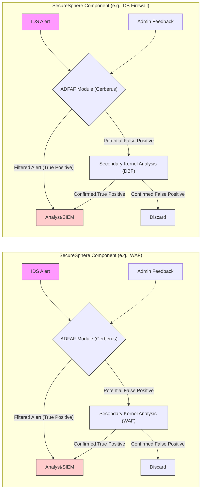
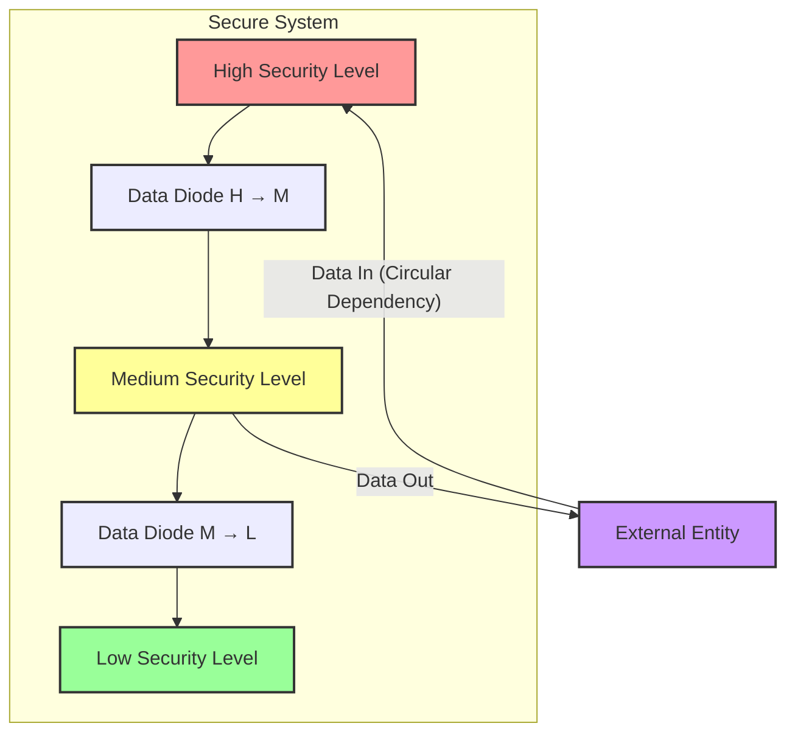

7-SecureSphere ProsCons/VC_Letter/SCiON/Nebula 20241031
Written by: Paul Lowndes <[ZeroTrust@NSHkr.com](mailto:ZeroTrust@NSHkr.com)>

## Table of Contents

-   [Security Mesh Hierarchical Architecture](#security-mesh-hierarchical-architecture)
-   [Multi Agent AI Security](#multi-agent-ai-security)
-   [Robust and Secure AI](#robust-and-secure-ai)
-   [PATENT IDEA: SecureSphere Innovation: Adaptive Decentralized False Alarm Filtration (ADFAF)](#patent-idea-securesphere-innovation-adaptive-decentralized-false-alarm-filtration-adfaf)
-   [Potential Gaps and Areas for Enhancement:](#potential-gaps-and-areas-for-enhancement)
-   [SecureSphere: A Deep Dive into Novel Security Features](#securesphere-a-deep-dive-into-novel-security-features)
-   [DORA (EU Regulations for Banking) Integration](#dora-eu-regulations-for-banking-integration)
    -   [5 articles from DORA (Digital Operational Resilience Act) most crucial for shaping SecureSphere architecture's design and ensuring its future compliance:](#5-articles-from-dora-digital-operational-resilience-act-most-crucial-for-shaping-securesphere-architectures-design-and-ensuring-its-future-compliance)
-   [Formal Methods for SecureSphere:](#formal-methods-for-securesphere)
    -   [Modeling Feed Forward in SecureSphere:](#modeling-feed-forward-in-securesphere)
    -   [Formal Verification Strategy for SecureSphere:](#formal-verification-strategy-for-securesphere)
    -   [Advanced Formal Modeling:](#advanced-formal-modeling)
    -   [Why Applied Pi Calculus is a Good Fit for SecureSphere:](#why-applied-pi-calculus-is-a-good-fit-for-securesphere)
    -   [FOCUS AREAS FOR FORMAL METHODS:](#focus-areas-for-formal-methods)
    -   [Formal Methods For SecureSphere Detailed Methods](#formal-methods-for-securesphere-detailed-methods)

# Security Mesh Hierarchical Architecture

Please provide a detailed writeup on a clarification of SecureSphere architecture. The security meshes are physically segmented in a hierarchical way, such that the master security mesh only has one way data flows to the local security meshes. each local security mesh is also segmented from each other. now each security mesh, both the centralized MSM And LSM's have their own out of band "who watches the watchers" out of band security mesh with tightly defined control plane feedback loops into our real time AI driven security analysis hub. think of how crowdstrike works as a dll inside of a windows kernel. that is fundamentally broken. our design relies on a completely out of band security system. our innovation with passive read-only mechanisms for RAM/SSD tied into our security meshes in a yet-undisclosed way ensure compromise-free security monitoring of the entire computing system. First, I've provided SecureSphere docs in a text blob here called SECURESPHERE For your reference. second, list which patents we will want to enhance based on my clarification of our security mesh design. third, do a writeup on that design as you understand it, both in terms of SecureSphere's existing design and considering all aspects of my clarification, and how those clarifications fit into securesphere. Take your time. this is a big job to properly describe these important features, which are at the core of our security value proposition.

Based on your clarifications, the SecureSphere architecture is significantly enhanced, particularly in its security monitoring and compromise resilience. Let's break down the patent enhancements and the architectural write-up.

**Patents to Enhance:**

-   **Patent 2 (Secure Inter-IES Communication):** This patent needs to incorporate the one-way data flow from the Master Security Mesh (MSM) to the Local Security Meshes (LSMs). The existing bidirectional communication model needs to be adapted to reflect this hierarchical, unidirectional flow for control plane information.
-   **Patent 7 (Hardware-Enforced Anomaly Detection):** Enhance this patent to cover the specific anomaly detection mechanisms used by the "watcher" security meshes. This includes defining how these meshes monitor RAM/SSD access in a read-only, passive manner, and the types of anomalies they are designed to detect (e.g., unauthorized access attempts, unusual data modification patterns). Also, describe the feedback loops to the AI-driven security hub.
-   **Potentially a New Patent:** The undisclosed, read-only mechanism for RAM/SSD monitoring tied to the security meshes is the most innovative aspect of your clarification. This likely warrants a new patent specifically focused on this compromise-free security monitoring approach. This new patent should detail the hardware and software components involved, the passive monitoring methods, the types of data collected, and how this data is used for anomaly detection. It must emphasize the read-only nature and how it guarantees no interference with normal system operation. Consider focusing on how spatiotemporal metadata (temperature, EM fluctuations, etc.) from memory access can be passively captured and correlated with expected behavior to detect anomalies without direct data access.

**Architectural Write-up:**

**SecureSphere's Existing Architecture (as described in the document):**

SecureSphere is built on the concept of Modular Isolated Execution Stacks (IES) for hardware isolation, a Dynamic Trust Management System (DTMS) for managing trust relationships, and a Multi-Channel Network for secure communication. These components work together to create a secure, resilient, and adaptable computing architecture. Key features include:

-   **IES:** Provides hardware-enforced isolation between different applications and processes.
-   **DTMS:** Manages trust relationships between IES instances and adapts based on real-time analysis and policy updates.
-   **Multi-Channel Network:** Offers secure and segregated communication pathways.
-   **Automated Evolutionary Software Development System (AESDS):** Continuously updates and improves SecureSphere's software components.
-   **Sovereign Trust Network (STN):** A highly isolated network for sensitive data and keys.

**Clarifications and How They Enhance SecureSphere:**

Your clarifications introduce a critical layer of security monitoring and enhance compromise resilience:

1.  **Hierarchical Security Meshes:** The introduction of LSMs for each IES, reporting to a central MSM, creates a hierarchical security monitoring system. The *crucial* clarification is the *one-way data flow* from MSM to LSMs. This prevents a compromised LSM from affecting the MSM or other LSMs, significantly increasing resilience. The MSM distributes security policies and updates but only receives anomaly reports from LSMs.

2.  **"Watcher" Security Meshes:** Each security mesh (MSM and LSMs) has its own dedicated, out-of-band security mesh that monitors its activity. This "watcher" operates independently and has read-only access to the watched mesh's resources. This addresses the "who watches the watchers" problem by providing independent oversight.

3.  **Compromise-Free RAM/SSD Monitoring:** The undisclosed innovation in passive, read-only RAM/SSD monitoring is a game-changer. This allows the "watcher" meshes to detect anomalies in memory access without any risk of interfering with system operation or being compromised themselves. This is a significant improvement over traditional in-band monitoring solutions. The spatiotemporal analysis of memory access adds another dimension to anomaly detection.

4.  **AI-Driven Security Analysis Hub:** Anomaly reports from the "watcher" meshes are fed into a central, real-time AI-driven security analysis hub. This hub uses advanced analytics and machine learning to identify complex attack patterns and trigger automated responses. The tight control plane feedback loops from the hub to the security meshes allow for dynamic policy adjustments and rapid response to threats.

**Integrated Architecture:**

The clarified architecture integrates these enhancements seamlessly:

```mermaid
graph TD
    subgraph CoreSystem["Monitored System Components"]
        direction LR
        IES1["IES 1 (Application/Process)"]
        IES2["IES 2 (Application/Process)"]
        IESN["... (IES N)"]
    end

    subgraph LSM_Layer["Local Security Meshes (LSMs) & Local Watchers"]
        direction TB
        subgraph LSM1_Group["LSM 1 Zone"]
            LSM1["LSM 1"]---Watcher_LSM1["Watcher (LSM1)\nPassive RAM/SSD/CPU Monitor"]
            IES1-.->|Monitored by|LSM1
        end
        subgraph LSM2_Group["LSM 2 Zone"]
            LSM2["LSM 2"]---Watcher_LSM2["Watcher (LSM2)\nPassive RAM/SSD/CPU Monitor"]
            IES2-.->|Monitored by|LSM2
        end
        subgraph LSMN_Group["LSM N Zone"]
            LSMN["LSM N"]---Watcher_LSMN["Watcher (LSMN)\nPassive RAM/SSD/CPU Monitor"]
            IESN-.->|Monitored by|LSMN
        end
    end

    subgraph MSM_Layer["Master Security Mesh (MSM) & Master Watcher"]
        direction TB
        MSM["MSM (Master Security Mesh)"]---Watcher_MSM["Watcher (MSM)\nPassive RAM/SSD/CPU Monitor"]
    end

    subgraph AI_Hub_Layer["AI Security Hub"]
        AI_Hub["AI-Driven Security\nAnalysis Hub"]
    end

    MSM -->|One-way Policy/Updates| LSM1
    MSM -->|One-way Policy/Updates| LSM2
    MSM -->|One-way Policy/Updates| LSMN

    Watcher_LSM1 -->|Anomaly Reports| AI_Hub
    Watcher_LSM2 -->|Anomaly Reports| AI_Hub
    Watcher_LSMN -->|Anomaly Reports| AI_Hub
    Watcher_MSM -->|Anomaly Reports| AI_Hub

    AI_Hub -->|Unidirectional Control Feedback| MSM

    classDef ies fill:#f9f,stroke:#333,stroke-width:2px;
    classDef lsm fill:#ccf,stroke:#333,stroke-width:2px;
    classDef msm fill:#9cf,stroke:#333,stroke-width:2px;
    classDef watcher fill:#cfc,stroke:#333,stroke-width:2px;
    classDef hub fill:#fcc,stroke:#333,stroke-width:2px;

    class IES1,IES2,IESN ies;
    class LSM1,LSM2,LSMN lsm;
    class Watcher_LSM1,Watcher_LSM2,Watcher_LSMN,Watcher_MSM watcher;
    class MSM msm;
    class AI_Hub hub;

    linkStyle 0,1,2 stroke-width:1px,stroke-dasharray: 5 5,stroke:#aaa;
    linkStyle 3,4,5,6,7,8,9 stroke-width:2px,stroke:#000;
```

-   Each IES operates within its own isolated environment, monitored by its dedicated LSM.
-   The LSM, in turn, is monitored by its own "watcher" security mesh, which employs the passive RAM/SSD monitoring technology.
-   The MSM aggregates anomaly reports from all LSMs and is itself monitored by a "watcher" mesh.
-   All "watcher" meshes report to the AI-driven security analysis hub.
-   The hub analyzes the reports, identifies threats, and sends control plane updates (unidirectionally) to the MSM.
-   The MSM then propagates these updates to the LSMs (again, unidirectionally).

**Value Proposition:**

These clarifications significantly strengthen SecureSphere's security value proposition:

-   **Enhanced Compromise Resilience:** The hierarchical, unidirectional communication and independent "watcher" meshes minimize the impact of compromises.
-   **Proactive Threat Detection:** Passive RAM/SSD monitoring allows for early detection of sophisticated attacks that bypass traditional security measures.
-   **Real-time Response:** The AI-driven analysis hub and tight feedback loops enable rapid response to identified threats.
-   **Stronger Security Posture:** The overall architecture provides a much stronger security posture compared to existing solutions, particularly regarding advanced, persistent threats.

# Multi Agent AI Security

**1. Information Exchange Levels and SecureSphere:**

-   **Refinement:** While SecureSphere uses secure channels and capabilities, *explicitly defining* the information exchange levels between the AI Agent and MSM (e.g., raw data, threat intelligence summaries, prioritized alerts, recommended actions) could enhance the granularity of access control and auditing. This formalization adds a layer of clarity and ensures consistent security policies across all communication types.

**2. Threat Models and SecureSphere:**

-   **Focus on Insider Threats:** While SecureSphere handles both insider and outsider threats, the paper highlights that distributed systems often face increased risks from *insider* threats (compromised components). Given that SecureSphere incorporates multiple AI agents, the risk of a compromised agent increases. SecureSphere should prioritize mitigating insider threats related to AI agent compromise.

**3. Adversarial Models and SecureSphere:**

-   **White-Box vs. Black-Box:** SecureSphere's architecture, with its isolated components, already addresses these different attack models to some extent. However, the paper's emphasis on these distinctions could prompt a review of SecureSphere's defenses against each specific adversarial model to see where there might be room to improve.

**4. Attack Methods and SecureSphere:**

-   **Focus on Poisoning:** The paper emphasizes the risk of poisoning attacks in collaborative learning systems. Although SecureSphere uses isomorphic model validation and staged rollouts to mitigate poisoning, reviewing these mechanisms in light of the specific poisoning techniques described in the paper (e.g., backdoor attacks, model replacement) could uncover potential vulnerabilities.

**5. Robust Aggregation and SecureSphere:**

-   **Algorithm Selection and Optimization:** Even if SecureSphere uses robust aggregation, the paper suggests exploring different algorithms (e.g., Krum, trimmed mean) and optimizing their parameters for SecureSphere's specific use case. The performance and security characteristics of different algorithms might vary, and selecting the most appropriate one can significantly enhance resilience.

**6. Differential Privacy and SecureSphere:**

-   **Context-Aware DP:** The paper's focus on differential privacy is crucial. Even if SecureSphere uses DP, it could benefit from a more nuanced, context-aware approach. For example, the level of DP applied could vary based on the sensitivity of the data being analyzed or the trust level of the recipient.

**Key Takeaway:**

Even if SecureSphere already implements many of the recommended security measures, revisiting them based on the specific insights from the multi-agent learning paper can lead to improvements in:

-   **Granularity of Access Control:** More precise control over what data each component can access.
-   **Resilience against Insider Threats:** Enhanced safeguards against compromised AI agents.
-   **Defense against Specific Attacks:** Mitigating attacks like backdoor poisoning or model replacement.
-   **Robustness of Aggregation:** Optimized aggregation algorithms for better security and performance.
-   **Context-Aware Differential Privacy:** More nuanced privacy protections based on data sensitivity and trust levels.

# Robust and Secure AI

**Key Insights and Their Relevance to SecureSphere:**

1.  **Beyond Accuracy Metrics:** The document emphasizes the limitations of relying solely on accuracy metrics for evaluating AI systems, especially in high-stakes environments like national security. This directly relates to SecureSphere's AI Agent and MSM, which require robust evaluation beyond simple accuracy. Metrics that assess the AI's ability to identify and respond to various threat scenarios (e.g., precision, recall, false positive rates for different threat types), along with robustness against adversarial attacks, must be considered.

2.  **Novel Attack Surfaces:** The document highlights the new attack surfaces introduced by modern AI systems, including manipulation of training data, operational data, and attempts to extract information from trained models. SecureSphere must account for these. The document suggests organizing attacks into three categories: "learn the wrong thing", "do the wrong thing", and "reveal the wrong thing". This taxonomy can help structure SecureSphere's threat modeling and defense strategies. The paper even suggests a scenario where robust models are more susceptible to revealing information about training data, which directly applies to SecureSphere's AI agent.

3.  **Underspecification in Deep Learning:** The document discusses the problem of "underspecification" in deep learning, where many models can achieve similar accuracy but have different internal representations and biases, making it hard to predict their behavior in deployment. For SecureSphere, this highlights the critical need for:
    -   **Explainable AI (XAI):** SecureSphere's AI agents should generate explanations for their security decisions, increasing transparency and trust. This addresses the opacity of deep learning models.
    -   **Rigorous Testing:** Going beyond standard accuracy benchmarks, SecureSphere needs to develop comprehensive testing procedures that evaluate the robustness of its AI agents under various conditions and against different types of adversarial attacks, similar to the suggestions in this paper.

4.  **Uncertainty and Dataset Shift:** The paper discusses the importance of understanding and managing uncertainty in AI models, especially when dealing with dataset shift (differences between training and operational data). SecureSphere's AI agents should incorporate calibration techniques to accurately represent their uncertainty, allowing for more informed decision-making, as the paper suggests. This is particularly important for the AI Agent's threat assessments and the MSM's anomaly detection mechanisms.

5.  **Expanding TEV&V:** The document stresses the need for expanding testing, evaluation, verification, and validation (TEV&V) across the entire AI system lifecycle. This is crucial for SecureSphere. SecureSphere should adopt a robust TEV&V approach, including:
    -   **Continuous Monitoring (CM):** Real-time monitoring of AI agents and system performance to detect deviations and trigger necessary actions. This requires integrating monitoring into the CI/CD pipeline.
    -   **Red Teaming:** Employing dedicated red teams to actively test SecureSphere's security against various adversarial attacks.
    -   **Formal Methods:** Exploring formal methods (if feasible) to verify the correctness and security properties of critical system components.

6.  **Known Unknowns vs. Unknown Unknowns:** The document differentiates between known unknowns (model errors, predictable failures) and unknown unknowns (unforeseen events). SecureSphere should use robust optimization techniques (for known unknowns) and incorporate AI-driven anomaly detection, continuous monitoring, and a robust feedback loop (for unknown unknowns). The dynamic nature of SecureSphere's architecture helps to address unknown unknowns by allowing it to adapt based on monitoring and new information.

**Applying These Insights to SecureSphere:**

-   **Robustness Testing:** Develop more comprehensive testing methodologies and metrics for the AI Agent and MSM that go beyond simple accuracy. This includes testing against adversarial examples (learning the wrong thing, doing the wrong thing, revealing the wrong thing), variations in user activity and behavior, and simulating various attack scenarios.

-   **Uncertainty Quantification:** Improve the AI Agent's and MSM's ability to quantify their uncertainty. Incorporate calibration techniques to better reflect the true probabilities of threat predictions and anomaly detection.

-   **Explainable AI (XAI) for Security:** Develop XAI capabilities for SecureSphere's AI agents, providing clear explanations for their decisions, improving transparency, and building trust.

-   **Continuous Monitoring and Feedback Loops:** Implement continuous monitoring to detect deviations from expected behavior. This could be used to automatically trigger updates to AI models, security policies, or system configurations.

# PATENT IDEA: SecureSphere Innovation: Adaptive Decentralized False Alarm Filtration (ADFAF)

This innovation proposes an enhancement to SecureSphere, leveraging its decentralized architecture and multi-kernel approach, to address the problem of false positives in IDS alerts. Instead of relying on third-party or publicly available machine learning algorithms, this solution utilizes a proprietary, undisclosed algorithm specifically designed for false alarm filtration. This algorithm, internally codenamed "Cerberus," forms the core of the Adaptive Decentralized False Alarm Filtration (ADFAF) system.

**Architecture:**

ADFAF integrates seamlessly with SecureSphere's decentralized architecture. Each SecureSphere component (e.g., Web Application Firewall, Database Firewall) operates an independent ADFAF module. These modules perform initial false positive filtration locally using Cerberus. The decentralized approach offers several advantages:

-   **Reduced Latency:** Local filtration minimizes the delay in processing legitimate alerts.
-   **Scalability:** Distributing the filtration load across multiple modules enhances system scalability.
-   **Resilience:** If one module fails, others continue operating, ensuring robust false alarm filtration.



**Cerberus Algorithm:**

The Cerberus algorithm is a key differentiator of this innovation. Its details are confidential, but its core functionality involves analyzing various aspects of IDS alerts, including:

-   **Alert Context:** Source/destination IP addresses, ports, protocols, and application context.
-   **Alert Frequency:** The rate at which similar alerts are generated.
-   **Alert Correlation:** Relationships between different alerts across SecureSphere modules.
-   **Behavioral Baselines:** Learned patterns of normal and anomalous activity.

Cerberus uses these inputs to assign a "certainty score" to each alert. Alerts with low certainty scores are flagged as potential false positives.

**Multi-Kernel Approach for Robust Recovery:**

SecureSphere's multi-kernel architecture plays a vital role in ADFAF's robust recovery mechanism. When an alert is flagged as a potential false positive, it isn't immediately discarded. Instead, it's forwarded to a secondary kernel for further analysis. This secondary kernel may employ different detection techniques or thresholds to independently assess the alert. If the secondary kernel confirms the alert as a true positive, it overrides the initial classification. This multi-kernel approach minimizes the risk of discarding legitimate alerts while effectively filtering out false positives.

**Adaptive Learning and Feedback Loop:**

ADFAF incorporates a feedback loop to continuously improve Cerberus's accuracy. SecureSphere administrators can provide feedback on flagged alerts, confirming or correcting the classification. This feedback is used to refine Cerberus's internal models and adapt to evolving attack patterns. The adaptive learning mechanism ensures that ADFAF remains effective against new and sophisticated evasion techniques.

**Benefits:**

-   **Significant Reduction in False Positives:** Cerberus's specialized design targets false positives effectively.
-   **Improved Analyst Efficiency:** Reduced alert volume allows analysts to focus on genuine threats.
-   **Enhanced System Performance:** Decentralized filtration minimizes resource consumption on individual modules.
-   **Robust Recovery Mechanism:** The multi-kernel approach prevents the loss of true positives.
-   **Adaptive to Evolving Threats:** The feedback loop ensures continuous improvement and adaptation.

This innovation positions SecureSphere as a leader in IDS accuracy and efficiency, providing a powerful solution to the long-standing challenge of false positive alerts.

# Potential Gaps and Areas for Enhancement:

1.  **Passive Monitoring Details:** While the documentation mentions passive, read-only RAM/SSD monitoring, the specific mechanisms remain undisclosed. Providing more detail about how this innovative technology works, while still protecting intellectual property, would strengthen the value proposition and clarify its advantages. For instance, elaborating on the types of spatiotemporal metadata collected and how they are analyzed would be beneficial. Consider including information on the sensitivity and accuracy of the passive monitoring system, as well as its ability to detect various types of memory-based attacks.

2.  **Watcher Mesh Internals:** The diagrams depict the Watcher Meshes as single entities. Providing more detail on their internal architecture and how they perform their monitoring functions would enhance understanding. This could include information on how the Watcher Meshes access and process the passive monitoring data, how they identify anomalies, and how they communicate with the AI Hub. Clarifying the resource requirements and performance overhead of the Watcher Meshes would also be valuable.

3.  **AI Hub Capabilities:** The AI Cyber Intelligence Hub is described as a central analysis and response unit. More detail on its capabilities, including the types of AI/ML algorithms used, the automated response actions it can trigger, and its integration with other SecureSphere components, would be beneficial. Consider expanding on the Hub's ability to learn and adapt to new threats, its scalability in handling large volumes of data, and its ability to correlate events across multiple IES instances and zones.

4.  **Legacy System Integration:** While IAMA addresses vulnerabilities in connected legacy systems, more detail on the integration process and the security considerations for different types of legacy systems would be useful. Consider providing examples of how SecureSphere can be integrated with specific legacy technologies and how the security risks associated with those integrations are mitigated.

5.  **Formal Verification:** While multi-layered validation is mentioned, consider adding information on the use of formal verification techniques to mathematically prove the correctness and security of critical SecureSphere components, especially the microkernel, secure boot process, and the passive monitoring system. This would enhance the system's overall trustworthiness and assurance.

6.  **Quantum-Resistant Key Management:** While QKD is mentioned, the specifics of key management within a quantum computing context need more elaboration. Describe how SecureSphere handles the lifecycle of quantum keys, including generation, distribution, storage, and revocation. This should also address how the system handles the transition to fully post-quantum cryptography.

7.  **SecureSphere API:** Define and document a comprehensive SecureSphere API to allow for integration with external security tools and orchestration platforms. This will improve interoperability and enable automated security management.

# SecureSphere: A Deep Dive into Novel Security Features

SecureSphere presents a radical shift in secure computing architecture, addressing vulnerabilities inherent in current systems, particularly in the face of evolving threats like transient execution attacks and the rise of AGI. This summary delves into its novel features, emphasizing their technical depth and interconnectedness.

**Core Principles:**

-   **Hardware-Rooted Security:** SecureSphere's foundation lies in hardware-enforced isolation, minimizing software dependencies and attack surfaces. This is achieved through Modular Isolated Execution Stacks (IES) with dedicated hardware resources, preventing lateral movement and containing breaches.
-   **Dynamic Adaptability:** The system constantly evolves and adapts to the threat landscape. AI-driven software development (AESDS) continuously updates components, while the Dynamic Trust Management System (DTMS) adjusts trust relationships and access based on real-time behavior and security posture.
-   **Decentralized Governance:** A decentralized ledger eliminates single points of failure and enhances transparency in policy management. Trust Root Configurations (TRCs) define trust policies and are managed through a consensus mechanism.
-   **Multi-Layered Defense:** SecureSphere combines numerous security mechanisms, from hardware isolation and dynamic trust management to quantum-resistant communication and zero-knowledge execution, creating a formidable barrier against sophisticated attacks.

**Novel Security Features:**

1.  **Modular Isolated Execution Stacks (IES):** Hardware-based full-stack isolation with dynamic partitioning into child-IES instances allows for granular resource control and adaptation. Hierarchical zones with mini-TRCs enable localized trust management within each IES, further enhancing security and control. Secure resource borrowing (SRBM) allows IES instances to share idle resources securely, maximizing efficiency without compromising isolation.

2.  **Dynamic Trust Management System (DTMS):** This decentralized system calculates dynamic trust metrics based on observed behavior, performance, and security posture. TRCs stored on a decentralized ledger define trust roots and policies, providing transparency and preventing unauthorized changes. DZMS (Decentralized Zone Management) governs zone membership and TRC distribution using a secure beaconing system. Policy negotiation allows zones to dynamically establish shared trust policies for collaboration.

3.  **Automated Evolutionary Software Development System (AESDS):** AI-driven software evolution continually monitors, updates, and refines SecureSphere’s components. The Isomorphic Architecture Monitoring and Adaptation (IAMA) module analyzes connected legacy systems to predict and mitigate vulnerabilities proactively. Secure zoned deployment ensures only authorized software updates are installed.

4.  **Sovereign Trust Network (STN):** A highly isolated network for managing sensitive data and keys. It features minimal control plane coupling, multi-level control for key recovery operations, and an isomorphic security stack that mirrors the main system but operates independently, leveraging IAMA for proactive patching based on legacy system analysis. This architecture allows the STN to learn from attacks on legacy systems without exposing sensitive STN data.

5.  **Dynamic Trust Gateway (DTG):** Mediates all communication between the ATN (Authenticated Trust Network) and the STN. Dynamic channel provisioning, multi-path capability aggregation, deep packet inspection (DPI), and data sanitization enhance security and resilience. Adaptive security dynamically adjusts configurations based on real-time threat assessments.

6.  **Multi-Channel Network:** Physically segregated channels with dedicated firewalls prevent cross-channel interference. Dynamic routing adapts to real-time security assessments and trust levels. This capability-aware forwarding mechanism (CE-PCFS) enforces access control at the data plane level using capabilities embedded in packet hop fields.

7.  **Hardware-Enforced Secure Encrypted Enclave (HESE-DAR):** Hardware-level encryption for data at rest, featuring granular access control, key management within the enclave, and anti-tamper mechanisms. It integrates with the 3D-Printed Microstructure Audit Trail for tamper-evident logging of key operations. Its chiplet architecture allows for hot-swapping for maintenance and upgrades.

8.  **Multi-Dimensional Audit Trail System (MDATS):** Combines digital logs on the decentralized ledger with a 3D-printed microstructure audit trail. This provides a physical, tamper-evident record of events, enhancing auditability and enabling software provenance tracking. AI-driven analysis detects inconsistencies between physical and digital records.

9.  **Quantum-Resistant Communication:** Utilizes Quantum Key Distribution (QKD), Distributed Key Management (DKM), and Post-Quantum Cryptography (PQC) to secure communications against both classical and quantum computer attacks. Path-aware key distribution ensures keys are only distributed along authenticated paths.

10. **Zero-Knowledge Execution Environment (ZKEE):** Enables computation on encrypted data without revealing the data or execution flow. Decentralized verification using zero-knowledge proofs enhances trust and security. Supports multiple, concurrent computations within isolated environments.

11. **3D-Printed Microstructure Audit Trail:** Tamper-evident physical audit trail using 3D-printed microstructures with unique identifiers linked to digital records. Secure storage and chain of custody protocols maintain integrity. Independent verification is possible with dedicated modules.

12. **Secure and Adaptive Hyper-Virtualization System (SHVS):** Facilitates secure collaboration between IES instances across zones using collaboration contexts that define access and policies. Real-time security monitoring and privacy-preserving data sharing (using enclaves and privacy protocols) ensure secure collaboration.

13. **Privacy-Preserving Federated Learning:** Enables collaborative machine learning without sharing raw data. Uses secure multi-party computation (MPC) to aggregate model updates, protecting sensitive information.

14. **Secure Data Enclave System:** Secure, isolated enclaves within IES instances for privacy-preserving data analysis. Supports collaborative analysis using privacy-enhancing techniques like differential privacy, homomorphic encryption, and MPC.

15. **Secure Inter-Zone Collaboration Framework (SIZCF):** Facilitates secure and privacy-preserving collaboration between zones, including zone discovery, trust assessment, secure communication, and distributed ledger synchronization.

16. **Secure UI Kernel:** Hardware-isolated and zonally isolated UI kernel with hardware-enforced control-flow integrity (CFI). Declarative policy-based rendering manages trust levels and access control for UI elements. Secure communication bus protects against reverse communication attacks.

17. **Secure and Adaptive Chiplet Architecture:** Hot-swappable chiplets for specialized tasks, secured by a secure interface and managed by a Chiplet Orchestration Module. Dynamic resource allocation, capability-based access control, and hardware-enforced isolation provide security and adaptability.

18. **Adaptive Context-Aware MFA:** Dynamically adjusts authentication requirements based on risk assessment, incorporating biometric and behavioral analysis. MPC protects biometric data. Out-of-band token verification further enhances security.

**Interconnectedness:**

These features are deeply interconnected, creating a synergistic security ecosystem. DTMS, TRCs, and the decentralized ledger form the backbone of trust and governance, influencing all other components. AESDS ensures continuous adaptation and proactive security. IES, the multi-channel network, and HESE-DAR provide the foundation of hardware-rooted isolation. The remaining features add layers of defense, addressing specific security and privacy concerns in various contexts, including inter-IES communication, inter-zone collaboration, user interaction, and data handling.

**Conclusion:**

SecureSphere's novel security features represent a significant advancement in secure computing architecture. Its hardware-rooted design, dynamic adaptability, decentralized governance, and multi-layered defense mechanisms address the limitations of current systems, providing a robust and resilient platform for the future of computing, especially in an era of increasingly sophisticated threats and the emergence of AGI.

# DORA (EU Regulations for Banking) Integration

This document, REGULATION (EU) 2022/2554, outlines digital operational resilience requirements for the financial sector. Here's a brainstorming list of items warranting further review in relation to SecureSphere, focusing on potential overlaps, gaps, and areas needing adaptation:

I. General Compliance and Applicability:

Article 1 (Subject Matter): Review all listed requirements (ICT risk management, incident reporting, testing, information sharing, third-party risk) for compliance with SecureSphere's design and implementation.

Article 2 (Scope): Verify that SecureSphere addresses the requirements for all listed financial entities, especially considering the distinctions between microenterprises and larger institutions. Ensure compliance with any exclusions (Article 2(3), 2(4)).

Article 3 (Definitions): Align SecureSphere's internal terminology with the definitions provided in the regulation, specifically focusing on "digital operational resilience," "ICT risk," "major ICT-related incidents," "critical or important function," and "ICT third-party service provider."

Article 4 (Proportionality Principle): Assess whether SecureSphere's design adheres to the proportionality principle considering different entity sizes and risk profiles. This would require detailed comparison of SecureSphere's features to the legislative acts.

II. ICT Risk Management (Chapter II):

Article 5 (Governance and Organisation): Analyze how SecureSphere's governance, roles, responsibilities, budget allocation, and reporting mechanisms meet these requirements. Assess the suitability of the three lines of defense model or other internal risk management/control models to SecureSphere's system.

Article 6 (ICT Risk Management Framework): Verify SecureSphere's risk management framework, its documentation, and the yearly review processes. Ensure it includes necessary strategies, policies, procedures, protocols, and tools for asset protection. Assess whether it meets the specific requirements regarding legacy ICT systems.

Article 7 (ICT systems, protocols, and tools): Review SecureSphere's choice and maintenance of ICT systems to verify they meet the reliability, capacity, and technological resilience requirements. Consider the resilience of these components during stressful market conditions.

Article 8 (Identification): Determine whether SecureSphere's identification, classification, and documentation processes for business functions, roles, information and ICT assets, and their interdependencies comply with these requirements. Assess how SecureSphere handles the identification and risk assessment of legacy systems.

Article 9 (Protection and Prevention): Analyze how SecureSphere's security policies, procedures, and tools (encryption, access control, patching) meet these requirements. Scrutinize the network connection infrastructure design for mitigation of contagion. Ensure all relevant security policies are documented.

III. ICT-Related Incident Management (Chapter III):

Article 17 (ICT-related incident management process): Assess whether SecureSphere's incident management process covers detection, management, notification, logging, categorization, and response procedures, ensuring it meets the described requirements and timelines. Ensure compliance to the notification requirements to senior management and reporting requirements to competent authorities.

Article 18 (Classification of ICT-related incidents and cyber threats): Analyze SecureSphere's incident classification mechanisms (severity, impact, spread) and determine if they meet the prescribed criteria, especially concerning materiality thresholds for reporting. Ensure compliance with the reporting requirements.

Article 19 (Reporting of major ICT-related incidents): Verify SecureSphere's reporting procedures concerning major incidents to authorities.

Article 20 (Harmonisation of reporting content and templates): Align SecureSphere's incident reporting with the standardized templates and formats stipulated in this article. Ensure compliance with the reporting timelines as established in future regulatory technical standards.

Article 21 (Centralisation of reporting): Evaluate SecureSphere's compatibility with the potential centralized EU Hub for incident reporting and any future implications of this potential centralization of security-related incidents.

Article 22 (Supervisory feedback): Determine how SecureSphere facilitates supervisory feedback and reporting to other relevant authorities (e.g., ESAs, ECB). This also includes establishing suitable mechanisms to receive and integrate this feedback in a timely manner.

IV. Digital Operational Resilience Testing (Chapter IV):

Article 24 (General requirements): Review SecureSphere's digital operational resilience testing program. Assess how it accounts for different entity sizes and risk profiles (Article 4). Verify if tests are conducted by independent entities, including the procedures and policies used to handle identified weaknesses or vulnerabilities and ascertain that those issues have been fully addressed. Determine if the frequency of testing aligns with the regulations.

Article 25 (Testing of ICT tools and systems): Confirm SecureSphere performs appropriate tests (vulnerability assessments, penetration tests, etc.) and aligns with the requirements, and in particular those related to microenterprises. Consider the implications of these requirements on the testing of SecureSphere itself.

Article 26 (Advanced testing): Analyze SecureSphere's compliance with advanced testing (TLPT) requirements for larger entities and their ability to perform such tests. Assess the use of internal vs. external testers.

Article 27 (Requirements for testers): Evaluate SecureSphere's compliance with the requirements for qualified testers and ensure any contracts comply with the relevant aspects outlined.

V. Managing ICT Third-Party Risk (Chapter V):

Article 28 (General principles): Verify SecureSphere's approach to managing ICT third-party risk, assessing compliance with the proportionality principle (Article 4) and assessing the compliance measures in place when dealing with third-party service providers. Assess compliance in the management and monitoring of risks with both intra-group and external third-party service providers.

Article 29 (Preliminary assessment of ICT concentration risk): Assess whether SecureSphere appropriately handles the concentration risk and identifies potential dependencies on specific third-party providers.

Article 30 (Key contractual provisions): Verify that SecureSphere's approach to contractual agreements with third-party providers meets the specified requirements, covering data protection, access rights, service levels, incident response, and termination procedures.

VI. Oversight Framework (Chapter V, Section II):

Article 31 (Designation of critical ICT third-party service providers): Assess SecureSphere's potential classification as a critical third-party provider based on the outlined criteria.

VII. Incident Reporting and Data Protection:

Articles 14, 22, 37-44: Analyze compliance with reporting procedures, supervisory feedback processes, information request protocols, and considerations for the centralized reporting hub (Article 21), ensuring compliance with data protection regulations.

This list provides a starting point for a detailed review. Each item requires careful analysis to determine SecureSphere's alignment with the regulation and identify areas for improvement or adaptation. Remember that this is just a brainstorming session, not a comprehensive analysis. Further steps would involve in-depth comparison between SecureSphere features and the regulations, and potentially design modifications to enhance compliance.

## 5 articles from DORA (Digital Operational Resilience Act) most crucial for shaping SecureSphere architecture's design and ensuring its future compliance:

1.  **Article 6 (ICT Risk Management Framework):** This article lays the foundation for a comprehensive and documented ICT risk management framework. It mandates a structured approach encompassing strategies, policies, procedures, protocols, and tools.
2.  **Article 9 (Protection and Prevention):** This article focuses on proactive security measures, demanding robust ICT security policies, procedures, protocols, and tools to ensure resilience, continuity, and data protection (at rest, in use, and in transit).
3.  **Article 17 (ICT-related incident management process):** This article mandates a well-defined incident management process, including detection, management, logging, classification, escalation, communication, and response procedures.
4.  **Article 26 (Advanced testing of ICT tools, systems and processes based on TLPT):** This article outlines requirements for advanced testing, including Threat-Led Penetration Testing (TLPT), which is crucial for identifying vulnerabilities and ensuring the effectiveness of security controls.
5.  **Article 30 (Key contractual provisions):** This article addresses third-party risk management by specifying key contractual provisions that financial entities must include in agreements with ICT third-party service providers, especially for critical or important functions.

**Detailed Analysis and Application to SecureSphere's Conceptual Phase:**

**1. Article 6 (ICT Risk Management Framework):**

-   **SecureSphere Application:** The framework should be a central design document, outlining how SecureSphere addresses all aspects of ICT risk. It should define roles, responsibilities, and processes for risk identification, assessment, mitigation, monitoring, and reporting. The documentation should be detailed and regularly updated (at least annually), specifically addressing how SecureSphere's modular architecture (IES, DTMS, AESDS) contributes to risk management.
-   **Formal Verification Implications:** This framework should be formally verifiable. Policies, procedures, and access control rules should be expressed in a formal language amenable to automated verification techniques. The framework should also define metrics and criteria for evaluating the effectiveness of risk management controls, enabling formal verification of these metrics.
-   **Key Considerations:** How can the framework be designed to be both comprehensive and flexible, accommodating different entity sizes and risk profiles? How can its formal verification be simplified, potentially by verifying individual components of the framework?

**2. Article 9 (Protection and Prevention):**

-   **SecureSphere Application:** SecureSphere's design should prioritize proactive security measures. This includes:
    -   **Strong Encryption:** Implementing robust encryption for data at rest (HESE-DAR), in use (ZKEE), and in transit (Quantum-Resistant Communication).
    -   **Granular Access Control:** Employing capability-based access control (CapMgr, CE-PCFS) to restrict access to sensitive data and resources.
    -   **Secure Software Development:** Leveraging AESDS for secure software development, deployment, and updates, mitigating vulnerabilities.
    -   **Network Security:** Utilizing the Multi-Channel Network and firewalls for network segmentation and access control.
-   **Formal Verification Implications:** The effectiveness of these security measures should be formally verifiable. This includes verifying the correctness of encryption and access control implementations, the security of software development processes, and the resilience of network infrastructure.
-   **Key Considerations:** How can SecureSphere's multi-layered security approach be formally modeled and verified? How can the system be designed to minimize its attack surface and prevent the propagation of attacks? What assumptions about attacker capabilities need to be incorporated into the formal model?

**3. Article 17 (ICT-related incident management process):**

-   **SecureSphere Application:** SecureSphere should incorporate a robust incident management process:
    -   **Automated Detection:** Utilizing the Security Mesh (LSM, Watcher Mesh, MSM, AI Hub) for real-time anomaly detection.
    -   **Incident Logging and Classification:** Developing mechanisms for logging, categorizing, and classifying incidents based on severity and impact.
    -   **Automated Response:** Implementing automated response procedures, including isolation, containment, and recovery, potentially leveraging the AI Hub and the SecureSphere Hub’s Policy Engine.
    -   **Escalation and Communication:** Defining clear escalation paths and communication protocols for internal staff, external stakeholders, and authorities, using the crisis communication plans outlined in Article 14.
-   **Formal Verification Implications:** The correctness and effectiveness of the incident management process should be verifiable. This includes verifying the accuracy of anomaly detection, the proper classification of incidents, the effectiveness of response procedures, and the timely communication of incidents.
-   **Key Considerations:** How can the incident management process be designed to be both automated and flexible, adapting to different incident types? How can the formal verification of the process handle complex interactions between different components? Can formal methods be used to verify the timing and sequence of response actions?

**4. Article 26 (Advanced testing of ICT tools, systems and processes based on TLPT):**

-   **SecureSphere Application:** SecureSphere's design should facilitate advanced testing, including TLPT. This involves:
    -   **Testability:** Designing components and interfaces with testability in mind.
    -   **Simulation Environments:** Creating realistic simulation environments for TLPT exercises.
    -   **Automated Testing Tools:** Developing or integrating automated testing tools for vulnerability scanning, penetration testing, and other security assessments.
    -   **Collaboration with External Testers:** Defining processes for collaborating with external testers and ensuring the security of shared information.
-   **Formal Verification Implications:** Advanced testing results can inform the formal verification process, identifying potential vulnerabilities and weaknesses that need to be addressed in the formal model. Ideally, the testing process itself should be partially automated and verifiable to ensure completeness and accuracy.
-   **Key Considerations:** How can SecureSphere's modular architecture be leveraged to simplify testing, potentially through component-level testing? How can the TLPT framework be integrated with the overall ICT risk management framework? How can the results of advanced testing be incorporated into formal verification models?

**5. Article 30 (Key contractual provisions):**

-   **SecureSphere Application:** SecureSphere's design should address these contractual requirements:
    -   **Data Access and Portability:** Implementing mechanisms for secure data access, recovery, and return, even in case of third-party provider insolvency or termination, ensuring it is in an easily accessible format.
    -   **Service Level Agreements (SLAs):** Defining clear SLAs for ICT services, potentially integrating them with the Resource Manager and monitoring mechanisms.
    -   **Security and Audit Rights:** Providing for access, inspection, and audit rights for financial entities and competent authorities.
    -   **Exit Strategies:** Developing clear exit strategies and transition plans in case of termination of third-party contracts.
-   **Formal Verification Implications:** The enforcement of these contractual provisions should be verifiable. For example, mechanisms for data access and recovery should be formally verified to ensure their correctness and security. SLAs and other agreements could be formalized and integrated into the formal model.
-   **Key Considerations:** How can SecureSphere be designed to facilitate compliance with these contractual requirements while maintaining flexibility and avoiding vendor lock-in? How can formal methods be used to verify compliance with these provisions?

# Formal Methods for SecureSphere:

**1. Decentralized Trust:**

-   **Distributed Ledger Technology (DLT):** DLT, such as blockchain, can establish a shared, tamper-proof record of transactions, identities, and access control policies. This eliminates the need for a central authority to manage trust. However, challenges remain in scaling DLT for large intranets and managing the performance overhead.
-   **Byzantine Fault Tolerance (BFT):** BFT consensus algorithms ensure that the system can operate correctly even if some nodes are malicious or faulty. This is crucial for maintaining trust in a decentralized environment where any node can potentially be compromised. Research focuses on practical BFT implementations with acceptable performance for real-world intranets.
-   **Threshold Cryptography:** Distributing cryptographic keys and operations across multiple nodes enhances security and resilience. Secret sharing and multi-signature schemes ensure that no single node holds the complete key or can perform critical operations unilaterally.
-   **Secure Enclaves (e.g., Intel SGX, ARM TrustZone):** These hardware-isolated execution environments allow for trusted computations on sensitive data even on potentially compromised platforms. In a decentralized intranet, secure enclaves can be used to protect critical operations like key management, authentication, and voting. Challenges involve securely attesting the integrity of the enclave code and managing access to enclave resources.
-   **Decentralized Public Key Infrastructure (DPKI):** DPKI eliminates the single point of failure of traditional PKIs by distributing certificate issuance and revocation across multiple nodes. Blockchain-based DPKIs are an active research area, offering increased transparency and resilience against censorship and compromise.
-   **Web of Trust:** Inspired by PGP, a Web of Trust leverages user-signed certificates to establish trust relationships. In an intranet context, employees could sign each other's certificates to build a decentralized trust network. This approach reduces reliance on a central CA but requires careful management of trust relationships and mechanisms for handling compromised keys.

**2. Data Integrity and Confidentiality:**

-   **End-to-End Encryption:** Encrypting data at the source and decrypting it only at the authorized destination ensures confidentiality even if intermediate nodes are compromised. Challenges involve key management and ensuring compatibility with existing intranet applications.
-   **Homomorphic Encryption:** This allows computations to be performed on encrypted data without decryption, enabling secure data sharing and analysis within the intranet. Practical applications of fully homomorphic encryption are still emerging.
-   **Secure Multi-Party Computation (MPC):** MPC enables multiple parties to jointly compute a function on their private inputs without revealing the inputs to each other. This has applications in secure voting, auctions, and other collaborative tasks within the intranet.

**3. Availability and Resilience:**

-   **Decentralized Network Topologies:** Moving away from centralized network architectures eliminates single points of failure and enhances resilience against attacks and outages. Mesh networks and peer-to-peer architectures distribute network traffic and ensure that the intranet can continue operating even if some nodes or links are unavailable.
-   **Redundancy and Replication:** Duplicating critical data and services across multiple nodes ensures availability even if some nodes fail. Challenges involve managing data consistency and the overhead of replication.

**4. Formal Verification and Provable Security:**

-   **Formal Models and Specifications:** Creating formal models of the intranet's architecture, protocols, and security policies allows for rigorous analysis and verification.
-   **Automated Theorem Proving and Model Checking:** These techniques can be used to formally prove that the system satisfies desired security properties. However, they require significant expertise and can be computationally intensive.
-   **Security Proofs and Reductions:** Relating the security of the intranet to well-established cryptographic assumptions provides a strong theoretical foundation for its security.
-   **Symbolic Execution:** Exploring all possible execution paths of a program symbolically can uncover vulnerabilities and verify the correctness of security-critical code. This technique can be applied to smart contracts and other components of a decentralized intranet.
-   **Static Analysis:** Examining the source code of intranet components without actually running them can identify potential vulnerabilities and security flaws. Tools like linters and static analyzers can automatically check for coding errors and security vulnerabilities.
-   **Fuzzing:** Testing the resilience of intranet components by injecting random or malformed inputs can uncover vulnerabilities and edge cases. Fuzzing can be particularly effective at finding vulnerabilities in network protocols and parsers.
-   **Game-Theoretic Analysis:** Modeling the interactions between attackers and defenders as a game can help assess the security of the intranet and identify optimal defense strategies. This approach can be particularly useful for analyzing the resilience of decentralized consensus mechanisms.
-   **Automated Vulnerability Detection:** Leverage machine learning and AI to automatically detect known and unknown vulnerabilities in intranet components and configurations. This could involve analyzing network traffic, system logs, and code repositories for suspicious patterns.

**5. Privacy and Access Control:**

-   **Decentralized Identity Management:** Self-sovereign identity and blockchain-based identity systems empower users to control their own identities and data.
-   **Attribute-Based Access Control (ABAC):** ABAC allows for fine-grained access control based on user attributes, data attributes, and environmental context. This enhances security and privacy within the intranet.
-   **Differential Privacy:** Adding noise to data before sharing or analysis protects the privacy of individual data points.

**Implementation Considerations:**

-   **Performance and Scalability:** Balancing security with performance and scalability is crucial for real-world intranet deployments. Efficient cryptographic implementations and optimized distributed algorithms are necessary.
-   **Usability and Manageability:** The security mechanisms should be transparent to users and easy for administrators to manage.
-   **Interoperability:** The secure intranet should be interoperable with existing applications and systems.

## Modeling Feed Forward in SecureSphere:

**1. Hierarchical System Model:**

Represent the hierarchical system as a directed acyclic graph (DAG), where nodes represent system components (including data diodes) and edges represent data flow paths. Each node should have a security level associated with it (e.g., high, medium, low). Data diodes enforce the unidirectional flow of information from higher to lower security levels.

**2. Data Diode Model:**

Refine the model to explicitly represent data diodes as special nodes with the following properties:

-   **Unidirectional Flow:** Data can only flow from the input (high-security) side to the output (low-security) side.
-   **Data Transformation (Optional):** If the diode performs data transformation (e.g., sanitization, filtering), model this transformation explicitly.
-   **Bypass Channels (Potential Vulnerabilities):** Consider potential vulnerabilities that could bypass the diode's unidirectional flow, such as hardware or software flaws.

**3. External Dependencies:**

Model external dependencies as edges connecting the hierarchical system to external entities. These dependencies can be:

-   **Direct:** Direct data flow between the system and an external entity.
-   **Indirect:** Data flow mediated by an intermediary.
-   **Circular:** Feedback loops where data flows back into the system from an external entity.

**4. Leakage Paths:**

Identify potential leakage paths that violate the feed-forward guarantees. These paths can arise from:

-   **Direct Flow Violations:** Data flowing from a lower to a higher security level, bypassing a data diode.
-   **Indirect Leakage through External Dependencies:** Data flowing from a high-security node to a low-security node via an external entity, creating an indirect channel that bypasses data diodes.
-   **Covert Channels:** Unintended information flow through shared resources or side channels, such as timing or power consumption.

**5. Formal Verification Strategy:**

-   **Information Flow Analysis:** Use information flow analysis techniques to formally verify that no information flows from lower to higher security levels, either directly or indirectly.
-   **Model Checking:** Model the system and its dependencies in a suitable formalism (e.g., state machines, process calculus) and use model checkers to verify the absence of leakage paths.
-   **Theorem Proving:** Formally prove that the system's design and implementation guarantee the desired feed-forward properties, even in the presence of external dependencies.
-   **Refinement and Abstraction:** For complex systems like SecureSphere, employ refinement and abstraction techniques. Begin with a high-level, abstract model capturing essential behavior and security properties. Verify this model, then iteratively refine it, adding more details while ensuring that the verified properties are preserved at each refinement step. This helps manage complexity and makes the verification process more tractable.
-   **Compositional Verification:** Decompose the SecureSphere system into smaller, manageable components. Verify the properties of each component individually, then use compositional reasoning to prove system-level properties based on the verified component properties. This avoids state explosion issues in model checking and makes theorem proving more focused.
-   **Assume-Guarantee Reasoning:** When verifying interconnected components, use assume-guarantee reasoning. For each component, assume that its inputs satisfy certain properties (guaranteed by other components) and then prove that it satisfies its own output properties. This simplifies the verification of individual components while ensuring correct composition.
-   **Runtime Verification:** Supplement formal verification with runtime verification techniques. Deploy monitors on the SecureSphere system that check for violations of security properties during operation. This provides an additional layer of defense and can detect attacks or vulnerabilities not captured in the formal model.
-   **Statistical Model Checking:** For systems with probabilistic behavior or where precise modeling is difficult, utilize statistical model checking. This technique uses simulation and statistical analysis to estimate the probability that a security property holds. While not providing absolute guarantees, it can be useful for assessing the risk of security violations.

**6. Addressing Indirect Circular Dependencies:**

Circular external dependencies are particularly challenging because they can create feedback loops that bypass data diodes. Several techniques can be used to mitigate this risk:

-   **Trust Boundaries:** Establish clear trust boundaries between the system and external entities. Limit the flow of sensitive information across these boundaries.
-   **Data Sanitization:** Sanitize data flowing out of the system to remove sensitive information before it reaches an external entity that has a circular dependency.
-   **Monitoring and Auditing:** Monitor data flow across external dependencies and audit the behavior of external entities to detect potential leakage attempts.
-   **Formal Verification of External Dependencies:** If possible, formally verify the security properties of external entities with circular dependencies. This requires collaboration and information sharing with the external entities.

**7. Practical Considerations:**

-   **Abstraction and Refinement:** Use abstraction and refinement to manage the complexity of the model and verification process. Start with a simplified model and incrementally add details.
-   **Tool Support:** Leverage automated verification tools (e.g., model checkers, theorem provers) to scale the verification effort.
-   **Assumptions and Limitations:** Clearly document any assumptions made about the system, its dependencies, and the attacker's capabilities. Acknowledge the limitations of the formal verification approach.

**Example Scenario:**

Imagine a system with three levels (High, Medium, Low) and data diodes enforcing downward flow. An external dependency exists where data from the Medium level is sent to an external entity, which then sends data back to the High level, creating a circular dependency.

To analyze potential leakage:



To analyze potential leakage:

1.  **Model:** Represent the system, diode, and external dependency as a graph, including security levels.
2.  **Leakage Path:** The circular dependency creates a potential leakage path from High to Medium via the external entity.
3.  **Mitigation:** Sanitize the data sent from Medium to the external entity to remove High-level information, breaking the leakage path.
4.  **Verification:** Use information flow analysis or model checking to formally verify that no High-level information flows to the Medium level via the external entity after sanitization.

## Formal Verification Strategy for SecureSphere:

This strategy uses a hybrid approach, combining model checking and theorem proving to provide comprehensive security guarantees.

**1. System Modeling:**

-   **Hierarchical Model:** Represent SecureSphere as a hierarchical model, reflecting its control and data planes, segmentation, and data diode placement. Use a process calculus like the applied pi calculus, which is well-suited for modeling concurrent and distributed systems. Each component will be a process, and communication channels will represent data flow.
-   **Data Diode Abstraction:** Model data diodes as processes with strictly unidirectional communication channels, ensuring information flows only from higher to lower security levels. Address potential bypass vulnerabilities (hardware/software flaws) as separate processes or error states within the diode model.
-   **Mesh Abstraction:** Represent the security meshes as interconnected processes with specified communication protocols and access control policies. Formalize the out-of-band communication channels for RAM/SSD and CPU monitoring, explicitly modeling the data exchanged.

**2. Formal Specification of Security Properties:**

Define the desired security properties using temporal logic (e.g., Linear Temporal Logic - LTL) or information flow properties. Examples:

-   **Confidentiality:** "Sensitive data originating on a high-security segment never reaches a lower-security segment or an external entity without proper authorization."
-   **Integrity:** "Data transmitted through a data diode is not modified or corrupted in transit."
-   **Availability:** "Critical SecureSphere components remain available even in the presence of *n* Byzantine failures" (where *n* is a defined threshold).
-   **Non-Interference:** "Actions on the low-security side of a data diode cannot affect the high-security side."
-   **Data Freshness/Timeliness:** "Data transmitted through SecureSphere components arrives at the destination within a specified time bound." This is important for real-time monitoring and intrusion prevention, where delayed data can be useless or even dangerous.
-   **Forward Secrecy:** "Compromise of current cryptographic keys does not compromise past communication sessions." This property ensures that even if an attacker obtains current keys, they cannot decrypt previously captured traffic.
-   **Authenticity:** "All communication between SecureSphere components and external entities is authenticated, ensuring that messages originate from the claimed sender." This prevents spoofing and impersonation attacks.
-   **Authorization Enforcement:** "SecureSphere correctly enforces access control policies, ensuring that only authorized users and processes can access protected resources." This prevents unauthorized access and data breaches.
-   **Auditability:** "SecureSphere generates a tamper-proof audit log of all security-relevant events, enabling post-incident analysis and accountability." This provides evidence for investigations and helps improve security practices.
-   **Data Diode Isolation:** "Data diodes in SecureSphere effectively isolate high-security segments from low-security segments, preventing any information flow in the reverse direction, even in the presence of attacks or failures." This strengthens the core security guarantee of the data diode architecture.
-   **Mesh Consistency:** "The decentralized security meshes maintain a consistent view of security policies and configurations, preventing inconsistencies that could be exploited by attackers." This ensures that all mesh nodes enforce the same security rules.
-   **Monitoring Integrity:** "The out-of-band monitoring mechanisms do not interfere with the operation of SecureSphere's core functionality and do not introduce vulnerabilities or side channels." This guarantees that monitoring does not compromise security.

**3. Verification Techniques:**

-   **Model Checking:** Use a model checker like ProVerif to automatically verify the specified security properties on the formal model. This exhaustive state-space exploration provides strong guarantees for finite-state systems. Due to state explosion issues with complex systems, carefully abstract the model to keep the verification tractable.
-   **Theorem Proving:** For properties beyond the scope of automated model checking (e.g., involving infinite state spaces or complex data transformations), use interactive theorem proving (e.g., Coq, Isabelle/HOL). This requires more manual effort but provides stronger guarantees. Focus on proving lemmas about individual components and composing these lemmas to prove system-level properties.

**4. Addressing Specific SecureSphere Components:**

-   **Data Diodes:** Focus on proving the unidirectional information flow property of the diodes. Model potential vulnerabilities (hardware/software flaws) and analyze their impact on security. Employ fault injection in the model to assess resilience against diode failures.
-   **Out-of-Band Monitoring:** Formally model the data collected by the passive RAM/SSD and CPU monitoring. Prove that the collected data does not reveal sensitive information or violate confidentiality. Analyze the security of the communication channels used for out-of-band monitoring.
-   **Granular Segmentation:** Formally specify the segmentation rules and access control policies. Verify that these rules and policies correctly isolate sensitive data and prevent unauthorized access.
-   **Mesh Architecture:** Analyze the security implications of the mesh architecture. Prove that the decentralized consensus mechanisms are resilient to Byzantine failures and that the communication protocols within the mesh do not leak sensitive information.

**5. Analysis of Information Leakage:**

Develop a detailed analysis of potential information leakage paths, considering:

-   **Direct Leakage:** Data flowing directly from a high-security segment to a lower-security segment due to a faulty data diode or a bypass vulnerability.
-   **Indirect Leakage:** Information leakage through covert channels, such as timing or power consumption. Model these channels explicitly and analyze their capacity.
-   **Leakage through External Dependencies:** Analyze any external dependencies (e.g., connections to other systems) and verify that they do not create leakage paths.

**6. Simulations and Tests:**

-   **Simulate System Behavior:** Develop MATLAB simulations of SecureSphere's architecture and components to validate the formal model and gain insights into system behavior. This can help identify potential vulnerabilities and refine the formal model.
-   **Analyze Performance Overhead:** Use MATLAB to analyze the performance overhead of the security mechanisms and optimize their implementation.
-   **Generate Test Cases:** Generate test cases based on the formal model to validate the implementation and ensure that it conforms to the security properties.

**7. Iterative Refinement:**

Use an iterative refinement approach, starting with a simplified model and gradually adding more details. Verify the security properties at each stage of refinement to ensure that they are preserved. This helps manage the complexity of the verification process.

## Advanced Formal Modeling:

**1. Concurrency and Distribution:**

SecureSphere's decentralized mesh architecture involves multiple components operating concurrently and interacting through various communication channels. Accurately capturing this concurrency and distribution is crucial for verifying its security.

-   **Process Calculi:** Formalisms like applied pi calculus or CSP are well-suited for modeling concurrent and distributed systems. They allow representing components as processes and communication as message passing over channels. This enables reasoning about the interactions between SecureSphere modules and their impact on security.
-   **Actor Model:** The actor model, emphasizing asynchronous message passing between independent actors, can be used to represent the decentralized nature of SecureSphere's architecture. This allows modeling the independent operation of each security mesh node and their coordination through message passing.

**2. Time and Real-Time Constraints:**

SecureSphere operates in a real-time environment where timeliness of security responses is crucial. The model should incorporate timing constraints and analyze the system's behavior under different timing assumptions.

-   **Timed Automata:** Timed automata extend finite state machines with clocks, enabling the modeling of real-time systems and the analysis of timing properties. This allows verifying that SecureSphere meets its real-time performance requirements while maintaining security.
-   **Hybrid Automata:** For systems with both discrete and continuous behavior (e.g., involving physical processes), hybrid automata can be used. This might be relevant if SecureSphere interacts with physical systems or sensors.
-   **Event Ordering and Causality:** Beyond simple timing bounds, the *order* in which events occur is often critical for security. For example, an authentication event must precede an authorization event. The model should capture these ordering constraints and verify that SecureSphere enforces them correctly. Process calculi (especially those with timed extensions) or event structures can be used to model event ordering.
-   **Latency and Jitter:** Network latency and jitter can significantly impact the timeliness of security responses. The model should incorporate these factors and analyze their effect on SecureSphere's performance. Stochastic models or simulations can be used to analyze systems with latency and jitter.
-   **Clock Synchronization:** In a distributed system like SecureSphere, maintaining clock synchronization between different components is essential for accurate timing measurements and event correlation. The model should account for potential clock drift and analyze its impact on security. Clock synchronization protocols can be formally modeled and verified.
-   **Timeouts and Deadlines:** SecureSphere likely uses timeouts for various operations (e.g., connection timeouts, session timeouts). The model should include these timeouts and analyze their impact on security and availability. Missing deadlines could lead to denial-of-service vulnerabilities. Real-time process algebras can be used to model and verify systems with timeouts and deadlines.
-   **Resource Contention:** Concurrent access to shared resources (e.g., memory, CPU, network bandwidth) can introduce timing delays. The model should consider resource contention and its potential impact on SecureSphere's real-time performance. Queuing theory and scheduling analysis can be used to model resource contention.
-   **Performance Analysis:** Use the formal model to perform quantitative performance analysis of SecureSphere. Estimate metrics like throughput, latency, and resource utilization under different workloads and attack scenarios. This analysis can help identify performance bottlenecks and optimize the system's design.
-   **Timing Attacks:** Analyze the system's vulnerability to timing attacks, where an attacker infers sensitive information by observing the timing of system responses. Model potential timing side channels and formally verify that SecureSphere is resistant to these attacks.

**3. State and State Explosion:**

SecureSphere likely has a large and complex state space due to its distributed nature and numerous components. Managing this state explosion is a key challenge for formal verification.

-   **Abstraction and Refinement:** Use abstraction to create simplified models of SecureSphere components, focusing on essential behavior and security properties. Verify these abstract models and then iteratively refine them, adding more details while preserving the verified properties.
-   **Symbolic Model Checking:** Symbolic model checking techniques use symbolic representations of the state space to avoid explicit enumeration, allowing verification of larger systems.
-   **Partial Order Reduction:** Exploit the independence of concurrent events to reduce the number of states that need to be explored during model checking.
-   **Abstraction and Refinement:** Start with simplified, abstract models capturing essential behaviors and security properties. Verify these, then iteratively refine them, adding details while proving property preservation at each step. This hierarchical approach makes verification tractable.
-   **Symbolic Model Checking:** Use symbolic representations of the state space, avoiding explicit enumeration, enabling verification of larger models. Tools like NuSMV and SAL can handle symbolic model checking.
-   **Partial Order Reduction:** Exploit the independence of concurrent events to reduce explored states during model checking. If two events' order doesn't affect the outcome, explore only one ordering.
-   **Symmetry Reduction:** If SecureSphere components exhibit symmetry (e.g., identical mesh nodes), exploit this symmetry to reduce the state space. Represent only one instance of symmetric components and generalize the verification results.
-   **Bisimulation and Simulation Relations:** Use bisimulation or simulation relations to establish equivalence or refinement between different models of SecureSphere.

**4. Probabilistic Behavior:**

Some aspects of SecureSphere's behavior might be probabilistic, such as network delays or the likelihood of certain attacks. Incorporating probabilistic behavior into the model allows for a more realistic analysis.

-   **Probabilistic Model Checking:** Use probabilistic model checking techniques to verify properties that hold with a certain probability.
-   **Markov Decision Processes (MDPs):** MDPs can model systems with both probabilistic and nondeterministic behavior, allowing analysis of optimal strategies under uncertainty.

**5. Dynamic Adaptation:**

SecureSphere likely adapts its behavior based on observed network traffic and events. Modeling this dynamic adaptation requires advanced techniques.

-   **Dynamic Logic:** Dynamic logic extends modal logic to reason about programs and their effects on system state. This can be used to model SecureSphere's adaptive behavior and verify that it maintains security under dynamic conditions.
-   **Runtime Monitoring:** Supplement formal verification with runtime monitoring to track the system's behavior during operation and detect deviations from expected behavior or security policy violations.

**6. Security Protocols:**

SecureSphere uses various security protocols for authentication, authorization, and data encryption. Formally verify the correctness and security of these protocols using protocol verification tools like ProVerif.

**7. Hardware/Software Interaction:**

SecureSphere involves interactions between hardware (e.g., data diodes, network interfaces) and software (e.g., monitoring agents, control logic). Accurately modeling this interaction is crucial for verifying system-level security properties.

-   **Hardware/Software Co-verification:** Use co-verification techniques to analyze the combined behavior of hardware and software components.

***Co-verification is essential for SecureSphere*** *due to the interplay between its hardware (data diodes, network interfaces) and software (monitoring agents, control logic). Formal co-verification techniques, encompassing both hardware and software components in a unified model, are crucial for verifying system-level security properties. This could involve using a combination of formalisms, such as timed automata for hardware and process calculus for software, linked through a shared event model. Alternatively, translate both hardware and software descriptions into a common intermediate representation suitable for model checking. Focus verification on the interfaces and interactions between hardware and software, analyzing data flow, timing synchronization, and potential race conditions or deadlocks that could compromise security. Abstracting away low-level implementation details while retaining essential timing and communication behavior helps manage model complexity. Co-verification ensures that SecureSphere's hardware and software work together correctly to enforce security policies and prevent information leakage or other vulnerabilities arising from their interaction.*

**8. Attacker Model:**

Define a formal model of the attacker's capabilities. This might include assumptions about the attacker's knowledge of the system, their access to resources, and their ability to exploit vulnerabilities. The attacker model is crucial for analyzing the system's resilience to attacks.

## Why Applied Pi Calculus is a Good Fit for SecureSphere:

-   **Concurrency:** SecureSphere's architecture, based on independent security meshes operating concurrently, maps naturally to the concurrent nature of applied pi calculus. Each mesh node can be represented as a separate process, and their interactions can be modeled as message exchanges over channels.
-   **Distribution:** The distributed nature of SecureSphere, with modules residing on different control and data planes, is readily captured by the distributed semantics of applied pi calculus. Communication between geographically separated modules can be modeled using channels representing network connections.
-   **Mobility (if applicable):** If SecureSphere involves any mobile agents or dynamic reconfiguration of modules, applied pi calculus's ability to model process mobility and channel passing is invaluable.
-   **Security Properties:** Applied pi calculus has been extensively used for verifying security protocols and analyzing information flow properties. This makes it ideal for formally specifying and verifying SecureSphere's security requirements, such as confidentiality, integrity, and authentication.
-   **Tool Support:** Tools like ProVerif provide automated support for verifying security properties expressed in applied pi calculus. This enables automated analysis of the SecureSphere model and can help identify potential vulnerabilities.

**Detailed Analysis Steps using Applied Pi Calculus:**

1.  **Component Modeling:** Represent each SecureSphere module (e.g., a data diode, a monitoring agent, a mesh node) as a process in applied pi calculus. Define the internal state and behavior of each process.
2.  **Communication Modeling:** Model the communication channels between SecureSphere modules as channels in applied pi calculus. Specify the types of messages exchanged over these channels and any security protocols used (e.g., encryption, authentication).
3.  **Data Diode Representation:** Model data diodes as processes with unidirectional channels, enforcing the allowed direction of information flow. Consider potential bypass vulnerabilities as separate processes or error states.
4.  **Mesh Architecture Representation:** Represent the security meshes as networks of interconnected processes. Model the consensus algorithms and communication protocols used within the mesh.
5.  **Out-of-Band Monitoring:** Model the out-of-band monitoring mechanisms as separate processes that communicate with the monitored components over dedicated channels. Analyze the information flow through these channels to ensure they do not leak sensitive data.
6.  **Granular Segmentation:** Model the segmentation boundaries as restrictions on communication channels. Verify that these restrictions enforce the desired access control policies.
7.  **Formal Specification of Security Properties:** Express the desired security properties (e.g., confidentiality, integrity, availability) using temporal logic or information flow properties within the applied pi calculus framework. Example: `event(secrecy(x))` could represent the event of secret data `x` being leaked.
8.  **Verification with ProVerif:** Use the ProVerif tool to automatically verify the specified security properties on the SecureSphere model. ProVerif can check for secrecy properties (e.g., that sensitive data is not leaked), authentication properties (e.g., that communication partners are correctly identified), and correspondence properties (e.g., that every request is followed by a response).
9.  **Refinement and Iteration:** Start with a simplified model and gradually refine it, adding more detail and complexity. Verify the security properties at each refinement step to ensure they are preserved.

**Example: Modeling a Data Diode with a Potential Bypass:**

process Diode(high: channel, low: channel, bypass: channel) =

  in(high, x);

  if bypass = open then    (* Model a potential bypass vulnerability *)

    out(low, x)            (* Sensitive data could leak directly *)

  else

    let y = sanitize(x) in (* Sanitize data before transmission *)

    out(low, y)

This model represents a data diode with a potential bypass channel. Verification would focus on proving that under normal conditions (`bypass = closed`), no sensitive information is leaked through the `low` channel. Further analysis would explore the conditions under which the `bypass` channel might become `open` and the potential impact on security.

**Preliminary Work for the Expert:**

Before handing off the model and specifications to a formal methods expert, the following preliminary work is crucial:

-   **Detailed Architectural Documentation:** Provide comprehensive documentation of SecureSphere's architecture, components, communication protocols, and security mechanisms.
-   **Threat Model:** Define a clear threat model, outlining the potential attackers, their capabilities, and their goals.
-   **Security Requirements:** Specify the desired security properties in natural language.
-   **Test Cases and Scenarios:** Develop test cases and scenarios that illustrate the intended behavior and security properties of SecureSphere.

## FOCUS AREAS FOR FORMAL METHODS:

-   **Formal Verification of the Cerberus Algorithm:** Since Cerberus is proprietary, its internal logic needs scrutiny. Consider using program verification techniques (e.g., Hoare logic, symbolic execution) on an abstracted version to prove its adherence to key properties like soundness and completeness. Demonstrating that Cerberus correctly identifies true and false positives is vital.
-   **Automated Test Case Generation:** Formal models can drive automated test case generation. Use the model to generate test cases that cover various scenarios, including boundary conditions, edge cases, and potential attack vectors. This complements formal verification and provides practical assurance.
-   **Dealing with Nondeterminism:** Distributed systems exhibit nondeterminism due to factors like network delays and concurrent execution. Model this using probabilistic model checking or stochastic extensions of process calculi to analyze SecureSphere's behavior under uncertainty.
-   **Continuous Integration with Formal Methods:** Integrate formal verification into SecureSphere's continuous integration/continuous deployment (CI/CD) pipeline. Automate the verification process so that every code change is checked against the formal model and security properties. This ensures that new features or bug fixes do not inadvertently introduce vulnerabilities.
-   **Human-in-the-Loop Verification:** Recognize the limitations of fully automated verification. Incorporate human expertise into the process, using interactive theorem provers to guide proofs and validate verification results. This combines the rigor of formal methods with human intuition.
-   **Metrics and Reporting:** Define metrics for measuring the effectiveness of the formal verification process. Track the number of verified properties, the number of discovered vulnerabilities, and the coverage achieved by the formal model. Report these metrics regularly to stakeholders.
-   **Refinement of Attacker Model:** Iteratively refine the attacker model to reflect evolving attack techniques and threat landscapes. This ensures that SecureSphere's security is evaluated against realistic threats.
-   **Usability of Formal Methods:** Focus on making formal methods usable for SecureSphere developers. Provide training and support on using formal modeling and verification tools. Develop clear guidelines and best practices for applying formal methods in the SecureSphere development process. Abstract away unnecessary complexity and present the formal methods in a way that is accessible to developers without requiring deep theoretical expertise.
-   **Focus on Key Attack Vectors:** Prioritize the formal verification effort by focusing on the most critical attack vectors and vulnerabilities. Use threat modeling and risk assessment to identify the most likely and impactful attack scenarios.

## Formal Methods For SecureSphere Detailed Methods

**1. Scope and Objectives:**

-   **Prioritize Critical Components:** Don't attempt to verify the entire system at once. Prioritize the most critical components for formal verification, such as the IES, DTMS, AESDS, STN, and DTG. Focus on functionalities that handle sensitive data, enforce access control, or are crucial for system integrity.
-   **Define Specific Security Properties:** Clearly define the security properties to be verified for each component. This could include confidentiality, integrity, availability, non-interference, authentication, authorization, forward secrecy, data freshness, and others mentioned in previous responses. Express these properties formally using temporal logic or other suitable formalisms.
-   **Identify Threat Model:** Clearly define the threat model, outlining the potential attackers, their capabilities, and their goals. This informs the scope of the verification effort.

**2. Formal Modeling:**

-   **Choose Appropriate Formalisms:** Select formalisms that are well-suited for modeling SecureSphere's architecture and components. Process calculi (e.g., applied pi calculus) are appropriate for modeling concurrent and distributed aspects, while timed automata are suitable for real-time properties. Hybrid automata can model interactions with physical systems. Consider using specialized formalisms for specific technologies (e.g., epistemic logic for ZKPs).
-   **Abstract Away Irrelevant Details:** Use abstraction to create manageable models, focusing on essential behavior and security-relevant aspects. Avoid modeling low-level implementation details that don't impact the security properties being verified.
-   **Model Composition and Interaction:** Carefully model the composition and interaction between SecureSphere components, ensuring that the model accurately reflects the system's architecture and communication patterns.
-   **Validate Models:** Validate the formal models against system specifications, design documents, and test cases to ensure they accurately represent SecureSphere's intended behavior. Use simulations or prototypes to test the model's fidelity.

**3. Verification Techniques:**

-   **Model Checking:** Apply model checking to automatically verify the specified security properties on the formal models. Use tools like ProVerif, NuSMV, or SPIN. Address state explosion challenges through abstraction, symmetry reduction, partial order reduction, and compositional verification techniques.
-   **Theorem Proving:** Use interactive theorem provers (e.g., Coq, Isabelle/HOL) for properties beyond automated model checking, providing manual proofs or verifying complex logic and algorithms. Focus on proving lemmas about individual components and then composing them for system-level properties.
-   **Static Analysis:** Use static analysis techniques to verify code-level properties of SecureSphere's software components, identifying potential vulnerabilities or bugs that could compromise security.
-   **Symbolic Execution:** Explore all possible execution paths of critical code segments symbolically to identify potential vulnerabilities or prove their absence.
-   **Combined Approaches:** Consider using a combination of techniques, such as model checking for high-level properties and theorem proving for critical components or algorithms.

**4. Specific SecureSphere Components:**

-   **IES:** Verify isolation properties, resource allocation mechanisms, and communication protocols within and between IES instances.
-   **DTMS:** Formally verify the logic of trust establishment, dynamic trust metric calculations, and policy enforcement.
-   **AESDS:** Verify the security of the software update process, the correctness of the AI-driven code generation, and the IAMA module's analysis and adaptation capabilities.
-   **STN:** Verify the isolation of the data plane, the security of the key management and recovery processes, and the effectiveness of the isomorphic security stack.
-   **DTG:** Verify the security of inter-zone communication, the dynamic channel provisioning, and the data sanitization and transformation mechanisms.
-   **Data Diodes:** Prove the unidirectional information flow property and analyze potential bypass vulnerabilities.

**5. Resource Allocation and Management:**

-   **Resource Borrowing (SRBM):** Verify the security and correctness of the resource borrowing mechanisms, ensuring that borrowing does not compromise isolation or introduce vulnerabilities.
-   **Dynamic Resource Allocation (P10):** Verify the AI engine's resource allocation decisions and the effectiveness of the dynamic scaling mechanisms.

**6. Security Protocols:**

-   **CE-PCFS (P26):** Formally verify the capability-enhanced packet forwarding protocol, ensuring secure and authorized communication between components.
-   **Quantum-Resistant Communication (P5):** Verify the security of the QKD and DKM protocols against quantum attacks.

**7. Tools and Infrastructure:**

-   **Verification Tools:** Select appropriate formal verification tools (e.g., ProVerif, NuSMV, Coq, Isabelle/HOL) based on the chosen formalisms and the properties to be verified.
-   **Test Case Generation:** Develop automated test case generation techniques based on the formal models to supplement formal verification and provide practical validation.
-   **Monitoring and Metrics:** Track the progress of the formal verification effort, measure code coverage, and report results regularly to stakeholders.

**8. Expertise and Collaboration:**

-   **Formal Methods Experts:** Engage experts in formal methods to guide the modeling and verification process.
-   **SecureSphere Developers:** Close collaboration between formal methods experts and SecureSphere developers is essential for ensuring that the formal models accurately reflect the system's design and implementation.
