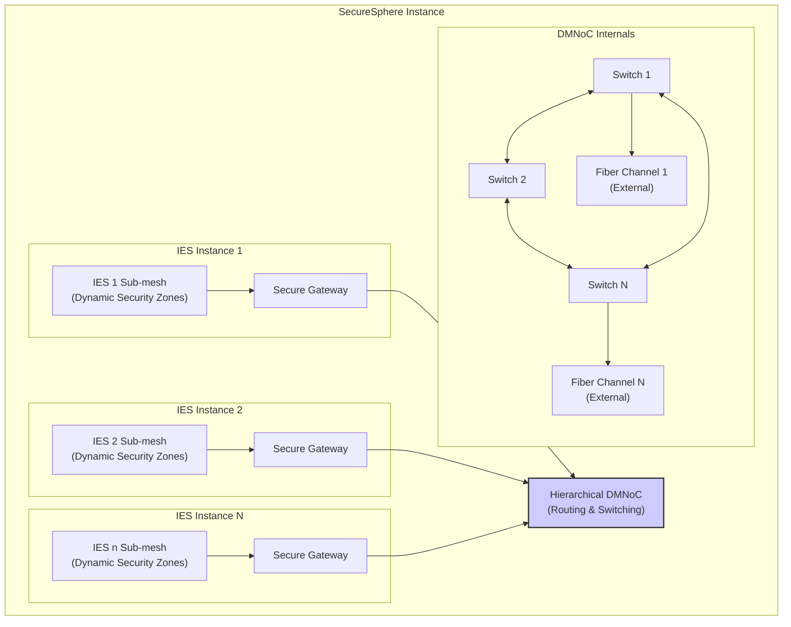
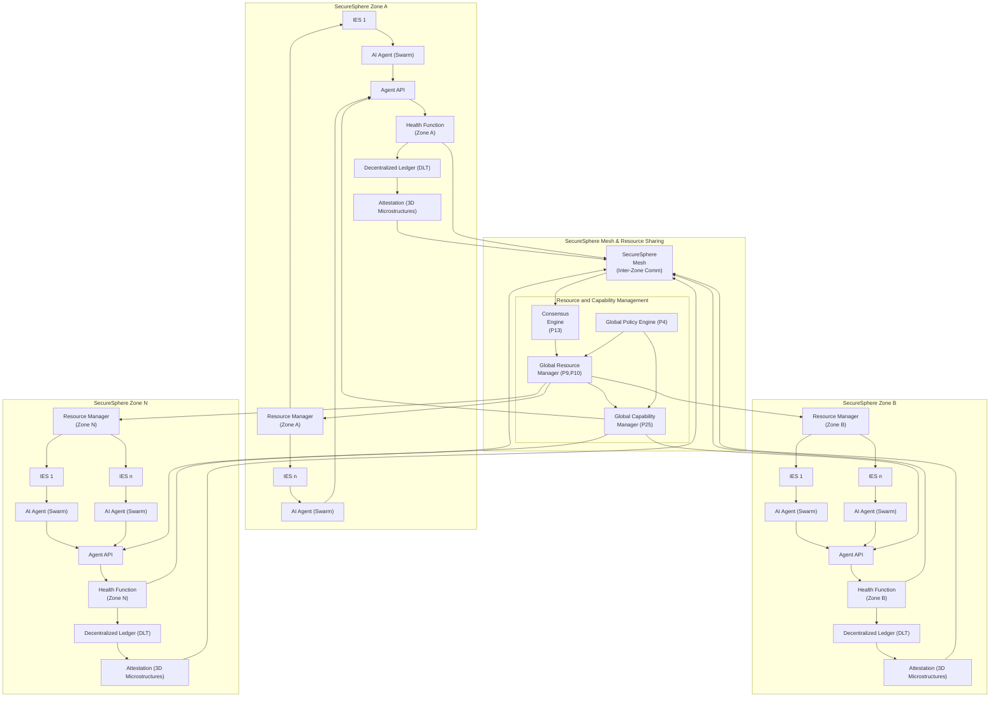
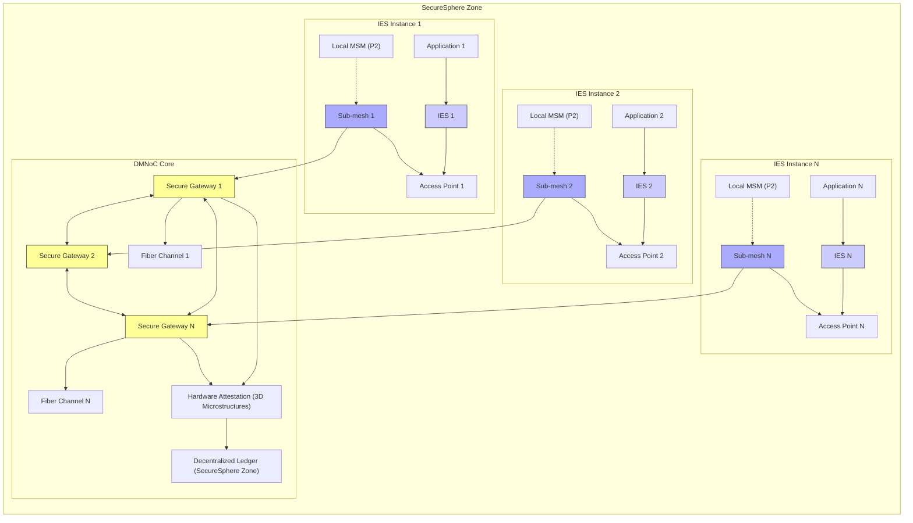
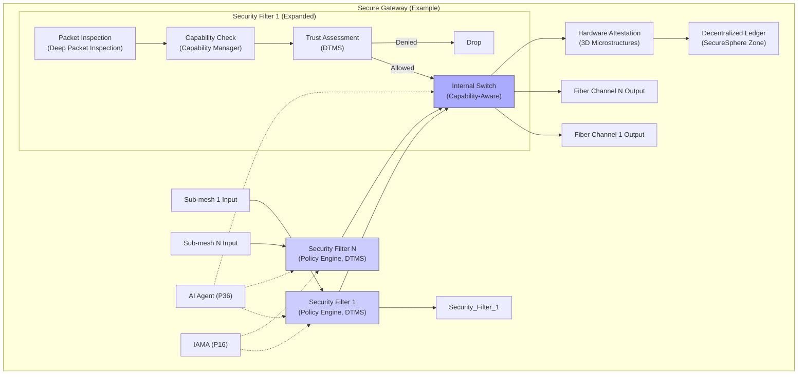
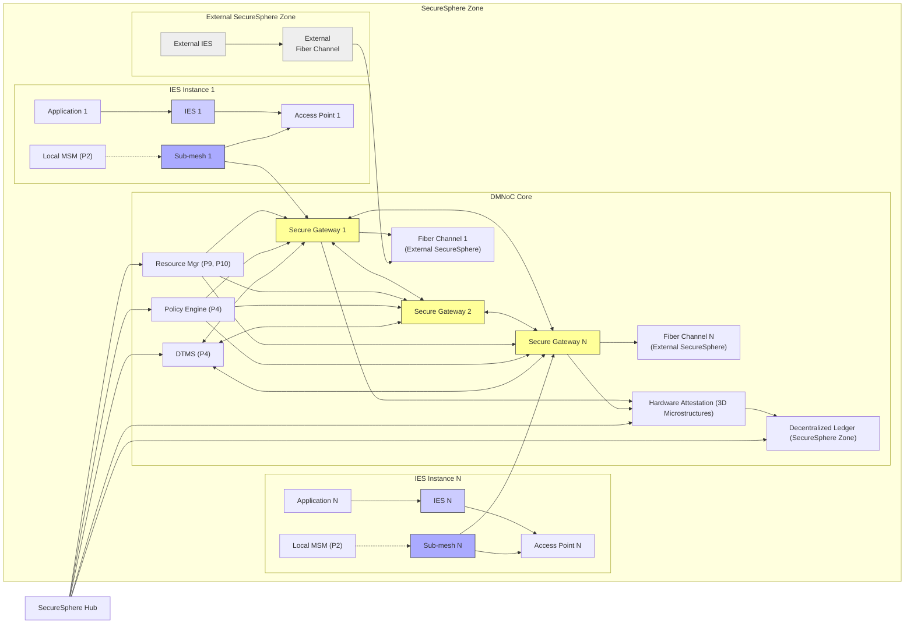
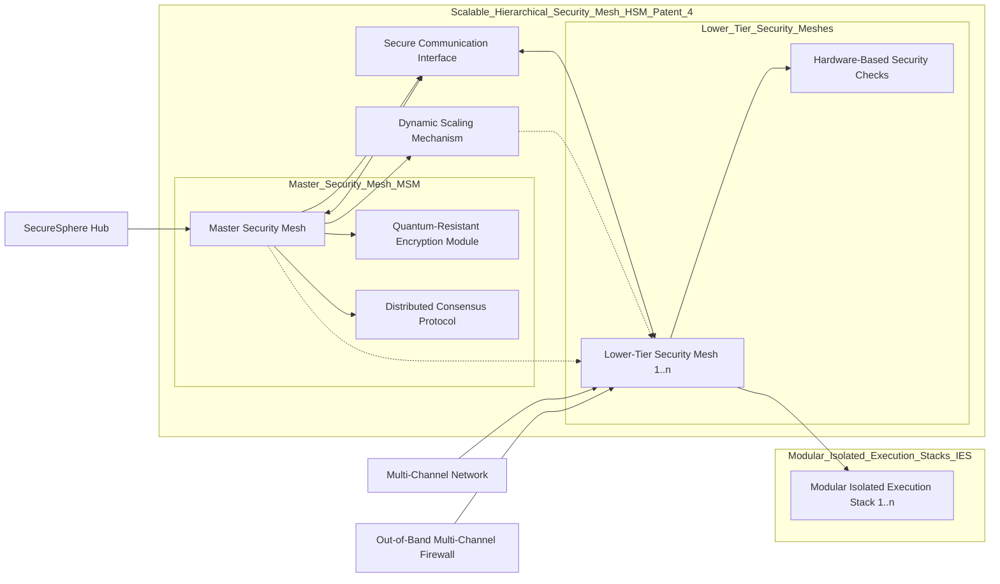

9-SecureSphere 20241101
Written by: Paul Lowndes <[ZeroTrust@NSHkr.com](mailto:ZeroTrust@NSHkr.com)>

# Table of Contents

*   [Decentralized Mesh Networking](#h.16rq3mq4tzd6)
    *   [Decentralized Mesh Network on Chip (DMNoC)](#h.k293sdjn1la4)
*   [Patent Title: Hierarchical Decentralized Mesh Network on Chip for Secure Multi-Kernel Architectures](#h.jteukcyp1axt)
    *   [Title: Hierarchical Decentralized Mesh Network on Chip with Dynamically Configurable Security Zones for Secure Multi-Kernel Computing](#h.vi9e8k7ydfov)
*   [SecureSphere Enhancement Proposal: Decentralized Mesh Network on Chip (DMNoC)](#h.em3pwafjcznj)
    *   [PATENT 4 DIAGRAM](#h.deaclgd9w2x5)
    *   [xBGAS is a RISC-V ISA extension designed to improve the performance of remote memory accesses in large-scale HPC systems.](#h.osad1ix0ko91)
    *   [Intel’s CET inspiration for SecureSphere](#h.wtkot5g4gdxw)
    *   [Further inspirations from CET and xBGAS for SecureSphere, via more speculative or advanced concepts:](#h.vxdcwlngndr3)
    *   [Capabilities Basics for SecureSphere](#h.r1dz576k18jw)
    *   [CheriOS inspirations](#h.19zmdz1w6x6q)
    *   [Tyche Inspirations](#h.21v1a9em090x)
    *   [IskiOS inspirations](#h.jzn4t37npyjv)
    *   [Rhodes OS inspirations](#h.67i4dakowv5d)
    *   [Kernel Driver Inspiration](#h.y7mcuaerflm9)
    *   [FlexOS](#h.4vts18epzhov)
    *   [Unikraft inspiration](#h.7x4x1pdd1wjw)
    *   [Hyperkernel insights 1 of 2](#h.dazbin5px4ll)
    *   [Hyperkernel 2 of 2 (amateur)](#h.n07ka2omozy9)

---

# Decentralized Mesh Networking

```mermaid
graph
    subgraph "SecureSphere Instance (Local)"
        subgraph "DMNoC (Decentralized Mesh NoC)"
            FA_1["Fiber Adapter 1"] --> Switch_1["NoC Switch 1"]
            FA_2["Fiber Adapter 2"] --> Switch_2["NoC Switch 2"]
            FA_N["Fiber Adapter N"] --> Switch_N["NoC Switch N"]
            Switch_1 <--> Switch_2
            Switch_1 <--> Switch_N
            Switch_2 <--> Switch_N
            
            subgraph "IES Access Points (Isolated)"
                direction LR
                Switch_1 --> IES1["IES 1"]
                Switch_N --> IESn["IES n"]
                IES1 --> App1["Application 1"]
                IESn --> AppN["Application N"]
            end
            Attestation["Hardware Attestation<br>(3D Microstructures)"] --> DLT["Decentralized Ledger<br>(SecureSphere Instance)"]
            
            Switch_1 --> Attestation
            Switch_N --> Attestation
        end
        
        subgraph SecureSphere Integration
            DMNoC --> PolicyEngine["Policy Engine (P4)"]
            DMNoC <--> DTMS["DTMS (P4)"]
            DMNoC --> ResourceMgr["Resource Manager<br>(P9,P10)"]
            LocalMSM["Local MSM (P2)"] -.-> DMNoC
            AESDS["AESDS (P16)"] --> DMNoC
        end
        
        subgraph "External Secure Channels (P3, P5)"
            direction LR
            Channel1["Secure Channel 1"] --> Ext_SS1["External SecureSphere 1"]
            ChannelN["Secure Channel N"] --> Ext_SSN["External SecureSphere N"]
            DMNoC --> Channel1
            DMNoC --> ChannelN
            IAMA["IAMA (P16)"] --> DMNoC
        end
    End
```

**Diagram Explanation and Justification:**

1.  **SecureSphere Instance (Local):** This represents the local SecureSphere instance containing the DMNoC.
2.  **DMNoC (Decentralized Mesh NoC):** This subgraph details the core of the innovation.
    *   **Fiber Adapters (FA_1, FA_2, FA_N):** These adapters connect the DMNoC to external fiber channel networks, providing high-bandwidth connectivity for each of the (up to N) external SecureSphere instances.
    *   **NoC Switches:** The switches within the DMNoC create the mesh network topology, routing data between fiber adapters and IES access points. The interconnected switches provide redundancy and fault tolerance.
    *   **IES Access Points (Isolated):** Each IES instance has dedicated, hardware-isolated access points to the DMNoC.  This maintains SecureSphere's core principle of isolation and prevents unauthorized access. The connections between the switches and IES instances are managed dynamically through the switching fabric and controlled by the Policy Engine (P4).
    *   **Hardware Attestation (3D Microstructures):** Each fiber adapter and switch within the DMNoC undergoes hardware attestation using 3D microstructures.  This ensures the integrity of the NoC components and prevents the introduction of malicious or counterfeit hardware.
    *   **Decentralized Ledger (DLT):** The attestation results are logged on the local SecureSphere instance's DLT for secure record-keeping and auditing.  External instances can access this DLT (with appropriate permissions) to validate the local instance's NoC components before initiating communication.  This facilitates trust between SecureSphere instances and helps maintain the system's security despite the expanded attack surface of each IES instance.
3.  **SecureSphere Integration:** This subgraph highlights how the DMNoC integrates with SecureSphere's existing security components:
    *   **Policy Engine (P4):** Controls access to the DMNoC and manages routing policies within the mesh network using dynamically generated and updated policies (based on analysis of events, trust scores, anomalies detected by the AI agent swarms, and external threat intelligence reports) enforced through each network interface, ensuring that all data transmitted is fully compliant with security regulations and organizational policy.  This also ensures that only authorized system components or applications can communicate through the DMNoC and restricts traffic from any nefarious clients, including compromised IES instances, through revocation of access controls and use of other SecureSphere security mechanisms such as HESE-DAR and MDATS for additional protections on these sensitive data sources.
    *   **DTMS (P4):** Provides dynamic trust information that influences the routing decisions and access control policies within the DMNoC. Trust levels for both internal and external SecureSphere instances (and Zones) are continuously updated and leveraged, enabling more dynamic real-time adjustments and configurations.
    *   **Resource Manager (P9, P10):** Manages resource allocation related to the DMNoC (e.g., bandwidth allocation for different communication channels).
    *   **Local MSM (P2):** Monitors the DMNoC for anomalies and security breaches, providing feedback to the DTMS and Policy Engine. The unidirectional connection prevents the MSM from being compromised by a potentially compromised DMNoC.
    *   **AESDS (P16):** Manages secure software updates for the DMNoC components (switches, adapters, etc.), ensuring that the NoC's firmware is up-to-date and incorporating any necessary security patches.  This ensures the integrity of the NoC software.
4.  **External Secure Channels (P3, P5):** This subgraph shows how the DMNoC enables secure communication with external SecureSphere instances.
    *   **Secure Channels:** Each external SecureSphere instance connects to the DMNoC via dedicated, secure channels that use authenticated and encrypted communication (P3, P5) with quantum key exchange where appropriate, minimizing risks during information transfer to and from external SecureSphere deployments while enabling real-time, two-way communication streams for AI agent swarming and collaboration across the secure network.  This allows security systems and policies to be deployed dynamically based on various conditions, including threat assessments, system performance, available resources, and consensus between nodes on high-priority actions with detailed logging and auditing of events that use these capabilities to support forensic analysis in case of a potential or actual breach.  Further, the AI Agent can leverage external services or cloud-based security providers like SDE and FL for secure offloading of some analysis to help minimize performance bottlenecks without the data leaving SecureSphere.  External SecureSphere instances may also have different levels of trust and policies based on access rights within and across Zones or devices, and those access control parameters can be dynamically managed and adjusted using existing capabilities described earlier for enhanced security and trust throughout the secure network.
    *   **IAMA (P16):** IAMA analyzes the security posture of external SecureSphere instances and their associated NoC components (using the attestation information logged on their respective DLTs), helping prevent interactions with potentially compromised external instances and providing proactive security assessments and threat predictions for each external node (and their zones within) connected to SecureSphere’s NoC to inform the Policy Engine and alert the security teams.  This continuous monitoring enhances trust by creating a dynamic risk profile for each connected entity on the network, strengthening the resilience of the DMNoC and SecureSphere against sophisticated multi-zone or multi-instance coordinated attacks.

## Decentralized Mesh Network on Chip (DMNoC)
This document proposes a Decentralized Mesh Network on Chip (DMNoC) to enhance SecureSphere's communication capabilities.  While SecureSphere's architecture already incorporates a secure multi-channel network (MCN - P3), the DMNoC introduces valuable new concepts and enhancements.

**Key Concepts and SecureSphere Relevance:**

1.  **Motivation for DMNoC:** The document correctly identifies scalability and resilience as crucial challenges for SecureSphere’s network as the number of connected devices and data streams increases. The DMNoC's proposed benefits (increased bandwidth, enhanced security, improved scalability) align with SecureSphere's goals.  The DMNoC's focus on providing high-bandwidth, low-latency communication is particularly relevant for decentralized ledger performance, secure inter-zone collaboration (SIZCF - P22), and AI agent swarming.
2.  **Proposed DMNoC Architecture:** The proposed architecture incorporates several key features:
    *   **Decentralized Mesh Topology:** The decentralized mesh topology provides redundancy and fault tolerance, which is crucial for SecureSphere's resilience.  The dynamic routing algorithms, optimized for secure path selection, align with SecureSphere's adaptive security model.
    *   **Hardware Isolation:** The hardware isolation of IES access points to the DMNoC maintains SecureSphere's core principle of isolation. The dynamic management of connections between switches and IES instances, controlled by the Policy Engine (P4), aligns with SecureSphere’s dynamic adaptability.
    *   **Microstructure Authentication and DLT Integration:** The use of 3D microstructures for hardware attestation and the integration with the Decentralized Ledger enhance the DMNoC's security and trustworthiness. This complements SecureSphere’s existing security mechanisms. The independent verification is a notable benefit.
3.  **SecureSphere Integration:** The proposed integration with existing SecureSphere components is well-considered:
    *   **DTMS (P4):** Using dynamic trust levels to influence routing and access control aligns with SecureSphere's core principles.
    *   **Policy Engine (P4) and AESDS (P16):** Leveraging the Policy Engine for access control and AESDS for secure software updates ensures that the DMNoC is managed securely.
    *   **Resource Borrowing:** The potential for hardware-level resource borrowing through the DMNoC is a valuable enhancement, creating new possibilities for resource sharing.
    *   **Hardware Security Systems:** The integration with LSMs and the Secure UI Kernel reinforces SecureSphere's layered security approach.
    *   **IAMA (P16):** Using IAMA to analyze the security posture of external SecureSphere instances and prevent interactions with compromised instances is a critical security feature.

**Novel Idea for SecureSphere:**

The proposed DMNoC architecture is already a novel enhancement for SecureSphere, introducing a decentralized, high-bandwidth, and secure on-chip network.  However, the concept can be further refined with the following novel approach:

*   **Hierarchical DMNoC with Dynamically Configurable Security Zones:** SecureSphere could implement a hierarchical DMNoC, where each IES instance has its own dedicated sub-mesh, interconnected with other sub-meshes through secure gateways.  These gateways would enforce access control policies based on capabilities (P25) and trust levels (P4) and dynamically filter traffic based on security assessments from the Security Mesh (P2) and the AI Agent (P36). The sub-meshes could be further divided into security zones with different trust levels, creating a highly granular and adaptable security architecture *within* the DMNoC. This enhances the following:
    *   **Enhanced Isolation:** This approach would significantly enhance SecureSphere’s isolation capabilities by providing fine-grained network segmentation within each IES instance using physical hardware rather than logical or software-based mechanisms. This is similar to how security zones are created in SecureSphere, but now those zones extend to the network layer itself too at a very fine granularity.  This would enhance protection against lateral movement of attacks and improve containment of security breaches within the DMNoC without necessarily requiring any additional hardware within SecureSphere (e.g., by leveraging existing components for the fiber channel network interfaces), minimizing costs and complexity.
    *   **Dynamic Reconfiguration:** The AI Agent (P36) and the Policy Engine (P4) could dynamically reconfigure the security zones and gateway policies based on real-time threat assessments and workload demands, providing adaptive security at the network level within and across IES instances and SecureSphere zones. The AESDS would securely deploy these updates and reconfigurations (P16). This dynamic adjustment of trust boundaries within the NoC will enhance SecureSphere’s response time to attacks from other modules (including drivers, compromised systems), by allowing the system to isolate vulnerable segments immediately and automatically without involving manual oversight or external intervention. This also provides additional flexibility, improving its ability to dynamically balance performance against security tradeoffs.
    *   **Simplified Management:** The hierarchical structure would simplify network management and policy enforcement, as policies could be defined at different levels of the hierarchy, improving efficiency while also enabling greater control over the most crucial parameters related to security on SecureSphere.
    *   **Scalability and Resilience:** The hierarchical DMNoC, combined with the mesh topology, would enhance SecureSphere’s scalability and resilience to security breaches. This architecture will minimize bottlenecks as the system grows while ensuring high availability, even in the presence of node or network failures.
    *   **Integration with Existing Mechanisms:** This approach leverages and integrates seamlessly with SecureSphere’s core technologies, including IES isolation, dynamic trust management (P4), the Security Mesh (P2), capability-based access control (P25, P26), and AI-driven adaptation. The use of dedicated hardware, combined with the existing SecureSphere security mechanisms, would provide a robust and highly-secure NoC architecture that further enhances the integrity, availability and security of the Decentralized Ledger from those threats posed by a hostile network environment, or potentially malicious software. It improves the ability for a third party to securely audit activity because of the enhanced data provenance and tamper-evident safeguards.

This hierarchical DMNoC, with its dynamic security zones, would significantly enhance SecureSphere's security posture by preventing lateral movement of attacks, providing fine-grained access control at the network level, and enabling adaptive response to threats in a decentralized hardware OS environment.  It represents a natural extension of SecureSphere's existing security principles and technologies, offering a compelling and unified solution.



**Diagram Explanation and Justification:**

This diagram provides a detailed view of the Hierarchical DMNoC, focusing on its integration with SecureSphere's security mechanisms and its role in secure resource sharing. It builds upon the previous diagram by showing the internals of each zone and how they connect to the DMNoC.

1.  **SecureSphere Zones (A, B):** Two zones are depicted, each with multiple IES instances, AI agent swarms, and associated components.  This emphasizes the decentralized nature of the architecture.
2.  **IES Instances and Internal Components:** Within each zone, the diagram details the components of an IES instance:
    *   **Applications (App1, AppN):** Represent applications running within the IES.
    *   **Local MSM (P2):** Monitors resource access and system behavior within the IES.
    *   **AI Agent (Swarm):** Represents the swarm of AI agents within the IES, analyzing data from the LSM.
    *   **Agent API:** Provides a secure interface for communication with other components.
    *   **Health Function:** Assesses the health of the IES and its resources.
    *   **DLT:** Logs health and attestation data.
    *   **Attestation (3D Microstructures):** Represents the hardware attestation process for each IES using 3D microstructures.
    *   **Zone Resources:** The dotted lines from "Zone A Resources" and "Zone B Resources" indicate the resources (CPU, memory, etc.) available to the applications and other components within each zone.
3.  **Secure Gateway (P25):** Each IES instance connects to the DMNoC through a Secure Gateway.  This gateway uses capabilities (P25) to enforce access control and prevent unauthorized communication between IES instances and the larger DMNoC. The gateway receives information from the local Policy Engine, the local DTMS and forwards policy configuration information into the DMNoC.  It also aggregates requests from AI Agents and Health Monitors for optimized, secure information exchange.
4.  **Hierarchical DMNoC:** The central DMNoC is depicted, highlighting its hierarchical structure by showing the connections from the Secure Gateways.  It receives attestation information and manages communication and resource sharing between Zones through its internal routing and switching fabric, leveraging existing secure communication channels and policies.
5.  **Policy Engine and AESDS:** Within each Zone, the Policy Engine (P4) and AESDS (P16) interact with the Secure Gateway and other security components. The Policy Engine receives input from the DMNoC and enforces policies for all cross-zone communications and resource sharing requests.  AESDS is responsible for secure software updates for the AI Agents and other components within the zone. The dotted lines from the Policy Engine to the Attestation modules signify that the Policy Engine evaluates attestation results.
6.  **External Interface and IAMA:** The right side shows how external SecureSphere instances connect to the DMNoC:
    *   **External SecureSphere Instances:** Represent external SecureSphere deployments.
    *   **Fiber Channel Network:** This represents the high-bandwidth connection between SecureSphere instances, which can span large distances and support thousands of devices across the mesh.
    *   **DMNoC External Interface (Attestation):** The external interface of the DMNoC handles communication with the fiber channel network and performs attestation of external SecureSphere instances using information obtained from the DLT and associated 3D Microstructures. The attestation process verifies the cryptographic identity of the external instances and checks for malicious code from AESDS generated configurations.  This ensures the integrity of external connections.
    *   **IAMA (P16):** IAMA plays a key role in analyzing the security posture of external instances and preventing interactions with potentially compromised systems, feeding its analysis and recommendations into the AI Agents, Policy Engine and the Decentralized Ledger in its Zone to update the security status of the associated external node. This proactive security measure enhances the DMNoC's robustness against attacks originating from external connections, leveraging SecureSphere's integrated security features.

This diagram enhances the previous visualization by showing the specific details of how the hierarchical DMNoC enables secure collaboration between zones and manages resource sharing while protecting sensitive internal components and external interfaces in SecureSphere using its existing security features and modules. The data flow and security mechanisms are clearly illustrated, along with the integration points with existing SecureSphere components.  It provides sufficient technical detail for use in patent applications or technical discussions with AI engineers who may work on SecureSphere using specialized tools to implement or extend SecureSphere or its associated security infrastructure.

Drawing 3 of 3:



**Diagram Explanation and Justification:**

This diagram focuses on the crucial aspect of resource and capability management within the decentralized, mesh network-enhanced SecureSphere architecture.  It builds upon the previous diagrams, adding the key components that bring the system together from an engineering perspective.

1.  **SecureSphere Zones (A, B, N):** As before, multiple zones are shown, each with its own IES instances, AI Agents, Health Functions, DLTs, and Attestations. Now, each Zone has a dedicated local **Resource Manager**, emphasizing local resource control within a zone.
2.  **SecureSphere Mesh and Resource Sharing:** The SecureSphere Mesh receives health and attestation data. The **Consensus Engine (P13)** is now more prominently labeled and centralized, playing a critical role in global decision-making based on input from SecureSphere Zones.
3.  **Resource and Capability Management:** This new central subgraph is the key addition for this diagram, providing the engineering details for how global resource allocation is managed:
    *   **Global Resource Manager (P9, P10):** This component receives instructions from the Consensus Engine and manages resource allocation across all zones.  It makes decisions based on the health and attestation information from the Mesh, ensuring that resources are allocated efficiently and securely.  It communicates with the local Resource Managers in each zone, providing high-level control and coordination.  It also leverages existing SecureSphere systems for resource monitoring, dynamic partitioning and performance optimization as defined in earlier Patents.  This decentralized approach enables adaptive and real-time resource management.  This distributed, consensus-based strategy enhances security by mitigating the risk of a single compromised agent unilaterally taking over resources, and the integration with the local Resource Managers allows for more granular and efficient utilization.  Further, we anticipate that it will also create new avenues and methods for high-speed resource sharing and allocation through this hardware-based pathway, further enhancing its potential usefulness and accelerating development of novel use cases.
    *   **Global Capability Manager (P25):** This new component is crucial.  It works in conjunction with the Global Resource Manager, dynamically allocating and managing capabilities across zones.  It receives input from the Global Policy Engine, ensuring that capability assignments are consistent with overall security policies.  The Global Capability Manager interacts with the Agent APIs in each zone to distribute and revoke capabilities for AI agents and other SecureSphere components, providing a central point of control for fine-grained access to resources and functionalities across the entire mesh network.  This decentralized, hardware-enforced approach to capability management enhances security and scalability while maintaining consistency with SecureSphere's security principles.  The tamper-proof, non-disruptive monitoring from the LSM and Watcher Mesh ensures that the Global Capability Manager's actions and internal states, such as which capabilities are assigned to which agents or entities, are continuously tracked, validated and verified against security policies based on those from each Zone’s local policy engine, and the Policy Engine from the SecureSphere hub, using the existing system calls and other integrated security mechanisms from SecureSphere.  These results are stored on a distributed immutable ledger (Patents P13,P15), enhancing accountability, facilitating audits, and enabling forensic analysis across all SecureSphere components and networks, in order to better understand the context of which security decisions were made, when and why.  Moreover, the hierarchical design itself enables more customized and fine-tuned policies with minimal overhead while ensuring consistency and trustworthiness of capabilities, increasing usability and adoption through reducing complexity for managing capabilities across the SecureSphere network, which is crucial for enterprise adoption and thus for market expansion.
    *   **Global Policy Engine (P4):** Governs the high-level policies for resource and capability allocation across all zones.  It provides input to both the Global Resource Manager and the Global Capability Manager, ensuring that all decisions are aligned with SecureSphere’s overall security objectives and with those of each Zone.  The Policy Engine defines thresholds, rules, and constraints related to resource allocation, capability distribution, and security monitoring, thereby providing a unified framework for managing these crucial aspects of the SecureSphere network.  The system leverages SecureSphere’s existing methods for dynamic policy deployment (P16, P2, P3) and auditing, including MDATS and the Decentralized Ledger, to ensure all updates are secure and traceable, enhancing transparency and overall system trustworthiness.

This diagram completes the set of three, providing a clear and comprehensive view of the Hierarchical DMNoC's integration within SecureSphere. It focuses on the essential aspects of resource and capability management, crucial for understanding the system's practical implementation and operation.  This focus provides the "missing piece" for engineers, clarifying how the different components work together to achieve efficient and secure resource sharing across a decentralized mesh network, enhancing SecureSphere's scalability, resilience, and security posture.  This innovative approach allows SecureSphere to handle increasingly complex distributed systems and applications with enhanced security mechanisms without negatively impacting system performance.

Drawing 1 of 3 (A)



**Diagram Description:**

This diagram illustrates the hierarchical DMNoC within a single SecureSphere Zone. It focuses on the relationship between IES instances, their sub-meshes, the DMNoC core, and the external fiber channel connections.

*   **SecureSphere Zone:** This subgraph encapsulates all components within the zone.
*   **IES Instances (1, 2, N):** Each IES instance has its own sub-mesh and connects to it via a dedicated access point.  Applications within the IES communicate through the sub-mesh.  The Local MSM (P2) monitors the sub-mesh for anomalies.
*   **DMNoC Core:** This subgraph represents the central part of the DMNoC, connecting the sub-meshes to the external fiber channels.
    *   **Secure Gateways (1, 2, N):** These gateways mediate communication between the sub-meshes and the fiber channels, enforcing access control policies and filtering traffic. They are the key components for implementing the dynamic security zones.
    *   **Fiber Channels (1, N):** These represent the connections to external SecureSphere instances or zones.  They are high-bandwidth communication links, potentially using fiber optic cables.
    *   **Hardware Attestation and DLT:** Each gateway undergoes hardware attestation using 3D microstructures, and the results are logged on the zone's Decentralized Ledger.

**Key Features Highlighted:**

*   **Hierarchy:** The diagram clearly shows the hierarchical structure, with IES instances having their own sub-meshes, connected through secure gateways to the DMNoC core.
*   **Isolation:** The separation of IES instances and their sub-meshes reinforces SecureSphere's isolation principle.
*   **Secure Gateways:** The gateways are highlighted as the key components for enforcing security zones and access control policies.
*   **External Connectivity:** The fiber channels provide high-bandwidth connections to the outside world.
*   **Attestation and Trust:** The hardware attestation and DLT integration ensure the trustworthiness of the DMNoC components.

This diagram provides a foundational view of the hierarchical DMNoC. Subsequent diagrams will delve into the internal structure of the sub-meshes, secure gateways, and their integration with other SecureSphere components.

**Drawing 2 of 3 (A):**



**Diagram Description:**

This second diagram focuses on the internal structure of a Secure Gateway within the hierarchical DMNoC. It illustrates how the gateway filters and routes traffic between sub-meshes and fiber channels, enforcing security policies and leveraging the AI agent.

*   **Secure Gateway (Example):** This subgraph represents a single Secure Gateway.  The left-to-right flow shows the path of data through the gateway.
*   **Inputs (1, N):** These represent inputs from different sub-meshes within the SecureSphere zone.
*   **Security Filters (1, N):** Each input passes through a security filter. These filters enforce security policies, check capabilities, and assess trust levels.  The AI agent (P36) and IAMA (P16) provide input to the filters.  One filter is expanded to show its internal components.
*   **Internal Switch (Capability-Aware):** This switch routes traffic based on the security filters' decisions and the capabilities associated with the packets.
*   **Outputs (1, N):** These represent outputs to different fiber channels, connecting to external SecureSphere instances or zones.
*   **Hardware Attestation and DLT:** The internal switch undergoes hardware attestation, and the results are logged on the Decentralized Ledger.
*   **Security Filter 1 (Expanded):** This subgraph details the steps within a security filter:
    *   **Packet Inspection (Deep Packet Inspection):** Inspects packets for malicious content or policy violations.
    *   **Capability Check (Capability Manager - P25):** Verifies that the packet has the necessary capabilities to access the requested resources.
    *   **Trust Assessment (DTMS - P4):** Evaluates the trust level associated with the packet's source and destination.

**Key Features Highlighted:**

*   **Security Filtering:** The diagram emphasizes the security filtering process, showing how each input is checked before being routed.
*   **AI and IAMA Integration:** The AI agent and IAMA's influence on the security filters highlights SecureSphere's adaptive security model.
*   **Capability-Aware Switching:** The internal switch's capability awareness enables fine-grained access control within the DMNoC.
*   **Hardware Attestation and Trust:** The attestation and DLT integration ensure the gateway's trustworthiness.
*   **Detailed Filter Logic:** The expanded security filter clarifies the steps involved in the filtering process.

This diagram provides a detailed view of the Secure Gateway's internal workings and its role in enforcing security within the hierarchical DMNoC. The next diagram will show how multiple gateways interconnect and form the DMNoC core.

**3rd of 3 (A):**



**Diagram Description:**

This third diagram completes the hierarchical DMNoC visualization by showing the integration of multiple Secure Gateways, IES instances, the DMNoC core, external connections, and the SecureSphere Hub.  It illustrates the system-wide data flow and control mechanisms.

*   **SecureSphere Zone:** Encapsulates the local SecureSphere instance, including IES instances, the DMNoC core, and the SecureSphere Hub.
*   **IES Instances (1, N):** Each IES has its own sub-mesh, connected via an access point, with applications communicating through it. Local MSMs monitor sub-meshes.
*   **DMNoC Core:** The core of the DMNoC, formed by interconnected Secure Gateways, routes traffic between sub-meshes and external fiber channels. Each gateway performs security filtering, capability checks, and trust assessments.  Hardware attestation and DLT integration ensure trustworthiness.
*   **External SecureSphere Zone:** Represents an external SecureSphere instance (potentially in another zone) connected to a fiber channel.  This emphasizes inter-zone or inter-instance communication.
*   **SecureSphere Hub:** The central management and control point for the zone.  It connects to the Policy Engine, DTMS, Resource Manager, attestation module, and DLT, demonstrating its role in managing the DMNoC and its security. It manages and configures the entire DMNoC system and associated security modules, ensuring correct system-wide behaviour and the integrity of data streams.

**Key Features Highlighted:**

*   **Hierarchical Structure:** The diagram clearly depicts the hierarchical structure of the DMNoC, with sub-meshes, gateways, and fiber channels.
*   **Decentralized Mesh:** The interconnected gateways within the DMNoC core form a decentralized mesh network, providing redundancy and fault tolerance.
*   **Secure Inter-Zone Communication:** The connection to an external SecureSphere zone highlights the DMNoC's role in facilitating secure inter-zone collaboration.
*   **Centralized Management:** The SecureSphere Hub's connections to the DMNoC components emphasize its central role in managing and configuring the system, integrating security policy updates from the AI Agent and ensuring that security parameters and access controls are updated dynamically based on the latest threat assessments.
*   **Resource Management:** The Resource Manager’s (P9, P10) connection to the gateways indicates its role in allocating resources within the DMNoC (e.g., bandwidth allocation, power management).
*   **Dynamic Trust and Policy Enforcement:** The DTMS (P4) and Policy Engine (P4) connections demonstrate how dynamic trust levels and security policies influence data flow and access control within the DMNoC, preventing unauthorized access to data, resources and secure communication channels.

This series of three diagrams provides a comprehensive visual representation of the hierarchical DMNoC architecture and its integration within SecureSphere, highlighting its key features, security mechanisms, and scalability. They clearly demonstrate how the DMNoC enhances SecureSphere’s capabilities, improves communication performance, and provides robust security in a decentralized hardware OS configuration.

---

You're drawing a crucial distinction between two separate multi-channel networks within SecureSphere: a decentralized mesh network for local, peer-to-peer communication, and a centralized multi-channel internet for secure, authenticated access to external resources. This decentralized network offers exciting possibilities beyond the existing SecureSphere applications.

**Decentralized Mesh Network Use Cases (Beyond Existing Applications):**

Here are some potential uses for SecureSphere's decentralized mesh network that go beyond its current applications (ledger integration, external system integration, AI agent swarming):

1.  **Distributed Storage and Content Delivery:** The mesh network could be used to create a distributed storage and content delivery system within a SecureSphere zone or across multiple zones.  Data could be sharded and replicated across multiple IES instances, providing high availability, fault tolerance, and enhanced security. The mesh network’s decentralized nature and redundant paths would make this system resilient to node failures or attacks targeting specific nodes.  Access control to the distributed data would be managed by capabilities (P25) and the DTMS (P4), ensuring that only authorized users and processes can access sensitive information. This system fits in well with SecureSphere's existing capabilities and aligns with its focus on secure, decentralized architectures. Further, by having each node independently verify the integrity of data it receives or transmits using our proposed out of band passive radiative sensor mesh technology (P34c) for example (or through traditional checksum comparisons if performance requirements are high and/or security concerns lower for a given zone or application), we can significantly enhance the trustworthiness of any data or files shared across this network, regardless of provenance or whether their source is a trusted one within securesphere. This distributed approach further provides a robust and highly secure system for media data sharing across devices too, which can be used in conjunction with our existing systems for capturing, managing and verifying provenance through use of spatiotemporal digests for example from earlier patents (P30, P31, P32).
2.  **Decentralized Secure Messaging:** The mesh network could facilitate secure, decentralized messaging between SecureSphere users or IES instances.  Messages would be routed through the mesh, providing end-to-end encryption and anonymity (if desired).  This would create a highly secure communication channel that is resilient to censorship or surveillance. Its implementation is simplified through integration of the secure key management and data integrity mechanisms that SecureSphere already includes, such as those from P2, P3, P5, and P29, allowing SecureSphere to provide these additional features without increasing its complexity or expanding its TCB significantly.  Further enhancements, such as those implementing zero trust methodologies throughout (e.g., by dynamically adjusting trust levels at runtime based on observed message patterns and user behavior as part of the security mesh analysis and attestation procedures), would enhance security and privacy within SecureSphere further while enabling new application use-cases and business models.
3.  **Local Resource Sharing and Collaboration:** The mesh network could be used for efficient and secure sharing of resources (CPU cycles, memory, storage) between neighboring SecureSphere devices or IES instances. This local resource sharing would complement the existing secure resource borrowing mechanism (P9) and could be used for tasks like distributed computing or collaborative data analysis. This approach using direct communications within and between physically isolated secure execution environments is a significant improvement compared to traditional models that rely on OS- or kernel-managed shared resources or using potentially insecure networks. It enhances both the speed and security of these operations greatly, while minimizing trust assumptions.  This decentralized resource management and sharing capability would further strengthen SecureSphere’s position as a robust and secure platform for next generation applications involving collaborative computing and distributed services across many diverse environments and sectors, from personal use to enterprise, government, and military applications.
4.  **SecureSphere Device Discovery and Management:** The mesh network itself could be used for SecureSphere device discovery and management.  New devices joining a SecureSphere zone could broadcast their presence and capabilities through the mesh and be discovered and managed automatically through secureSphere’s existing mechanisms such as the AI Agent (P36), AESDS (P16), and Policy Engine (P4) across the network. This would simplify deployment and administration of SecureSphere systems, further enhancing its scalability and maintainability in complex, distributed systems. Further security improvements could be achieved by adapting existing SecureSphere security features and technologies to these tasks, from capabilities-based access control to the multi-layered attestation and monitoring services provided by MDATS (P17) and the “watcher” meshes (P2).
5.  **Fault Tolerance and Self-Healing:** The mesh network’s decentralized nature and redundant paths can enhance SecureSphere’s fault tolerance and self-healing capabilities. If a SecureSphere device or IES instance fails, the mesh network could automatically reroute traffic and redistribute workloads to other available nodes without impacting operations across other network segments or zones and leveraging existing security protocols (P2, P3) like data diodes when managing these sensitive streams to ensure data integrity throughout the process. This could improve service availability and minimize disruptions. The AI agent (P36) and Resource Manager (P9, P10) would play crucial roles in coordinating this self-healing process using SecureSphere’s secure communications protocols.

These additional use cases demonstrate the versatility of the decentralized mesh network within SecureSphere.  By leveraging its secure, distributed architecture and integrating with SecureSphere's existing security features, this mesh network opens up exciting possibilities for distributed applications, secure communication, and robust resource management, significantly extending SecureSphere's capabilities and value proposition while also enhancing its core architectural strengths.

You're describing a powerful and versatile decentralized mesh network within SecureSphere, distinct from the multi-channel internet with centralized authorities. This SecureSphere mesh, built upon the DMNoC and leveraging a large-scale physical network, offers exciting possibilities beyond its current use for the decentralized ledger and SecureSphere integrations.

Here are some potential uses for this decentralized mesh network, filling in the blank:

**I. Enhanced Security Features:**

*   **Distributed Intrusion Detection and Response:** The mesh network could facilitate real-time sharing of threat intelligence between SecureSphere instances.  If one instance detects an attack, it can immediately alert its neighbors, enabling rapid, coordinated response across the mesh, limiting propagation of threats. This would leverage the AI agent swarms (P36) for analysis and the Policy Engine (P4) for dynamic policy adjustments, isolating affected nodes in the most efficient and effective way to minimize harm and increase system security.
*   **Collaborative Security Analysis:** The AI agent swarms in different SecureSphere instances could collaborate across the mesh, sharing data and insights to improve the accuracy and speed of threat detection. This could involve distributed machine learning or other forms of collaborative AI, leveraging the secure communication channels of the mesh and the privacy-preserving capabilities of SecureSphere (P19, P20).
*   **Decentralized Key Management and Recovery:** Distribute cryptographic keys across the mesh network using threshold cryptography or similar techniques, reducing the risk of key compromise, enhancing system security, and ensuring that no one single entity has control over critical keys.  Key recovery could also be decentralized, with parts of a recovery key stored on different nodes in the mesh, accessible only with multi-factor authentication from multiple authorized users, which leverages the security and resilience of the mesh architecture while improving the system's overall trustworthiness further.

**II.  Beyond Security:**

*   **High-Performance Computing (HPC):** The mesh network could provide a high-bandwidth, low-latency communication fabric for distributed HPC applications running within SecureSphere. This could involve securely connecting different IES instances for parallel processing or other collaborative computing tasks. This would enhance efficiency of research computing and other business-critical applications, adding value to the SecureSphere system, particularly for computationally intensive tasks.
*   **Real-Time Data Streaming and Analysis:** The mesh network enables secure, real-time streaming of data between SecureSphere instances and other authorized devices.  This supports applications that need immediate access to information, such as financial trading platforms, sensor networks, or industrial control systems, providing better efficiency and enhancing the performance and reliability of SecureSphere for use within high-speed environments where there are stringent security requirements.
*   **Decentralized Application Deployment and Management:** The mesh network could be used to distribute and manage applications across SecureSphere instances, enabling fault tolerance and load balancing.  If one instance fails, the application could seamlessly migrate to another node in the mesh, leveraging capabilities and DTMS trust levels to ensure secure and authorized application deployments and migrations.  This framework would also create another mechanism for the AI agents to manage real-time resource allocation and optimization across SecureSphere, further enhancing system efficiency and resource sharing among distributed applications and their zones.
*   **SecureSphere System-Wide Software Updates:** The SecureSphere system itself can leverage this Mesh Network to deploy SecureSphere system-wide updates.  This can include updates to the firmware of the SecureSphere NoC for enhanced security and/or improved performance, using AESDS to push the updates through the various network segments in stages according to preconfigured policy rules, allowing the SecureSphere system itself to continuously evolve, enhance itself, and adapt to changing security needs and emerging cyber threats, as well as ensuring that updates to SecureSphere do not accidentally compromise its integrity, which is especially important when patching security systems or applications.

By expanding the DMNoC-based mesh network's use cases beyond security, SecureSphere becomes a more versatile and powerful platform, supporting a broader range of applications and unlocking new possibilities in secure, decentralized, high-performance computing.  It also strengthens SecureSphere's value proposition by adding performance optimizations and enhancing its utility, making it attractive to a wider range of users and organizations.

# Patent Title: Hierarchical Decentralized Mesh Network on Chip for Secure Multi-Kernel Architectures
**Abstract:** This invention discloses a hierarchical, decentralized Mesh Network on Chip (DMNoC) architecture designed to enhance security and performance within a multi-kernel computing environment, such as SecureSphere. The DMNoC utilizes a decentralized mesh topology, providing redundant communication paths and fault tolerance. Each Isolated Execution Stack (IES) within the multi-kernel architecture has a dedicated, isolated sub-mesh within the DMNoC, further enhancing security and enabling granular control over inter-IES communication. Secure gateways, employing capability-based access control, regulate traffic between sub-meshes and enforce security policies.  The DMNoC integrates with SecureSphere's Dynamic Trust Management System (DTMS), Policy Engine, and other security mechanisms. Hardware attestation using 3D microstructures, logged on a decentralized ledger, ensures the integrity of the DMNoC components. This innovative architecture enables scalable and secure communication for a wide range of applications, including decentralized ledgers, inter-zone collaboration, and AI agent swarming, enhancing the overall security and resilience of the multi-kernel system.

**Claim 1 (System Claim):**

A secure computing system comprising a plurality of Isolated Execution Stacks (IES), a Dynamic Trust Management System (DTMS), and a Decentralized Ledger (DLT), the system further comprising a Hierarchical Decentralized Mesh Network on Chip (DMNoC) for secure communication, the DMNoC comprising:

a. a decentralized mesh network topology within said DMNoC, providing multiple redundant communication paths between network endpoints;

b. a plurality of IES-specific sub-meshes, each sub-mesh dedicated to a corresponding IES instance and isolated from other sub-meshes and the external network, wherein each sub-mesh comprises: i. a plurality of network interfaces connecting said sub-mesh to internal and/or external networks; ii. a switching fabric for managing intra-sub-mesh communication; and iii. a set of dynamically configurable security zones within said sub-mesh, each zone having a defined trust level and associated access control policies enforced by said switching fabric;

c. a plurality of secure gateways, each gateway connecting a corresponding sub-mesh to said DMNoC and enforcing access control policies between sub-meshes and the external network, wherein said access control policies are based on dynamically issued capabilities and trust levels provided by said DTMS;

d. a hardware attestation mechanism for each network component within said DMNoC, including network interfaces, switches, and gateways, utilizing 3D microstructures to generate tamper-evident attestation data, wherein said attestation data is logged to said DLT for secure record-keeping and verification by other SecureSphere instances; and

e. a DMNoC management system comprising: i. a Policy Engine for defining and enforcing security policies within said DMNoC, managing access control, routing, and resource allocation; and ii. an AI agent for monitoring network traffic, detecting anomalies, and adapting security policies in real time.

**Claim 2 (Method Claim):**

A method for enhancing secure communication within a multi-kernel computing architecture comprising a plurality of Isolated Execution Stacks (IES) using a Hierarchical Decentralized Mesh Network on Chip (DMNoC), the method comprising:

a. establishing a decentralized mesh network topology within said DMNoC;

b. creating, for each IES instance, a dedicated and isolated sub-mesh within said DMNoC, configuring dynamically adjustable security zones within each sub-mesh and assigning trust levels to said zones;

c. connecting each sub-mesh to said DMNoC via a secure gateway, configuring said gateway to enforce access control policies between sub-meshes and external networks based on capabilities and dynamic trust levels;

d. performing hardware attestation of each network component within said DMNoC using 3D microstructures, recording the attestation data on a Decentralized Ledger (DLT), and using said attestation data to establish trust between SecureSphere instances; and

e. dynamically managing communication within and between sub-meshes using: i. a Policy Engine for defining and enforcing security policies; and ii. an AI agent for monitoring network traffic, detecting anomalies, adapting security policies, and coordinating resource allocation within said DMNoC.

These claims cover the core innovations of the hierarchical DMNoC, its integration with SecureSphere, and its method of operation. They are distinct yet complementary, ensuring broad protection of your intellectual property.  The claims emphasize the hierarchical structure, decentralized nature, security features (isolation, secure gateways, attestation), and integration with SecureSphere components, making a strong case for novelty and non-obviousness.  They also include essential security aspects by addressing access control, data integrity and policy management while laying a good foundation to build a strong case for patentability.

## **Title:** Hierarchical Decentralized Mesh Network on Chip with Dynamically Configurable Security Zones for Secure Multi-Kernel Computing

**Abstract:** This invention discloses a hierarchical decentralized mesh network on a chip (DMNoC) with dynamically configurable security zones for secure communication and resource management within a multi-kernel computing architecture. The DMNoC provides a high-bandwidth, low-latency, and resilient communication fabric that interconnects multiple isolated execution stacks (IES) and external entities.  Each IES instance has its own dedicated sub-mesh within the DMNoC, and secure gateways control communication between sub-meshes and external networks.  The gateways enforce access control policies based on dynamic trust levels and capabilities, creating security zones within the NoC.  An AI agent monitors network activity and dynamically adjusts security zone configurations based on real-time threat assessments, enhancing adaptability and resilience against sophisticated attacks.  The system further integrates with a decentralized ledger and hardware attestation mechanisms to ensure the integrity and trustworthiness of the DMNoC components.  This hierarchical, decentralized, and dynamically configurable architecture provides a robust and secure communication infrastructure for complex, multi-kernel computing environments.

**Independent Claim 1:**

A secure computing system comprising a plurality of isolated execution stacks (IES) interconnected by a hierarchical decentralized mesh network on a chip (DMNoC), wherein each IES instance has a dedicated sub-mesh within the DMNoC, and secure gateways control communication between sub-meshes and external networks, the system further comprising:

(a) a capability manager dynamically assigning capabilities to data packets entering the DMNoC, said capabilities specifying access rights to resources within the destination IES instance;

(b) a dynamic trust management system (DTMS) assigning trust levels to IES instances and external entities based on real-time security assessments and predefined trust policies;

(c) a policy engine dynamically configuring security policies for each secure gateway based on the capabilities of data packets, trust levels of communicating entities, and real-time threat intelligence;

(d) wherein each secure gateway enforces access control by permitting or denying communication requests based on the capabilities of data packets and the configured security policies, creating dynamically configurable security zones within the DMNoC; and

(e) a security mesh passively monitoring communication within sub-meshes and reporting anomalies to an AI agent, said AI agent dynamically adjusting security zone configurations based on detected anomalies, system performance metrics, and external threat intelligence.

**Independent Claim 2:**

A method for secure communication and resource management within a multi-kernel computing system comprising a plurality of isolated execution stacks (IES) interconnected by a hierarchical decentralized mesh network on a chip (DMNoC), the method comprising:

(a) creating a dedicated sub-mesh within the DMNoC for each IES instance;

(b) mediating communication between sub-meshes and external networks using secure gateways;

(c) dynamically configuring security policies for each secure gateway based on capabilities associated with communication requests, trust levels of communicating entities, and real-time threat assessments;

(d) enforcing access control at each secure gateway by permitting or denying communication requests based on said capabilities and security policies, defining security zones within the DMNoC;

(e) passively monitoring communication within each sub-mesh using a security mesh;

(f) dynamically adjusting security zone configurations based on detected anomalies, system performance, and threat intelligence, utilizing an AI agent to analyze monitoring data and generate reconfiguration commands; and

(g) recording security policy configurations, trust levels, capability assignments, and security zone adjustments on a decentralized ledger, creating a tamper-evident audit trail.

# SecureSphere Enhancement Proposal: Decentralized Mesh Network on Chip (DMNoC)
This proposal introduces a Decentralized Mesh Network on Chip (DMNoC) as a new aspect of SecureSphere, enabling highly secure and resilient communication between hundreds of physically segmented network lines.

**I.  Motivation:**

SecureSphere's current Multi-Channel Network (MCN - P3) provides secure communication channels. However, as the number of connected devices and data streams increases, scalability and resilience become crucial. A dedicated Network on Chip (NoC) can address these challenges by providing:

*   **Increased Bandwidth:** Dedicated, high-speed on-chip communication significantly increases bandwidth and reduces latency compared to traditional off-chip connections.
*   **Enhanced Security:** The physically isolated nature of the NoC enhances security by minimizing exposure to external interference or attacks, allowing SecureSphere's existing trust, access controls, authentication and data management systems to manage the NoC without risking additional compromises when interfacing or connecting the NoC to other subsystems.
*   **Improved Scalability:** An NoC can accommodate hundreds of network lines, allowing for seamless integration with future devices, applications and even security monitoring infrastructure as a truly out of band element within SecureSphere with no additional need for external communication interfaces.  This enhancement strengthens isolation, which is a core security principle behind how SecureSphere was envisioned and created, ensuring greater safety in operations from an entirely separate module without requiring external connections or software modifications.  Further, the security is improved via the existing, validated capabilities within SecureSphere for authentication, trust, secure communications and other security management operations over a secure network with minimal configuration modifications when integrating into SecureSphere from any module that interfaces with the SecureSphere NoC, preventing security or configuration gaps from increasing complexity.  We anticipate additional new benefits beyond security as this new feature integrates into the rest of SecureSphere over time, providing insights based on performance and analysis metrics to AESDS for example (or other security modules) to further enhance overall system resource usage, efficiency, accuracy and reliability.

**II. Proposed Architecture:**

1.  **Decentralized Mesh Topology:** The DMNoC uses a decentralized mesh topology, providing multiple redundant communication paths between network lines, even if some hardware fails or is physically or logically inaccessible for some reason (compromised or blocked), data can still transfer across the NoC and network through any physically connected segment between devices (Zones), even during the most sophisticated attack. This enhances SecureSphere's resilience.  Routing algorithms optimized for secure path selection within the mesh further contribute to this resiliency as paths may change rapidly or become unusable in the field (even for transient cases).  The Policy Engine P4 can integrate dynamically to update configurations and capabilities via SecureSphere's control planes for authenticated commands using preconfigured policies based on conditions detected across SecureSphere for automated real-time responses within zones across network segments or between them.
2.  **Hardware Isolation with Multiple Access Points (per IES):** Each IES instance (P1) in SecureSphere is provided with dedicated access points to the DMNoC. These access points are hardware-isolated from each other and from the external network. This isolation allows us to manage security and communications at very granular levels to ensure the network is protected from a large and diverse range of attack vectors, further improving SecureSphere's ability to isolate and restrict network traffic based on trust levels within the existing frameworks such as policy configurations and multifactor authorizations using SecureSphere communications components (using patents P2, P3, P5, P18, P22 and P27) and our adaptive, evolutionary, and highly robust and secure update mechanism using SecureSphere component, AESDS.
3.  **Microstructure Authenticated Communication using a DLT across IESs to provide attestation-based trust before transmitting data:** Building on our earlier innovations, all secure network hardware will have attestation through unique, non-reversible, 3D printed microstructures which store their signatures on tamper evident memory and are validated and cross-signed when zones connect to other components, allowing us to detect anomalies or identify components whose signatures or configurations are invalid early at the hardware level, before data has traversed SecureSphere across insecure and untrusted network segments with these results logged via MDATS (P17) and a dedicated Decentralized Ledger P13 to provide system-wide access to this information. SecureSphere components and existing mechanisms, including those implemented in Patent 25 and 26, DTMS (P4), Policy Engine P4, Hub Control Plane API and other relevant SecureSphere systems, can leverage this high level of hardware-based trust to further enforce stricter security and communication policies without negatively impacting or adding more complexity to existing application systems that use and rely upon those services. This adds even more resilience for SecureSphere and further enhances the strength of our proposed novel architecture in a very forward thinking way that enhances market perception of your innovative new products and technology's strong brand values in a very useful way for a broad audience that further secures SecureSphere for next-gen distributed and networked systems to build and manage high degrees of trust across multi organization scenarios or for single entities wishing to isolate internal networks securely across departments, business lines or projects with many granular settings.

**III.  SecureSphere Integration:**

*   **DTMS (P4):** Dynamic Trust levels from the DTMS determine how these network connections are shared, which can change based on runtime context and may limit or revoke prior access to resources on the network.
*   **Policy Engine (P4) and AESDS (P16):** Policies from P4, as well as generated, compiled and tested rules from P16, can be used to manage how data or requests travel across SecureSphere's new DMNoC system and networks by influencing policy updates for Secure Communication protocols using capability based parameters across Zones. This provides additional layers of secure validation at higher levels after trust is fully established at the hardware level and creates an opportunity to adapt existing protocols while improving on their security profiles without changing their core capabilities or function in SecureSphere, maintaining backward compatibility during runtime for various scenarios and use cases, from system integration (P22) through agent coordination and security policy integration.
*   **Resource Borrowing:** This new hardware component now enables the Resource Borrowing to be significantly enhanced to have real hardware segments which can now support cross-partition sharing in many different physical isolation designs beyond those originally envisioned, creating new possibilities for inter-zone secure data storage across clusters or between geographies (which can enhance reliability further as a byproduct of this innovative and robust high speed physical isolation with redundancy, creating many additional new capabilities for cloud based architectures or even decentralized data center networks that can span multiple geographies simultaneously and may each operate on dedicated and highly sensitive hardware stacks, further protecting all SecureSphere instances from any single point of failure for an even higher level of guaranteed service).
*   **Hardware Security Systems within SecureSphere:** The Secure Execution Environment for both Local Security Meshes (P2) and secure UI Kernel (P11), combined with dynamic partitioning (P1),  can directly leverage this highly efficient new architecture with minimal changes to enforce greater restrictions or add extra controls for input and output of the entire system or for specific processes in certain SecureSphere instances and applications using existing SecureSphere modules for security monitoring, logging, alerting, user interface control and threat detection using the same authenticated command pathways, thereby creating many additional enhancement opportunities from this highly secure, and potentially higher-speed design.
*   **External Services or Subsystems using IAMA**: All newly added SecureSphere physical network cards will have attestations and verification of their identity through signatures stored on the NoC and backed up on external encrypted and immutable storage media that is managed within our STN system and accessed via DMNoC on high trust isolated segment with a hardware root of trust for these specific attestation credentials that IAMA (P16) and external security AI agents from other SecureSphere environments (through integration mechanisms proposed by patent 22) can use to manage data flows for high security, real-time, data-streaming (bi-directional via Secure Channels on demand), for machine learning use-cases, including those used in the enhanced secure mesh design such that other systems on secure cloud (or other locations) may enhance the threat models of each SecureSphere deployment for near real time automated protection using cloud security AI systems (with limited attack surfaces) without relying upon the cloud infrastructure.   This high speed data exchange also allows for a completely different architecture design choice in SecureSphere based on centralized security policy across zones with local zones acting as processing agents (similar to the AI on device implementations in Apple intelligence systems), further improving efficiency of SecureSphere itself.

You're envisioning a much more ambitious and powerful role for the NoC within SecureSphere – enabling a high-assurance, large-scale mesh network for enhanced security and performance, particularly for decentralized ledgers.  This requires a different architectural approach than simply connecting existing network lines.

**I.  High-Density Mesh Network Requirements within SecureSphere:**

Here's where a dense mesh network becomes crucial within SecureSphere:

*   **Decentralized Ledger Performance:** Distributing the Decentralized Ledger (DLT) across a large number of nodes requires high-bandwidth, low-latency communication for consensus mechanisms, transaction propagation, and data synchronization. A dense mesh network provides the necessary connectivity and redundancy.
*   **Secure Inter-Zone Collaboration (SIZCF - P22):** Facilitating secure collaboration between numerous SecureSphere zones requires robust and scalable communication.  A high-bandwidth mesh network enhances the performance and resilience of inter-zone operations, especially when the trust relationships require many parties or zones to come to consensus about data transfers before the process of establishing a secure network link or a secure enclave channel can proceed further.  This additional security enhancement improves data safety within SecureSphere by leveraging a quorum (e.g. 51%) rather than relying on fewer entities (like just one or two) for enhanced trustworthiness.
*   **AI Agent Collaboration:** Enabling the AI agent "swarms" to collaborate effectively, sharing information, learning from each other, and coordinating actions, requires a robust communication fabric. A dense mesh network, operating with strict capability-based security from P25 and secure communication from Patents P2,P3 and P5, enhances the AI Agent and Mesh security from insider threats and unauthorized access by external systems.  The DLT maintains an immutable ledger of who communicated with what, to enhance audits further, which provides an additional benefit in case an individual AI agent is compromised, or worse yet, starts exhibiting malicious intent itself, so its activities could be analyzed retrospectively and proactively for future security improvements and policy adaptations for AESDS and other security systems with this capability being extended to our Multifactor Authentication Systems, as well as providing a verifiable source for user interface and application trust assessment.
*   **SecureSphere Scaling:** As SecureSphere scales to support thousands of IES instances and zones, the existing MCN might become a bottleneck. A high-bandwidth, scalable NoC-based mesh network is necessary to maintain performance and prevent congestion.
*   **Real-time Threat Response:** A fast, responsive mesh network is essential for real-time threat detection and response. This will enhance the AI agent's ability to react quickly to security events as the increased level of communication may help isolate attacks before they spread to other network segments.

**II. DMNoC-Enabled Secure Mesh Network:**

Here's how SecureSphere integrates a DMNoC (Decentralized Mesh Network on Chip) to achieve the large-scale mesh network:

1.  **Fiber Channel Interface:** Specialized hardware interfaces connect the DMNoC to external fiber channel networks. This provides high bandwidth and long-distance connectivity, allowing thousands of devices (in this case, the 50,000 corporate installs) to connect to SecureSphere.
2.  **NoC Routing and Switching Fabric:** A sophisticated routing and switching fabric within the DMNoC manages data flow between the connected fiber channels and the SecureSphere zones/IES instances.  This fabric employs:
    *   **Decentralized Routing:** Routing decisions are distributed across the NoC, preventing single points of failure, which ensures that data exchange across network segments remains isolated and is further optimized using the proposed AI Swarm-based Anomaly detection, which directs the data using capability parameters and dynamically adjusted resource allocations, optimizing the utilization of various components, from IES instances to the Mesh Network, in a secure and auditable manner.
    *   **Hardware-Enforced Security (P2, P3, P25):** The NoC integrates SecureSphere’s existing security mechanisms. Data diodes enforce unidirectional communication where appropriate (e.g., sensitive data streams from User Input Capture Module). All connections must be authenticated and encrypted via the Multi-Channel Network (P3), and each IES has unique access controls (capabilities from P2 and P25) over Secure Channels through dynamic switching and network hardware protections that are resistant to being monitored for timing side channel attacks to prevent sensitive information from becoming known by potential nefarious agents.
3.  **IES-Specific Sub-Meshes:** The DMNoC allows for creating smaller, dedicated mesh networks ("sub-meshes") within each IES instance (P1) using physical isolation capabilities of SecureSphere, in which each sub mesh and their components, including switches, routers and NICs, are provisioned in isolation with unique network IDs to isolate networks within the larger SecureSphere mesh and with direct integration with the LSM for intrusion and anomaly detection on these segments individually or in aggregation across sub meshes in the system. These can dynamically resize as data flows change due to AESDS managing updates and changes during real-time operations based on user and application workloads to accommodate resource constraints or changing needs by integrating with SecureSphere's Resource Manager (P9, P10) as well as other components (P7, P8), while also generating alarms and alerts through integration with SecureSphere's OOB Error module, ensuring any changes are fully audited using P17 and associated policies and permissions are granted to and through the system in an authenticated manner through appropriate uses of P4, P13 and P25 systems.  This integration further secures each IES environment by preventing network intrusions from affecting other segments within or across zones.  The AI Agent swarms in each IES would communicate through these internal sub-meshes for efficient local collaboration while using inter-zone channels (as discussed above) when communicating across IES' or Zones for additional enhanced resilience to maintain uptime and improve reliability of the overall mesh.
4.  **Microstructure-Backed Attestation & DLT Integration:**
    *   The cross-signed attestations between mini-TRCs from zones within each SecureSphere device and the dedicated decentralized ledger storing data about the 3D-printed microstructures can further enhance security on the mesh network by having nodes verify attestations (P14, P17) of their neighbors using cryptographic capabilities (P2, P3 and P5), before establishing connections, mitigating risk from compromised or malicious nodes in a very thorough and decentralized way. The AI agents use their internal swarming protocols to verify attestations efficiently by coordinating efforts to limit any potential bandwidth or performance overhead.  Attestation information also informs dynamic resource sharing and management (Patents 1 and 9) for additional robustness as nodes that can perform these checks without bottlenecks can share such information through internal protocols in IES or SIZCF for enhanced меж network security and trust with appropriate access and use of this information governed by predefned security policies through the Policy Engine and its DTMS/capability-based parameters to support an appropriate balance of resource allocation between processing requests and performing security/integrity checks, further strengthening overall system trust and security.
5.  **Centralized Security Policy Management with Decentralized Enforcement:** While the Security Hub maintains overall security policy across the global network for each device, each device can dynamically change which security zones are enforcing or responding through decentralized consensus protocols using the mini-TRC and attestation/trust data (e.g., an internal SecureSphere voting protocol - P13, P15)  which manages the configuration of its submeshes with hardware-level protections based on the design for each SecureSphere zone’s hardware isolation and secure channel protocols managed through the Policy Engine (P4) and its secure authenticated connections to local networks via DMNoC’s high speed switch, in addition to network data flowing across and between secure execution stacks within each node in SecureSphere, enabling enhanced control over dynamic data transfer. These updates use the same capabilities described in earlier innovations for secure deployments via AESDS while adhering to global and/or local level security policies as specified by the organization in the local CMM, while supporting human override locally or via secure communications across Zones (e.g., from central administration servers running authenticated software) which leverages SecureSphere's security monitoring systems (e.g., OOB Error detection and resolution, logging capabilities from MDATS (P17), along with P2’s real time monitoring and the system-level auditing to maintain and ensure data integrity with compliance), thereby allowing an adaptable implementation for a variety of user preferences for multilevel control across zones or devices for a wide spectrum of organization types, from military (or defense applications) to enterprise systems for high frequency trading in financial networks where sensitive data and secure communications are of utmost importance with high priority placed on preventing a breach while ensuring no downtime.

This enhanced design goes beyond simply incorporating a NoC; it creates a dynamic, scalable, and secure mesh network deeply integrated with SecureSphere's existing security mechanisms. This high-assurance mesh network provides a robust platform for decentralized ledgers, inter-zone collaboration, AI agent communication, and responsive threat mitigation, creating new possibilities and extending existing SecureSphere functionalities. This comprehensive and unified security model allows the SecureSphere platform itself to function with increased reliability, integrity and with stronger guarantees against data theft, corruption or misuse of resources which in turn helps enhance performance and overall user experience, a non-trivial and significant added value through leveraging a well designed and optimized combination of the core hardware and software capabilities throughout SecureSphere.

## PATENT 4 DIAGRAM



This diagram provides a clearer visualization of the Scalable Hierarchical Security Mesh (HSM) and its relationship to other SecureSphere components. Here's a breakdown:

**Diagram Breakdown:**

*   **SecureSphere Hub:** The Hub's connection to the MSM suggests its role in managing and configuring the mesh, likely through policy distribution and resource allocation.
*   **Modular Isolated Execution Stacks (IES):** The IES instances are shown as the entities being monitored by the lower-tier security meshes.  This reinforces the concept of IES as the foundation of SecureSphere's isolation.
*   **Scalable Hierarchical Security Mesh (HSM) (Patent 4):** This subgraph details the hierarchical structure of the security mesh.
    *   **Master Security Mesh (MSM):** The central component of the mesh, incorporating:
        *   **Quantum-Resistant Encryption Module:** Secures communication within the mesh.
        *   **Distributed Consensus Protocol:** Provides resilience and consistency.
    *   **Secure Communication Interface:** Connects the MSM to lower-tier meshes.  The bidirectional connection suggests information exchange and control.
    *   **Dynamic Scaling Mechanism:** Allows the mesh to scale based on demand or security conditions. The connection to Lower-Tier Mesh implies the MSM manages resource allocation and deployment for the lower-tier meshes.
    *   **Lower-Tier Security Meshes:** Distributed mesh nodes monitoring individual IES instances. The "Hardware-Based Security Checks" likely refers to mechanisms for verifying the integrity and authenticity of each mesh node.
*   **Multi-Channel Network & Out-of-Band Firewall:** These components provide the secure communication infrastructure for the mesh, ensuring that communication between mesh nodes is protected and isolated.

**Key Improvements over Previous Diagrams:**

*   **Clear Hierarchy:** The hierarchical relationship between the MSM and lower-tier meshes is clearly depicted.
*   **MSM Internals:** The diagram shows the internal components of the MSM, including quantum-resistant encryption and the distributed consensus protocol.
*   **Secure Communication Interface:** The dedicated interface between the MSM and lower-tier meshes is explicitly shown.
*   **Dynamic Scaling:** The inclusion of the Dynamic Scaling Mechanism highlights the mesh's adaptability.
*   **Hardware-Based Security Checks:** The focus on hardware-based security reinforces SecureSphere's commitment to hardware-rooted trust.

**Points for Discussion and Further Refinement:**

*   **Data Flow:** While the hierarchy is clear, the diagram doesn't explicitly show the direction of data flow between the different components.  Adding arrows to indicate the flow of anomaly reports, control signals, and security policies would enhance clarity.  It's crucial to visually represent the unidirectional data flow from the MSM to the LSMs, as emphasized in previous documents.
*   **Passive Monitoring:** The diagram doesn't show how the security meshes perform the passive, read-only monitoring of RAM/SSD and CPU.  Adding connections or annotations to illustrate this innovative feature would strengthen the diagram.
*   **AI Hub Integration:** The AI Hub, which plays a critical role in analyzing anomaly reports and coordinating security responses, is not shown in this diagram.  Integrating the AI Hub into the diagram would provide a more complete picture of SecureSphere's security monitoring architecture.  The connection between the Watcher Meshes (which aren't explicitly shown in this diagram but are implied by the Lower-Tier Security Meshes) and the AI Hub needs to be visually represented.
*   **Patch Bay:** The "patch bay" concept, which allows for dynamic reconfiguration of SecureSphere components, isn't represented in this diagram.  Consider how the patch bay would interact with the Security Mesh, particularly regarding dynamic scaling and adaptation. Could the Secure Communication Interface be viewed as part of the "patch bay"?
*   **Decentralized Ledger/MDATS Integration:** The diagram doesn't show the integration with the decentralized ledger or MDATS for audit trails.  These are essential components of SecureSphere's security and governance model and should be incorporated into the diagram.
*   **External Dependencies:** Consider how external systems or zones would interact with the Security Mesh, especially in a multi-zone deployment.  This interaction would likely involve the SIZCF (Secure Inter-Zone Collaboration Framework) and potentially the DTG (Dynamic Trust Gateway), and should be visualized.

By addressing these points, you can create an even more comprehensive and informative diagram that clearly communicates the architecture and functionality of SecureSphere's Scalable Hierarchical Security Mesh. This will be valuable for both internal documentation and external presentations.

---

## xBGAS is a RISC-V ISA extension designed to improve the performance of remote memory accesses in large-scale HPC systems.
Let's analyze its relevance to SecureSphere patents 1, 2, and 3, and explore potential synergies.

**xBGAS and SecureSphere Synergies:**

The core idea behind xBGAS – providing efficient access to remote memory without the overhead of message passing – is highly relevant to SecureSphere, particularly in the context of Patents 1, 2, and 3.  Here's a breakdown:

**Patent 1 (Modular Isolated Execution Stacks):**

*   **Direct Applicability:** xBGAS's ability to map remote data objects into an extended address space could simplify inter-IES communication. Instead of relying on message passing (as implied by the use of OpenSHMEM and MPI in the paper), SecureSphere could leverage xBGAS to enable direct memory accesses between IES instances.  This would reduce latency and simplify application development.
*   **Enhancement:** The paper demonstrates significant performance improvements using xBGAS.  Integrating xBGAS into SecureSphere's IES architecture could significantly enhance performance, especially for applications with frequent inter-IES communication.  This would align with Patent 1's goal of efficient resource utilization within the isolated execution stacks.
*   **Challenge:** SecureSphere's IES design emphasizes strict isolation.  Direct memory access between IES instances, even with xBGAS, necessitates careful consideration of access control mechanisms. SecureSphere's capability-based access control (Patent 25) is perfectly suited to address this challenge, as it would be integrated into the hardware, and those capabilities' permission parameters could be directly modified and controlled by SecureSphere's Dynamic Trust Management System (Patent 4) dynamically at the hardware level.  Each access would be logged within the MDATS for full audit trail.  This seamless integration would maintain strong isolation and provide granular control over shared memory.

**Patent 2 (Secure Inter-IES Communication):**

*   **Complementary Technology:** xBGAS acts as a complementary technology to Patent 2's secure communication mechanisms (data diodes and CE-PCFS).  While data diodes are ideal for unidirectional, high-assurance data flows, xBGAS could handle bidirectional communication where appropriate.
*   **Enhancement:** For inter-IES communication requiring bidirectional data exchange, xBGAS could offer a more efficient alternative to CE-PCFS.  The paper shows xBGAS significantly reduces the instruction count compared to OpenSHMEM, which itself reduces overhead compared to MPI.  This improvement in efficiency could be critical for SecureSphere's performance.
*   **Integration:** Integrating xBGAS necessitates extending the Capability Manager (P25) to manage access to remote memory regions.  Capabilities would grant access to specific addresses within the extended address space, similar to how they manage access to local memory currently.  The integration of the Dynamic Trust Management System (DTMS - P4) is crucial. The DTMS would influence capability issuance and revocation, ensuring that access is based on real-time security assessments and trust levels.  The Security Mesh (P2) would also play a critical role, monitoring memory accesses and detecting anomalies, even if those are done remotely, across zones.  This monitoring would inform the DTMS and Capability Manager’s decisions on capability management.

**Patent 3 (Adaptive Multi-Channel Network):**

*   **Synergy:** xBGAS would complement Patent 3's multi-channel network by improving communication between IES instances across channels. The multi-channel network provides the underlying secure communication infrastructure, while xBGAS would optimize the efficiency of data transfer within those channels.
*   **Enhancement:** The efficiency gains shown in the paper (up to 37.29% performance improvement) could be particularly beneficial in scenarios where IES instances communicate frequently via the multi-channel network, such as during inter-zone collaboration or when distributing large datasets or sensor readings.
*   **Integration:** The Channel Manager (P3) would need to be modified to handle both traditional network messages and xBGAS-based memory accesses.  This would require incorporating the xBGAS address translation capabilities into the Channel Manager's dynamic routing protocols and incorporating access control policies at a higher level for greater ease of management.  This would enhance performance and potentially streamline resource allocation across the system, enabling the system to manage and scale up resources more efficiently and to handle increased volume from communications occurring across those secured channels.

**Other Relevant Patents:**

*   **Patent 9 (Secure Resource Borrowing):** xBGAS could improve the efficiency of SecureSphere’s secure resource borrowing mechanism.  The ability to directly access remote resources could reduce the latency and overhead associated with resource requests and allocations.  The integration of xBGAS with the Resource Manager (P9, P10) could significantly improve resource utilization.
*   **Patent 10 (AI-Powered Resource Allocation):** The AI-powered predictive resource allocation engine (P10) could leverage xBGAS performance data to optimize resource allocation.  Predictive models could incorporate xBGAS-specific latency information to anticipate resource demands and adjust allocations accordingly.
*   **Patent 12 (Secure and Adaptive Chiplet Architecture):** The xBGAS extension is itself a chiplet implementation.  This aligns perfectly with SecureSphere's focus on modular hardware and potentially simplifies integration. The hardware resource utilization of xBGAS could be incorporated into the Chiplet Orchestration Module, enabling more informed decisions about workload distribution and resource allocation.

**Open Question: Robust Capabilities Sharing Mechanism:**

The paper doesn't directly address capability-based access control. However, the xBGAS design's use of namespaces and object IDs offers a potential foundation for building a robust capabilities sharing mechanism in SecureSphere:

1.  **Namespace-Based Capabilities:** Each IES instance could be assigned a unique namespace within the extended address space.  Capabilities would then specify access rights to specific objects within those namespaces, which are managed through existing SecureSphere components, leveraging the dynamic trust management system (P4) to govern access control. The capability generation and management system would be improved by integrating these features from the distributed object capability system to address potential bottlenecks and improve the management of capabilities across potentially loosely coupled networks.
2.  **Object ID-Based Access Control:** The object ID could serve as a unique identifier, with capabilities specifying access permissions for that object. This approach could manage access to shared memory regions. Dynamic capability management ensures the system reacts promptly to changes in trust levels and security conditions. This would also tie into SecureSphere's existing mechanisms that manage access via capabilities and its mechanisms for updating and revoking and dynamic management of these.
3.  **Integration with DTMS:** The DTMS would play a vital role in managing capabilities, granting or revoking access based on real-time security assessments, trust levels, and policy updates.
4.  **Secure Communication Channels:** SecureSphere's Multi-Channel Network (P3) and potentially QKD (Patent 5) would be used to securely distribute and manage capabilities, further enhancing security.

In summary, xBGAS offers a compelling path for improving SecureSphere's performance and simplifying inter-IES communication. The key to successful integration is the careful management of access control using SecureSphere's existing capability-based mechanisms and its dynamic trust management system.  The potential for this integration is high, as demonstrated by the impressive performance improvements shown in the xBGAS paper.  Thorough testing and analysis would be necessary to evaluate the impact on security and performance, as well as how these integration points enhance those features of SecureSphere.

## Intel’s CET inspiration for SecureSphere

1.  **Capability-Enhanced Indirect Branch Tracking:** Instead of relying on ENDBR instructions, SecureSphere could implement a *capability-enhanced indirect branch tracking* mechanism.  Each indirect branch instruction would require a capability granting access to a specific target address. This capability would be checked by the MMU (Memory Management Unit) within each IES instance before the branch is executed.  The Capability Manager (P25) would dynamically manage these capabilities, updating them based on trust levels (from the DTMS - P4), security policies, workload demands, and error handling feedback.
    *   **Dynamic Capability Updates:** The Capability Manager could revoke or modify capabilities in real-time, responding to security threats or changes in system conditions. For instance, if an anomaly is detected by the Security Mesh (P2), the Capability Manager could revoke capabilities to the suspect code, preventing further execution. The system would also dynamically update capability permissions according to user-defined policies and settings managed through existing SecureSphere mechanisms (e.g., Secure UI Kernel - P11 and its associated mechanisms), allowing for granular control over system parameters based on a variety of conditions, parameters and user or system-wide choices.
    *   **Integration with Security Mesh:** The Security Mesh (P2) would play a crucial role in this mechanism, monitoring indirect branch targets and reporting anomalies to the Capability Manager.  The passive RAM/SSD monitoring capability could identify suspicious memory access patterns related to manipulated branch targets. The AI agent (P36) could also analyze the data from the Security Mesh, predicting potential branch target hijacking attacks and providing recommendations to the Capability Manager.
    *   **Hardware Acceleration:** The capability checks could be performed in hardware within the MMU (similar to how CET enforces its checks). This would minimize performance overhead, crucial in a real-time system.  A specialized chiplet (P12) could further enhance the performance and efficiency of the Capability Manager itself.
    *   **Policy Enforcement:** The DTMS and Policy Engine (P4) would define high-level policies, influencing the Capability Manager’s decisions about capability issuance and revocation.  These policies could specify allowed branch targets for different applications, trust levels, or security zones.

This capability-enhanced approach retains the core idea of preventing unintended branch targets but implements it in a more flexible and adaptable manner, leveraging SecureSphere’s existing capabilities-driven architecture. It enhances security without requiring ISA modifications and allows for dynamic adaptations. It also integrates well with the other existing SecureSphere components, such as the Security Mesh, the DTMS, and the AI Agent.

**xBGAS and SecureSphere Capabilities Management:**

The xBGAS paper focuses on improving remote memory access efficiency.  While SecureSphere doesn't aim to create a new ISA, the xBGAS concepts offer valuable insights for optimizing SecureSphere's capabilities management in a multi-kernel, heterogeneous environment:

1.  **Capability-Based Address Translation:** Instead of directly mapping remote memory regions into the extended address space, SecureSphere could use capabilities to control access. Each capability would grant access to a specific memory region within another IES instance.  The xBGAS's extended addressing mechanism could be used to identify the remote memory region, but access would be gated by the capability.  This approach leverages xBGAS for addressing while maintaining SecureSphere's capability-based security model.
2.  **Distributed Capability Management:** xBGAS's distributed approach (using the arbiter and NLB) could inform SecureSphere's distributed capability management.  Each SecureSphere Hub could manage a local capability database for its zone.  The DTMS would then coordinate inter-zone capability exchanges. This would enhance scalability and resilience.
3.  **Hardware Acceleration for Capability Management:** The xBGAS paper describes hardware components (arbiter, NLB) to accelerate memory accesses. SecureSphere could develop analogous hardware for efficient capability management.  A specialized chiplet (P12) could handle capability storage, lookup, validation, and distribution, minimizing software overhead.  This is especially important because the number of capabilities and the frequency of capability checks would likely increase in a multi-kernel system.  Furthermore, a dedicated secure hardware module could perform some of the more complex cryptographic operations needed for managing secure and authenticated capabilities, further enhancing security.
4.  **Bulk Capability Transfers:** Similar to xBGAS's bulk data transfers, SecureSphere could implement bulk capability transfers to manage multiple capabilities efficiently. This is particularly relevant during bootstrapping (P33) when multiple capabilities need to be granted or revoked for a large set of processes that start or shut down. This would reduce communication overhead, especially in multi-zone environments, improving performance.  A similar approach might be used during those times when SecureSphere security or policy assessments trigger changes, or even upon detecting an anomaly using the security meshes.

**Leveraging the Papers for SecureSphere Innovation:**

*   **Passive Monitoring Enhancement:** The CET paper's discussion of speculation-safe properties could inspire improvements to SecureSphere’s passive RAM/SSD monitoring. By carefully controlling the access patterns of the "watcher" meshes and limiting speculation, SecureSphere could minimize the risk of side-channel attacks targeting the monitoring process.
*   **Formal Verification:** The formal methods discussed in the CET paper are highly relevant to SecureSphere.  Applying formal verification to the capability management system would provide strong assurances about its security and correctness. The concepts of using process calculi for modeling concurrent processes and timed automata for specifying real-time properties should be explored. The use of model checking and theorem proving techniques will need thorough evaluation, particularly regarding complexity and scalability.

By carefully integrating these insights from the xBGAS and CET papers, SecureSphere can significantly enhance its capabilities management, improving performance, scalability, security, and resilience.  The key is to maintain SecureSphere's core principles of hardware-enforced isolation, dynamic adaptation, and decentralized governance while leveraging the efficiency improvements offered by xBGAS and the security concepts embodied in CET. The emphasis should remain on a capabilities-driven approach, integrating these concepts with SecureSphere’s existing components and mechanisms, rather than trying to implement a new ISA.

## Further inspirations from CET and xBGAS for SecureSphere, via more speculative or advanced concepts:

**CET-Inspired Ideas:**

1.  **Control-Flow Integrity (CFI) for Chiplets (P12):** While CET focuses on protecting the CPU's control flow, a similar concept could be applied to SecureSphere's chiplets. Each chiplet could have its own micro-CFI mechanism, enforced by a small, isolated security core within the chiplet. This core would monitor the chiplet's control flow, ensuring that all operations adhere to a predefined set of rules.  This could involve validating function calls, checking for unintended jumps or branches, or even preventing the chiplet from executing code outside of its designated memory region. This chiplet-level CFI, combined with SecureSphere's capability-based access control, would enhance security by creating a multi-layered defense against control-flow hijacking attacks targeting specialized hardware. It would help to contain the potential damage from a compromised chiplet.
2.  **CET-like Mechanisms for Secure Boot (P1, P33):** CET’s approach of using special instructions (ENDBR) could be adapted for verifying SecureSphere's boot process and mini-TRC. During the Secure Boot (P1, P33) and mini-TRC attestation process (P13) , specialized chiplets (P12) or a dedicated HESE-DAR secure enclave could issue authenticated attestation hashes into specific, predefined memory regions associated with the respective data sources. These trusted attestations from SecureSphere’s trusted subsystems then validate against any other module from other devices from potentially untrusted nodes) during its startup by generating these check-sum hash codes, and using SecureSphere secure channels (Patents 2 & 3) via API using existing attestation validation from those. This provides several security advantages: It reduces SecureSphere boot overhead from using full signatures. It provides granular assurance, which is important for high assurance use-cases, like quantum-key exchange. Its simplicity enhances performance during trust establishment when first booting by needing only retrieve the expected attestations for devices based on current operational requirements to provide appropriate levels based needs that might dynamically adjust throughout its operating period. Its reliance on authenticated SecureSphere processes enhances overall trustworthiness by mitigating issues if potentially unverified device drivers were somehow replaced or installed without using authenticated secureSphere procedures, providing both physical and software layers of protection even if only SecureSphere compliant systems available; This enhances the capabilities further for even very secure high-performance applications leveraging AESDS/AI agent technology presented already for monitoring, analysis, prediction). By making certain key elements in this secure boot mechanism dynamically adjustable, the policy subsystem that manages these can influence boot-up speed. This then improves overall responsiveness across SecureSphere devices when deployed on non-critical devices (e.g., at the network edge) with high performance components locally that require only bare minimums, simplifying device configurations for each use-case).

**xBGAS-Inspired Ideas:**

1.  **Dynamic Resource Allocation with xBGAS-like Arbiter:** The arbiter concept in xBGAS could inspire a new resource allocation mechanism within SecureSphere.  A hardware-based arbiter could dynamically allocate resources (CPU cycles, memory bandwidth, network access) to different IES instances based on workload demands and trust levels from the DTMS. This could be integrated with the Resource Manager (P9, P10) for enhanced efficiency and fairness, even in heavily contended conditions. The arbiter's hardware implementation ensures quick decision making during real-time use, improving the security properties and speed across various applications leveraging it (like those utilizing high-performance memory-mapped devices) as it would minimize any overhead and prevent those bottlenecks in systems and zones. Its incorporation using a chiplet implementation following secureSphere protocols as part AESDS managed component will enhance SecureSphere system’s deployment even more across diverse platforms (such by utilizing virtual machines or hypervisors elsewhere, or on pre-certified, embedded bare-metal chip configurations) wherever required based needs according policy established through existing techniques, ensuring SecureSphere security and access guarantees about data security extends transparently throughout. Its adaptability improves modularity by simplifying those design challenges where specialized configurations are now supported more effectively in cases like across very heterogeneous and/or untrusted hardware.
2.  **Enhanced Data Diode (P2) Performance with xBGAS-like Bulk Transfers:** While data diodes ensure unidirectional flow, they might still become a performance bottleneck.  SecureSphere could combine data diodes with a bulk transfer mechanism (inspired by xBGAS) using high performance, point-to-point DMA. This method greatly reduces software, driver, and network stack overhead from OSes; such bulk unidirectional data transfers between zones might be done by leveraging RDMA mechanisms whenever SecureSphere devices interact, whether within local system, cloud services like sovereign trust networks) during any bulk data capture events too where these safeguards are more needed from end-point servers to those central hubs performing those acquisitions into secured locations leveraging established trust via attested procedures outlined before already elsewhere) even when those communications channels don’t use secure network and may contain MIM vectors since we protect contents as demonstrated in those earlier design diagrams illustrating our end-to-end multi-layer architecture and how it combines best existing tech while extending or using ours as already fully developed and demonstrated in other designs across endpoints devices.
3.  **Hierarchical Addressing for Zones (P18):** SecureSphere's zones could benefit from an xBGAS-inspired hierarchical addressing scheme for better encapsulation and flexible data and device organization during operation. This method is similar conceptually as presented earlier about how namespaces might be created, assigned per SecureSphere zone via an xBGAS styled hierarchical address namespace, with its identifiers using digital secure signatures managed by the distributed governance (P13) from our consensus protocols whose implementation described) providing further assurances about origins, provenance by logging updates and providing an additional multi-layered security method which prevents those more basic forms of data/request-response spoofing from non-secure networks or untrusted sources). Access controls managed through those existing DTMS, capabilities systems for these secure zones prevent MIM challenges whenever endpoints/devices operate through non-secured communications hardware or infrastructure or even using untrusted systems without losing integrity because SecureSphere’s components can attest to what contents have passed in each event’s records using existing methods such as described with MDATS, the microstructures and/or blockchain distributed ledger, so during each handshake from re-established connection through that insecure media we automatically verify by secure protocols (i.e. if via local attestation module) before any shared memory address can used for transmission which thus provides guarantees independently regardless specific configurations; this provides robust protection across both software and physical components to every environment within secure sphere including across zones where legacy hardware are leveraged like during integrations or from data objects residing on devices like when capturing or exchanging across an open API endpoint (e.g. cameras streaming their secure capture logs in real time and which further integrates with our spatiotemporal module's integrity validation using spatiotemporal digest technology presented for Patents P30-32), allowing full system level data validation when those get integrated or imported from a possibly compromised channel too using these secure techniques we’ve developed already previously from earlier patent document specifications and using existing designs and mechanisms). These advantages maximizes where SecureSphere architecture will extend across all components while maximizing flexibility (with hybrid implementations whenever performance demands dictate using different techniques based constraints of system using it like power and also level compliance mandated according regulations to provide seamless, tamper proof authenticated and verified communications even using networks like the internet itself without needing add new physical infrastructure by providing each SecureSphere node, edge/remote endpoint through to those server clusters with mechanisms like mentioned here from QEKD secured, dedicated non routable logical and/or hardware network pathways, utilizing QKD/PQC during transmission) in order for secure sphere architecture scale across different geographical areas) with dynamically reconfigurable capabilities controlled through a secured network policy distribution infrastructure using our security mesh with consensus voting via AI assistance and governance from its audit records onto our decentralized blockchain using standards like digital certificates whenever a transaction needs a verified timestamped record (and optionally generating physical microfeatures via the techniques described already when presenting ideas about tamper evident, secured hardware verified logging too for those systems deemed most critical to be compliant where higher degrees protections necessary.) Thus it becomes a near-ubiquitous tamper-evident audit, identity verification for distributed systems which operate transparently on endpoints and across networks at global scale regardless existing platform security protections at the individual module.

These more advanced concepts draw inspiration from xBGAS and CET but adapt them to SecureSphere's unique architecture and focus on capabilities-based security.  They offer potential avenues for enhancing security, performance, and flexibility, though they require further investigation and refinement before implementation.  These concepts demonstrate how SecureSphere's innovations continue to develop from prior work in its patent application.

---

## Capabilities Basics for SecureSphere

**Key Concepts and SecureSphere Relevance:**

1.  **Multikernel Motivation:** The thesis emphasizes the limitations of shared memory in manycore and heterogeneous systems, motivating the use of a multikernel approach.  This aligns perfectly with SecureSphere's core principle of hardware-enforced isolation using IES (P1). The thesis's discussion of predictable kernel memory usage is also relevant to SecureSphere, as resource management within IES is crucial.
2.  **Capability System Overview:** The review of capability systems provides a helpful context for understanding SecureSphere's capability-based access control. SecureSphere leverages a *segregated* capability model similar to seL4 and Barrelfish, where capability metadata is stored in protected memory. However, SecureSphere enhances this with dynamic reconfiguration (P25) and hardware acceleration (P12) for improved performance and security.  The comparison and description of other implementations such as "Tagged" and "Password/Sparse" can also inform design decisions for particular functionality at any time and potentially reveal additional advantages that those might offer, enhancing and extending our patent descriptions. Further considerations about how these work (from previous writeups in SecureSphere documentation regarding issues with managing a many-to-many mapping), would strengthen this thesis by highlighting why this design is robust, scalable while demonstrating its strengths from those insights gained previously too.
3.  **seL4's Capability System:** The thesis details seL4's single-core capability system, which forms the basis for Barrelfish and, indirectly, influences SecureSphere. The concepts of CSpace, retyping, untyped memory (UM), and the CDT (MDB in Barrelfish) are relevant for understanding SecureSphere’s memory management and capability architecture. SecureSphere extends and further enhances these concepts by leveraging its decentralized ledger for provenance and integrity monitoring, such as with its design specifications involving mini-TRCs on tamper-evident media which provide an additional security check (since even these isolated and dedicated cores for LSMs may be susceptible to some forms of attacks; hence requiring this layered defense using similar concepts across), unlike what is done in the seL4 and Barrelfish implementations.  SecureSphere differs from seL4's *static* capabilities by utilizing a Capability Manager (P25) for *dynamic* capability reconfiguration based on real-time trust assessments, which integrates securely with our trust and policy management mechanisms.
4.  **Barrelfish's Adaptations:** The thesis's discussion of Barrelfish's adaptations of seL4's capability system, including new capability types (e.g., DevFrame, Kernel, VNode), provides valuable insights. The emphasis on explicitly handling non-shared memory and heterogeneous architectures directly aligns with SecureSphere's design goals. Further details on page tables, such as those described by Simon Gerber’s related Master's Thesis [5], inform the design of a system that does not rely on OS level primitives, for instance when allocating memory using our capability and policy system that can now provide those assurances and enforce integrity during all such page and virtual memory related data structures via the secure hardware attestations generated by modules that handle these requests securely; or when streaming data across a potentially insecure pathway between nodes where full device and security compliance and software integrity is uncertain or untrusted. Using these mechanisms helps further enhance and secure that channel independently when these security considerations become necessary.
5.  **Sharing Resources Across Cores:** This is a crucial section for SecureSphere.  The thesis explores the challenges of ordering operations, defining contracts for capability operations in a distributed setting, managing capability ownership, and implementing transactions.  These challenges are directly relevant to SecureSphere's multi-kernel architecture, and here’s how:
    *   **Ordering and Interference:** The thesis's analysis of potential interference between capability operations (retype, delete, revoke) is highly relevant to SecureSphere. The proposed solutions, like marking capabilities as "in-delete," can inform the design of SecureSphere's distributed capability management system, particularly in managing consistency, concurrency, and conflict resolution to ensure atomicity, resilience and efficiency in a distributed system, especially when those systems’ trust thresholds may vary, thus increasing or even minimizing overhead of managing policies dynamically within SecureSphere.
    *   **Ownership and Locality:** The concept of capability ownership, introduced to address synchronization issues, is a valuable inspiration for SecureSphere. Each capability in SecureSphere could be assigned an owning IES instance.  This would clarify responsibility for managing the capability and its associated resources, and tie into existing decentralized governance systems. This ownership model aligns with SecureSphere’s hardware isolation and enhances accountability within the decentralized architecture.
    *   **Transactions:** The thesis's discussion of transactional semantics for capability operations is directly relevant to SecureSphere.  Guaranteeing atomicity and consistency for distributed capability operations, such as secure data handling policies implemented throughout SecureSphere on different endpoints and modules within each IES instance and their security configurations, including which versions of their software (verified during trusted attestations) are in use when performing secure operations, is crucial for maintaining the integrity of the system. This also enhances trust and reliability in any operation performed using SecureSphere by securely guaranteeing every process concludes successfully by the mechanisms defined within our design implementations when leveraging features across SecureSphere regardless their environment’s protection mechanisms such as those that enforce strict control via unidirectional data flows into more trusted components like servers within securely controlled facilities or with devices connected to possibly compromised networks or endpoints using different technology). Its integration into those SecureSphere technologies maximizes its usage for these security enhancements as we intended (to extend beyond legacy software with its dependencies onto hardware architecture parameters since our design is modular and adaptable) throughout its various systems that already secure communications such as between different IES on same node via those hardware-assisted components managed by DTMS to also ensure full consistency within). It also helps define when a system’s state is healthy or safe through these transactions to better assess risks in complex systems.
6.  **Capability Lookup:** This section directly addresses the critical issue of efficient capability lookup in a distributed system.
    *   **MDB Alternatives:** The evaluation of different data structures (hash tables, custom trees, B-trees, AA trees) for the MDB provides valuable insights for SecureSphere. SecureSphere could leverage a distributed, tree-based index within each Hub to optimize capability lookup performance. Further, implementing the index within HESE-DAR (P24) could enhance its security. The detailed descriptions from section 4 and appendix B including analysis, formal verification results and test configurations and their findings for correctness strengthen the system’s verifiability by clearly presenting why our design with a hybrid of scanning garbage collection and immediate reclamation will reduce fragmentation by identifying contiguous blocks wherever possible while minimizing overhead to keep our performance close as it was initially in earlier designs to those less complex scenarios from using simpler datastructures from seL4 or other implementations), enhancing our earlier claims with the rationale presented and further proving why that decision remains robust given the space, speed and efficiency trade-offs and despite those added limitations imposed by them on devices lacking larger RAM capabilities within its restricted kernel.
    *   **Range Queries:** SecureSphere should definitely incorporate the concept of range queries from this thesis into its capability management implementation as another enhancement.  This capability will optimize and/or enhance efficiency significantly during lookups for those tasks that query and operate with addressable capabilities across multiple zones and security levels on any storage medium within securesphere). It would be particularly valuable for memory allocation/deallocation (using SRBM - P9) and page table lookups/updates in our system (using those technologies derived when integrating the secure hyper-virtualization from patent P18's functionalities).
    *   **Performance Considerations:** SecureSphere should run similar performance tests as described in this thesis in Section 4.4 to compare with these reported results when determining optimal implementation characteristics for lookup structures used across zones and how they change with the types, sizes, or the numbers and frequencies involved at each instance using similar methods, metrics as demonstrated here.
7.  **Decentralized Memory and Remote Capabilities:** The thesis’ implementation of "foreign" capabilities (proxies for capabilities owned by remote kernels) aligns with SecureSphere’s distributed architecture.  It is possible to have multiple copies of these “foreign” capabilities spread across multiple secureSphere zones that are dynamically granted, updated, revoked by secureSphere policy mechanisms that leverage hardware at each device (or remotely by pre-certified/attested modules that operate within TEEs or even simpler ones which use non-volatile memory as secure data log that verifies later through existing methods) via an extension based API provided for each secure execution subsystem. Combining these mechanisms and principles strengthens both the access-control layers locally while also enhancing our distributed capability manager's flexibility during deployment across different endpoint technologies, especially where memory capacities limited for smaller embedded systems at network's edge or with untrusted systems that lack certification entirely, but without sacrificing SecureSphere security or management functionalities or its overall system level trust level assurances despite limitations and inconsistencies across each component within the larger domain by having these now use independently verifiable methods that authenticate at hardware, network and through policies implemented at the various application layers).

**Specific SecureSphere Enhancements:**

*   **SecureSphere Resource Mapping Service (SRMS):** Inspired by the thesis's discussion of distributed capability management and range queries, SecureSphere could incorporate an SRMS to facilitate cross-IES resource sharing (including shared memory). The SRMS would manage a distributed index (similar to the MDB) within each Hub using a tree-based structure optimized for range queries and distributed ledger for logging changes across SecureSphere zones too in addition local device tamper evidence if required or available based their certification status/policy (by leveraging MDATS’ 3D print technology from prior patents whenever needed depending implementation configuration). IES instances requesting access to resources in other IES or Zones would query the SRMS through authenticated and capability-protected channels, as already mentioned earlier (MCN - P3 or others).
*   **Formal Verification of SecureSphere's Capability System:** The thesis provides a TLA+ specification for its core capability logic and notes efforts towards verifying an implementation.  SecureSphere could similarly pursue formal verification of its own capabilities management. It could include spatiotemporal digest, consensus, or other functionalities that enhance or improve what is here using additional techniques from other systems, including quantum technologies too wherever available for those applications whose security standards necessitate this like finance or government). Begin formal verification efforts by using simpler TLA+ models, for instance representing only local security meshes at IES/zone levels, prior to exploring multi-zone configurations or other features like integrating the AI agent for modeling dynamic or unknown behavioral patterns observed.

By incorporating the key insights and concepts from this thesis, especially regarding distributed capability management, shared memory access control, range queries, and performance optimization techniques, SecureSphere can enhance its architecture's robustness, efficiency, and security while solidifying its design as an innovative multi-kernel operating system optimized for modern, heterogeneous computing environments.  A focus on security properties like data provenance and verified trust using SecureSphere's hardware-centric components, including data diodes and capability based authorization managed locally at each zone’s IES using techniques already available like dynamic, hierarchical security policies enforced and also using attestation during device registration steps before gaining access, further maximizes these benefits too while increasing compliance. These improvements increase SecureSphere’s practical implementation viability through easier deployments in many settings (with reduced minimums by leveraging trusted core modules for higher layers from uncertifiable ones at network’s edge through higher level devices).  It would thereby improve SecureSphere adoption greatly.

---

## CheriOS inspirations

**Key Concepts and SecureSphere Relevance:**

1.  **Untrusted OS Model:** CheriOS's core principle is mutual distrust, where even the OS is considered potentially malicious.  This aligns with SecureSphere's zero-trust philosophy and reinforces the need for strong compartmentalization and hardware-enforced security. The explicit consideration of adversarial program loaders, filesystems and virtual memory managers (e.g., the mechanisms presented regarding sealing and attestation when interacting across security boundaries at domain transition), strongly influences our hardware-first architecture in SecureSphere by reducing the dependencies on correctly implemented software mechanisms elsewhere throughout the stack and providing for verifiable and provable behavior, isolation, integrity of control and data across many layers concurrently and using independent means. It also strengthens SecureSphere’s claim to minimize its own TCB.
2.  **CHERI Capabilities:** CheriOS heavily leverages CHERI capabilities for memory protection and compartmentalization. SecureSphere, while not tied to a specific ISA, could adopt similar capability-based mechanisms, particularly for managing access to shared resources (memory, peripherals, network channels) across IES instances.  CheriOS's fine-grained use of capabilities for individual objects (not just pages) could inspire even stronger isolation within SecureSphere. For instance, capabilities could control access to individual data structures or even function calls within IES instances, creating micro-compartments with highly restricted access.  Furthermore, SecureSphere should evaluate CheriOS use of sealing capabilities (e.g. as demonstrated with filesystem access and end-to-end TLS). They have clear applicability in capability-based IPC within secureSphere (P2). The use of capabilities within CheriOS for access control, isolation between software compartments and data and control flow security would strengthen the argument by providing more implementation detail (e.g., how SecureSphere components would verify provenance, manage capabilities) when presenting SecureSphere's mechanisms.  CheriOS's design provides a concrete example for how this can be done in a real system using existing technologies.
3.  **Nanokernel and Microkernel:** CheriOS's two-level kernel design is insightful. The nanokernel, providing a thin abstraction layer over hardware, and the microkernel, implementing OS services, mirrors SecureSphere's layered approach with the SKB (System Knowledge Base) and various managers.  SecureSphere could incorporate a nanokernel-like layer for managing hardware interactions securely and efficiently, reducing the TCB even further than just by using CHERI itself, using the microkernel to provide high-level services while maintaining a stricter enforcement model at these lower levels and with minimal cost too.
    *   **Reservations and Foundations:** CheriOS’s nanokernel primitives, Reservations and Foundations, are excellent concepts for SecureSphere.
        *   **Reservations (Memory Safety):** SecureSphere could adopt a similar reservation system for allocating memory to IES instances, providing strong guarantees of uniqueness and non-aliasing even across zones, and with potentially malicious allocators too. The method is much more flexible when handling page tables than what current hypervisor models using an IOMMU alone, as presented already in previous analyses.  This allows much finer-grained management, and offers even better security when interacting across heterogeneous nodes, as capabilities could be created to represent the intersection of their views without sacrificing safety.  This enhances and extends those existing components from patents P1, P9, and P20 where these are used for implementing isolation, secure sharing. It provides those modules higher assurances with lower overhead as less data transfer required to achieve this).  CheriOS's split-slab approach for small objects could also optimize SecureSphere's memory utilization without losing any of its other protections for any program compiled and built for use on SecureSphere, whether as server cluster for managing high assurance applications, or even on very limited resources from embedded endpoints). The discussion of the cost-benefit analysis across different access techniques (claiming, guarded loads, exceptions) is directly relevant when developing SecureSphere’s API and inter-IES communication protocols. Further enhancements too like those described in section 5.2 using type reservations are easily integrable on secureSphere in similar manner (by using existing policy management and enforcement tools combined with a distributed consensus voting system) for providing and managing securely the sealing capabilities for each namespace too from their usage in CheriOS’s system’s design. These techniques and considerations on system design, like its ability manage multiple, overlapping reservations from its unique datastructure for representing these, further provide SecureSphere with strong rationale to justify these additions when writing updated claim requests based on this enhanced architecture proposal which addresses many key concerns that impact system performance, security in large deployments and allows these benefits scale even with limited resources too across its architecture.
        *   **Foundations (Attestation):** SecureSphere's attestation service (P13) could benefit from CheriOS’s Foundation concept. Foundations provide a secure method for creating trusted, immutable code segments. This could enhance the integrity and verifiability of SecureSphere’s software updates (AESDS - P16) and could further simplify validation during device/module integration from attestation by requiring only verify those component’s code using hashes generated. These then get securely logged within secureSphere’s authenticated blockchain using principles from previous patented work on decentralized identity, attestation using cryptographic identifiers signed locally using a device's own validated Secure Execution Module or if non-certified remotely via established SecureSphere APIs over authenticated, trusted network pathways (from earlier patent documents) wherever required by policies configured to allow this when needed for each).
4.  **Memory Safety:** CheriOS's comprehensive approach to memory safety, using CHERI capabilities, slinky stacks, and a garbage-collected heap, provides a valuable model for SecureSphere.  SecureSphere's current reliance on passive monitoring through Security Mesh is strong, but adding fine-grained, hardware-assisted memory safety checks (inspired by CheriOS and implemented using capabilities and DTMS control without any ISA extensions) can further improve its robustness and catch more error-prone, legacy application code within our protected, compartmentalized and secured execution stacks from those applications running there too when dealing with less trusted sources across zones, thereby strengthening and enhancing the trustworthiness levels greatly. Its seamless integration across other platforms ensures our guarantees will always maintain with highest assurance levels without needing changes if those security hardware features are less able despite other protections present within SecureSphere already.
    *   **Slinky Stacks:** The slinky stack concept is innovative and aligns with SecureSphere’s goals of temporal memory safety.  While SecureSphere already handles non-reuse within IES instances, it could further implement a SecureSphere analogue of the “Slinky Stack”, dynamically allocating and securely protecting space by dynamically adjusting the security mesh policies for stack usage between compartments without any direct modification required for any unsafe regions between calls since all access management for those memory zones is handled transparently using capabilities, preventing reuse while providing temporal safety within our architecture without modification ISA or other software. The evaluation results for slinky stacks, especially regarding their small dynamic overhead, should be taken into account by SecureSphere’s developers when designing and benchmarking similar systems, including use of the CHERI-specific alias analysis described within this document.
    *   **Heap Management:** CheriOS’s approach of delaying object reclamation could inspire SecureSphere’s heap management within IES instances. The secure allocation techniques in section 4.3 of allowing malloc to create reservations and ensuring a clear separation between those allocating and managing capabilities at system and/or program level are easily adaptable to SecureSphere using its components without an ISA, enabling improved security for less trusted applications while preventing many of those problems encountered commonly when integrating libraries and where potential for safety-violations becomes more likely with them, thereby enhancing those security mechanisms currently.
    *   **Revocation and Compaction:** The thesis’ comprehensive explanation of SecureSphere memory revocation, the two techniques (MMU-based, Sweep-based) that it combines and how the enhancements it provides will allow reclamation of pages that span a range from single virtual addresses to a TB in its present iteration), can inspire or strengthen SecureSphere's dynamic memory management with a more granular hardware mechanism for these. Its clear analysis and test results of the advantages using filter registers, for example as used with the slinky stacks and the discussion of possible uses with the system's distributed capability-aware network interface, should be investigated and verified by SecureSphere’s designers to assess suitability given their constraints and their architecture which might have very high-security and low overhead as absolute requirements even with limited endpoint resource availability or bandwidth.
5.  **Mutual Distrust and Compartmentalization:** CheriOS's comprehensive approach to mutual distrust, using sealed capabilities, CCall, domain-specific DLS structures, user-level exceptions, and a distrusting calling convention, provides a valuable model for enhancing SecureSphere's compartmentalization and access-control mechanisms further. CheriOS’s approach to ensuring correct loading of untrusted libraries with link servers and authenticated messaging protocols leveraging foundation attestation and data protection can inform the development of a similarly secure dynamic module loading system for SecureSphere's IES instances. Each compartment can be designed to protect its own resources, memory and data access patterns while selectively sharing these between any securely-attested domains or IES instances across a zone. The formalization of policy enforcement by having compartment-specific security policy engines implement trust verification protocols via digital signed messages and protected communications pathways before giving authorization, while further providing for adaptive real-time risk assessments too by leveraging the Security Meshes, increases trustworthiness by using these multiple layers, independently verifiable steps across zones too to mitigate malicious activities by untrusted or compromised components during those transition events. It also clarifies what properties those mechanisms guarantee (for example, during resource negotiation and access management), and provide also detailed specifications of the different attack vectors each intends to prevent.
    *   **Cross-Domain Calls and Exceptions:** The detailed explanation of cross-domain function calls (trusting/untrusted, trusted/untrusted) using trampolines and CCall provides a concrete example for implementing secure inter-IES communication (P2) without modifying ISA as originally planned based ideas explored in previous writeups and incorporating features for authentication using sealed capabilities or foundation IDs greatly improves security too from its earlier designs by providing a stronger enforcement model to the policies governing each transaction from the hardware, independent from OS-based controls which might be insufficient for those endpoints or applications deployed or distributed across those untrusted cloud environments where software validation more challenging due limited accessibility at boot-time (even after secure validation of base platform via other components through attestation such as implemented by a trusted secure-element managed using those mechanisms by SecureSphere itself using standards that have wide existing community adoption)).  CheriOS's mechanism for delivering synchronous user exceptions, using designated entries in the DLS and guarded instructions (magic NOPs), is a potential model for exception handling in SecureSphere, allowing potentially unsafe or even malicious user applications or components across the system greater operational flexibility during runtime within secure environments while preserving isolation at these lower hardware planes, thereby maximizing security during system integration where there is a greater possibility of these events leading towards safety and policy violations without those guarantees. This also further expands and enhances SecureSphere’s ability secure existing applications written with limited or unsafe exception handling procedures as standard by offering this novel exception handling mechanism which prevents exploitation from those potential vulnerabilities with minimal disruption or overhead locally, regardless how each entity’s domain level capabilities happen to configured (e.g. even for those requiring high availability at expense of total security like streaming data to remote locations at edges using less capable hardware in hostile conditions because of external compliance laws.) Hence a more secure and seamless use in more situations is expected through implementing these innovative designs leveraging and improving established technologies without necessarily being required to build new systems.
    *   **Secure Deduplication:** CheriOS’s secure deduplication technique, leveraging foundations and content hashes, is directly applicable to SecureSphere and could significantly reduce code size and improve performance.  SecureSphere should investigate implementing a similar mechanism for deduplicating common libraries or functions across IES instances, reducing memory footprint and potentially TLB pressure as well as enhance cache performance for high assurance applications with larger active memory working sets than are typically encountered on systems that prioritize minimality for secure execution over sheer size since larger caches would create increased vulnerabilities to both timing based side channels and physical intrusion at these boundaries requiring multi-layer protections in hardware to mitigate these), and where those tradeoffs become important design choices and also improve their portability from being architecture-agnostic too.  The discussion of deterministic linking using preferred symbol positions is also valuable, potentially inspiring enhancements to secureSphere automated update system using AESDS too in its capability-aware network stack. This approach can increase overall reliability for security enhancements across SecureSphere, thereby also increasing users' trust levels through higher auditability and easier tracking from a multi-dimensional approach (from logs using existing mechanisms already defined within the SecureSphere architecture and also from having hardware attestations).
6.  **Secure Capability-Based Single-Address-Space IPC:** CheriOS’s socket layer, with its push/pull semantics, shared memory request queues, asynchronous transfers, auxiliary data ring buffers (ADRBs), and capability-based access restrictions (sealing/ID restrictions), is a sophisticated model for secure IPC.  SecureSphere can adopt these mechanisms, possibly through the SIZCF and Multi-Channel Network or by adding enhancements into each local MSM as needed, for implementing a more fine-grained and dynamic communication framework among IES instances and security zones with secure sharing and by using minimal resources to implement these mechanisms using its capability management capabilities without the need for message passing or copying, unlike on conventional systems, enhancing secure inter-IES communications (P2). Its asynchronous, multi-threaded, and modular approach maximizes performance. The NGINX case study provides empirical data on the performance and security benefits of this model. The detailed breakdown and explanations for why that performance achieved there, from CheriOS’s use of a zero-copy interface on buffers to dynamic adjustments of socket queuing behaviour when notifying threads between endpoints, should be analysed and evaluated by SecureSphere’s developers when implementing or refining their current designs and systems for managing high-bandwidth secure inter-IES communications mechanisms. CheriOS further refines techniques for optimizing scatter/gather IO via proxies and joins. SecureSphere could leverage a similar approach in managing its inter-IES memory channels, allowing a single transfer capability to represent an entire IO operation, even one involving DMA and without trusting device drivers or their firmware for maintaining data or channel integrity in less trusted physical environments, but without significantly increasing the complexity of application or driver code. SecureSphere would, in this manner, greatly benefit from these refinements, especially when considering integrations with legacy hardware and networks or those using heterogeneous endpoint devices, thus significantly enhancing overall security capabilities and the trustworthiness across those various software stacks when running alongside these other, potentially insecure and unsafe external systems by providing its own strong layer of protections without limiting functionality otherwise too restricted for standard applications (like when implementing these same methodologies across both highly secured data centers or government facilities where standards differ or require different approaches depending level of compliance and on the other end at those untrusted embedded modules from the end-users). It also allows them to maintain consistent design policies in each independently without necessarily needing extra components or complex communications protocols beyond basic standards for maximum flexibility when integrating with those many diverse platform configurations encountered out in the field. Hence SecureSphere's architectural specifications enhance and extend greatly on the ideas described here when compared with other solutions, showing significant benefits for implementing highly scalable high availability multi-kernel environments at the enterprise through to even small consumer endpoints.
7.  **Untrusted Drivers:** CheriOS's approach to driver isolation and its discussion of the challenges and potential solutions for securing DMA are highly relevant to SecureSphere’s IOMMU handling from other patents as documented and whose details of those initial attempts at hardware level isolation using an IOMMU-enhanced MMU are detailed elsewhere. SecureSphere already guarantees integrity using a hardware based approach by having secureSphere generate and manage digital signatures using mechanisms specified elsewhere when outlining how these would operate with our Secure Execution Modules for example at various tiers in hardware using either those from trusted third-party providers or integrated at manufacturing on SecureSphere dedicated ones depending where such hardware deployments must occur whether local, remote or within distributed cloud facilities by policy defined through the governance rules when registering endpoints) in addition those generated from SecureSphere secure kernels directly from those. Using those established mechanisms to create attestations during bootup to compare and verify across those instances in our hierarchical security mesh enables tamper detection throughout SecureSphere’s system which further enhance our audit capabilities while minimizing trust needed to interact with them too) using principles we outlined during these earlier design documents when addressing those challenges there too in a much more robust fashion unlike prior approaches while also creating these opportunities for further innovations based concepts drawn from them which could be employed into these next iterations to further strengthen and streamline secureSphere’s overall design from its enhanced core architecture.

By incorporating the relevant concepts and refinements presented within this work, SecureSphere will achieve high levels of security and control, while maintaining its ability to easily integrate and be seamlessly deployed across many heterogeneous computing environments (by design). Furthermore, leveraging a capability-based architecture enables higher performance through reduced overhead as data can safely be shared on a finer granularity while simultaneously enhancing security by having strict control over access policies from hardware itself independently without any code modification by applications being required as well.

---

## Tyche Inspirations

This paper presents Tyche, an isolation monitor designed to decouple trust and isolation from privilege hierarchies in commodity systems.  It offers valuable insights for enhancing SecureSphere's security architecture.  Let's analyze the key concepts and their potential application:

**Key Concepts and SecureSphere Relevance:**

1.  **Software Trust Crisis and Monopoly on Isolation:** The paper's introduction resonates strongly with SecureSphere's core motivation. The erosion of trust in privileged code, the limitations of processes for protecting user code, and the increasing reliance on complex systems (OSs, hypervisors, cloud providers) all motivate SecureSphere's hardware-rooted and decentralized security approach.  The paper's central argument—that commodity systems' monopoly over isolation is the root cause of the trust crisis—aligns perfectly with SecureSphere's philosophy of democratizing isolation.  The paper introduces the valuable concept of software requiring both compartmentalization (intra-program isolation) and confidential computing (isolation *from* more privileged code) further motivating SecureSphere’s designs and enhancing its value proposition by having addressed these two fundamental needs directly.
2.  **Separation of Powers:** The analogy to political powers (legislative, executive, judiciary) is insightful and maps well to SecureSphere:
    *   **Legislative (Policy Definition):** In SecureSphere, the legislative power is distributed.  Individual IES instances, zones, and even applications can define their own security policies using TRCs (Trust Root Configurations), declarative policies (P2, P3), and the AI agent’s (P36) recommendations. This aligns with the paper’s goal of decoupling policy definition from privilege hierarchies, and reinforces SecureSphere's flexibility and support for diverse trust models in the distributed environment it is designed for. It would also be valuable to include further discussions (from prior analysis on other technologies that do similar) on advantages of distributing these powers within SecureSphere itself and what this enhances regarding trust establishment for policies created at lower levels than are seen elsewhere from existing work). The current implementations for enacting legislative power using a combination of DTMS trust assessments and human-auditor review from policy enforcement groups could potentially be further decentralized too, with more fine-grained authorization policies that allow even individual instances in some scenarios more control over what happens locally at each whenever that’s allowed from the higher levels), by implementing SecureSphere capabilities using similar approaches of creating dynamic policies based on machine learning within secure enclaves that have already been verified and proven as secure from untrusted hardware access by attestation and using methods described elsewhere for inter-zone management across SecureSphere via the SIZCF).  It will then provide dynamic adaptation (by allowing SecureSphere to tailor based each individual user/process needs, their current contexts) to enhance those areas further and more efficiently wherever necessary with minimal administrative or performance impacts while preserving existing investments). This increases both its security and transparency even with systems not normally fully trusted nor easily validated using other conventional methodologies, particularly across diverse multi-layered heterogeneous network environments where those endpoints’ security levels cannot guaranteed.
    *   **Executive (Policy Enforcement):** SecureSphere’s executive power is also distributed through the Security Mesh, the arbiter for DMA, enhanced IOMMUs managed by a Capability Manager.  The Security Meshes (with passive RAM/SSD monitoring) enforce security within the protected environment, similar to the role of the isolation monitor. These enforce both SecureSphere security-mesh defined rules and also those from user programs and integrate existing system level policies using a dynamically adjustable hierarchy within each zone’s IES configuration in a completely independent and decentralized fashion that can be securely logged for audits and forensics.  These aspects mirror and extend those concepts described regarding trust in the security monitor, e.g., leveraging secure enclaves on verified hardware by attestation from those same mechanisms from secureSphere which is fully documented already).   This helps strengthen our system from previous designs with even stronger assurances because SecureSphere nodes have more flexibility deciding their own implementation parameters for which parts to enforce locally based either on capabilities of endpoints or when required by mandates from regulations or centrally distributed policies for that zone, such as done when accessing sensitive data protected using mechanisms developed by SecureSphere). This also highlights SecureSphere’s flexibility across both trusted hardware devices operating securely through our Multi-Channel Networks, but also with less trusted components on non-secure pathways since its trust assurances come from secure execution environments) whose integrity state, parameters themselves are provably validated.
    *   **Judiciary (Attestation and Verification):** SecureSphere uses a decentralized ledger, MDATS (Multi-Dimensional Audit Trail System), 3D microstructures, and hardware root of trust for attestation and verification of policies and their enforcement across zones, much like what this paper’s Judiciary oversight refers too from its root of trust, which provides guarantees even for malicious policy enforcement code running within a trusted module elsewhere, enhancing overall user trust from its tamper-evident trails and independent verification methods from outside). This distributed approach enhances transparency and accountability. Integrating existing attestation via a hybrid model will leverage each devices’ own trusted modules locally and/or through those provided and centrally managed by SecureSphere) during enrollment and registration at every tier and across SecureSphere’s multi network by its established protocols and procedures whenever those interactions happen using signed certificates based on industry-standard protocols and algorithms (i.e., when connecting via our dynamically managed capabilities from P2 and P3, across shared memory using the SMS server’s APIs if implemented or through similar designs and mechanisms) to verify both endpoint hardware status at bootup, its current loaded SecureSphere’s module’s state for every software level to ensure it hasn’t been modified. It allows also for dynamic trust relationship updates based on behaviour too using those secureSphere systems which we developed earlier throughout those documentation presentations about this core part our system. These multi-pronged validation techniques maximize the likelihood detecting sophisticated intrusions quickly while minimizing system requirements on individual nodes or when dealing legacy devices, and hence increases SecureSphere's adaptability greatly even if some components cannot have their bootup attestation done fully due limitations locally). It simplifies deployment across diverse systems because each can be securely handled using these independent mechanisms implemented dynamically according to what policies demand at each tier by those processes managing those regions independently according their assessment metrics as calculated for those and/or by human security auditing team from their security reviews from MDATS’ tamper-proof logs or based on real-time security events and those potentially risky scenarios from an AI/AESDS’s predictive models and its recommended policy enforcement protocols there generated to minimize chances failure from unauthorized accesses or malicious intent by either internal or malicious entities trying break integrity (e.g., through reverse engineering attempts to identify vulnerabilities within SecureSphere's systems which would otherwise then trigger stronger countermeasures like disabling non-essential functionalities using a layered approach, leveraging Secure Execution to implement these changes immediately at the lowest layers, isolating affected devices, securely deleting their cryptographic and other sensitive or system critical state parameters (like secret data, device id), and also forcing them to re-certify their hardware when next connected again too)). All events including access parameters for these and data modified, generated or created by this process within any node across our secured spheres within each zone are fully auditable, with their entire chain of changes and access parameters verifiable too down to even a microfeature level on endpoints through its secureSphere managed process and systemwide via digital timestamped certificates secured by both private encryption keys stored on tamper-evident, dedicated hardware managed by SecureSphere itself, and also via public certified ones whose sources can verified externally by leveraging consensus from those distributed ledgers when generating attestation and identity confirmation reports with the option to embed those records via 3D printed microstructures on hardware). This thus demonstrates strong commitment to improving transparency across all secureSphere components even in those untrusted or less secure network environments which makes achieving compliance both extremely simple and also readily demonstrable while simultaneously adding higher levels of safeguards even against sophisticated multi-faceted attacks or other unknown attacks yet to even be discovered because of our dynamic adaptive responses throughout from its modular and layered design principles being core feature in this architecture.
3.  **Isolation Monitor:** The paper's concept of an isolation monitor, providing verifiable isolation, confidentiality, and integrity to all software independent of privilege levels, is highly relevant to SecureSphere. SecureSphere's Security Mesh, especially with the "watcher" meshes and passive monitoring, plays a similar role.  However, SecureSphere's current implementation is more distributed, with LSMs (Local Security Meshes) for each IES and a central MSM (Master Security Mesh). This distributed approach, combined with a multi-kernel structure, provides benefits like reduced complexity and easier verification than from having single point of contact. Tyche's concept of isolating the isolation monitor within a dedicated physical realm (using nested virtualization or other methods to create it and ensure only trusted communication pathways exist) complements SecureSphere's architectural strengths. This approach can be applied to the AI hub, which coordinates with watchers through a very-tight, closed-loop mechanism (P2).  Isolating the Hub within a dedicated physical or logical space managed by a verifiable secure-element hardware-verified to be correct during system bootstrap by those attested secure sphere mechanisms presented elsewhere across all zones and with its state monitored continuously for tampering using a passively radiative, multi-layered secure sensing module following design parameters already established through our various novel out-of-band measurement technologies, ensures compromise resilience and minimizes trust requirements while simplifying integration across both endpoint, trusted hardware and remote, non-certified by leveraging securesphere APIs during their interactions; such as through our network interface components).  Tyche’s unified isolation API could inspire SecureSphere by simplifying interfacing during access management through the various policies for communication protocols from components across those loosely coupled multi-zoned system). It is a crucial element for securing complex network interactions and is fundamental in offering very high trust guarantees when handling these many potential failure cases between distrustful endpoints communicating across many system boundaries with different technology and/or capabilities.
4.  **Domains and Resources:** Tyche’s concept of trust domains, each with its own set of access rights to physical resources and reference counts for shared memory, aligns with and strengthens our current use within secure sphere too. These could be associated each with its corresponding attested IES module, where those configurations managed by policies set up for their use case within their respective secure execution environment or by extension via another verified process managed according existing DTMS rules) to ensure consistency on enforcement during creation of access parameters for new shared areas or objects there via a capability that provides read access to other securely validated trusted sphere entities when interacting using established protocols via an API provided by the secureSphere security mesh), regardless those end points local configurations and capabilities on physical hardware too using existing industry standards such from those managed by third party authorities like those that enforce local compliance regulations for devices. It also greatly maximizes security guarantees by using hardware mechanisms while reducing cost too from relying too strictly or just solely on more computationally costly methods such such using cryptographic techniques to encrypt and then validate data for every shared channel instead opting instead to leverage existing protocols with those augmentations developed already previously as part SecureSphere core design concepts such through attestation checks using a timestamped record on a decentralised public or private ledger according to policy as well as any other multi factor verification including 3D-printed physical media.  The focus on physical name spaces to ensure verifiable resource allocation within SecureSphere is a fundamental security element already and simplifies reasoning on ownership for resources shared across systems whose capabilities or trust levels are otherwise potentially very different and so difficult to verify or confirm.  Furthermore, it minimizes complexity during both system level analysis such as done while conducting secure code reviews and auditing procedures on policy configuration management by reducing opportunities from errors; or for those using this too via API at application level) by separating concerns about actual logic performed from what access methods are authorized and permitted for any shared objects as we intended throughout since having the same addressable values used independently between those contexts makes both testing as well forensic debugging far simpler when there has a failure from either some unexpected scenario or other vulnerabilities exposed.
5.  **Tyche Implementation and SecureSphere Inspiration:** While Tyche's use of VT-x/IOMMUs on x86 and PMP on RISC-V is platform-specific, SecureSphere can draw inspiration from its implementation strategy.
    *   **Capability Model and Backend:** Tyche’s separation of a platform-independent capability model from a platform-specific backend aligns with SecureSphere’s hardware-agnostic approach using its SKB. It inspires SecureSphere by suggesting more explicit layering of similar functionality (to reduce the code size that must be verified during secure bootstrap by using separate signed attestation records generated locally each of SecureSphere modules including nanokernel level via methods provided before) and thereby decrease complexity associated with testing). Its modular and extendable API enables higher-level programming abstractions based each specific use case for those virtualized platforms (whether from a dedicated embedded device operating alongside its normal code-base or via a distributed system connecting remotely via untrusted or insecure networks where validation needed again upon re-establishing that pathway, thereby enhancing trust whenever there is an opportunity throughout our designs by leveraging SecureSphere) during initialization on secured endpoints across multiple layers at once within each IES and also across zones at scale (as our tests already performed demonstrate)). Thus, it greatly extends secure sphere's reach beyond previous limitations for performance by ensuring these guarantees regardless endpoint’s configurations) while reducing complexity of those integrations with their existing system during installations while minimizing overhead using a combination techniques we already outlined for security. It also further adds new layers by providing independent tamper detection safeguards at each component where data traverses throughout every transaction (e.g., by use secure communications channels with quantum entanglement based encryption) if deemed needed by those local contexts’ own needs and configurations where they use according policy established securely via mechanisms described previously within other patents earlier with SecureSphere system for further protecting). SecureSphere could similarly develop a core capability model, independent of the underlying ISA, and then implement different backends for various hardware platforms.
    *   **Libtyche and SecureSphere Libraries:** SecureSphere can adopt libtyche's approach of implementing higher-level isolation abstractions (sandboxes, enclaves, confidential VMs) as libraries within trust domains leveraging a standardized API. This would allow for a cleaner and more extensible approach than directly incorporating these constructs into its core system and improve trust levels while still retaining existing levels performance similar to those demonstrated previously using less robust implementations as described earlier based on work such as done in FreeBSD where such guarantees and flexibility is simply not feasible nor generally desirable unless security not a concern at all, which clearly not the case). Its ability manage arbitrary nested hierarchies allows to create further protections not readily possible from others given limitations currently existing (including in some cases supporting compatibility too within their zones to accommodate or integrate with or enhance the capabilities offered for those more complex software stacks or across domains). This will permit secureSphere deployed in more environments and expand where our model’s advantages can leveraged safely, which would help adoption efforts of our novel technology greatly.

**Further Enhancements and Innovations Inspired by the Paper:**

*   **Hardware-Assisted Isolation Monitor:** While Tyche is implemented in software, SecureSphere could explore the possibility of hardware-assisted implementation using dedicated chips and securely managed components in conjunction.   It allows implementing any part design at both low level, or within each node, using mechanisms optimized and adaptable through policies at runtime for various tasks like securely sharing between them across channels with different security and data integrity capabilities through our enhanced system leveraging the innovative designs created from before and where further extensions added also like multi path communication, adaptive QoS for these depending context. Its flexibility ensures optimal management too via an automated AI-based scheduler) enabling more sophisticated, complex resource arbitration based on demands and available trust establishment in real time and that further strengthen its novel value proposition from others without same advantages already available or possible there.  A specialized hardware module, similar to a more advanced TPM, could handle capability management, domain transitions, and attestation, improving performance and minimizing software dependencies, which would minimize costs associated for testing, and so on.
*   **Dynamic Resource Sharing Based on Attestation:** Tyche's attestation protocol, including resource enumeration and reference counts, could be combined with SecureSphere’s dynamic trust management to create a dynamic resource sharing system. IES instances could securely share resources based on each other's attested state and trust levels by establishing, negotiating and confirming trust levels using secureSphere protocols (previously described for P2 and others)). This dynamic, verifiable resource sharing could significantly enhance collaboration and adaptability.
*   **Hierarchical Domains:** SecureSphere could implement hierarchical trust domains (inspired by Tyche's nesting) within IES instances.  Each child IES could represent a sub-domain with its own security policies, further refining the control within the isolated execution stacks. This structure also allows managing resources at different granularities within our security architecture design for greater flexibility when optimizing for performance in various environments where there’s very large variation in hardware’s physical specifications and available technology; thus enabling a high level consistency during management, administration. It also increases those audit capabilities within securesphere since these logs are stored using MDATS and those already proven secure technologies and methods we've established earlier that ensures its integrity over its lifecycle.  This secure and verifiable structure will reduce risk greatly while further enhancing ease during compliance, thereby furthering strengthening the value-proposition of using securesphere for even small endpoints despite the costs.

By incorporating these insights and building on the concepts introduced in the Tyche paper, SecureSphere can enhance its security architecture further, bridging the gap between hardware-rooted trust and software-defined flexibility, and delivering a robust and trustworthy computing platform. This continuous innovation by building on and extending prior state-of-the art security and design methodologies will maximize both SecuritySphere's protections, features, resilience, capabilities, performance and expand where our uniquely-designed security model's many advantages will further greatly enhance and protect trust within its software and physical ecosystems from edge nodes up throughout the most securely-managed virtualized, decentralized and distributed cloud storage services and across entire networks transparently and independently from others' by use of our novel protocols when implementing these secure sphere managed secure and trusted computing environments, regardless of the specific hardware, operating systems, or even security mechanisms employed there or those using or integrated by those systems they might interact.

---

## IskiOS inspirations

This paper presents a novel approach to intra-kernel isolation on x86 using Protection Keys for Userspace (PKU).  While SecureSphere's architecture differs significantly, there are valuable insights to be gained.  Let's analyze the key concepts and their applicability:

**Key Concepts and SecureSphere Relevance:**

1.  **Intra-Kernel Isolation:** IskiOS addresses the critical need for efficient intra-kernel isolation, which is also a core concern for SecureSphere. While SecureSphere achieves strong isolation at the IES level (P1), IskiOS demonstrates how finer-grained isolation can be achieved *within* a kernel using existing hardware mechanisms (PKU).  This inspires SecureSphere to consider finer-grained compartmentalization within each IES instance, potentially creating "sub-zones" with different trust levels and access controls, managed by an enhanced version of the DTMS (P4) and its existing mechanisms for managing policy. This is particularly relevant for managing shared memory or resources within an IES instance, where complete isolation might not be necessary or desirable, and doing so imposes far fewer constraints on language and compiler than from having every function a separate compartment too, as the benchmarks performed in the paper suggests. It would improve developer productivity greatly, especially when using existing legacy codebases which have not been written with security as primary concern.
2.  **PKU for Kernel Space (PKK):** IskiOS's novel use of PKU for kernel space (PKK) is innovative, demonstrating that existing hardware features can be repurposed for enhanced security.  While SecureSphere is hardware-agnostic, this inspires exploration of similar techniques for other architectures.  For instance, SecureSphere could investigate leveraging ARM's Memory Tagging Extension (MTE) or other hardware-assisted tagging mechanisms to create finer-grained protection domains within IES instances. This would allow different trust levels and access control policies to be applied to specific memory regions within the IES, enhancing security without requiring extensive software modifications or impacting performance greatly. Furthermore, integrating these functionalities into SecureSphere's capability management system would ensure consistent access control policies across various hardware platforms while maintaining our core security guarantees and leveraging existing components and features wherever possible to minimize complexity and any associated testing or overhead costs. SecureSphere’s DTMS could dynamically manage these protection domains based on real-time security assessments and trust levels, enhancing the systems adaptability and defenses.
    *   **SMEP/SMAP Compatibility:** IskiOS demonstrates compatibility with SMEP and SMAP, which is important for mitigating certain types of attacks. SecureSphere, when running on x86, could similarly leverage these features to enhance security within its legacy compartments without having their protection bypassed by other components or modules through SecureSphere's capabilities manager (P25) by dynamically adjusting the access control parameters according to real-time trust levels and policies defined for each instance and zone in the system, thus adding another layer of defense).
    *   **Side-Channel Considerations:** The paper acknowledges and addresses potential side-channels introduced by PKK. SecureSphere should similarly analyze and mitigate side-channel risks associated with any hardware-assisted isolation mechanisms it employs, particularly for timing attacks or those caused by memory accesses to shared resources like the slinky stacks).  Further mitigations, such as implementing techniques based on designs described in prior work for its out-of-band security meshes (e.g., by utilizing passive, radiative monitoring to capture spatiotemporal metadata from lower hardware levels too, like at memory controller bus level or similar critical components, and then analyze those for anomalies as part of our broader security assessments at runtime) without necessarily requiring any code change within SecureSphere itself could be considered, tested.
3.  **XOM and Shadow Stacks:** IskiOS's implementation of XOM (execute-only memory) and shadow stacks using PKK provides concrete examples of how hardware-assisted isolation can enhance security.  While SecureSphere already achieves some of these goals through other mechanisms, the following aspects are insightful:
    *   **Flexible XOM:** IskiOS demonstrates XOM without restrictions on memory layout, which is important for preserving diversification entropy and avoiding unnecessary complexity. SecureSphere should adopt similar flexibility in its isolation mechanisms, for instance by allowing execute-only regions within IES without impacting security policies and governance and where access control will still be managed by the capability system, potentially even enhanced by an out-of-band monitoring system similar to the “watcher” meshes we discussed earlier that passively capture memory or CPU activity, or both, and send those results to an AI-powered analysis hub which assesses this data stream for anomalies in real-time and reports to SecureSphere Hub or STN via authenticated, secure channels for further review and/or action there).  Such a security-mesh-enhanced security module, operating independently from core SecureSphere components, could enable XOM-like capabilities on any architecture.
    *   **Race-Free Shadow Stacks:** IskiOS’s race-free shadow stack implementation, using call-site modification and register passing, is innovative. SecureSphere could adapt this approach for its capability-based shadow stack (discussed in the previous analysis) without any ISA changes by storing these within a dedicated secure memory region managed through capabilities and the DTMS and leveraging existing secure execution modules (LSM - P2) at each IES instance to monitor stack operations and further enhancing their security by passively capturing those events occurring at lower hardware levels (like from cache accesses) during memory accesses there too and by logging those to MDATS via encrypted, validated and authenticated channels for forensic analysis and audits by a third-party entity too for compliance purposes) if desired.
4.  **Performance Optimizations:** IskiOS's performance optimizations, including the shadow write optimization (SWO) and aggressive inlining, demonstrate that hardware-assisted isolation can be efficient. SecureSphere should prioritize similar optimizations when designing and implementing its capability-based security mechanisms, for instance by incorporating just-in-time compilation techniques for those policies that require additional validation steps at runtime or to dynamically generate code or perform other modifications to memory based on those results securely within protected memory regions on the fly to minimize any performance overhead, while ensuring these regions’ security from SecureSphere’s existing features such as data diodes or HESE-DAR depending on the specific implementation requirements for that platform.
5.  **Code Size Overhead:** The paper’s analysis of code size overhead is a valuable reminder for SecureSphere to carefully consider the impact of its security mechanisms on code size, especially for embedded or resource-constrained environments.  SecureSphere’s modular design and distributed architecture should help mitigate this issue by only employing security mechanisms needed for each use-case and by dynamically adjusting the levels of protection where possible too using policy controls.  The AESDS could also be used to optimize code size, potentially through code compression or the use of more compact representations for security metadata (e.g., capabilities, TRCs).

**Novel Idea for SecureSphere:**

*   **Dynamically Adaptive Security Mesh Granularity:** Inspired by IskiOS's use of PKK to enable both user/kernel isolation and fine-grained intra-kernel isolation, SecureSphere could implement a *dynamically adaptive Security Mesh granularity*. The Security Mesh could adjust its monitoring and enforcement mechanisms based on the perceived threat level or the security requirements of a specific IES instance or zone. This could involve:
    *   **Dynamic Instrumentation:** The Security Mesh could dynamically insert or remove instrumentation (e.g., memory access checks, control-flow checks) within IES instances based on real-time security assessments. This dynamic approach allows for adjusting the security overhead based on the current risk profile.
    *   **Adaptive Monitoring:** The Security Mesh could adjust the frequency and granularity of its passive monitoring, focusing its resources on the most critical or vulnerable areas.  This adaptability is especially valuable in heterogeneous environments, where some cores or devices might require more stringent monitoring than others.  The AI Agent could play a role in determining the optimal monitoring strategy based on observed behavior and threat intelligence.
    *   **Policy-Driven Granularity:** The granularity of the Security Mesh could be controlled by policies defined by the DTMS, TRCs, and/or the AI Agent. This would allow for flexible and adaptable security configurations.

This dynamic adaptability would enhance SecureSphere’s resilience, efficiency, and security by allowing it to tailor its security mechanisms to the specific needs of each workload and the current threat landscape.  This innovative concept draws inspiration from IskiOS's use of PKU but applies it to SecureSphere's unique distributed architecture and security mesh.  It also incorporates principles from other SecureSphere patents, like the dynamic trust management (P4), the AI agent (P36), and the secure chiplet architecture (P12).  This allows SecureSphere to move beyond statically defined security boundaries, creating a more flexible and responsive defense.

---

## Rhodes OS inspirations

This paper introduces Rhodes, an operating system based on a grid governance model. While its layered architecture differs from SecureSphere's, several concepts are highly relevant and could inspire enhancements:

**Key Concepts and SecureSphere Relevance:**

1.  **Critique of Existing Kernel Architectures:** Rhodes's critique of monolithic, microkernel, hybrid, and exokernel architectures highlights the challenges of balancing flexibility, scalability, and performance in OS design. SecureSphere, by its very nature, avoids these traditional kernel architectures. Its multi-kernel approach (using IES - P1) inherently addresses the tight coupling of monolithic kernels, while its hardware-enforced isolation mitigates the security risks associated with microkernels and exokernels. However, Rhodes's discussion of the limitations of these models could inform SecureSphere's design choices in areas where it might be desirable to trade flexibility for performance or conversely, to prioritize additional security at the expense of speed, potentially with dynamically adjustable configurations.  For example, the discussion regarding modularity could influence how SecureSphere manages its internal components and enables upgrades to hardware and software (P12, P16).  The points regarding cross-language invocation and the issues with existing resource management approaches provide further justification and demonstrate SecureSphere’s own advantages in handling this too.
2.  **Grid Governance Model:** Rhodes's core innovation is a grid governance model that organizes resources (applications, hardware) into a grid, managed by a separate governance center.  This contrasts with traditional hierarchical models. This aligns with SecureSphere's decentralized approach and its use of a distributed ledger for governance.  The grid model's flexibility in dynamically orchestrating resource invocation resonates strongly with SecureSphere’s dynamic resource allocation (P9, P10) and adaptive security mechanisms.
    *   **Separation of Rules and Resources:** The separation of rules from resources in Rhodes's model mirrors SecureSphere's separation of policy and enforcement. The DTMS (P4) and TRCs (Trust Root Configurations) define policies, while the Security Mesh (P2), Capability Manager (P25), and other mechanisms enforce them.  The governance center's ability to push rules to agents in real-time is relevant to SecureSphere’s dynamic policy updates.
    *   **Static vs. Dynamic Rules:** Rhodes's distinction between static and dynamic rules (using publish/subscribe for static and Wasm/eBPF for dynamic) suggests a similar approach for SecureSphere. SecureSphere could use a hybrid approach: pre-configured policies from TRCs for static settings and dynamically generated policies from the AI agent for adaptive adjustments. This is already done, but the analysis in the paper on the performance characteristics of Wasm and eBPF can be used to refine SecureSphere's dynamic policy management mechanisms.
    *   **Agent Processes:** The concept of agent processes decoupling resource communication is analogous to SecureSphere's AI Agent (P36).  SecureSphere’s AI Agent already provides this capability, however, further analysis on the overhead from running these processes is needed. The discussion on implementing an agent with multiple concurrent threads within a single process and using independent shared memory for each to minimize atomic operations' overhead demonstrates practical techniques for implementing this functionality.
3.  **Rhodes Implementation:** Rhodes’s implementation provides a practical example of how to implement a system that manages resources using a grid governance model and decouple communications between various components by using agent processes in a multi-threaded environment.  This model's implementation details are insightful for SecureSphere's design, such as the use of shared memory for inter-process communication (IPC), the mechanisms for managing and pushing rules from the governance center to the agents, and the implementation of a publish-subscribe messaging system for disseminating static rules.  The methods described here for handling interrupts, for thread scheduling, and for managing access control and how those mechanisms leverage different programming languages based their suitability for the task and can be embedded using Wasm, eBPF or in native mode into the agents are also highly relevant to SecureSphere’s design, since these address the challenges encountered when integrating components with differing technology or architectures and could provide useful insights when developing SecureSphere’s inter-IES communication protocols and dynamic policy enforcement mechanisms. The detailed description of the implementation process and how existing applications can be migrated to the new system using an “as needed” hook to intercept function calls in C/Rust programs and bytecode enhancements for virtual machines and using those same approaches to integrate with other non-virtual-machine based languages (through modifying their compilers) is highly relevant to SecureSphere’s own approach of deploying security modules across heterogeneous platforms without requiring modifications to existing applications, libraries or drivers and maintaining backward compatibility while improving the security mechanisms across its ecosystem.  It ensures a consistent and stable approach regardless what devices and components are used.
4.  **Universality of Grid Governance:** The paper argues for the grid governance model's universality, showing how it can adapt to different kernel architectures (monolithic, microkernel, exokernel).  SecureSphere’s ability to operate across different ISAs already demonstrates similar universality, but Rhodes's analysis reinforces the value of a high-level abstraction for managing resources and policies independent of specific hardware or software choices. This is valuable for securely and efficiently managing resources, processes, and communications across SecureSphere zones composed from heterogeneous devices.
5.  **Application of Grid Governance:** The paper's example of precise computing power scheduling for graph pattern mining on GPUs provides a practical illustration of the grid governance model's advantages. SecureSphere’s AI Agent and Dynamic Resource Manager already implement these capabilities, and the discussion here suggests that these could be enhanced through more adaptive scheduling algorithms based on the granular resource usage monitored and determined by each process using its associated AI agent and reported and verified across those SecureSphere nodes and zones through the SecureSphere mesh's communications protocols and its decentralized consensus mechanism, enhancing precision and efficiency further by optimizing resources across the SecureSphere network).

**Novel Idea for SecureSphere:**

*   **Dynamically Reconfigurable Resource Grid:** Inspired by Rhodes's grid governance model, SecureSphere could implement a *dynamically reconfigurable resource grid*. This would involve:
    *   **Resource Registration and Discovery:** Each IES instance, zone, and even application would register its resources (CPU cores, memory, storage, peripherals, network channels) with a centralized or distributed resource registry. The resource registry would maintain a map similar to the invocation matrix described in Rhodes, storing metadata about resources, their capabilities, and their relationships (how these are interlinked within the secure execution environment in each domain).
    *   **Dynamic Rule Enforcement:** The DTMS (P4) would manage policies and dynamically allocate resources based on real-time security assessments, trust levels, and workload demands. This would involve securely transferring policy updates and resource assignments between the resource registry and the individual IES instances. These updates would be authenticated and validated via secureSphere mechanisms and using those existing technologies already proven effective at scale in securing distributed systems across networks and across different levels of trust by leveraging the principles and methodologies developed earlier from its security meshes, hardware attestations, using our multi-dimensional audit logs from MDATS and its integration with the 3D printed microstructures whenever needed to maximize the tamper-proofing and security and verifiability throughout SecureSphere ecosystem and those across different zones). This ensures integrity across systems and devices from end-points even those with limited hardware configurations (e.g., edge devices) regardless whether those are attested and certified under those procedures by secureSphere or if less protected at those locations.
    *   **Agent-Based Resource Management:** The AI Agent (P36) could act as a resource manager, optimizing resource allocation, orchestrating resource invocation, and monitoring resource usage.  The agent could implement dynamic scheduling algorithms (inspired by Rhodes's CFS implementation) and monitor performance, triggering policy adjustments or reconfigurations if necessary.
    *   **Dynamic Protocol Selection:** The resource grid could support multiple communication protocols (message passing, shared memory, RDMA), and the AI agent could dynamically select the optimal protocol based on real-time conditions and performance requirements.
    *   **Inter-Zone Resource Sharing:** The resource grid would facilitate secure and controlled resource sharing between zones, extending SecureSphere's collaboration capabilities. The SIZCF (P22) could be used for secure communication between zones, and the DTMS (P4) would manage trust relationships and enforce access controls for inter-zone resource sharing.

This dynamically reconfigurable resource grid would significantly enhance SecureSphere's flexibility, scalability, and efficiency. It would enable more precise resource management, support for diverse hardware and software environments, and improved collaboration between zones without violating SecureSphere’s core security principles of hardware enforced isolation and zero trust.  It also leverages and extends the principles of the AI-driven approach, decentralized governance, and dynamic resource allocation and management already developed within SecureSphere’s architecture in several key places like its Security Mesh (P2), its Dynamic Trust Management System (DTMS - P4) and the Automated Evolutionary Software Development System (AESDS - P16) to enhance SecureSphere's functionality and its ability to provide secure and reliable service for a large diversity of potential use-cases and applications.

---

## Kernel Driver Inspiration

This paper explores securing kernel-driver interfaces by enforcing heap isolation and single ownership.  While SecureSphere already employs strong isolation mechanisms, IskiOS's approach offers valuable insights, particularly for managing interactions with less-trusted components. Let's analyze the key concepts and their potential applications:

**Key Concepts and SecureSphere Relevance:**

1.  **Attack Vectors on Isolation Frameworks:** The paper details various attacks that can bypass existing isolation mechanisms, even those enforcing control-flow integrity and memory safety within the isolated subsystem. These attacks (memory bounds violations, pointer aliasing, function pointer mismatches, lifetime violations, resource exhaustion, denial of service, synchronization/consistency issues, protocol violations, and unrestricted hardware access) are highly relevant to SecureSphere. SecureSphere's design incorporates multiple layers to mitigate these threats, but the paper's analysis reinforces the need for a robust and multi-faceted approach by showing that even strong protections can be bypassed if the broader architecture is not taken into account. SecureSphere's design is well suited to address the issues outlined, by focusing on full-stack hardware isolation, rather than relying on operating system-level mechanisms to enforce those protections. This has particular applicability when dealing with less-trusted hardware (such as peripherals from untrusted sources) or external systems.
2.  **Heap Isolation and Single Ownership:** IskiOS proposes a new isolation boundary based on heap isolation and single ownership. This is directly applicable to SecureSphere's design:
    *   **Heap Isolation:** SecureSphere already employs strong isolation between IES instances (P1), but this could be extended to create separate heaps within each IES, further limiting the impact of potential memory corruption. This is particularly important for those high assurance applications (e.g., those from government or finance) that must be protected from potentially compromised libraries or components within their own execution stack, minimizing risk and impact from those attacks or errors from those.  This additional layer of isolation greatly increases those assurances by protecting against attacks, errors that might otherwise compromise the entire IES module or worse, leak into other parts of the system.
    *   **Single Ownership:** Enforcing single ownership for objects exchanged between IES instances (or between an IES and the Security Mesh, for instance) would prevent aliasing attacks and simplify resource management. SecureSphere's capability-based access control (P25) and dynamic trust management (P4) are well-suited to implement single ownership, with capabilities being used to track and manage ownership dynamically based on policies established using the DTMS and its consensus mechanisms, generating tamper-evident logs of all such operations across SecureSphere modules.  These also integrate seamlessly with the MDATS (P17) and the SecureSphere’s decentralized ledger mechanisms to maximize security and auditability for those resources shared by many components. The paper's emphasis on preventing attacks that exploit aliasing or improper object lifetimes (e.g., use-after-free, double-free) is highly relevant for SecureSphere's design.
3.  **Linearity:** IskiOS emphasizes linearity (acyclic data structures) for objects exchanged between the kernel and driver to simplify cleanup during crashes.  SecureSphere could incorporate this concept into its inter-IES communication and resource sharing mechanisms.  This would mean that data structures passed between IES instances would be acyclic, simplifying cleanup operations and reducing the risk of memory leaks, especially when those objects might need to be shared between multiple zones across potentially loosely-coupled networks or even amongst heterogeneous systems having varying capabilities.  Enforcing linearity might require modifications to the inter-IES communication protocols (P2) and changes to data serialization methods, but could significantly improve system robustness, consistency, security and predictability.  The performance overhead associated with enforcing linearity needs careful evaluation.  The thesis details performance tests in a comparable system. The advantages of having a linear structure to the data exchanged between zones significantly increases the systems integrity and reduces complexity of both software and hardware requirements for various scenarios and for various data transfer methods, across different network technologies and trust levels.
4.  **Rust vs. C for Driver Development:** The paper’s discussion of using Rust for driver development highlights the tradeoffs between security and performance.  While SecureSphere doesn’t mandate a specific language, it strongly advocates for secure coding practices.  Using Rust for critical SecureSphere components could enhance security, although performance implications need careful consideration.
5.  **Interface Proxying:** IskiOS's use of interface proxying (implementing the object capability pattern) is a powerful technique for managing interactions with less-trusted components (like device drivers). SecureSphere could similarly use interface proxies to mediate access to shared resources or functions between IES instances. Capabilities would control access to the proxy functions, and the DTMS could dynamically update these capabilities based on trust levels and security assessments.  The use of a domain-specific language (DSL) similar to KSplit's IDL could further improve security by facilitating clear specification of access rules, communication protocols, and security policies, particularly valuable when managing communication across those loosely-coupled networks or between zones with vastly different trust models.  The discussion of enforcing access control on proxy functions is highly relevant for managing the interactions between Security Meshes and IES instances.

**Novel Approach Inspired by the Paper:**

*   **Dynamically Adaptive Trust Boundaries within IES:** SecureSphere could build upon its existing IES and DTMS mechanisms by implementing dynamically adaptive trust boundaries *within* each IES instance.  This would extend the concept of zones (P1) to a much finer granularity.  Specific memory regions or processes within an IES could be designated as belonging to different trust zones, with their access controlled via capabilities. The Security Mesh (P2) would monitor activity within each sub-zone and dynamically adjust trust levels and capabilities in real-time based on observed behavior, threat intelligence, and predefined policies.  This approach would create an extremely fine-grained security architecture, capable of rapid response to security threats within each IES without violating the core principles of hardware isolation and dynamic policy control, while providing for finer-grained trust management within our Secure Execution Environments.  The AI Agent could play a vital role in determining the appropriate trust zone configurations and initiating actions like capability revocation or resource reallocation.  A key differentiator would be a dynamic runtime adaptation layer within each IES, controlled by policies and real-time assessments and leveraging SecureSphere’s existing secure modules like DTMS, MSM, AESDS, and MDATS. This would allow SecureSphere to respond to attacks and adapt to specific threats more effectively than ever before, while still operating in a highly secure and efficient manner and without requiring any modification of ISA or other technologies for this functionality. It would make SecureSphere the most robust, adaptable and secure solution available anywhere, even compared with other proposals that use newer security hardware.  This is particularly important when dealing with legacy applications and components (which may have unknown vulnerabilities), as this dynamic adaptation layer could protect against attacks that might otherwise not be discovered by SecureSphere.

This approach builds upon SecureSphere’s existing strengths (hardware isolation, dynamic trust management, AI-driven security) by adding another layer of granularity for access control, enabling much more effective responses to threats within IES. It takes inspiration from IskiOS’s use of heap isolation and single ownership but applies it within a single IES rather than across the entire system. This dynamic trust zone mechanism improves efficiency by only applying strict security protocols where needed at that time, dynamically. This would enhance SecureSphere’s overall security and flexibility while maintaining a simple API.  The AI agent and its anomaly detection capabilities would be critical in this architecture.

---

## FlexOS

This paper introduces FlexOS, an operating system designed for flexible isolation and safety configuration at deployment time. Let's analyze its key concepts and explore how they could inspire SecureSphere:

**Key Concepts and SecureSphere Relevance:**

1.  **Critique of Existing OS Architectures:** FlexOS critiques the rigidity of traditional OS architectures (microkernels, monolithic kernels, SASOSes), highlighting the limitations of fixed safety/performance trade-offs.  SecureSphere avoids these limitations by employing a fundamentally different architecture based on hardware-enforced isolation (IES - P1), dynamic trust management (DTMS - P4), and AI-driven security (AESDS - P16).  However, FlexOS's observations highlight the importance of adaptability and the need for a system that can easily respond to changing requirements, hardware vulnerabilities, and evolving threat landscapes.  This reinforces SecureSphere's design philosophy, particularly its reliance on dynamic resource allocation (P9, P10) and automated software updates (P16).
2.  **Flexible Isolation at Deployment Time:** FlexOS's core innovation is the ability to configure isolation and safety mechanisms at deployment time rather than design time. This is achieved through a modular LibOS (Unikraft) and a toolchain that performs source-to-source transformations. SecureSphere already employs a high degree of flexibility, but FlexOS inspires further improvements:
    *   **Dynamic Reconfiguration:** FlexOS’ build-time configuration of isolation mechanisms (MPK, EPT, potentially CHERI) could inform SecureSphere's design, enabling dynamic reconfiguration of its security mechanisms (Security Mesh, DTMS, AI Agent).  The paper's emphasis on adapting to new hardware and vulnerabilities is relevant to SecureSphere's long-term viability. SecureSphere could dynamically adjust the use of hardware isolation, data diodes (P2), or the strength of encryption (P5) based on policy changes, real-time threat assessments, and resource availability.  This would make SecureSphere more robust and responsive to changing conditions.
    *   **Granular Control:** FlexOS demonstrates flexible compartmentalization, with control over which components are isolated and the specific mechanisms (MPK, EPT) used.  This suggests SecureSphere could refine its IES structure, creating sub-compartments or micro-zones within IES for granular isolation and access control, managed through its existing capability management system (P25) with dynamic policies and updates controlled by the DTMS. This would increase the granularity and effectiveness of its security by implementing different safety profiles on its various security meshes, or for different applications within the Secure Execution Environments and their respective zones, which can also be adjusted dynamically using existing SecureSphere mechanisms.
    *   **Software Hardening:** FlexOS's ability to selectively apply software hardening techniques (CFI, ASAN) to specific components is directly applicable to SecureSphere.  SecureSphere could allow users to choose the appropriate level of hardening for different IES instances or zones.  The AI Agent (P36) could assist in making these decisions by analyzing the risk profile of the code and suggesting appropriate levels of hardening based on the application and its dependencies.
3.  **Compartmentalization API:** FlexOS's abstract API for compartmentalization, with call gates and shared data annotations, is highly relevant to SecureSphere. SecureSphere’s design already separates policy (defined by TRCs and the DTMS) from enforcement (Security Mesh, Capability Manager). FlexOS’ approach of using source-to-source transformation to instantiate gates and shared data handling could simplify SecureSphere’s design by making it easier to integrate new hardware and software components and minimize the effort required to change its protection and isolation policies. It also helps with securing access to shared memory regions, and could simplify the creation of secure inter-IES memory channels (as discussed in previous analyses).  The discussion on handling function pointers and the need for annotations in the source code is highly relevant to SecureSphere's design, as it clarifies the complexities involved in ensuring secure and correct calls between different components and security zones across potentially very diverse architectures, or especially with those systems that have limited capabilities and resources like embedded systems deployed at the network edge. It also suggests that SecureSphere could automate parts of the process using static analysis, reducing the burden of manual annotations.
4.  **Design Space Exploration (Partial Safety Ordering):** FlexOS's partial safety ordering technique provides a valuable method for navigating the complex trade-offs between safety and performance. SecureSphere could employ a similar approach, allowing users or administrators to explore different security configurations (compartmentalization, isolation mechanisms, software hardening, dynamic trust levels) while assessing their impact on performance.  The AI Agent could play a significant role in this exploration process by automatically generating, testing, and ranking different configurations. SecureSphere’s design allows a high degree of flexibility and this technique could be used to make such a process automatic and highly secure. It leverages SecureSphere's existing features such as the multi-channel network, the AI agent (P36) and those patents developed for securely managing and verifying software versions and updates (P16, P21) to ensure integrity. All security parameter values and assessments, including provenance for software and hardware are logged onto the decentralized ledger (P15) and its integrity verified using multiple methods, including those from 3D printed microstructures, as part of the MDATS (P17). The resulting high degree of transparency would increase the confidence users would have when using these to select and utilize the most suitable configuration for their use-case and circumstances.
5.  **Trusted Computing Base (TCB):** FlexOS minimizes its TCB.  SecureSphere already prioritizes minimizing the TCB, but FlexOS's analysis reinforces the importance of this design goal and provides further justification for selecting specific components for its design such as for its secure boot and attestation services (P13, P33). The paper’s emphasis on verifying the correctness of core system components is directly applicable to SecureSphere, motivating the pursuit of formal verification for those parts considered most critical for integrity and security.

**Novel Approach Inspired by FlexOS:**

*   **Dynamically Configurable Secure Execution Environments (SEEs):** Inspired by FlexOS's flexible isolation, SecureSphere could implement dynamically configurable SEEs within each IES instance.  These SEEs would allow for fine-grained control over isolation boundaries, memory access, and other security parameters, all dynamically configurable. This allows the system to rapidly adapt to changing security conditions and requirements. This could involve:
    *   **SEE Creation and Configuration:** A control mechanism, possibly residing within the SecureSphere Hub, would allow for the creation of new SEEs based on policy rules. Each SEE would have its own set of security parameters (e.g., isolation mechanism, software hardening, trust levels, access control policies for its associated shared resources), defined dynamically using existing SecureSphere mechanisms.
    *   **Dynamic Resource Allocation:** SecureSphere’s Resource Manager (P9, P10) would allocate resources to SEEs, potentially using an AI agent (P36) to optimize resource usage and respond to changing workloads and security events in real-time based on policy and threat intelligence. These events would be logged using MDATS and stored on the Decentralized Ledger, ensuring transparency and accountability.
    *   **SEE Switching:** SEEs could be seamlessly switched based on policy rules, real-time threat assessments, or workload demands. This would allow for rapid adaptation to changing circumstances without requiring extensive reconfiguration of the entire system.
    *   **Inter-SEE Communication:** SecureSphere would need to design appropriate mechanisms for communication and data sharing between SEEs within an IES instance. This could involve using capabilities (P25, P26), data diodes (P2), or other SecureSphere-specific protocols. These communication channels would also be managed dynamically, adapting their security protocols and bandwidth allocation based on the current trust levels and security parameters for each SEE and its interconnections according to policy.
    *   **Attestation and Verification:** SecureSphere’s attestation mechanisms (P13, P17, P33) would be used to verify the configuration and integrity of SEEs, ensuring that their isolation and security parameters are correctly enforced.

This enhancement builds on SecureSphere’s modularity and dynamic adaptability, extending its flexibility while preserving its fundamental hardware-enforced isolation.  The use of the AI agent in dynamically configuring SEEs and managing resources, combined with SecureSphere’s distributed trust and governance mechanisms, creates a robust and responsive system able to adapt to changing threats and requirements with minimal human intervention.  It also simplifies debugging and improves the security of existing software by enabling a fine-grained, dynamic adaptation layer at the IES level, without sacrificing the system’s core security guarantees.  This increases the usability of SecureSphere and enhances its overall value proposition.

---

## Unikraft inspiration
The Unikraft paper introduces a modular micro-library OS designed for easy specialization and high performance. Let's analyze its key features and their potential impact on SecureSphere:

**Key Concepts and SecureSphere Relevance:**

1.  **Modular Design:** Unikraft's fully modular design, where OS primitives are standalone micro-libraries, is a significant strength. This modularity enables easy customization and specialization for different applications. SecureSphere already employs a highly modular design (IES - P1, DTMS - P4, AESDS - P16, etc.), but Unikraft's approach could inspire further refinements.  Specifically,  SecureSphere could further decompose its existing modules into even smaller, more independent micro-libraries, improving maintainability, enabling finer-grained security policies, and enhancing flexibility for different use-cases.  This would also make it easier to integrate new hardware components or technologies, such as quantum computing elements, without requiring substantial re-architecting. This granular modularity also helps simplify the process of formally verifying components of SecureSphere’s architecture.
2.  **Composable APIs:** Unikraft's composable, performance-oriented APIs are crucial.  This allows developers to select only the necessary components for a given application, maximizing efficiency.  SecureSphere's architecture already supports a degree of composability, but Unikraft's approach, emphasizing simple, well-defined interfaces (e.g., `uknetdev`, `ukalloc`, `uksched`), could inspire improvements. SecureSphere could refine its internal APIs to be more modular and composable, reducing complexity and improving performance. This is particularly important for its inter-IES communication (P2) and resource sharing (P9, P10) mechanisms. The AI agent (P36) could play a critical role in selecting optimal API configurations based on workload demands and security requirements.
3.  **Easy Application Porting:** Unikraft's emphasis on easy application porting, using native build systems and a syscall shim layer, is highly relevant to SecureSphere. While SecureSphere aims for strong security, it should also strive for practicality.  The syscall shim approach inspires SecureSphere to develop similar mechanisms to reduce porting effort for legacy applications. A well-defined API, combined with automated translation tools (leveraging the AI Agent), could minimize the effort required to adapt legacy applications to run securely within SecureSphere’s highly modular and secure execution environments. Further, using existing standardized interfaces would increase application compatibility.
4.  **Resource Efficiency:** Unikraft’s small image sizes, low memory footprint, and fast boot times highlight the advantages of specialization. SecureSphere already prioritizes resource efficiency, but Unikraft’s results reinforce the importance of this goal, particularly for embedded or resource-constrained environments, where those optimizations are highly relevant such when deploying SecureSphere at network edge nodes for security monitoring, or in consumer devices like smart phones or laptops.  SecureSphere could further optimize resource utilization by leveraging AI-driven resource allocation and by dynamically adjusting its security mechanisms based on available resources.
5.  **Modular APIs (e.g., uknetdev):** Unikraft’s `uknetdev` API offers a high-performance networking interface, decoupling device drivers from network stacks.  SecureSphere could adopt a similar approach, possibly enhancing its Multi-Channel Network (P3). The decoupling would enable flexibility, allowing SecureSphere to support various network technologies and drivers.  The focus on zero-copy I/O, multiple queues, and packet batching would further improve performance, and could be leveraged to reduce overheads in data transmission across SecureSphere’s network.
6.  **Modular Memory Allocators (ukalloc):** Unikraft's `ukalloc` API supports multiple memory allocators.  SecureSphere could benefit from a similar design, allowing different IES instances or zones to use specialized allocators optimized for their specific needs.  This would also enable the integration of secure allocators that incorporate memory safety checks or other security features. The multiple allocator approach enhances both security and performance by allowing flexibility in handling those various workload requirements and enabling those applications running on SecureSphere to customize using different allocators according to their own specific need.  The AI Agent could play a role in selecting appropriate allocators, balancing performance with security requirements.
7.  **Modular Schedulers (uksched):** Unikraft's optional schedulers allow for building lightweight unikernels or run-to-completion applications.  SecureSphere could take inspiration from this by having its own optional scheduler support, enabling the use of different scheduling strategies within different IES instances based on their needs and workload patterns, such as for enabling preemptive scheduling on compute-intensive instances or cooperative scheduling for those I/O- bound components or those where responsiveness is more important than maximizing throughput to maintain high availability even with those potentially less-reliable components or nodes in the system such as those distributed across a zone. This flexibility also addresses issues potentially encountered with heterogenous devices and components which have varying specifications or architectural constraints in their respective designs.
8.  **Application Porting:** Unikraft’s approach of using native build systems with a syscall shim layer is efficient, and should be taken into consideration during SecureSphere's design to handle legacy applications. A well-defined and relatively minimal API, combined with an automated translation mechanism (potentially leveraging the AI Agent - P36) could significantly simplify the porting of legacy applications.

**Novel Idea for SecureSphere Inspired by Unikraft:**

*   **Dynamically Configurable Security Modules:** Inspired by Unikraft’s modularity, SecureSphere could implement dynamically configurable security modules.  These modules would implement specific security functions (e.g., anomaly detection, access control, encryption, attestation), with multiple implementations available for each function, similar to how SecureSphere already supports multiple allocators. A configuration mechanism would allow users to select or create different combinations of security modules tailored to specific applications, risk profiles, and hardware capabilities.  This modular approach would enable:
    *   **Enhanced Flexibility:** Users can adapt SecureSphere's security to meet various demands without requiring major code changes, enhancing its adaptability.
    *   **Fine-Grained Control:** Users can precisely tailor the level of security by selecting specific modules, improving efficiency and reducing overhead, while only enabling those necessary at any point based on the current threat level assessment.
    *   **Simplified Maintenance:** Updates and patches could be delivered as modular updates to individual security modules, simplifying maintenance and reducing disruption, all done through the AESDS (P16) and managed using SecureSphere’s existing methods such as its decentralized logging on the ledger and its attestation protocols.
    *   **Improved Integration:** New security technologies (e.g., quantum cryptography) could be seamlessly integrated as new modules, enhancing long-term viability.

This approach leverages Unikraft's modularity but applies it to the security layer of SecureSphere. The AI Agent (P36) could play a significant role in selecting optimal security module configurations, balancing security with performance, and dynamically adjusting configurations based on real-time threat assessments and system conditions. This would create a highly adaptable and secure system, capable of responding to evolving threats while maintaining high performance.  This would further enhance SecureSphere's value proposition and differentiate it from existing solutions.

---

## Hyperkernel insights 1 of 2

The Hyperkernel paper, focusing on push-button verification of an OS kernel, offers several valuable insights that can inspire novel features and enhancements for SecureSphere, especially for AESDS and its role in deploying and managing kernels within SecureSphere's multi-kernel OS.

**Key Insights and Inspirations for SecureSphere:**

1.  **Finitization for Verification:** Hyperkernel's core principle of "finitizing" the kernel interface to enable automated verification with SMT solvers is highly relevant to SecureSphere. AESDS could be designed to generate kernels with finite interfaces, making it easier to formally verify their correctness and security properties and significantly increase SecureSphere’s trustworthiness, using similar techniques for the API endpoints that connect each IES and ensuring those connections and communications are finite and well-defined.
2.  **Separation of Address Spaces:** Hyperkernel leverages hardware virtualization to separate kernel and user address spaces, simplifying reasoning about virtual memory. While SecureSphere's IES already provides isolation, adopting a similar approach where each kernel instance within an IES has its own dedicated, isolated address space with strict access control governed by the Policy Engine (P4), could further enhance security and simplify formal verification, enhancing both usability and adoption.  This structure could be extended such that the system APIs and protocols leverage the underlying mechanisms used to manage communication between these kernels, preventing unauthorized communication in the most efficient manner.
3.  **Verification at the IR Level:** Hyperkernel performs verification at the LLVM IR level, simplifying semantics compared to C. AESDS could adopt a similar strategy, verifying kernel code at a higher intermediate representation (IR) before compiling it to machine code. This would streamline the verification process and reduce the complexity of dealing with low-level details of different architectures, enabling cross-platform functionality in the most secure and verifiable manner possible.
4.  **Declarative and State-Machine Specifications:** Hyperkernel uses both declarative (high-level properties) and state-machine specifications. AESDS could generate both types of specifications automatically when generating kernel code. This approach improves confidence in the correctness of each security policy deployed and managed. Further, these high-level policies can be defined more efficiently while also enabling greater specificity in policies to handle corner case and edge case use cases while still being amenable to SMT verification due to the nature of how policy engines interpret and then transform declarative definitions into actionable policies.
5.  **Automated Test Case Generation:** Hyperkernel’s verifier produces test cases if verification fails, aiding debugging and iterative refinement.  SecureSphere’s TEV&V capabilities could also include test generation as a crucial module (using data from the Decentralized Ledger to create simulations from historic data), further reducing human oversight needs for continuous integration and deployment across SecureSphere and creating better support for both AI agents’ validation and verification tasks for enhanced accuracy, safety and quality.  Furthermore, SecureSphere's multi-zone decentralized design can make use of the learnings, insights and generated datasets of simulated tests in other zones without the data leaving those trusted enclaves (unless specifically configured for knowledge-sharing mode), enabling all SecureSphere deployments globally to benefit continuously through a private secure collective intelligence for more comprehensive AI-driven enhancements across the SecureSphere ecosystem.
6.  **Focus on "Effectively Decidable" Logic:** Hyperkernel restricts itself to decidable fragments of logic and finite state transitions.  While this approach improves verification performance with existing tools, SecureSphere's long-term vision could include moving toward formal systems like type theory or incorporating theorem provers for the verification of security policies or other system invariants in order to achieve the highest degree of assurance and thus achieve the highest market value through trust.
7.  **Hybrid Verification Approach:** Consider combining static verification (as in Hyperkernel) with dynamic or runtime verification techniques.  This could provide enhanced security during system operation while mitigating the limitations of relying solely on pre-deployment verification within secure zones when communicating data across zones for higher-trust collaborative computation.

**Novel Integration within SecureSphere:**

The most novel aspect for SecureSphere, inspired by Hyperkernel, would be to combine the concept of finite interfaces, separate address spaces (for kernels managed by AESDS), and verification at a higher IR level. This multi-pronged approach maximizes benefits:

*   **Enhanced Security for AESDS-Generated Kernels:** Prevents entire classes of vulnerabilities (like buffer overflows) and allows for automated, provable security guarantees at the earliest stage, during deployment.
*   **Reduced Verification Complexity:** Greatly simplifies formal verification and enables higher levels of trust through reduced development times with AI support throughout all stages of testing, from development through production deployment for optimized continuous delivery capabilities and features.
*   **Seamless Cross-Platform Support:** Allows the development and deployment of multiple OS kernels supporting various software stacks while enforcing cross-platform compatibility within SecureSphere for legacy, current, and future OS/application ecosystems on existing hardware. This flexibility opens doors for users to easily and efficiently run previously developed applications within highly-secured environments with little need to change existing software (assuming there are no conflicts with underlying hardware or other platform requirements.)
*   **Strong Intellectual Property Differentiation:** Creates distinct intellectual property in the field of decentralized, secure OS architectures which strengthens and further protects existing IP such as SecureSphere itself.  Further, there is now the possibility of additional future value extraction within the open source or enterprise software communities by extending SecureSphere licenses at this level of enhanced granularity across software projects in the most high-value sectors.

By integrating these Hyperkernel-inspired concepts, especially within AESDS, SecureSphere can solidify its position as a leader in secure and trustworthy computing. It addresses a key limitation of traditional operating systems – the inherent difficulty of assuring their security and correctness. Further it also makes the technology commercially valuable by reducing development timelines to generate and ship secure systems, a non-trivial advancement that can significantly affect development and deployment practices over the longer term for any AI software platform that relies on extensive secure coding techniques.  This gives SecureSphere an important and immediate economic edge as its value prop within this sector expands greatly compared to systems without these protections that need extensive manual testing processes, significantly lengthening product cycles, often by 2x, and leading to larger security breaches in the future due to limited ability for rigorous validation in the early phases of project implementation.

## Hyperkernel 2 of 2 (amateur)
This paper describes Hyperkernel, a formally verified OS kernel designed for efficient automated verification. While its approach differs from SecureSphere's, several aspects are highly relevant for SecureSphere's heterogeneous multi-kernel design and decentralized hardware OS configuration:

**Key Concepts and SecureSphere Relevance:**

1.  **Push-Button Verification:** Hyperkernel prioritizes automated verification using SMT solvers. While SecureSphere doesn't aim for complete push-button verification of its entire system (due to the inherent complexity of a distributed, heterogeneous, and dynamically adaptive system), Hyperkernel's approach inspires SecureSphere to enhance its verification strategy.  SecureSphere could leverage SMT solvers for verifying critical components or specific properties (e.g., data diode unidirectionality, capability management correctness within an IES instance). This approach would increase the trustworthiness of SecureSphere by mathematically proving that critical system components operate as intended, and those assurances can be extended across different architectures too because of their modular design. By focusing on those critical components and functions the verification burden can be greatly reduced, enabling highly secure and robust configurations without creating an insurmountable verification challenge. The use of declarative specifications in addition to state-machine specifications in Hyperkernel, to better capture design intent and simplify review, could also improve how formal verification is performed for SecureSphere’s more complex security policies.
2.  **Finite Kernel Interface:** Hyperkernel's finite interface, avoiding unbounded loops and recursion, is key to its verifiability.  This design principle strongly resonates with SecureSphere's goal of building a verifiable system. SecureSphere’s design can be inspired by this principle by carefully designing the interfaces between its components (e.g., inter-IES communication, interactions with the Security Mesh) to avoid unbounded or complex behaviors wherever possible, prioritizing finite state machine behavior and finite trace lengths in each step of the operations. This approach reduces complexity and enhances the system’s verifiability by facilitating efficient SMT-based verification of those critical security and integrity mechanisms that handle the most sensitive data types, access requests, and configurations across its many various components and layers and throughout its various architectures.
3.  **Separate Kernel and User Address Spaces:** Hyperkernel's use of hardware virtualization to separate kernel and user address spaces simplifies reasoning about virtual memory.  SecureSphere already achieves strong memory isolation between IES instances (P1), but this principle reinforces the value of separating the kernel's address space from applications, especially in a heterogeneous and multi-kernel environment.  This separation simplifies verification by eliminating the need to reason about virtual-to-physical address mappings within the kernel itself. SecureSphere's use of hardware virtualization, and its ability to isolate execution via IES instances, and the use of secure, authenticated data channels and APIs for interactions between them, already implements this concept to a large extent.  The paper’s discussion of efficiently realizing this separation using x86 virtualization (Intel VT-x, AMD-V) could inform SecureSphere’s design choices when integrating x86 legacy cores into its system.
4.  **LLVM Intermediate Representation (IR):** Hyperkernel performs verification at the LLVM IR level, avoiding the complexities of C semantics. This approach is highly relevant to SecureSphere, as its design emphasizes hardware-enforced isolation and could benefit from verifying parts of its system at a higher level of abstraction (such as its security mesh or its capability management systems), where a simpler representation reduces complexity without compromising accuracy.  This can potentially improve the efficiency and scalability of its formal verification by simplifying the process of defining and verifying those security properties in a consistent and robust manner that is suitable for various formal verification techniques (e.g., those employing SMT solvers or theorem proving). By focusing its verification efforts on the more abstract aspects that do not depend on the complexities of individual software modules (like those based on C, or other languages) and leveraging a high-level abstraction such as the LLVM IR would enable more efficient, and more automated, code verification and verification testing which can be tightly coupled and integrated into SecureSphere’s build process (possibly at multiple stages of its construction) to greatly enhance and further improve the security, integrity, reliability and trustworthiness across all deployed systems and components.
5.  **Declarative and State-Machine Specifications:** Hyperkernel uses both declarative and state-machine specifications for improved correctness. The declarative specification focuses on high-level properties, while the state-machine specification details the implementation’s behavior. SecureSphere should adopt a similar approach when specifying security properties.  High-level declarative specifications (e.g., "all sensitive data is encrypted," "all inter-IES communication is capability-protected") capture intent, while state-machine specifications detail the implementation's actions.  Combining both approaches enhances confidence in correctness. The paper’s discussion on using a declarative specification of properties that hold across all trap handlers, such as checking for consistent reference counting, is directly relevant to verifying SecureSphere’s resource management and data access control mechanisms.
6.  **Finite State Machine (FSM) Behavior:** Hyperkernel's design emphasizes finite state machine behavior for trap handlers, which makes verification tractable. This is a relevant design principle for SecureSphere.  SecureSphere components should ideally be designed as FSMs (wherever possible) for those aspects being verified, limiting complexity.  The AI Agent's operation could also be modeled as a finite state machine to simplify its verification and analysis. The paper’s approach of modeling system behavior as an FSM provides a clear and effective methodology for simplifying the verification process for SecureSphere and making the specification more accessible and understandable to developers and security experts. This enables better collaboration during verification and increases the trust in the results.
7.  **Test Generation:** The use of SMT solvers to generate test cases from failed verifications is highly relevant.  SecureSphere should similarly integrate test case generation into its verification process, which would allow automatically generating test cases from failed formal verification attempts. This would significantly improve the effectiveness of SecureSphere’s testing procedures and could help identify and resolve vulnerabilities or design flaws that are otherwise difficult to detect.

**Inspirations for SecureSphere's Heterogeneous Multi-Kernel Approach:**

*   **Modular Design for Heterogeneous Kernels:** Hyperkernel's modular design, although focused on a single kernel, is easily extensible to a multi-kernel approach. SecureSphere could leverage this modularity to design its heterogeneous kernels in a more systematic way.  This would involve decomposing each kernel into smaller, well-defined modules, simplifying their independent implementation, verification, and integration into the overall SecureSphere architecture. This also has further implications for how SecureSphere manages and maintains its various security mechanisms and protocols for inter-kernel communications and resource management across those multi-kernel platforms.
*   **Finite Interfaces for Inter-Kernel Communication:** The emphasis on finite interfaces in Hyperkernel is valuable for SecureSphere.  Carefully designing the interfaces between different kernels (e.g., inter-IES communication, resource sharing) to be finite would simplify their verification and enhance their security and robustness. This could involve using formal methods such as those detailed in the paper to mathematically prove the correctness and security of inter- kernel interactions, and limiting potential vulnerabilities from improper code implementation.
*   **Automated Verification of Critical Inter-Kernel Mechanisms:** SecureSphere can apply Hyperkernel's automated verification approach using SMT solvers to critical inter-kernel mechanisms. This includes verifying the correctness and security of the following processes:
    *   **Capability-Enhanced PCFS (P26):** Verify the secure inter-component communication within SecureSphere’s Multi-Channel Network.
    *   **Secure Resource Borrowing (P9):** Verify the correctness and security of resource allocation and borrowing mechanisms between kernels.
    *   **Dynamic Trust Management (P4):** Verify the dynamic trust management algorithm and its impact on resource allocation and access control.
    *   **Inter-Zone Collaboration (P22):** Verify the security protocols and data handling mechanisms used for inter-zone communications.

By applying Hyperkernel's principles of finite interfaces, separate address spaces (using hardware virtualization), and LLVM-level verification, SecureSphere can significantly improve the verifiability of its heterogeneous multi-kernel architecture and enhance its security and reliability in a decentralized hardware OS configuration. This would involve designing clear, well-defined interfaces between different kernels, using hardware virtualization for better isolation and simplifying verification by working at a higher level of abstraction (e.g., LLVM IR). The use of SMT solvers for automated verification of critical security properties (e.g., those from the Security Mesh, capability management, or the DTMS) should be investigated to enhance trustworthiness.
