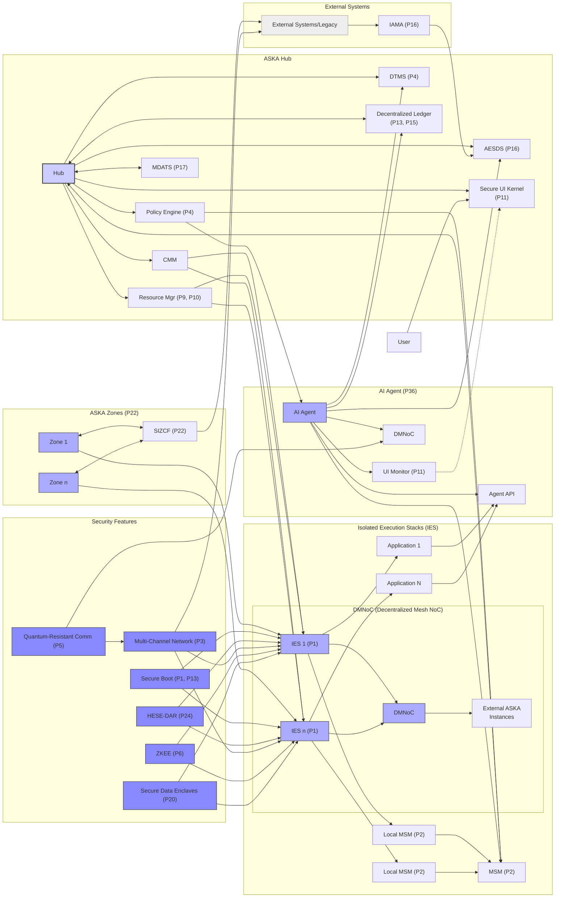
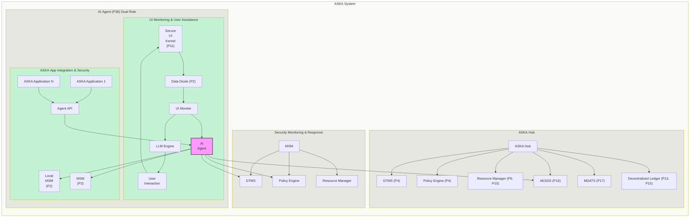
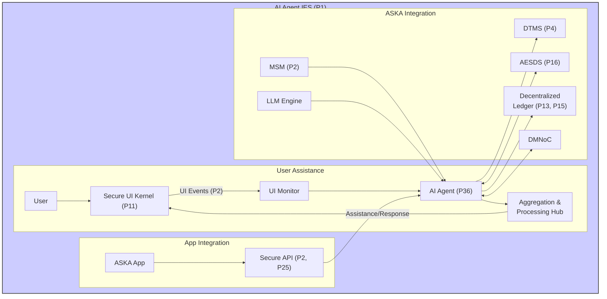

# ASKA 20241102 - Detailed Overview

Written by: Paul Lowndes <ZeroTrust@NSHkr.com>

## Table of Contents

- [Diagram 1 - ASKA Overview:](#diagram-1---securesphere-overview)
- [Diagram 1 Explanation:](#diagram-1-explanation)
- [ASKA Architecture: A Technical Deep Dive](#securesphere-architecture-a-technical-deep-dive)
  - [I. Internal Functions:](#i-internal-functions)
  - [II. Deeper Integration within ASKA:](#ii-deeper-integration-within-securesphere)
  - [III. Key Innovations and Advantages:](#iii-key-innovations-and-advantages)
- [Diagram 2 - ASKA Overview 2](#diagram-2---securesphere-overview-2)
- [Diagram 2 Description:](#diagram-2-description)
- [Diagram 3: AI Agent Dual Role](#diagram-3-ai-agent-dual-role)
  - [Diagram Description:](#diagram-description)
  - [I. User Assistance and UI Monitoring:](#i-user-assistance-and-ui-monitoring)
  - [II. ASKA Application Integration and Security:](#ii-securesphere-application-integration-and-security)
  - [III. Overall Security Contribution:](#iii-overall-security-contribution)
- [Diagram 4: AI Agent Interactions](#diagram-4-ai-agent-interactions)

---

### Diagram 1 - ASKA Overview: {#diagram-1---securesphere-overview}

### Diagram 1 Explanation: {#diagram-1-explanation}

*   **ASKA Hub:** The central management and coordination point. It includes:
    *   **Hub:** Orchestrates all other components.
    *   **DTMS (P4):** Manages dynamic trust.
    *   **AESDS (P16):** Handles secure software updates.
    *   **Policy Engine (P4):** Enforces security policies.
    *   **Resource Mgr (P9, P10):** Allocates resources.
    *   **CMM:** Configuration Management Module.
    *   **Secure UI Kernel (P11):** Provides secure user interface.
    *   **DLT (P13, P15) & MDATS (P17):** Secure logging and auditing.

*   **Isolated Execution Stacks (IES):** Shows multiple IES instances with their Local MSMs (Secondary Security Meshes), connected to the Master Security Mesh (MSM - Primary Security Mesh). Applications run within IES instances. The DMNoC provides secure, high-bandwidth connections between IES and external ASKA instances.

*   **AI Agent (P36):** The AI Agent, within its IES, focuses on user assistance via the UI Monitor and Secure UI Kernel (UIK). It also integrates with various security components and offers API access for applications.

*   **ASKA Zones (P22):** IES instances are organized into Zones, which can securely communicate with external systems via SIZCF.

*   **External Systems:** Illustrates interaction with external systems and legacy systems through IAMA.

*   **Security Features:** Highlights core ASKA security technologies, including Secure Boot, HESE-DAR, Multi-Channel Network (MCN), Quantum-Resistant Communication, ZKEE, and Secure Data Enclaves. These are foundational elements ensuring ASKA's robust security posture.

*   **Connections:** Shows key data flows and control relationships between components. The User interacts with the Secure UI Kernel (UIK). The CMM manages IES instances. The Policy Engine influences both the AI Agent and the MSM. The Resource Manager allocates resources to IES instances. The MSM provides feedback to the Hub.

This comprehensive diagram provides a high-level overview of ASKA, incorporating the key technologies and their interactions. The organization into subgraphs clarifies the different functional areas, while the consistent styling and clear labels ensure readability. This diagram should be an excellent starting point for anyone seeking to understand ASKA's architecture and its novel approach to secure computing. It provides a good balance of detail and conciseness, making it a valuable resource for documentation, presentations, and patent applications.

### ASKA Architecture: A Technical Deep Dive {#securesphere-architecture-a-technical-deep-dive}

The attached diagram provides a comprehensive overview of the ASKA architecture, highlighting its key components, their interactions, and the underlying security principles that drive its design. This writeup provides a detailed technical analysis of the architecture, starting with the internal functions of each component and then exploring their deeper integration within ASKA.

#### I. Internal Functions: {#i-internal-functions}

1.  **ASKA Hub:** The central control and management entity for the entire ASKA system.
    *   **Hub:** Orchestrates the operation of all other components, managing resource allocation, policy enforcement, and communication.
    *   **DTMS (Dynamic Trust Management System - P4):** Establishes and manages trust relationships between ASKA components, zones, and external entities. It dynamically calculates trust scores based on observed behavior, security posture, and predefined policies.
    *   **AESDS (Automated Evolutionary Software Development System - P16):** Continuously monitors, updates, and improves ASKA software components, including the AI Agent, operating system kernels, and security modules. It uses AI techniques to generate optimized and secure code, adapting to evolving threats and vulnerabilities.
    *   **Policy Engine (P4):** Defines and enforces security policies throughout the ASKA system. It interacts with the DTMS and Capability Manager to control access to resources, communication channels, and functionalities.
    *   **Resource Manager (P9, P10):** Dynamically allocates resources (CPU, memory, I/O, network bandwidth) to IES instances and other components based on workload demands, trust levels, and security policies. It employs predictive algorithms and multipath optimization for efficient resource utilization.
    *   **Configuration Management Module (CMM):** Manages system configurations, ensuring consistency and security. It validates configurations against policies and resolves conflicts.
    *   **Secure UI Kernel (P11):** Provides a secure and isolated user interface environment, protecting against UI-based attacks. It employs hardware isolation, multi-region display buffers with trust levels, and hardware-enforced Control-Flow Integrity (CFI).
    *   **Decentralized Ledger (DLT - P13, P15) & MDATS (Multi-Dimensional Audit Trail System - P17):** The DLT provides a tamper-proof, distributed log of all ASKA activities, enhancing transparency and accountability. MDATS correlates digital logs with physical microstructures for enhanced auditability.

2.  **Isolated Execution Stacks (IES - P1):** The foundation of ASKA's isolation and compartmentalization strategy.
    *   **IES Instances:** Each IES is a fully isolated hardware stack (CPU, memory, I/O, network) providing a secure execution environment for applications and processes.
    *   **Local MSM (Local Master Security Mesh - P2):** Monitors the activity within each IES instance, detecting anomalies and reporting them to the MSM. It leverages hardware-based monitoring for enhanced security.
    *   **Applications:** User-level programs run within IES instances, isolated from each other and the underlying system.
    *   **DMNoC (Decentralized Mesh Network on Chip):** Provides high-bandwidth, low-latency, secure communication between IES instances and external ASKA instances, forming a decentralized mesh network.

3.  **AI Agent (P36):** A dedicated, out-of-band component primarily for user assistance and secondarily for security augmentation.
    *   **AI Agent:** Provides context-aware help, personalized recommendations, and intelligent search to users. It also contributes to anomaly detection and threat intelligence analysis.
    *   **Agent API:** A secure, capability-controlled API enabling ASKA applications to access AI functionalities.
    *   **UI Monitor (P11):** Passively observes user interactions with the Secure UI Kernel, providing context to the AI Agent without allowing direct UI manipulation.

4.  **ASKA Zones (P22):** Logical groupings of IES instances, enabling collaboration and controlled interaction.
    *   **Zones:** Represent different security domains or administrative boundaries.
    *   **SIZCF (Secure Inter-Zone Collaboration Framework - P22):** Manages secure communication and data exchange between zones.

5.  **External Systems:** Represents systems outside the ASKA environment.
    *   **External Systems/Legacy:** These could include legacy systems, other secure enclaves, or the internet.
    *   **IAMA (Isomorphic Architecture Monitoring and Adaptation - P16):** Analyzes the behavior of connected legacy systems, predicting vulnerabilities and generating security patches for ASKA.

6.  **Security Features:** Foundational security technologies within ASKA.
    *   **Secure Boot (P1, P13):** Ensures that only authorized software is loaded during boot.
    *   **HESE-DAR (Hardware-Enforced Secure Encrypted Enclave for Data at Rest - P24):** Provides hardware-level encryption for data at rest.
    *   **Multi-Channel Network (MCN - P3):** Secure communication channels within ASKA.
    *   **Quantum-Resistant Communication (P5):** Secures communication against quantum computer attacks.
    *   **Zero-Knowledge Execution Environment (ZKEE - P6):** Enables computations on encrypted data.
    *   **Secure Data Enclaves (SDE - P20):** Provides secure environments for sensitive data processing.

#### II. Deeper Integration within ASKA: {#ii-deeper-integration-within-securesphere}

1.  **User Interaction Flow:** The User interacts with the Secure UI Kernel (UIK), which is monitored by the AI Agent's UI Monitor. This provides context for the AI Agent to offer personalized assistance. Application 1 and Application N, running within IES instances, can utilize the AI Agent API for enhanced features.

2.  **Security Monitoring and Response:** Local MSMs within each IES monitor local activity and report to the central MSM. The AI Agent, informed by the UI Monitor and integrated with the MSM and DTMS, contributes to anomaly detection and threat analysis. The Policy Engine, based on information from these components, enforces security policies.

3.  **Resource and Capability Management:** The Resource Manager allocates resources to IES instances. The CMM manages configurations, and the Policy Engine governs access control, all informed by DTMS trust levels. The AI Agent can influence resource allocation and policy decisions through its interactions with these components.

4.  **Secure Inter-Zone Communication:** Zones interact with each other and external systems through the SIZCF and the MCN, leveraging quantum-resistant communication where appropriate. The DMNoC provides additional secure communication channels between ASKA instances, enhancing resilience and supporting decentralized applications. IAMA analyzes external systems for vulnerabilities, informing AESDS, which updates ASKA components as needed.

5.  **Auditing and Logging:** All activities are logged on the Decentralized Ledger (DLT), providing a tamper-proof audit trail. MDATS enhances auditing by correlating digital logs with physical microstructures.

6.  **Security at Every Level:** ASKA integrates security features at every level. Secure Boot ensures a trusted starting point. HESE-DAR protects data at rest. The MCN, enhanced by quantum-resistant communication, secures internal communication. ZKEE and SDE provide secure environments for sensitive data processing.

#### III. Key Innovations and Advantages: {#iii-key-innovations-and-advantages}

*   **Decentralized Trust and Security:** The DTMS, combined with the decentralized mesh network and multi-agent AI, creates a distributed trust and security model, enhancing resilience and adaptability.
*   **AI-Driven Security and User Assistance:** The AI agent plays a dual role, improving both security and user experience. Its API accessibility opens new possibilities for application developers.
*   **Hardware-Rooted Security:** ASKA's use of hardware isolation (IES), secure boot, HESE-DAR, and 3D microstructures creates a strong, hardware-rooted security foundation.
*   **Comprehensive Auditing and Logging:** The DLT and MDATS provide a tamper-proof and auditable record of all ASKA activities, enhancing transparency and accountability.
*   **Scalability and Flexibility:** The modular architecture, decentralized mesh network, and dynamic resource management enable ASKA to scale to accommodate a growing number of devices, zones, and applications.

This detailed technical analysis demonstrates how ASKA's architecture integrates multiple innovative technologies and security principles to create a highly secure and adaptable computing environment. The system's multi-layered approach, decentralized design, and AI-driven capabilities provide robust protection against a wide range of threats while enhancing user experience and enabling new applications. This architecture represents a significant advancement in secure computing, offering a compelling solution for individuals and organizations seeking to protect their data and systems in an increasingly complex and interconnected world.

---

### Diagram 2 - ASKA Overview 2 {#diagram-2---securesphere-overview-2}

```mermaid
---
config:
  theme: default
  themeVariables:
    fontSize: 32px
---
graph
    subgraph SecSphSys["ASKA&nbsp;System"]
        subgraph SecI["Instance&nbsp;&nbsp;&nbsp;&nbsp;&nbsp;&nbsp;&nbsp;&nbsp;&nbsp;&nbsp;&nbsp;&nbsp;&nbsp;&nbsp;&nbsp;&nbsp;&nbsp;&nbsp;"]
            subgraph SH["ASKA&nbsp;Hub"]
                Hub_SH["ASKA Hub"] --> DTMS_SH & PolicyEngine_SH & AI_Agent_SH & AESDS_SH["AESDS (P16)"] & SecureUI_SH["Secure UI Kernel (P11)"]
            end
            direction LR
            subgraph IC["IES&nbsp;Cluster&nbsp;(P1)"]
                IES1_IC["IES 1"] --> App1_IC["Application 1"]
                IESn_IC["IES n"] --> AppN_IC["Application N"]
                IES1_IC -.- HESE_DAR_IC["HESE&#8209;DAR&nbsp;(P24)"]
                IESn_IC -.- HESE_DAR_IC
                IES1_IC --> LSM1_IC["Local&nbsp;MSM&nbsp;(P2)"]
                IESn_IC --> LSMn_IC["Local&nbsp;MSM&nbsp;(P2)"]
                LSM1_IC --> MSM_IC["MSM&nbsp;(P2)"]
                LSMn_IC --> MSM_IC
                IES1_IC -->|"Secure&nbsp;Memory<br>Access&nbsp;(P25)"| DMNoC_IC["DMNoC"]
                IESn_IC -->|"Secure&nbsp;Memory<br>Access&nbsp;(P25)"| DMNoC_IC
                IES1_IC -->|"Secure&nbsp;Channel<br>Access&nbsp;(P2,&nbsp;P3)"| MCN_IC["MCN (P3)"]
                IESn_IC -->|"Secure&nbsp;Channel<br>Access&nbsp;(P2,&nbsp;P3)"| MCN_IC
                subgraph DTaP["Dynamic&nbsp;Trust&nbsp;and&nbsp;Policy"]
                    DTMS_SH["DTMS (P4)"] <--> PolicyEngine_SH["Policy Engine (P4)"]
                    DTMS_SH --> CapMgr_DTaP["Capability Manager (P25)"]
                    PolicyEngine_SH --> CapMgr_DTaP
                    DTMS_SH <--> IES1_IC & IESn_IC & DMNoC_IC & MCN_IC
                    PolicyEngine_SH --> IES1_IC & IESn_IC & DMNoC_IC & MCN_IC
                end
                AI_Agent_SH["AI Agent (P36)"] -.-> DTaP & LSM1_IC & LSMn_IC & MSM_IC
            end
            subgraph DM["DMNoC&nbsp;(Decentralized&nbsp;Mesh)"]
                DMNoC_IC --> FC_Interface_DM["Fiber<br>Channel Interface"]
                FC_Interface_DM --> Ext_Mesh_DM["External<br>Mesh<br>Network<br>(Trusted)"]
                AttestationDMNOC_DM["Attestation<br>(3D<br>Microstructures)"] --> DMNoC_IC
            end
            subgraph MN["MCN&nbsp;(Multi&#8209;Channel&nbsp;Network)"]
                MCN_IC --> MCI_MN["Multi&#8209;Channel<br>Interface<br>(P28)"]
                MCI_MN --> Ext_Net_MN["External<br>Networks<br>(Internet)"]
                IAMA_MN["IAMA (P16)"] --> MCN_IC
                AttestationMCN_MN["Attestation<br>(3D<br>Microstructures)"] --> MCN_IC
            end
            AESDS_SH --> IES1_IC & IESn_IC & DMNoC_IC & MCN_IC
            SecureUI_SH --> IES1_IC & IESn_IC
            subgraph HR["Hardware&nbsp;Root&nbsp;of&nbsp;Trust"]
               HRoT_HR["Hardware<br>Root of Trust"] --> Hub_SH & DMNoC_IC & MCN_IC & IC & SecureUI_SH
            end
            MDATS_SecI["MDATS<br>(P17)"] --> DLT_SecI["Decentralized&nbsp;Ledger (P13,&nbsp;P15)"]
            HRoT_HR --> DLT_SecI
            AttestationDMNOC_DM --> DLT_SecI
            AttestationMCN_MN --> DLT_SecI
            DLT_SecI -.-> Hub_SH & DMNoC_IC & MCN_IC & IC
            subgraph KM["Key&nbsp;Management"]
                KeyManager_KM["Key Manager"] --> KeyStorage_KM["Key Storage"]
            end
        end
        subgraph External_Mesh_Sub["External&nbsp;Mesh"]
            direction LR
            ExtZoneA_EM["ASKA&nbsp;Zone&nbsp;A"] <--> ExtZoneB_EM["ASKA&nbsp;Zone&nbsp;B"]
        end
        subgraph External_Networks_Sub["External&nbsp;Networks"]
            Untrusted_EN["Untrusted&nbsp;Network"]
            Trusted_EN["Trusted&nbsp;Network"]
        end
    end

    classDef dm fill:#ccf,stroke:#333
    classDef mcn fill:#aaf,stroke:#333
    classDef external fill:#eee,stroke:#999
    class DMNoC_IC,FC_Interface_DM,External_Mesh_Sub dm
    class MCN_IC,MCI_MN,External_Networks_Sub mcn
    class External_Networks_Sub external
    classDef main fill:#fafaf7
    class SecSphSys,SH,IC,KM,DM,MN,HR main
    classDef main2 fill:#e7e7e2
    class SecI main2
    classDef main3 fill:#c4f3d3
    class DTaP main3
```

### Diagram 2 Description: {#diagram-2-description}

This diagram presents a comprehensive overview of the ASKA architecture, highlighting its key technologies and their interactions. It emphasizes the system's modularity, security features, and adaptability.

**ASKA System:** This top-level subgraph encapsulates all components of a ASKA instance and its connections to external entities.

**ASKA Instance (Local):** Contains the core components that make up an individual ASKA instance.

**IES Cluster (P1):** The foundation of ASKA's isolation, featuring multiple IES instances running different applications and interacting with core components. It shows the connections to the DMNoC, MCN, HESE-DAR, LSMs (which in turn connect to the MSM), the DTMS, the Policy Engine and the AI Agent.

**DMNoC (Decentralized Mesh):** Provides a secure and high-bandwidth mesh network for inter-IES communication and connections to trusted external networks. Its components, Fiber Channel Interface, External Mesh Network connections, and Attestation mechanisms (using 3D Microstructures) are clearly shown.

**MCN (Multi-Channel Network)**: Provides secure channels for connecting to external networks (Internet, trusted networks). It shows connections to the Multi-Channel Interface (and its components such as the various Secure Channels and Firewalls), External Networks, and IAMA (Isomorphic Architecture Monitoring and Adaptation), as well as its own hardware attestation using 3D microstructures.

**ASKA Hub:** The central management and control entity for the local instance, encompassing the DTMS, Policy Engine, AI Agent, AESDS, and Secure UI Kernel. The Hub's connections to these components and the IES cluster illustrate its central role in orchestrating the ASKA instance and enforcing policies. It also receives reports from the MSM and manages the system's key management functionalities.

**Dynamic Trust and Policy:** This subgraph details the core of ASKA's dynamic security, including the DTMS, Policy Engine, and Capability Manager, showing their bidirectional communications. The dotted lines represent how trust levels and policies influence the IES Cluster, the DMNoC, and the MCN.

**AI Agent (P36):** Plays a key role in monitoring, analyzing, adapting, and reporting on all aspects of security, including both hardware and software components and across all network communications, using existing security mechanisms and protocols within ASKA such as those from P2, P7, P15 and interacting with the UI through appropriate secure mechanisms. It provides recommendations and influences policy updates across ASKA.

**AESDS (P16):** This crucial system is shown managing updates across the IES Cluster, the DMNoC, and the MCN, ensuring these remain secure and up to date with fixes and policy changes from the Hub and AI agent. It also performs internal tests for verification on any updates and changes before they can become active in the system.

**Secure UI Kernel:** Provides a secure interface for user interaction, connecting directly to the IES cluster for authorized access, and indirectly to the Hub which mediates and handles requests from the user and relays those securely between these after validation. It manages trust levels of UI elements, providing an additional layer of security and enhancing user trust by displaying relevant attestations and security-related information in the user interface, if desired. It uses authenticated pathways to communicate with the Hub and its other components.

**Hardware Root of Trust (HRoT):** This is a critical component, forming the basis of trust for ASKA. It provides attestation, key generation, and validation services to all other modules in the system, including those in the Hub, both DMNoC and MCN networks, and IES instances, and to any external or user interface (UI) element. Its connection to MDATS and the Decentralized Ledger emphasizes its role in creating tamper-proof, auditable records of all system actions and security events, providing high assurance of integrity. It also helps generate and manage cryptographic keys needed for communication using ASKA protocols and algorithms across networks, while additionally supporting those from other systems such as from trusted third parties, leveraging existing mechanisms where possible in those environments where higher performance or lower cost a greater concern than achieving absolute security at all layers. This ensures that our system’s dynamic adaptability does not become a limitation when deployed using different configurations.

**External Connections:**

**External Mesh Network (Trusted):** This subgraph shows how different ASKA Zones or instances connect and exchange information securely, leveraging the capabilities of the DMNoC and its Fiber Channel Interface for high-bandwidth, long-distance communication in a high-trust environment.

**External Networks:** This subgraph shows the two-way connection to various external networks, categorized into trusted and untrusted, via the Multi-Channel Network and its Multi-Channel Interface (P28). IAMA is shown monitoring and managing this interface, ensuring secure and protected communications between ASKA and the outside world, whether via the Internet, dedicated government or corporate networks, or other systems.

**Key Features and Technologies:**

**Hardware-Rooted Trust (P1, P13, P33):** Secure Boot, attestation mechanisms using 3D Microstructures, and the integration of a hardware root of trust are fundamental aspects of ASKA's security model.

**Isolated Execution Stacks (P1):** The IES cluster provides hardware-enforced isolation, dynamically adjustable, and with hierarchical zones and mini-TRCs for fine-grained security and data protection.

**Dynamic Trust Management (P4):** The DTMS manages trust relationships dynamically, influenced by real-time security assessments and user behavior, influencing access control decisions, data flow restriction using hardware such as data diodes, and enabling dynamic allocation of system and network resources, while generating auditable records for these and other security-related events on a decentralized ledger.

**Secure Communication Channels (P2, P3):** ASKA uses data diodes for unidirectional communication where necessary, especially to protect critical system components and data stores. The Multi-Channel Network provides physically segregated channels with quantum-resistant communication, dynamically adjusted based on trust levels and security zones.

**AI-Driven Security (P2, P7, P36):** The Security Mesh and Anomaly Detector actively monitor system behavior, including at the NoC level, and employ AI/ML for anomaly detection. The AI Agent interacts with all components, coordinating security responses and providing adaptive security mechanisms, including dynamic trust adjustments and policy updates for access controls and resource allocations, while maintaining secureSphere’s core trust and security principles.

**Capability-Based Access Control (P25, P26):** ASKA utilizes capabilities for fine-grained access control, managing permissions for communication and resource access dynamically through the Capability Manager and integrating capabilities directly into PCFS for efficient enforcement. This dynamic, decentralized management of capabilities enhances security, flexibility, and responsiveness.

**Data Encryption (P5, P24):** ASKA employs encryption for data at rest (HESE-DAR) and in transit (quantum-resistant communication), leveraging post-quantum cryptography for long-term security and secure key management.

**Auditing and Accountability (P13, P15, P17):** The Decentralized Ledger and Multi-Dimensional Audit Trail System provide tamper-evident records of all actions, ensuring transparency and accountability. 3D microstructures create a physical audit trail, further enhancing security. All events throughout ASKA, including key management operations and security policy adjustments, are logged and correlated to provide verifiable provenance tracking.

ASKA represents a fundamental shift in secure computing architecture, addressing the limitations of traditional systems and providing a robust, adaptable, and trustworthy platform for future applications, especially for those requiring high security or that must function reliably even when operating in untrusted or potentially hostile environments, whether for embedded systems or across distributed cloud networks. The diagram's focus on these key technologies emphasizes its value proposition and facilitates better understanding by clearly conveying those novel aspects which strengthen its claims of providing a truly revolutionary approach by leveraging, integrating and enhancing current state-of-the-art techniques while introducing new security enhancements that solve many previously unsolved problems in a manner that’s uniquely possible only by combining those specific architectural designs and mechanisms of our multi-kernel design, from dynamically adaptive hardware to integrated software and AI-driven system and network resource management and using multiple independent but complementary methods for verification and validation at multiple levels across ASKA and its various components.

---

### Diagram 3: AI Agent Dual Role {#diagram-3-ai-agent-dual-role}

#### Diagram Description: {#diagram-description}

This diagram illustrates the dual roles of the ASKA AI Agent (P36): user assistance and ASKA application integration, and security monitoring and response.

**1. User Assistance and UI Monitoring:**

*   The Secure UI Kernel (P11) is monitored unidirectionally via a Data Diode (P2) by the UI Monitor. This prevents the AI Agent from directly manipulating the UI.
*   The UI Monitor sends sanitized data to the AI Agent’s LLM Engine.
*   The LLM Engine processes this data and provides assistance to the user via User Interaction.
*   The User Interaction feeds back into the Secure UI, creating a closed loop for user assistance.

**2. ASKA Application Integration and Security:**

*   The Agent API provides a programmatic interface for ASKA applications (App1, AppN) to interact with the AI Agent.
*   The AI Agent leverages its ASKA integrations (accessing data from DTMS, Policy Engine, AESDS, and the Decentralized Ledger) for contextualized security analysis.
*   The AI Agent provides recommendations or takes direct action through interactions with the local and Master Security Meshes (LSM, MSM - P2).

**3. Security Monitoring and Response:**

*   The MSM aggregates security events and alerts, which may trigger actions from the AI Agent. This is shown implicitly.
*   The AI Agent's security recommendations influence DTMS (P4) trust levels, policy updates (P4), and resource allocation (P9, P10).

**Key Features:**

*   **Dual Role:** Clearly shows the AI Agent's two distinct functions.
*   **Unidirectional UI Monitoring:** Highlights the security of the UI monitoring mechanism.
*   **Secure API:** Illustrates the programmatic interface for ASKA application integration.
*   **ASKA Integration:** Shows the AI Agent's connections to ASKA’s core components.
*   **Security Feedback Loop:** Shows the AI Agent's influence on the security monitoring and response system.

This simplified diagram effectively communicates the AI Agent's dual functionality and its crucial role within the ASKA ecosystem. It emphasizes the security considerations inherent in both user assistance and application integration. The separation of the user assistance and security functions into separate subgraphs provides a clear view of each role and helps to demonstrate the system's value proposition. The use of color and clear labels further enhances understanding.

The ASKA AI Agent (P36) is a central component, playing a dual role: providing secure, out-of-band assistance to users and enhancing ASKA's overall security posture. The diagram illustrates these interwoven functions:

#### I. User Assistance and UI Monitoring: {#i-user-assistance-and-ui-monitoring}

This section of the diagram details how the AI Agent assists users via the Secure UI while maintaining stringent security:

A.  **Unidirectional UI Monitoring:** User interactions with the Secure UI Kernel (P11) are passively observed by a UI Monitoring Module. This module employs a data diode (P2) to ensure unidirectional data flow from the UI to the AI Agent, preventing the AI Agent from directly manipulating the UI or introducing vulnerabilities via the user interface. This unidirectional data flow is crucial for protecting the integrity and security of the ASKA system from the UI.

B.  **Data Sanitization and Filtering:** Before being processed by the AI Agent, the UI interaction data collected by the UI Monitoring Module is passed through a data sanitization and filtering module. This module removes potentially malicious or sensitive information, protecting both user privacy and system security from potentially compromised or malicious user input or actions. This sanitization process removes potentially hazardous elements, ensuring that the AI Agent receives only safe and relevant data. This process likely uses AI techniques to identify potentially malicious or problematic code or other elements and securely remove it from the UI data before delivering it to the AI Agent.

C.  **LLM Engine Processing:** The sanitized UI interaction data is then processed by the AI Agent's local Large Language Model (LLM) Engine (residing within a secure, isolated IES - P1). The LLM Engine leverages its knowledge base (including ASKA-specific information, API documentation, security best practices, and contextual understanding from previous interactions) to analyze the data, identify relevant patterns, and generate insights, recommendations, or actions. This ensures the AI Agent’s actions and responses are relevant, consistent, secure, and aligned with user intent.

D.  **User Interaction:** The AI Agent's responses or recommendations are communicated back to the user via the Secure UI, enabling an interactive and collaborative experience. This feedback loop provides ongoing refinement and contextual awareness for the AI Agent. The design ensures that the user interaction remains secure and cannot be used as a point of compromise for the system.

E.  **Security Monitoring:** The UI Monitoring Module also feeds security-relevant information (such as keystrokes, mouse movements, and time spent on certain UI elements) to the AI Agent’s security subsystem which integrates into ASKA’s security mechanisms, creating a continuous monitoring and threat assessment pathway that leverages user context.

#### II. ASKA Application Integration and Security: {#ii-securesphere-application-integration-and-security}

This section shows how the AI Agent enhances ASKA's security posture by providing support for ASKA applications:

A.  **Agent API:** A secure Application Programming Interface (API) allows ASKA applications (App1, AppN) to request assistance or specialized functionalities from the AI Agent. This provides developers with a powerful tool to enhance their applications with AI-driven capabilities. This secure API is implemented within the isolated IES of the AI Agent, enhancing its security and preventing unauthorized access to the AI Agent’s capabilities.

B.  **ASKA Integration Modules:** The AI Agent integrates with other ASKA components through several specialized modules:

*   **DTMS Integration Module:** Receives trust information (P4) and policy updates from the DTMS. The agent adapts its behavior based on trust levels, dynamically adjusting its recommendations and actions based on the security context. This continuous integration with DTMS ensures that the AI Agent's operations remain aligned with ASKA's overall security policies.
*   **MSM Integration Module:** Receives security alerts (P2) and anomaly reports from the MSM (Master Security Mesh). The agent leverages this telemetry to improve its threat assessment. It uses the information to identify potential risks and generate security recommendations.
*   **AESDS Integration Module:** Receives software updates (P16) and security patches from the AESDS (Automated Evolutionary Software Development System). This guarantees the AI Agent’s software integrity and prevents the deployment of malicious or compromised code.
*   **DLT Integration Module:** Logs all of the AI Agent’s activity and API interactions to the Decentralized Ledger (P13, P15) for auditing and transparency. This creates a comprehensive and tamper-evident audit trail of the AI Agent's actions, contributing to system accountability.

C.  **Security Recommendations and Actions:** Based on its analysis of UI events, application requests, and ASKA telemetry, the AI Agent provides security recommendations or takes direct actions:

*   **Recommendations:** The AI Agent may suggest security policy adjustments (to the Policy Engine), resource reallocations (to the Resource Manager), or software updates (to the AESDS).
*   **Direct Actions:** In some cases (based on defined parameters and thresholds), the AI Agent might directly trigger security actions, such as isolating a compromised component (via the Isolator - P7), initiating self-healing procedures (via the Self-Healer - P7), or triggering alerts (via the Alert System - P7). This dynamic capability enhances ASKA's ability to respond effectively to real-time threats.

#### III. Overall Security Contribution: {#iii-overall-security-contribution}

The AI Agent significantly enhances ASKA's security posture in the following ways:

A.  **Proactive Threat Detection:** The AI Agent's continuous monitoring of both user interactions and system events allows for the proactive identification of potential threats or anomalies. The agent leverages its LLM engine and its ASKA integrations to improve threat detection, providing early warnings of attacks or vulnerabilities, and enabling timely interventions.

B.  **Adaptive Security:** The AI Agent’s ability to dynamically adjust its recommendations and actions based on real-time context (from DTMS and MSM) enables adaptive security. This dynamic adaptability ensures ASKA’s protection against evolving threats and vulnerabilities.

C.  **Reduced Human Intervention:** The AI Agent's automated threat detection and response mechanisms reduce the need for constant human intervention, allowing security teams to focus on more strategic tasks, such as incident response and security policy adjustments. This automated response capability enhances the system's efficiency and resilience.

D.  **Improved Accuracy:** The AI Agent continuously learns from new data, refining its models and improving its detection accuracy over time. The combination of passive UI monitoring, analysis of application behavior, and system-wide telemetry gives the AI Agent comprehensive insights into the system’s security posture.

E.  **Tamper-Evident Auditing:** The AI Agent logs all actions to the Decentralized Ledger (P13,P15), creating a transparent and auditable record that integrates with MDATS (P17). This ensures accountability and helps in identifying and investigating incidents. Further, 3D microstructures can enhance the tamper-evidence of critical AI Agent actions.

In summary, the ASKA AI Agent operates as a vital, secure, out-of-band system, providing both user assistance and enhancing ASKA's security. Its dual role, combined with its integration with ASKA’s core security mechanisms and its dynamic adaptability, creates a powerful and innovative approach to security in a multi-kernel, decentralized environment. It reduces the trusted computing base (TCB) by offloading complex security decisions to the AI Agent while maintaining rigorous auditing and control. The comprehensive and tamper-evident audit trails generated by the agent are fundamental to building trust in the system’s operation and security.

---

### Diagram 4: AI Agent Interactions {#diagram-4-ai-agent-interactions}

